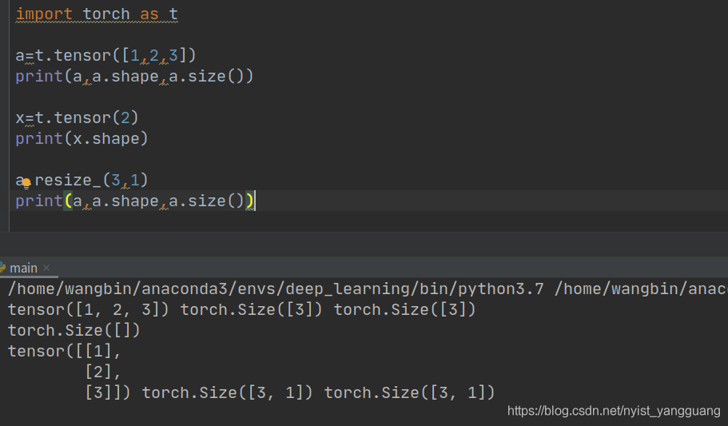
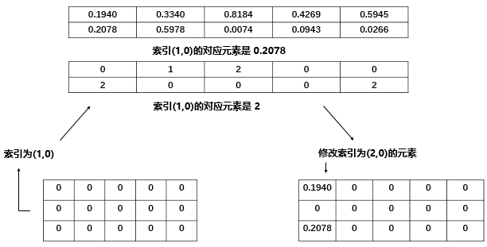
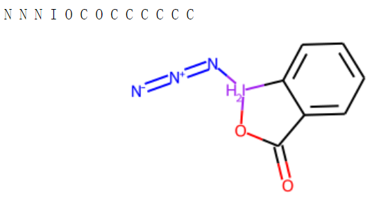
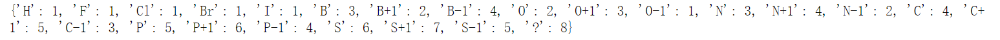
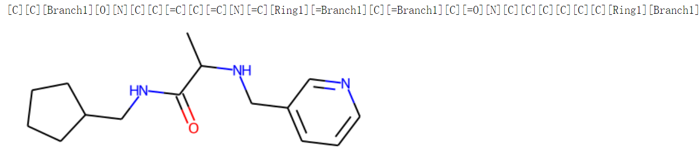
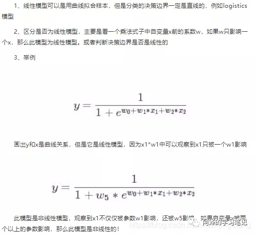

Pytorch
===

[PyTorch的使用](https://zhuanlan.zhihu.com/p/369496930)

[PyTorch中文文档](https://pytorch-cn.readthedocs.io/zh/latest/)

数、数组、矩阵(向量也是矩阵)的区别
---

数：[torch](https://so.csdn.net/so/search?q=torch&spm=1001.2101.3001.7020).size([ ]) 

数组： torch.size([个数])

矩阵（向量）：torch.size([行数，列数])



矩阵乘法运算
---

### broadcast机制

> 指在两个不同shape的张量的矩阵运算中，小的tensor会扩展到跟大的tensor一致的shape

两个Tensors只有在下列情况下下才能进行broadcast操作：

- 每个tensor至少有一维
- 遍历所有的维度，从尾部维度开始，**每个对应的维度大小要么相同，要么其中一个是1，要么其中一个不存在**

两个矩阵broadcast之后的结果**每一维都是两个矩阵中对应维度的最大值**，**如果维数不一致则在前面加一补齐**。


```python
#按照尾部对齐
x=torch.empty(5,3,4,1)
y=torch.empty( 3,1,1)
 
#1st尾部维度：都为1
#2nd尾部维度：y为1，“要么其中一个是1”
#3rd尾部维度：都为3
#4th尾部维度：y不不在，“要么有一个不存在”
#综上，x和y是可以broadcasting的

#x=>（5,3,4,1）
#y=>（1,3,1,1）
#broadcast之后（5,3,4,1）

#但是
x=torch.empty(5,2,4,1)
y=torch.empty(  3,1,1)
 
# 1st尾部维度：都为1
# 2nd尾部维度：y为1，“要么其中一个是1”
# 3rd尾部维度：x为2，y为3，不符合broadcasting要求！
```

### torch.mm()

> 二维矩阵乘法
>
> `torch.mm(mat1, mat2, out=None)`


### torch.bmm()

> `torch.bmm(bmat1, bmat2, out=None)`


### torch.matmul()

> 多维矩阵操作,支持broadcast操作
>
> `torch.matmul(input, other, out=None)`

### 

### '@'运算符

> @运算符作用类似于`torch.matmul()`，即叉（×）乘

### torch.mul()

>  **矩阵逐元素(Element-wise)乘法**，即点（·）乘，`torch.mul(mat1, other, out=None)`
>
> 两个矩阵shape相同，则对应元素相乘，元素不同则进行broadcast

其中 other 乘数可以是标量，也可以是任意维度的矩阵， 只要满足最终相乘是可以broadcast的即可

### '*'运算符

> ##### '*'作用等价于`torch.mul()`

### torch.mv()


### torch.cat()

> **连接给定维数的序列张量。**所有张量要么**具有相同的形状**(连接维度除外)，要么为空。

```python
t = torch.randn(2, 3)
t1 = torch.randn(2, 3)
print(t)
print(t1)
y=torch.cat((t, t1), 0)
print(y)
z=torch.cat((t, t1), 1)
print(z)
```


### [None , …],[… , None]

[None, …]表示在原始维度**前**补一维，维数为1

[… , None ]表示在原始维度**后**补一维，维数为1

```python
x = torch.tensor([1, 2, 3])
x,x.shape
>>>tensor([1, 2, 3]), torch.Size([3])

x = torch.tensor([1, 2, 3])[None, ...] 
x,x.shape
>>>tensor([[1, 2, 3]])
	 torch.Size([1, 3])

x1=torch.tensor([1, 2, 3])[...,None]
x1,x1.shape
>>>tensor([[1],
        	 [2],
           [3]])
torch.Size([3, 1])
```

```python
y=torch.tensor([[1,2,3],[4,5,6]])
y,y.shape
>>>tensor([[1, 2, 3],[4, 5, 6]]),torch.Size([2, 3])

y2=torch.tensor([[1,2,3],[4,5,6]])[None, ...] 
y2,y2.shape
>>>tensor([[[1, 2, 3],[4, 5, 6]]]),torch.Size([1, 2, 3])

y3=torch.tensor([[1,2,3],[4,5,6]])[...,None] 
y3,y3.shape
>>>tensor([[[1],
         		[2],
         		[3]],
        	 [[4],
            [5],
            [6]]]),torch.Size([2, 3, 1])
```

torch.Tensor
---


- dtype：张量的数据类型，如 torch.FloatTensor，torch.cuda.FloatTensor，用的最多的一般是 float32 和 int64(torch.long)
- shape：张量的形状，如 (64, 3, 224, 224)
- device：张量所在的设备，GPU/CPU，张量放在 GPU 上才能使用加速。

1. data：被包装的 Tensor；
2. grad：data 的梯度；
3. grad_fn：fn 表示 function 的意思，记录我么创建的创建张量时用到的方法，比如说加法、乘法，这个操作在求导过程需要用到，Tensor 的 Function，是自动求导的关键；
4. requires_grad：指示是否需要梯度，有的不需要梯度；
5. is_leaf：指示是否是叶子节点（张量）；

### 张量中表示正负无穷

float("Inf")或float("INF")表示为正无穷
float("-Inf")或float("-INF")表示负无穷

### 张量中的元素获取

> 类似于numpy，或者python中的list等，通过索引、切片获取张量中的元素，或者改变相应的值。索引出来的结果与原数据共享内存。Pytorch还提供了其他的高级选择函数

#### index_select

- 

> `torch.index_select`(*input*, *dim*, *index*, ***, *out=None*) → [Tensor](https://pytorch.org/docs/stable/tensors.html#torch.Tensor)

```python
x = torch.randn(3, 4)
>>x
tensor([[ 0.1427,  0.0231, -0.5414, -1.0009],
        [-0.4664,  0.2647, -0.1228, -1.1068],
        [-1.1734, -0.6571,  0.7230, -0.6004]])
indices = torch.tensor([0, 2])
>>torch.index_select(x, 0, indices)#dim=0,从行的维度选取
tensor([[ 0.1427,  0.0231, -0.5414, -1.0009],
        [-1.1734, -0.6571,  0.7230, -0.6004]])
>>torch.index_select(x, 1, indices)#dim=1,从列的维度选取
tensor([[ 0.1427, -0.5414],
        [-0.4664, -0.1228],
        [-1.1734,  0.7230]])
```

#### masked_select()

> `torch.masked_select`(*input*, *mask*, ***, *out=None*) → [Tensor](https://pytorch.org/docs/stable/tensors.html#torch.Tensor)

```python
>>> x = torch.randn(3, 4)
>>> x
tensor([[ 0.3552, -2.3825, -0.8297,  0.3477],
        [-1.2035,  1.2252,  0.5002,  0.6248],
        [ 0.1307, -2.0608,  0.1244,  2.0139]])
>>> mask = x.ge(0.5)
>>> mask
tensor([[False, False, False, False],
        [False, True, True, True],
        [False, False, False, True]])
>>> torch.masked_select(x, mask)
tensor([ 1.2252,  0.5002,  0.6248,  2.0139])
```

#### troch.tensor.size()

```python
import torch
x = torch.tensor([20], dtype=torch.long)[None,...].repeat(10, 2)
print(x)
x.size(1) #返回列的维度
x.size(0) #返回行的维度
```


### 张量数学运算

#### torch.add()

> torch.add(input, alpha=1, other, out=None)
>
> 逐元素计算input+alpha * other,alpha，叫做乘项因子,类似于权重
>
> other可以时候一个矩阵，也可以是一个数

```
y = wx + b
torch.add(b, w, x)
```

#### torch.addcdiv()

> torch.addcdiv(input, value=1, tensor1, tensor2, out=None)


torch.addcmul()

> torch.addcmul(input, value=1, tensor1, tensor2, out=None)


### 张量操作

```python
x = torch.rand(3,5)
print(x)
x1=x[:, [-1]]#返回最后一列的张量
x2=x[:, -1]#将每一列最后一个元素合并为一个一维向量
print(x1)
print(x1.shape)
print(x2)
print(x2.shape)

```


#### '<'or'>'运算

```python
out = torch.rand(3,5)
print(out)
last_column=out[:, [-1]] #out的最后一列
print(last_column)
t=out < last_column #返回一个bool矩阵
print(t)
out[t] = -float('Inf')  #会将True位置的元素替换掉
out
```


### 自动求导机制

#### torch.autograd.backward()

> `Pytorch` 自动求导机制使用的是 `torch.autograd.backward` 方法，功能就是自动求取梯度。当执行`y.backward()`这个函数时就是调用这个函数。

```python
torch.autograd.backward(tensors, 
grad_tensors=None, 
retain_graph=None,
create_graph=False, 
grad_variables=None, 
inputs=None)
```


- tensors 表示用于求导的张量，如 loss。
- retain_graph 表示保存计算图， 由于 Pytorch 采用了动态图机制，在每一次反向传播结束之后，计算图都会被释放掉。如果我们不想被释放，就要设置这个参数为 True
- create_graph 表示创建导数计算图，用于高阶求导。
- `grad_tensors` 表示多梯度权重。如果有多个 loss 需要计算梯度的时候，就要设置这些 loss 的权重比例。

```python
w=torch.tensor([1.0],requires_grad=True)
x=torch.tensor([2.0],requires_grad=True)
a=torch.add(w,x)
b=torch.add(w,1)
y0=torch.mul(a,b)
y1=torch.add(a,b)
loss=torch.cat([y0,y1],dim=0)
loss.backward()
>>> RuntimeError: grad can be implicitly created only for scalar outputs

grad_tensors = torch.tensor([1., 1.])
loss.backward(gradient=grad_tensors)    
print(w.grad)   #  这时候会是tensor([7.])   5+2

grad_tensors = torch.tensor([1., 2.])
loss.backward(gradient=grad_tensors)    
print(w.grad)   #  这时候会是tensor([9.])   5+2*2  

```

#### torch.autograd.grad()

> 这个方法的功能是求取梯度，这个可以实现高阶的求导。
>
> `torch.autograd`.`grad`(*outputs*, *inputs*, *grad_outputs=None*, *retain_graph=None*, *create_graph=False*, *only_inputs=True*, *allow_unused=False*)

- outputs: 用于求导的张量，如 loss
- inputs: 需要梯度的张量，如上面例子的 w
- create_graph: 创建导数计算图，用于高阶求导
- retain_graph: 保存计算图
- grad_outputs: 多梯度权重

```python
x = torch.tensor([3.], requires_grad=True)
y = torch.pow(x, 2)   # y=x^2

# 一次求导
grad_1 = torch.autograd.grad(y, x, create_graph=True)   
# 这里必须创建导数的计算图， grad_1 = dy/dx = 2x
print(grad_1)   # (tensor([6.], grad_fn=<MulBackward0>),) 这是个元组，二次求导的时候我们需要第一部分

# 二次求导
grad_2 = torch.autograd.grad(grad_1[0], x)    # grad_2 = d(dy/dx) /dx = 2
print(grad_2)  # (tensor([2.]),)
```

> 这个函数还允许对多个自变量求导数：

```python
x1 = torch.tensor(1.0,requires_grad = True) *# x需要被求导*
x2 = torch.tensor(2.0,requires_grad = True)
y1 = x1*x2
y2 = x1+x2
*# 允许同时对多个自变量求导数*
(dy1_dx1,dy1_dx2) = torch.autograd.grad(outputs=y1,inputs = [x1,x2],retain_graph = True)
#dy1_dx1=x2,dy1_dx2=x1
print(dy1_dx1,dy1_dx2)    *# tensor(2.) tensor(1.)*

*# 如果有多个因变量，相当于把多个因变量的梯度结果求和*
#dy12_dx1=dy1_dx1+dy1_dx2=x2+x1
#dy12_dx2=dy2_dx1+dy2_dx2=1+1
(dy12_dx1,dy12_dx2) = torch.autograd.grad(outputs=[y1,y2],inputs = [x1,x2])
print(dy12_dx1,dy12_dx2)    *# tensor(3.) tensor(2.)*
```

`关于 Pytorch 的自动求导系统要注意：`

> 1.梯度不自动清零：就是每一次反向传播，梯度都会叠加上去,需要我们手动清零

```python
w = torch.tensor([1.], requires_grad=True)
x = torch.tensor([2.], requires_grad=True)
for i in range(4):
    a = torch.add(w, x)
    b = torch.add(w, 1)
    y = torch.mul(a, b)

    y.backward()
    print(w.grad)
    
## 结果：
tensor([5.])
tensor([10.])
tensor([15.])
tensor([20.])
```

> 手动清除梯度

```python
w.grad.zero_() #w是要清0的张量
#这里有个'_'，这个代表原位操作
```

`原位操作(in—place)：`这个操作就是在原始内存当中去改变这个数据

```python
a = torch.ones((1,))
print(id(a), a)    # 1407221517192 tensor([1.])

# 我们执行普通的a = a+1操作
a = a + torch.ones((1,))
print(id(a), a)    # 1407509388808 tensor([2.])  
# 会发现上面这两个a并不是同一个内存空间

# 那么执行原位操作呢？
a = torch.ones((1,))
print(id(a), a)    # 2112218352520 tensor([1.])
a += torch.ones((1,))
print(id(a), a)   # 2112218352520 tensor([2.])
```

> 2.叶子节点不可执行 in-place操作

> 3.依赖于叶子节点的节点，requires_grad 默认为 True


依赖于叶子节点的节点，在上面图中w,x是叶子节点，而依赖于叶子节点的节点，其实这里说的就是 a,b， 也就是 a，b 默认就是需要计算梯度的。这个也好理解，因为计算 w,x 的梯度的时候是需要先对 a, b 进行求导的，要用到 a, b 的梯度，所以这里直接默认 a, b 是需要计算梯度的。

```python
w = torch.tensor([1.], requires_grad=True)
x = torch.tensor([2.], requires_grad=True)
a = torch.add(w, x)
b = torch.add(w, 1)
y = torch.mul(a, b)    # y0=(x+w) * (w+1)     dy0 / dw = 5
print(w.requires_grad, a.requires_grad, b.requires_grad)  
# 这里会都是True， w的我们设置了True， 而后面这里是依赖于叶子，所以默认是True
```

### 常用函数

#### torch.scatter()

> **`scatter()`** 和 **`scatter_()`** 的作用是一样的，只不过 `scatter()` 不会直接修改原来的 Tensor，而 `scatter_()` 会
>
> PyTorch 中，一般函数加**下划线**代表直接在原来的 Tensor 上修改
>
> `scatter(dim, index, src)`用src这个张量或标量修改调用scatter这个函数的张量

- **dim：**沿着哪个维度进行索引
- **index：**用来 scatter 的元素索引
- **src：**用来 scatter 的源元素，可以是一个标量或一个张量

```python
x = torch.rand(2, 5)

#tensor([[0.1940, 0.3340, 0.8184, 0.4269, 0.5945],
#        [0.2078, 0.5978, 0.0074, 0.0943, 0.0266]])

torch.zeros(3, 5).scatter_(0, torch.tensor([[0, 1, 2, 0, 0], [2, 0, 0, 1, 2]]), x)

#tensor([[0.1940, 0.5978, 0.0074, 0.4269, 0.5945],
#        [0.0000, 0.3340, 0.0000, 0.0943, 0.0000],
#        [0.2078, 0.0000, 0.8184, 0.0000, 0.0266]])
```



#### torch.squeeze()

> **`「torch.squeeze(input, dim=None, out=None)：`压缩长度为 1 的维度， `dim` 若为 None，移除所有长度为 1 的轴，若指定维度，当且仅当该轴长度为 1 时可以被移除」**

```python
# torch.squeeze
t = torch.rand((1, 2, 3, 1))
t_sq = torch.squeeze(t)
t_0 = torch.squeeze(t, dim=0)
t_1 = torch.squeeze(t, dim=1)
print(t.shape)        # torch.Size([1, 2, 3, 1])
print(t_sq.shape)     # torch.Size([2, 3])
print(t_0.shape)     # torch.Size([2, 3, 1])
print(t_1.shape)     # torch.Size([1, 2, 3, 1])
```

#### torch.unsqueeze()

> `「torch.unsqueeze(input, dim, out=None)：`依据 dim 扩展维度」

```python
tensor=torch.rand(1,3)
print(tensor)
print(tensor.shape)
tensor.unsqueeze_(dim=1)
print(tensor)
print(tensor.shape)
>>>
tensor([[0.3009, 0.4988, 0.0346]])
torch.Size([1, 3])
tensor([[[0.3009, 0.4988, 0.0346]]])
torch.Size([1, 1, 3])

tensor1=torch.tensor([0, 2, 1, 3])
print(tensor1)
print(tensor1.shape)
tensor1.unsqueeze_(dim=1)
print(tensor)
print(tensor1.shape)
>>>
tensor([0, 2, 1, 3])
torch.Size([4])
tensor([[0],
        [2],
        [1],
        [3]])
torch.Size([4, 1])
```

#### torch.tril()

> `torch.tril`(*input*, *diagonal=0*, *, *out=None*) ，将二维矩阵变成**下三角矩阵**。对角线参数控制要考虑的对角线。如果对角线 = 0，则保留主对角线上和主对角线以下的所有元素。正<u>值包括主对角线以上的对角线，负值同样也包括主对角线以下的对角线。</u>

```python
a = torch.randn(3, 3)
a
torch.tril(a)

>>> tensor([[-1.0813, -0.8619,  0.7105],
        [ 0.0935,  0.1380,  2.2112],
        [-0.3409, -0.9828,  0.0289]])
>>> torch.tril(a)
tensor([[-1.0813,  0.0000,  0.0000],
        [ 0.0935,  0.1380,  0.0000],
        [-0.3409, -0.9828,  0.0289]])


b = torch.randn(4, 6)
b
>>> tensor([[ 1.2219,  0.5653, -0.2521, -0.2345,  1.2544,  0.3461],
        [ 0.4785, -0.4477,  0.6049,  0.6368,  0.8775,  0.7145],
        [ 1.1502,  3.2716, -1.1243, -0.5413,  0.3615,  0.6864],
        [-0.0614, -0.7344, -1.3164, -0.7648, -1.4024,  0.0978]])
torch.tril(b, diagonal=1)
>>> tensor([[ 1.2219,  0.5653,  0.0000,  0.0000,  0.0000,  0.0000],
        [ 0.4785, -0.4477,  0.6049,  0.0000,  0.0000,  0.0000],
        [ 1.1502,  3.2716, -1.1243, -0.5413,  0.0000,  0.0000],
        [-0.0614, -0.7344, -1.3164, -0.7648, -1.4024,  0.0000]])
torch.tril(b, diagonal=-1)
>>>tensor([[ 0.0000,  0.0000,  0.0000,  0.0000,  0.0000,  0.0000],
        [ 0.4785,  0.0000,  0.0000,  0.0000,  0.0000,  0.0000],
        [ 1.1502,  3.2716,  0.0000,  0.0000,  0.0000,  0.0000],
        [-0.0614, -0.7344, -1.3164,  0.0000,  0.0000,  0.0000]])


```

#### torch.triu()

> `torch.triu`(*input*, *diagonal=0*, *, *out=None*)，将二维矩阵变成**上三角矩阵**。对角线参数控制要考虑的对角线。如果对角线 = 0，则保留主对角线上和主对角线以下的所有元素。正<u>值包括主对角线以上的对角线，负值同样也包括主对角线以下的对角线。</u>

```python
>>> a = torch.randn(3, 3)
>>> a
tensor([[ 0.2309,  0.5207,  2.0049],
        [ 0.2072, -1.0680,  0.6602],
        [ 0.3480, -0.5211, -0.4573]])
>>> torch.triu(a)
tensor([[ 0.2309,  0.5207,  2.0049],
        [ 0.0000, -1.0680,  0.6602],
        [ 0.0000,  0.0000, -0.4573]])
>>> torch.triu(a, diagonal=1)
tensor([[ 0.0000,  0.5207,  2.0049],
        [ 0.0000,  0.0000,  0.6602],
        [ 0.0000,  0.0000,  0.0000]])
>>> torch.triu(a, diagonal=-1)
tensor([[ 0.2309,  0.5207,  2.0049],
        [ 0.2072, -1.0680,  0.6602],
        [ 0.0000, -0.5211, -0.4573]])

>>> b = torch.randn(4, 6)
>>> b
tensor([[ 0.5876, -0.0794, -1.8373,  0.6654,  0.2604,  1.5235],
        [-0.2447,  0.9556, -1.2919,  1.3378, -0.1768, -1.0857],
        [ 0.4333,  0.3146,  0.6576, -1.0432,  0.9348, -0.4410],
        [-0.9888,  1.0679, -1.3337, -1.6556,  0.4798,  0.2830]])
>>> torch.triu(b, diagonal=1)
tensor([[ 0.0000, -0.0794, -1.8373,  0.6654,  0.2604,  1.5235],
        [ 0.0000,  0.0000, -1.2919,  1.3378, -0.1768, -1.0857],
        [ 0.0000,  0.0000,  0.0000, -1.0432,  0.9348, -0.4410],
        [ 0.0000,  0.0000,  0.0000,  0.0000,  0.4798,  0.2830]])
>>> torch.triu(b, diagonal=-1)
tensor([[ 0.5876, -0.0794, -1.8373,  0.6654,  0.2604,  1.5235],
        [-0.2447,  0.9556, -1.2919,  1.3378, -0.1768, -1.0857],
        [ 0.0000,  0.3146,  0.6576, -1.0432,  0.9348, -0.4410],
        [ 0.0000,  0.0000, -1.3337, -1.6556,  0.4798,  0.2830]])
```


#### torch.topk()

> `torch.topk`(*input*, *k*, *dim=None*, *largest=True*, *sorted=True*, ***, *out=None*)
>
> 在给定维度上返回给定输入张量的**k个最大的元素**。**返回一个(values, indices)的命名元组**，
>
> valuses：返回最大的k个元素的tensor
>
> indices：获取到的元素在原数组中的位置标号

- dim：如果dim没有给出，则选择输入的最后一个维度
- largest：如果为False，则返回最小的k个最小的元素
- sorted:是否返回最大或最小的元素，如果为True，将确保返回的k个元素本身是排序的


```python
x=torch.arange(1.,6.)
print(x)
values,indices=torch.topk(x,3)
values,indices
```


#### torch.size()

> 返回张量的维度

```python
t = torch.empty(3, 4, 5)
t.size()#返回张量所有维度
>>>torch.Size([3, 4, 5])
t.size(dim=1)#返回张量第一维的维度
>>>4
t.size(-1)#返回张量最后一维的维度
>>>5
```

#### torch.view()

> 重构张量的维度，只适合对满足连续性条件的tensor，<u>不会改变原始的张量</u>

**view只适合对满足连续性条件（contiguous）的tensor进行操作，而reshape同时还可以对不满足连续性条件的tensor进行操作，具有更好的鲁棒性。**view能干的reshape都能干，如果view不能干就可以用reshape来处理。

```python
x=torch.randn(2,3,5) 
print(x.shape)
print(x.view(-1).shape)#压缩至1维张量
print(x.view(-1,5).shape)#压缩至2维张量
```


#### torch.reshape()

> 重置张量维度，<u>不会改变原始的张量</u>

```python
x=torch.randn(2,3,4) 
print(x)
x.reshape(-1, x.size(-1))#将三维变成二维，合并前两维
x.reshape(-1)#压缩至1维张量
```


#### torch.item()

> 返回只有一个元素张量的Python数字

```python
>>> x = torch.tensor([1.0])
>>> x.item()
1.0
```

#### torch.tolist()

> 将tensor以嵌套list的形式返回，对于标量，返回一个标准的 Python 编号

```python
>>> a = torch.randn(2, 2)
>>> a.tolist()
[[0.012766935862600803, 0.5415473580360413],
 [-0.08909505605697632, 0.7729271650314331]]
>>> a[0,0].tolist()
0.012766935862600803
```


#### torch.randn()

> 随机返回

```python
x1=torch.randn(4)#数组
x2=torch.randn(1,4) #矩阵
x1,x1.shape,x2,x2.shape
```


torch.nn(nn)
---

> import torch.nn as nn

### nn.Module

> 所有网络的基类，自己建立的模型必须要集成这个类.
>
> Module中封装了常用的神经网络层，如卷积层、池化层、RNN等,所有继承nn.Module实现的模型都是其子类

#### `add_module`(*name*, *module*)

> 为模型添加子模型

name:string类型，子模型的名称

module：Module类型，子模型

#### `apply`(fn)

模型参数初始化方法，fn为一个初始化参数的函数

第一种写法

```python
def init_weights(m):
	print(m)
  if type(m) == nn.Linear:
  	m.weight.fill_(1.0)
  	print(m.weight)
net = nn.Sequential(nn.Linear(2, 2), nn.Linear(2, 2))
net.apply(init_weights)
```

第二种写法

```python
class GPT(nn.Module):
    """  the full GPT language model, with a context size of block_size """

    def __init__(self, config):
        super().__init__()

        # input embedding stem
        self.config = config
        self.tok_emb = nn.Embedding(config.vocab_size, config.n_embd)
        self.type_emb = nn.Embedding(2, config.n_embd)
        if config.num_props:
            self.prop_nn = nn.Linear(config.num_props, config.n_embd)
        
        self.pos_emb = nn.Parameter(torch.zeros(1, config.block_size, config.n_embd))
        self.drop = nn.Dropout(config.embd_pdrop)
        # transformer
        self.blocks = nn.Sequential(*[Block(config) for _ in range(config.n_layer)])
        # dec#EEFFFFoder head
        self.ln_f = nn.LayerNorm(config.n_embd)
        self.head = nn.Linear(config.n_embd, config.vocab_size, bias=False)

        self.block_size = config.block_size

        if config.lstm:
            self.lstm = nn.LSTM(input_size = config.n_embd, hidden_size = config.n_embd, num_layers = 					config.lstm_layers, dropout = 0.3, bidirectional = False)
        self.apply(self._init_weights)  #常用的模型初始化方法,将模型初始化应用到模型上
```

#### `children()`

> 返回直接子模块的迭代器。

#### `named_children`()

> 

`modules()`

> 返回网络中所有模块的迭代器

```python
l = nn.Linear(2, 2)
net = nn.Sequential(l, l)
for idx, m in enumerate(net.modules()):
		print(idx, '->', m)

0 -> Sequential(
  (0): Linear(in_features=2, out_features=2, bias=True)
  (1): Linear(in_features=2, out_features=2, bias=True)
)
1 -> Linear(in_features=2, out_features=2, bias=True)
```

#### children()和modules()的区别

```python
import torch
import torch.nn as nn
 
class TestModule(nn.Module):
    def __init__(self):
        super(TestModule,self).__init__()
        self.layer1 = nn.Sequential(
            nn.Conv2d(16,32,3,1),
            nn.ReLU(inplace=True)
        )
        self.layer2 = nn.Sequential(
            nn.Linear(32,10)
        )
		def forward(self,x):
        x = self.layer1(x)
        x = self.layer2(x)

model = TestModule()
 

print("model.children():")
for idx, m in enumerate(model.children()):
        print(idx, '->', m)
print("model.modules():")
for idx, m in enumerate(model.modules()):
        print(idx, '->', m)
for name, module in model.named_children():
    print('children module:', name)
 	
for name, module in model.named_modules():
    print('modules:', name)

```


#### `named_modules()`

> `named_modules`(*memo=None*, *prefix=''*, *remove_duplicate=True*)

返回一个元组(string,Module)

```python
for name, module in model.named_children():
    if name in ['conv4', 'conv5']:
        print(module)
```


#### `eval()`

> 将模型设置为评估模式，相当于 `self.train(False)`


#### `train()`

> 将模块设置为训练模式。


#### `zero_grad`()

> `zero_grad`(*set_to_none=False*),将所有模型的参数，将所有模型参数的梯度设置为零。

#### `state_dict`()

> `state_dict`(*destination=None*, *prefix=''*, *keep_vars=False*),返回包含模块的整个状态的字典。

```python
module.state_dict().keys()
>>>['bias', 'weight']
```

#### `parameters`()

> `parameters`(*recurse=True*),通过模块参数返回迭代器。这通常会传递给优化器。

如果为recurse=True，则生成该模块和所有子模块的参数。否则，只生成作为该模块直接成员的参数。

```python
for param in model.parameters():
    print(type(param), param.size())
>>>
<class 'torch.Tensor'> (20L,)
<class 'torch.Tensor'> (20L, 1L, 5L, 5L)
```

#### `named_parameters`()

> `named_parameters`(*prefix=''*, *recurse=True*),通过模块参数返回迭代器，生成参数的名称和参数本身。

prefix:string类型，所有参数名称前的前缀。

如果为recurse=True，则生成该模块和所有子模块的参数。否则，只生成作为该模

```python
for name, param in self.named_parameters():
   if name in ['bias']:
       print(param.size())
```

#### `register_buffer()`

> `register_buffer`(*name*, *tensor*, *persistent=True*)

该方法的作用是定义一组参数，该组参数的特别之处在于：**模型训练时不会更新**（即调用 optimizer.step() 后该组参数不会变化，只可人为地改变它们的值），**但是保存模型时，该组参数又作为模型参数不可或缺的一部分被保存。**

这**通常用于注册一个不应被视为模型参数的缓冲区。**例如，BatchNorm的running_mean不是一个参数，而是模块状态的一部分。默认情况下，缓冲区是持久的，将与参数一起保存。可以通过将persistent设置为False来更改此行为。<u>持久化缓冲区和非持久化缓冲区之间的唯一区别是后者不会成为该模块的state_dict的一部分。</u>

name:缓冲区的名称。这个模块可以使用给定的名称来访问这个缓冲区


#### `forward()`

> `forward()`不是nn.Module里面的函数，但是所有继承其实现的模型必须有这个函数。**模型训练时，不需要调用forward这个函数，只需要在实例化一个对象中传入对应的参数就可以自动调用 forward 函数。**

```python
class Module(nn.Module):
    def __init__(self):
        super().__init__()
        # ......

    def forward(self, x):
        # ......
        return x


data = ......  # 输入数据

# 实例化一个对象
model = Module()

# 前向传播
model(data)

# 而不是使用下面的
# model.forward(data)  
```

### nn.Parameter()


### nn.functional(F)

> import torch.nn.functional as F
>
> nn.functional中定义了大量常用的函数,损失函数等。

#### softmax()

> `torch.nn.functional.softmax(input, dim)`,对n维输入张量运用Softmax函数，将张量的每个元素缩放到（0,1）区间且和为1
>
> 常常用在神经网络作为最后的输出

Softmax函数定义如下：


dim:指明维度，dim=0表示按列计算；dim=1表示按行计算；dim=-1,表示按照输入的最后一维。

```python
logits = torch.rand(2,2,3)
print(logits)
```


dim=0，计算第一维中的概率分布，即`logits[0][j][k]+logits[1][j][k]+…+logits[i][j][k]=1`

```python
dim_0=F.softmax(logits,dim=0) 
print(dim_0)
```


dim=1，计算第二维中的概率分布,即`logits[i][0][k]+logits[i][1][k]+…+logits[i][j][k]=1`

```python
dim_1=F.softmax(logits,dim=1)
print(dim_1)
```


dim=2,计算第三维的概率分布,即`logits[i][j][0]+logits[i][j][1]+…+logits[i][j][k]=1`

```python
dim_ = F.softmax(logits,dim=-1) #等价于dim=2
print(dim_)
```


#### one_hot()

> `torch.nn.functional.one_hot`(*tensor*, *num_classes=- 1*) → LongTensor
>
> 把Tensor转变成one-hot编码

num_classes:特征长度，如果设置为-1，则class的数量将被推断为比输入张量中最大的class值大1

```python
>>> F.one_hot(torch.arange(0, 5) % 3)
tensor([[1, 0, 0],
        [0, 1, 0],
        [0, 0, 1],
        [1, 0, 0],
        [0, 1, 0]])
>>> F.one_hot(torch.arange(0, 5) % 3, num_classes=5)
tensor([[1, 0, 0, 0, 0],
        [0, 1, 0, 0, 0],
        [0, 0, 1, 0, 0],
        [1, 0, 0, 0, 0],
        [0, 1, 0, 0, 0]])
>>> F.one_hot(torch.arange(0, 6).view(3,2) % 3)
tensor([[[1, 0, 0],
         [0, 1, 0]],
        [[0, 0, 1],
         [1, 0, 0]],
        [[0, 1, 0],
         [0, 0, 1]]])
```

#### cross_entropy()

> 计算输入与目标之间的交叉熵损失。

交叉熵的计算数学定义公式：


交叉熵评估的是两个序列的距离。例如，在模型学习中，假设序列p是label，q是模型输出的特征序列，那模型想达到的效果是让这两个序列尽可能的拟合，相近。

Pytorch中交叉熵的定义公式：


具体计算公式为：


 x为序列q中的每一个向量。将输入经过softmax激活函数之后，再计算其与target的交叉熵损失。等价于nn.logSoftmax()+nn.NLLLoss()

nn.logSoftmax()公式如下：


nn.NLLLoss()公式如下：


### nn.init

> import torch.nn.init as init
>
> nn.init负责网络参数的初始化

### nn.Linear()

> 用于设置网络中的**全连接层的**,主要是对数据进行线性变换$y=xA^T+b$


- `in_features`指的是输入的二维张量的大小，即输入的`[batch_size, size]`中的size。
- `out_features`指的是输出的二维张量的大小，即输出的二维张量的形状为`[batch_size，output_size]`，**当然，它也代表了该全连接层的神经元个数。**
- 从输入输出的张量的shape角度来理解，相当于一个输入为`[batch_size, in_features]`的张量变换成了`[batch_size, out_features]`的输出张量。

从数学角度解析

首先输入数据是 `[batchsize, in_features]` ,这里我们设定的是 `4X2` 的张量。数学角度来说就是4X2的矩阵。


batchsize=4,in_features=2

那么这里的每一行数据 `[1,2],[2,3][2,2],[1,1]` 都代表一个样例，列数代表每一个样例的特征数，也就是 `in_features` 。所以这个矩阵代表的含义就是：输入四个样例（sample），每个样例由2个特征(feature)表示。

那么 torch.nn.Linear 就是对输入的样例进行一个线性变换。Linear的作用如下： 

Linear首先根据 `in_features,out_features` 构造初始的权重矩阵$A$（weight） [`out_features,in_features`] ，和偏置 $b$(bias) [`out_feature`s]。

初始的权重矩阵 $A$， 经过转置之后就是 [`in_features，out_features`] ，也就是 2X3 矩阵。

这里我们假设$A^T$为：


初始偏置是 `[out_features]` ,也就是 `1X3` 的矩阵。假设 b为：


于是输入数据$x$经过线性变换$y=xA^T+b$得到：


Linear Layer的输入输出：
输入数据大小是： [batchsize, in_features]
输出数据大小是： [batchsize, out_features]
batchsize : 输入样例数
in_features : 输入样例特征数
out_features : 输出样例特征数


```python
import torch

x = torch.randn(128, 20)  # 输入的维度是（128，20）
m = torch.nn.Linear(20, 30)  # 20,30是指维度
output = m(x) #output=x*A^T+b
print('m.weight.shape:\n ', m.weight.shape) #A=m.weight,为权重矩阵	=>torch.Size([30, 20])
print('m.bias.shape:\n', m.bias.shape)      #b=m.bias,为偏置	=>torch.Size([30])
print('output.shape:\n', output.shape)      #输出的维度	=>torch.Size([128, 30])

# ans = torch.mm(input,torch.t(m.weight))+m.bias 等价于下面的
ans = torch.mm(x, m.weight.t()) + m.bias   #m.weight.t()对权重矩阵进行转置,=>torch.Size([128, 30])
print('ans.shape:\n', ans.shape)

print(torch.equal(ans, output))							#=>True

```

```python
import torch as t
from torch import nn

# in_features由输入张量的形状决定，out_features则决定了输出张量的形状 
connected_layer = nn.Linear(in_features = 64*64*3, out_features = 1)

# 假定输入的图像形状为[64,64,3]
input = t.randn(1,64,64,3)

# 将四维张量转换为二维张量之后，才能作为全连接层的输入
input = input.view(1,64*64*3)
print(input.shape)
output = connected_layer(input) # 调用全连接层
print(output.shape)

>>>
input shape is %s torch.Size([1, 12288])
output shape is %s torch.Size([1, 1])

```

### nn.embeding()

> torch.nn.Embedding(`num_embeddings, embedding_dim`, padding_idx=None,max_norm=None, norm_type=2.0,   scale_grad_by_freq=False, sparse=False,  _weight=None)
>
> [参考博客]([通俗讲解pytorch中nn.Embedding原理及使用 - 简书 (jianshu.com)](https://www.jianshu.com/p/63e7acc5e890))

- **num_embeddings (python:int)** – 词典的大小尺寸，比如总共出现5000个词，那就输入5000。此时index为（0-4999）
- **embedding_dim (python:int)** – 嵌入向量的维度，即用多少维来表示一个符号。
- padding_idx (python:int, optional) – 填充id，比如，输入长度为100，但是每次的句子长度并不一样，后面就需要用统一的数字填充，而这里就是指定这个数字，这样，网络在遇到填充id时，就不会计算其与其它符号的相关性。**（初始化为0）**
- max_norm (python:float, optional) – 最大范数，如果嵌入向量的范数超过了这个界限，就要**进行再归一化**。
- norm_type (python:float, optional) – 指定利用什么范数计算，并用于对比max_norm，<u>默认为2范数</u>。
- scale_grad_by_freq (boolean, optional) – 根据单词在mini-batch中出现的频率，对梯度进行放缩。默认为False.
- sparse (bool, optional) – 若为True,则与权重矩阵相关的梯度转变为稀疏张量。

这个模块通常用于存储单词嵌入并使用索引检索它们。模块的**输入是一个索引列表**，**输出是相应的单词嵌入**。

输入：任意形状的int张量或long张量，包含要提取的指标，(*)

输出：大小为**(*,H)**的张量,(\*)表示输入的形状,H为embedding_size


```python
#建立词向量层
embed = torch.nn.Embedding(n_vocabulary,embedding_size) #模型定义

#使用
#假设data.shape=(1,99),n_vocabulary=94,mbedding_size=256
data
>>>
tensor([20, 20, 25, 20,  4, 17, 25,  5, 20, 20, 20, 20, 20, 25, 89,  7, 89, 89,
        89, 89,  4, 20, 24,  4, 20,  4, 17, 25,  5, 89,  8, 89, 89, 89,  4,  6,
        89,  9, 89, 89, 89, 89,  4, 19,  5, 89,  9,  5, 89, 89,  8,  5, 20,  4,
        20,  5, 20,  5, 89,  7, 16, 16, 16, 16, 16, 16, 16, 16, 16, 16, 16, 16,
        16, 16, 16, 16, 16, 16, 16, 16, 16, 16, 16, 16, 16, 16, 16, 16, 16, 16,
        16, 16, 16, 16, 16, 16, 16, 16, 16])
token_embeding=embed(data) #返回大小(1,99,256)
>>>
tensor([[[-0.0057,  0.0052,  0.0222,  ...,  0.0266, -0.0211,  0.0094],
         [-0.0057,  0.0052,  0.0222,  ...,  0.0266, -0.0211,  0.0094],
         [-0.0322,  0.0060, -0.0141,  ..., -0.0242, -0.0036,  0.0066],
         ...,
         [ 0.0177,  0.0267,  0.0072,  ..., -0.0237, -0.0014,  0.0081],
         [ 0.0177,  0.0267,  0.0072,  ..., -0.0237, -0.0014,  0.0081],
         [ 0.0177,  0.0267,  0.0072,  ..., -0.0237, -0.0014,  0.0081]]])
```


### nn.Parameter()

这个函数理解为类型转换函数，将一个不可训练的类型`Tensor`转换成可以训练的类型`parameter`并将这个`parameter`绑定到这个`module`里面。从而在参数优化的时候可以进行优化


### nn.dropout()

nn.dropout()是为了**防止或减轻过拟合**而使用的函数，它一般用在[全连接层](https://so.csdn.net/so/search?q=全连接层&spm=1001.2101.3001.7020)

Dropout就是在不同的训练过程中随机扔掉一部分[神经元](https://so.csdn.net/so/search?q=神经元&spm=1001.2101.3001.7020)。**也就是让某个神经元的激活值以一定的概率p，让其停止工作，这次训练过程中不更新权值，也不参加神经网络的计算。但是它的权重得保留下来（只是暂时不更新而已），因为下次样本输入时它可能又得工作了**

torch.nn.Dropout(p=0.5,inplace=False)


### nn.Sequential()

nn.Sequential 是一个有序的容器，神经网络模块将按照在传入构造器的顺序依次被添加到计算图中执行，同时以神经网络模块为元素的有序字典也可以作为传入参数。


```python
# 写法一
net = nn.Sequential(
    nn.Linear(num_inputs, 1)
    # 此处还可以传入其他层
    )

# 写法二
net = nn.Sequential()
net.add_module('linear', nn.Linear(num_inputs, 1))
# net.add_module ......


# 写法三
from collections import OrderedDict
net = nn.Sequential(OrderedDict([
          ('linear', nn.Linear(num_inputs, 1))
          # ......
        ]))
```

论文中的写法

```python
blocks = nn.Sequential(*[Block(config) for _ in range(8)]) #前面一定要有'*'，否则会报错
#[Block(config) for _ in range(8)]=>[Block(config),Block(config),...,Block(config)]
```

如何没有'*'则会报下面的错误


net表示一个神经网络


不带*的是列表，带\*的是元素，所以`nn.Sequential(*net[3: 5])`中的`*net[3: 5]`就是给`nn.Sequential()`这个容器中传入多个层。

### Normalization Layers

**BatchNorm：**batch方向做归一化，<u>算NHW的均值，对小batchsize效果不好</u>；<u>BN主要缺点是对batchsize的大小比较敏感</u>，由于每次计算均值和方差是在一个batch上，所以如果batchsize太小，则计算的均值、方差不足以代表整个数据分布

**LayerNorm：**channel方向做归一化，算CHW的均值，<u>主要对RNN作用明显</u>；

**InstanceNorm：**一个channel内做归一化，<u>算H*W的均值，用在风格化迁移；</u>因为在图像风格化中，生成结果主要依赖于某个图像实例，所以对整个batch归一化不适合图像风格化中，因而对HW做归一化。可以加速模型收敛，并且保持每个图像实例之间的独立。

**GroupNorm：**将channel方向分group，然后每个group内做归一化，<u>算(C//G)HW的均值；这样与batchsize无关</u>，不受其约束。

**SwitchableNorm：**是<u>将BN、LN、IN结合，赋予权重，让网络自己去学习归一化层应该使用什么方法。</u>


- N代表batch-size的维度
- H\W代表feature-map尺寸
- C代表feature-map的通道数

但是上图是只有3个维度的，结合paper，是**将H/W融合到了一个维度上**，怎么理解呢，原来HW是一个面（二维），现在将其变成竖直的一条直线（1列-1维），其他维度不变，也就将4维变成了3维。

#### nn.LayerNorm()

> `torch.nn.LayerNorm`(*normalized_shape*, *eps=1e-05*, *elementwise_affine=True*, *device=None*, *dtype=None*)


normalized_shape： 输入尺寸(int或者list或tensor的size)
eps： 为保证数值稳定性（分母不能趋近或取0）,给分母加上的值。默认为1e-5。
elementwise_affine： 布尔值，当设为true，给该层添加可学习的仿射变换参数。


```python
#官网例子
# NLP Example
batch, sentence_length, embedding_dim = 20, 5, 10
embedding = torch.randn(batch, sentence_length, embedding_dim)
layer_norm = nn.LayerNorm(embedding_dim)
# Activate module
layer_norm(embedding)
# Image Example
N, C, H, W = 20, 5, 10, 10
input = torch.randn(N, C, H, W)
# Normalize over the last three dimensions (i.e. the channel and spatial dimensions)
# as shown in the image below
layer_norm = nn.LayerNorm([C, H, W])
output = layer_norm(input)
```


torch.zeros()
---

> 生成全0张量

```python
torch.zeros(1,100,256)#生成[1,100,256]的全0张量
```

`torch.``topk`(*input*, *k*, *dim=None*, *largest=True*, *sorted=True*, ***, *out=None*)

torch.optim(optim)
---

> `torch.optim`是一个实现了各种优化算法的库。
>
> `import torch.optim as optim`

### Adma

```python
torch.optim.Adam(params, lr=0.001, betas=(0.9, 0.999), eps=1e-08, weight_decay=0, amsgrad=False)#官网默认值
#真实使用
optimizer = torch.optim.Adam(model.parameters(), lr=0.01, weight_decay=5e-4)
```

## torch.cuda()

```python
torch.cuda.is_available() #查看是否有可用的GPU
torch.cuda.device_count() #查看当前可用的GPU数量
torch.cuda.current_device() #查看当前使用的GPU序号
torch.cuda.get_device_capability(device) #查看指定GPU的容量
torch.cuda.get_device_name(device) #查看指定GPU的名称
torch.cuda.empty_cache() #清空程序占用的GPU资源

#为GPU设置随机种子
torch.cuda.manual_seed(seed), torch.cuda.manual_seed_all(seed)
```


数据读取机制
---

Pytorch中数据加载数据的顺序：

- 创建一个dataset对象
- 创建一个dataloader对象
- 循环dataloader对象，将data,label拿到模型中去训练


### Dataset()

> `torch.utils.data.Dataset()`: Dataset 抽象类， 所有自定义的 Dataset 都需要继承它，并且必须复写 `__getitem__()` 和`__len__()`这个类方法。

- `__len__(self)` 定义当被`len()`函数调用时的行为（返回容器中元素的个数）
- `__getitem__(self)`定义获取容器中指定元素的行为，相当于`self[key]`，即允许类对象可以有索引操作。

- 如果你希望定制的容器是**不可变**的话，你只需要定义`__len__()`和`__getitem__`这两个魔法方法。
- 如果你希望定制的容器是**可变**的话，除了`__len__()`和`__getitem__`这两个魔法方法，还需要定义`__setitem__()`和`__delitem__()`两个方法。

```python
import math
import torch
from torch.utils.data import Dataset
from utils import SmilesEnumerator
import numpy as np
import re
"""
代码来自molgpt
Smiles分子的数据类，基类为torch.utils.data.Dataset
需要重写__len__和__getitem__这两个方法
__len__方法返回数据的长度
__getitem__定义获取容器中指定元素的行为，相当于self[key]，即允许类对象可以有索引操作。
"""

class SmileDataset(Dataset):

    def __init__(self, args, data, content, block_size, aug_prob = 0.5, prop = None, scaffold = None, scaffold_maxlen = None):
        """
        arg:参数
        data:填充过后的SMILES
        content:为词汇表
        block_size：maxlen最大的SMILES长度
        aug_prob:train:0
        prop:条件生成属性list
        scaffold:分子骨架
        scaffold_maxlen:分子骨架的最大长度
        """
        chars = sorted(list(set(content))) #词汇表list
        data_size, vocab_size = len(data), len(chars)
        print('data has %d smiles, %d unique characters.' % (data_size, vocab_size))
    
        self.stoi = { ch:i for i,ch in enumerate(chars) }
        self.itos = { i:ch for i,ch in enumerate(chars) }
        self.max_len = block_size
        self.vocab_size = vocab_size
        self.data = data
        self.prop = prop
        self.sca = scaffold
        self.scaf_max_len = scaffold_maxlen
        self.debug = args.debug #???
        self.tfm = SmilesEnumerator() #数据枚举器,进行SMILES分子数据增强
        self.aug_prob = aug_prob #aug_prob=0,,默认为0.5
    
    def __len__(self):
        #返回训练数据量
        if self.debug:
            return math.ceil(len(self.data) / (self.max_len + 1))
        else:
            return len(self.data)

    def __getitem__(self, idx):
      """返回一条训练数据，并将其转换为tensor"""
        smiles, prop, scaffold = self.data[idx], self.prop[idx], self.sca[idx]    # self.prop.iloc[idx, :].values  --> if multiple properties
        smiles = smiles.strip()#剔除分子空格和换行符
        scaffold = scaffold.strip()#剔除骨架空格和换行符

        p = np.random.uniform() #返回[0,1)之间的随机值
        if p < self.aug_prob:
            smiles = self.tfm.randomize_smiles(smiles) #返回smiles的随机分子表示

        pattern =  "(\[[^\]]+]|<|Br?|Cl?|N|O|S|P|F|I|b|c|n|o|s|p|\(|\)|\.|=|#|-|\+|\\\\|\/|:|~|@|\?|>|\*|\$|\%[0-9]{2}|[0-9])"
        regex = re.compile(pattern)
        smiles += str('<')*(self.max_len - len(regex.findall(smiles))) #

        if len(regex.findall(smiles)) > self.max_len:
            smiles = smiles[:self.max_len]

        smiles=regex.findall(smiles) #将SMILES字符串切割成字符list

        scaffold += str('<')*(self.scaf_max_len - len(regex.findall(scaffold)))
        
        if len(regex.findall(scaffold)) > self.scaf_max_len:
            scaffold = scaffold[:self.scaf_max_len]

        scaffold=regex.findall(scaffold)

        dix =  [self.stoi[s] for s in smiles] #SMILES分子字符对应的编号
        sca_dix = [self.stoi[s] for s in scaffold] #骨架字符对应的编号
        sca_tensor = torch.tensor(sca_dix, dtype=torch.long)

        """
        x:开始到倒数第二个字符的张量
        y:第二个字符到最后一个字符的张量
        example：
        dix=[0, 1, 2, 3, 4, 5]
        x=tensor([0, 1, 2, 3, 4])
        y=tensor([1, 2, 3, 4, 5])
        """
        x = torch.tensor(dix[:-1], dtype=torch.long)
        y = torch.tensor(dix[1:], dtype=torch.long)
        # prop = torch.tensor([prop], dtype=torch.long)
        prop = torch.tensor([prop], dtype = torch.float)
        return x, y, prop, sca_tensor

```

### DataLoader()

> torch.utils.data.DataLoader():构建可迭代的数据装载器, 我们在训练的时候，每一个 `for` 循环，每一次 `iteration`(迭代)，就是从 `DataLoader` 中获取一个 `batch_size` 大小的数据的。

```python
DataLoader(dataset, batch_size=1, shuffle=False, sampler=None,
           batch_sampler=None, num_workers=0, collate_fn=None,
           pin_memory=False, drop_last=False, timeout=0,
           worker_init_fn=None, *, prefetch_factor=2,
           persistent_workers=False)
```

DataLoader 的参数很多，但我们常用的主要有 5 个：

- dataset: Dataset类， 决定数据从哪读取以及如何读取
- bathsize: int,批大小
- num_works: int,多进程读取机制
- shuffle: bool,每个 epoch 是否乱序，先打乱数据再去batch
- `drop_last`: 当样本数不能被 batchsize 整除时， 是否舍弃最后一批数据
- pin_memory:bool，如果为True，则数据加载器将在返回张量之前将它们复制到CUDA固定内存中。如果数据元素是自定义类型，或者collate_fn返回一个自定义类型的批处理。

> Epoch， Iteration 和 Batchsize 的概念

- Epoch：所有训练样本都已输入到模型中，称为一个 Epoch
- Iteration：一批样本输入到模型中，称为一个 Iteration
- Batchsize：批大小，决定一个 Epoch 有多少个 Iteration

#### 常见报错

ValueError: num_samples should be a positive integer value, but got num_samples=0

说在随机shuffle之后取不到数据，取到的数据数量为0.

```python
loader = DataLoader(data, shuffle=True, pin_memory=True,
                                batch_size=config.batch_size,
                                num_workers=config.num_workers)
```

可以尝试将shuffle改为False


mdoel.train(),model.eval()
---

model.train()和model.eval()的区别主要在于Batch Normalization和Dropout两层。

### model.train()

**启用 Batch Normalization 和 Dropout**

如果模型中有BN层(**Batch Normalization**）和 **Dropout**，需要在**训练时**添加`model.train()`。`model.train()`是保证BN层能够用到每一批数据的均值和方差。对于Dropout，`model.train()`是<u>随机取一部分网络连接来训练更新参数</u>。

### model.eval()

**不启用 Batch Normalization 和 Dropout。**
如果模型中有BN层(Batch Normalization）和Dropout，在测试时添加model.eval()。m**odel.eval()是保证BN层能够用全部训练数据的均值和方差，即测试过程中要保证BN层的均值和方差不变。**对于Dropout，model.eval()是<u>利用到了所有网络连接</u>，即不进行随机舍弃神经元。

训练完train样本后，生成的模型model要用来测试样本。在model(test)之前，需要加上`model.eval()`，否则的话，有输入数据，即使不训练，它也会改变权值。这是model中含有BN层和Dropout所带来的的性质。

模型保存
---

### torch.save()

> 保存模型参数
>
> `torch.save`(*obj*, *f*, *pickle_module=pickle*, *pickle_protocol=DEFAULT_PROTOCOL*, *_use_new_zipfile_serialization=True*)

一般只使用前面两个参数

obj:保存对象，一般为参数字典

f:保存模型的路径及文件名

```python
 def save_checkpoint(self):
    # DataParallel wrappers keep raw model object in .module attribute
    # DataParallel包装器将原始模型对象保存在.module属性中
    raw_model = self.model.module if hasattr(self.model, "module") else self.model
    logger.info("saving %s", self.config.ckpt_path)
    torch.save(raw_model.state_dict(), self.config.ckpt_path) #保存模型参数
```

torch.cuda
---

### amp

> torch.cuda.amp提供了可以使用混合精度的训练机制，以加速训练。

下面两个函数结合使用

#### GradScaler

> **在模型中以16位精度存储所有变量/数字可以改善并修复大部分这些问题，比如显著减少模型的内存消耗，加速训练循环，同时仍然保持模型的性能/精度。**

```python
from torch.cuda.amp import GradScaler
scaler = torch.cuda.amp.GradScaler() #创建一个梯度缩放标量，以最大程度避免使用fp16进行运算时的梯度下溢。
```

#### aotucast

> `autocast`可以作为 Python 上下文管理器和装饰器来使用，用来指定脚本中某个区域、或者某些函数，按照自动混合精度来运行。

```python
import torch.cuda.amp.autocast as aotucast
```

```python
def run_epoch(split):
            is_train = split == 'train' #bool类型
            model.train(is_train)
            data = self.train_dataset if is_train else self.test_dataset
            loader = DataLoader(data, shuffle=True, pin_memory=True,
                                batch_size=config.batch_size,
                                num_workers=config.num_workers)

            losses = []
            #pbar即progress bar,如果是训练过程则需要进度条
            pbar = tqdm(enumerate(loader), total=len(loader)) if is_train else enumerate(loader)
            for it, (x, y, p, scaffold) in pbar:
                # it是索引
                #x, y, p, scaffold对应于Dataset()中__getitem__()方法的返回值
                # place data on the correct device
                x = x.to(self.device)
                y = y.to(self.device)
                p = p.to(self.device)
                scaffold = scaffold.to(self.device) 

                # forward the model
                #模型中的前向传播,(model + loss)开启 autocast
                with torch.cuda.amp.autocast():
                    with torch.set_grad_enabled(is_train):
                        logits, loss, _ = model(x, y, p, scaffold)
                        loss = loss.mean() 
                        losses.append(loss.item())

                
                #反向传播并更新参数,反向传播需要在autocast上下文之外
                # backprop and update the parameters
                model.zero_grad()#将模型参数清零
                scaler.scale(loss).backward()
                scaler.unscale_(optimizer)
                torch.nn.utils.clip_grad_norm_(model.parameters(), config.grad_norm_clip)
                scaler.step(optimizer)
                scaler.update()

 
```

torch.set_grad_enabled(bool)
---

> 在使用的时候是设置一个上下文环境，with包裹下的所有的计算出的**新的变量**的`required_grad` 置为`False`,但原有的变量required_grad不会改变。这实际上也就是影响了网络的自动求导机制。计算出的新变量将不会求导。
>
> 等于`@torch.no_grad()`#表示下方方法中数据不需要计算梯度

```python
with torch.set_grad_enabled(is_train):
    logits, loss, _ = model(x, y, p, scaffold)
    loss = loss.mean() 
    losses.append(loss.item())
@torch.no_grad()#表示下方方法中数据不需要计算梯度
def func():
   logits, loss, _ = model(x, y, p, scaffold)
    loss = loss.mean() 
    losses.append(loss.item())
  
```

torch.multinomial()
---

> `torch.multinomial`(*input*, *num_samples*, *replacement=False*, ***, *generator=None*, *out=None*) → LongTensor

**输入行不需要求和为1**(在这种情况下，使用值作为权重) ，但必须是非负的、有限的和非零和。

如果输入是vector，则输出是大小为**n_samples**的vector

如果输入是m行的张量或矩阵则返回的矩阵大小为**（m,n_sample）**

矩阵或者张量只能是1维或2维，三维及以上会报错


iunput:输入的张量或矩阵

num_samples：每行的取值次数，该值不能大于每一行的元素数，否则会报错。

replacement：布尔值表示取样时有无放回，True是有放回，False无放回。

generator:自定义的一种用于采样的伪随机数发生器，一般没有

函数作用：对input中的<u>每一行</u>做**n_samples次取值**，每一次取值时的**输出张量是input当前行对应元素的下标。**

取样原则：**input可以看成一个权重张量**，<u>每一个元素的值代表其在该行中的权重。</u>如果有<u>元素为0，那么在其他不为0的元素被取完之前，该元素不会被取到。</u>

```
weights = torch.tensor([
         [0.3742, 0.2991, 0.3268],
         [0.3011, 0.2853, 0.4136],
         [0.3118, 0.3888, 0.2994],
         [0.3698, 0.2524, 0.3779] ]) # create a tensor of weights
print(weights)
x=torch.multinomial(weights, 1)
y=torch.multinomial(weights, 4, replacement=True)
x,y
```


# numpy

## np.genfromtxt()

> genfromtxt可以分解成两步，第一步是从文件读取数据，并转化成为字符串。第二步就是将字符串转化成为指定的数据类型。

```python
numpy.genfromtxt(fname, 
dtype=<class 'float'>, 
comments='#', 
delimiter=None, skip_header=0, skip_footer=0, converters=None, missing_values=None, filling_values=None, usecols=None, names=None, excludelist=None, deletechars=" !#$%&'()*+, -./:;<=>?@[\]^{|}~", replace_space='_', autostrip=False, case_sensitive=True, defaultfmt='f%i', unpack=None, usemask=False, loose=True, invalid_raise=True, max_rows=None, encoding='bytes')
```

> 最常用是前三个参数只有fname是必须的参数，其他的都是可选的。
>
> fname如果是单独的str，那么默认是本地或者远程文件的名字。如果是list of str，那么每个str都被当做文件中的一行数据。如果传入的是远程的文件，这个文件会被自动下载到本地目录中。
>
> dtype转换的指定数据类型
>
> delimiter是分割符号

genfromtxt还可以自动识别文件是否是压缩类型，目前支持两种压缩类型：gzip 和 bz2。

np.concatenate
---

> np.concatenate((a1,a2,..),axis=0),用于数组拼接。
>
> 默认axis=0,按照行进行拼接（列数不变），axis=1按照列进行拼接（行数不变）

```python
>>> a=np.array([[1,2,3],[4,5,6]])
>>> b=np.array([[11,21,31],[7,8,9]])
>>> np.concatenate((a,b),axis=0)
array([[ 1,  2,  3],
       [ 4,  5,  6],
       [11, 21, 31],
       [ 7,  8,  9]])
```

np.argmax()
---

> np.argmax(a, axis=None, out=None)

- a ：输入一个array类型的数组。
- axis：参数为None时默认比较整个数组，参数为0按列比较，参数为1按行比较。

```python
a=np.array(
[
    [1,8,3],
    [5,7,9],
    [7,4,6],
    [2,3,10]
])
np.argmax(a)#axis=Node,相当于将数组变为一维，输出最大值的index
np.argmax(a,axis=1)#按照行进行比较，'1'表示第一行中'1'列的值最大
np.argmax(a,axis=0)#按照列进行比较，'2'表示第一列中，'2'行的值最大
>>
11
[1 2 0 2]
[2 0 3]
```

np.asarray()
---

> np.asarray(a, dtype=None, order=None),将结构数据转化为ndarray

```python
np.asarray的定义：
def asarray(a, dtype=None, order=None):
    return array(a, dtype, copy=False, order=order)
np.array的定义：
def array(a, dtype=None, order=None):
    return array(a, dtype, copy=True, order=order)
```

主要区别在于 `np.array`（默认情况下）将会copy该对象，而 `np.asarray`除非必要，否则不会copy该对象。

np.power()
---

> ##### np.power(x, y) 函数，计算 x 的 y 次方

```python
np.power(2, 3)
>>8
np.power([2,3,4], 3)
>>[ 8 27 64]
np.power(2, [2,3,4])
>>[ 4 8 16]
np.power([2,3], [3,4])
>>[ 8 81]
a=([[180, 184, 188, 192, 196, 200],
        [204, 208, 212, 216, 220, 224],
        [228, 232, 236, 240, 244, 248],
        [252, 256, 260, 264, 268, 272],
        [276, 280, 284, 288, 292, 296]])
np.power(a, 0.5)
>>array([[13.41640786, 13.56465997, 13.7113092 , 13.85640646, 14.        ,
        14.14213562],
       [14.28285686, 14.4222051 , 14.56021978, 14.69693846, 14.83239697,
        14.96662955],
       [15.09966887, 15.23154621, 15.3622915 , 15.49193338, 15.62049935,
        15.74801575],
       [15.87450787, 16.        , 16.1245155 , 16.24807681, 16.37070554,
        16.4924225 ],
       [16.61324773, 16.73320053, 16.85229955, 16.97056275, 17.08800749,
        17.20465053]])
```

np.flatten()
---

> np.flatten()，该函数返回一个折叠成一维的数组。该函数只能适用于numpy对象

```python
a = np.mat([[1,2,],[2,3],[3,4]])
b=a.flatten()
c=b.A[0]
a,b,c
>>(matrix([[1, 2],
         [2, 3],
         [3, 4]]),
 matrix([[1, 2, 2, 3, 3, 4]]),
 array([1, 2, 2, 3, 3, 4]))
```

np.round()
---

> 四舍五入为给定的小数位数
>
> `np.round(x,decimals=0)`

decimals:要四舍五入的小数位

**np.round当遇到0.5取整时，是向偶数方向取整。**

```
a=np.round(60.5)
b=np.round(103.5)
c=np.round(182.36,1)
a,b,c
```


random.uniform()
---

> np.random.uniform(low=0,high=1.0,size=None)
>
> 功能：从一个**均匀分布[low,high)中随机采样**，注意定义域是**左闭右开**，即包含low，不包含high.

- low: 采样下界，float类型，默认值为0；
- high: 采样上界，float类型，默认值为1；
- size: 输出样本数目，为int或元组(tuple)类型，例如，size=(m,n,k), 则输出 m * n * k 个样本，缺省时输出1个值。

返回值：ndarray类型，其形状和参数size中描述一致。

random.shuffle()
---

> np.random.shuffle(),重新排序返回一个随机序列

pickle
===

pickle.load()
---

> pickle.load(file，encoding)
>
> 反序列化对象，将文件中的数据解析为一个python对象

```python
data = pickle.load(open(save_file, "rb"))
```

pickle.dump()
---

> pickle.dump(obj, file, [,protocol])

- obj：要保存的对象
- file：对象保存到的类文件对象。file必须有write()接口， file可以是一个以’w’方式打开的文件或者一个StringIO对象或者其他任何实现write()接口的对象。如果protocol>=1，文件对象需要是二进制模式打开的。
- protocol：默认是0（ASCII协议，表示以文本的形式进行序列化），protocol的值还可以是1和2（1和2表示以二进制的形式进行序列化。其中，1是老式的二进制协议；2是新二进制协议）

```python
save_file="../data/cora/ch5_cached.pkl"
with open(save_file, "wb") as f:
    pickle.dump(obj, f)
```


scipy
===


scipy.sparse(sp)
---

> 该模块主要针对稀疏矩阵

[SciPy 模块列表](https://www.runoob.com/scipy/scipy-module.html)

[scipy.sparse的一些方法整理](https://blog.csdn.net/qq_33466771/article/details/80304498)

### sp.coo_matrix()

> coo_matrix((data, (i, j)), [shape=(M, N)])  用于生成系数矩阵

- data[:] 就是原始矩阵中的数据

- i[:] 就是行的指示符号

- j[:] 就是列的指示符号

- shape参数是告诉coo_matrix原始矩阵的形状

  `A[i[k], j[k]] = data[k]`

```python
row  = np.array([0, 3, 1, 0,0])
col  = np.array([0, 3, 1, 2,0])
data = np.array([4, 5, 7, 9])
>>> coo_matrix((data, (row, col)), shape=(4, 4)).toarray()
#4+1在(0,0),5在(3,3),7在(1,1),9在(0,2),其余位置都为0
array([[5, 0, 9, 0],
        [0, 7, 0, 0],
       [0, 0, 0, 0],
        [0, 0, 0, 5]])
```

#### dot()

> dot(other)：与other矩阵的矩阵乘法

```python
A = csr_matrix([[1, 2, 0], [0, 0, 3], [4, 0, 5]])
v = np.array([1, 0, -1])
A.dot(v)#会先将V转置
>>array([ 1, -3, -1], dtype=int64)
```


#### sum()

> coo_matrix.sum(axis=None,dtype=None,out=None)
>
> out为**np.matrix**


#### get_shape()

> get_shape()：返回稀疏矩阵的维度

#### tocoo()

> 返回稀疏矩阵的coo_matrix形式

### sp.diags()

> sp.diags(diagonals, offsets=0, shape=None, format=None, dtype=None)**
>
> 从对角线构造一个稀疏矩阵。

| **diagonals**                                  | **包含矩阵对角线的数组序列，对应于偏移量。**                 |
| ---------------------------------------------- | ------------------------------------------------------------ |
| offsets                                        | **k = 0主对角线（默认）；k> 0第k个对角线 ；k <0第k个较低的对角线** |
| **shape：tuple of int,可选**                   | **结果的形状。 如果省略，则返回足够大以包含对角线的方阵。**  |
| **format{“dia”, “csr”, “csc”, “lil”, …},可选** | **果的矩阵格式。 默认情况下（format=None），返回适当的稀疏矩阵格式。 此选择可能会更改。** |
| **dtype,可选**                                 | **矩阵的数据类型**                                           |

```python
>>> from scipy.sparse import diags
>>> diagonals = [[1, 2, 3, 4], [1, 2, 3], [1, 2]]
>>> diags(diagonals, [0, -1, 2]).toarray()
array([[1, 0, 1, 0],
       [1, 2, 0, 2],
       [0, 2, 3, 0],
       [0, 0, 3, 4]])

>>> diags([1, -2, 1], [-1, 0, 1], shape=(4, 4)).toarray()
array([[-2.,  1.,  0.,  0.],
       [ 1., -2.,  1.,  0.],
       [ 0.,  1., -2.,  1.],
       [ 0.,  0.,  1., -2.]])

>>> diags([1, 2, 3], 1).toarray()
array([[ 0.,  1.,  0.,  0.],
       [ 0.,  0.,  2.,  0.],
       [ 0.,  0.,  0.,  3.],
       [ 0.,  0.,  0.,  0.]])

```

### sp.eye()

> 创建对角线为1单位矩阵
>
> eye(N, M=None, k=0, dtype=float) 

```python
print "--------------3x3 对角为1的矩阵，元素的类型默认为  整型------------------"
print eye(3)
print "--------------3x3 对角为1的float矩阵------------------"
print eye(3,3)
print "--------------3x4 对角为1的矩阵------------------"
print eye(3,4)
print "--------------3x4 对角为1的矩阵------------------"
print eye(3,4,0)
print "--------------3x3 从第二列对角为1的矩阵------------------"
print eye(3,4,1)
print "--------------3x3 从第三列对角为1的矩阵------------------"
print eye(3,4,2)
print "--------------3x3 从第四列对角为1的矩阵------------------"
print eye(3,4,3)
print "--------------3x3 对角为1的矩阵，元素的类型为 int 整型------------------"
print eye(3,3,0,dtype=int)
print "--------------3x3 对角为1的矩阵，元素的类型为 float 整型------------------"
print eye(3,3,0,dtype=float)
```

### sp.identify()

> identity(n[, dtype, format])：创建单位矩阵

# os

os.path(osp)
---

### osp.exists()

> osp.exists(filePath),用于判断filePath这个文件是否存在

```python
osp.exists('aaaa\bbbb\ccccc.txt')
>>True/False
```

### osp.join()

> 用于路径拼接，传入多个路径进行拼接

```python
os.path.join('aaaa','bbbb','ccccc.txt')
>>aaaa\bbbb\ccccc.txt
```

### osp.basename()

> 返回路径最后一个文件名

```python
path='D:\CSDN'
os.path.basename(path)=CSDN   #返回路径最后的文件
```

### osp.abspath()

```python
import os
print(os.path.abspath(".")#当前目录的绝对路径
print(os.path.abspath(r".."))#上级目录的绝对路径
```

collections
===

collections.namedtuple()
---

> 用于生成对象，而且对象拥有可访问的属性

```python
from collections import namedtuple
 # 定义一个namedtuple类型User，并包含name，sex和age属性。
User = namedtuple('User', ['name', 'sex', 'age'])
 # 创建一个User对象
user = User(name='kongxx', sex='male', age=21)
 # 也可以通过一个list来创建一个User对象，这里注意需要使用"_make"方法
user = User._make(['kongxx', 'male', 21])
 print user
# User(name='user1', sex='male', age=21)
 
# 获取用户的属性
print user.name
print user.sex
print user.age
 
# 修改对象属性，注意要使用"_replace"方法
user = user._replace(age=22)
print user
# User(name='user1', sex='male', age=21)
 
# 将User对象转换成字典，注意要使用"_asdict"
print user._asdict()
# OrderedDict([('name', 'kongxx'), ('sex', 'male'), ('age', 22)])
```

collections.defaultdict()
---

> 用于产生一个带有默认值的dict。主要针对key不存在的情况下，也希望有返回值的情况。


operator
===

operator.itemgetter()
---

> itemgetter用来去dict中的key

```python
a = [4, 3, 8]
b = operator.itemgetter(2)
>>b(a)
8
c = operator.itemgetter(2, 1)
>>c(a)
(8,3)
h = [[2, 3], [9, 0], [56, 43]]
o = operator.itemgetter(2, 1)
>>o(h)
([56, 43], [9, 0])
h = [[2, 3], [9, 0], [56, 43]]
o = operator.itemgetter((2, 1))#不可以传入元组作为参数
>>o(h)
TypeError: list indices must be integers or slices, not tuple

#用于排序
a=[('john', 'A', 15), ('jane', 'B', 12), ('dave', 'B', 10)]
#先按照元组中下标为1的值对对象排序，当下标为1的值相同时，再按照下标2来排序
>>>sorted(a, key=operator.itemgetter(1,2)) 
[('john', 'A', 15), ('dave', 'B', 10), ('jane', 'B', 12)]
#从大到小
>>>sorted(a, key=operator.itemgetter(1,2), reverse=True) 
[('jane', 'B', 12), ('dave', 'B', 10), ('john', 'A', 15)]
 #仅仅按照元组中下标为2的值对对象排序，从大到小。
>>> sorted(a, key=operator.itemgetter(2), reverse=True)
[('john', 'A', 15), ('jane', 'B', 12), ('dave', 'B', 10)]
```


itertools
===

itertools.groupby()
---

> 分组函数，用于对数据进行分组处理

```python
from operator import itemgetter #itemgetter用来去dict中的key，省去了使用lambda函数
from itertools import groupby #itertool还包含有其他很多函数，比如将多个list联合起来。。
d1={'name':'zhangsan','age':20,'country':'China'}
d2={'name':'wangwu','age':19,'country':'USA'}
d3={'name':'lisi','age':22,'country':'JP'}
d4={'name':'zhaoliu','age':22,'country':'USA'}
d5={'name':'pengqi','age':22,'country':'USA'}
d6={'name':'lijiu','age':22,'country':'China'}
lst=[d1,d2,d3,d4,d5,d6]
#通过country进行分组：
lst.sort(key=itemgetter('country')) #需要先排序，然后才能groupby。lst排序后自身被改变
lstg = groupby(lst,itemgetter('country')) 
#lstg = groupby(lst,key=lambda x:x['country']) 等同于使用itemgetter()
for key,group in lstg:
    print(key)
    for g in group: #group是一个迭代器，包含了所有的分组列表
        print (key,g)
>>>
China
China {'name': 'zhangsan', 'age': 20, 'country': 'China'}
China {'name': 'lijiu', 'age': 22, 'country': 'China'}
JP
JP {'name': 'lisi', 'age': 22, 'country': 'JP'}
USA
USA {'name': 'wangwu', 'age': 19, 'country': 'USA'}
USA {'name': 'zhaoliu', 'age': 22, 'country': 'USA'}
USA {'name': 'pengqi', 'age': 22, 'country': 'USA'}
```

pandas
===

read_csv()
---

> 读取CSV文件，返回的对象是`DataFrame`

- filepath_or_buffer : 路径 URL 可以是http, ftp, s3, 和 file.

- `sep:` 指定分割符，默认是’,’，引擎不能自动检测分隔符，但Python解析引擎可以

- `delimiter:` 同sep

- delimiter_whitespace: True or False 默认False, 用空格作为分隔符等价于spe=’\s+’如果该参数被调用，则delimite不会起作用

- header: 指定第几行作为列名(忽略注解行)，如果没有指定列名，默认header=0; 如果指定了列名header=None

- `names 指定列名`，如果文件中不包含header的行，应该显性表示header=None

- index_col: 默认为None 用列名作为DataFrame的行标签，如果给出序列，则使用MultiIndex。如果读取某文件,该文件每行末尾都有带分隔符，考虑使用index_col=False使panadas不用第一列作为行的名称。

- usecols： 默认None 可以使用列序列也可以使用列名，如 [0, 1, 2] or [‘foo’, ‘bar’, ‘baz’]，选取的列

- as_recarray：默认False , 将读入的数据按照numpy array的方式存储，0.19.0版本后使用 pd.read_csv(…).to_records()。 注意，这种方式读入的na数据不是显示na,而是给以个莫名奇妙的值

- squeeze: 默认为False, True的情况下返回的类型为Series

- prefix:默认为none, 当header =None 或者没有header的时候有效，例如’x’ 列名效果 X0, X1, …

- mangle_dupe_cols ：默认为True,重复的列将被指定为’X.0’…’X.N’，而不是’X’…’X’。如果传入False，当列中存在重复名称，则会导致数据被覆盖。

- dtype: E.g. {‘a’: np.float64, ‘b’: np.int32} 指定数据类型

- engine: {‘c’, ‘python’}, optional 选择读取的引擎目前来说C更快，但是Python的引擎有更多选择的操作

- skipinitialspace: 忽略分隔符后的空格,默认false,

- skiprows: list-like or integer or callable, default None 忽略某几行或者从开始算起的几行

- skipfooter: 从底端算起的几行，不支持C引擎

- nrows： int 读取的行数

- na_values: 默认None NaN包含哪些情况，默认情况下, ‘#N/A’, ‘#N/A N/A’, ‘#NA’, ‘-1.#IND’, ‘-1.#QNAN’, ‘-NaN’, ‘-nan’, ‘1.#IND’, ‘1.#QNAN’, ‘N/A’, ‘NA’, ‘NULL’, ‘NaN’, ‘n/a’, ‘nan’, ‘null’. 都表现为NAN

- keep_default_na: 如果na_values被定义,keep_default_na为False那么默认的NAN会被改写。 默认为True

- na_filter: 默认为True, 针对没有NA的文件，使用na_filter=false能够提高读取效率

- skip_blank_lines 默认为True,跳过blank lines 而且不是定义为NAN

- thousands 千分位符号，默认‘，’

- decimal 小数点符号，默认‘.’

- encoding: 编码方式

- memory_map如果为filepath_or_buffer提供了文件路径，则将文件对象直接映射到内存上，并直接从那里访问数据。使用此选项可以提高性能，因为不再有任何I / O开销。

- low_memory 默认为True 在块内部处理文件，导致分析时内存使用量降低，但可能数据类型混乱。要确保没有混合类型设置为False，或者使用dtype参数指定类型。请注意，不管怎样，整个文件都读入单个DataFrame中，请使用chunksize或iterator参数以块形式返回数据。 （仅在C语法分析器中有效）


```python
data = pd.read_csv('datasets/moses3.csv')
```

dropna
---

> DataFrme.dropna(axis=0,how=’any’,thresh=None,subset=None,inplace=False) 删除为None的值

参数：
axis: 默认axis=0。0为按行删除,1为按列删除
how: 默认 ‘any’。 **‘any’指带缺失值的所有行/列**;'all’指清除<u>一整行/列都是</u>缺失值的行/列
thresh: int,保留含有int个非nan值的行
subset: 删除特定列中包含缺失值的行或列
inplace: 默认False，即筛选后的数据存为副本,True表示直接在原数据上更改

```python
df=df.dropna()#删除所有包含NaN的行，相当于参数全部默认
#等价于  df=df.dropna(axis=0,how=‘any’,thresh=None,subset=None,inplace=False)
```

set_index()
---

[set_index( )与reset_index( )](https://zhuanlan.zhihu.com/p/110819220?from_voters_page=true)

> DataFrame.set_index(keys, drop=True, append=False, inplace=False, verify_integrity=False)

参数解释：

**keys**：列标签或列标签/数组列表，需要设置为索引的列

**drop：**默认为True，**删除用作新索引的列**

**append：**是否将列附加到现有索引，默认为**False**。为True时则新的索引列与原来的索引列都会保存下来

**inplace**：输入布尔值，**表示当前操作是否对原数据生效**，默认为**False**。

**verify_integrity**：检查新索引的副本。否则，请将检查推迟到必要时进行。将其设置为false将提高该方法的性能，默认为**false。**

reset_index
---

> DataFrame.reset_index(level=None, drop=False, inplace=False, col_level=0, col_fill='')

**level：数值类型可以为：int、str、tuple或list，默认无**，仅从索引中删除给定级别。默认情况下移除所有级别。控制了具体要还原的那个等级的索引 。

**drop：**当指定**drop=False**时，则索引列会被还原为普通列；否则，经设置后的新索引值被会丢弃。默认为**False**。

**inplace**：输入布尔值，表示当前操作是否对原数据生效，默认为**False**。

**col_level：**数值类型**为int或str**，默认值为0，如果列有多个级别，则确定将标签插入到哪个级别。默认情况下，它将插入到第一级。

**col_fill：**对象，默认‘’，如果列有多个级别，则确定其他级别的命名方式。如果没有，则重复索引名。

### 对使用过set_index()函数的数据表进行reset


```python
df_new = df.set_index('Country',drop=True, append=False, inplace=False, verify_integrity=False)
df_new
```


```python
df_new01 = df_new.reset_index(drop=False)#drop=False索引的列被还原成原来的样子
df_new01
```


```python
df_new02 = df_new.reset_index(drop=True)#drop=True会将原来的索引列删除
df_new02
```


### 对原来的数据表进行reset


```python
df_new03 = df.reset_index(drop=False)#新增索引列，原来的索引列不会被删除
df_new03
```


```python
df_new04 = df.reset_index(drop=True)#原来的索引列不会被删除
df_new04
```


sample()
---

> pandas中自带的取样函数
>
> DataFrame.sample(n=None,frac=None,replace=False,weights=None,random_state=None,axis=None)


```python
data = pd.read_csv('datasets/moses3.csv')  # 读入数据集,返回的是DataFrame对象
data = data.dropna(axis=0).reset_index(drop=True)    
data = data.sample(frac = 0.1).reset_index(drop=True)
```

apply()
---

> DataFrame.apply(func, axis=0, raw=False, result_type=None, args=(), **kwargs) ，会改变原数据

func：函数应用于每一列或每一行。自己定义

axis：**{0 or ‘index’, 1 or ‘columns’}**,0则运用到每一列，1运用到每一行

raw:确定行或列是否作为**Series**或**ndarray**对象传递。

- Fasle:将每一行或每一列作为Series传递给函数。
- 传递的函数将接收ndarray对象。如果你只是应用NumPy减少函数，这将获得更好的性能。
- 无论`axis=0`还是`axis=1`，其传入指定函数的默认形式均为`Series`

result_type:**{‘expand’, ‘reduce’, ‘broadcast’, None}**仅在axis=1(columns)时起作用

- 如果apply函数返回一个**Series**，这些将被扩展为列。

args:<u>除了数组/序列外</u>，要传递给func的位置参数。

**kwargs:作为关键字参数传递给func的其他关键字参数。


```python
def apply_age(x,bias):
    return x+bias

#以元组的方式传入额外的参数
data["age"] = data["age"].apply(apply_age,args=(-3,)) #bias=-3
```


```python
# 沿着0轴求和
data[["height","weight","age"]].apply(np.sum, axis=0)
```


```python
def BMI(series):
    weight = series["weight"]
    height = series["height"]/100
    BMI = weight/height**2
    return BMI

data["BMI"] = data.apply(BMI,axis=1)
```


当使用apply函数进行增加新列时，如果想要将结果保存到文件中需要另外操作

```python
def smiles(x):
    x = x.strip()
    try:
        smi=sf.encoder(x)
    except:
        sf.set_semantic_constraints()
        smi = sf.encoder(x)
        sf.set_semantic_constraints('hypervalent')
        return smi
    return smi
data = pd.read_csv('datasets/moses3.csv') 
data['selfies'] = data.apply(lambda x: smiles(x['smiles']),axis=1)
data.to_csv('datasets/moses3.csv')#结果另外保存，否则原数据集不会改变
```

map()
---

> 常用于数据替换，`map`方法都是把对应的数据**逐个当作参数**传入到字典或函数中，得到映射后的值。


把数据集中`gender`列的男替换为1，女替换为0

```python
#①使用字典进行映射
data["gender"] = data["gender"].map({"男":1, "女":0})

#②使用函数
def gender_map(x):
    gender = 1 if x == "男" else 0
    return gender
#注意这里传入的是函数名，不带括号
data["gender"] = data["gender"].map(gender_map)
```

applymap()
---

> 对`DataFrame`中的**每个单元格**执行指定函数的操作


将`DataFrame`中所有的值保留两位小数显示

```python
df.applymap(lambda x:"%.2f" % x)
```


argparse
===

argparse 是 Python **内置的**一个用于命令项选项与参数解析的模块，通过在程序中定义好我们需要的参数，argparse 将会从 sys.argv 中解析出这些参数，并自动生成帮助和使用信息。

主要有三个步骤：

- 创建 ArgumentParser() 对象
- 调用 add_argument() 方法添加参数
- 使用 parse_args() 解析添加的参数

```python
import argparse
 
parser = argparse.ArgumentParser()

parser.add_argument('--sparse', action='store_true', default=False, help='GAT with sparse version or not.')
parser.add_argument('--seed', type=int, default=72, help='Random seed.')
parser.add_argument('--epochs', type=int, default=10000, help='Number of epochs to train.')
 
args = parser.parse_args()
 
print(args.sparse)
print(args.seed)
print(args.epochs)
 
 
```

add_argument() 参数说明
---

```python
ArgumentParser.add_argument(name or flags...[, action][, nargs][, const][, default][, type][, choices][, required][, help][, metavar][, dest])
```

每个参数解释如下:

- name or flags - 选项字符串的名字或者列表，例如 foo 或者 -f, --foo。
- action - 命令行遇到参数时的动作，默认值是 store。
  - store_const，表示赋值为const；
  - append，将遇到的值存储成列表，也就是如果参数重复则会保存多个值;
  - append_const，将参数规范中定义的一个值保存到一个列表；
- count，存储遇到的次数；此外，也可以继承 argparse.Action 自定义参数解析；
- nargs - 应该读取的命令行参数个数，可以是具体的数字，或者是?号，当不指定值时对于 Positional argument 使用 default，对于 Optional argument 使用 const；或者是 * 号，表示 0 或多个参数；或者是 + 号表示 1 或多个参数。
- const - action 和 nargs 所需要的常量值。
- **default - 不指定参数时的默认值。**
- **type - 命令行参数应该被转换成的类型。**
- choices - 参数可允许的值的一个容器。
- **required - 可选参数是否可以省略 (仅针对可选参数)。**
- help - 参数的帮助信息，当指定为 argparse.SUPPRESS 时表示不显示该参数的帮助信息.
- metavar - 在 usage 说明中的参数名称，对于必选参数默认就是参数名称，对于可选参数默认是全大写的参数名称.
- dest - 解析后的参数名称，默认情况下，对于可选参数选取最长的名称，中划线转换为下划线.

tqdm
===

tqdm可以在长循环中添加一个进度提示信息，用户只需要封装任意的迭代器 tqdm(iterator)，是一个快速、扩展性强的进度条工具库。

```python
import time
from tqdm import *
for i in tqdm(range(1000)):
    time.sleep(.01)    #进度条每0.1s前进一次，总时间为1000*0.1=100s
```


tqdm与Dataloader结合使用
---

```python
loader = DataLoader(data, shuffle=True, pin_memory=True,
                                batch_size=config.batch_size,
                                num_workers=config.num_workers)
pbar = tqdm(enumerate(loader), total=len(loader))
```


re
===

compile()
---

> compile 函数——返回一个匹配对象，当需要过滤数据的时候可以生成多个匹配对象
>
> re.compile(正则表达式).findall(数据)

```python
pat=re.compile(r'<br/>')#过滤换行标签
pat1=re.compile('\'?\s\'?,?')#过滤空白符
rst=re.sub(pat,'',string)
rst1=re.sub(pat1,'',rst)
```

findall()
---

> 与compile返回的对象配合使用，返回一个list列表

```python
import re
pattern =  "(\[[^\]]+]|<|Br?|Cl?|N|O|S|P|F|I|b|c|n|o|s|p|\(|\)|\.|=|#|-|\+|\\\\|\/|:|~|@|\?|>|\*|\$|\%[0-9]{2}|[0-9])"
regex = re.compile(pattern)
regex.findall(smiles)
```


RDkit
===

Chem
---

### 读分子

#### MolFromSmiles()

> 将SMILES分子转换为mol分子

```python
m = Chem.MolFromSmiles(smiles) #SMILES转mol
```

如果SMILES是不合法的讲返回None，并返回错误信息

```python
m1 = Chem.MolFromSmiles('CO(C)C')
```


```python
m2 = Chem.MolFromSmiles('c1cc1')
```


#### MolFromMolFile()

> 从.mol文件中读取分子

```python
m = Chem.MolFromMolFile('data/input.mol')

stringWithMolData=open('data/input.mol','r').read()
m = Chem.MolFromMolBlock(stringWithMolData)
```

#### 从分子集中读取分子

##### SDMolSupplier()

```python
suppl = Chem.SDMolSupplier('data/5ht3ligs.sdf')
for mol in suppl:
   print(mol.GetNumAtoms())
>>>
20
24
24
26
mols = [x for x in suppl]
len(mols)
>>>20

with Chem.SDMolSupplier('data/5ht3ligs.sdf') as suppl:
  for mol in suppl:
     if mol is None: continue
		  print(mol.GetNumAtoms())
```

##### ForwardSDMolSupplier()

> 返回的分子集**不能进行随机访问对象**

```python
>>> inf = open('data/5ht3ligs.sdf','rb')
>>> with Chem.ForwardSDMolSupplier(inf) as fsuppl:
...   for mol in fsuppl:
...     if mol is None: continue
...     print(mol.GetNumAtoms())
```


```python
>>> inf = open('data/5ht3ligs.sdf','rb')
>>> with Chem.ForwardSDMolSupplier(inf) as fsuppl:
...   fsuppl[0] #不可以
Traceback (most recent call last):
  ...
TypeError: 'ForwardSDMolSupplier' object does not support indexing
```

###### 从压缩文件中读取

```python
>>> import gzip
>>> inf = gzip.open('data/actives_5ht3.sdf.gz')
>>> with Chem.ForwardSDMolSupplier(inf) as gzsuppl:
...    ms = [x for x in gzsuppl if x is not None]
>>> len(ms)
180
```

对于同时读取有大量记录的Smiles或SDF文件，MultithreadedMolSuppliers可以这样使用:

#### MultithreadedMolSuppliers()

> 默认情况下，一个读取线程用于从文件中提取记录，一个写入线程用于处理这些记录。注意，由于是多线程，输出可能不是预期的顺序。此外，**MultithreadingSmilesMolsupplier**和**MultithreadingSDMolsupplier**不能作为随机访问对象使用。

```python
>>> i = 0
>>> with Chem.MultithreadedSDMolSupplier('data/5ht3ligs.sdf') as sdSupl:
...   for mol in sdSupl:
...     if mol is not None:
...       i += 1
...
>>> print(i)
```

### 写分子

#### MolToSmiles()

> 将mol类型的分子转变成SMILES
>
> **MolToSmiles(mol, isomericSmiles, kekuleSmiles, canonical, ...)**，需要注意的是 SMILES 提供的是<u>标准</u>的，所以**不管一个特定的分子如何输入，输出应该是相同的**

- kekuleSmiles：默认False，不使用kekule时：脂肪族碳用"C"表示（大写），芳香族用"c"表示（小写）
- isomericSmiles：默认True，区分同分异构体（**"@"表示手性，"\\"和"/"表示顺反异构**）
- canonical：默认True，**输出标准SMILES**

```python
>>> m = Chem.MolFromMolFile('data/chiral.mol')
>>> Chem.MolToSmiles(m)
'C[C@H](O)c1ccccc1'
>>> Chem.MolToSmiles(m,isomericSmiles=False) #不区分同分异构体
'CC(O)c1ccccc1'
```

```python
>>> Chem.MolToSmiles(Chem.MolFromSmiles('C1=CC=CN=C1'))
'c1ccncc1'
>>> Chem.MolToSmiles(Chem.MolFromSmiles('c1cccnc1'))
'c1ccncc1'
>>> Chem.MolToSmiles(Chem.MolFromSmiles('n1ccccc1'))
'c1ccncc1'
```

将分子用凯库勒形式表示

```python
>>> Chem.Kekulize(m)
>>> Chem.MolToSmiles(m,kekuleSmiles=True)
'C[C@H](O)C1=CC=CC=C1'
```

#### 将分子保存为分子集

```python
>>> with Chem.SDWriter('data/foo.sdf') as w:
...   for m in mols:
...     w.write(m)
>>>
```


### 移除氢元素——RemoveHs()

```
m3 = Chem.RemoveHs(m3)
```

分子操作
---

### GetNumAtoms()

> 返回分子的原子数目

```python
mol = Chem.MolFromSmiles(smiles) 
mol.GetNumAtoms()
```

### GetAtoms()

> 返回原子列表


### GetAtomicNum()

> 返回原子在元素周期表的序号

```python
m = Chem.MolFromSmiles('C1OC1')
for atom in m.GetAtoms():
  print(atom.GetAtomicNum())
>>>
6
8
9
```


### GetBonds()

> 返回分子的化学键列表

### GetBondType()

> 返回化学键的类型，单键，双键，三键

```python
>>> m = Chem.MolFromSmiles('C1OC1')
>>> for atom in m.GetAtoms():
...   print(atom.GetAtomicNum())
...
6
8
6
>>> print(m.GetBonds()[0].GetBondType())
SINGLE
```

### GetIdx()

> 返回原子的index

### GetAtomWithIdx()

> 返回对应index的原子，GetAtomWithIdx(index)

### GetSymbol()

> 返回原子的符号

```python
mol=Chem.MolFromSmiles('[N-]=[N+]=N[IH2]1OC(=O)c2ccccc21')
for atom in mol.GetAtoms():
    print(mol.GetAtomWithIdx(atom.GetIdx()).GetSymbol(),end=' ')
    #     print(atom.GetSymbol()) #等价于
mol       
```



### RenumberAtoms()

> 给原子重新编号

```python
    def randomize_smiles(smiles):
        """
        Perform a randomization of a SMILES string must be RDKit sanitizable
        将合法的SMILES分子随机化
        """
        m = Chem.MolFromSmiles(smiles) #SMILES转mol
        ans = list(range(m.GetNumAtoms()))
        np.random.shuffle(ans)#打乱序列
        nm = Chem.RenumberAtoms(m,ans)#对原子重新编号
        return Chem.MolToSmiles(nm, canonical=False, isomericSmiles=True)
```

### SanitizeMol()

> 计算凯库勒式、检查化合价、芳香性、共轭及杂化，用于判断分子的合法性

```python
###代码来自from moses.utils import get_mol
"""判断分子是否合法，并返回的是分子的mol形式"""
def get_mol(smiles_or_mol):
    '''
    Loads SMILES/molecule into RDKit's object
    '''
    if isinstance(smiles_or_mol, str):
        if len(smiles_or_mol) == 0:
            return None
        mol = Chem.MolFromSmiles(smiles_or_mol)
        if mol is None:
            return None
        try:
            Chem.SanitizeMol(mol) 
        except ValueError:
            return None
        return mol
    return smiles_or_mol
```


```python
"""返回标准的SMILES分子"""
def canonic_smiles(smiles_or_mol):
    mol = get_mol(smiles_or_mol)
    if mol is None:
        return None
    return Chem.MolToSmiles(mol)
```

### Chem.CanonSmiles()

> 将分子转换为标准分子

Chem.CanonSmiles(smiles)

检查分子生成的新颖性
---

```python
def check_novelty(gen_smiles, train_smiles): # gen: say 788, train: 120803
    """gen_smiles:标准分子的list集,train_smiles:训练分子的集合"""
    if len(gen_smiles) == 0:
        novel_ratio = 0.
    else:
        duplicates = [1 for mol in gen_smiles if mol in train_smiles]  # [1]*45,生成的分子在训练分子中则标记1
        novel = len(gen_smiles) - sum(duplicates)  # 788-45=743
        novel_ratio = novel*100./len(gen_smiles)  # 743*100/788=94.289
    print("novelty: {:.3f}%".format(novel_ratio))
    return novel_ratio
```

selfies
===

> 一种具有100%鲁棒性的分子表示

```python
#安装 pip install selfies
import selfies as sf
```

encoder(),decoder()
---

> `encoder(SMILES,print_error=False)`将SMILES表示的分子转换为SELFIES表示，返回str类型，不会检查SMILES分子是否有效，因此在使用前必须使用RDkit检查SMILES分子是否有效
>
> `decoder(SELFIES,print_error=False)`将SELFIES分子表示转换为SMILES分子表示，但**不是标准SMILES分子**，返回str类型。
>
> <u>将仅生成遵循字典指定的绑定约束的 SMILES</u>

标准用法，将其放到try中防止报错

```
original_smiles = "O=Cc1ccccc1"  # benzaldehyde

try:

    encoded_selfies = sf.encoder(original_smiles)  # SMILES  -> SELFIES
    decoded_smiles = sf.decoder(encoded_selfies)   # SELFIES -> SMILES

except sf.EncoderError as err:
    pass  # sf.encoder error...
except sf.DecoderError as err:
    pass  # sf.decoder error...
```

```python
sf.encoder("CNC(C)CC1=CC=C2C(=C1)OCO2")
```


不同的SMILES分子表示会返回不同的SELFIES分子表示

```python
smiles = "CN1C(=O)C2=C(c3cc4c(s3)-c3sc(-c5ncc(C#N)s5)cc3C43OCCO3)N(C)C(=O)C2=C1c1cc2c(s1)-c1sc(-c3ncc(C#N)s3)cc1C21OCCO1"
ran=randomize_smiles(smiles) #返回SMILES分子的随机表示
s1=sf.encoder(smiles)
s2=sf.encoder(ran)
print(s1)
print("...")
print(s2)
```


不同的**SELFIES分子**表示返回不同的**SMILES分子**表示

```python
s1_decoder=sf.decoder(s1)
s2_decoder=sf.decoder(s2)
print(s1_decoder)
print(s2_decoder)
```


Chem.CanonSmiles()可以将SMILES分子表示成标准形式

```python
con_s1=Chem.CanonSmiles(s1_decoder)
con_s2=Chem.CanonSmiles(s2_decoder)
print(con_s1==con_s2)
>>>True
```

len_selfies()
---

> 返回selfies符号的长度

```python
selfies.len_selfies('[C][O][C]')
>>3
```

split_selfies()
---

> 将SELFIES分子分离为token形式

```python
smiles = "CN1C(=O)C2=C(c3cc4c(s3)-c3sc(-c5ncc(C#N)s5)cc3C43OCCO3)N(C)C(=O)C2=C1c1cc2c(s1)-c1sc(-c3ncc(C#N)s3)cc1C21OCCO1"
s=sf.encoder(smiles)
l=list(sf.split_selfies(s))
print(l)
print(set(l)) #对token出重
```


get_alphabet_from_selfies()
---

> 从SELFIES**分子list**中分离出token，返回是一个集合，**并出重**

```python
smiles1="CC(NCc1cccnc1)C(=O)NCC1CCCC1"
smiles2="CC(=NO)N(Cc1ccccc1)c1ccc(S(=O)(=O)N2CCNC(=O)C2)cc1"
s1=sf.encoder(smiles1)
s2=sf.encoder(smiles2)
l=[]
l.append(s1)
l.append(s2)
print(l)
smi=sf.get_alphabet_from_selfies(l)
print(smi)
sorted(list(smi)) #集合转变为排序的list
```


get_semantic_robust_alphabet()
---

> 返回所有受语义约束的**符号的子集**

```python
s=sf.get_semantic_robust_alphabet()
print(s)
```


get_preset_constraints()
---

> get_preset_constraints(name)，根据name返回不同的dict


get_semantic_constraints()
---

> 返回原子符号对应的化合价

```python
s=sf.get_semantic_constraints()
print(s)
```



'B-1':表示B的标准化合价减一

'B+1':表示B的标准化合价加1

 '?':表示其它的原子，化合价都定义为8

默认约束对于违反它们的 SMILES 是不够的。例如，<u>硝基苯具有具有6键的氮</u>，而<u>氯酸盐阴离子具有具有具有5键的氯</u> - **这些SMILES在默认约束下不能表示为自拍**。

set_semantic_constraints()
---

> 自定义配置语义约束
>
> `set_semantic_constraints(bond_constraints='default)`

```python
bond_constraints=sf.get_semantic_constraints()
print(bond_constraints)
bond_constraints['I'] = 2 #修改'I'原子的化合价
sf.set_semantic_constraints(bond_constraints)
s=sf.get_semantic_constraints()
print(s)
```


恢复默认约束

```python
sf.set_semantic_constraints()
```

不同的参数对应的约束不同


```python
def smiles(x):
    x = x.strip()
    try:
        smi=sf.encoder(x)
    except:
        sf.set_semantic_constraints()#默认
        smi = sf.encoder(x)
        sf.set_semantic_constraints('hypervalent')
        return smi
    return smi
```

selfies_to_encoding()
---

> `selfies_to_encoding(selfies, vocab_stoi,pad_to_len=- 1, enc_type='both')`将一个selfies字符串转换为它的标签(整数)或一个热编码。

 *vocab_stoi*: dict{str,int}一个将自拍照符号映射到索引的字典，索引必须是非负且连续，从0开始。如果要填充自拍照字符串，那么特殊填充符号[nop]也必须是该字典中的一个键。

*pad_to_len*:SELFIES 字符串填充到的长度。如果此值小于或等于 SELFIES 字符串的符号长度，则不添加填充。默认为 -1。

*enc_type*:输出的编码类型。'both'，'one_hot','label'

'both':然后返回一组标签和一个热编码

'one_hot':只返回one-hot编码

'label'：只返回标签

```python
s1=sf.selfies_to_encoding("[C][F]", {"[C]": 0, "[F]": 1},enc_type='one_hot')
s2=sf.selfies_to_encoding("[C][F]", {"[C]": 0, "[F]": 1},enc_type='label')
s3=sf.selfies_to_encoding("[C][F]", {"[C]": 0, "[F]": 1},enc_type='both')
print(s1)
print(s2)
print(s3)
```


encoding_to_selfies()
---

> encoding_to_selfies(encoding, vocab_itos, enc_type)
>
> 将标签(整数)或一热编码转换为selfies字符串。

```python
import selfies as sf
one_hot = [[0, 1, 0], [0, 0, 1], [1, 0, 0]]
label=[0,1,2]
vocab_itos = {0: "[nop]", 1: "[C]", 2: "[F]"}
s1=sf.encoding_to_selfies(one_hot, vocab_itos, enc_type="one_hot")
s2=sf.encoding_to_selfies(label, vocab_itos, enc_type="label")
s1,s2
>>>
('[C][F][nop]', '[nop][C][F]')
```

batch_selfies_to_flat_hot()
---

> batch_selfies_to_flat_hot(selfies_batch, vocab_stoi, pad_to_len=- 1)
>
> 将 SELFIES 字符串列表转换为其扁平的一热编码列表。

```python
import selfies as sf
batch = ["[C]", "[C][C]"]
vocab_stoi = {"[nop]": 0, "[C]": 1}
sf.batch_selfies_to_flat_hot(batch, vocab_stoi, 2)
>>>[[0, 1, 1, 0], [0, 1, 0, 1]]
```

batch_flat_hot_to_selfies()
---

> batch_flat_hot_to_selfies(one_hot_batch, vocab_itos)
>
> 将one-hot编码转变成selfies

```python
import selfies as sf
batch = [[0, 1, 1, 0], [0, 1, 0, 1]]
vocab_itos = {0: "[nop]", 1: "[C]"}
sf.batch_flat_hot_to_selfies(batch, vocab_itos)
>>>['[C][nop]', '[C][C]']
```


比较原始和解码的微笑
---

```python
#不要使用'==',先转变成标准分子表示再进行比较
print(f"== Equals: {smiles == decoded_smiles}")
# Recomended
can_smiles = Chem.CanonSmiles(smiles)
can_decoded_smiles = Chem.CanonSmiles(decoded_smiles)
print(f"RDKit Equals: {can_smiles == can_decoded_smiles}")
```


SELFIES分子表示是如何确保分子100%有效
---

```python
#正确的分子表示
smiles1="CC(NCc1cccnc1)C(=O)NCC1CCCC1"
s1=sf.encoder(smiles1)
print(s1)
Chem.MolFromSmiles(smiles1)
```



```python
error="[C][C][O][N][C][C][=C][C][=C][=C][Ring1][=Branch1][C][=Branch1][C][=O][N][C][C][C][C][C][C][Ring1][Branch1]" #剔除几个selfies字符
error_decoder=sf.decoder(error)
correct=Chem.CanonSmiles(error_decoder) #即使是错误的selfies分子表示，依然能返回正确的SMILES分子表示
print(correct)
Chem.MolFromSmiles(correct)
```


添加自定义token，并使用split_selfies()拆分token
---

```python
#添加填充token
alphabet = sf.get_semantic_robust_alphabet()
alphabet.add('[nop]')
#s='[C][N][C][=Branch1][C][=O][C][=C][Branch2][Ring2][#Branch1][C][=C][C][=C][Branch1][Ring2][S][Ring1][Branch1][C][S][C][Branch1][N][C][=N][C][=C][Branch1][Ring1][C][#N][S][Ring1][#Branch1][=C][C][=Ring1][N][C][Ring1][S][O][C][C][O][Ring1][Branch1][N][Branch1][C][C][C][=Branch1][C][=O][C][Ring2][Ring1][=N][=C][Ring2][Ring1][P][C][=C][C][=C][Branch1][Ring2][S][Ring1][Branch1][C][S][C][Branch1][N][C][=N][C][=C][Branch1][Ring1][C][#N][S][Ring1][#Branch1][=C][C][=Ring1][N][C][Ring1][S][O][C][C][O][Ring1][Branch1][nop][nop]'
print(list(sf.split_selfies(s)))
```


如果没有`alphabet.add('[nop]')`则会报错


random
===

uniform()
---

> uniform(low, high)，返回low与high之间一个随机数

```
import random
random.uniform(5, 10)
>>>6.98774810047
```

加权随机抽样
---

```python
import random
def random_weight(weight_data):
    total = sum(weight_data.values())  # 权重求和
    ra = random.uniform(0, total)  # 在0与权重和之前获取一个随机数 
    curr_sum = 0
    ret = None
    keys = weight_data.keys()    # 使用Python3.x中的keys
    for k in keys:
        curr_sum += weight_data[k]       # 在遍历中，累加当前权重值
        if ra <= curr_sum:     # 当随机数<=当前权重和时，返回权重key
            ret = k
            break
    return ret

dic_token={'[F]': 2, '[N]': 2, '[N+]': 1, '[C]': 3}
for i in range(10):
    print(random_weight(dic_token),end=' ')
>>>[N+] [N+] [N] [N] [C] [C] [N] [N+] [F] [N+]    
```


choice()
---

> 从列表中随机抽取一个值

```python
tok=['[C]','[N]','[C]','[C]','[F]','[N+]','[F]','[N]']
for i in range(10):
    print(random.choice(tok),end=' ')
```


Python方法
===

*args和**kwargs
---

args 是 arguments 的缩写，表示位置参数；kwargs 是 keyword arguments 的缩写，表示关键字参数。这其实就是 Python 中可变参数的两种形式，并且  **\*args 必须放在 \*\*kwargs 的前面**，因为位置参数在关键字参数的前面。

```python
# 当函数的参数不确定时，可以使用*args和**kwargs。*args没有key值，**kwargs有key值

def fun_var_args(farg, *args):
    print 'args:', farg
    for value in args:
        print 'another arg:',value

# *args可以当作可容纳多个变量组成的list或tuple
fun_var_args(1, 'two', 3, None)

#args: 1
#another arg: two
#another arg: 3
#another arg: None


def fun_args(arg1, arg2, arg3):
    print 'arg1:', arg1
    print 'arg2:', arg2
    print 'arg3:', arg3

myargs = ['1', 'two', None]     # 定义列表
fun_args(*myargs)

# 输出：
#arg1: 1
#arg2: two
#arg3: None


def fun_var_kwargs(farg, **kwargs):
    print 'args:',farg
    for key in kwargs:
        print 'another keyword arg:%s:%s' % (key, kwargs[key])
        
fun_var_kwargs(1, myarg1='two', myarg2=3, myarg3=None)
# 输出：
#args: 1
#another keyword arg:myarg1:two
#another keyword arg:myarg2:3
#another keyword arg:myarg3:None

def fun_args(arg1, arg2, arg3):
    print 'arg1:', arg1
    print 'arg2:', arg2
    print 'arg3:', arg3

mykwargs = {'arg1': '1', 'arg2': 'two', 'arg3': None}      # 定义字典类型
fun_args(**mykwargs)

# 输出：
#arg1: 1
#arg2: two
#arg3: None
```

（**dict）
---

> 字典类型前面加两个**,表示将字典变成关键字的形式

```
#两者等价
MolSetFile.create( **{molset='molset',filename='file'，file='file'})

MolSetFile.create(
            molset='molset',
            filename=v'file'
            file='file',
        )
```


print()
---

> `print(objects, sep=' ', end='\n', file=sys.stdout)`

- objects --表示输出的对象。输出多个对象时，需要用 , （逗号）分隔。
- sep -- 用来间隔多个对象。
- end -- 用来设定以什么结尾。默认值是换行符 \n，我们可以换成其他字符。
- file -- 要写入的文件对象。

将print()的输出存入指定的文件中

```python
import sys
sys.stdout = open('recode.log', mode = 'w',encoding='utf-8')
for i in range(10):
    print("sdjlahjljag")
```

```python
print("sdjlahjljag",file='recode.log')
```


hasattr()
---

> **hasattr(object, name)** 函数用于判断对象是否包含对应的属性

- object--对象
- name--字符串，属性名

```python
hasattr(out, "toarray")#如果对象有该属性返回 True，否则返回 False
```

extend()
---

> 用于Python中的列表（list）末尾一次性追加另一个序列中的多个值

```python
aList = [123, 'xyz', 'zara', 'abc', 123];
bList = [2009, 'manni'];
aList.extend(bList)
```

enumerate()
---

> Python中的内置函数，enumerate()在字典上是枚举、列举

enumerate参数为可遍历/可迭代的对象(如列表、字符串)

```python
lst = [1,2,3,4,5,6]
for index,value in enumerate(lst):
  print ('%s,%s' % (index,value))
>>>	0,1
    1,2
    2,3
    3,4
    4,5
    5,6

###第二个参数用于指定索引起始值
list1 = ["这", "是", "一个", "测试"]
for index, item in enumerate(list1, 1):
    print index, item
>>>
1 这
2 是
3 一个
4 测试    
```

与DataLoader配合使用

```python
 loader = DataLoader(data, shuffle=True, pin_memory=True,
                                batch_size=config.batch_size,
                                num_workers=config.num_workers)
"""
data为DataLoader中Dataset类中__getitem__()返回的数据
如果__getitem__()中
return  x, y, prop, sca_tensor
"""
for idx,data in enumerate(loader):
  x, y, prop, sca_tensor=data
 		
```


isinstance()
---

isinstance(object, classinfo)函数来判断一个对象是否是一个已知的类型

- object -- 实例对象。
- classinfo -- 可以是直接或间接类名、基本类型或者由**它们组成的元组**。

```python
if isinstance(smiles_or_mol, str):
  
```

isinstance() 与 type() 区别：

- type() 不会认为子类是一种父类类型，不考虑继承关系。
- isinstance() 会认为子类是一种父类类型，考虑继承关系。

如果要判断两个类型是否相同推荐使用 isinstance()。

```python
class A:
    pass
class B(A):
    pass
isinstance(A(), A)    # returns True
type(A()) == A        # returns True
isinstance(B(), A)    # returns True
type(B()) == A        # returns False
```


endswith() 
---

> endswith() 方法用于判断字符串是否以指定后缀结尾，如果以指定后缀结尾返回True，否则返回False

```
str.endswith(suffix[, start[, end]])
```

- suffix -- 该参数可以是一个字符串或者是一个元素。
- start -- 字符串中的开始位置。
- end -- 字符中结束位置。

join()
---

join()： 连接字符串数组。将字符串、元组、列表中的元素以指定的字符(分隔符)连接生成一个新的字符串

需要注意的是当序列中的元素包含数字的时候，不能直接转化成字符串，否则会报错

```
l=[(1, 1), (2, 1), (3, 1), (4, 1), (5, 1)]
print('→'.join(l))
```


```
l=[(1, 1), (2, 1), (3, 1), (4, 1), (5, 1)]
for i in range(len(l)):
    l[i]=str(l[i])
print('→'.join(l))
```


当join（）方法应用于字典的时候，只将key值连接成字符串

```
seq= {'hello':'1','good':'2','boy':'3','doiido':'4'}
print(' '.join(seq))
```


当join（）方法应用于字符串的时候，<u>是将每一个字符都连接成一个新的字符，包括字符串中间的空格</u>

```
seq= "hello good boy doiido" print('→'.join(seq))
```


strip()
---

> strip() 方法用于移除字符串头尾指定的字符**（默认为空格或换行符）**或字符序列。返回值为处理后的新字符串

**注意：**该方法只能删除开头或是结尾的字符，不能删除中间部分的字符。

```python
str.strip([chars]);
```

tolist()
---

> 用于将数组或矩阵转换成列表

```python
import numpy as np
a = np.ones(5)  # array([1., 1., 1., 1., 1.])
a.tolist()  # [1.0, 1.0, 1.0, 1.0, 1.0]
b = [[1, 2, 3], [0, 9, 8, 0]]
c = np.mat(b)  # matrix([[list([1, 2, 3]), list([0, 9, 8, 0])]])
c.tolist()  # [[1, 2, 3], [0, 9, 8, 0]]

```


切片操作
---

**数组名[首:尾:`步长`,首:尾:`步长`]**


```python
#数组中全部元素
>>> seq[:]                # [seq[0],   seq[1],          ..., seq[-1]    ]
#数组中从下标为low开始往右边的所有元素
>>> seq[low:]             # [seq[low], seq[low+1],      ..., seq[-1]    ]
#数组从开始到下标为high-1左边的所有元素
>>> seq[:high]            # [seq[0],   seq[1],          ..., seq[high-1]]
#数组从下表为low到下标为high-1的所有元素
>>> seq[low:high]         # [seq[low], seq[low+1],      ..., seq[high-1]]
#数组所有元素中每隔stride步长的所有元素
>>> seq[::stride]         # [seq[0],   seq[stride],     ..., seq[-1]    ]
#数组中从下标为low的元素开始每隔stride步长取元素
>>> seq[low::stride]      # [seq[low], seq[low+stride], ..., seq[-1]    ]
#数组中每隔stride步长取元素，到下标为high-1的元素为止
>>> seq[:high:stride]     # [seq[0],   seq[stride],     ..., seq[high-1]]
#数组中从low到high之间每隔stride步长取元素
>>> seq[low:high:stride]  # [seq[low], seq[low+stride], ..., seq[high-1]]
```

**步长为负值**

```python
#数组从最后一个元素开始每隔stride步长取所有元素
>>> seq[::-stride]        # [seq[-1],   seq[-1-stride],   ..., seq[0]    ]
#数组中从下标为high的元素开始向左，每隔stride步长取元素
>>> seq[high::-stride]    # [seq[high], seq[high-stride], ..., seq[0]    ]
#数组从最后一个元素开始每隔stride步长取元素，到下标为low+1的元素为止
>>> seq[:low:-stride]     # [seq[-1],   seq[-1-stride],   ..., seq[low+1]]
#数组从下标为high的元素到下标为low+1的元素每隔stride步长取出
>>> seq[high:low:-stride] # [seq[high], seq[high-stride], ..., seq[low+1]]
```


### 二维数组

> `x[:]`，里面有一个冒号，冒号之前和之后分别表示对象的第`0`个维度(行)和第`1`个维度(列)

x[n,:] =>第n行
x[:,n] =>第n列
x[m:n,:] => m到n-1行
x[:,m:n] => m到n-1列
x[:,-1] => 最后一列
x[-1,:] => 最后一行

```python
import numpy as np
a = np.array([[1, 2, 3, 4], [5, 6, 7, 8], [9, 10, 11, 12], [13, 14, 15, 16], [17, 18, 19, 20]])
print(a.shape)
print(a[0, :], a[0, :].shape)
print(a[1, :], a[1, :].shape)
print(a[-1, :], a[-1, :].shape)
print(a[0:2, :], a[0:2, :].shape)
print(a[:, 0], a[:, 0].shape)
print(a[:, 1], a[:, 1].shape)
print(a[:, -1], a[:, -1].shape)
print(a[:, 0:2], a[:, 0:2].shape)

(5, 4)
[1 2 3 4] (4,)
[5 6 7 8] (4,)
[17 18 19 20] (4,)
[[1 2 3 4]
 [5 6 7 8]] (2, 4)
[ 1  5  9 13 17] (5,)
[ 2  6 10 14 18] (5,)
[ 4  8 12 16 20] (5,)
[[ 1  2]
 [ 5  6]
 [ 9 10]
 [13 14]
 [17 18]] (5, 2)
```

### 三维数组

> `x[::]`，里面有两个冒号，分割出三个间隔，三个间隔的前、中和后分别表示对象的第0、1、2个维度


```python
x[n] = x[n,:,:] = x[n,::] = x[n,...]  => 第0维的第n个元素

x[:,n:]  = x[:,n:,:] 第0维和第2维全选，从第1维开始切片 ≠ x[:,n,:] => 第0维和第2维全选，第1维的n号元素
x[:,n,:] = x[:,n] = x[::,n] = x[::,n,:] ≠ x[:,:,n]
x[m:n,::]  = x[m:n,:,:] => 第0维的第m到n-1个元素
x[:,m:n:]  = x[:,m:n] = x[:,m:n,:] 
x[::,m:n]  = x[::,m:n,:]


x[n,::] => 第0维的第n个元素
x[-1,::] => 第0维的最后一个元素
x[m:n,::] => 第0维的第m到n-1个元素
x[:,n:] => 第1个维度上,n号外的所有元素
```


```python
import numpy as np

b = np.array([[[1, 2, 3, 4], [5, 6, 7, 8], [9, 10, 11, 12]],
              [[13, 14, 15, 16], [17, 18, 19, 20], [21, 22, 23, 24]],
              [[25, 26, 27, 28], [29, 30, 31, 32], [33, 34, 35, 36]],
              ])

print(b.shape)
>>>(3, 3, 4)
print("b[0, ::],b[-1, ::],b[0:2, ::]")
print(b[0, ::], b[0, ::].shape)
>>>
[[ 1  2  3  4]
 [ 5  6  7  8]
 [ 9 10 11 12]] (3, 4)

print(b[-1, ::], b[-1, ::].shape)
>>>
[[25 26 27 28]
 [29 30 31 32]
 [33 34 35 36]] (3, 4)

print(b[0:2, ::], b[0:2, ::].shape)
>>>
[[[ 1  2  3  4]
  [ 5  6  7  8]
  [ 9 10 11 12]],
 [[13 14 15 16]
  [17 18 19 20]
  [21 22 23 24]]] (2, 3, 4)

print("b[:, 1:],b[:, -1:],b[:, 0:2:]")
print(b[:, 1:], b[:, 1:].shape)
>>>
[[ [ 5  6  7  8],[ 9 10 11 12] ],
 [ [17 18 19 20],[21 22 23 24] ],
 [ [29 30 31 32],[33 34 35 36] ] ] (3, 2, 4)

print(b[:, -1:], b[:, -1:].shape)
>>>
[[ [ 9 10 11 12] ],
 [ [21 22 23 24] ],
 [ [33 34 35 36] ] ] (3, 1, 4)

#
print(b[:, 0:2:], b[:, 0:2:].shape)
>>>
[ [ [ 1  2  3  4],[ 5  6  7  8] ],
  [ [13 14 15 16],[17 18 19 20] ],
  [ [25 26 27 28],[29 30 31 32] ] ] (3, 2, 4)


print("b[::, 0],b[::, 1],b[::, -1],b[::, 0:2:]")
print(b[::, 0], b[::, 0].shape)
print(b[::, 1], b[::, 1].shape)
print(b[::, -1], b[::, -1].shape)
print(b[::, 0:2:], b[::, 0:2].shape)
print("b[:,:, 0],b[:,:, 1],b[:,:, -1],b[:,:, 0:2:]")
print(b[:, :, 0], b[:, :, 0].shape)
print(b[:, :, 1], b[:, :, 1].shape)
print(b[:, :, -1], b[:, :, -1].shape)
print(b[:, :, 0:2:], b[:, :, 0:2].shape)
```

set()集合
---

- 交: x&y

- 并: x|y

- 差: x-y

- 对称差集：x^y

- 判断两个集合是否相交：`x.isdisjoint(y)` 若相交则返回False

- 判断包含和被包含的关系： 

  ```python
  y0.issubset(y)   #判断y0是否是y的子集
  y.issuperset(y0) #判断y是否是y0的子集
  ```

  ### 集合操作

  ```python
  x.add(obj) #往集合中添加一个元素
  
  x.update(obj) #往集合x中添加obj中的所有项集，obj可以是list，set中的元素，也可以是dict中的键值
  
  x.remove(obj) #删除obj
  
  x.pop() #随机弹出某个元素
  
  x.discard(obj) #删除数据obj
  ```

  

assert
---

> 断言函数，assert断言是声明其布尔值必须为真的判定，如果发生异常就说明表达示为假。用于测试表达式

```python
assert t <= self.block_size, "Cannot forward, model block size is exhausted."
```

list操作
---

```python
l1=[1,2,3,4,5,6]
l2=[1,2,3,4,5,6]
l3=l1+l2 #list列表拼接
l3
```


```python
l=list(range(6))
l
```


PyG框架
===

- torch_geometric:主模块
- torch_geometric.nn：搭建图神经网络层
- torch_geometric.data:图结构数据的表示 
- torch_geometric.loader:加载数据集
- torch_geometric.datasets:常用的图神经网络数据集
- torch_geometric.transforms:数据变换
- torch_geometric.utils:常用工具
- torch_geometric.graphgym:常用的图神经网络模型
- torch_geometric.profile:监督模型的训练

nn
---

data
---

> `PyG`用`torch_geometric.data.Data`保存图结构的数据

下面的data表示自己导入的数据，即Mydata

- data.x：图节点的属性信息，比如社交网络中每个用户是一个节点，这个x可以表示用户的属性信息，维度为[num_nodes,num_node_features]

- data.edge_index:COO格式的图节点连接信息，类型为torch.long,维度为[==2==,num_edges](具体包含两个列表，每个列表对应位置上的数字表示相应节点之间存在边连接）

- data.edge_attr:图中边的属性信息，维度[num_edges,num_edge_features]
- data.y:标签信息，根据具体任务，维度是不一样的，如果是在节点上的分类任务，维度为[==num_edges==,类别数],如果是在整个图上的分类任务，维度为[==1==,类别数]
- data.pos:节点的位置信息（一般用于图结构数据的可视化）

`num_nodes：`图中节点的个数,`num_node_features`图节点特征向量的维度

`num_edges：`图中边的个数,`num_edge_features`图中边特征向量的维度


```python
import torch
from torch_geometric.data import Data
# 边的连接信息
# 注意，无向图的边要定义两次
edge_index = torch.tensor(
    [
        # 这里表示节点0和1有连接，因为是无向图
        # 那么1和0也有连接
        # 上下对应着看
        [0, 1, 1, 2],
        [1, 0, 2, 1],
    ],
    # 指定数据类型
    dtype=torch.long
)
# 节点的属性信息
x = torch.tensor(
    [
        # 三个节点
        # 每个节点的属性向量维度为1
        [-1],
        [0],
        [1],
    ]
)
# 实例化为一个图结构的数据
data = Data(x=x, edge_index=edge_index)
print(data)# 查看图数据
>>>
Data(x=[3, 1], edge_index=[2, 4])

print(data.keys)# 图数据中包含什么信息
>>>
['edge_index', 'x']

print(data['x'])# 查看节点的属性信息
>>
tensor([[-1],
        [ 0],
        [ 1]])
print(data.num_nodes)# 节点数数
>>>3
print(data.num_edges)#边数
>>>4
print(data.num_node_features)# 节点属性向量的维度
>>>1
print(data.has_isolated_nodes())# 图中是否有孤立节点
>>>False
print(data.has_self_loops())# 图中是否有环
>>>False
print(data.is_directed())# 是否是有向图
>>>False
```

datasets
---

> datasets中有很多数据集

```python
from torch_geometric.datasets import TUDataset
# 导入数据集
dataset = TUDataset(
    # 指定数据集的存储位置
    # 如果指定位置没有相应的数据集
    # PyG会自动下载
    root='../data/ENZYMES',
    # 要使用的数据集
    name='ENZYMES',
)
# 数据集的长度
print(len(dataset))#有600个图
>>> ENZYMES(600)
# 数据集的类别数
print(dataset.num_classes)#600个图总共分为6类
>>>6
# 数据集中节点属性向量的维度
print(dataset.num_node_features)
>>>6
# 600个图，我们可以根据索引选择要使用哪个图
data = dataset[0]
print(data)
>>>Data(edge_index=[2, 168], x=[37, 3], y=[1])
# 随机打乱数据集
dataset = dataset.shuffle()
#等价于
perm = torch.randperm(len(dataset))
dataset = dataset[perm]
#划分数据集，按照90/10划分训练集和测试集
train_dataset = dataset[:540]
>>> ENZYMES(540)
test_dataset = dataset[540:]
>>> ENZYMES(60)
```

loader
---

> 加载数据集，真正的图神经网络训练中我们一般是加载数据集中的一部分到内存中训练图神经网络，叫做一个batch,那么PyG如何加载一个batch呢，PyG会根据我们的数据集将其分割为我们指定的batch大小

Mini-batches操作

PyG通过创建一个稀疏的块对角矩阵来实现并行化操作，并在节点的维度将节点特征矩阵和target矩阵连接起来。这种方式使得比较容易地在不同的batch中进行操作


```python
from torch_geometric.loader import DataLoader
from torch_geometric.datasets import TUDataset
# 数据集
dataset = TUDataset(
    root='../data/ENZYMES',
    name='ENZYMES',
    use_node_attr=True,
)
# 建立数据集加载器
# 每次加载32个数据到内存中
loader = DataLoader(
    # 要加载的数据集
    dataset=dataset,
    # ENZYMES包含600个图
    # 每次加载32个
    batch_size=32,
    # 每次加入进来之后是否随机打乱数据（可以增加模型的泛化性）
    shuffle=True
)
for batch in loader:
    print(batch)
    >>>DataBatch(batch=[1082], edge_index=[2, 4066], x=[1082, 21], y=[32])
    print(batch.num_graphs)
    >>>32
```

其中关于batch说明如下：

- `edge_index`：连接的边
- `x`：整个batch的节点特征矩阵
- `y`：graph标签
- `batch`：列向量，用于指示每个节点属于batch中的第几个graph


> 我们可以用这个向量实现对每个graph的节点特征求平均


 ![[公式]](https://www.zhihu.com/equation?tex=%5Cmathbf%7BA%7D)矩阵的对角线上每一个矩阵块分别是对应graph的邻接矩阵，X矩阵中的每一个矩阵块，分别是对应graph的节点特征矩阵，然后叠加起来。由于第i个graph的邻接矩阵大小为$(N_i,N_i)$所以， ![[公式]](https://www.zhihu.com/equation?tex=%5Cmathbf%7BA%7D) 矩阵的行数和列数都是$\sum_{i=1}^{n}N_i$ ，其中，$N_i$表示第$i$个graph的节点个数。

```python
from torch_scatter import scatter_mean
from torch_geometric.datasets import TUDataset
from torch_geometric.loader import DataLoader

dataset = TUDataset(root='/tmp/ENZYMES', name='ENZYMES', use_node_attr=True)
loader = DataLoader(dataset, batch_size=32, shuffle=True)

for data in loader:
    data
    >>> DataBatch(batch=[1082], edge_index=[2, 4066], x=[1082, 21], y=[32])

    data.num_graphs
    >>> 32

    x = scatter_mean(data.x, data.batch, dim=0)#对每个graph的节点特征求平均
    x.size()
    >>> torch.Size([32, 21])#[1082,21]=>[32,21]
```

> 这种mini-batch的操作本质上来说是将一个batch的graph看成是一个大的graph，由此，无论batch size是多少，其将所有的操作都统一在一个大图上进行操作。

transforms
---


PyG框架实现GCN
---

> 导入包和数据

```python
import torch
from torch_geometric.datasets import Planetoid
dataset=Planetoid(
   # 数据保存的路径
    # 如果指定目录下不存在数据集
    # PyG会自己进行下载
    root='../data/Cora',
    # 要使用的数据集
    name='Cora',)
```

> 构建模型

```python
import torch.nn as nn
import torch.nn.functional as F
from torch_geometric.nn import GCNConv 
class GCN(nn.Module):
    def __init__(self,input_features,num_class):
        """
            input_feature: 每个节点属性的维度
            num_class: 节点所属的类别数
        """
        super(GCN,self).__init__()
        """
        在这里进行初始化赋值,定义模型的层
        """
        self.input_features=input_features
        self.num_class=num_class
        self.conv1=GCNConv(input_features,32)
        self.conv2=GCNConv(32,num_class)
        self.dropout = nn.Dropout(p=0.5)#nn中的dropout层
    #前向传递
    def forward(self,data):
        """
        data是输入网络中的训练数据
        """
        x,edge_index=data.x,data.edge_index
        x=self.conv1(x,edge_index)
        x=F.relu(x)#用relu函数激活
        """
        使用nn.functional中的dropout层，只需要这一行
        x = F.dropout(x, training=self.training)
        """
        x=self.dropout(x)#nn中的dropout层
        x=self.conv2(x,edge_index)
        out=F.softmax(x,dim=1)
        return out
```

> 初始化网络

```python
input_features=dataset.num_node_features
num_class=dataset.num_classes
GCNNet=GCN(input_features,num_class)
```

> 网络训练

```python
#第一步选择设备
device=torch.device('cuda' if torch.cuda.is_available() else 'cpu' )
#第二步将模型和训练数据放到设备上
model=GCNNet.to(device)
data=dataset[0].to(device)#dataset[0]是一个Data类
#第三步设置优化器
optimizer=torch.optim.Adam(model.parameters(),lr=0.01,weight_decay=5e-4)

train_loss_all=[]#记录训练集损失值
valz_loss_all=[]#记录验证集损失值

#第四步开始训练
model.train()
for epoch in range(200):
    print('当前训练轮次:', epoch)
    #梯度清0
    optimizer.zero_grad()
    
    # 获取模型对于数据的类别预测
    out=model(data)
    
    #计算训练集损失
    loss=F.cross_entropy(out[data.train_mask],data.y[data.train_mask])
    #loss是一个tensor,不是一个数值
    
    #反向传播
    loss.backward()
    optimizer.step()#优化器优化
    train_loss_all.append(loss.cpu().item())#将tensor的loss转变成数值
    
    #计算验证集损失
    loss=F.cross_entropy(out[data.val_mask],data.y[data.val_mask])
    valz_loss_all.append(loss.cpu().item())
    
    print('Epoch:{},tarin_loss:{},val_loss:{}'.format(epoch,train_loss_all[-1],valz_loss_all[-1]))
```

> 在测试集上评估模型

```python
#第五步在测试集上评估模型
model.eval()
_,pred=model(data).max(dim=1)
"""
_:tensor([0.9986, 1.0000, 0.9992,  ..., 0.4520, 0.9963, 0.9941]
pred：tensor([3, 4, 4,  ..., 1, 3, 3]
将对应节点的行特征向量转换为对应的预测标签
如节点对应的行特征向量为
[2.4415e-04, 9.9933e-01, 1.2170e-04, 1.8705e-05, 7.3066e-05, 1.3883e-04,7.1236e-05]
对应的预测标签为'1',因为1位置对应的值最大
"""
print(_,pred)
correct=float(pred[data.test_mask].eq(data.y[data.test_mask]).sum().item())
acc=correct/data.test_mask.sum().item()
print('Accuracy:{:.4f}'.format(acc))
```


模型示例
===

> 机器学习模型训练的步骤


1. 数据模块（数据采集，清洗，处理等）
2. 建立模型（各种模型的建立）
3. 损失函数的选择（根据不同的任务选择不同的损失函数），有了loss就可以求取梯度
4. 得到梯度之后，我们会选择某种优化方式去进行优化
5. 然后迭代训练

线性模型
---

> 第一步：构建线性回归的参数
>
> 第二步：设置训练的次数，何时退出模型

假设求解y = W × x + b


```python
# 首先我们得有训练样本X，Y， 这里我们随机生成
x = torch.rand(20, 1) * 10
y = 2 * x + (5 + torch.randn(20, 1))
lr=0.02			#学习率
# 构建线性回归函数的参数
w = torch.randn((1), requires_grad=True)
b = torch.zeros((1), requires_grad=True)   # 这俩都需要求梯度

for iteration in range(20000):
 # 前向传播
    wx = torch.mul(w, x)
    y_pred = torch.add(wx, b)
 # 计算loss
    loss = (0.5 * (y-y_pred)**2).mean()
    if loss<0.5 :
        break       
 # 反向传播
    loss.backward()
 # 更新参数
    b.data.sub_(lr * b.grad)    # 这种_的加法操作时从自身减，相当于-=
    w.data.sub_(lr * w.grad)
 # 梯度清零
    w.grad.data.zero_()
    b.grad.data.zero_()

print(w.data, b.data)
print(loss)
```

逻辑回归模型
---

> 逻辑回归模型是**「线性」**的**「二分类」**模型，模型的表达式如下：


f(x)为sigmoid函数

> 关于线性和非线性模型的区别




常用代码块
===

将整数标签转为one-hot编码
---

```python
# pytorch的标记默认从0开始
tensor = torch.tensor([0, 2, 1, 3])
N = tensor.size(0)#获得标签的个数(行)
num_classes = 4 #获得一个one-not标签的维度(列数)
one_hot = torch.zeros(N, num_classes).long()
one_hot.scatter_(dim=1, 
                 index=torch.unsqueeze(tensor, dim=1), 
                 src=torch.ones(N, num_classes).long())
```

自定义loss
---

```python
class MyLoss(torch.nn.Moudle):
    def __init__(self):
        super(MyLoss, self).__init__()
        
    def forward(self, x, y):
        loss = torch.mean((x - y) ** 2)
        return loss
```

合并CSV文件
===

- 将所有的csv文件放到一个文件夹，位置任意。
- 打开cmd，切换到存放csv的文件夹，也可以在csv文件夹中，按住shift加鼠标右键，选择在此处打开命令窗口。
- 输入copy *.csv zong.csv，zong的名字，可以任意。然后按enter，等待完成就可以了。
- 打开csv文件夹就可以看到zong.csv

缺点是需要手动删除第二个文件中的表头

Django框架
===

```
#初始化数据库，会创建默认应用使用的数据库表，前提是要在本机先建立数据库
python manage.py migrate 

#安装 genui 扩展模块
python manage.py genuisetup 

#运行开发服务器
python manage.py runserver 默认8000端口，本地地址

python manage.py runserver 8080 更改端口启动服务

python manage.py runserver 0.0.0.0:8080 启动远程服务访问
```

Django框架中创建应用
---

一个项目中可以创建很多应用

```
#进入到项目文件中
python manage.py start myapp 
```


连接数据库
---

如果不使用Django中的内置数据库SQLite,则需要额外的设置如

不同的数据库需要不同的驱动


创建管理站点的超级用户
---


```
python manage.py creatsuperuser
```

