虚拟机右上角网络图标没了且连不上网？解决办法
---

**重新找回右上角网络图标**

```
sudo service network-manager stop
sudo rm /var/lib/NetworkManager/NetworkManager.state
sudo service network-manager start

```

重新配置

1.编辑

/etc/NetworkManager/NetworkManager.conf  将其中的managed=false改为managed=true

```
sudo vi  /etc/NetworkManager/NetworkManager.conf
```

2.重启

```
sudo service network-manager restart
```

安装nginx
---

```
# 切换至root用户
sudo su root
apt-get install nginx
```

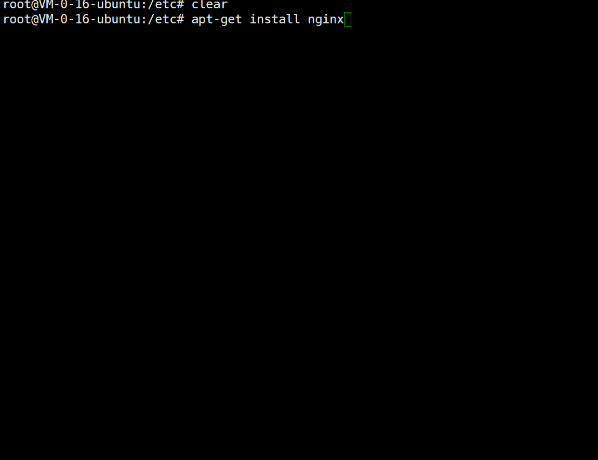

```
nginx -v
```


启动nginx

```
service nginx start
```

常用命令
---

```
#清屏命令
clear
```

解压tar.gz文件

```
 #解压到当前
 tar  -zxvf  fenci.py.tar.gz 
 #解压到指定文件夹
 tar  -zxvf  fenci.py.tar.gz  -C  pythontab/
```

tar文件

```
#解压
tar xvf FileName.tar
#压缩
tar cvf FileName.tarsu
```

解压.gz文件

```
gunzip -d pythontab.gz
```

查询某个端口是否被占用，再执行

```
#如何没有安装先安装一下
sudo apt install net-tools
```

```
netstat  -anp  |grep 端口号
```

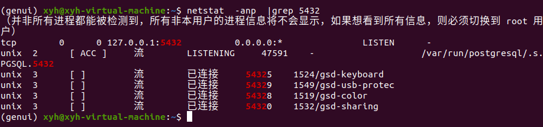

杀死某个端口的进程

```
sudo fuser -k -n tcp 80
```


查看虚拟机的IP地址

```
ifconfig
```

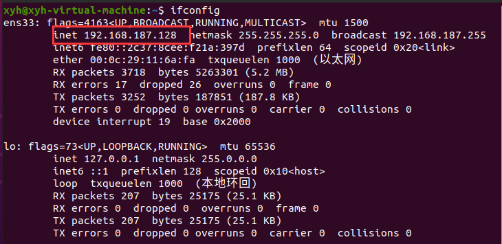

方框内的就是虚拟机的IP地址

给文件重命名

```

```


Anaconda使用
---

```
 #出现图形化界面
 anaconda-navigator
```

### 解决进入环境后，命令行前面没有`(base)`标识的问题

在最后一行添加以下内容，其中的路径根据自己的安装路径填写

anaconda3的路径`/home/xyh/anaconda3`

```
sudo gedit ~/.bashrc
export PATH="//home/xyh/anaconda3/bin:$PATH"
```

```
sudo gedit /etc/profile
export PATH="//home/xyh/anaconda3/bin:$PATH"
```

```
source /etc/profile 
```

### 为安装的Pycharm建立快捷方式，创建文件

```
cd /usr/share/applications
sudo gedit pycharm.desktop
```

编辑这个文件，添加以下内容，根据自己pycharm的路径

```
[Desktop Entry]
Version=1.0
Type=Application
Name=Pycharm
Icon=//home/xyh/software/pycharm/bin/pycharm.png
Exec=sh /home/xyh/software/pycharm/bin/pycharm.sh
MimeType=application/x-py;
Name[en_US]=pycharm
```


requirements.txt中的git源安装问题
---

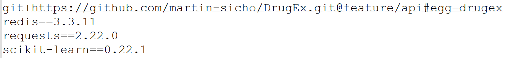git源是下载到anaconda3/envs/环境名/lib/python3.7/site-packages中


如果安装失败，可以去github上下载指定的文件夹然后放到该目录

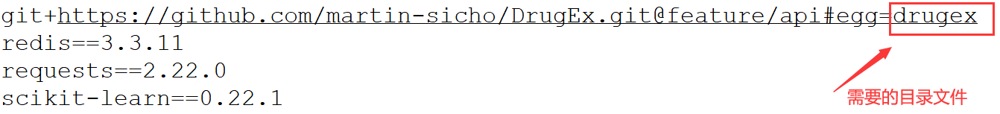


**修改PostgreSQL数据库默认用户postgres的密码**

1. 修改**PostgreSQL数据库**默认用户postgres的密码

```
sudo -u postgres 
psql
ALTER USER postgres WITH PASSWORD 'xxxxxxxxxxx';
#\q
```

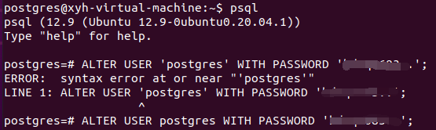

2.修改**linux系统**postgres用户的密码

<u>一定要切换用户再去修改</u>

```
#步骤一：删除用户postgres的密码
sudo passwd -d postgres
#步骤二：设置用户postgres的密码
sudo -u postgres passwd
```

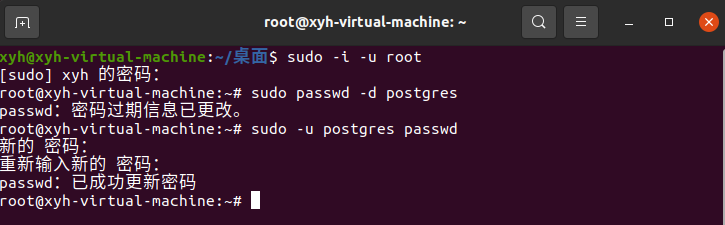


创建超级用户

```
createuser --interactive
```

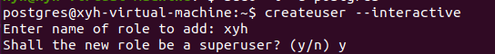

创建数据库

```
createdb dbname
#指定用户创建数据库
sudo -i -u xyh createdb genuidb
```

删除数据库

```
dropdb dbname
```

修改PostgreSQL用户密码

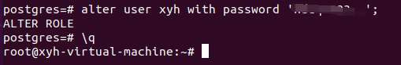

```
alter user webdev with password '123456';
```

为用户创建数据库并赋予所有权限

```
GRANT ALL PRIVILEGES ON DATABASE exampledb to dbuser;
```


查看postgresql自带的插件

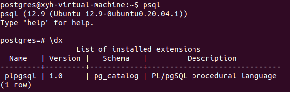

配置rdki-postgresqpl
---

首先激活安装rdkit-postgresql的环境

```
conda install -c rdkit rdkit-postgresql
```

数据库初始化

`rdkdata`是数据库数据文件目录

```
/home/xyh/anaconda3/envs/genui/bin/postgres -D rdkdata
```


执行成功之后会出现对应的文件


启动服务

启动服务前先检查5432端口是否被占用，如果被占用先杀死端口程序(一般默认的postgresql会自启动占用)

杀死某个端口的进程

```
sudo fuser -k -n tcp 5
```


```
/home/xyh/anaconda3/envs/genui/bin/postgres -D rdkdata
```

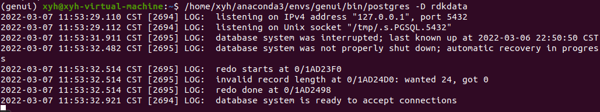

有如下显示则表示启动成功


创建数据库，必须用安装环境的用户名，否则会出现下面这种情况

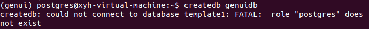

给数据库添加rdkit扩展

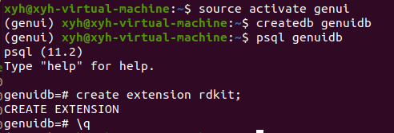

### 查看数据库的一些情况

首先执行

```
psql 数据库名
```

```
\du
```

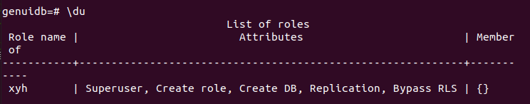

查看数据库中有哪些插件

```
\dx
```

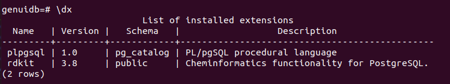

解决重装Vmware出现无法安装服务“Vmware Authorization Service”( VmAuthdService)。请确保您有足够的权限安装系统服务。
---

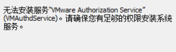

```
net stop VMAuthdService
taskkill /F /IM mmc.exe
sc delete VMAuthdService

```

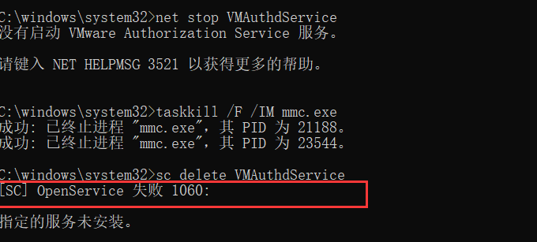

出现1060就可以了

Ubtuntu中nginx使用
---

安装

```
sudo apt install nginx
```

所有的 Nginx 配置文件都在`/etc/nginx/`目录下

主要的 Nginx 配置文件是`/etc/nginx/nginx.conf`

****

Nginx **服务器配置文件**被储存在`/etc/nginx/sites-available`目录下。

在`/etc/nginx/sites-enabled`目录下的配置文件都将被 Nginx 使用。最佳推荐是使用标准的命名方式。例如，如果你的域名是`mydomain.com`，那么配置文件应该被命名为`/etc/nginx/sites-available/mydomain.com.conf`

****

上面这种方法好像试过没有用，可能是我配置有问题

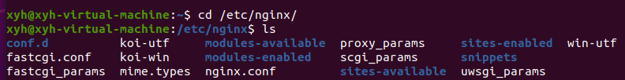

下面这种方法证实可行

```
#进入conf.d文件，本来什么都没有
#拷贝sites-enabled中的default文件到conf.d并且修改名字为**.conf,然后进行配置
#或者新建文件，然后复制里面的内容进行修改,修改红框部分
cd /etc/nginx/conf.d
sudo gedit genui.conf 

#最后重启服务器
sudo nginx -s reload
```


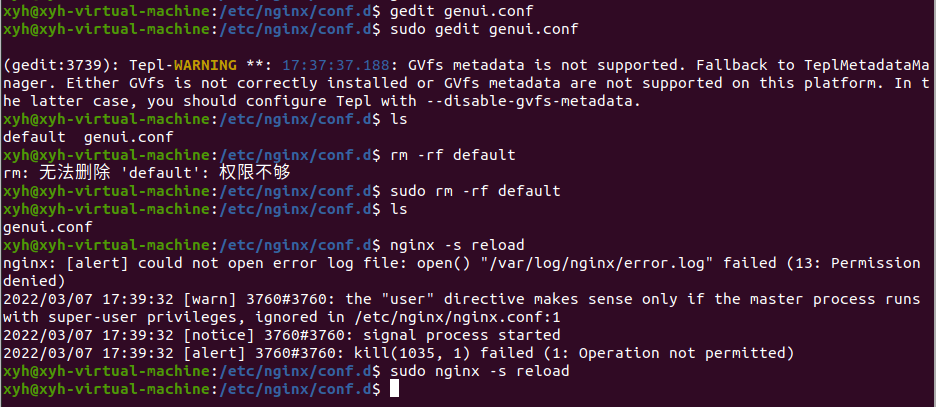

```
server {
    listen 8080;
 
    server_name localhost;
 
    root /root/project/vue_project/demo_01/hello_world/dist;
 
    location / {
        #try_files $uri $uri/ @router;
        root /home/xyh/vmshare/vmshare/build;
        index index.html index.htm;
    }
 
    #location @router {
    #    rewrite ^.*$ /index.html last;
    #}
}
```

