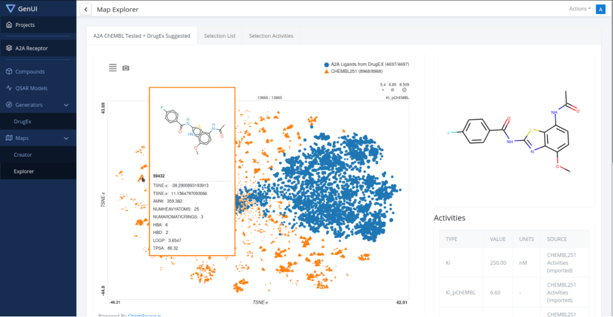

基于深度学习的药物分子设计方法研究
===

评估方法及指标
---

### 基准框架MOSES

MOSES于2020年提出，它包括标准化数据集和评估指标。MOSES使用有效性、唯一性、新颖性、片段相似性、支架相似性、最近邻相似性、内部多样性和FCD来比较分布学习模型。当给定一组来自未知分布的训练样本时，这些度量用于评估生成模型逼近未知分布的程度。MOSES首先计算生成分子的有效性，然后只评估有效分子。

#### 评估指标

有效性(Valid)：评估生成模型生成有效分子的比例，其余评估指标都是在有效分子的基础上进行评估。

独特性(Unique)：检查模型是否出现崩溃状况，只产生几个典型的分子。

新颖性(Novelty)：判断生成的分子中有多大的比例没有出现在训练集中，评估模型是否过度拟合，新颖性低则模型出现过拟合现象。

片段相似性(Fragment similarity Frag)：比较**BRICS片段**在生成的分子集合与参考集合的分布。如果生成的集合具有与参考集相似的片段，则片段相似性度量很大。BRICS是为医学和计算化学家开发的一组用于分解生物活性化合物的化学子结构的规则。

骨架相似性(Scaffold similarity Scaff)：类似于片段相似性度量，但不是片段，而是[Bemis-Murcko骨架](The properties of known drugs.)的频率。Bemis-Murcko骨架包含所有分子的环结构和连接环的连接物片段。

最近邻相似性(SNN)：根据生成的集合中分子的指纹与参考集合中最近的邻近分子之间的Tanimoto 相似性来计算。**该指标用于模型精度的度量。得分越低，模型的精度越差。**

Filters：在构建训练数据集时，删除了具有这些片段的分子(这些片段是化学家不希望出现的)，并希望模型避免产生含有这些片段的分子。**该指标衡量生成的分子中有多少比例的分子通过这些片段的过滤，即通过Filters(过滤器)的比例。**

内部多样性(IntDivp)：此度量检测生成模型的常见故障情况-**模式崩溃**，在模式崩溃的情况下，模型产生的样本种类有限，忽略了化学空间的某些区域。该度量的值越高，所生成的集合中的多样性就越高。

FCD(Fréchet ChemNet distance)：FCD指标包含了有效性、化学和生物意义。FCD计算现实世界分子分布和生成模型产生的分子分布之间的距离。**MOSES的作者建议使用FCD进行超参数调整和最终模型选择。** **此指标的值为非负值，越低越好。**

属性分布：为了定量比较生成集和测试集中的分布，该指标计算了生成集和测试集的属性分布之间的[1D-Wasserstein-1]()距离。包含以下属性：

- 相对分子质量(MW)：分子中原子质量的总和。通过绘制生成的和测试的分子集的分子量直方图，可以判断生成的集是偏向较轻的分子还是偏向较重的分子。
- LogP：辛醇-水分配系数，辛醇/水两相体系中辛醇相浓度与水相浓度之比；用RDKit的[Crippen估计计算](Prediction of physicochemical parameters by atomic contributions.)。

- 合成可及性分数(SA)：对合成给定分子的难度(10)或容易程度(1)的启发式估计，即启发式地估计合成给定分子的难易程度。SA评分[基于分子片段贡献的组合](Estimation of synthetic accessibility score of drug-like molecules based on molecular complexity and fragment contributions.)。
- 药物似然性的定量估计(QED)：一个[0，1]值，用来估计一个分子成为一种药物的候选药物的可能性有多大。

#### Baseline模型

非神经网络的基线模型：

- 隐马尔可夫模型(HMM):利用[Baum-Welch]()算法学习SMILES串上的概率分布。该模型由多个状态$(s_1，...，s_k)$、状态间的转移概率$p(s_{i+1}|s_i)$和token发射概率$p(x_i|s_i)$组成。从“start”状态开始，在每次顺序中，模型相应地从发射和转移概率中采样下一个token和状态。
- NGram:模型收集训练集中N元语法频率的统计数据，并使用这种分布来顺序采样新字符串。
- 组合生成器(Combinatorial)：组合生成器将训练数据的分子图分割成BRICS片段，并通过随机连接随机亚结构生成新的分子。

神经网络模型：

- CharRNN
- VAE
- JT-VAE
- AAE
- LatentGAN

从提供的各种模型中，CharRNN目前在关键指标方面表现最好。具体地说，它产生了最好的FCD、Fragment和Scaffold分数，这表明该模型不仅很好地捕捉到了训练分布，而且没有过多地拟合训练集。

#### 数据集

MOSES采用的基准数据集为ZINC，这是一个是一个小分子结构的数据库，用于药物的虚拟筛选，为药物研发提供了非常方便的药物性质测试。MOSES对数据ZINC数据库进行了数据清洗，只保留适合识别命中化合物的结构组成，并且它们足够小，可以对生成的分子进行进一步的[ADMET](The design of lead like combinatorial libraries.)优化。同时作者还对数据集进行了过滤：

- 过滤掉含有带电原子的分子（含C, N, S, O, F, Cl, Br, H除外）；
- 过滤掉环中分子数大于8的大环分子
- MCFs和PAINS过滤器进行过滤。

最终的数据集包含分子，内部多样性$IntDiv_1=0.857$；它包含448,854个独特的[Bemis-Murcko骨架](The properties of known drugs. 1. molecular frameworks.)和58315个独特的BRICS 片段。作者建议将数据集分为三个不相交的部分：训练(1,584,664个分子)、测试(176,075个分子)和骨架(scaffold)测试(176,226个分子)。骨架测试集包含所有分子，其中包含来自骨架的随机子集的Bemis-Murcko骨架。因此，scaffold测试集中的scaffold在训练和测试集中都不同于scaffold。我们使用scaffold测试来评估一个模型是否能够产生训练集中没有的新的骨架。测试集是数据集中剩余分子的随机子集。

### 基准框架GuacaMol

GuacaMol于2018年提出，将全新分子设计的模型分为两类:分布式学习和目标导向。分布学习模型旨在基于分子训练集的化学分布生成新分子。目标导向模型旨在为特定目标生成分子。

#### 评估指标

##### 分布学习模型

根据有效性、独特性、新颖性、FCD和KL散度来评估分布学习模型。有效性、独特性、新颖性、FCD等评估指标与MOSES中一致。KL散度衡量一个概率分布Q与另一个分布P的近似程度。比较了训练集和生成分子集的各种物理化学描述符的概率分布。**KL发散度基准通过要求生成的分子在所考虑的属性分布方面与训练集一样多样化，在一定程度上捕获了多样性**。

##### 目标导向学习模型

相似性：评估模型产生与目标化合物相似的分子的能力。如果模型能够产生许多与给定目标分子密切相关的分子，那么它们在相似性基准方面表现良好。

同分异构体：模型的任务是从给定的分子式生产异构体，评估模型的灵活性。

中间分子：评估模型产生类似于几个不同分子的分子的能力。

#### Baseline模型

random sampler:随机采样器模型,它显示了在KL发散和FCD基准上好的模型可以预期的分数。它产生的所有分子都存在于数据集中。

SMILES LSTM

Graph MCTS(蒙特卡罗树搜索)

AAE

ORGAN

VAE

GuacaMol 基准测试结果显示，SMILES  LSTM模型是所有基准测试中得分最高的模型。

#### 数据集

ChEMBL 24:它只包含已经合成并针对生物目标进行测试的分子。GuacaMol对数据集进行了以下处理：

- 去除了盐
- 电荷中和
- 删除SMILES字符串长度超过100个字符的分子
- 除去含有除H、B、C、N、O、F、Si、P、S、Cl、Se、Br和I以外的任何元素的分子
- 与10种上市药物(塞来昔布、阿立哌唑等)相比，ECFP4相似性大于0.323的分子被移除

模型总结
---

### SMILES表示

#### VAE

[Chemical VAE](http://pubs.acs.org/doi/abs/10.1021/acscentsci.7b00572)(2018)

第一个用于药物分子设计的VAE模型，该模型包含编码器，预测器和解码器，编码器将分子的离散表示转换为实值连续向量，解码器将这些连续向量转换回离散分子表示。编码器由三个卷积层和一个全连接的致密层组成，而解码器由三个GRU层组成。预测器是一个MLP网络。生成有效分子很低，也有可能完全生成无效的分子。但是在新颖性方面表现良好能达到接近90%的。

[SD-VAE](https://arxiv.org/abs/1802.08786)(2019):受编译器通过语法制导翻译(SDT)进行语法和语义检查的理论启发，作者通过引入随机惰性属性，提出了一种新的语法制导的变分自动编码器(SD-VAE)。该方法将离线SDT检查转换为即时生成的用于约束解码器的指导。生成的有效分子式比例可以达到 43.5%。

[Grammer VAE](http://proceedings.mlr.press/v70/kusner17a/kusner17a.pdf)（2018）：GVAE通过基于语法的解析树来表示句法上有效的SMILES字符串。该句法分析树能够捕捉SMILES串的结构，具有较高的正确率。GVAE直接使用解析树进行编码和解码。生成分子的有效比例不高，且容易出现大量重复的分子。

[PVAE](https://doi.org/10.26434/chemrxiv.7977131.v2)(2019)

通过引入惩罚变分自动编码器，它直接对分子的线性字符串表示SMILES进行操作，在解码器中加入一个权重惩罚项来解决SMILES字符串字符分布不平衡的问题。实验结果表明在潜在空间质量和潜在空间对新化学的泛化能力方面比以往的变分自动编码方法有了很大的提高。分子重建率达到98%，有效性达到了97%。

#### GAN

[ORGAN](https://arxiv.org/abs/1705.10843)和[ORGANIC](https://chemrxiv.org/articles/ORGANIC_1_pdf/5309668)(2018)

该模型提出了一种利用对抗训练和基于专家的奖励与强化学习相结合的方法来指导分子生成的结构和质量。该模型建立在SeqGAN的基础上。SeqGAN 是一种基于序列的生成对抗网络框架，将生成器建模为强化学习设置中的随机策略。ORGAN 扩展了该方法的训练过程，将针对于生成分子对于特定目标的性质得到的奖励或惩罚添加到鉴别器中。这两种类型的奖励的混合可以通过一个可调整的参数来控制，该模型为了提高训练的稳定性，利用了以 Wasserstein 距离为损失函数的鉴别器。该模型的生成器是由 LSTM 组成的 RNN 层，判别器是由卷积神经网络（CNN）组成。为了避免 CNN 过度拟合，该工作在每次实验中针对不同数据集的分类任务优化了 CNN 的结构。

缺点是模型很容易出现“模式崩溃”，生成大量重复的 SMILES 字符串，对抗训练的过程非常不稳定，会出现有效分子比例很低的情况。

[LatentGAN](http://dx.doi.org/10.3390/biom8040131) (2019)

该方法与以前的基于字符串的 GAN 方法（如ORGANIC和 RANC）的区别在于，生成器和判别器不使用 SMILES 字符串作为输入，而是采用预先训练的异质编码器的编码部分将 SMILES 编码成对应的 n 维向量作为输入。该方法允许模型更加专注于优化采样而不必担心 SMILES的语法问题。该模型利用预先训练的异质编码器的解码器部分，将生成的 n 维向量转换为分子结构。该模型首先用来自 ChEMBL 的分子集进行预训练，使模型能够产生类药分子，接下来，特定的数据集上训练预训练后的 GAN 模型。

#### RNN

基于RNN的SMILES分子表示的模型非常多，典型表现比较好的模型有以下几种，

[CharRNN](https://doi.org/10.1021/acscentsci.7b00512)(2018)

最开始使用RNN用于分子生成的模型，生成的分子的性质与用于训练模型的分子的性质有很好的相关性。使用RNN中的LSTM模型用于分子生成，该模型可以产生大量与训练分子具有相似物理化学性质的新型分子。这可用于生成用于虚拟筛选的库。

[BIMODAL](https://dx.doi.org/10.1021/acs.jcim.9b00943)（2020）

提出了一种基于RNN双向分子设计模型，结合了NADE和FB-RNN的特点。它通过在两个方向上读取之前和之后的标记来重构缺失信息，而同步前向RNN和后向RNN ，进行联合预测。这种双峰法每个时间步在交替方向上生成token，正向RNN在奇数位上生成token，逆向RNN在偶数位上生成token。该模型还引入了一种新的数据增强方法，生成n个相同规范SMILES串，开始生成的token随机放在这几个规范SMILES串中的不同位置。这种模型需要较长的时间进行训练，但是模型能FCD和支架多样性的指标上表现优秀，同时这种数据增强的方法也能使训练数据分布的学习更加准确，增加了设计的新颖性。

#### Transformer

##### [MolGPT]( https://doi.org/10.1021/acs.jcim.1c00600)（2021）

提出了第一个使用GPT框架的分子生成模型。使用掩蔽自我注意来训练转换器解码器进行下一个token预测任务，以生成类药物分子。模型的本质是一个迷你的GPT模型，但是MolGPT只有大约6M的参数，MolGPT包括堆叠的解码器块，每个解码器块都由一个掩蔽的自我注意力层和完全连接的神经网络组成。MolGPT由八个这样的解码器块组成。

该模型在无条件分子生成中，在生成分子有效性上仅次于JT-VAE的100%，优于其他基准(在MOSES基准上评估)，同时FCD和支架FCD值最高，表明该模型很好地学习了数据集的统计数据，内部多样性与基准相当。同时该模型能生成100%独特性的分子。但是该模型容易受到训练集数据的影响，当数据集的多样性较差时，生成分子的新颖性也会比较差。

##### [Transmol](https://doi.org/10.1039/d1ra03086h)（2021）

该模型是一种改进的Transformer，该模型可以通过分别采用标准的单种子和新的双种子方法来调整到输入引导或分集驱动的生成模式。单种子方法最适合于由种子结构的密切类似物组成的有针对性的文库的目标生成，而两种子方法允许通过产生与两个种子相似的分子来更深入地研究化学空间中未被探索的区域。采用transformer模型为vanilla transformer。潜在空间采样方法用的是束搜索(beam search)。

该模型在内部多样性表现是所有基准(MOSES)中最好的，但是生成有效的分子非常少，作者认为一个原因是模型的网络架构问题，探索到了太多无效分子的空间，一个改进方法是将自动编码器或GAN部件集成到模型中，有一种解决方法是优化模型使其具有更高的有效性。模型在FCD指标上较大，与非神经算法相比具有可比或更低的分数。作者认为一个可能得原因是，该模型只使用17万个分子中国的8000个分子做种子，因此只产生8000个聚焦分子库，个体输出有很高发的内部多样性，但是聚焦库之间彼此不同，较高的FCD表明生成的分子集与MOSES测试集不同，因为该模型生成的是非常集中的库，因此不能捕获MOSES测试集分全部可变性，如果种子分子的数量大幅增加，FCD值就会降低。

[GCT](https://doi.org/10.1021/acs.jcim.1c01289)(2021)

该模型将Transformer嵌入到条件变分自动编码器(CVAE)中的架构，该模型的架构可以扩展到其他基于transformer的架构，如BERT，GPT，T5等。Transformer框架使用的Pre-Layer Normalization Transformer，在Pre-LN Transformer的编码器和解码器之间插入条件变分自动编码器(CVAE)，从而能生成满足多个目标性质的分子。由于模型中的AE结构可以使分子的尺寸可控。实验结果表明生成分子的有效率为98.5%，与真实分子相似度为0.681，在个人计算机上，每个分子生成只需要507ms就可以。

### Graph表示

基于图表示分子生成模型主要分为两大类一类是(one-shot graph generation)一次性生成图模型，这种模型基于矩阵表示的概率图模型，可以一次生成所有节点和边。另一类是顺序分子图生成(sequence graph generation)模型，也叫顺序生成模型，这种模型通常以顺序的方式生成节点和边。

顺序分子图生成模型，在顺序生成的过程中，保持长期依赖关系方面存在一定的困难。因此，图的一些全局性质(例如，无标度性质)很难包括在内。但是这种方法通常速度比另一类方法块。这种类型的方法将图形生成视为顺序决策过程，其中节点和边是以已经生成的子图为条件，一个接一个(或一组接一组)生成的。通过将图形生成建模为一个顺序过程，这些方法自然地适应了生成的边和节点之间复杂的局部依赖关系。最为常见的有四种方式：基于节点序列、基于边序列、基于图母序列和基于规则序列。

一次性分子图生成模型通过多次迭代同步生成和精化整个图(即结点和边)来模拟图的全局性质，但大多数方法的时间复杂度不低于O(N^2^)，很难扩展到大型图。这种方法学习将每个完整的图映射到一个单一的潜在表示中，该表示遵循潜在空间中的某种概率分布。然后，可以通过该概率分布中直接采样来生成完整的图。这些方法的核心问题通常是如何与节点/边属性一起生成图拓扑。分子图生成模型常用邻接矩阵来表示分子图的拓扑结构。主要的难点是如何确保图元素之间的相关性，以便追求全局性质。通常三种方法一次性生成邻接矩阵：MLP，消息传递，可逆变换

#### 基于VAE的分子图生成

[JT-VAE](https://arxiv.org/abs/1802.04364)(2018)

属于顺序生成分子图模型，提出用结点树来表示分子，结点树中的每个节点代表一个原子簇，并在变分自编码器中应用贝叶斯优化进行目标性质优化。编码过程首先将分子图表征为结点树，树中的每个节点代表分子的一个子结构。然后，将树通过图信息传递网络编码成它们的潜在嵌入向量。树是通过每次生成一个节点的方式自顶向下构建的，树解码器从根开始遍历整个树，并以深度优先的顺序生成节点。对于每个访问过的节点，解码器首先做一个拓扑预测：该节点是否有子节点要生成，当一个新的子节点被创建时，预测它的标签并递归这个过程。这种模型使用小的分子结构作为构建模块，降低了其产生更大分子的能力，所以**这种模型只适用于小分子图，同时限制了搜索空间，产生新颖的分子比例比较少。**

[RVAE](https://arxiv.org/abs/1809.02630)（2018）

属于单次生成分子图模型，提出了一个适用于变分自动编码器的正则化框架，作者通过使用拉格朗日函数为解码器的输出分布引入惩罚项，从而使模型偏向于生成有效的分子图(即有效性约束)，惩罚使分子图中可能存在的节点和边的类型(例如，可能的价态、元素等)的分布规律化。实验结果表明，与标准的VAE相比，引入正则化提高了生成有效图形的概率；在QM9上训练的RVAE的报告有效率为97%，在ZINC训练集上的RVAE的有效率为35%。

[NEVAE](https://arxiv.org/pdf/1802.05283.pdf)（2019）:

属于顺序生成分子图模型，NeVAE将VAE架构应用于分子图，其编码器和解码器是专门设计的，是一种概率和排列不变的编码器，以解决图中的不规则性，节点顺序不变性，以及可变大小。解码器还能够为生成的分子中的原子提供空间坐标，使得该模型能够优化生成的分子的空间配置。通过使用屏蔽，解码器能够保证生成的分子具有一组有效的属性。实验表明NEVAE可以生成接近100%有效、新型、独特的分子。

[HierVAE](http://proceedings.mlr.press/v119/jin20a.html)(2020)

属于顺序生成分子图模型，是在JT-VAE的基础上进行的，并介绍了一种用于使用GNN顺序生成分子图的分层图编码器-解码器体系结构。它采用明显更大的基序作为基本构建块。首先，编码器以从精细到粗略的方式为每个分子创建多分辨率表示，从原子层到附着层，再到基体层。然后，自回归解码器以从粗到精的方式工作，首先生成模体层，一次生成一个模体，然后确定附着点，最后完成原子层。该模型可以生成比JT-VAE模型更大的分子图，二者都采用在分子图上添加片段的策略，而不是一次只添加一个原子。

[GraphVAE](https://doi.org/10.1007/978-3-030-01418-6_41)(2019)

属于单次生成分子图模型，编码器是一个带有卷积层的前馈网络，解码器的架构是一个 多层MLP。模型将图中的节点和边分别表示原子和化学键。他们的中心假设是解码一个概率全连通图，其中节点、边及其属性的存在都是独立的随机变量。这样的假设能使用多层感知器解码器一次性直接输出预定义最大尺寸的概率全连通图。模型假设边和节点是独立的，GraphVAE难以匹配训练分布，需要**依赖昂贵的图形匹配过程**。结果表明该方法可以实现学习小分子的合理嵌入表征，但该方法的解码器却很难捕捉到大分子的复杂连接。

[MPGVAE](https://iopscience.iop.org/article/10.1088/2632-2153/abf5b7/meta)(2021)

属于单次生成分子图模型，改进Graph VAE的基本结构，通过在GVAE的编码器和解码器中构建消息传递神经网络来改进这类模型。编码器和解码器都使用MPNN来学习分子的分布。MPNN是带有图注意力的变体MPNN。节点更新功能使用GRUCell。在通过消息传递层传播之后，使用set2set模型作为读出函数，将节点隐藏特征组合成固定大小的图级表示向量。MPGVAE在QM9和GDB-17数据集上生成分子的有效率91%，独特性68%，新颖性54%单个指标并不是很突出，但是在综合指标#VUN(既有效,又独特且新颖的分子数量)上表现优于其他基准( CVAE,Graph VAE, CVAE, MolGAN )

[GF-VAE](https://doi.org/10.1145/3459637.3482260)（2021）

属于单次生成分子图模型，提出了一种基于流的变分自动编码器(VAE)模型GF-VAE，该模型为VAE配备了一个轻量级的流模型作为其解码器，其中编码器的目标是加速解码器的训练过程，而解码器则反过来优化编码器的性能。由于流模型的可逆性，生成过程很容易通过反转解码器来完成。GF-VAE继承了VAE和基于流的方法的优点。模型在分子生成和优化方面优于其他最先进的模型，提供了平滑的潜在空间，并由于归一化流动的灵活性而保证了100%的重建率。此外，GF-VAE的训练效率非常高，比MoFlow模型快两倍左右。

#### GAN

[MolGAN](https://arxiv.org/abs/1805.11973)(2019)

​	属于单次生成分子图(one-shot graph generation)模型，该模型是一个隐式的用于分子图生成的生成模型，它绕过了昂贵的图匹配程序或以往基于似然性方法的启发式节点排序方法。该方法直接对图结构进行操作，并与强化学习目标相结合，以鼓励模型产生具有特定性质的分子。该模型的生成器从先验分布中获取一个样本，并生成一个表示分子的带注释的图形 G。图 G 的节点和边分别与表示原子类型和键类型的注释相关联。判别器从数据集和生成器中获取样本，并学习区分它们。生成器和判别器都使用改进的 WGAN-GP 进行训练，这样生成器就可以学习匹配经验分布并最终输出有效的分子。奖励网络通过学会给每个分子分配奖励，当MolGAN 输出一个无效分子时，它分配零奖励。

在基于 QM9 化学数据集的实验中，该模型能够产生接近 100%的有效化合物。与基于字符串（SMILES）的 GAN相比，MolGAN 训练速度更快，生成的分子更容易达到目标性质，但这种方法容易受到模式崩溃的影响,即生成的分子多样性较差，生成的分子中只有非常少的独特分子。MolGAN除了出现模式崩溃外，在其他评估指标上表现都非常好。

#### RNN

[MolMP](https://doi.org/10.1186/s13321-018-0287-6)和[MolRNN](https://arxiv.org/abs/1905.13372)

二者都属于顺序生成模型，生成策略是Node-by-Node ,动作空间被分为四个可能的动作，用于构建子图：Initialization，将单个节点添加到空图；Append，添加新节点，并将其连接到图中的现有节点；Connect，将最后附加的节点连接到图中的另一个节点；以及Terminate，结束图形生成过程。第一个模型MolMP使用图卷积网络(GCN)来学习构建新图的动作空间，并将图的生成视为一个马尔可夫过程。在MolRNN模型中，向MolMP添加了一个递归单元，使得图的生成不再是马尔可夫的。MolRNN在引入递归单元后，在一般的分子生成指标(有效性、唯一性和新颖性)以及目标导向的分子生成方面都优于MolMP。MolRNN是一种自回归模型，基于生成的节点和边缘序列生成新的节点和边缘。自回归模型的顺序性质允许在生成过程中有效地利用化学规则进行化合价检查.

#### Flow

[GraphNVP](https://arxiv.org/pdf/1905.11600)(2019)

​	属于单次生成分子图模型，模型是第一个基于可逆流的生成模型。归一化流(可逆流)最初是为图像生成任务开发的。GraphNVP的工作原理是分两步生成图：首先，它生成邻接张量A，然后生成节点属性X。它通过学习两个潜在表示来实现。该模型首先将一个分子图转化为节点特征矩阵和邻接矩阵向量，并在仿射耦合层中对上述两个矩阵进行 Masking 处理，接着将处理后的张量矩阵输入逆向仿射耦合层进行分子图的生成。

该模型能够生成具有高唯一性分数和保证重建能力的有效分子。保证了100%的重构精度。有效性达到了83%，虽然比RVAE和MolGAN表现差，但该模型没有像在一些基线中所做的那样明确地结合化学知识。该模型证明了学习的潜在空间可以用于搜索给定分子的类似结构，同时也能在生成的类似结构上进行一定的改造。**但是该模型也存在着排列不变性等问题。**

[MolFlow](https://dl.acm.org/doi/pdf/10.1145/3394486.3403104)(2020)

​	属于单次生成分子图模型，MoFlow是一个基于流的图形生成模型，用于学习分子图及其潜在表示之间的可逆映射。在MoFlow中，原子$F_{X|A}$的图条件流(GCF)将使用$A$的$X$变换为条件潜矢量$Z_{X|A}$，而键$f_A$的GCF将A变换为潜矢量$Z_A$。生成过程使用推理操作的反向转换，然后进行有效性校正。
​	像GraphNVP一样，MoFlow的工作原理是首先通过基于Glow的模型生成邻接张量，然后通过依赖于A的新GCF生成X，最后对生成的图应用有效性校正。然而，MolFlow与GraphNVP和GRF不同，由于事后有效性校正，由莫弗洛生成的所有结构都保证是化学有效的。实验表明MolFlow不仅能记忆和重建所有训练分子图，而且能以更高的速度生成新颖、独特和有效的分子图。

[GraphAF](https://arxiv.org/abs/2001.09382)（2020）

​	属于顺序生成分子图模型，基于流模型的自回归分子生成模型。GraphAF 将分子图生成问题形式化为一个顺序决策过程。从一个空图开始，顺序采样随机变量，并将它们映射到atom/bond 特性，从而生成新的节点或边，重复这个过程，直到所有节点和边都生成。GraphAF 的目的是定义一个从先验分布（例高斯分布）到分子图结构的可逆变换。
​	实验结果表明，在没有化学知识规则的情况下，GraphAF 可以生成 68%的化学有效分子，在有化学规则的情况下，可以生成 100%的化学有效分子。在使用强化学习对模型进行微调以实现目标导向的性质优化后，GraphAF 相比较于GraphNVP、GCPN、JT-VAE等模型，在分子化学性质优化等方面展现了优异的表现。
GraphAF的训练过程比GCPN快两倍。在通过强化学习进行精细调优后，GraphAF在化学性质优化和约束性质优化方面都取得了最先进的性能

[GraphDF](https://arxiv.org/abs/2102.01189)（2021）：一种新的基于归一化流方法的离散潜变量分子图生成模型。GraphDF通过可逆模移位变换将离散的潜变量依次映射到图的结点和边。离散潜变量的使用使得对图结构的建模更精确，探索化学空间的能力更强。GraphDF可以避免计算昂贵的雅可比矩阵，并消除了许多现有方法中存在的反量化的负面影响。GraphDF的主要局限性是训练时依赖于BFS节点排序，生成速度慢于一次生成方法。GraphDF表现优于其他同类的流模型。

#### GNN

[GCPN](https://arxiv.org/abs/1806.02473)(2018)

图卷积策略网络，属于顺序分子图生成模型，一个通用的基于图卷积网络的模型，用于通过强化学习生成有向图。该模型将图表示与RL结合，可以在分子生成过程中引导分子向期望的目标。图表示捕获复杂的结构信息，并在每个状态转换中启用有效性检查 ，强化学习使模型产生高分数带有期望属性的分子，通过对抗性训练模仿给定数据集中的分布。

工具包
---

### RDkit

2006年发布，目前最常用的化学信息Python工具包，基于对化合物2D和3D分子操作，利用机器学习方法进行化合物描述符生成，fingerprint生成，化合物结构相似性计算，2D和3D分子展示等。常用于分子数据的处理，检验分子的有效性，计算分子物理化学性质等。

### [OpenChem](https://doi.org/10.1021/acs.jcim.0c00971)

OpenChem于2021年提出，是一个基于PyTorch的用于计算化学和药物设计的深度学习工具包。提供简单快捷的模型开发、模块化软件设计和几个数据预处理模块。OpenChem提供模块化设计，其中构建的模块可以组合在一起；通过让用户使用单个配置文件定义模型而易于使用。

OpenChem引入了几种模型类型：Feature2Label、Smiles2Label、Graph2Label、SiameseModel、GenerativeRNN和MolecularRNN。

OpenChem有一个数据集，用于将SMILES转换为特征向量、标记和分子图，并将蛋白质序列转换为标记。

下图为当前在OpenChem中实现的模型、模块和任务的类型。用户可以训练用于分类、回归和多任务问题的预测模型，以及开发用于生产具有优化特性的新型分子的生成模型。OpenChem既可以处理SMILES字符串，也可以处理分子图。数据层为数据预处理提供了实用程序，例如将SMILES字符串转换为分子图，并计算此类图的标准结构特征。

### [GenUI](https://doi.org/10.1186/s13321-021-00550-y)

2021年发布，这是一个软件平台，可以将分子生成器集成到功能丰富的图形用户界面中，便于不同背景的专家使用。GenUI以网络服务的形式实现，其接口提供对化学信息学工具的访问，用于数据预处理、模型构建、分子生成和交互式化学空间可视化。此外，该平台很容易通过可定制的前端React.js组件和后端Python扩展进行扩展。可以将自己的分子集成器，集成到软件平台中，可以查看每个分子的物理化学性质进行可视化展示。类似效果如下图。

论文想法
---

### 基于SMILES表示的分子生成

### seq2seq生成模型

RNN和Transformer这类序列生成模型存在以下三个问题：

1.SMILES字符串是使用深度优先图遍历将分子图编码成ASCII字符序列的非唯一表示。相同分子结构可以转换为许多独特的分子，这种不唯一性源于对SMILES串构造的起始原子的模棱两可。每个具有N个非氢原子的分子可以至少有N个等价的SMILES串表示。相同的分子结构可以转化成许多独特的SMILES串。对于RNN和Transformer这类需要关注序列的顺序的生成模型，这种不唯一的表示会增加模型学习SMILES的语法规则的难度，同时也会增加选择开始生成的token的难度。虽然可以使用规范SMILES可以解决，但是则增加了SMILES语法规则的难度。但是有论文中证明这种随机的SMILES表示可以提高生成的化学空间质量。

2.seq2seq模型通常关注序列的顺序。对于一些RNN分子生成模型，他们可能只学习SMILES语法的规则，而不是分子结构的知识，从典型SMILES中获得的潜在表征可能不那么有用，因为它们更多地与典型SMILES的特定语法规则有关，而不是与潜在分子的化学结构有关。如果想生成具有某种骨架或片段的分子比较困难，解决这类问题可以将生成模型和强化学习RL相结合。还有一种解决方法是通过组装SMILES分子片段来解决 [Molecular generation by Fast Assembly of (Deep)SMILES fragments](https://doi.org/10.1186/s13321-021-00566-4) (2021)。

3.SMILES不是为了捕捉分子相似性而设计的，所以具有相似化学结构的分子可以被编码成非常不同的SMILES字符串。即使是语法有效的字符串也可能不能编码化学上有效的分子，这也是RNN和Transformer模型无法生成100%有效分子的原因。

这类模型的优点是通常能探索更为广阔的分子空间，这点可以从MOSES和GuacaMol基准平台中的基线模型表现可以看出。MOSES中在关键指标方面表现最好charRNN,在GuacaMol中表现最好的是SMILES LSTM。

用SELFIES作为分子表示可以解决以上1和3两个问题，用SELFIES表示的分子具有100%鲁棒性，每个分子都是有效的，相应的代价是训练困难，模型训练时间长。因为SELFIES表示的分子语法规则比SMILES要复杂的多，生成模型学习起来比较难，需要的时间也比较多。

**论文思路：**

​	将SMILES分子表示改变成SELFIES，然后用[MolGPT]( https://doi.org/10.1021/acs.jcim.1c00600)模型进行训练,从而保证生成的分子100%有效。SELFIES的语法类似于有限自动机，从左侧序列推导到右侧，这与GPT模型的自注意力机制非常像，GPT是一种单向语言模型，只关注左侧的信息，来预测下一个token，二者的语法相似，可能会有好的结果。同时训练过程可以参考[X-MOL](https://doi.org/10.1101/2020.12.23.424259)这篇论文中的方法进行改进，这篇论文中应用了11亿个分子的大规模预训练技术来理解和表示分子，然后经过精心设计的微调，以适应不同的下游分子分析任务。在预训练过程中也可以参考[BART](https://arxiv.org/abs/1910.13461)的去噪预训练方法，论文中提到BART在针对文本生成进行微调时特别有效，可以借鉴来改进GPT的微调过程。 根据我的调研，目前还没有将SELFIES分子表示与GPT模型结合的论文，二者的结合值得去探讨一下。

### 基于Graph表示的分子生成

​	MolGAN这个模型除了出现模式崩溃的产生较少的独特分子外，其他各种指标都表现的很好，如果解决该模型模式崩溃问题，模型性能应该有很大提升，解决GAN模式崩溃问题有以下几篇论文。此外，MOlGAN模型只适合小分子的生成，可以考虑改变其模型结构使其可以生成较大的分子。此外[Graph Mul-tiset Transformer (GMT)](https://openreview.net/pdf?id=JHcqXGaqiGn)这篇论文中的图池化的方法，可以使MolGAN生成有效分子更加的稳定。解决GAN模式塌陷的方法可以结合起来使用，更新训练集数据的方法和改变生成器的数量的方法可以结合起来，具体效果如何要经过实验才能知道。

#### 解决GAN分子生成模型塌陷的方法

[Multi-Agent Diverse Generative Adversarial Networks](https://openaccess.thecvf.com/content_cvpr_2018/papers/Ghosh_Multi-Agent_Diverse_Generative_CVPR_2018_paper.pdf) (2018)

该论文提出一种新的GAN架构——MAD-GAN，包含多个生成器和一个鉴别器。为了强制不同的发生器捕获不同的高概率模式，MADGAN的鉴别器被设计成在发现真样本和假样本的同时，还要求识别产生给定的假样本的发生器。这种方法的缺点是要事先定义好生成器的数量，不够灵活，生成器不够的话，会影响生成的样本的多样性。作者也是在图像生成类的任务上进行实验。

[Using GANs with adaptive training data to search for new molecules](https://doi.org/10.1186/s13321-021-00494-3) (2021)

这篇论文中提到之前解决GAN模式崩溃的模型，主要包括更新损失函数的方法，这些方法依赖于与固定训练数据集的比较。而这篇论文中使用遗传算法的思想通过增量更新训练数据集来实现扩展搜索。在训练间隔期间存储由该模型生成的新颖且有效的分子。然后，通过替换策略更新训练数据，替换策略可以是引导的，也可以是随机的。训练重新开始，并重复这一过程。作者发现这种解决方法不仅可以缓解GAN在训练过程中的模式崩溃问题，还能扩大对对分子空间的搜索。

[On Mode Collapse in Generative Adversarial Networks](https://doi.org/10.1007/978-3-030-86340-1_45)（2021）

这篇论文中通过引入监督信号给GAN，来缓解模式崩溃的问题，这种方式目的是将生成数据的流形拉近真实数据流形。提出了新SSGAN模型，作者受变分自动编码器的启发，我们设置了一个编码器来学习训练样本的低维表示，然后训练生成器以确保生成的流形接近真实的数据流形。在SSGAN中作者设置编码器网络(逆生成器)来学习训练数据的低维表示。同时，编码器还可以将低维分布限制为某种分布(例如高斯分布)。因此，可以从该分布中采样生成器的噪声输入。因此，生成的流形可以通过这样的监督信号被训练成接近真实数据流形。

[Overcoming Mode Collapse with Adaptive Multi Adversarial Training](https://arxiv.org/abs/2112.14406) (2021)

这篇论文中提出了一个新的GAN框架，称为自适应多对抗训练(AMAT)，它通过在训练过程中产生额外的鉴别器来有效地防止GAN中的灾难性遗忘，以前的类似的解决方法需要预先确定鉴别器的数量，而该论文中的方法是自适应的，可以在训练过程中增量地添加鉴别器，从而在数据质量度量和整体计算工作量方面都取得了优于目前的改进方法。作者说该方法可以插入到任何最先进的GAN框架中，并且仍然可以提高生成样本的质量和覆盖率。

[MGGAN: Solving Mode Collapse Using Manifold-Guided Training](https://openaccess.thecvf.com/content/ICCV2021W/MELEX/papers/Bang_MGGAN_Solving_Mode_Collapse_Using_Manifold-Guided_Training_ICCVW_2021_paper.pdf)（2021）

这篇论文中提出了一种新的算法，流引导生成对抗性网络MGGAN，该算法利用现有GAN体系结构上的引导网络来诱导生成器学习数据分布的整体模式。引导网络将图像变换到学习的流形空间，有效地表示了整体模式的覆盖。MGGAN可以很容易地扩展到现有的GAN，并在不损失图像质量的情况下解决模式崩溃问题。MGGAN可以很容易的扩展到现有的GAN模型。目前作者只是在图像实验上验证这种方法。