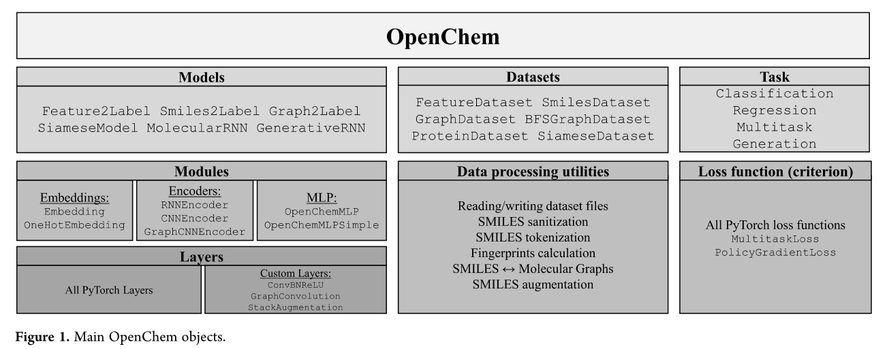

基于深度学习的药物分子设计方法研究
===

评估方法及指标
---

### 基准平台MOSES

MOSES于2020年提出，它包括标准化数据集和评估指标。MOSES使用有效性、唯一性、新颖性、片段相似性、支架相似性、最近邻相似性、内部多样性和FCD来比较分布学习模型。当给定一组来自未知分布的训练样本时，这些度量用于评估生成模型逼近未知分布的程度。MOSES首先计算生成分子的有效性，然后只评估有效分子。

#### 评估指标

有效性(Valid)：评估生成模型生成有效分子的比例，其余评估指标都是在有效分子的基础上进行评估。

独特性(Unique)：检查模型是否出现崩溃状况，只产生几个典型的分子。

新颖性(Novelty)：判断生成的分子中有多大的比例没有出现在训练集中，评估模型是否过度拟合，新颖性低则模型出现过拟合现象。

片段相似性(Fragment similarity Frag)：比较**BRICS片段**在生成的分子集合与参考集合的分布。如果生成的集合具有与参考集相似的片段，则片段相似性度量很大。BRICS是为医学和计算化学家开发的一组用于分解生物活性化合物的化学子结构的规则。

骨架相似性(Scaffold similarity Scaff)：类似于片段相似性度量，但不是片段，而是[Bemis-Murcko骨架](The properties of known drugs.)的频率。Bemis-Murcko骨架包含所有分子的环结构和连接环的连接物片段。

最近邻相似性(SNN)：根据生成的集合中分子的指纹与参考集合中最近的邻近分子之间的Tanimoto 相似性来计算。**该指标用于模型精度的度量。得分越低，模型的精度越差。**

Filters：在构建训练数据集时，删除了具有这些片段的分子(这些片段是化学家不希望出现的)，并希望模型避免产生含有这些片段的分子。**该指标衡量生成的分子中有多少比例的分子通过这些片段的过滤，即通过Filters(过滤器)的比例。**

内部多样性(IntDivp)：此度量检测生成模型的常见故障情况-**模式崩溃**，在模式崩溃的情况下，模型产生的样本种类有限，忽略了化学空间的某些区域。该度量的值越高，所生成的集合中的多样性就越高。

FCD(Fréchet ChemNet distance)：FCD指标包含了有效性、化学和生物意义。FCD计算现实世界分子分布和生成模型产生的分子分布之间的距离。**MOSES的作者建议使用FCD进行超参数调整和最终模型选择。** **此指标的值为非负值，越低越好。**

属性分布：为了定量比较生成集和测试集中的分布，该指标计算了生成集和测试集的属性分布之间的[1D-Wasserstein-1]()距离。包含以下属性：

- 相对分子质量(MW)：分子中原子质量的总和。通过绘制生成的和测试的分子集的分子量直方图，可以判断生成的集是偏向较轻的分子还是偏向较重的分子。
- LogP：辛醇-水分配系数，辛醇/水两相体系中辛醇相浓度与水相浓度之比；用RDKit的[Crippen估计计算](Prediction of physicochemical parameters by atomic contributions.)。

- 合成可及性分数(SA)：对合成给定分子的难度(10)或容易程度(1)的启发式估计，即启发式地估计合成给定分子的难易程度。SA评分[基于分子片段贡献的组合](Estimation of synthetic accessibility score of drug-like molecules based on molecular complexity and fragment contributions.)。
- 药物似然性的定量估计(QED)：一个[0，1]值，用来估计一个分子成为一种药物的候选药物的可能性有多大。

#### Baseline模型

非神经网络的基线模型：

- 隐马尔可夫模型(HMM):利用[Baum-Welch]()算法学习SMILES串上的概率分布。该模型由多个状态$(s_1，...，s_k)$、状态间的转移概率$p(s_{i+1}|s_i)$和token发射概率$p(x_i|s_i)$组成。从“start”状态开始，在每次迭代中，模型相应地从发射和转移概率中采样下一个token和状态。
- NGram:模型收集训练集中N元语法频率的统计数据，并使用这种分布来顺序采样新字符串。
- 组合生成器(Combinatorial)：组合生成器将训练数据的分子图分割成BRICS片段，并通过随机连接随机亚结构生成新的分子。

神经网络模型：

- CharRNN
- VAE
- JT-VAE
- AAE
- LatentGAN

从提供的各种模型中，CharRNN目前在关键指标方面表现最好。具体地说，它产生了最好的FCD、Fragment和Scaffold分数，这表明该模型不仅很好地捕捉到了训练分布，而且没有过多地拟合训练集。

#### 数据集

MOSES采用的基准数据集为ZINC，这是一个是一个小分子结构的数据库，用于药物的虚拟筛选，为药物研发提供了非常方便的药物性质测试。MOSES对数据ZINC数据库进行了数据清洗，只保留适合识别命中化合物的结构组成，并且它们足够小，可以对生成的分子进行进一步的[ADMET](The design of lead like combinatorial libraries.)优化。同时作者还对数据集进行了过滤：

- 过滤掉含有带电原子的分子（含C, N, S, O, F, Cl, Br, H除外）；
- 过滤掉环中分子数大于8的大环分子
- MCFs和PAINS过滤器进行过滤。

最终的数据集包含分子，内部多样性$IntDiv_1=0.857$；它包含448,854个独特的[Bemis-Murcko骨架](The properties of known drugs. 1. molecular frameworks.)和58315个独特的BRICS 片段。作者建议将数据集分为三个不相交的部分：训练(1,584,664个分子)、测试(176,075个分子)和骨架(scaffold)测试(176,226个分子)。骨架测试集包含所有分子，其中包含来自骨架的随机子集的Bemis-Murcko骨架。因此，scaffold测试集中的scaffold在训练和测试集中都不同于scaffold。我们使用scaffold测试来评估一个模型是否能够产生训练集中没有的新的骨架。测试集是数据集中剩余分子的随机子集。

### 基准平台GuacaMol

GuacaMol于2018年提出，将全新分子设计的模型分为两类:分布式学习和目标导向。分布学习模型旨在基于分子训练集的化学分布生成新分子。目标导向模型旨在为特定目标生成分子。

#### 评估指标

##### 分布学习模型

根据有效性、独特性、新颖性、FCD和KL散度来评估分布学习模型。有效性、独特性、新颖性、FCD等评估指标与MOSES中一致。KL散度衡量一个概率分布Q与另一个分布P的近似程度。比较了训练集和生成分子集的各种物理化学描述符的概率分布。**KL发散度基准通过要求生成的分子在所考虑的属性分布方面与训练集一样多样化，在一定程度上捕获了多样性**。

##### 目标导向学习模型

相似性：如果模型能够产生许多与给定目标分子密切相关的分子，那么它们在相似性基准方面表现良好。

同分异构体：

中间分子

#### Baseline模型

random sampler:随机采样器模型,它显示了在KL发散和FCD基准上好的模型可以预期的分数。它产生的所有分子都存在于数据集中。

SMILES LSTM

Graph MCTS(蒙特卡罗树搜索)

AAE

ORGAN

VAE

GuacaMol 基准测试结果显示，SMILES  LSTM模型是所有基准测试中得分最高的模型。

#### 数据集

ChEMBL 24:它只包含已经合成并针对生物目标进行测试的分子。GuacaMol对数据集进行了以下处理：

- 去除了盐
- 电荷中和
- 删除微笑字符串长度超过100个字符的分子
- 除去含有除H、B、C、N、O、F、Si、P、S、Cl、Se、Br和I以外的任何元素的分子
- 与10种上市药物(塞来昔布、阿立哌唑等)相比，ECFP4相似性大于0.323的分子被移除

模型比较
---

### SMILES表示

#### VAE

Chemical VAE(2018):第一个用于药物分子设计的VAE模型，该模型包含编码器，预测器和解码器，编码器将分子的离散表示转换为实值连续向量，解码器将这些连续向量转换回离散分子表示。生成有效分子的比例很低。

GVAE(Graph VAE)：图中的节点和边分别表示原子和化学键。解码一个概率全连通图，其中节点、边及其属性的存在都是独立的随机变量。编码器是一个带有卷积层的前馈网络，解码器的架构是一个 MLP。

MPGVAE(2021):

JT-VAE:

PVAE(2019)：

RVAE:

#### AAE

#### GAN

MolGAN:

RANC:

LatentGAN:

RNC:

#### RNN

SMILES LSTM:

#### Transformer

##### MolGPT

2021年提出，提出了第一个使用GPT框架的分子生成模型。使用掩蔽自我注意来训练转换器解码器进行下一个token预测任务，以生成类药物分子。模型的本质是一个迷你的GPT模型，但是MolGPT只有大约6M的参数，MolGPT包括堆叠的解码器块，每个解码器块都由一个掩蔽的自我注意力层和完全连接的神经网络组成。MolGPT由八个这样的解码器块组成。

该模型在无条件分子生成中，在生成分子有效性上仅次于JT-VAE的100%，优于其他基准(在MOSES基准上评估)，同时FCD和支架FCD值最高，表明该模型很好地学习了数据集的统计数据，内部多样性与基准相当。同时该模型能生成100%独特性的分子。但是该模型容易受到训练集数据的影响，当数据集的多样性较差时，生成分子的新颖性也会比较差。

**改进想法：**可以用Using GANs with adaptive training data to search for new molecules (2021)这篇论文中引入的训练方法，使用遗传算法的思想通过增量更新训练数据集来实现扩展搜索，增加训练集分子的多样性，从而解决MolGPT需要依赖数据集的多样性才能生成新颖行较好的分子。

##### Transmol

2021年提出，该模型是一种改进的Transformer，该模型可以通过分别采用标准的单种子和新的双种子方法来调整到输入引导或分集驱动的生成模式。单种子方法最适合于由种子结构的密切类似物组成的有针对性的文库的目标生成，而两种子方法允许通过产生与两个种子相似的分子来更深入地研究化学空间中未被探索的区域。采用transformer模型为vanilla transformer。潜在空间采样方法用的是束搜索(beam search)。

该模型在内部多样性表现是所有基准(MOSES)中最好的，但是生成有效的分子非常少，作者认为一个原因是模型的网络架构问题，探索到了太多无效分子的空间，一个改进方法是将自动编码器或GAN部件集成到模型中，有一种解决方法是优化模型使其具有更高的有效性。模型在FCD指标上较大，与非神经算法相比具有可比或更低的分数。作者认为一个可能得原因是，该模型只使用17万个分子中国的8000个分子做种子，因此只产生8000个聚焦分子库，个体输出有很高发的内部多样性，但是聚焦库之间彼此不同，较高的FCD表明生成的分子集与MOSES测试集不同，因为该模型生成的是非常集中的库，因此不能捕获MOSES测试集分全部可变性，如果种子分子的数量大幅增加，FCD值就会降低。

训练方式

### Graph表示

#### VAE

RVAE（2019）

属于单次生成分子图(Single-shot graph generation)模型，作者通过使用拉格朗日函数为解码器的输出分布引入惩罚项，从而使模型偏向于生成有效的分子图(即有效性约束)，惩罚使分子图中可能存在的节点和边的类型(例如，可能的价态、元素等)的分布规律化。实验结果表明，与标准的VAE相比，引入正则化提高了生成有效图形的概率；在QM9上训练的RVAE的报告有效率为97%，在ZINC训练集上的RVAE的有效率为35%。

JT-VAE(2018)

提出用结点树来表示分子，结点树中的每个节点代表一个原子簇，并在变分自编码器中应用贝叶斯优化进行目标性质优化。编码过程首先将分子图表征为结点树，树中的每个节点代表分子的一个子结构。然后，将树通过图信息传递网络编码成它们的潜在嵌入向量。树是通过每次生成一个节点的方式自顶向下构建的，树解码器从根开始遍历整个树，并以深度优先的顺序生成节点。对于每个访问过的节点，解码器首先做一个拓扑预测：该节点是否有子节点要生成，当一个新的子节点被创建时，预测它的标签并递归这个过程。这种模型只适用于小分子图，同时限制了搜索空间，产生新颖的分子比例比较少。

NEVAE（2019）

属于迭代生成分子图(Iterative graph generation)模型，NeVAE将VAE架构应用于分子图，其编码器和解码器是专门设计的，以解决(a)图中的不规则性，(b)节点顺序不变性，以及(c)可变大小。解码器还能够为生成的分子中的原子提供空间坐标，使得该模型能够优化生成的分子的空间配置。通过使用屏蔽，解码器能够保证生成的分子具有一组有效的属性。实验表明NEVAE可以生成接近100%有效、新型、独特的分子。

HierVAE(2020)

是在JT-VAE的基础上进行的，并介绍了一种用于使用GNN顺序生成分子图的分层图编码器-解码器体系结构。在HierVAE(也称为hraph2graph)中，首先，编码器以从精细到粗略的方式为每个分子创建多分辨率表示，从原子层到附着层，再到基体层。然后，自回归解码器以从粗到精的方式工作，首先生成模体层，一次生成一个模体，然后确定附着点，最后完成原子层。

GraphVAE: 属于单次生成分子图(Single-shot graph generation)模型，模型假设边和节点是独立的，以便使用多层感知器解码器一次生成完整的图。由于这些假设，GraphVAE难以匹配训练分布，并且**依赖昂贵的图形匹配过程**。

MPGVAE：改进GVAE的基本结构，通过在GVAE的编码器和解码器中构建消息传递神经网络来改进这类模型。我们在产生有机小分子的具体任务上演示了我们的模型。

GraphVAE-approx

GCVAE

#### GAN

MolGAN(2018)

​	属于单次生成分子图(Single-shot graph generation)模型，Molgan是一个隐式的、无可能性的小分子图生成模型，它在图形结构数据上使用GAN。作者在强化学习(RL)框架中使用他们的模型来生成具有特定所需特性的分子。尽管**Molgan生成了几乎100%有效的分子**，并且是第一个用于基于图形的分子设计的基于GAN的模型，但是它很**容易发生模式崩溃**，这导致在生成的集合中有大量的重复。
​	Molgan架构由三个组件组成：生成器G_θ_、鉴别器D_θ_和奖励网络R_ψ_。当G_θ_学习生成新分子，θ学习区分生成的化合物和训练集化合物时，R_ψ_学习为符合RDKit计算的合成可及性(SA)分数、LogP或Druglikeness分数的定量估计的每个分子分配奖励。这是用于评估目标导向生成模型的三个指标。

LF-MolGAN

#### RNN

在MolMP和MolRNN中，动作空间被分为四个可能的动作，用于构建子图：Initialization，将单个节点添加到空图；Append，添加新节点，并将其连接到图中的现有节点；Connect，将最后附加的节点连接到图中的另一个节点；以及Terminate，结束图形生成过程。第一个模型MolMP使用图卷积网络(GCN)来学习构建新图的动作空间，并将图的生成视为一个马尔可夫过程。在MolRNN模型中，向MolMP添加了一个递归单元，使得图的生成不再是马尔可夫的。

MolRNN在引入递归单元后，在一般的分子生成指标(有效性、唯一性和新颖性)以及目标导向的分子生成方面都优于MolMP

#### Flow

GraphNVP(2019)

属于单次生成分子图(Single-shot graph generation)模型，模型是第一个基于可逆流的生成模型。归一化流(可逆流)最初是为图像生成任务开发的。GraphNVP的工作原理是分两步生成图：首先，它生成邻接张量A，然后生成节点属性X。它通过学习两个潜在表示来实现。该模型首先将一个分子图转化为节点特征矩阵和邻接矩阵向量，并在仿射耦合层中对上述两个矩阵进行 Masking 处理，接着将处理后的张量矩阵输入逆向仿射耦合层进行分子图的生成。

该模型能够生成具有高唯一性分数和保证重建能力的有效分子。保证了100%的重构精度。有效性达到了83%，虽然比RVAE和MolGAN表现差，但该模型没有像在一些基线中所做的那样明确地结合化学知识。该模型证明了学习的潜在空间可以用于搜索给定分子的类似结构，同时也能在生成的类似结构上进行一定的改造。**但是该模型也存在着排列不变性等问题。**

MolFlow(2020)

​	属于单次生成分子图(Single-shot graph generation)模型，MoFlow是一个基于流的图形生成模型，用于学习分子图及其潜在表示之间的可逆映射。在MoFlow中，原子$F_{X|A}$的图条件流(GCF)将使用$A$的$X$变换为条件潜矢量$Z_{X|A}$，而键$f_A$的GCF将A变换为潜矢量$Z_A$。生成过程使用推理操作的反向转换，然后进行有效性校正。
​	像GraphNVP一样，MoFlow的工作原理是首先通过基于Glow的模型生成邻接张量，然后通过依赖于A的新GCF生成X，最后对生成的图应用有效性校正。然而，MolFlow与GraphNVP和GRF不同，由于事后有效性校正，由莫弗洛生成的所有结构都保证是化学有效的。实验表明MolFlow不仅能记忆和重建所有训练分子图，而且能以更高的速度生成新颖、独特和有效的分子图。

GraphAF（2020）

​	基于流模型的自回归分子生成模型。GraphAF 将分子图生成问题形式化为一个顺序决策过程。从一个空图开始，迭代采样随机变量，并将它们映射到atom/bond 特性，从而生成新的节点或边，重复这个过程，直到所有节点和边都生成。GraphAF 的目的是定义一个从先验分布（例高斯分布）到分子图结构的可逆变换。
​	实验结果表明，在没有化学知识规则的情况下，GraphAF 可以生成 68%的化学有效分子，在有化学规则的情况下，可以生成 100%的化学有效分子。在使用强化学习对模型进行微调以实现目标导向的性质优化后，GraphAF 相比较于GraphNVP、GCPN、JT-VAE等模型，在分子化学性质优化等方面展现了优异的表现。
GraphAF的训练过程比GCPN快两倍。在通过强化学习进行精细调优后，GraphAF在化学性质优化和约束性质优化方面都取得了最先进的性能

GRF(Graph residual flow 2019)

DEFactor

#### GNN

DeepMind(2018)

属于单次生成分子图(Single-shot graph generation)模型，基于GNN的模型，以迭代方式生成新的图形。模型可以无条件地生成合成图，也可以以数据为条件生成真实的分子图。决策空间被分成用于构建图的三个可能的动作：$f_{addnode}$，其确定是终止图构建过程还是向图中添加新节点；$f_{addedge}$，其确定是否向新创建的节点添加新边；以及$f_{nodes}$，其确定每个节点的得分，从而确定下一个要构建的节点。所有这些动作都使用学习的节点和图嵌入，这是使用消息传递神经网络(MPNN)计算的，MPNN是GNN的一类。该模型生成的分子具有较高的有效性和新颖性(均大于90%)，可用于任意图形。

工具包
---

### RDkit

### OpenChem

OpenChem于2021年提出，是一个基于PyTorch的用于计算化学和药物设计的深度学习工具包。提供简单快捷的模型开发、模块化软件设计和几个数据预处理模块。OpenChem提供模块化设计，其中构建的模块可以组合在一起；通过让用户使用单个配置文件定义模型而易于使用。

OpenChem引入了几种模型类型：Feature2Label、Smiles2Label、Graph2Label、SiameseModel、GenerativeRNN和MolecularRNN。

OpenChem有一个数据集，用于将SMILES转换为特征向量、标记和分子图，并将蛋白质序列转换为标记。

下图为当前在OpenChem中实现的模型、模块和任务的类型。用户可以训练用于分类、回归和多任务问题的预测模型，以及开发用于生产具有优化特性的新型分子的生成模型。OpenChem既可以处理SMILES字符串，也可以处理分子图。数据层为数据预处理提供了实用程序，例如将SMILES字符串转换为分子图，并计算此类图的标准结构特征。

### DeepChem

### GenUI

随机微笑训练可以使模型更好地代表类药物化学空间。也就是说，与用规范微笑训练的模型相比，用随机微笑训练的模型能够产生至少两倍数量的具有相同性质分布的独特分子。