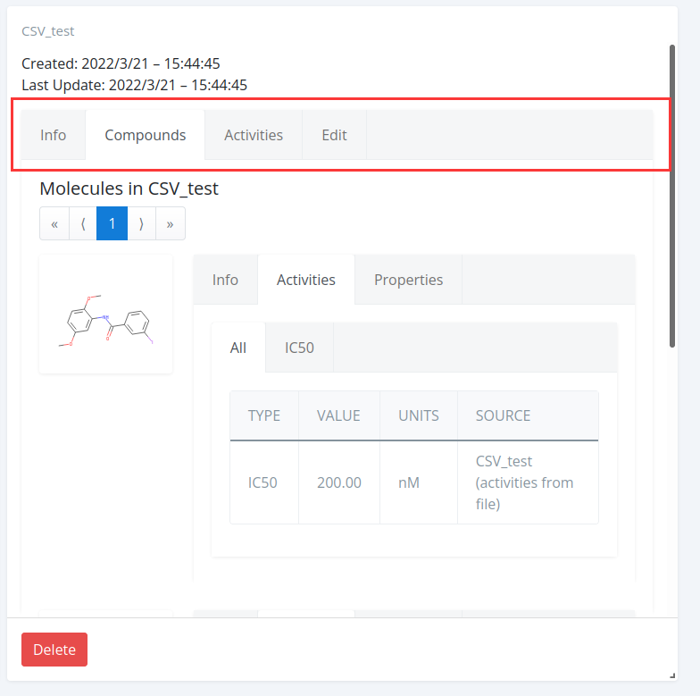
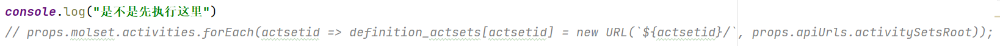

后端
---

依据Django框架搭建

### 安装

Linux系统下运行，Windows系统某些包不支持

```
git clone --branch dev/master git@github.com:martin-sicho/genui.git
conda env create -f environment.yml

#激活环境
source activate genui（上一步新建的环境名）
#安装其他依赖
pip install -r requirements.txt

```

### 启动应用服务器

debug-启用调试的配置。用于开发中的本地部署。

staging-配置用于部署在远程服务器上，但是必须调试成功。

production-在生产中部署

通过`genui.settings.base` 和 `genui.settings.genuibase` 设置模块可以创建自己的配置模块。新模块可以从这两个模块继承。查看 `genui.settings.debug` 的源代码，可以了解如何使用这些基本模块配置新项目。

```python
#激活环境
conda activate genui 

#进入src目录
cd src/

#使用debug模式
export DJANGO_SETTINGS_MODULE=genui.settings.debug configuration

#初始化数据库
python manage.py migrate 

#安装 genui 扩展模块
python manage.py genuisetup 

#运行开发服务器
python manage.py runserver # run the development server
```

第一次启动服务器，需要运行 `migrate` 和 `genuisetup` 命令。`genuisetup` 命令检查当前安装的 GenUI 扩展并运行它们的设置方法。每次安装或更新扩展时都应该运行此命令。<u>执行migrate成功postgresql数据库必须是带有插件的rdkit-postgresql数据库，否则会报错。</u>

如果一切顺利，现在应该可以从输出中显示的端口从 localhost 访问后端应用程序。如果服务器在端口8000上运行，你可以通过 http://localhost:8000/API/服务器来验证这一点，它将显示后端 REST API 文档。

依赖于 PostgreSQL 数据库进行数据存储。配置文件 `genui.settings.debug` 假定数据库服务器对本地主机上的应用程序可用: 5432 端口。

对于其他配置，您应该使用 **POSTGRES_DB**、**POSTGRES_USER**、 **POSTGRES_PASSWORD** 和 **POSTGRES_HOST** 环境变量来告诉应用程序要查找哪个数据库以及要使用哪个凭据。查看 `genui.settings.stage` 和 `genui.settings.prod` 的源文件了解详情。

一切顺利应该能看到下面这个界面


打开后台接口的过程
---

### 先打开开启rdkit-postgresql数据库

杀死占用5432端口(rdkit-postgresql需要使用的端口)的进程

```
sudo fuser -k -n tcp 5432
```

激活配置rdkit-postgresql数据库的环境

```
source activate genui
```

开启数据库，`rdkdata`是数据库数据文件目录

```
/home/xyh/anaconda3/envs/genui/bin/postgres -D rdkdata
```


### 开启后台接口

首先激活后台环境

```
source activate genui
```

执行开启命令

```python
#进入src目录
cd src/

#使用debug模式
export DJANGO_SETTINGS_MODULE=genui.settings.debug configuration


"""
第一次运行需要
#初始化数据库
python manage.py migrate 

#安装 genui 扩展模块
python manage.py genuisetup 
"""

#运行开发服务器
python manage.py runserver # run the development server
```

 如下显示则为成功


### 使用Celery 工作线程来使用后台任务

```
cd src/
export DJANGO_SETTINGS_MODULE=genui.settings.debug
celery worker -A genui -Q celery,gpu --loglevel=info --hostname=debug-worker@%h
```

### 运行测试

```
export DJANGO_SETTINGS_MODULE=genui.settings.test
python manage.py test
```

### 脚本运行

```

#postsql-rdkit数据库启动
#第一次设置
chmod +x ./sqlrun.sh && ./sqlrun.sh
#以后运行只需要，下面同理
./sqlrun.sh

#celery启动
chmod +x ./celery.sh && ./celery.sh

#服务器启动
chmod +x ./guirun.sh && ./guirun.sh
```

如果自己增加扩展需要重新运行

```
python manage.py makemigrations
python manage.py migrate
```


创建超级用户使用后台接口
---

```
python manage.py createsuperuser
```

需要修改以下两个地方

找到秘钥


在manage.py文件中设置秘钥


如果不修改会报以下错误


**修改地址之后会找不到后台接口的静态布局文件，创建成功之后一定要记得改回来**

修改


不修改会报以下的错误


执行成功如下


```

xyh
hdcq5683..

```

接口
---

```
http://127.0.0.1:8000/api/compounds/sets/all/?project_id=2
```


```
http://127.0.0.1:8000/api/compounds/sets/molcsv/?project_id=2
```


```
http://127.0.0.1:8000/api/compounds/sets/molcsv/22/
```


前端
===

Proejct
---

### DashboardLayout.js

> 首页组件是所有组件的父组件，定义左部导航栏等


### ProjectCard.js


### CreateNewCard.js


### CreateNewForm.js


### Projects.js


Compounds
---

### Compounds.js

> 整个Compounds的入口index,定义导入化合物集方式的xxxGrid.js文件。将实现传入`ComponentWithObjects.js`

### ComponentWithObjects.js

> 定义相关函数，并将相关函数和属性传入`CompoundsPage.js`进行渲染

### CompoundsPage.js

> 根据不同的choice添加不同的布局


### GenericNewMolSetForm.js

> 所有创建化合物集的Name和Description的组件并拼接文件处理部分(不同类型的文件的`FormFields.js`)


### 创建csv

#### csv/FormFields.js

> 文件详细添加部分


#### CSVCardNew.js

> 设置从创建csv文件中创建化合物集的参数，并不是视图。参数传入`GenericNewMolSetCard.js` 中


#### GenericNewMolSetCard.js

> 里面有post表单数据的方法，然后将之前的`CSVCardNew.js`中的参数与post方法一起传入`NewMolSetFormRenderer.js`


#### NewMolSetFormRenderer.js

> 将`GenericNewMolSetForm.js`的布局与提交按钮Create结合，并实现数据提交至后台的功能


### CSV数据集可视化

属性传递

```
App->DashboardLayout->Compounds->ComponentWithObjects->CompoundsPage
```


#### CSVCard.js

> 主要设置视图中表格的内容，在compounds中调用`MolsInMolSetList.js`



#### MolsInMolSetList.js

> 设置内容以及布局加载，将属性值传入CompoundListFromAPI.js

```js
return (
    <Row>
      <Col sm="12">
        <h4>Molecules in {molset.name}</h4>
        <CompoundListFromAPI
          {...props}
          activitySetsIDs={molset.activities}
          showInfo={props.showInfo}
          updateCondition={updateCondition}
        />
      </Col>
    </Row>
  );
```


#### CompoundListFromAPI.js

> 进行可视化，表格等渲染


#### GenericMolSetCard.js

> 整个主要界面


#### CompoundList.js

> 定义Info,Activities,Properties的视图是否渲染，可以在这个更改需要展示的表格内容


### 整体CSV数据集界面

#### CSVGrid.js

> 设置CSV文件的处理url,将属性参数传给`GenericMolSetGrid.js`进行视图渲染

#### GenericMolSetGrid.js

> 根据不同xxxxGrid.js传入的参数渲染界面，如果想只展示右边这个界面需要对这个js文件进行修改


为了只显示右边部分,修改如下

```js
{/*{*/}
          {/*  [(*/}
          {/*    <Card key={new_card.id} id={new_card.id}>*/}
          {/*      <NewCardComponent {...this.props} handleCreateNew={this.props.handleAddMolSet}/>*/}
          {/*    </Card>*/}
          {/*  )].concat(existing_cards.map(*/}
          {/*    item => (*/}
          {/*      <Card key={item.id.toString()}>*/}
          {/*        <CardComponent*/}
          {/*          {...this.props}*/}
          {/*          molset={item.data}*/}
          {/*          onMolsetDelete={this.props.handleMolSetDelete}*/}
          {/*        />*/}
          {/*      </Card>*/}
          {/*    )*/}
          {/*  ))*/}
          {/*}*/}
          
          {
            [(
              <Card key={existing_cards.id.toString()}>
                <CardComponent
                  {...this.props}
                  molset={existing_cards.data}
                  onMolsetDelete={this.props.handleMolSetDelete}
                />
              </Card>
            )]
          }
```


Map
---

### ModelCardNew.js

> 根据MapCreateCard.js传来的属性

### ModelInfo.js

> 显示分子地图实现模型的细节


### MapFormFields.js

> 定义以下两个部分函数组件


### ModelCard.js

> 整体框图


去除activity,更改如下


> CompoundOverview.js注释下面部分


> MapTab.js


> Map.js


> MolsetActivitiesSummary.js



> MapSelect.sj

最后只改成就可以了

```
MapSelect.js改成下面这样就行了
```


