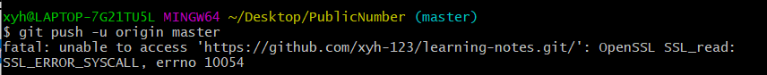

如何将本地文件提交到github上的仓库中
===

git init  //初始化仓库，如果该文件夹是第一次上传，也就是文件夹中没有.git文件，则需要先初始化仓库，否则跳过这一步

#根据需求用其中之一
git add . //将文件夹中的所有文件打包到仓库中
git add hello.txt //将文件夹中的某个文件打包到仓库中

#根据第二步选择
git commit -m "first_commit" //引号中可以自己定义，对应于第二步的git add .
git commit -m hello.txt //对应于第二步的git add .

git remote add 远程版本库的仓名 远程仓库地址 

git push origin master

提交时遇到上面这样的情况，执行下列代码，在执行git push origin master

git config --global http.sslVerify "false"

如果遇到下面这种情况，表示不能用原来的密码验证，必须使用个人访问令牌（personal access token）

[解决链接](https://blog.csdn.net/weixin_41010198/article/details/119698015)

如果 push 等操作没有出现`输入密码选项`，请先输入如下命令，之后就可以看到输入密码选项了

git config --system --unset credential.helper

如果出现 `! [rejected]   master -> master (fetch first)`    

[使用git命令提交远程github仓库的时候提示"rejected"（拒绝）解决办法](https://www.cnblogs.com/jun1019/p/6243295.html)，执行下面代码

git pull

如果是下面显示则表示成功

如果出现`error: RPC failed;`，则执行下面两个代码

 git config --global http.sslVerify false
 git config --global http.postBuffer 1048576000

如果出现 `! [rejected]  master -> master (non-fast-forward)`    

解决链接https://blog.csdn.net/awm_kar98/article/details/89463117，执行下面代码

**git pull --rebase origin master**    //本地生成ReadMe文件
git push origin master

github公式显示问题
===

谷歌扩展程序安装MathJax Plugin for Github插件