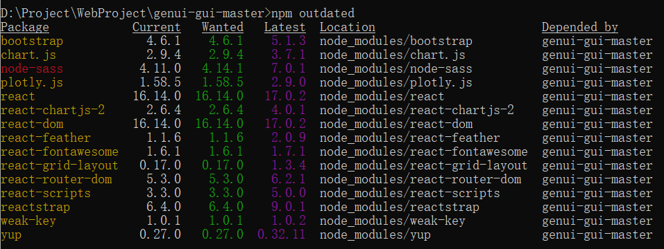
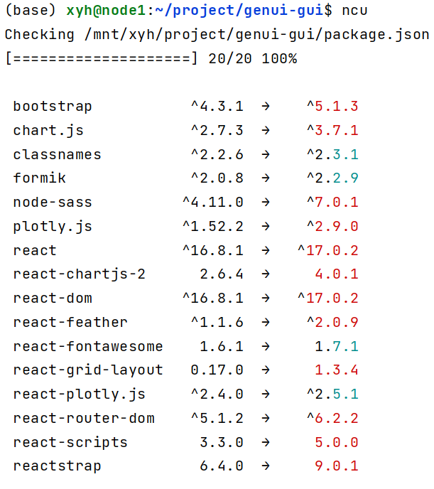
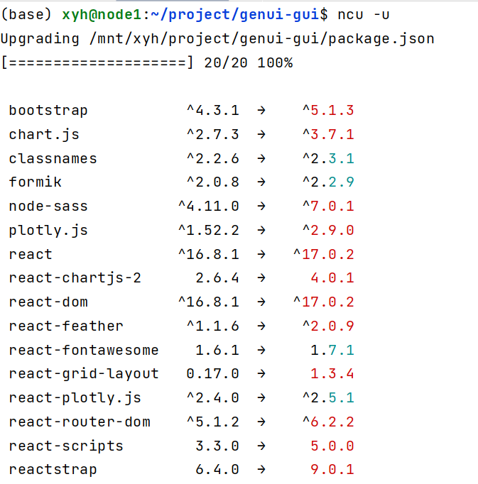

Windows系统下

```
#删除react项目中的node_modules文件夹方法
#该方法也可以删除其他需要权限删除的文件夹
rmdir /s/q  D:\Project\WebProject\genui-gui\node_modules

#或者进入所在文件夹
rmdir /s/q node_modules
```

Linux系统下

```
#先进入文件所在的目录
rm -f /node_modules
```

出现Cannot find module 'xxx' 错误

1. 直接进行npm install重新打包；
2. 如果npm install重新打包之后，仍然出现这个问题，可以进行删除node_modules文件夹，同时清除缓存，如下命令

```
删除当前文件夹下 node_modules目录

npm cache clean --force

npm install 
```


```
#查看当前对过期的包
npm outdated
```




在运行以前的项目前先更新package.json包

- 安装

```
npm install -g npm-check-updates
```

- 显示当前目录下项目中所有新的依赖包

```
ncu
```



- 更新项目package文件

```
ncu -u
```




```
#弹出项目配置，之后可以修改想项目的默认端口和ip
#执行之后需要重新yarn或者npm install一下否则会启动不了项目
npm run eject
```

