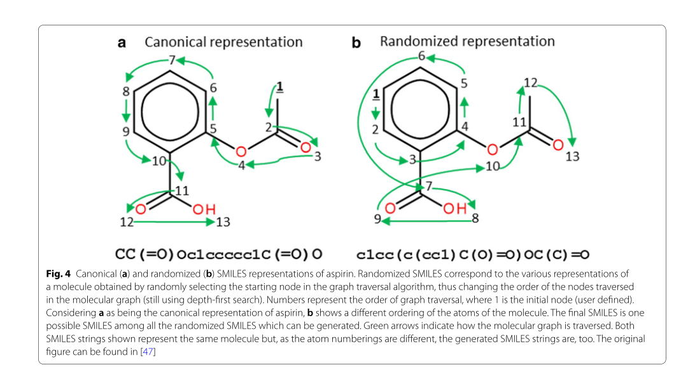
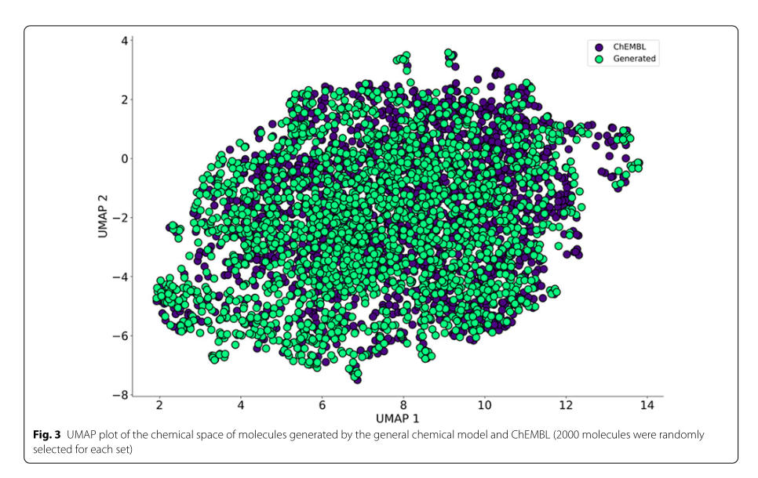
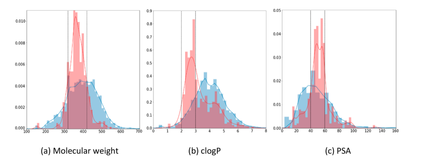
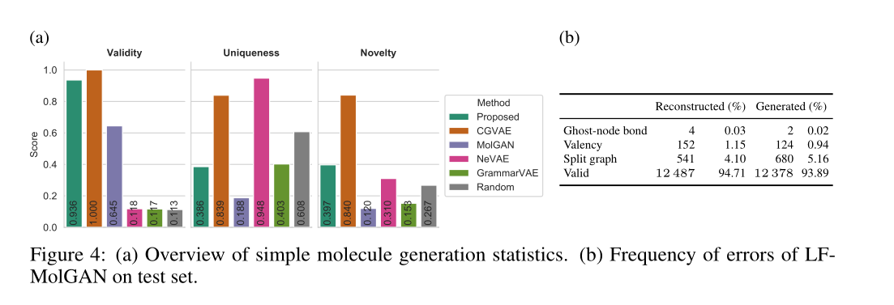
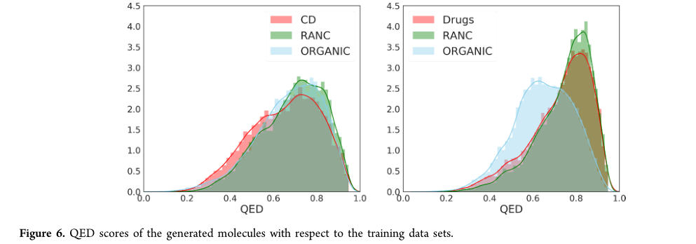
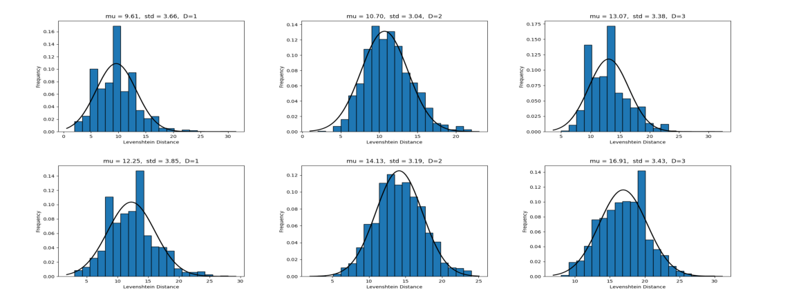
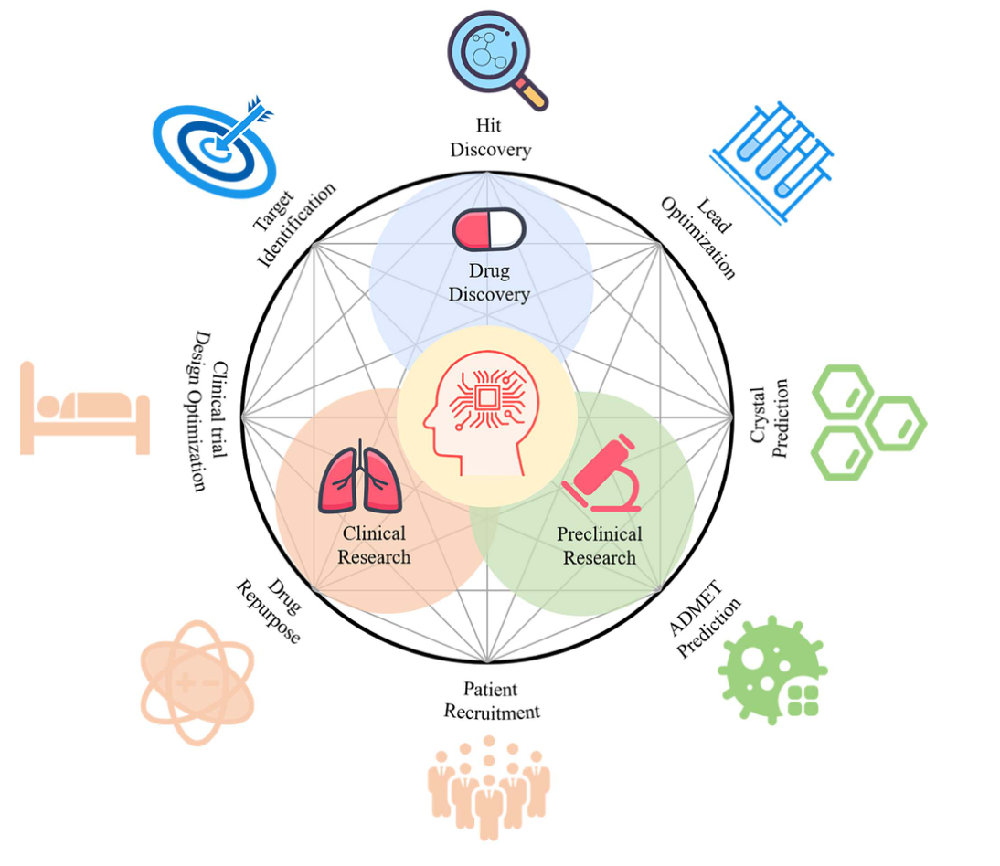
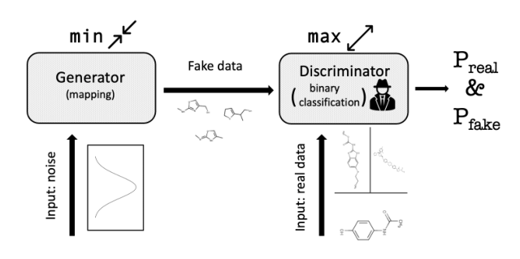
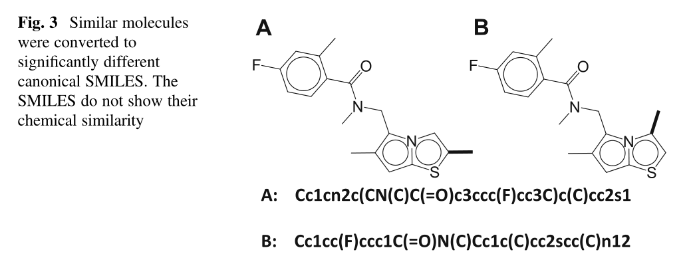

Gupta, R., Srivastava, D., Sahu, M. *et al.* Artificial intelligence to deep learning: machine intelligence approach for drug discovery. *Mol Divers* **25,** 1315–1360 (2021). https://doi.org/10.1007/s11030-021-10217-3

药物设计和开发是制药企业和化学科学家的重要研究领域。然而，低疗效、非靶向给药、耗时和高成本给药物设计和发现带来了障碍和挑战。

人工智能和机器学习技术在药物发现和开发中发挥着至关重要的作用。换言之，人工神经网络和深度学习算法使该领域实现了现代化。

机器学习和深度学习算法已被应用于多肽合成、基于结构的虚拟筛选、基于配体的虚拟筛选、毒性预测、药物监测和释放、药效团建模、定量构效关系、药物重定位、多药理和生理活性等药物发现过程。

与药物设计和开发相关的主要问题是时间消耗和生产成本。此外，低效、不准确的靶向传递和不适当的剂量也是阻碍药物传递和开发过程的其他障碍。

随着技术的进步，结合人工智能算法的计算机辅助药物设计可以消除传统药物设计和开发的挑战和障碍。

人工智能已经被应用于药物设计和开发过程的不同领域，如从肽合成到分子设计，从虚拟筛选到分子对接，从定量构效关系到药物重新定位，从蛋白质错误折叠到蛋白质相互作用，以及从分子途径识别到多元药理学。

Selvaraj, C., Chandra, I. & Singh, S.K. Artificial intelligence and machine learning approaches for drug design: challenges and opportunities for the pharmaceutical industries. *Mol Divers* (2021). https://doi.org/10.1007/s11030-021-10326-z

在早期，制药公司每年大约花费超过50亿美元。在本世纪头十年晚些时候，估计为300亿美元。研发投入增加了约8750亿美元，2010年预计在960亿美元左右。

`强化学习用于使生成的化合物偏向于预测其重要的核心性质。`另一方面，`转移学习作为一种不同的策略被应用于产生具有预期生物活性的有效的新化合物。`

`药物分布是预测血液到肠液和细胞间液药物循环的重要预测指标`，`药物分布的稳态是药物体内剂量与血药浓度的比值。`**预测药物在组织中的稳态分布是评价药物分布机制的重要标准[169]**。

在药物开发过程中，大多数先导分子可能会在临床前和临床毒性方面失效。因此，毒性预测在药物优化应用中是强制性的，并降低了出错的风险。传统上，肝和肾毒性研究是通过基于规则的专家知识和结构警报来预测药物毒性分布[171]。因此，近年来，DL方法被应用于各种化学特征及其优点的自动处理，并在毒性预测方面取得了很好的效果。

亲脂性的预测是药物发现过程中一个重要的物理化学性质，因为亲脂性是调节几个关键药动学性质的关键因素。先导分子的亲脂性明显影响先导分子的膜通透性，并影响ADME的行为[172-177]。

Zhang, Y. (2021). An In-depth Summary of Recent Artificial Intelligence Applications in Drug Design. *ArXiv, abs/2110.05478*.

作为一种在广阔的化学空间中导航的有前途的工具，人工智能(AI)被用于药物设计。从2017年到2021年，最近几个人工智能模型(即图形神经网络(GNN)、递归神经网络(RNN)、变异自动编码器(VAE)、生成性对抗网络(GAN)、流(Flow)和强化学习(RL))在药物设计中的应用数量显著增加。

人工智能(AI)分子设计的研究领域受到了极大的关注，主要是因为人工智能可能是迄今为止最有希望有效探索人类智能无法处理的分子空间的方法。

小分子的一个共同用途是充当治疗疾病的小分子药物。

药物设计是漫长而昂贵的药物发现和开发过程的一部分(Blass，2015；Wong等人，2018年)。整个过程一般包括四个阶段：`1.疾病靶标确定，2.分子筛选和先导发现，3.涉及动物试验的临床前发展，4.涉及人体试验的临床发展(Tonkens，2005)。`**基于人工智能的药物设计有可能极大地简化第二阶段。**

具体地说，它可以识别或产生对疾病靶点有效并具有其他药物特性的分子结构。因此，人工智能可以加快药物发现和开发过程，并增加投资回报。此外，基于人工智能的药物设计方法可以很容易地纳入实验室自动化，这是另一个受到极大研究兴趣的领域(Coley等人，2020a；Coley等人，2020b；Dimitrov等人，2019年)。

近年来，`人工智能在药物设计中的应用主要围绕深度学习(DL)展开`。DL在药物设计中越来越受欢迎主要有三个原因。最明显的是深度学习的理论进步。与图神经网络(GNN)和深度生成模型相关的理论有很大一部分是在过去10年中建立的(Bronstein等人，2017；Guo&赵，2020；Liu&周，2020)。在计算机科学界和化学界的努力下，新的模型及其变体正在迅速地被利用或开发，以解决药物设计中具有挑战性的任务。在药物设计中增加DL使用的另一个原因是分子数据可用性的提高。训练一个多参数的深度神经网络需要大量的数据。目前，有几个大型公共化学数据集包含有关一般分子属性的信息(Gaulton等人，2012年；Kim等人，2016年)。此外，`最近改进的高通量筛选技术可以在实验中以前所未有的快速度获得感兴趣的分子特性`(Baudis等人，2014；David等人，2019年)。然而，作者需要提醒读者，`在许多情况下，低数据可用性和低质量仍然是药物设计中使用的DL模型表现不佳的罪魁祸首`(Walters&Barzilay，2021)。DL在药物设计中流行的第三个原因是硬件的进步。与传统CPU相比，GPU和TPU训练深度神经网络的速度要快得多(Jouppi等人，2017年)。此外，云计算使没有必要硬件的用户可以使用GPU和TPU(Armbrust等人，2010年)。

基于人工智能的药物设计有三个共同目的：分子性质预测、分子生成和分子优化。

分子性质预测主要是确定定量构效关系(QSAR)。在DL出现之前，其他机器学习(ML)技术和计算模型被用于预测QSAR(Chen等人，2018年；Zhang等人，2017年)。当使用包含DL的通用ML时，如果预测分子性质的连续值，则本质上是回归，或者，如果预测离散的类别标签，则是分类。

分子生成也被称为反向QSAR或从头开始的分子设计。具有所需性质的分子可能不在现有的分子数据库中，并且未被探索的化学空间极其广阔。设计分子生成技术的动机主要是在未知的化学空间中导航。深度生成模型最初是为自然语言处理(NLP)和计算机视觉等其他领域开发的，最近在分子生成领域占据主导地位。深度生成模型通常基于RNN、变分自动编码器(VAE)、产生式对抗性网络(GAN)和Flow

1988年开发的SMILES分子表示是基于文本字符串(Weininger，1988)。文本串表示使得许多NLP技术易于应用于药物设计。然而，SMILES并不是分子的自然表现。这促使了分子图的使用，这是一种更容易解释的分子表示

RNN于20世纪80年代提出(Hopfield，1982；Jordan，1986)，适用于处理具有序列结构的数据和不同长度的数据。序列可以是时态的，也可以是非时态的

*(Segler等人,2018a)*,建立基于RNN的三层LSTM层叠生成模型，并将其与迁移学习相结合，在低数据量条件下生成对金黄色葡萄球菌和疟疾具有活性的分子。

`迁移学习用于解决基于人工智能的药物设计中常见的数据不足问题。`在迁移学习中，大数据集通常可用于为相关但不同的任务训练ML模型，以从数据中学习一般特征，然后用较小的数据集为感兴趣的任务重新训练模型。这个过程被称为微调。迁移学习有效地防止了对小数据集的过度拟合

Molgan是在ORGAN的基础上开发的(Guimaraes等人，2017年)。Molgan是第一个使用GaN的基于图形的分子生成模型。

具体地说，Wasserstein  GAN(WGAN)(Arjovsky等人，2017)，一个更稳定的GAN变体，与奖励网络一起使用。该发生器基于MLP，其输入为标准正态分布。该算法同时生成与整个图相关的节点特征矩阵和邻接张量，提高了计算效率。该判别器由Schlichtkrull等人提出的节点序置换不变图卷积网络变体(Relationship-GCN)构成。

隐含地，GaN促进了模拟训练分子的分子的产生。为了促进分子的功能性和新颖性，RL被纳入到模型中。具体地说，为了帮助收敛和最大化近似预期的未来回报，使用了深度确定性政策梯度。奖励是根据外部软件评估产生的分子的性质来分配的。与鉴别器类似，奖励网络也由关系型GCN和MLP构成。为了将奖励网络与GaN连接起来，用WGAN损耗和RL损耗的线性组合的损耗函数来训练生成器。超参数用于调节两个损失之间的权衡。为了确保生成分子的高效性，在生成无效分子时给予零奖励。请注意，由于模型崩溃，从Molgan产生的分子多样性很低，这是GaN的一个常见问题，尽管进行了仔细的调整。此外，Molgan中的一次生成方案(即一次输出分子图)在处理大分子图时会降低模型性能。因此，`Molgan仅适用于节点数较少的图。`因此，只有含有多达九个重原子(即碳、氮、氧和氟)的小分子被用来训练Molgan的鉴别器。

保持分子相似性的一个好处是模拟了药物开发中实际的先导优化过程。

基于人工智能的分子生成和优化为在广阔的未探索的化学空间中导航提供了一种可能的方式。

确保生成或优化的分子的高可合成性是另一个挑战。

已用

Mouchlis, V.D., Afantitis, A., Serra, A., Fratello, M., Papadiamantis, A.G., Aidinis, V., Lynch, I., Greco, D., & Melagraki, G. (2021). Advances in De Novo Drug Design: From Conventional to Machine Learning Methods. *International Journal of Molecular Sciences, 22*.

化学实体的开发及其测试、评估和授权成为上市药物是一个费力且昂贵的过程，容易失败[1]。事实上，据估计，5000种候选药物中只有5种通过临床前测试进入人体测试，其中只有一种进入市场[2]。发现具有所需生物活性的新化学实体对于保持发现管道的运行至关重要[3]。因此，设计用于合成和体外试验的新分子结构对于开发未来患者的新疗法至关重要。尽管最近几十年取得了进展，但众所周知，在寻找新的候选药物时，只对化学空间的一小部分进行了采样。因此，药物和有机化学家在选择、设计和合成适合进入药物发现和开发管道的新分子结构方面面临巨大挑战。

计算机辅助药物设计方法(CADD)已经成为药物发现和开发过程中的有力工具[5]。这些方法包括基于结构的设计，如分子对接和动力学，以及基于配体的设计，如定量结构-活性关系(QSAR)和药效团模型。

从头药物设计(DNDD)是指使用计算生成算法设计符合一组约束条件的新型化学实体[[7]]()。“从头”一词的意思是“从头开始”，表明用这种方法，人们可以在没有起始模板的情况下产生新的分子实体[[8]]()。从头药物设计的优势包括探索更广阔的化学空间，设计构成新知识产权的化合物，开发新的和改进的疗法的潜力，以及以节约成本和时间的方式开发候选药物。从头药物设计中面临的主要挑战是生成的分子结构的合成可及性[9]。

在药物发现中，DL最初被用于QSAR的开发，以预测诸如亲和力、毒性等性质。[80,81].药物发现DL方法的进步导致了使用直接从分子结构计算的分子描述符的全连接神经网络的发展[82]。

Meyers, J., Fabian, B., & Brown, N. (2021). De novo molecular design and generative models. *Drug discovery today*.

化学空间，即跨越所有可能的分子的广阔空间，是巨大的。尽管按照药物发现的标准，列举的VS文库正在变得越来越庞大，许多文库包含超过10亿个分子，但这些文库只占极小的化学空间。此外，当考虑到如此大小的化合物库时，评估方法可能必然会牺牲预测有效性。<u>分子设计方法的任务是平衡对全局解的探索和对局部极小值的开发。</u>

通过使用新设计以定向的方式生成化合物，计算从业者希望更有效地遍历化学空间，在达到最佳化学解决方案的同时，考虑比大型化学库的蛮力筛选所允许的分子更少的分子

**从头分子设计的评价方法**，为了一致地衡量化学结构自动生成方法的进展，标准基准套件的建立是至关重要的。从头设计方法通常是通过它们在独立小任务上的表现来评估的，比如最大化类药物的定量估计(QED)[[4]]()或计算的辛醇-水分配系数(ClogP) [[5]]() 的惩罚形式。尽管这样的目标对于计算和展示优化器产生目标的分子的能力来说是微不足道的，但它们无法捕捉到现实世界药物发现的复杂性。相比之下，评估新设计方法的另一种方法是通过实验演示它们的使用。

标准基准任务套件的发布和可用性从电子角度对新设计方法进行了标准化评估。<u>分子集(MOSES)基准包括一组分布学习任务以及分子有效性和唯一性的度量</u>[[7]]()。**分布学习任务的目的是通过将生成的化学空间与已知化学结构进行比较来度量建议化合物的结构多样性和相关性；**MOSES 还考虑了脚手架(scaffold)和碎片(fragment)的多样性。除了分发基准之外，GuacaMol 基准套件还包括一组更实用的目标导向任务，这些任务模仿了新设计工具的离散使用[[8]]()。

从头设计方法提出的分子可合成性受到广泛关注。**平衡生成的分子的表现性、易优化性和可操作性仍然是一个挑战**。

基于原子的生成器是一种最具表现力的范式，它可以鼓励我们制造以前没有描述过的分子；基于片段的方法，它是实用的，并被限制在一组预定义的构建块中；以及基于反应的新设计工具，它具有本地语法，但更具挑战性的优化问题。

Bian, Y., & Xie, X.S. (2021). Generative chemistry: drug discovery with deep learning generative models. *Journal of Molecular Modeling, 27*.

药物发现是昂贵的。一种新药的开发成本现在可以达到28亿美元，整个发现过程需要12年以上的时间才能完成[[1，2]]()。此外，这些数字还在不断增加。思考和探索高效有效的战略来应对不断增长的成本和加快发现过程是至关重要的。

深度学习(DL)是ML的一个特定子领域，它采用神经网络来强调连续层的学习过程(图1c)。DL方法可以将一个级别的表示转移到更高、更抽象的级别[47]。表示学习的特性使DL方法能够从原始输入数据中发现表示，以用于检测和分类等任务。DL中的单词“深”反映了表示的连续层的这一特性，并且层的数量决定了DL模型的深度[48]。相反，将输入数据转换成一个或两个连续表示空间的传统ML方法有时被称为浅层学习方法。

DL迅速发展的主要原因可能是这种方法为以前无法解决的问题提供了解决方案，并通过简化的表示学习过程优于竞争对手[32，47]。可以预见的是，通过与DL的适当融合，分子设计的过程可以进化成更高效、更有效的方式。

Tong, X., Liu, X., Tan, X., Li, X., Jiang, J., Xiong, Z., Xu, T., Jiang, H., Qiao, N., & Zheng, M. (2021). Generative Models for De Novo Drug Design. *Journal of medicinal chemistry*.

新药开发是一个成本高、风险大、周期长的复杂过程。一种创新药物的开发和投放市场需要数十亿美元和10−15年的时间。

新药的开发涉及先导化合物的发现和优化以及临床研究等多个步骤，其中早期先导化合物的低效发现仍然是一个等待待解决的重要问题。

目前有一些关于化合物及其生物活性的开放获取资源，如ChEMBL、PubChem、和ChemSpider。这些数据库的化合物数量一般在几百万个级别。然而，潜在的类药物化合物的化学空间要大得多，估计在10^23^到10^60^之间。因此，如何更有效地探索如此巨大的空间，寻找具有特殊性质的新分子，是一个极其具有挑战性的问题。

**在合理药物设计的早期阶段，可以通过组合现有化合物的片段6或使用遗传算法等优化算法来构建具有新结构的分子。**7−9 **随着计算机科学和高性能计算的快速发展，人工智能(AI)方法在图像处理、模式识别和自然语言处理等领域取得了成功。**近年来，机器学习，特别是深度学习也被应用于药物发现，如预测化合物的性质和活性，以及它们与蛋白质靶标的相互作用。在过去的几年中，深度生成模型受到了越来越多的关注，它试图学习训练数据的概率分布，提取代表性特征，产生低维的连续表示，并最终从学习的数据分布中采样生成新的数据。生成模型的不同应用在生成图像、文本、语音、12和音乐等方面取得了非凡的效果。13生成模型的发展也为解决药物设计的难题带来了新的思路，被认为是最有前途的药物设计方法之一。

当应用生成模型生成分子时，其本质是学习分子在训练集中的分布，从而获得与训练集中的分子相似但不同的分子。通过结合进化算法或强化学习，可以进一步优化产生的分子的特定性质。

GraphInveNT[119]是专门为比较分子图生成模型而设计的基准测试，但它包含的新模型不多。我们期待，随着基准方法的改进，不同生成模型之间的比较将变得更加规范和客观。

Zhavoronkov等人[56]使用GENTRL分子在21天内发现了DDR1的有效抑制剂。他们在不到2个月的时间里设计、合成并实验验证了以DDR1激酶为靶点的分子，最终获得了一种在实验动物身上具有良好药代动力学特性的候选药物。这个成功的案例说明了生成模式用于快速药物设计的可行性，但我们也需要谨慎，因为生成的分子仍处于药物开发的早期阶段，可能需要进一步评估其在人体上的有效性和安全性。此外，本研究中报道的活性最高的化合物与已知的激酶抑制剂波纳替尼之间的相似性提出了一个问题，即是否可以使用传统的分子优化策略，如片段替换、生物异构、杂环系统重排等，来生成类似的活性分子[136].这项研究还提醒我们，在将生成模型应用于药物设计时，需要对生成分子的新颖性进行严格的评估。

Cheng, Y., Gong, Y., Liu, Y., Song, B., & Zou, Q. (2021). Molecular design in drug discovery: a comprehensive review of deep generative models. *Briefings in bioinformatics*.

深度生成模型自从被提出以来一直是深度学习社区的一个热潮。这些模型旨在通过拟合数据的近似分布来生成新的合成数据，包括图像、视频和文本。在过去的几年里，深层生成模型在药物发现尤其是新分子设计方面表现出了优异的性能。

在人类与疾病的长期斗争中，特别是在最近的2019冠状病毒病大流行(COVID- 19)中，药物发挥着越来越重要的作用。然而，药物的发现过程面临着障碍，这需要大量的人力、物力和财力。

例如，从临床前靶点筛选到最终上市的药物开发周期平均至少需要13.5年[1]。为制药公司开发一种新药需要花费大约18亿美元，失败率也很高。

药物发现的挑战性过程源于化学分子的大而离散的搜索空间[[2]]()。具体来说，类药化合物的可能结构规模在1023 - 1060之间，但其中有一小部分(约108个)与治疗相关[[3,4]]()。传统的方法如高通量筛选[4]是低效的，因为所需的资源数量和少量的命中化合物是不平衡的。大数据和高性能计算能力使人工智能超越了传统的蛮力[5]。随着深度学习的广泛应用，它自然被认为是潜在的药物发现方式。深度学习已被应用于药物的发现和开发，为药物科学提供了一个新的方向。一些相关的应用程序如图1所示。

深度学习的原型是被称为模式识别神经网络的感知器[7]，其目的是学习数据的潜在分布和表示。深度学习的概念在2006年由Hinton等人正式提出，用于解决消失梯度问题。在ImageNet图像识别大赛中，Hinton领导的团队使用了AlexNet模型[9]，该模型通过“ReLU”激活函数消除了消失梯度，引起了轰动。2016年，AlphaGo[10]的胜利证明了深度学习有望超越人类。到目前为止，深度学习已经成功地应用于计算机视觉[11,12]、自然语言处理[13,14]等领域[15,16]。深度神经网络分为判别模型和生成模型。在判别模型的基础上，考虑了异构数据之间的差异，找到了最优分类模型[7]。生成模型建模先验概率，表示同类数据的相似性。

深度生成模型发展迅速，`从给定的样本生成新的合成数据`，包括图像[17]，文本[18]和视频[19]。`分子在计算机中的表示类似于自然语言处理中的文本和社交网络中的图表`。因此，在药物发现[20]中，将这种模型扩展到从头分子设计是很自然的。深层生成模型不同于使用判别模型筛选数据库并将分子划分为活性或非活性，而是`从头设计具有目标特性的新分子`。

MolGPT使用正则表达式，SMILES字符串分解成一组用于训练模型的相关记号。预测的标记是将注意力应用于所有先前生成的标记的结果。MolGPT可以很好地精确地控制用户指定的分子性质和支架。

无条件训练，SMILES标记器对分子SMILES进行标记化，然后在下一个标记预测任务中对模型进行训练。

开始token是通过从训练集的SMILES串中首先出现的token列表中的加权随机抽样获得的。这些标记的权重由它们在训练集中SMILES串的第一位置出现的频率确定。

MolGPT包括堆叠的解码器块，每个解码器块都由一个掩蔽的自我注意力层和完全连接的神经网络组成。每个自注意力层返回大小为256的矢量，该矢量作为完全连接的网络的输入。神经网络的隐含层输出大小为1024的向量，并将其通过Gelu激活层。完全连接的神经网络的最后一层返回大小为256的向量，然后将其用作下一个解码器块的输入。

David, L., Thakkar, A., Mercado, R. *et al.* Molecular representations in AI-driven drug discovery: a review and practical guide. *J Cheminform* **12,** 56 (2020). https://doi.org/10.1186/s13321-020-00460-5

Molecular design in drug discovery: a comprehensive review of deep generative models

VAE

Chemical VAE(2016)

将分子的离散表示转换为多维连续表示。**该模型包含三个部分，编码器、解码器和预测器。**<u>编码器将分子的离散表示转换为实值连续向量，解码器将这些连续向量转换回离散分子表示。预报器根据分子的潜在连续矢量表示来估计化学性质。</u>

Graph VAE

GraphVAE: Towards Generation of Small Graphs Using Variational
Autoencoders

然而，对于基于梯度优化的方法来说，学习生成图是一个困难的问题，因为图是离散结构。与序列(文本)生成不同，图形可以具有任意连通性，并且没有明确的最佳方法来线性化它们在一系列步骤中的构造。另一方面，学习增量构建的顺序涉及到离散的决策，这些决策是不可区分的。

RNN

Segler等人[],建立基于RNN的三层LSTM层叠生成模型，并将其与迁移学习相结合，在低数据量条件下生成对金黄色葡萄球菌和疟疾具有活性的分子。

Segler, M. H., Kogej, T., Tyrchan, C., & Waller, M. P. (2018a). Generating focused

molecule libraries for drug discovery with recurrent neural networks. ACS

central science, 4(1), 120-131.

An In-depth Summary of Recent Artificial Intelligence Applications in Drug Design 

GAN 

于2014年提出，是一种能够隐式学习真实训练数据分布的无似然生成模型。一个基本的GAN由一个发生器和一个鉴别器组成

Goodfellow, I., Pouget-Abadie, J., Mirza, M., Xu, B., Warde-Farley, D., Ozair, S., ...
& Bengio, Y. (2014). Generative adversarial nets. Advances in neural information
processing systems, 27.

OGRAN

Guimaraes, G.L., Sánchez-Lengeling, B., Farias, P.L., & Aspuru-Guzik, A. (2017). Objective-Reinforced Generative Adversarial Networks (ORGAN) for Sequence Generation Models. *ArXiv, abs/1705.10843*.

LatentGAN

Bjerrum, E.J. (2018). Improving Chemical Autoencoder Latent Space and Molecular De Novo Generation Diversity with Heteroencoders. *Biomolecules, 8*.

保持分子相似性的一个好处是模拟了药物开发中实际的先导优化过程。

ML和AI在药物发现中的作用越来越大，人们对新分子设计方法的兴趣也在增长，因为它们能够比VS或人类专家更有效地在极大的化学空间中导航。尽管早期人们对分子设计的自动化方法的使用感到担忧，通常与所建议的分子的不稳定性、反应性、可操作性和合成可行性有关，68我们现在有各种各样的工具可供我们使用，它们是灵敏分子结构的熟练生成器。

Generative AI Models for Drug Discovery

[]Tang, B., Ewalt, J.A., & Ng, H. (2021). Generative AI Models for Drug Discovery. *Biophysical and Computational Tools in Drug Discovery*.

**SMILES的不唯一性源于对SMILES串构造的起始原子的模棱两可，这意味着每个具有N个非氢原子的分子可以至少有N个等价的SMILES串表示。**相同的分子结构可以转化成许多独特的SMILES串.

**对于一些RNN分子生成模型，他们可能只学习SMILES语法的规则，而不是分子结构的知识[32]**。

**SMILES或其他字符串表示不是为了捕捉分子相似性而设计的，所以具有相似化学结构的分子可以被编码成非常不同的SMILES字符串(参见图3)。**同样的分子结构也可以转化成许多不同的、独特的SMILES串

**即使是语法有效的字符串也可能不能编码化学上有效的分子**。

数据集

FCD被设计成将有效性、化学和生物意义包含在一个分数中。FCD计算现实世界分子分布和生成模型产生的分子分布之间的距离。计算真实世界分子分布和生成模型中分子分布的平均值和协方差。然后使用Fréchet distance对这两个分布进行比较。

根据有效性、独特性、新颖性、FCD和KL散度来评估分布学习模型。有效性是对生成的分子是否真实的评估
