ls 查看当前目录下的所有文件


如何创建自己的虚拟环境

```
ssh 主节点名  #进入主节点,mu

conda create -n molgen python=3.7(自己定义版本号)

conda activate 环境名
```

在xshell中删除文件(夹)

```
rm xxx
```

在shell中删除空文件夹

```
rmdir xxx
```

新建文件夹

```
mkdir xxx
```

将xshell中的文件下载到本地

```
sz xxx
```

服务器如何更换密码

```
password xyh(用户名)
```

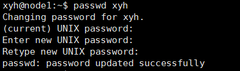

查看当前所在路径

```
pwd
```

重命名文件（夹）

```
mv A B #将文件A重命名为B
```

服务器上如何安装anaconda
---

首先在官网上下载Linux的安装包，然后将安装包上传到服务器上(注意安装包所在文件夹不能命名为anaconda3)

然后执行shell命令进行安装

```
bash Anaconda3-2021.11-Linux-x86_64.sh
```


Ctrl+d 退出python命令行

linux vi 报错 E37: No write since last change (add ! to override)

用 vi 命令编辑文本文件，没有文件写入权限的时候会报这个错。:q  :wq  怎么都不能退出。这时只需 ctrl+z 即可，或者在退出命令后加 ! 忽略提示   :q!


服务器如何查看cuda的版本

```
cat /usr/local/cuda/version.txt
```

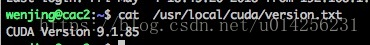


Pycharm连接服务器在服务器上跑代码
---

file->setting->Python Interpreter

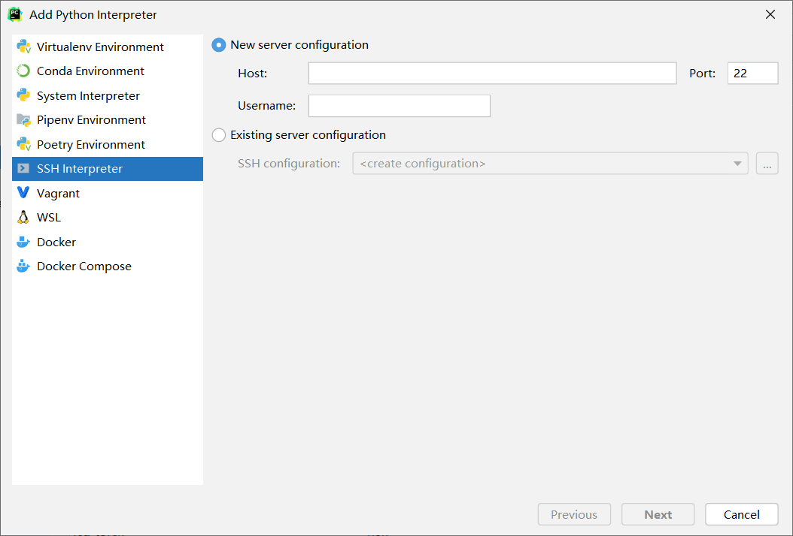

输入服务器用户名和密码后

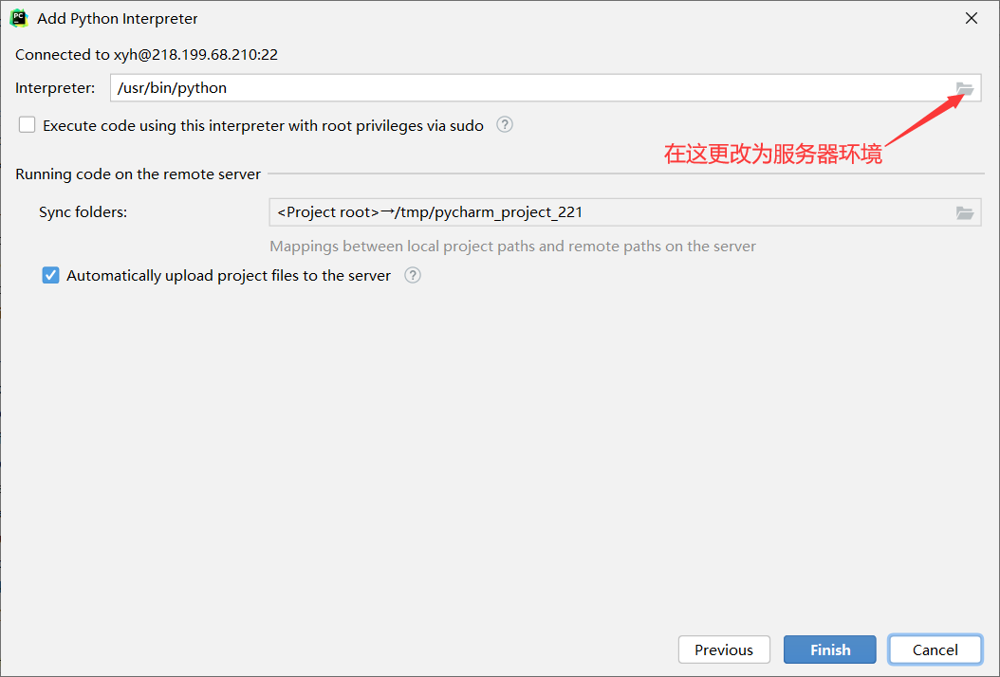

找到自己创建的环境目录中的python3.7.exe文件(版本号对应自己的环境)

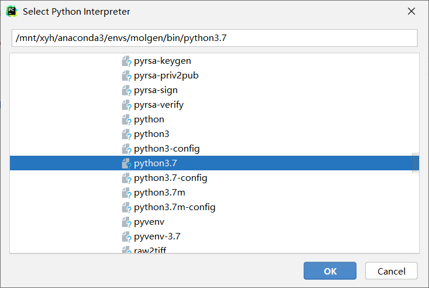

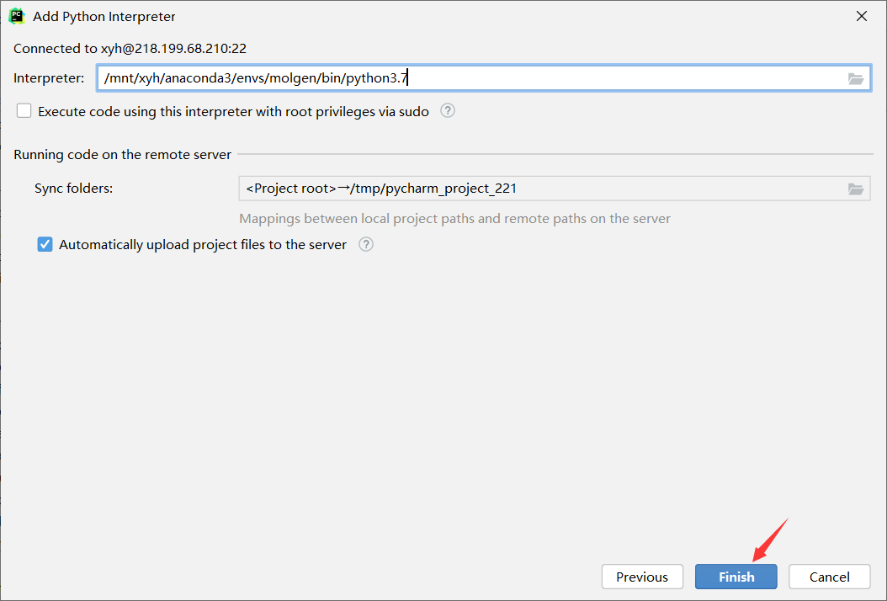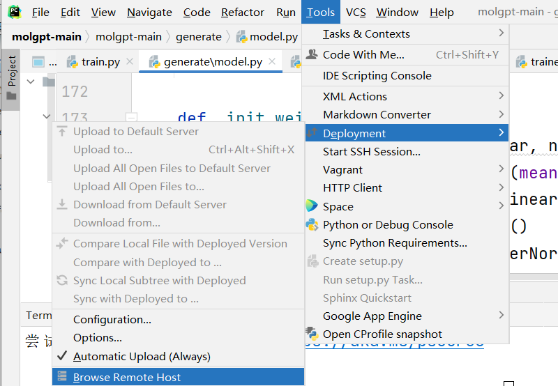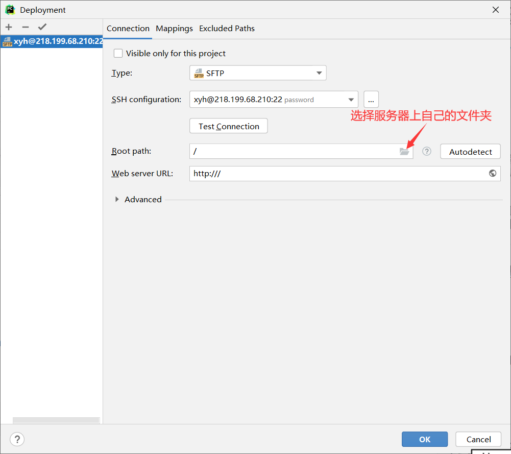

之后将本地项目长传至服务器

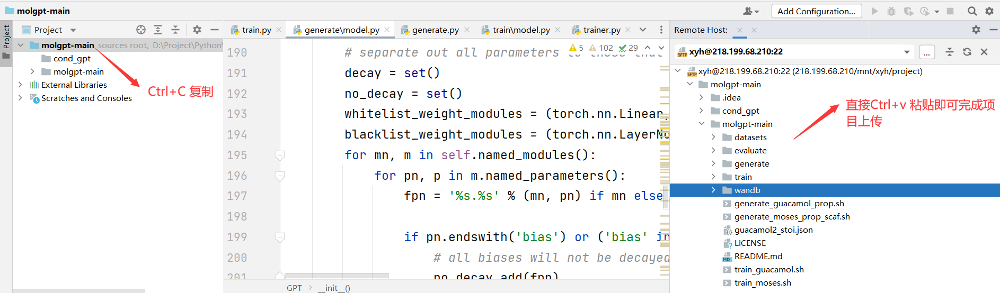

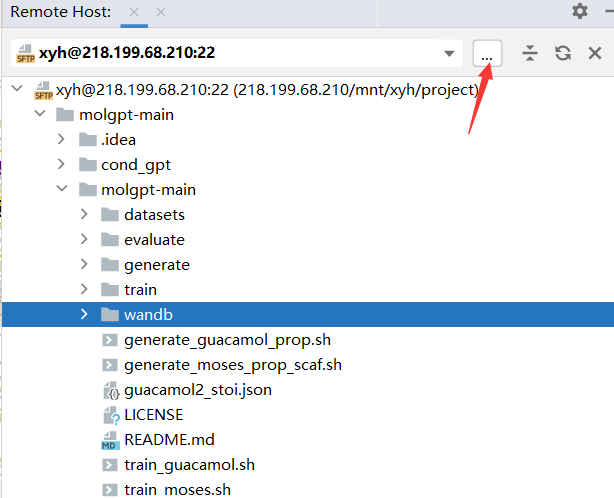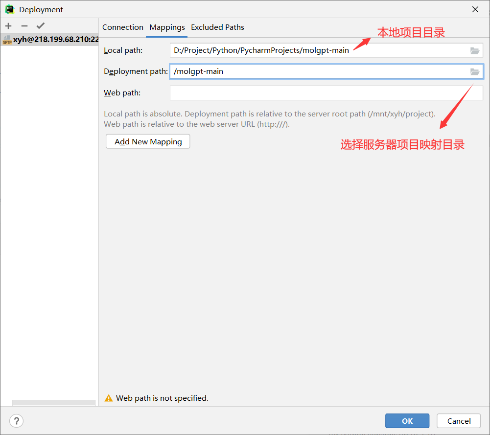

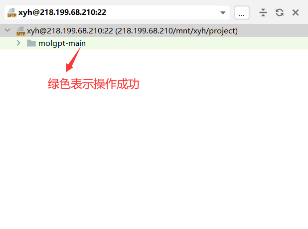

更新项目中的单个文件时，右键文件选择Deployment->Upload …

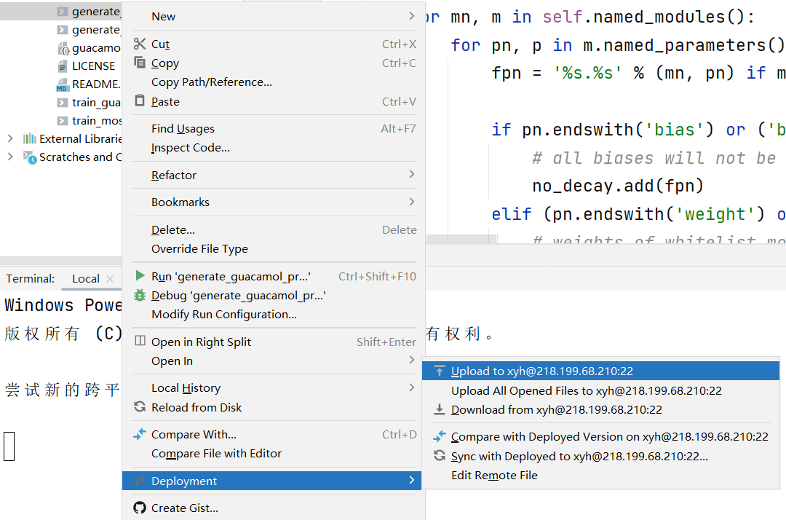

要使用Pycharm自带的terminal需要开启SSH terminal服务。**file | Setting | Tool | SSH Terminnal** 下 **Deployment server** 选择之前配置好的。

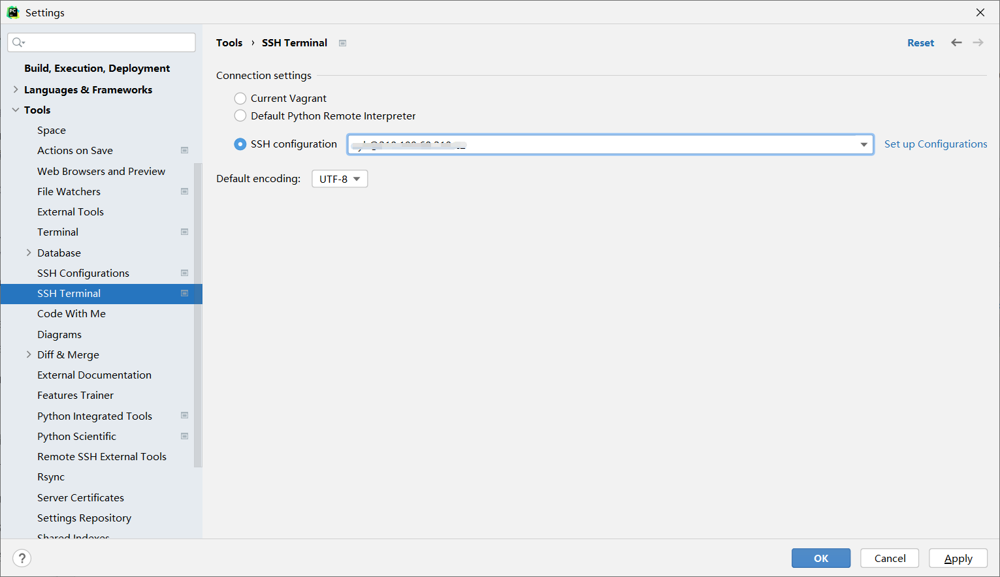

启动SSH Terminal：**Tool | Start SSH session…**

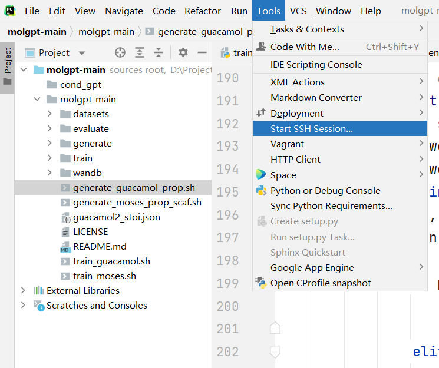启动之后如下图所示

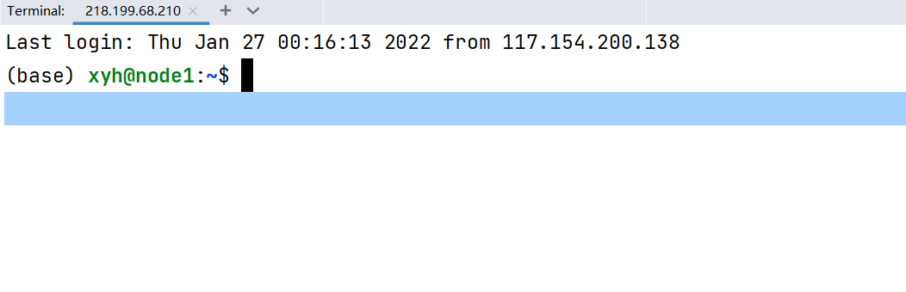

服务器GPU状态查询
---

可以查询所有nvidia显卡

```
grep -i nvidia    
```

 可以查看显卡具体属性

```
lspci -v -s [显卡编号]
```

可以查看显卡的显存利用率，查看当前Ubuntu平台的GPU数量

```
nvidia-smi 
```

