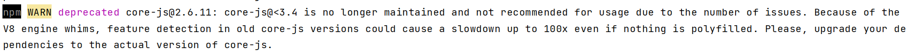

Linux常用命令
---

ls 查看当前目录下的所有文件

ls -a 查看.开头的隐藏文件


如何创建自己的虚拟环境

```
ssh 主节点名  #进入主节点,mu

conda create -n molgen python=3.7(自己定义版本号)

conda activate 环境名
```

在xshell中删除文件(夹)

```
rm xxx 
rm -rf xxx
```

在shell中删除空文件夹

```
rmdir xxx
```

新建文件夹

```
mkdir xxx
```

将xshell中的文件下载到本地

```
sz xxx
```

服务器如何更换密码

```
password xyh(用户名)
```


查看当前所在路径

```
pwd
```

重命名文件（夹）

```
mv A B #将文件A重命名为B
```

加压文件

```
#解压到当前文件夹
unzip xxx.zip
```


服务器上如何安装anaconda
---

首先在官网上下载Linux的安装包，然后将安装包上传到服务器上(注意安装包所在文件夹不能命名为anaconda3)

然后执行shell命令进行安装

```
bash Anaconda3-2021.11-Linux-x86_64.sh
```


Ctrl+d 退出python命令行

linux vi 报错 E37: No write since last change (add ! to override)

用 vi 命令编辑文本文件，没有文件写入权限的时候会报这个错。:q  :wq  怎么都不能退出。这时只需 ctrl+z 即可，或者在退出命令后加 ! 忽略提示   :q!


服务器如何查看cuda的版本

```
cat /usr/local/cuda/version.txt
```


Pycharm连接服务器在服务器上跑代码
---

file->setting->Python Interpreter


输入服务器用户名和密码后


找到自己创建的环境目录中的python3.7.exe文件(版本号对应自己的环境)


之后将本地项目长传至服务器


更新项目中的单个文件时，右键文件选择Deployment->Upload …


要使用Pycharm自带的terminal需要开启SSH terminal服务。**file | Setting | Tool | SSH Terminnal** 下 **Deployment server** 选择之前配置好的。


启动SSH Terminal：**Tool | Start SSH session…**

启动之后如下图所示


服务器GPU状态查询
---

可以查询所有nvidia显卡

```
grep -i nvidia    
```

 可以查看显卡具体属性

```
lspci -v -s [显卡编号]
```

可以查看显卡的显存利用率，查看当前Ubuntu平台的GPU数量

```
nvidia-smi 
```

查看文件的修改时间
---

```
stat filename
```

Access Time：简写为atime，表示文件的访问时间。当文件内容被访问时，更新这个时间 

Modify Time：简写为mtime，表示文件内容的修改时间，当文件的数据内容被修改时，更新这个时间。 

Change Time：简写为ctime，表示文件的状态时间，当文件的状态权限被修改时，更新这个时间，例如文件的链接数，大小，权限，Blocks数。


**~** 表示代码主目录，也就是当前登录用户的用户目录。
比如：我登录用户是xyh
cd ~
~ 代表的就是 /home/xyh/


非root用户如何安装nodejs
---

1. 首先在官网中下载好安装包，在服务器中解压

   ```
   #下载安装包，注意版本
   wget https://nodejs.org/dist/v15.7.0/node-v15.7.0-linux-x64.tar.xz
   #解压
   tar -xvf node-v15.7.0-linux-x64.tar.xz
   #重命名
   mv node-v15.7.0-linux-x64. nodejs
   ```

2. 将nodejs添加到环境变量中

   ```
   #打开/.bashrc文件
   gedit ~/.bashrc 
   #在最后一行写入,注意路径和文件名
   export PATH=~/nodejs/bin:$PATH
   ```

3. 最后执行保存命令

```
source ~/.bashrc
```

   4.检查

```
#查看是否是自己安装的版本
node -v
```


node-sass安装失败



查询某个软件的安装路径

```
whereis nginx   // 查看软件安装路径
```


WebStorm如何连接服务器
---


Linux非root用户安装及配置nginx
---

首先安装两个依赖包[pcre](http://www.pcre.org/)和[zlib](http://www.zlib.net/)，Openssl然后安装nginx,

1.安装zlib

`zlib-1.2.11`为依赖包的解压路径

`mnt/xyh/soft/zlib`为依赖包的安装路径

```
cd zlib-1.2.11
./configure --prefix=/mnt/xyh/soft/zlib
make && make install
```

2.安装pcre

选择pcre, 别选pcre2


`pcre-8.45`为依赖包的解压路径

`mnt/xyh/soft/pcre`为依赖包的安装路径

```
cd pcre-8.45
./configure --prefix=/home/zdliu/open/pcre
make && make install
```

3.安装Openssl

Openssl依赖包安装与前两者类似，但是需要配环境

```
cd penssl-1.1.1m
./configure --prefix=/mnt/xyh/soft/openssl
make && make install
```

配环境

```
gedit ~/.bashrc
export PATH="/local/ssl/bin:$PATH"
export LIBRARY_PATH="/local/ssl/lib:$LIBRARY_PATH"
export LD_LIBRARY_PATH="/local/ssl/lib:$LD_LIBRARY_PATH"

#最后要执行保存命令
source ~/.bashrc
```

3.安装nginx

`/mnt/xyh/soft/nginx` 为安装路径

`/mnt/xyh/soft/pcre-8.45` pcre依赖包的解压路径，不是安装路径

`/mnt/xyh/soft/zlib-1.2.11` zlib依赖包的解压路径，不是安装路径

```
cd nginx-1.20.2m

./configure --prefix=/mnt/xyh/soft/nginx --with-http_stub_status_module --with-pcre=/mnt/xyh/soft/pcre-8.45 --with-zlib=/mnt/xyh/soft/zlib-1.2.11 --with-openssl=/mnt/xyh/soft/openssl-1.1.1m --with-http_ssl_module 
make && make install
```

4.配环境

如果不配环境依然是使用root版本的nginx


`/mnt/xyh/soft/nginx`是nginx的安装路径

```
gedit ~/.bashrc
添加一行
export PATH="/mnt/xyh/soft/nginx/sbin:$PATH"

#最后要执行保存命令
source ~/.bashrc
```


**conf 目录**
Nginx 所有配置文件的目录，极其重要。在该目录中包含一个 nginx.conf 配置文件。
**html 目录**
Nginx 的默认站点目录。
**logs 目录**
存放 Nginx 的日志文件。 access.log error.log
**sbin 目录**
Nginx 命令的目录，如 Nginx 的启动命令。

5.验证

非root用户不能使用1024以下的端口，所以要先改端口

修改端口号，在解压文件里面找到nginx.conf文件更改端口，一些其他的配置也在这个文件中改


```
#进入刚才ngix的安装路径
cd nginx
sbin/nginx 
```

```
netstat -nlp | grep 3000
```


在服务器上输入IP地址（不要输入刚才设置的端口号），不然显示不出来


查看某个端口是否有程序占用

```
netstat -anon | grep 3000
```


杀死端口进程

```
fuser -k 3000/tcp
```


再重启nginx


查看服务器端口是否开放,在自己电脑的cmd上运行

```
telnet ip 端口
```


表示该端口没有对外开放

将代码在服务器后台运行
---

输出将会写入map.log文件中

```
nohup python -u map.py --run_name moses  > map.log 2>&1 &
```

查看后台任务

```
ps -aux | grep "map.py"
```


`21771`表示进程号

运行结束时


想要提前结束进程时

```
kill -9 进程号
```


