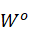

[1] Kola, I.; Landis, J. Can the pharmaceutical industry reduce attrition rates? Nat. Rev. Drug Discov. 2004, 3, 711–716.

[2] Torjesen, I. Drug Development: The Journey of a Medicine from Lab to Shelf. Available online:https://www.pharmaceutical-journal.com/publications/tomorrows-pharmacist/drug-development-the-journey-of-a-medicine-from-lab-to-shelf/20068196.article?firstPass=false (accessed on 10 December 2020).

[3] Chan, H. S.; Shan, H.; Dahoun, T.; Vogel, H.; Yuan, S., Advancing drug discovery via artificial intelligence.Trends in pharmacological sciences 2019.

[4] Dickson, M.; Gagnon, J. P., The cost of new drug discovery and development. Discovery medicine 2009,4, 172-179.

[5] D. G. Brown, H. J. Wobst. A decade of fda­approved drugs (2010–2019): Trends and futuredirections[J]. Journal of Medicinal Chemistry, 2021


[6] Mullard A. The drug-maker’s guide to the galaxy. Nature News 2017; 549(7673): 445.

[7] Polishchuk PG, Madzhidov TI, Varnek A. Estimation of the size of drug-like chemical space based on GDB-17 data. J Comput Aided Mol Des 2013; 27(8): 675–9.


[8] Hert J, Irwin JJ, Laggner C, et al. Quantifying biogenic bias in screening libraries. Nat Chem Biol 2009; 5(7): 479–83.

[9] Schneider, P.; Schneider, G. De Novo Design at the Edge of Chaos. J. Med. Chem. 2016, 59, 4077–4086.

[10] Devi, R.V.; Sathya, S.S.; Coumar, M.S. Evolutionary algorithms for de novo drug design—A survey. Appl. Soft Comput. 2015, 27,543–552.


[11] Brown, N., Fiscato, M., Segler, M.H., & Vaucher, A.C. (2019). GuacaMol: Benchmarking Models for De Novo Molecular Design. *Journal of chemical information and modeling, 59 3*, 1096-1108 .

[12] Polykovskiy, D., Zhebrak, A., Sánchez-Lengeling, B., Golovanov, S., Tatanov, O., Belyaev, S., Kurbanov, R., Artamonov, A., Aladinskiy, V., Veselov, M., Kadurin, A., Nikolenko, S.I., Aspuru-Guzik, A., & Zhavoronkov, A. (2020). Molecular Sets (MOSES): A Benchmarking Platform for Molecular Generation Models. *Frontiers in Pharmacology, 11*.

[13]Hilten, N.V., Chevillard, F., & Kolb, P. (2019). Virtual Compound Libraries in Computer-Assisted Drug Discovery. *Journal of chemical information and modeling, 59 2*, 644-651 .

[14] Weininger, D. (1988). SMILES, a chemical language and information system. 1. Introduction to methodology and encoding rules. J. Chem. Inf. Comput. Sci., 28, 31-36.


[16] Imrie, F.; Bradley, A. R.; van der Schaar, M.; Deane, C. M., Deep Generative Models for 3D Linker Design.

Journal of Chemical Information and Modeling 2020, 60, 1983-1995.

[17] Gómez-Bombarelli, R., Duvenaud, D.K., Hernández-Lobato, J., Aguilera-Iparraguirre, J., Hirzel, T.D., Adams, R.P., & Aspuru-Guzik, A. (2018). Automatic Chemical Design Using a Data-Driven Continuous Representation of Molecules. *ACS Central Science, 4*, 268 - 276.

[18] Simonovsky, M., & Komodakis, N. (2018). GraphVAE: Towards Generation of Small Graphs Using Variational Autoencoders. *ICANN*.

[19] Mohammadi S, O'Dowd B, Paulitz-Erdmann C, Goerlitz L. Penalized Variational Autoencoder for Molecular Design. ChemRxiv. Cambridge: Cambridge Open Engage; 2019; This content is a preprint and has not been peer-reviewed.

[20] Flam-Shepherd, D., Wu, T.C., & Aspuru-Guzik, A. (2021). MPGVAE: improved generation of small organic molecules using message passing neural nets. *Machine Learning: Science and Technology*.

[21]Goodfellow, I., Pouget-Abadie, J., Mirza, M., Xu, B., Warde-Farley, D., Ozair, S., ...
& Bengio, Y. (2014). Generative adversarial nets. Advances in neural information
processing systems, 27.
[22]Guimaraes, G.L., Sánchez-Lengeling, B., Farias, P.L., & Aspuru-Guzik, A. (2017). Objective-Reinforced Generative Adversarial Networks (ORGAN) for Sequence Generation Models. *ArXiv, abs/1705.10843*.

[23]Sánchez-Lengeling, B., Outeiral, C., Guimaraes, G.L., Alán, & Aspuru-Guzik (2017). Optimizing distributions over molecular space . An Objective-Reinforced Generative Adversarial Network for Inverse-design Chemistry ( ORGANIC ).

[24]De Cao, N., & Kipf, T. (2018). MolGAN: An implicit generative model for small molecular graphs. *ArXiv, abs/1805.11973*.


[25]Tsujimoto, Y., Hiwa, S., Nakamura, Y., Oe, Y., & Hiroyasu, T. (2021). L-MolGAN: An improved implicit generative model for large molecular graphs.

[26] Blanchard, A.E., Stanley, C., & Bhowmik, D. (2021). Using GANs with adaptive training data to search for new molecules. *Journal of Cheminformatics, 13*.

[27]Hochreiter S, Schmidhuber J. Long short-term memory. Neu-ral Comput 1997; 9(8): 1735–80.

[28]Cho K, vanMerriënboer B, Gulcehre C, et al. Learning phrase representations using RNN encoder–decoder for statistical machine translation. In: Proceedings of the 2014 Conference on
Empirical Methods in Natural Language Processing, 2014, 1724–34.Association for Computational Linguistics.

[29]Segler, M.H., Kogej, T., Tyrchan, C., & Waller, M.P. (2018). Generating Focused Molecule Libraries for Drug Discovery with Recurrent Neural Networks. *ACS Central Science, 4*, 120 - 131.

[30]Popova, M., Shvets, M., Oliva, J.B., & Isayev, O. (2019). MolecularRNN: Generating realistic molecular graphs with optimized properties. *ArXiv, abs/1905.13372*.

[31]Grisoni, F., Moret, M., Lingwood, R., & Schneider, G. (2020). Bidirectional Molecule Generation with Recurrent Neural Networks. *Journal of chemical information and modeling*.

[32]Madhawa, K., Ishiguro, K., Nakago, K., & Abe, M. (2019). GraphNVP: An Invertible Flow Model for Generating Molecular Graphs. *ArXiv, abs/1905.11600*.

[33]Shi, C., Xu, M., Zhu, Z., Zhang, W., Zhang, M., & Tang, J. (2020). GraphAF: a Flow-based Autoregressive Model for Molecular Graph Generation. *ArXiv, abs/2001.09382*.

[34]Zang, C., & Wang, F. (2020). MoFlow: An Invertible Flow Model for Generating Molecular Graphs. *Proceedings of the 26th ACM SIGKDD International Conference on Knowledge Discovery & Data Mining*.

[35] Durk P Kingma and Prafulla Dhariwal. 2018. Glow: Generative flow with in-vertible 1x1 convolutions. In Advances in Neural Information Processing Systems.
10215–10224.

[36]Krenn, M., Hase, F., Nigam, A., Friederich, P., & Aspuru-Guzik, A. (2020). Self-referencing embedded strings (SELFIES): A 100% robust molecular string representation. *Mach. Learn. Sci. Technol., 1*, 45024.

[37] Vaswani, A., Shazeer, N.M., Parmar, N., Uszkoreit, J., Jones, L., Gomez, A.N., Kaiser, L., & Polosukhin, I. (2017). Attention is All you Need. *ArXiv, abs/1706.03762*.

[38]Radford, A., & Narasimhan, K. (2018). Improving Language Understanding by Generative Pre-Training.


[ChEMBL 24]Gaulton, A., Hersey, A., Nowotka, M., Bento, A.P., Chambers, J., Mendez, D., Mutowo-Meullenet, P., Atkinson, F., Bellis, L.J., Cibrián-Uhalte, E., Davies, M., Dedman, N., Karlsson, A., Magariños, M.P., Overington, J.P., Papadatos, G., Smit, I., & Leach, A.R. (2017). The ChEMBL database in 2017. *Nucleic Acids Research, 45*, D945 - D954.


[BRICS]On the art of compiling and using 'drug-like' chemical fragment spaces

[]The Properties of Known Drugs

FCD

[] Preuer, K.; Renz, P.; Unterthiner, T.; Hochreiter, S.; Klambauer,G. Fréchet ChemNet Distance: A Metric for Generative Models for Molecules in Drug Discovery. J. Chem. Inf. Model. 2018, 58, 1736−1741.

KL散度

[]Kullback, S.; Leibler, R. A. On information and sufficiency. Ann.Math. Stat. 1951, 22, 79−86.
$$
D _ { K L } ( P , Q ) = \sum _{ i }P(i)\log\frac { P ( i ) } { Q ( i ) }
$$

$$
S = \frac { 1 } { k } \sum _ { i } ^ { k } e x p ( - D _ { K L , i } )
$$


$$
{ FCD (G ,D) = ||u _{G}-H_{D}||^{ 2 } + T _ { r } (\sum _{G}+\sum_{D}}{ - 2 ( \sum _ { G } \sum _ { D } ) ^ { 1 / 2 } ) }
$$

$$
S = e x p ( - 0.2 F C D )
$$

$$
Q E D = e x p ( \frac { 1 } { n } \sum _ { i = 1 } ^ { n } \ln d _ { i } )
$$

$$
IntDiv_p( G ) = 1 - \sqrt [p] { \frac{1}{|G|^2} \sum _ { m_1,m_2 \in G}T( m_1, m_2 ) ^ { p }} 
$$

[] Benhenda, M. (2017). ChemGAN challenge for drug discovery: can AI reproduce natural chemical diversity? *ArXiv, abs/1708.08227*.


[33]Ma, C., & Zhang, X. (2021). GF-VAE: A Flow-based Variational Autoencoder for Molecule Generation. *Proceedings of the 30th ACM International Conference on Information & Knowledge Management*.


[21]Osakabe, Y., & Asahara, A. (2021). MatVAE: Independently Trained Nested Variational Autoencoder for Generating Chemical Structural Formula. *AAAI Spring Symposium: MLPS*.
$$
U = \{ u _ { 1 } , \cdots , u _ { n } \}
$$

$$
L _ { 1 } (U) = \sum _ { i } \log P ( u _ { i } | u _ { i - k}  , \cdots , u _ { i - 1 } ; \Theta )
$$


$$

$$

$$
\begin{aligned}
&h _ { 0 } = U W _ { e } + W _ { p }\\
&h _ { l } =  transformer\_block( h _ { l - 1 } )\forall_i\in[ 1 , n ]\\
&P ( u ) = softmax( h _ { n } W _ { e } ^ { T } )
\end{aligned}
$$

$$

$$

$$
U = ( u _ { - k } , \cdots , u _ { - 1 } )
$$

$$
P ( y | x ^ { 1 } , \cdots , x ^ { m } ) = softmax( h _ { i } ^ { m } W _ { y } )
$$


$$
L _ { 2 } ( C ) = \sum _ { ( x , y ) } \log P ( y | x ^ { 1 } , \cdots , x ^ { m } )
$$

$$
L _ { 3 } ( C ) = L _ { 2 } ( C ) + \lambda * L _ { 1 } ( C )
$$

$$
( Q , K , V ) = \operatorname { softmax } ( \frac { Q K ^ { T } } { \sqrt { d _ { k } } } ) V 
$$


$$
MultiHead( Q , K , V ) = Concat(head_1,head_2,...,head_h)W^O\tag{2-2}
$$

$$
head_i=Attention(QW_i^{Q},KW_i^{K},VW_i^{V})
$$

$$
W _ { i } ^ { Q } \in \mathbb{R}^{d_{model}×d_k},W _ { i } ^ { K } \in \mathbb{R}^{d_{model}×d_k},W _ { i } ^ { V } \in \mathbb{R}^{d_{model}×d_v},W _ { i } ^ { O } \in \mathbb{R}^{h_{dv}×{d_{model}}}
$$

都是参数矩阵


Greedy Decoding
$$
\hat{y}_{t} = \operatorname { argmax } P ( y _ { t } = w | y _{\lt t} ),w \in V
\tag{6}
$$

$$
\hat y _ { t'}=\underset {y \in \mathcal{Y} } {argmax} P ( y | y _ { 1 } , \cdots , y _ { t '-1 } , \mathbf{c} )
$$

温度采样
$$
P ( x _ { i } | x _ { 1 : i - 1 } ) = \frac {  exp(u_i/ t ) } { \sum _ { j }  exp( u _ { j } / t ) }
$$

$$
\frac { 1 } { L ^ { \alpha } } \log P ( y _ { 1 } \cdots , y _ { L } | c ) = \frac { 1 } { L ^ { \alpha } } \sum _ { t' = 1 } ^ { L } \log P ( y _ { t ^ { \prime } } | y _ { 1 }, \cdots , y _ { t } ^ { \prime } - 1 , c )
$$

Top-k

Angela Fan, Mike Lewis, and Yann Dauphin. 2018. Hi-
erarchical neural story generation. arXiv preprint
arXiv:1805.04833
$$
q(v) = \begin{cases}
p_{\theta}(v|y_{\lt t},C) ,&\text{if v} \in V_k ,\\
b ,&\text{otherwise.}\\
\end{cases}\\
$$

$$
V_k=\underset {v'}  {arg\:topk}\ p_{\theta}( v'| y_{\lt t},\mathbf{c} )
$$

Top-K重采
$$
\hat p _ { i } = \frac { p _ { i } ^ { \prime } } { \sum _ { j = 1 } ^ { |V| } p _ { j } ^ { \prime } }
$$

$$
p _ { i } ^ { \prime } = \operatorname { exp } ( \log ( p _ { i } ) / T ) \cdot \mathbf{1} \{ i \leq K \}
$$

核采样
$$
\sum _ { x \in V ^{(p)} } P ( x | x _ { 1 : i - 1 } ) \geq p
$$

$$
p'=\sum _ { x \in V ^{(p)} } P ( x | x _ { 1 : i - 1 } )
$$

$$
P '( x | x _ { 1 : i - 1 } ) = \begin{cases}
P ( x | x _ { 1 : i - 1 } )/p'  ,&\text{if x} \in V^{(p)},\\
0 ,&\text{otherwise.}\\
\end{cases}\\
$$

```
option = {
  legend: {
     textStyle: {
      //图例字体大小
      fontSize: 20,
    },
    //图例大小
    itemHeight: 20,
  },
  tooltip: {},
  dataset: {
    dimensions: ['product', 'gua','top_p=0.9', 'top_p=0.95', 'top_k=44,temp=1','top_k=44,temp=0.8'],
    source: [
      { product: 'FCD','gua':1.34,'top_p=0.9': 1.407, 'top_p=0.95': 1.04, 'top_k=44,temp=1': 0.926,'top_k=44,temp=0.8':1.22},
      { product: 'KL Divergence', 'gua':0.974,'top_p=0.9': 0.982, 'top_p=0.95': 0.986, 'top_k=44,temp=1': 0.974,'top_k=44,temp=0.8':0.985},
    
    ]
  },
  xAxis: { type: 'category' ,
    axisLabel: {
       show: true,
        textStyle: {
          fontSize : 20 ,     //更改坐标轴文字大小
          color:'Black'
        }
     },
  },
  yAxis: {
    axisLabel: {
       show: true,
        textStyle: {
          fontSize : 20,      //更改坐标轴文字大小
           color:'Black'
        }}
  },
  // Declare several bar series, each will be mapped
  // to a column of dataset.source by default.
  series: [
    { type: 'bar',
      itemStyle:{
        normal:{
           label:{
             position:'top',
              show:true,
              fontSize:20,
              color:'Black',
             
           }
        }
       
      }
    },
 { type: 'bar',
      itemStyle:{
        normal:{
           label:{
             position:'top',
             show:true,
              fontSize:20,
              color:'Black',
           }
        }
       
      }
    },
  { type: 'bar',
      itemStyle:{
        normal:{
           label:{
             position:'top',
             show:true,
              fontSize:20,
              color:'Black',
             
           }
        }
       
      }
    },
  { type: 'bar',
      itemStyle:{
        normal:{
           label:{
             position:'top',
              show:true,
              fontSize:20,
              color:'Black',
             
           }
        }
       
      }
    },
  { type: 'bar',
      itemStyle:{
        normal:{
           label:{
             position:'top',
              show:true,
              fontSize:20,
              color:'Black',
             
           }
        }
       
      }
    },
  ]
};
```

```
option = {
  legend: {
    textStyle: {
      //图例字体大小
      fontSize: 20,
    },
    //图例大小
    itemHeight: 20,
  },
  tooltip: {},
  dataset: {
    dimensions: ['product', 'SFGPT','Large', 'GA'],
    source: [
      { product: 'Novelty','SFGPT':0.892,'Large': 0.868,'GA':0.837},
      { product: 'FCD/Test↓', 'SFGPT':0.227,'Large': 0.177,'GA':0.176},
    { product: 'FCD/TestSF↓', 'SFGPT':0.718,'Large':0.602,'GA':0.669},
    { product: 'SNN/Test', 'SFGPT':0.580,'Large': 0.589,'GA':0.595},
    { product: 'SNN/TestSF', 'SFGPT':0.549,'Large': 0.556,'GA':0.559},
    { product: 'Frag/Test', 'SFGPT':0.999,'Large': 1,'GA':1},
    { product: 'Frag/TestSF', 'SFGPT':0.997,'Large': 0.998,'GA':0.998},
     { product: 'Scaf/Test', 'SFGPT':0.897,'Large': 0.848,'GA':0.854},
    { product: 'Scaf/TestSF', 'SFGPT':0.075,'Large': 0.113,'GA':0.106},
    { product: 'Filters', 'SFGPT':0.999,'Large': 0.985,'GA':0.981},
    ]
  },
  xAxis: { type: 'category' ,
    axisLabel: {
       show: true,
        textStyle: {
          fontSize : 16      //更改坐标轴文字大小
        }
     },
  },
  yAxis: {
  axisLabel: {
       show: true,
        textStyle: {
          fontSize : 16      //更改坐标轴文字大小
        }
     },},
  // Declare several bar series, each will be mapped
  // to a column of dataset.source by default.
  series: [
    { type: 'bar',
      itemStyle:{
        normal:{
           label:{ 
             fontSize:14,

             position:'top',
             show:true
             
           } 

        }
       
      }
    },
 { type: 'bar',
      itemStyle:{
        normal:{
           label:{
             fontSize:14,
             position:'top',
             show:true
             
           }
        }
       
      }
    },
 
 
  { type: 'bar',
      itemStyle:{
        normal:{
           label:{
             fontSize:14,
             position:'top',
             show:true
             
           }
        }
       
      }
    },
  ]
};
```

使用SELFIES分子表示与GPT模型结合设计分子生成模型，设计并实现了分子评估系统，该系统可以直观便捷地对分子生成模型进行评估。

自新冠疫情爆发后人们开始意识到

药物发现是一个成本高、风险大、周期长的复杂过程。需要投入大量的人力、物力和财力等资源。药物设计是漫长而昂贵的药物发现和开发过程的一部分。近年来，随着深度学习的发展，越来越多的人将深度学习应用到各个领域，其中深度生成模型在药物发现尤其是新分子设计方面表现出了优异的性能，被认为是最有前途的药物设计方法之一。从头设计分子任务只要分为两种——分布式生成和目标导向生成。分布学习生成主要用于构建计算机辅助药物发现的虚拟库和扩展下游半监督预测任务的训练集，现有的分布式分子生成模型通常存在生成分子有效性低和对分子分布学习能力较差的缺点。同时对于分子生成模型的评估缺乏一个直观、便捷的评估系统。为了解决上述问题，本文提出了一个基于SELFIES分子表示的GPT分子生成模型——SFGPT 模型和分子设计评估系统，SFGPT模型可以在保证生成100%有效的分子情况下，学习分子集的各种属性和骨架分布。分子设计评估系统可以非常方便直观的对分子生成模型进行评估。本文的只要工作如下：

（1）使用SELFIES分子表示替代分子的SMILES分子表示进行分子生成任务研究

（2）使用生成预训练模型GPT用于分布式分子生成任务研究，探讨了不同解码算法对分子生成效果的影响，SFGPT模型在Guacamol评估框架上取得了最好的成绩，在Moses评估框架上也取得了不错的成绩

（3）基于React和Django Framework Rest框架设计并实现分子设计评估系统，该系统可以非常直观、便捷的对分子生成模型进行评估，还提供了分子属性分布检验和分子降维可视化等功能。

化学本身有自己的语言，人工智能可以学习到这种化学结构的语言。通过学习大量的分子结构数据之后，学习分子的化学知识，产生这些分子结构，然而许多化学结构是非常不合理的。如何在这些空间中找到真正合理的子空间。

我们要做的事情就是尝试对生物学语言，尝试对化学语言的理解，把两种语言合到一起从而能找到和疾病相关蛋白质的最匹配的化学分子从而治疗疾病。


Improving Language

相比于传统方法直接搜索分子，人们开始尝试设计具有特定性质的分子，从而加速药物发现的进程。于是诞生了从头药物设计(De Novo Drug Design,DNDD)技术。

基于AI的药物设计有可能极大地简化第二阶段。分子筛选。利用AI的方法对未来将成为药物的这些分子进行一个判断，提前剔除那些性质不好的分子。将需要三到四年才能完成的新药发现的过程，缩短到一年来完成。AI使该领域实现了现代化。


GPT模型的训练示意图如图2-10所示。

GPT模型本质上类似于RNN也属于自回归模型，自回归模型每次产生新的词元后，将新词元添加在上一步输入的末尾，作为新的输入。

GPT：token是自动回归预测的，这意味着GPT可以用于生成。然而，单词只能在向左的语境中产生条件，所以它不能学习双向互动。


 

 

 

由于 Transformer 模型不具备循环神经网络的迭代操作，所以我们需要向它提供每个词的位置信息

 

使用RNN的Seq2Seq模型试图将所有信息压缩到固定长度的上下文中，而该模型中使用的自我注意机制可以访问整个上下文，并且能够选择性地只关注最重要的部分，反之亦然，它允许忽略查询的不重要部分，并跟随噪声。

 

注意力的显著特征之一是，与例如具有固定存储量的RNN型模型不同，注意力机制允许改变潜在矢量的长度，从而不必将输入信息压缩成固定长度的矢量。换句话说，注意将提供一个可变长度的向量，该向量包含关于所有输入节点的相关信息(即SMILES字符、原子、环和分支信息等)。

之前的词嵌入模型

 

 表2-1 分子SMILES与SFLFIES表示

SMILES的编码规则如下：

（1）除“有机子集”中的元素B、C、N、O、P、S、F、Cl、Br 和 I外，其他元素和离子需要用‘[]’括起来，如[Fe]表示铁原子，[OH -]表示氢氧根离子

（2）省略氢连接，如甲烷可表示为“C”，氨气可表示为“N”

（3）化学单键、双键个三键分别用它用‘-’、‘=’、‘#’表示，单键通常省略，例如，乙烷（CH3CH3）表示为“CC”

（4）碳链上的分支用‘（）’表示，异丁烷表示为CC(C)C

（5）环结构表示，将环裂解成链状结构，裂解位点用相同的数字表示。裂解部位为环上的单键或芳香键。

（6）芳香化合物有两种表示方式，一是将芳环上的C,O,S,N等原子变成小写字母，再将环裂解并省略双键，例如苯环表示为“c1ccccc1”。二是任然用大写字母表示，但是双键不能省略，则苯环表示为“C1=CC=CC=C”。图2-1为3,4-亚甲基二氧甲基苯丙胺的SMILES表示，包含了上述六种编码规则。


|      |                                  |
| ---- | -------------------------------- |
|      |  |

 

2.2.2 Transformer

自2017年Vaswani等人提出Transformer[39]之后，很快取代了RNN模型在自然处理领域的地位。由于LSTM，GRU这类RNN模型的结构在捕获长期依赖存在局限性，而Transformer通过自注意力（self-attention）机制较好地弥补了LSTM的弊端，不存在序列依赖问题。如图2-5所示，RNN需要通过记忆单元存储已处理的词元信息，计算当前词元信息时需要依赖前面的词元信息，而自注意力机制可以对输入的序列进行并行计算，极大提高了对序列特征的提取的速度。


|      |                                                 |
| ---- | ----------------------------------------------- |
|      |  |

 


 

 

 

 

 

 

 

 

 


**图****2-5 Self-attention****和****RNN****模型的对比**

Transformer的结构图如图2-6所示，模型的架构主要分为两个部分，图2-6左边为Encoder部分和右边为Decoder部分。Encoder部分由N个Block块组成，每个Block结构相同，都包含一个多头自注意力机制(Muti-Head self-Attention)和一个前馈神经网络(Feed Forward)，N个Block依次连接。右边Decoder部分与Encoder部分相同，区别在于Block中的自注意力变成掩码自注意力，区别如上一小节所介绍，由一个注意力层变为两层。多头自注意力机制结构如图2-7所示，本质上是将多个自注意力层的输出做拼接作为多头自注意力层的输出。计算公式如2-2所示，计算过程如图2-8所示。首先根据三个向量计算出每个注意力层的输出，最后将所有注意力头的输出拼接起来，再乘以一个权重矩阵得到多头自注意力层的输出。掩码多头自注意力机制计算过程类似，只改变了自注意力计算的方法，过程不变。


  （2-2)


|      |                                  |
| ---- | -------------------------------- |
|      |  |

 


 

 

 

 

 

 

 

 

 

 

 

 

 

 

 

 


**图****2-6 Transformer****架构**


|      |                                  |
| ---- | -------------------------------- |
|      |  |

 


 

 

 

 

 

 

 

 

 

 

 


**图****2-7** **多头自注意力机制结构示意图**

 

 

 


|      |                                  |
| ---- | -------------------------------- |
|      |  |

 

分别为脂水分配系数(LogP)、分子质量(MW)、氢键供体数量（HBDs）、氢键受体数量（HBAs）、分子极性表面积（PSA）、可旋转键数目（ROTBs）、芳香环数量（AROMs）和毒性基团数量（ALERTS），用来评估分子的药物相似性。

计算公式如2-14所示。

   （2-14)

 其中ci表示分子性质的值。

 2.5开发工具介绍

2.5.1 开发框架

2.5.1.1 前端框架——React

React框架由FaceBook提出，是一个用于便捷、高效的前端框架。React框架采用虚拟DOM技术，使其保持高效快捷的同时兼具强大的兼容性，目前尚没有其无法兼容的浏览器。React采用模块化的代码思想，提高了可维护性和代码复用性，可以与目前已知许多框架和开源库配合使用。

2.5.1.2 后端框架——DFR

DRF（Django FrameWork Rest）一个建立在Django框架之上的用于构建Web API 的后端框架，常用于构建前后端分离的Web应用，采用了RESTful API接口规范，并且提供了直观的API  Web界面，易于测试接口，同时具有大量的插件，可扩展性强。DRF还提供了认证、权限、限流、过滤、分页、接口文档等功能支持。

2.5.2 化学信息工具——Rdkit

Rdkit一个非常强大的开源化学信息python工具包，于2013年提出，常用于对分子进行操作。Rdkit在药物发现领域应用非常广泛，主要有以下应用：

（1）转换分子格式，如SMILES，Mol，SDF等格式相互转换 

（2）生成用于机器学习的分子描述符，如SMILES分子表示，分子指纹，分子图

（3）用于计算分子相关属性如类药性、亲脂性系数、合成难易度系数、相对分子质量等用于药物筛选和分子设计。

（4）分子结构查询，标准化SMILES等

（5）PostgreSQL数据库使用Rdkit插件搭建分子数据库

2.5.3 SELFIES分子表示工具——selfies

selfies开源工具包用于将分子的SMILES表示转变为SELFIES 表示，然后将其作为机器学习模型的输入。使用 selfies除了转变分子表示外，还需要对SELFIES 表示进行词元化(Tokenization)，将SELFIES字符串分割成词元序列构建词汇表。以“CC(C)Br”分子为例，处理后的SELEIES的分子表示为“[C][C][Branch1][C][C][Br]”，词元化后的结果为：“[C]”，“[C]”，“[Branch1]”，“[C]”，“[C]”，“[Br]”。“[C]”就表示一个词元(toekn)。通过该工具可以将分子转变为可用于分子生成模型的学习的描述符，也可以轻易的完成两种分子表示之间的相互转换。

 

 

 

 

 

 

 


**图****2-8** **多头自注意力机制计算过程**

 

 

 

 

 


图2-1 3,4-亚甲基二氧甲基苯丙胺裂的SMILES表示


本章介绍主要分为五个方面：

(1) 常用分子表示SMILES以及强鲁棒性的分子表示SELFIES。

(2) 本文主要原理模型GPT模型及其相关理论技术。

(3) 四种分子重要的性质: 类药性（QED）、脂水分配系数（LogP）、合成难易度系数（SAS）和拓扑极性表面积（TPSA）。

(4) 本文所用评估框架Guacamol和Moses，包括分子数据集、评估指标及其计算方法。

(5) 从头分子设计模型和评估网页开发相关技术介绍。

