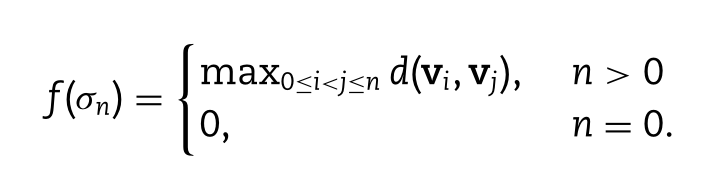

今天给大家介绍一篇来自南洋理工大学物理与数学学院数学科学系，Xiang Liu,Xiangjun Wang等发表在Briefings in Bioinformatics 2021的一篇文章“Hypergraph-based persistent cohomology (HPC) for molecular representations in drug design”。作者提出了基于超图的分子拓扑表示、基于超图的(加权)持续上同调(HPC/HWPC)和基于HPC/HWPC的分子指纹用于药物设计中的机器学习模型，开发了第一个基于超图的拓扑框架用以在原子水平上表征详细的分子结构和相互作用。本文利用构建的HPC/HWPC模型生成用于蛋白质-配体结合亲和力预测中学习模型的分子描述符，作者还结合了增强树(GBT)模型，将HPC/HWPC-GBT模型在三个最常用的数据库(PDBbind-v2007、PDBbind-v2013和PDBbind-v2016)上进行测试，结果表明该模型优于现有的所有使用传统分子描述符的机器学习模型。

1.摘要
---

​	基于人工智能(AI)的药物设计已经显示出从根本上改变制药行业的巨大潜力。目前，基于人工智能的药物设计中的一个关键问题是高效可转移的分子描述符或指纹。在材料、化学和生物数据分析中，分子描述符或指纹的可表示性对于机器学习模型至关重要。分子结构及其原子间的相互作用是高度复杂的，对有效的数学表示提出了巨大的挑战。代数拓扑和微分几何中的数学不变量能够刻画内在信息，提供了一种高效的结构表示方法。作者受最优路径复合模型和最近提出的基于超图的嵌入同调和持续同调的启发，在二者的基础上构建了HPC/HWPC模型，并用它们来生成用于蛋白质-配体结合亲和力预测中学习模型的分子描述符。作者的模型在蛋白质-配体结合亲和力预测实验中优于现有的所有使用传统分子描述符的机器学习模型，在基于人工智能的药物设计中显示了巨大的潜力。

2.引言
---

​	目前，药物设计中机器学习模型的核心挑战之一是分子特征化，即识别或设计合适的分子描述符或指纹。事实上，特征化是化学信息学和生物信息学的一个长期问题，传统的分子或化学描述符是从结构几何、化学构象、化学图形、结构拓扑以及分子式、疏水性、空间性质和电子性质获得的结构和物理性质。这些描述符在定量构效关系和学习模型中得到了广泛的应用。最近，人们从代数拓扑、组合拓扑和微分几何等方面提出了一系列用于分子表示的数学模型。与传统的分子描述符不同，这些模型使用高度抽象的基本数学不变量，因此它们可以捕捉更深层次和更内在的分子性质。具有更高抽象和泛化水平的特征在机器学习和深度学习模型中具有很大的优势。在药物设计的各个方面，包括蛋白质-配体结合亲和力预测、突变后蛋白质稳定性变化和毒性预测，使用具有这些高级数学表示的学习模型已经取得了显著的结果。与材料、化学和生物模型中广泛使用的传统图和单纯复数表示相比，超图在数学上提供了更广泛的拓扑表示。作者受最近提出的基于超图的同调模型和持续同调模型和最优路径复合模型的启发，提出了第一个基于超图的分子表示、基于超图的(加权)持续上同调(HPC/HWPC)和基于HPC/HWPC的药物设计机器学习模型。

3.模型介绍
---

### 3.1生物分子超图表示法

蛋白质和配体的原子集分别表示为$V_p=\{V_i;i=1,2,...,N_p\}$和$V_L=\{V_j;j=1,2,...,N_L\}$，$V_i$和$V_j$分别表示第i和j个原子坐标向量，$N_p$和$N_L$分别表示总数。元素特定超图$(V_\mathcal{H},\mathcal{H})$由顶点集$V_\mathcal{H}=V_p \bigcup V_L$和超边集组成$\mathcal{H}$,由于顶点可以看作是一条超边，为了简单起见，作者用$\mathcal{H}$来表示超图。在基于蛋白质配体的超图中，作者将$\mathcal{H}$中的n维超边定义为$σ_n$,

$σ_n$是由来自蛋白质原子集或配体原子集的n+1个顶点(或原子)组成的,当$n>0$时,$σ_n$中至少有两个顶点不是来自同一分子,即一种来自蛋白质，另一种来自配体。$V_\mathcal{H}$中的任何顶点都是0维超边用$σ_0$表示。

图1：A使用蛋白质-配体复合体(PDBID 3P2E)的蛋白质-配体相互作用的元素特定超图表示的图示。核心区被分解为4个蛋白质原子组(C，N，O，S)和9个配体原子组(C，N，O，S，P，F，Cl，Br，I)，它们被组合成36个元素特定的组合，如C-C，N-S，O-Br等，每个元素特定的组合生成一个超图，总共36个超图用于在分子水平上表示蛋白质与配体的相互作用。这里只显示了维数为0，1和2的超边。0维超边是黑色顶点(蛋白质原子)或绿色顶点(配体原子)，1维超边表示为红色椭圆，2维超边表示为蓝色椭圆。每个椭圆至少有一个黑色顶点和一个蓝色顶点。B是基于超图的过滤过程的图示，来自蛋白质-配体复合物(PDBID 3P2E)的C-C组合的超图，如(A)中所示。每条超边缘都与一个过滤值或“birth time”相关联。随着过滤值的增加，可以生成一系列嵌套超图。

### 3.2基于超图的持续上同调

持续模型的关键组成部分是过滤过程，包括持续同源/上同源，持续光谱和持续函数。在基于超图的持续上同调中，对每个超边分配一个过滤值(或“出生时间”)，随着过滤值的增加(或减少)，可以生成一系列嵌套超图。如图2所示，“出生时间”和“死亡时间”表示条形码的起始值和结束值。在蛋白质-配体复合物超图模型中，两个原子$V_i,V_j$之间的交互距离定义如下：

$\|v_i-v_j\|$表示两个原子之间的欧式距离，$v_i和v_j$是坐标向量。函数$g(v_i,v_j)$表示同一分子(蛋白质或者配体)中原子$v_i$和原子$v_j$之间的相互作用距离。根据交互距离，定义超边$σ_n=\{v_0,v_2,...,v_n\}$如下：

设G为阿贝尔群，S为非空有限集，我们用G(S)表示S中元素与G中系数的线性组合的集合，n维超边群用$\mathcal{H}$中所有n维超边的集合$\mathcal{H}_n$表示为$G(\mathcal{H}_n)$,n维超图群$G(\mathcal{H}_n)$的边界算子$∂n$定义如下：

$σn={v_0,v_1,...,v_n}$是一个n维超边，(n-1)维超边$σ^i_{n−1}= \{v_0,v_1, ...,v_{i−1},v_{i+1}, ...,v_n\}$是通过从超边$σ_n$中移除顶点$v_i$而生成。

第n个下确界链群定义为

第n个上确界链群定义为

在计算上，嵌入上同调是基于上确界上链复数$Sup_\bigstar(H)$来计算的。这是因为在作者的模型中，上确界上链复合体等于它所伴随的单纯复合体对应的上界上链复合体。基于超图的嵌入上同调同构于其伴随单纯复形的单纯上同调。这样，只需要生成相应的单纯复形并计算它的持续上同调信息。对于基于蛋白质配体复合物的超图，本文只考虑$β_0$和$β_1$信息。

图2 二部图(A)、2维超边的HPC(B)、3维超边的HPC(C)的持续条形码的比较。二部图是由交互距离矩阵公式导出的。蛋白质原子用黑星表示，配体原子用绿色圆点表示。A的高维拓扑信息$(β_2)$丢失，$β_1$条形码由于缺乏维数高于1的简单化而永远保持不变。通过增加2维超边(表示为蓝色椭圆，每个蓝色椭圆只包含3个原子)，可以‘kill’所有永久持续的β1条形码，即赋予它们‘death’时间，并捕获β2信息。(B)显示添加维度低于3的超边，将得到永久持续的β2条形码。(C)显示添加3个超边(表示为绿色椭圆，每个绿色椭圆只包含4个原子)，可以“kill” 这些永久存在的β2条形码。(D)显示了两个具有不同η值的C-C组合(PDBID 3IP5)的持续上同源性富集条形码，2.5 Å(左侧子图)和10.0 Å(右侧子图)。(E)显示永久性条形码离散化的分子描述符的图示。

### 3.3 生物分子拓扑表示法

图4.配体Uracil(A)的三种拓扑表示，即图(B)、简单复合体(C)和超图(D)。超图是由超边组成的，而每条超边只是一组顶点。超图提供了最一般的拓扑表示。

   可以看出，图只考虑了两个原子之间的相互作用，即它们要么相互作用并在它们之间形成一条边，要么它们不相互作用而没有边形成。单纯复形可以刻画单形之间更为复杂的关系，包括上邻域、下邻域、平行邻域等。由于每个单纯形都可以看作一条超边，所以任何单纯复形都是一种特殊类型的超图，用超图表示法可以描述以单纯复形为特征的相同关系。

### 3.4 元素特定的分子相互作用表示

分子水平上分子间相互作用的表征对于分子结构、柔性、动力学和功能分析具有重要意义。在本文模型中，同一分子的两个原子$v_i$和$v_j$之间的函数$g(v_i,v_j)$定义如下:

$d_0>=0$,是一个常数值。n维超边(n>1)的过滤值是该n维超边内任意两个原子(顶点)之间的最大交互距离。如果这两个原子来自不同的分子，那么它们的相互作用距离就是它们的欧式距离。如果这两个原子来自同一个分子，那么它们的相互作用距离就是包含其中一个原子的所有可能的1维超边中最大的“长度”，加上常数$d_0$。常数$d_0$可用于调整超边缘的过滤值。如图5所示，不同的$d_0$值会产生不同的持续条形码。

图5.具有不同$d_0$值的PDBID 3IP5的C-C组合集的基于HPC的持续条形码。从(A)到(D)，$d_0$值分别为0Å、0.1Å、0.4Å和0.7Å可以看出，随着$d_0$值的增加，产生的β条越多，β条的长度越长。

### 3.6 基于超图的加权持续上同调

加权持续上同源性被提出将更多的结构、物理、化学和生物信息合并到一个统一的表示中，即持续上同源性丰富的条形码。本文考虑了一种新的基于图中心性和柔韧性指标的持续上同调加权方案。更具体地说，我们将0维超边$σ_0={v_i}$的权重定义为

$σ_1={v_i,v_j}$定义为

比例参数η控制节点的影响范围。较小的η值表示局部交互，较大的η值表示全局交互。0维上同调生成元$δ^0$的权重为

1维上同调生成元$δ^1$的权重为

实验
---

在基于HPC/HWPC的分子描述符模型中，使用10.5 Å作为截断距离来提取结合核心区。过滤范围选择[2.0Å, 7.5Å]。bin大小选择0.1Å。对于HPC和两个HWPC模型，我们同时考虑$β_0$和$β_1$,一个用于比例参数为$η_1=2.5$Å的本地交互，另一个用于具有$η_2=10 $Å的全局交互。在HPC/HPWC模型中，分别考虑了四种类型的分子描述符：仅来自HPC(矢量大小3960)的HPC和局部HWPC($η_1=2.5$Å(矢量大小7920))，具有$η_2=10 $Å(矢量大小7920)的HPC和全局HWPC，以及同时具有$η_1$和$η_2$(矢量大小11880)的HPC和多尺度HWPC。对于大尺寸的分子指纹，作者利用GBT模型来缓解过拟合问题。

表1 HPC/HWPC-GBT模型在三个测试案例中的PCC和RMSE($pK_d/pK_i$)

表2 PDB-v2007、pdb-v2013、pdb-v2016三个PDBbind数据库的详细信息。

表3 GBT模型的参数

图3 作者的HPC/HWPC-GBT模型与传统的基于分子描述符的模型的PCCS的比较，用于预测蛋白质-配体结合亲和力。

实验结果表明作者的模型可以优于所有使用传统分子描述符的机器学习模型。

总结
---

在材料、化学和生物数据分析中，分子描述符或指纹的可表示对于机器学习模型至关重要。代数拓扑和微分几何中的数学不变量能够刻画内在信息，提供了一种高效的结构表示方法。此外，它们的持续形式，包括持续同调/上同调、持续谱函数和持续函数，可以在各种不同的尺度上保存固有信息，即多尺度固有表示。来自这些持续模型的分子描述符在机器学习模型中可以有更好的性能。为了更好地描述分子结构和相互作用，作者提出了第一个在原子水平上表示分子的超图模型，为了刻画分子内的多尺度信息，作者引入了过滤过程，并提出了基于超图(加权)的持续上同调，使用HPC/HWPC的持续属性作为分子描述符，并结合梯度增强树(GBT)模型，在三个成熟的数据库上进行了测试，包括PDBbind-v2007、PDBbind-v2013和PDBbind-v2016。对于蛋白质-配体结合亲和力的预测，作者的模型可以优于所有使用传统分子描述符的机器学习模型。

参考资料
---

文献链接：https://doi.org/10.1093/bib/bbaa411

代码链接：https://github.com/LiuXiangMath/Hypergraph-based-Persistent-Cohomology