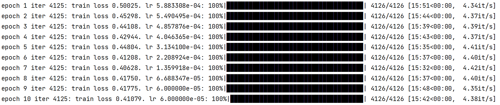

MOSES数据集评估指标

```
valid 1.0
unique@1000 0.999
unique@10000 0.9995
Novelty 0.8922220050811022

FCD/Test ↓
FCD/TestSF ↓

SNN/Test ↑
SNN/TestSF ↑
Frag/Test ↑
Frag/TestSF ↑
Scaf/Test ↑
Scaf/TestSF ↑
IntDiv 越大越好
IntDiv2 越大越好
Filters ↑
logP 
SA 
QED 
weight 
```

molgpt结果指标
---

```
valid 1.0
unique@1000 1.0
unique@10000 0.999
FCD/Test 0.559468117855829
SNN/Test 0.6262460865893547
Frag/Test 0.9972316927368831
Scaf/Test 0.8970744358629252
FCD/TestSF 1.152003933287304
SNN/TestSF 0.575869663826015
Frag/TestSF 0.993880783503936
Scaf/TestSF 0.07475710800217739
IntDiv 0.8504719041315193
IntDiv2 0.84464944820024
Filters 0.9986234021632252
logP 0.03130201761348245
SA 0.011095047828631762
QED 0.0010829628254735186
weight 2.344525394156649
Novelty 0.7807086614173229
```

selfies分子表示
---

**使用数据增强**训练 学习率 6e-4 batch_size 384 epoch 10

```
python ../sf/train.py --run_name sf_moses_6e --max_len 55 --data_name moses --learning_rate 6e-4 --batch_size 384 --num_props 0 --max_epochs 10
```



使用加权抽样的产生其实token的结果

```
Valid molecules % = 10240
novelty: 89.222%
Valid ratio:  1.0
Unique ratio:  0.999
Novelty ratio:  0.892
```

```
valid 1.0
unique@1000 0.999
unique@10000 0.9995
Novelty 0.8922220050811022

FCD/Test 0.22714450102131423
FCD/TestSF 0.7178220744174837

IntDiv 0.8548701063067312
IntDiv2 0.848839046406026

SNN/Test 0.5803655962605262
SNN/TestSF 0.5491430954964016

Frag/Test 0.9992307231125649
Frag/TestSF 0.9970902303478546

Scaf/Test 0.8609731399532332
Scaf/TestSF 0.10604120516106463

Filters 0.98212890625

logP 0.0391777642741165
SA 0.052300865630864876
QED 0.0022024636237999813
weight 2.1046160997548897

```

topk=10,加上加权的生成效果，不如上一种结果好

```
valid 1.0
unique@1000 1.0
unique@10000 0.9995
Novelty 0.8753175688880204

FCD/Test 0.21722852846133378
FCD/TestSF 0.7110367655102436


IntDiv 0.8549445339816338
IntDiv2 0.8488385120622244

SNN/Test 0.5883735661307583
SNN/TestSF 0.556995510897832

Frag/Test 0.9993619497878378
Frag/TestSF 0.9975375220181376

Scaf/Test 0.8401959146125385
Scaf/TestSF 0.10512826830734723

Filters 0.980859375
logP 0.041528343027980294
SA 0.034798470784632524
QED 0.002244447643527038
weight 1.906788823979462

```

