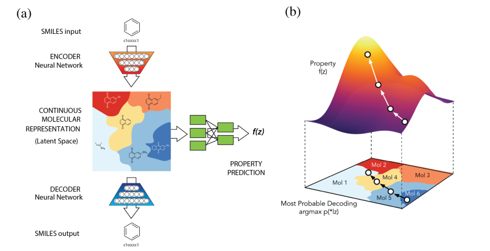

分子生成模型代码链接
===

| mdeol                                     | data set                                               | coed link                                                    | date |
| ----------------------------------------- | ------------------------------------------------------ | ------------------------------------------------------------ | ---- |
| BIMODAL                                   | ChEMBL                                                 | https://github.com/ETHmodlab/BIMODAL                         | 2020 |
| REINVENT                                  | ChEMBL ExCAPE-DB                                       | https://github.com/MarcusOlivecrona/REINVENT                 | 2017 |
| ChemicalVAE                               | QM9 ZINC                                          | https://github.com/aspuru-guzik-group/chemical_vae           | 2018 |
| GrammarVAE                                | ZINC                                                   | https://github.com/mkusner/grammarVAE                        | 2017 |
| SD-VAE                                    | ZINC                                                   | https://github.com/Hanjun-Dai/sdvae                          | 2018 |
| ORGAN                                     | ZINC GDB-17                                       | http://github.com/gablg1/ORGAN                               | 2017 |
| ORGANIC                                   | ZINC GDB-17 Harvard Clean Energy Project | https://github.com/aspuru-guzik-group/ORGANIC                | 2018 |
| LatentGAN                                 | ChEMBL ExCAPE-DB                                  | https://github.com/Dierme/latent-GAN                         | 2018 |
| ARAE                                      | QM9 ZINC                                          | https://github.com/gicsaw/ARAE_SMILES                        | 2020 |
| Onco-AAE                                  | NCI-60 cell line assay data                            | https://github.com/spoilt333/onco-aae                        | 2017 |
| LigGPT                                    | MOSES data set GuacaMol data set                  | https://github.com/devalab/liggpt                            | 2021 |
| molecule_ structure _generation | BindingDB                                              | https://github.com/dariagrechishnikova/molecule_structure_generation | 2021 |
| MolRNN                                    | ChEMBL                                                 | https://github.com/kevinid/molecule_generator                | 2018 |
| CGVAE                                     | QM9 ZINC CEPDB                               | https://github.com/Microsoft/constrained-graph-variational-autoencoder | 2018 |
| MolGAN                                    | QM9                                                    | https://github.com/nicola-decao/MolGAN                       | 2018 |
| GCPN                                      | ZINC                                                   | https://github.com/bowenliu16/rl_graph_generation            | 2018 |
| NeVAE                                     | QM9 ZINC                                          | https://github.com/Networks-Learning/nevae                   | 2019 |
| GENTRL                                    | ZINC ChEMBL Integrity                        | https://github.com/insilicomedicine/gentrl                   | 2019 |
| JT-VAE                                    | ZINC                                                   | https://github.com/wengong-jin/icml18-jtnn                   | 2018 |
| DeLinker                                  | ZINC CASF                                         | https://github.com/oxpig/DeLinker                            | 2020 |
| DL4chem                                   | QM9 COD CSD                                  | https://github.com/nyu-dl/dl4chem-geometry                   | 2019 |
| GRAPHDG                                   | ISO17 data set                                         | https://github.com/gncs/graphdg                              | 2020 |
| MOLGYM                                    | QM9                                                    | https://github.com/gncs/molgym                               | 2020 |

专用名词
===

`Lead molecular` 先导分子

`Backpropagation` 反向传播

`eigen values` 特征值

`Gate Recurrent Unit（GRU）`门控循环单元

`virtual screening (VS)` 虚拟筛选

`generative chemistry` 生成化学

`recurrent neural networks (RNNs)` 循环神经网络

`variational autoencoders(VAEs)` 变分自编码器

`adversarial autoencoders (AAEs)` 对抗自编码器

`generative adversarial networks (GANs)` 生成对抗网络

`high-throughput biological screening (HTS)` 高通量生物筛选

`Connectionist Temporal Classification (CTC)`

`Syntactic parsing` 语法解析

`lead optimization(L-Opt)` 先导化合物优化:先导化合物往往活性、理化性质等方面可能存在一些缺陷，因此需要对先导化合物进行合理的修饰，才能得到有价值的新药

`Multi-Label Classification` 多标记分类

`Disentanglement` 解纠缠，也叫解耦，就是将原始数据空间中纠缠着的数据变化，变换到一个好的表征空间中，在这个空间中，不同要素的变化是可以彼此分离的。比如，人脸数据集经过编码器，在潜变量空间Z中，我们就会获得人脸是否SMILES、头发颜色、方位角等信息的分离表示，我们把这些分离表示称为Factors。 解纠缠的变量通常包含可解释的语义信息，并且能够反映数据变化中的分离的因子。在生成模型中，我们就可以根据这些分布进行特定的操作，比如改变人脸宽度、添加眼镜等操作。

`ADME` （absorption, distribution, metabolism, and excretion 的缩写）

**吸收、分布、代谢和排泄**性质的优化是最为困难的一环。ADME性质的分析对药物研发的成功与否起关键作用。

`Euclidean  data` 欧几里德数据，

`Kullback-Leibler(KL) divergence` :

`e.g. (exempli gratia)` 例如

`i.e. (id est)` 换句话说，用来进一步解释前面所表明的观点

2021
===

人工智能与深度学习：药物发现的机器智能方法
---

> Artificial intelligence to deep learning: machine intelligence approach for drug discovery

### 摘要

药物设计和开发是制药企业和化学科学家的重要研究领域。然而，低疗效、非靶向给药、耗时和高成本给药物设计和发现带来了障碍和挑战。此外，来自基因组学、蛋白质组学、微阵列数据和临床试验的复杂和大数据也给药物发现流水线带来了障碍。人工智能和机器学习技术在药物发现和开发中发挥着至关重要的作用。换言之，人工神经网络和深度学习算法使该领域实现了现代化。`机器学习和深度学习算法已被应用于多肽合成、基于结构的虚拟筛选、基于配体的虚拟筛选、毒性预测、药物监测和释放、药效团建模、定量构效关系、药物重定位、多药理和生理活性等药物发现过程。`来自过去的证据加强了人工智能和深度学习在这一领域的实施。此外，新的数据挖掘、管理和管理技术为最近开发的建模算法提供了关键支持。总之，人工智能和深度学习的进步为合理的药物设计和发现过程提供了一个绝佳的机会，这最终将影响人类。

与药物设计和开发相关的主要问题是时间消耗和生产成本。此外，低效、不准确的靶向传递和不适当的剂量也是阻碍药物传递和开发过程的其他障碍。随着技术的进步，结合人工智能算法的计算机辅助药物设计可以消除传统药物设计和开发的挑战和障碍。人工智能被称为包括机器学习的超集，而机器学习包括监督学习、无监督学习和强化学习。此外，深度学习是机器学习的一个子集，已经在药物设计和开发中得到了广泛的实施。人工神经网络、深度神经网络、支持向量机、分类和回归、生成性对抗网络、符号学习和元学习是应用于药物设计和发现过程的算法的例子。`人工智能已经被应用于药物设计和开发过程的不同领域，如从肽合成到分子设计，从虚拟筛选到分子对接，从定量构效关系到药物重新定位，从蛋白质错误折叠到蛋白质相互作用，以及从分子途径识别到多元药理学。`**人工智能原理已被应用于活性和非活性的分类、药物释放监测、临床前和临床开发、一次和二次药物筛选、生物标志物开发、药物制造、生物活性鉴定和理化性质、毒性预测和作用方式的鉴定。**

### 介绍

在过去的二十年里，开发高效和先进的系统，以最大的效率和最小的风险进行治疗药物的靶向输送，给化学和生物科学家带来了巨大的挑战[1]。此外，开发新的治疗药物的开发成本和时间消耗是药物设计和开发过程中的另一个挫折[2]。为了最大限度地减少这些挑战和障碍，全球各地的研究人员转向了计算方法，如虚拟筛选(VS)和分子对接，这些方法也被称为传统方法。然而，这些技术也带来了挑战，如不准确和低效[3]。因此，新技术的实施激增，这些技术可以自给自足地消除传统计算方法中遇到的挑战。`人工智能(AI)，包括深度学习(DL)和机器学习(ML)算法，已经成为一种可能的解决方案，可以克服药物设计和发现过程中的问题和障碍[4]。`此外，`药物发现和设计包括漫长而复杂的步骤，如目标选择和验证、治疗筛选和先导化合物优化、临床前和临床试验以及生产实践。所有这些步骤都给确定有效治疗某种疾病的药物带来了另一个巨大的挑战。因此，摆在制药公司面前的最大问题是管理这一过程的成本和速度[5]。人工智能以简单而科学的方式回答了所有这些问题，降低了过程的时间消耗和成本。`此外，制药公司和医疗保健部门数据数字化的增加促使人工智能的实施，以克服审查复杂数据的问题[6]。人工智能，也被称为机器智能，指的是计算机系统从输入或过去的数据中学习的能力。术语人工智能通常用于机器在学习和解决问题过程中模仿与人脑相关的认知行为[7]。如今，生物和化学科学家在药物设计和发现过程中广泛采用人工智能算法[8]。基于AI和ML原理的计算建模为化合物的识别和验证、目标识别、肽合成、药物毒性和理化性质的评估、药物监测、药物效力和有效性以及药物重新定位提供了一个很好的途径[9]。随着人工智能原理以及ML和DL算法的出现，从包含1.06亿多种化合物的化学库中进行化合物的VS变得容易和及时有效。此外，人工智能模型消除了由于偏离目标的相互作用而产生的毒性问题[10]。在这里，我们简要讨论人工智能从ML到DL的演变以及大数据在药物发现过程中的革命性参与。随后，我们对人工智能与传统化学在改进药物发现过程中的结合以及人工智能在改进传统药物发现过程中的应用进行了综述。然后，我们讨论了人工智能在药物设计和发现过程中的众多应用，如一次和二次筛选、药物毒性、药物释放和监测、药物剂量有效性和有效性、药物重新定位、多药理学以及药物与靶点的相互作用。

设计受体三维结构以产生新分子的迭代过程被称为从头药物设计，其目的是产生新的动力学。然而，从头开始的药物设计在药物披露中并没有看到无限的用途。此外，由于人工智能领域的进步，该领域最近出现了一些复苏[421,422]。VS已经成为药物改进措施中的一个巨大工具，因为它在大量的混合物中进行了有利可图的研究，进一步扩大了潜在药物线索的产量。作为人工智能的子集，ML是一种用于协调药物线索的VS的技术，它通常包括收集过滤后的化合物集，包含已知的活性和非活性化合物来训练模型[423,424]。在建立模型之后，将对其进行测试，如果足够准确，还可以在以前未知的数据库上使用，以识别新药。在这一部分中，我们讨论人工智能如何被证明是使用从头开始技术的药物设计的福音。

在一项研究中，研究人员利用懒惰的空间描绘来准备一个模型，该模型依赖于类药物相似性(QED)药物相似性分数的定量估计和制造可获得性分数合成可及性分数(SAS)[425]。在另一个分布中，将这种可变自动编码器的呈现与对抗性自动编码器进行对比[426]。该错误布置的自动编码器包括提供新颖复合结构的生成模型。准备了第二个鉴别对抗模型来区分真实粒子和产生的粒子，而生成模型试图欺骗鉴别模型[427]。对抗性自动编码器在本质上比变分自动编码器在生成模式下产生了更多的实质性结构。在与电子计算机模型的混合中，可以得到预期对抗多巴胺受体类型的动态的新结构，2。研究人员利用一种生殖性不良组织(GAN)提出了具有假定抗癌特性的混合物[428]。

RNN同样被有效地用于从头开始的药物设计。因为SMILES串编码字母组中的物质结构，所以RNN已被用来生成复合结构。据观察，RNNs具有利用SMILES串进行药物设计的潜力[429]。类似的方法同样被有效地用于开发新的多肽结构[430]。神经网络学习被有效地应用于使所创建的混合物向所需特性倾斜[431]。同样，转移学习作为另一种系统被用来创造具有理想自然行为的新的合成结构。在接下来的步骤中，组织准备了大量的准备工作来熟悉Smiles语法[432,433]。在随后的推进中，用具有理想运动的混合料进行准备。此外，额外的训练时期足以达到新的组合进入动态原子所涉及的复合空间的阶段。根据这种方法将五个原子结合在一起，可以肯定四个粒子对原子、化学感受器的计划作用[434]。一些不同的设计已经被提出，这些设计创造了合法的、重要的新颖结构。新的合成已经通过这些策略进行了研究，所创建的分子或原子的性质传播类似于所使用的广泛的训练集。这一策略的初步应用是充分的，5个原子中有4个表示理想的作用[435]。人工智能和多目标优化一直是连接化学和生物阶段的一种很有前途的解决方案。开发了基于RNN的新型多目标对，用于基于SMILES的自动从头设计，以寻找理化特性与其受约束的生物目标之间的最佳匹配。结果表明，人工智能和多目标优化可以捕捉连接化学和生物方面的潜在联系，从而为可定制的设计策略提供易于使用的选择，这被证明对线索产生和线索优化都特别有效[436]。

支持向量机、RF、DNNS等ML模型已经被用于药物发现，用于分析从对接到VS[437]的制药应用。最近，药物再利用作为一种创新的方法出现，以最大限度地缩短药物开发持续时间，这通常涉及数据挖掘和人工智能[438]。一个小组提出了一个问答人工系统(QAAI)，它能够重新调整药物的用途，使用谷歌语义AI通用编码器来计算嵌入在红脑JSON数据库中的句子。这项研究在体外验证了脂氧合酶抑制剂药物齐留通作为NRF2途径调节剂的预测，该药物具有减少巨噬细胞M1表型和活性氧产生的潜在应用。这种新的方法已被证明对NDDS中的重新定位是有效的[439]。随着系统药理学和多药理学的迅速发展，多靶点药物的合理设计方法的发展迫在眉睫。第一个全新的多靶点药物配置程序，称为LigBuilder V3(http：//www.。Pkumdl.。Cn/igbu ilder3/)已被设计用于设计不同受体、一个受体的多个偶联位点或一个受体的不同构型的配体。LigBuilder V3再次用于多靶点药物计划和增强，特别是用于具有不同配体结合位点的蛋白质的紧凑配体[440]。从头开始的药物设计积极寻求使用一套化学规则来快速有效地识别具有所需的一组生物学特性的结构上的新的化学类型。此外，基于片段的从头设计工具已经成功地应用于非共价抑制剂的发现。在这里，设计了一种新的方案，称为CoV_FB3D，它涉及通过识别目标蛋白的共价结合位点上的活性片段来在计算机上组装潜在的新型共价抑制剂[441]。

用于药物设计的人工智能和机器学习方法：制药行业面临的挑战和机遇
---

> Artificial intelligence and machine learning approaches for drug design: challenges and opportunities for the pharmaceutical industries

### 摘要

新冠肺炎在全球的传播提升了药品研发作为棘手和热门研究的重要性。开发新的药物分子来克服任何疾病都是一个昂贵而漫长的过程，但这一过程仍在不间断地进行。考虑药物设计的关键是利用现有的数据资源，寻找新的和新的线索。一旦确定了药物目标，几个跨学科领域将与人工智能(AI)和机器学习(ML)方法合作，以获得丰富的药物。这些人工智能和最大似然方法被应用于计算机辅助药物设计的每一步，并且将这些人工智能和最大似然方法结合起来，可以获得高成功率的命中化合物。此外，这种AI和ML与高维数据的融合及其强大的能力又向前迈进了一步。通过AI/ML集成模型进行临床试验产量预测，可以进一步降低临床试验成本，提高临床试验成功率。通过这篇综述，我们讨论了人工智能和最大似然方法在支持计算机辅助药物设计方面的后端，以及它给制药行业带来的挑战和机遇。

在从头药物设计中引入了各种软件和方法，以便在不需要参考化合物的信息的情况下产生新的有效分子。遗憾的是，与其他基于结构的筛选方法相比，这些从头方法在药物设计方法中的应用并不广泛。在该方法中，生成了难以合成的化合物。变分自动编码器有两个神经元网络：编码器和解码器网络[127]。编码网络积极地将化合物的化学结构从SMILES符号转换为实值连续向量。大多数主要分子的反向平移占主导地位，轻微的构象变化以更小的概率存在。在另一项研究中，将变体自动编码器的性能与对抗性自动编码器进行了比较[128]。这些对抗性的自动编码器具有生成新化学结构的生成模型[129]。结合电子计算机模型对新结构的预测显示了更多抗多巴胺受体2型的活性化合物。类似地，Kadurin等人。使用了生成性对抗网络(GAN)，并提出了具有强大而有效的抗癌特性的化合物[130]。此外，递归神经网络(RNNs)在新药设计中得到了广泛的应用。它产生于自然语言处理领域，并通过这种方法提供了顺序信息作为输入。由于SMILES符号串以字母序列对化学结构格式进行编码，因此应用RNN来开发化学结构。RNN用从收集到的大量化合物数据集来训练，比如ChEMBL或一大组商业上可以买到的化合物，以训练SMILES串的神经元网络[131]。这种方法还被用于按顺序或以结构形式产生新的和新颖的肽。`强化学习用于使生成的化合物偏向于预测其重要的核心性质。`另一方面，`转移学习作为一种不同的策略被应用于产生具有预期生物活性的有效的新化合物。`此外，各种类型的体系结构模型都是用ML方法实现的，这些方法能够产生强大的新结构。通过这种方法可以探索新的化学特征，具有与训练集药物分子相似的性质[132]。

在初级药物发现阶段预测先导分子的不良物理化学性质将大大降低失败的风险。为此，图8提供了模型表示。已经开发了几种基于DL的方法，并用经典模型实现。这项研究是由Duvenaud等人进行的。`使用CNN-ANN算法从具有高可解释性的有效预测性能的分子图中提取信息来预测先导分子的溶解度[164]。`在这种方法中，回溯法可以得到像亲水性R-OH基团一样的溶解性分子片段。紧随其后的是Devenaud，Coley等人。发展了一种基于张量的卷积嵌入属性分子图方法来预测分子在水环境中的溶解度，该方法优于Duvenaud模型。`Coley的模型应用深原子水平信息来预测先导分子在水介质中的溶解度。`除了渗透系数外，对Caco-2渗透系数的预测对于评估先导分子的药代动力学特性起着至关重要的作用[165]。这项研究是由Wang等人进行的。以1272个配体分子为研究对象，利用Caco-2渗透性数据，采用支持向量机回归、偏最小二乘(PLS)和多元线性回归(MLR)算法对模型进行改进，建立了30个描述子的预测模型。这些模型对测试集分子的预测能力较好(R2=0.81，RMSE=0.31)，并且严格遵循经济合作与发展组织(OECD)关于QSAR/QSPR的原则，保证了模型的合理性和可靠性[166]。

在早期，制药公司每年大约花费超过50亿美元。在本世纪头十年晚些时候，估计为300亿美元。研发投入增加了约8750亿美元，2010年预计在960亿美元左右。在过去的几十年里，制药公司已经应用了一些基于利平斯基规则、类药物和类铅过滤器的规则，以避免不受欢迎的ADME/T曲线[167]。先导分子的生物利用度是一个重要的药代动力学参数。因此，生物利用度的预测可以指导药物化学家优化试验分子。在ADME研究中，ML技术和实现侧重于建立预测模型，该模型提取有效的训练数据模式并预测新先导分子的pk值[168]。在ADME过程中使用了几种类型的ML模型，这些模型对于建立分子描述符(如PLS、MR和DT矩阵)之间的关系非常有帮助。其次是吸收，`药物分布是预测血液到肠液和细胞间液药物循环的重要预测指标`，`药物分布的稳态是药物体内剂量与血药浓度的比值。`**预测药物在组织中的稳态分布是评价药物分布机制的重要标准[169]**。因此，高精度的药物代谢位点预测可以指导药物的优化，从而获得分子的稳定机制。使用ML方法对大数据集进行预测。它还可以用来预测代谢部位和参与代谢的酶，如细胞色素P450、UDP-葡萄糖醛酸基转移酶(UGTS)和醛氧化酶。例如，神经网络方法XenoSite的发展提供了新陈代谢位点的可能性，总体准确率为87%。排泄是消耗药物的关键步骤，其代谢产物要排出体内。药物代谢物以其在水中的溶解性而闻名，很容易被排泄出来，而大多数药物可以直接消除而不需要代谢。Lambardo et al.。将偏最小二乘(PLS)模型应用于人体清除率预测，取得了较好的判别效果，预测准确率达到84%。根据排泄机理，用预测的PLS模型预测药物排泄量[170]。

在药物开发过程中，大多数先导分子可能会在临床前和临床毒性方面失效。因此，毒性预测在药物优化应用中是强制性的，并降低了出错的风险。传统上，肝和肾毒性研究是通过基于规则的专家知识和结构警报来预测药物毒性分布[171]。因此，近年来，DL方法被应用于各种化学特征及其优点的自动处理，并在毒性预测方面取得了很好的效果。例如，编码卷积神经网络的分子图(MGE-CNN)与急性口服毒性预测模型一起，获得了比以前报道的基于支持向量机模型的结果更准确的结果。他们的研究将原子级信息中指纹的所有毒理学特性与ToxAlters定义的结构性警报进行了映射[172]。在另一项研究中，迈尔等人。开发了一个用于毒性预测的多任务DNN模型(DeepTox)，该模型比其他模型具有更好的性能。药物分子的ADME/T性质显示出一定的相关性，`多任务神经网络可以提高性能[173]。该研究采用ML驱动的方法，能够准确预测一些重要的物理化学性质，如水溶性、亲脂性等。`ML算法的改进模型能够更好地预测分子性质，但进展有限。

其他分类模型如DT、K近邻(KNN)、支持向量机(SVM)、神经网络(NN)和RF等已被广泛用于预测先导分子的ADME/T性质，但它们在这一领域还有待进一步发展。基于AI和ML的ADME/T预测的最新进展归因于异质药物发现数据，如基于细胞的分析和生化活动[174]。`亲脂性的预测是药物发现过程中一个重要的物理化学性质，因为亲脂性是调节几个关键药动学性质的关键因素。先导分子的亲脂性明显影响先导分子的膜通透性，并影响ADME的行为[172-177]。`传统上，辛醇-水分配系数/pH依赖分配系数(LogD)和替代方法脂质体/水分配和固定化人工膜(IAM)是预测脂溶性的标准金方法。然而，传统的计算方法，如基团贡献法(GC)、方程式状态、量子化学驱动的方法(如分子模拟)和线性/非线性QSAR被广泛采用来预测具有分子描述符的高度相关的logP/logD[178]。Riniker等人。开发了代表MDFP+的新的分子动力学特征来预测logP。他们发现了比严格的MD计算更丰富的信息指纹[179,180]。因此，基于人工智能的方法被利用并预测logP。然而，基于所有训练数据集的准确性和效率，协议可能彼此不同，这限制了与其他基于物理的方法相比的适用范围[181]。

人工智能在药物设计中的应用现状综述
---

> An In-depth Summary of Recent Artificial Intelligence Applications in Drug Design

### 摘要

作为一种在广阔的化学空间中导航的有前途的工具，人工智能(AI)被用于药物设计。从2017年到2021年，最近几个人工智能模型(即图形神经网络(GNN)、递归神经网络(RNN)、变异自动编码器(VAE)、生成性对抗网络(GAN)、流(Flow)和强化学习(RL))在药物设计中的应用数量显著增加。相关的文献综述很多。然而，没有一本书对最近的人工智能模型在药物设计中的许多应用进行了深入的总结。为了补充现有的文献，本综述包括前面提到的人工智能模型的理论发展和42个人工智能在药物设计中的最新应用的详细总结。具体地说，其中13个利用`GNN进行分子性质预测`，29个利用RL和(或)深度生成模型进行分子生成和优化。在大多数情况下，总结的重点是药物设计中特定任务的模型、它们的变体和修改。此外，表中还简要总结了人工智能在分子生成和优化中的另外60个应用。最后，这项调查对丰富的应用进行了全面的讨论，从而使基于人工智能的药物设计中的任务、潜在的解决方案和挑战变得显而易见。

### 介绍

背景资料。人工智能(AI)分子设计的研究领域受到了极大的关注，主要是因为人工智能可能是迄今为止最有希望有效探索人类智能无法处理的分子空间的方法。基于人工智能的分子设计领域可以根据小分子、生物分子(例如蛋白质、RNA和DNA)和无机分子等分子类别分为几个子领域(Chen等人，2020a；Eismann等人，2021；Ingraham等人，2019年；Jing等人，2021；熊等人，2021；姚等人，2021)。在这些子领域中，基于人工智能的小分子设计是本调查的主题，尽管来自不同子领域的方法通常可以互换使用，只需稍加修改，如改变分子表示(酱等人，2020年)。`小分子的一个共同用途是充当治疗疾病的小分子药物。`简而言之，除非另有说明，本调查中的“药物”和“分子”是指“小分子药物”和“小分子”。

药物设计是漫长而昂贵的药物发现和开发过程的一部分(Blass，2015；Wong等人，2018年)。整个过程一般包括四个阶段：`1.疾病靶标确定，2.分子筛选和先导发现，3.涉及动物试验的临床前发展，4.涉及人体试验的临床发展(Tonkens，2005)。`**基于人工智能的药物设计有可能极大地简化第二阶段。**具体地说，它可以识别或产生对疾病靶点有效并具有其他药物特性的分子结构。因此，人工智能可以加快药物发现和开发过程，并增加投资回报。此外，基于人工智能的药物设计方法可以很容易地纳入实验室自动化，这是另一个受到极大研究兴趣的领域(Coley等人，2020a；Coley等人，2020b；Dimitrov等人，2019年)。

近年来，`人工智能在药物设计中的应用主要围绕深度学习(DL)展开`。DL在药物设计中越来越受欢迎主要有三个原因。最明显的是深度学习的理论进步。与图神经网络(GNN)和深度生成模型相关的理论有很大一部分是在过去10年中建立的(Bronstein等人，2017；Guo&赵，2020；Liu&周，2020)。在计算机科学界和化学界的努力下，新的模型及其变体正在迅速地被利用或开发，以解决药物设计中具有挑战性的任务。在药物设计中增加DL使用的另一个原因是分子数据可用性的提高。训练一个多参数的深度神经网络需要大量的数据。目前，有几个大型公共化学数据集包含有关一般分子属性的信息(Gaulton等人，2012年；Kim等人，2016年)。此外，`最近改进的高通量筛选技术可以在实验中以前所未有的快速度获得感兴趣的分子特性`(Baudis等人，2014；David等人，2019年)。然而，作者需要提醒读者，`在许多情况下，低数据可用性和低质量仍然是药物设计中使用的DL模型表现不佳的罪魁祸首`(Walters&Barzilay，2021)。DL在药物设计中流行的第三个原因是硬件的进步。与传统CPU相比，GPU和TPU训练深度神经网络的速度要快得多(Jouppi等人，2017年)。此外，云计算使没有必要硬件的用户可以使用GPU和TPU(Armbrust等人，2010年)。

`基于人工智能的药物设计有三个共同目的：分子性质预测、分子生成和分子优化。`分子性质预测主要是确定定量构效关系(QSAR)。在DL出现之前，其他机器学习(ML)技术和计算模型被用于预测QSAR(Chen等人，2018年；Zhang等人，2017年)。当使用包含DL的通用ML时，如果预测分子性质的连续值，则本质上是回归，或者，如果预测离散的类别标签，则是分类。`在DL中，根据分子表示的选择和其他考虑因素，可以使用卷积神经网络(CNN)、递归神经网络(RNN)、图神经网络(GNN)和/或多层感知器(MLP)来预测分子性质`。基于DL的分子性质预测至少达到了现实世界的两个里程碑。(Stokes等人的研究成果,2020)通过GNN从化合物库中鉴定出一种有效治疗动物模型感染的抗生素--大蒜素。(酒井等人(Sakai  et  al.)，2021)在GNN的行为研究中发现了一种具有抗抑郁作用的高活性5-羟色胺转运体抑制剂。基于DL的分子性质预测通常是分子生成的一部分，下面将讨论这一点，它本身就取得了很好的效果。

在这里，分子生成也被称为反向QSAR或从头开始的分子设计。分子性质预测和分子生成与输出具有感兴趣的性质的分子具有相似的目的。然而，`具有所需性质的分子可能不在现有的分子数据库中，并且未被探索的化学空间极其广阔。设计分子生成技术的动机主要是在未知的化学空间中导航。`计算分子生成并不新鲜，以前经常使用不基于DL的方法(Schneider&Fechner，2005)。深度生成模型最初是为自然语言处理(NLP)和计算机视觉等其他领域开发的，最近在分子生成领域占据主导地位(Oussidi&Elhassouny，2018年)。深度生成模型通常基于RNN、变分自动编码器(VAE)、产生式对抗性网络(GAN)和Flow。

`药物设计的第三个子领域是分子优化`，`其目的是改善分子的性质`。分子优化通常通过强化学习(RL)、贝叶斯优化(BO)和其他方法与分子生成同时进行(Frazier，2018年；GómezBombarelli等人，2018年；Popova等人，2019年)。这里单独考虑它，因为有一些基于人工智能的模型旨在专门修改分子以改善性能，而不是从头开始生成分子(周等人，2019年)。这样的模型在药物发现过程的先导优化步骤中可能特别有用。

本调查的背景部分以基于人工智能的药物设计的分子表示法的简要讨论结束。在这项调查中最常提到的代表是简化的分子输入线输入系统(SMILES)和分子图。1988年开发的SMILES分子表示是基于文本字符串(Weininger，1988)。文本串表示使得许多NLP技术易于应用于药物设计。然而，SMILES并不是分子的自然表现。这促使了分子图的使用，这是一种更容易解释的分子表示(David等人，2020年；Gaudlet等人，2020年)。在大多数情况下，分子图是以原子或子结构为节点，以化学键为边来构建的。图的连通性通常用邻接矩阵来表示，节点和边的属性通常用特征张量来表示。除了分子图之外，本次调查涉及的另一种图类型是分子网络，它是以分子实体为节点，以分子间的相互作用或相似性为边来构建的。与分子图相比，分子网络通常要大得多。

#### 基于深度学习的分子性质预测

`感知器理论、MLP理论、CNN理论和GNN理论。`感知器受到生物神经元的启发，是一种单层前馈神经网络。感知器被认为是深度神经网络的基本模块。感知器可以用作线性二元分类器，通过线性预测函数将可训练的权重和输入特征相乘和组合来输出分类预测。采用Heaviside阶跃函数进行激活。为了提高分类精度，通常在激活前使用一个可调偏倚项来移动决策边界。感知器也可以用于回归。在训练过程中，随机初始化权重，并分别使用每个输入样本进行梯度下降训练。当模型已经用所有输入样本训练了一次时，一个历元就结束了。感知器超参数包括训练周期数和学习率。训练时段的数量通常与停止标准相关联。太少和太多的时代分别导致不适应和过度适应。学习率通过影响权值更新来控制感知器的学习速度。这两个超参数在一般神经网络中也很重要。

多层感知器是感知器的扩展，它是一个前馈神经网络，除了输入层和输出层外，还有至少一个隐含层(Pal&Mitra，1992)。因此，MLP具有多层次的特点，属于深度学习。同样，CNN、GNN和RNN也在深度学习。反向传播用于最大限度地减少MLP训练过程中的损失。请注意，普通MLP的完全连接性可能会使其容易过度安装。

卷积神经网络的灵感来自视觉皮层，它非常适合于网格状输入，如图像(Albawi等人，2017；Aloysius&Geetha，2017)。因此，它在计算机视觉中得到了广泛的应用。与MLP相比，CNN具有参数少、过拟合倾向低、效率高等优点，同时可以捕获输入的空间信息。CNN具有复杂的体系结构，通常包括输入层、交替的卷积层和汇聚层、完全连接层和输出层。卷积层应用输入矩阵和卷积滤波器(即，权重和偏差的向量)的点积。RELU通常用作激活功能。在滑动滤波器的路径覆盖整个输入矩阵之后完成特征映射。为了满足某些与任务相关的要求和计算效率，使用池化层(例如最大或平均池化)来降低卷积后的中间数据维度。通常，与MLP类似的完全连接的图层位于卷积和池化图层之后。CNN架构在输出层结束。与MLP相比，CNN具有更多的超参数，如过滤器大小、过滤器步幅和合并类型。

图神经网络理论。MLP和CNN是专门为欧几里德数据设计的。与欧氏数据相比，图是不规则的，因为节点数量的变化和不同节点的邻居节点数量的变化。因此，传统的神经网络不能直接应用于图形式的数据。这推动了GNN的发展。GNN的一些开创性工作是从2005年到2010年完成的(Gallicchio和Micheli，2010年；Gori等人，2005年；Scarselli等人，2008年)。随后提出了大量的GNN变体，可分为三类：递归GNN(RecGNN)、卷积GNN(ConvGNN)和时空GNN(STGNN)。我主要讨论ConvGNN在本次调查中的应用。在Lusci等人的论文中可以找到RecGNN在分子性质预测中的应用(2013)和Wieder等人(2020)。STGNN适用于节点属性随时间变化的图，因此与本次调查无关。

图1.在分子性质预测中使用ConvGNN进行图形分类/回归的简化示例。每个分子都由一个带有特征向量和邻接矩阵的图表示。消息交换更新节点信息。然后获得图嵌入，并将其用于属性预测。

ConvGNN可以进一步分为两类：频谱ConvGNN和空间ConvGNN。频谱ConvGNN在谱域分解图信号后，对谱部分进行谱滤波。**ChebNet**被提出通过绕过拉普拉斯特征向量的计算来降低与谱ConvGNN相关的计算成本*(Defferrard等人，2016年)*。在ChebNet中，谱滤波器用Chebyshev多项式逼近。图卷积网络(GCN)被提出通过使用更多的近似来简化ChebNet(Kipf&Wling，2016)。GCN在频谱和空间ConvGNN之间架起了桥梁。空间ConvGNN通过将每个节点的当前要素与其相邻节点的要素进行卷积来更新每个节点的要素。空间ConvGNN是本综述的重点，稍后将通过一系列示例来说明其细节。

ConvGNN主要用于三个任务：节点分类、链接预测和图分类/回归。节点分类通常属于半监督学习的范畴，它是在给定其他节点的标签的情况下预测图中未标记节点的标签。链路预测任务是在给定两个节点的信息的情况下预测边的存在和身份。当图形是分子网络时，链接预测已被应用于预测药物-靶点和药物-药物相互作用(Huang等人，2020年)。

`ConvGNN在药物设计中的中心任务是图形分类/回归，用于分子性质预测(Hwang等人，2020年)。`对于图形分类/回归，ConvGNN通常与池和读出操作相结合以获得紧凑的图形表示，然后使用MLP来完成端到端框架。图1是使用ConvGNN进行图形分类/回归的简化示例。有关GNN的更多详细信息可以在其他地方找到(Wu等人，2020；Zhang等人，2019b；周等人，2020)。第2节的剩余正文总结了GNN在分子性质预测方面的13个应用/进展。请注意，后三个示例的主要主题是分子网络的链接预测。

(Duvenaud等人，2015)通过修改当时最先进的环形指纹模型之一，发展了一个用于分子性质预测的开创性空间ConvGNN模型(Glen等人，2006年)。在环形指纹模型中，通过环形指纹算法计算与分子相关联的特征向量。特征向量随后被馈送到用于化学性质预测的全连接神经网络。环形指纹算法是开发适用于图形的神经网络的一个很好的起点，部分原因是环形指纹类似于CNN。具体地说，圆形指纹法在任何地方都使用相同的局部操作，然后是汇集步骤。然而，由于散列和索引操作，圆形指纹是不可区分的。因此，圆形指纹模型不能进行端到端的训练。为了解决这个问题，用单层神经网络代替散列运算，用SoftMax代替索引运算。经过改进，建立了一个支持端到端训练的早期空间ConvGNN模型用于分子性质预测，该模型可以直接对任意大小和形状的分子图进行操作。

(Coley等人,2017年)。大多数化学性质(如logP和melting point(熔点)都受到分子全局信息的严重影响，而不仅仅是连接性。为了提高对这些化学性质的预测精度，Coley等人提出了一种新的预测方法。Duvenaud等人提出了与该模型相关的另一种空间ConvGNN模型。他们帮助模型捕捉分子全局信息的策略是将原子的“全局属性贡献”合并到相关的原子特征中。例如，一个分子的总极性表面积是由所有原子共同决定的。因此，每个原子的极性表面积贡献可以用作相关原子特征的一部分。在其GNN模型的每一层/深度，每个原子的特征都基于原子本身、其相邻节点和边的特征向量来更新。边特征保持不变。将所有原子的更新后的原子特征向量转换为原子指纹，并将其相加形成分子指纹。对GNN的每一层重复该过程。最后，将各层得到的分子指纹进行汇总，然后利用下游神经网络对分子性质进行预测。

此外，作者还指出了除了下游回归外，分子嵌入策略的重要性。传统的基于描述符的分子嵌入如果描述符遗漏了关键的分子信息，其性能可能会低于平均水平。`相比之下，GNN嵌入方法使得复杂的QSAR可以直接从分子图和特征中学习。`

D-MPNN(有向消息传递神经网络)(Yang等人，2019a)。D-MPNN是基于Dai等人以前的模型。(2016)。该模型的部分名称MPNN来自Gilmer等人提出的通用MPNN框架。(2017年)。许多GNN模型的图形卷积通常是节点偏心的。相比之下，D-MPNN的卷积以有向边缘为中心。作者指出，这样的修改可以防止与以节点为中心的消息传递相关联的抖动，从而减少与图表示相关联的噪声。在基于边的消息传递之后，基于传入的边特征来更新节点表示。读出阶段使用节点表示来确定分子嵌入，该分子嵌入随后用于性质预测。作者还提出了一种帮助分子嵌入捕获全局分子信息的策略。全局分子特征首先通过通用化学信息学软件RDKit计算(Landrum，2013)。在D-MPNN的读出阶段，将全局分子特征与D-MPNN嵌入的学习分子连接起来进行性质预测。

大蒜素的鉴定(Stokes等人，2020年)。DMPNN是用于确定大蒜素为抗菌候选药物的模型，在小鼠模型中显示出治疗感染的有效性。在这项开创性的工作中，D-MPNN用2335个分子进行训练，以预测给定分子的抗菌性能。训练好的模型随后被用来预测来自多个文库的>1.07亿个分子的抗菌性能。具有良好的抗菌性能、发散结构和高利用率的化合物被优先选择。这一过程最终导致从药物再利用中心鉴定出大蒜素。此外，与常规抗生素相比，大蒜素呈现出不同的结构。这表明该模型在预测新化学品性质方面具有较好的普适性。

具有额外全球节点的MPNN(Li等人，2017年)。Li等人。采用另一种方法使GNN能够捕获全球分子信息。在介绍他们的模型之前，作者解释了为什么香草MPNN未能捕捉到分子的全局信息。香草MPNN通常含有很少的层，因此与分子大小相比，所产生的感受场较小。感受野不能简单地通过增加更多的层来捕捉全球分子信息来扩大，因为在训练数据有限的情况下，更多的层可能会导致过度拟合。

在他们的模型中，李等人。向分子图中添加额外的全局节点。全局节点通过从局部节点指向全局节点的有向边连接到图中的所有局部节点。在消息传递过程中，更新本地节点的信息。同时，由于有向边指向全局节点，全局节点的特征也利用所有局部节点的特征进行更新。因此，全局节点仅通过一层消息传递就可以捕获整个图的信息。全局节点的特征被用作下游分类或回归的分子特征。

分层消息间传递(Fey等人，2020)。Fey等人。提出了一种层次消息传递模型来捕捉分子环结构等层次信息。他们的模型在两个图上运行：原始分子图及其相关的连接树(JT)。JT的节点是分子亚结构。原始分子图和JT图分别捕捉了分子的精细细节和粗略细节。JT的概念首先是在JT-VAE模型中提出的(jin等人，2018a)，它将在第5节中讨论。给定分子的粗图和细图，分子的表示是通过使用从粗到细和从细到粗的信息流在每个图内和两个图之间传递信息来学习的。因此，可以有效地表示分子层次信息。

MPNN用于四面体手性(Pattanaik等人，2020年)。Pattanaik等人建立了MPNN模型。来处理具有四面体手性的分子，这是立体化学的一种常见类型。具有不同立体化学的分子具有相同的图形连通性，因此，立体化学不能被传统的MPNN所识别。然而，立体化学会影响许多分子性质。将立体化学信息包括到原子或键的特征向量中的方法通常是有限的。作者认识到对称聚集函数(例如均值、和和最大值)是传统MPNN结构中阻碍立体化学检测的部分。这促使作者为MPNN开发了两个聚集函数，它们可以在性质预测中区分具有四面体手性的分子。它们将两个聚集函数表示为“排列”和“排列-串联”。这两个函数被结合到几个GNN模型中(即，Xu等人的图卷积网络、图同构网络)。(2018)和D-MPNN)来访问性能。除了四面体手性外，还有其他立体化学类型。为他们开发GNN模型将是一个有趣的方向。

预训练GNN。`当训练和测试示例具有不同的分布并且特定于任务的标签不足时，预训练特别有用。`现有的图级多任务监督学习等预训练策略不能显著提高GNN的预测性能。为此，作者提出了两种自监督节点级预训练技术：上下文预测和属性掩蔽。在上下文预测中，图的子结构用于预测周围的图结构。在属性掩蔽中，对特定的节点/边缘特征进行掩蔽，并根据邻域信息利用GNN对这些特征进行预测。这是节点分类/回归任务的示例。在节点级预训练后，采用图级多任务有监督学习进行图级预训练。在图级预训练之前进行节点级预训练，以缓解图级多任务监督预训练中不相关任务的负面影响。

DGraphDTA(双图药物靶向亲和力预测)(酱等人，2020年)。上述工作属于基于配体的评分，即根据药物本身来预测药物的性质。一个相关但不同的类别是药物靶标亲和力(DTA)预测，它是虚拟筛查的重要组成部分。DTA度量的示例包括结合亲和力、解离常数和IC50值。在这个由GNN实现的DTA预测示例中，作者在蛋白质(靶标)和分子(药物)的图形表示上使用了两个GNN模型，以获得两个嵌入物，并将这两个嵌入物连接起来进行DTA预测。这项工作的主要贡献是解决与蛋白质图构建相关的挑战。如果在图表构建过程中将一个典型的蛋白质作为一个小的药物分子来对待，那么预计会出现一个大得令人不快的图表。另一种方法是用氨基酸作为节点，用肽键作为边来构建图形。但是这种方法会导致类似于蛋白质一级结构的长链，因此不能有效地捕捉蛋白质的二级和三级结构。为了解决这一问题，作者使用氨基酸作为节点，并用联系图来表示氨基酸之间的相互作用。通过Michel等人的Pconsc4方法，基于蛋白质序列构建了接触图。(2019年)，所得到的结构相当于一个图。

`Decagon`(Zitnik等人，2018年)。从这里开始，示例是关于使用GNN进行链接预测来预测分子网络中的一般化学相互作用。如前所述，网络图是以化学实体为节点，以相互作用为边来构建的。十角形被提出用来预测药物与药物相互作用引起的药物组合在人体内的不良反应。以药物和蛋白质为节点构建了一个图。基于三种类型的相互作用来链接节点：1.蛋白质-蛋白质相互作用，2.药物-蛋白质相互作用，以及3.药物-药物相互作用所代表的副作用。每种副作用都由边缘类型表示。因此，副作用预测被转化为边缘一致性预测。本文研究的任务是多通道网络中的多关系链接预测。Decagon使用GNN作为编码器来嵌入药物和蛋白质，并使用张量分解模型作为解码器来预测药物之间的副作用。

`DTI-GAT`(药物靶相互作用-图形注意网络)(Wang等人，2021b)。DTI-GAT用于药物-靶点相互作用预测。DTI-GAT的图形表示类似于十角形，以药物和蛋白质为节点，有多种边类型。具体地说，DTI-GAT的边缘类型包括药物与药物的相似性、蛋白质的相似性和药物与蛋白质的相互作用。作者指出，目前流行的仅以药物-靶相互作用为边的二部图表示方法限制了节点嵌入过程中的信息流，使用边较多的异构图可以缓解这一问题。作者采用了图注意网络(Veličković等人，2017年)，它使用了在网络中自适应学习边权重的自我注意机制。因此，不需要关于给定节点的邻居节点的相对重要性的先验知识。消息传递后，一对蛋白质和药物的嵌入通过解码器用于DTI预测。作者还认为，学习到的注意力权重可以提供有关DTI拓扑结构和相似性的线索。

`SkipGNN`(Huang等人，2020年)。这项工作的作者指出，许多相关工作只捕捉了分子网络中的直接相互作用(称为直接相似性)，用于分子相互作用预测。SkipGNN的主要贡献是捕获了除直接相互作用之外的二阶相互作用(称为跳跃相似度)。分子网络由两个图表示：用于获取直接相似度的原始图和用于获取跳跃相似度的跳图。在节点嵌入阶段，两个GNN被应用于两个网络图，并且两个GNN被设计成相互交互。将所获得的节点嵌入用于交互预测。最终的模型学会平衡使用直接相似性和跳过相似性进行交互预测。

#### 基于RNN的分子生成与优化

`RNN理论。`RNN于20世纪80年代提出(Hopfield，1982；Jordan，1986)，适用于处理具有序列结构的数据和不同长度的数据。序列可以是时态的，也可以是非时态的，本调查使用时间步长来表示这两种序列的步长。与标准前馈神经网络的输出仅依赖于输入不同，RNN通过使用当前输入和前一时间步的输出来确定每个时间步的输出。通常，最终输出用于计算损耗，该损耗以相反的顺序通过时间步长反向传播(缩写为BPTT)。从理论上讲，输入序列中的长程相关性可以通过一个普通的RNN来跟踪。然而，BPTT可能会导致梯度在非常早的时间步长渐近接近于零，这是因为涉及到使用有限精度数进行重复矩阵乘法的计算。同时，梯度也可以不受限制地增长。两种可能性分别被称为消失梯度和爆炸梯度(Pascanu等人，2013年)。

消失梯度问题阻止了梯度到达早期时间步长。因此，香草RNN在实践中未能跟踪长期依赖关系。长短期记忆(LSTM)于1997年前后提出(Hochreiter&Schmidhuber，1997)，是一种有效的结构来缓解消失梯度问题，使RNN能够捕捉长期依赖。LSTM单元的一个示例具有一个单元和三个门(输入门、输出门和遗忘门)。细胞记住以前的信息，闸门调节信息流。LSTM结构复杂，计算量大。为了解决这一问题，2014年提出了门控经常性单位(GRU)(Cho等人，2014年)。与LSTM相比，GRU需要的参数更少，并且没有输出门；但它的性能与LSTM相似。另一个有趣的RNN变体是双向RNN，它除了允许来自过去时间步长的信息外，还允许来自未来时间步长的信息影响当前时间步长的输出(Schuster&Paliwal，1997)。RNN变体存在，有关RNN的更多细节由Goldberg(2016)、Lipton等人提供。(2015年)和Tarwani&Edem(2017年)。通过将分子看作序列，RNN可以用于分子性质的预测。

在使用目标序列进行训练之后，RNN还可用于根据训练集生成新序列(Bacciu等人，2020；Graves，2013；Oliverona等人，2017)。当输入序列的开头时，生成过程开始。在每个生成步骤，基于中间序列确定下一序列分量的概率分布。从分布中采样一个序列分量，并更新中间序列。例如，中间序列可以是SMILES表示“C1CCC”。在生成过程中，将为下一个原子分配不同的概率，如‘C’、‘H’、‘O’和‘Cl’。如果选择了‘C’，则该字符串将变为“C1CCCC”，用于下一个生成步骤。该过程在剩余的生成过程中重复。生成过程的随机性导致了序列的多样性。LSTM的RNN可用于生成复杂的长程序列(Graves，2013)。RNN的生成过程往往存在收敛问题和不稳定性。teach forcing是解决这一问题的常用方法(Koline&Kremer，2001)。teach forcing总是使用地面真实序列作为下一预测的输入，而不是使用生成的中间序列来预测下一序列分量。在这里，仅总结了RNN在分子生成和/或优化方面的两个应用。然而，RNN经常与其他AI技术一起使用，在介绍这些技术之后，将在未来的章节中提供更多涉及RNN的应用程序。

*(Segler等人,2018a)*,建立基于RNN的三层LSTM层叠生成模型，并将其与迁移学习相结合，在低数据量条件下生成对金黄色葡萄球菌和疟疾具有活性的分子。`迁移学习用于解决基于人工智能的药物设计中常见的数据不足问题。`在迁移学习中，大数据集通常可用于为相关但不同的任务训练ML模型，以从数据中学习一般特征，然后用较小的数据集为感兴趣的任务重新训练模型。这个过程被称为微调。迁移学习有效地防止了对小数据集的过度拟合(庄等人，2020年)。**作者首先使用以SMILES为代表的普通分子的大型数据集来训练RNN生成模型，该模型随后可以生成新颖但普通的分子。接下来，对这个模型进行微调，加入一小部分对金黄色葡萄球菌和疟疾有活性的分子，这样就可以产生更多对相同目标有活性的分子。此外，作者还模拟了一个自动药物发现周期的例子，包括6个步骤：1.用RNN生成分子；2.虚拟分子合成；3.分子性质评价；4.选择具有所需性质的分子；5.用选择的分子重新训练RNN生成模型；6.重复。**

GraphRNN(You等人，2018b)。GraphRNN是一种基于RNN的图形生成模型，在图形上进行训练。它后来被修改并专门应用于MolecularRNN中的分子图生成过程(Popova等人，2019年)。在生成推理阶段，GraphRNN将图形生成过程分解为两个耦合的子过程：图级RNN和边级RNN。图级RNN生成一系列节点，并捕获图状态。对于序列中的每个新添加的节点，通过从图级RNN的中间状态开始的边级RNN生成边序列(由邻接向量表示)。注意，GraphRNN生成过程遵循广度第一顺序，这避免了对所有可能的节点排列训练GraphRNN，并减少了边级RNN进行的边缘预测的次数。因此，提高了GraphRNN的可扩展性，并可以生成更大的图。

#### 基于强化学习的分子生成与优化

`RL理论。`早在20世纪50年代，RL的紧急状态就受到了生命体行为的启发。RL既有深思熟虑的计划，也有“试错”的方法。一种药物(如计算机)具有特定的目标(如设计对某些疾病靶点具有高亲和力和特异性的药物)，并通过评估环境(如电子密度和共轭等化学环境)和从动作空间中选择动作(如改变化学键类型和添加官能团)来影响环境并导致状态转变，从而与环境相互作用(如获得捕捉环境的状态)。基于感知状态的动作选择标准是策略，其范围从简单的查找表到复杂的随机映射。每一次状态转换都会产生奖励，奖励直接由状态和行为决定。代理人的目标是使长期累积报酬最大化。奖励间接取决于政策，政策可能会改变以增加奖励。长期累积奖励由状态转换的即时奖励和后续状态转换的未来奖励共同决定。显然，只追求即时回报最大化是目光短浅的，可能会损害累积回报。例如，在分子的早期阶段添加一些有利于某些性质的官能团，最终可能会导致一个低于平均水平的全局结构，从而损害感兴趣的性质。与远见相关的概念是价值，它表征了在一定状态下长期积累的预期回报。为了最大限度地提高累积回报，估计价值是一件特别有趣的事情。与价值密切相关的一个概念是Q函数，它在数学上表示给定当前状态和所采取行动的预期累计回报。请注意，应该考虑在“试错”方法中利用经验和探索新选择之间的权衡，以最大化总回报。倾斜到任何一方都会损害RL模型，这种担心促使人们采用诸如上置信限算法、梯度盗贼算法和！-贪婪算法等策略。图2描述了化学环境中RL的一个简化示例。Arulkumaran等人提供了更多RL的详细信息。(2017)，Kaelling等人。(1996)和Moerland  et al.。(2020)。下面总结了以RL为中心用于分子生成和优化的五个应用。除了VAE等其他技术之外，还将总结更多涉及RL的应用。

GCPN(图形卷积政策网络)(You等人，2018a)。GCPN是一个由政策梯度训练的早期基于RL的分子生成模型。GCPN用图形表示分子，并使用GNN。由于三个原因，GCPN的开发人员更喜欢使用图形表示而不是SMILES表示来生成图形。`首先，文本字符串表示的微小变化可能会导致其含义发生重大变化。第二，文本表示与分子价态检查不兼容。第三，中间文本字符串可能没有意义。使用图形表示可以避免三个问题。`GCPN包括一个识别器，该识别器在生成性对抗网络框架中使用现实药物分子进行预训练，这是第6节的主题。经过训练，来自这些分子的领域知识立即被识别器隐式捕获。通过将对抗性损失作为GCPN奖励的一部分，将鉴别者纳入GCPN。这样的设计有助于GCPN产生真实的分子。图生成过程是顺序马尔可夫决策过程，其中下一个动作/状态仅取决于当前状态。图形生成过程中的状态是中间图形。GCPN中的操作类似于GNN中的链接预测任务。在动作之前，中间图被表示原子的节点包围。动作空间包括连接中间图内的节点，以及将中间图与一个周围节点连接。执行操作后，将删除断开的节点。如果修改后的图是真实的并通过价位检查，则分配更高的中间奖励。当分子生成过程结束时，如果生成的分子具有期望的性质和稳定的结构，则分配更高的最终奖励。

`MolecularRNN`(Popova等人，2019年)。MolecularRNN扩展了上述GraphRNN模型，使其与属性分子图兼容。此外，在预训练之后，将MolecularRNN引入策略梯度训练的RL框架中，以生成具有所需性质的分子。为了生成属性图，MolecularRNN预测节点和边类型。具体地说，在跨原子展开图级RNN之后，预测下一个节点/原子的类型。边缘/键合类型由边缘水平RNN预测。回想一下，GraphRNN使用条目为0/1的邻接向量来指示某些位置是否存在连接。在MolecularRNN中，邻接矢量的0/1项被数值代替，以指示除了不同位置的键的存在之外的键类型。MolecularRNN的动作空间是生成任意类型的原子，并通过任意边类型将其连接到中间图的任意位置。与GCPN类似，MolecularRNN在每次状态转换后执行有效性检查以确保有效性。终止后，根据所产生的分子所具有的所需属性来分配最终奖励。最后的奖励然后被分配给所有的中间步骤。

`MolDQN`(分子深度Q-网络)(周等人，2019年)。与上述模型相比，MolDQN有两个主要区别。<u>首先，MolDQN使用值函数学习方法，而GCPN和molularRNN使用策略梯度方法</u>(Mnih等人，2015年)。第二，MolDQN的任务是分子修饰，而不是从一开始就产生分子。因此，MolDQN的起始态是一个分子图。在他们的RL框架中，分子修饰作用空间既包括键和原子的添加和删除，也包括键和原子的添加和删除。状态转换的次数可以用来部分控制修改的程度。

分子修饰通常是药物发现过程中的关键步骤，在确定了先导之后。此流程是先导优化的一部分。引线具有期望的中心特性(例如，对疾病目标的有效性)，这些特性被它们的支架捕获。然而，一般药物的性质，如溶解度和先导的logP可能不能令人满意。因此，分子修饰的中心任务是通过保留支架来改善分子的一般性质，同时保持分子的中心性质。在这项工作中，作者采用了约束优化和多目标优化两种方法来完成这一任务。在他们的约束优化方法中，当保留支架的要求被用来构造优化问题的可行域时，分子的一般性质被优化。第二种方法是多目标优化技术，它同时对多个目标进行优化以获得最优解，在这一应用中比约束优化更灵活。为了实现多目标优化，作者采用了简单的线性标量化技术，该技术将多个目标函数线性组合成一个单一目标函数，并为所有目标组件赋予权重，以调整它们的相对重要性。它们的应用目标是与保持支架(通过田本相似度衡量)和改善一般分子特性相关的奖励。与奖励相关的权重是不同的，并且产生具有田本相似性和一般性质范围的分子。在这项工作中没有使用预训练，因为作者认为预训练的数据集可能会在修饰的分子中引入偏差。

三维分子设计(Simm等人，2020b)。Simm等人。开发了一种基于RL的三维分子设计模型。尽管与文本字符串相比，图形表示更适合于分子结构，但图形表示仍有一些局限性。`首先，图形表示法不适合生成多分子体系。其次，利用一些物理规律进行分子性质预测需要分子空间信息，而二维图形表示法不能方便地捕捉到这些信息。第三，在某些分子生成过程中需要几何约束(例如，生成与蛋白质结合位点相匹配的分子)，而图形表示不适合于这些任务。`为了克服图形表示的这些局限性，作者开发了一个在3-D笛卡尔坐标下生成分子的模型。在生成过程的每个步骤中，由代理从选项列表中选择一个原子并将其放置到3-D画布上。

`REACTOR`(反应驱动的目标强化)(Horwood&Noutahi，2020)。反应器是一种RL模型，旨在解决许多基于人工智能的模型生成的分子可合成性差的问题。这个问题在Gao&Coley(2020)的论文中得到了广泛的讨论。反应器将化学反应作为马尔可夫决策过程中的过渡点，用于引导分子优化。因此，每个生成的分子都是可合成的，并且可以在分子生成后立即确定一条可行的合成路线。虽然这个模型前景看好，但它在很大程度上依赖于现有的化学合成信息。

#### 自动编码器和变分自动编码器的分子生成和优化

`自动编码器(AE)和变分自动编码器(VAE)的原理。`AE通过编码器将高维输入映射到低维潜在变量，并通过解码器将潜在变量映射回其先前的表示形式。AE的目标是通过最小化表征输入和输出之间差异的重构损失来寻找最具代表性的输入隐变量。VAE于2013年提出(Kingma&Well，2013)，在形式上与AE相似，但在基本理论上与AE有部分不同。在VAE中，编码器将每个输入映射成潜变量分布。在许多情况下，分布是由均值和标准差等高斯参数来表征的。与传统的基于每输入优化的变分推理不同，VAE编码过程使用单个参数集来建模所有输入数据和潜在变量之间的关系(称为摊余推理)。编码后，从潜变量分布中抽取潜变量进行译码。VAE优化的目标通常是最小化重构损失和表征分布之间不相似性的KL散度。最小化KL发散可以被认为等同于最大化对数似然。关联优化的难解性促使使用一个易于处理的对数似然下界，这导致了证据下界的推导。在优化过程中使用了一种称为重新参数化技巧的技术，通过重新组织梯度计算来减少梯度中的方差。图3是VAE的一个可能的简化视图。Doersch(2016)和Kingma&Well(2019年)提供了有关VAE理论的更多细节。AE和VAE在分子生成和优化中的应用很多，下面将总结其中的10个应用。注意，许多应用涉及对AE和VAE的编码器和解码器的修改。

*(GóMez-Bombarelli等人,2018年)*。在VAE和RNN相结合的句子生成模式的指导下(Bowman等人，2015年)，Gómez-Bombarelli等人。开发一个基于VAE的药物设计模型，增加一个预测因子。编码器将分子的离散SMILES表示转换为连续矢量表示，而解码器在相反方向的两个表示之间进行转换。RNN和用于序列建模的动态CNN都用于编码器，并且发现动态CNN在编码方面比RNN更好，这是因为与某些化学子结构(例如官能团)相对应的特殊子串结构(Kalchbrenner等人，2014)。在解码器中使用了具有多个GRU的RNN。在预测器中使用了MLP，它评估与潜在表示相对应的分子的性质。VAE瓶颈处的潜在表示的连续性是必要的，因为它实现了有效的分子内插、基于梯度的优化以及其他探索任务，例如稍微修改给定的化学结构。基于梯度的优化是最重要的任务，它从潜在向量开始，在解码之前按照潜在分子性质改善的方向对潜在向量进行修正。优化的潜在空间是无限的，因为分子空间(几乎)是无限的。在优化过程中，可以使用贝叶斯推理方法来搜索与全局最优解的邻域相对应的分子。请注意，他们的VAE模型可能会生成无效的SMILES字符串。`因此，在解码步骤之后，作者使用RDKit来过滤掉无效的SMILES串。`

GVAE(G：语法)(Kusner等人，2017年)。GVAE旨在防止GóMez-Bombarelli等人在先前模型中的无效分子表示。具体地说，GVAE不直接操作SMILES字符串。相反，它通过基于语法的解析树来表示句法上有效的SMILES字符串(Socher等人，2013年)。该句法分析树能够捕捉SMILES串的结构，具有较高的正确率。GVAE直接使用解析树进行编码和解码。结果表明，VAE生成的分子表示具有较高的有效性。此外，在语法树表示的帮助下，GVAE只需要从输入中学习语义属性，而不需要学习语法规则，这可以提高它的性能。

具有约束贝叶斯优化的VAE(Griffiths&Hernández-Lobato，2020)。Griffiths和Hernández-Lobato提出了另一种方法来解决通过Gómez-Bombarelli等人的前述模型产生无效分子的问题。GóMez-Bombarelli等人使用的BO。可以选择对应于VAE潜伏空间的不良区域的分子。作者将这种区域称为死亡区。死区对应于VAE在训练过程中看不到的分子类别。死亡区的形成有三个原因。首先，VAE的潜在空间可以是高维的。第二，由于在VAE训练过程中看不到某些分子类型，VAE潜伏期可能会形成一些间隙。第三，在前一种情况下，潜在空间中的一些位置是极不可能的。为了解决死区问题，作者在BO过程中增加了一个约束。具体地说，在优化过程中，解码成功的概率必须超过阈值。经过这种修饰后，生成的分子具有更高的化学有效性。

GraphVAE(Simonovsky&Komodakis，2018)。GraphVAE是一个早期的基于VAE的分子生成模型，它直接在图形上操作。`作者使用GNN进行图形编码，并指出其他图形嵌入技术也将在其应用中发挥作用。`他们任务中的主要挑战是解码。作者提出了一种新的译码过程。在解码过程中，从VAE潜在空间中选择一个点并解码成由概率邻接矩阵和概率特征表示的概率全连通图。具体地说，邻接矩阵表示图中节点和边存在的概率，概率特征表示与节点和边的身份相关的概率。设置解码图的最大大小以使与密集图相关联的计算易于处理。请注意，解码器是基于MLP的，并且解码器本身是确定性的。他们任务中的另一个挑战是确定重建损失，这需要图形比较。然而，任务中的图没有定义固定的节点顺序，图比较的邻接矩阵受节点顺序的影响。为了解决这个问题，作者设计了一种近似图匹配技术。

`JTVAE`(JT：连接树)(金等人，2018a)。JTVAE是一个在分子图和连接树上运行的早期而复杂的模型。为了支持在其任务中使用图结构表示代替SMILES串来表示分子，作者指出，对于基于VAE的生成模型，SMILES表示是有限的，因为具有截然不同的SMILES串的相似分子阻碍了VAE学习平滑的分子嵌入。与上述基于图形的分子生成模型相比，JTVAE的一个显著特点是除了使用精细表示(即以原子为节点和化学键为边的原始分子图)外，还使用了粗略的分子表示(即连接树)。在JT中，每个节点对应于通过树分解过程获得的化学子结构。JT结构对应于子结构的粗略相对排列。与逐个原子的生成方案相比，以JTS方式生成分子有两个优点。首先，逐个原子生成的方法可能导致无效的中间分子图，而在JT中使用合适的分子子结构作为节点可以避免这个问题。其次，使用JTs可以产生更大的分子。

JTVAE有一个图形编码器、一个树形编码器、一个树形解码器和一个图形解码器。该图形编码器采用图形消息传递网络。树编码器采用带GRU的树形消息传递网络。在与输入分子相关联的JT的编码过程中，消息从叶节点迭代地传播到JT根(称为自下而上阶段)。JTVAE译码过程分为两个阶段：JT译码和图形译码。在第一阶段，以深度优先顺序(即逐节点地)从潜在嵌入中解码JT。GRU在遍历JT时更新消息。当访问节点时，更新的消息、树嵌入和节点特征共同用于预测子节点的存在。如果生成子节点，则紧随其后的是节点标签预测。在树解码期间还执行可行性检查。在图形解码阶段，除了消息传播现在具有与传播方向相反的自下而上阶段和自上而下阶段两者之外，通过主要遵循前述树编码过程再次对解码的JT进行编码。然后，基于解码的JT的编码以及诸如图的潜在嵌入之类的其他信息来解码分子图。请注意，在树解码器和图形解码器的训练过程中都使用了教师强制。

为了改善生成分子的性质，作者使用贝叶斯优化来指导生成过程。作者还进行了有约束的分子优化，以找到具有改进性质且与原始分子相似的分子。

`HierVAE`(Hier：Hierarchical)(金等人，2020a)。与大多数采用逐原子生成方案的模型相比，采用逐个结构生成方案的JTVAE能够生成更大的分子。然而，在JTVAE中使用更大的子结构(即基序)来生成更大的分子(如聚合物)存在两个障碍。首先，在JTVAE解码过程中需要组合枚举来组装分子子结构，因此，在JTVAE中使用较大的基序在计算上是困难的。其次，JTVAE中的子结构仅限于某些类型；然而，较大主题的结构可以是灵活的。为了克服这些挑战并产生更大的分子，人们提出了另一种复杂的模型--HierVAE，它具有一对层次化的编码器和解码器。

HierVAE运行在由三个堆叠图组成的系统上。下面的图是一个原始的分子图，捕捉到了精细的分子细节。中间的图是表示主题之间连通性的附件图。在附件图中，每个节点对应一个附件配置，每条边捕获节点的解码顺序。上面的图是一个模体层，捕捉了模体之间的粗略连通性。在模式图中，每个节点代表一个模体，每条边代表模体之间的重叠。三个图通过垂直有向边相互连接，用于信息传播。具体地说，如果原子属于由附着节点捕获的化学结构，则底层中的原子节点具有到附着节点的出边。附着节点具有到其对应的Motif节点的出边。

在编码过程中，底图中的消息传递神经网络更新原子表示。MLP使用更新后的原子信息和附着节点嵌入来更新附着节点特征。然后，附件图中的MPNN更新附件节点表示。MLP使用更新后的附件节点信息和Motif节点嵌入来更新Motif节点特征。最后，模体图中的MPNN更新模体表示。然后，基于更新的模体信息获得潜在嵌入的分布。在解码的每个步骤中，对中间层次图进行编码以获得模体和原子表示。基于VAE潜在嵌入和新基序将被附加到的基序的表示，通过MLP预测基序及其可能的附件。然后基于原子对表示和VAE嵌入预测新基序的确切附着。

HierVAE在产生大分子方面表现出色。作者还将分层表示的用途扩展到用于分子优化的图形-图形转换模型(金等人，2018b)。

OPTIMOL(Boitreaud等人，2020年)。OTTIMOL被建议通过对接结合关于分子与目标之间相互作用的信息来产生特定于目标的分子(即，估计分子与目标相互作用的一种昂贵的计算方法)。具体地说，VAE被用来产生分子，然后这些分子被对接。根据对接结果，将对靶亲和力高的分子送入VAE进行微调。OPTIMOL是一种闭环设计，反复优化生成的分子的结合亲和力。在OPTIMOL中，VAE模型的编码器直接对分子图进行操作。然而，为了避免与输出图形所需的复杂解码器相关的高计算成本，作者在解码过程中将分子表示为序列。使用SMILES可能会导致无效分子的产生。因此，作者使用Selfies(Krenn等人，2019年)，这是最近提出的一种SMILES替代方案，结果产生了100%有效的分子。

`分子CHEF`(Bradshaw等人，2019年)。Molecule CHEF是一种生成性模型，也与分子的可合成性有关。请注意，Molecule CHEF是Wasserstein自动编码器(WAE)，而不是VAE(Tolstikhin等人，2018年)。然而，由于它在模型组件(即编码器和解码器)方面与VAE相似，因此在这里进行总结。与前述每次编码一个分子的VAE模型不同，分子CHEF编码一组反应物分子。具体地说，Molecule CHEF编码器使用门控GNN来确定每个反应物分子的表示。这些表示被求和，并且求和被用来通过前馈网络确定分子集的潜在分布。在解码过程中，Molecule CHEF解码器通过由WAE潜在表示参数化的RNN将潜在表示映射到一组反应物分子。请注意，所有可能产生的反应物分子都是从固定分子储存库中挑选出来的。接下来，使用反应预测模型从反应物分子集映射到最终产物分子。因此，分子厨师可以方便地在潜在空间中移动，并挑选反应物分子集来形成产物分子，同时确定其合成路径。

`形状引导(Shape-guided )的分子生成`(Skalic等人，2019年)。Skalic等人。提出了第一个以分子形状特征为导向的分子发生模型。他们的模型有一个形状VAE和字幕网络。形状VAE是基于CNN的，它对分子形状表示进行操作。药效团(抽象的和信息性的分子表示)被馈送到解码器，以防止重构的形状表示偏离药效团太多。然后，重构的分子形状表示被馈送到字幕网络，以生成符合形状表示的分子。

`PaccMannRL`(Born等人，2021年)。PaccMannRL是为了产生针对细胞系转录图谱的分子而开发的。因此，可以在分子生成过程中结合疾病背景。PaccMannRL在RL框架中结合了混合VAE。混合VAE的编码器和解码器由两个VAE组成。该编码器来自预先训练了基因表达数据的Profile  VAE，它可以将基因表达编码到潜在空间。解码器来自预先训练了SMILES分子表示的SMILESVAE，它可以解码潜在的表示来产生分子。杂交的VAE被再训练以产生给定的基因表达的分子。为了产生对与基因表达相关的生物分子图谱具有效力的分子，杂交VAE被结合到具有抗癌药物敏感性预测模型(PaccMann)的RL框架中，以分配指导产生过程的奖励。

#### 基于GAN的分子生成与优化

`GaN理论。`GAN(GoodFloor等人，2014)于2014年提出，是一种能够隐式学习真实训练数据分布的无似然生成模型。一个基本的GaN由一个发生器和一个鉴别器组成，它们通常是基于深度神经网络的。生成器通过将其输入(随机数据分布，例如正态分布)映射到更高维空间来生成假数据。鉴别器本质上是输出其输入为真或假的概率的二进制分类器。产生器和鉴别器的训练目标是相互冲突的。对鉴别器进行训练以最大限度地提高其从真实训练数据中辨别假数据的能力，而对生成器进行训练以最大限度地提高其产生鉴别器无法检测到的假数据的能力。从博弈论的角度看，产生器和鉴别器是一种零和非合作博弈，当达到纳什均衡时训练过程停止。训练过程可以看作是一个“极小极大”优化问题，其目标是从真实数据中检测出虚假数据。生成器试图最小化客观项，而鉴别器试图最大化客观项。图4是GaN的简化视觉描述。尽管GaN在图像、音频、视频和文本相关任务中得到了许多成功的应用，但与GaN相关的挑战仍然存在(例如，训练不收敛和生成数据的多样性较低)。以下是由Jabbar等人进行的调查。(2020)，Lin  et  al.。(2020)，潘等人。(2019年)和Saxena&曹(2021年)提供了关于GAN及其变体的更多详细信息。下面将总结涉及GaN的五个应用。

Molgan(摩尔：分子)(de  CaO&Kipf，2018年)。Molgan是在ORGAN的基础上开发的(Guimaraes等人，2017年)。Molgan是第一个使用GaN的基于图形的分子生成模型。具体地说，Wasserstein  GAN(WGAN)(Arjovsky等人，2017)，一个更稳定的GAN变体，与奖励网络一起使用。该发生器基于MLP，其输入为标准正态分布。该算法同时生成与整个图相关的节点特征矩阵和邻接张量，提高了计算效率。该判别器由Schlichtkrull等人提出的节点序置换不变图卷积网络变体(Relationship-GCN)构成。(2018))和二进制分类的MLP。隐含地，GaN促进了模拟训练分子的分子的产生。为了促进分子的功能性和新颖性，RL被纳入到模型中。具体地说，为了帮助收敛和最大化近似预期的未来回报，使用了深度确定性政策梯度。奖励是根据外部软件评估产生的分子的性质来分配的。与鉴别器类似，奖励网络也由关系型GCN和MLP构成。为了将奖励网络与GaN连接起来，用WGAN损耗和RL损耗的线性组合的损耗函数来训练发电机。超参数用于调节两个损失之间的权衡。为了确保生成分子的高效性，在生成无效分子时给予零奖励。请注意，由于模型崩溃，从Molgan产生的分子多样性很低，这是GaN的一个常见问题，尽管进行了仔细的调整。此外，Molgan中的一次生成方案(即一次输出分子图)在处理大分子图时会降低模型性能。因此，`Molgan仅适用于节点数较少的图。`因此，只有含有多达九个重原子(即碳、氮、氧和氟)的小分子被用来训练Molgan的鉴别器。

`L-Molgan`(L：Large)(Tsujimoto等人，2021年)。LMolGAN是为了解决Molgan不能有效地生成大分子图的问题而提出的。L-Molgan的作者指出，Molgan生成的大图很可能是不连通的。因此，他们对Molgan进行了简单的更改。具体地说，在训练过程中，L-Molgan使用深度优先搜索来评估生成的分子图的连通性。当不连通的分子图生成时，分配零奖励。因此，L-MolGAN可以有效地生成大的、连通的分子图。

`具有适应性训练的GAN`(Blanchard等人，2021年)。布兰查德等人的工作。是莫尔根的另一部后续作品。具体地说，通过采用遗传算法进行自适应训练，解决了Molgan的模型崩溃问题。遗传算法的灵感来源于自然选择过程。遗传算法经常用于解决优化和搜索问题(Mirjalili，2019年；Parrill，1996；Whitley，1994)。遗传算法的示例操作有变异、交叉和选择。该工作使用交叉，通过组合两个父实体的信息来生成子实体。适应性训练开始于使用GaN产生新的分子，并在训练间隔期间存储它们。然后，一些训练分子被生成的新分子取代，并且自适应训练过程重复。利用遗传算法的交叉算子对训练分子进行重组，产生新的分子，并用产生的部分分子代替训练分子。

`Mol-CycleGan`(Maziarka等人，2020年)。MOL-CycleGAN是一种基于GaN的模型，在保持分子与起始分子相似的同时优化分子。如前所述，保持分子相似性的一个好处是模拟了药物开发中实际的先导优化过程。此外，作者还指出，如果优化后的分子与起始的实际分子相似，则可提高其可合成性。MOL-CycleGAN具体基于最近的方法Cycle-GAN(朱等人，2020)，并且在性能改善和相似性之间的参数平衡被用于权衡。

Méndez-Lucio等人的工作(2020年)。MéndezLucio等人。开发一个基于GaN的模型，该模型以转录数据为条件，用于产生能够诱导所需的转录图谱的活性分子。他们的模型有两个阶段，包括两个条件Gan，其中第二个阶段改进了第一个阶段的结果。此外，自动编码器经过预先训练，以便其解码器可以从潜在的表示映射到分子。在第一阶段，基因表达特征和随机噪声被馈送到第一GaN，其发生器产生与AE解码器兼容的分子表示。然后，第一GaN的鉴别器确定分子表示是否对应于真实分子。同时，条件网络决定分子表示是否与基因表达签名匹配。在第二阶段，分子表示和基因表达签名被馈送到第二个GaN，并且重复相同的过程。

#### 基于Flow动的分子生成与优化

Flow理论。Flow于2010年提出，自2015年以来一直被广泛使用(Dinh等人，2014年；Rezende&Mohamed，2015年；Tabak&VandenEijnden，2010年)。与VAE和GaN不同，FLOW能够从输入数据中显式地学习分布。在其潜在空间中，流的目标往往是通过可逆和可微变换将简单分布(例如正态分布)转换为高度复杂的分布(例如多峰分布)。对于复杂的转换，单个函数通常是不够的。因此，一系列映射(即函数组合)通常随着变量定理的改变而使用，因为函数组合保持可逆性。数据是通过潜变量的逆变换生成的。使用模型输入和输出直接确定的损耗用于优化。流的一种可能的简化视图如图5所示。流的实际设计考虑因素是高表现力(即捕获数据分布)和高效计算(例如快速计算雅可比矩阵行列式)。流动模型的例子包括线性流、自回归流、剩余流和无穷小流。详细的流动理论可以在Kobyzev等人的论文中找到。(2020)，帕帕马卡里奥斯等人。(2019)和翁(2018)。下面总结了Flow的五个应用。

`GraphNVP`(NVP：非体积保存)(Madhawa等人，2019年)。GraphNVP是第一个在分子图生成中利用可逆流的模型。作者认为，流动的精确似然最大化在分子设计中是必不可少的，分子的性质可以通过微小的微扰(如改变一个原子)而大大改变。可逆流通常用于生成图像，其网格结构与分子图结构不同，分子图结构由于化学价的原因而高度稀疏。为了使流适用于稀疏图结构，作者基于实值非体积保持变换，通过两种类型的可逆仿射耦合层(即邻接耦合层和节点特征耦合层)将与分子图相关联的邻接张量和特征矩阵转换为潜在表示(Dinh等人，2016)。在正向转换过程中，变量公式的改变不能直接用于离散数据的分发。因此，他们使用反量化将离散数据分布转换为连续分布。具体地说，在离散邻接张量和特征矩阵中加入均匀噪声进行去量化。为了高效地生成有效的分子图，GraphNVP遵循两步生成方案。首先生成相邻张量，然后基于相邻张量生成特征矩阵。

`GRF(图形剩余流量)`(Honda等人，2019年)。在GraphNVP的一项后续工作中，本田等人(Honda et  al.)。认为耦合流仍然不适合稀疏图结构，因为在耦合流的每个映射层中只能更新一个节点表示。因此，需要大量的层来更新多个节点的表示一次。他们怀疑GraphNVP的性能受到低于平均水平的映射效率的影响，这不能通过进一步开发基于分区的耦合流来弥补。这一假设促使他们利用剩余流，后者比耦合流更灵活、更复杂，也不依赖于变量分区(Chen等人，2019年)。他们的模型由剩余流和一般的图卷积网络组成，称为图剩余流(GRF)。GRF能够修改每个映射层中的所有节点属性。作者证明，与GraphNVP相比，GRF需要更少的可训练参数才能达到类似的生成性能。此外，他们在数学上推导出条件，以确保GRF在训练和采样期间是可逆的。与GraphNVP一样，GRF遵循单次生成方案。

`GraphAF`(AF：自回归流)(Ship等人，2020b)。尽管效率很高，但典型的一次生成方案不能保证分子的有效性，也不能完全捕捉图的结构。GraphAF基于自回归流(Papamakario等人，2017年)，顺序地生成节点和边。该算法通过GNN提取中间子图信息，并通过价态检查来保证有效性。RL被引入到GraphAF中，以指导分子性质优化的生成。通过并行计算提高了GraphAF训练过程的效率。

`MoFlow`(Zang&Wang，2020)。MoFlow是一种一次性生成模型，它在保证化学有效性的同时保持了一次性生成方案的效率。MoFlow遵循三个步骤。由多类型边代表的不同化学键(例如单键和双键)首先由Glow模型的一种变体产生(Kingma&Dhariwal，2018)。然后，在图卷积的帮助下，基于键合信息通过图条件流生成原子。键和原子随后排列成分子图。通过考虑键价约束，保证了图的有效性。

`GraphDF`(DF：离散流)(Luo等人，2021年)。以前的模型(如GraphNVP)中的去量化过程中存在的问题推动了GraphDF的发展。回想一下，反量化用于将离散数据分布转换为连续分布，因为在正向变换过程中变量公式的改变不适用于离散数据分布。GraphDF的作者声称，反量化过程导致与图结构相关的离散分布的不精确表示，并且反量化过程导致训练困难并影响模型性能。GraphDF绕过了反量化过程。GraphDF是一种离散潜变量模型，在分子图生成过程中使用可逆模移位变换将离散潜变量映射到节点和边。

#### 基于蒙特卡罗树搜索(MCTS)的分子生成与优化

`MCTS理论。`MCTS于2006年提出(Coulom，2006)。它是蒙特卡罗方法、RL和树搜索的组合。蒙特卡罗方法通过重复的随机抽样过程解决确定性问题(Rubinstein&Kroese，2016)。MCTS通过利用蒙特卡罗方法来确定最有希望的步骤，从而改进了残酷力树搜索算法。通过神经网络实施的MCTS在改进计算机围棋方面发挥了核心作用(Silver等人，2016年)。MCT重复四个步骤：选择、扩展、模拟和反向传播。选择过程从搜索树的根开始，通过遵循树策略来挑选连续的子节点，直到到达叶节点。树策略用于选择导致有希望的移动的子节点。树木政策应该平衡探索和探索。因此，树策略中通常采用置信度上限算法。在通过将一个或多个子节点添加到所选叶节点进行选择之后进行扩展。模拟通过卷展栏算法进行扩展，该算法在达到终端状态之前迭代地模拟从扩展状态开始的多个轨迹。调出算法由调出策略决定，由于其计算简单、快速，通常采用随机过程。在模拟期间，与展开的节点相关联的奖励被累积并用于每个MCTS周期的最后一步：反向传播。在反向传播中，奖赏被从扩展的节点反向传播到根节点以进行信息更新。MCT循环重复，直到没有剩余时间或计算耗尽。图6直观地描述了MCTS。尽管MCTS比暴力搜索效率更高，但它仍然很慢，并且需要大量内存。更多的MCTS细节在Browne等人的论文中。(2012)和Swiechowski等人。(2021年)。下面概述MCTS的两个应用。

`UnitMCTS`(Rajasekar等人，2020年)。UnitMCTS是上述第4节中MolDQN模型的后续工作。UnitMCTS在每一步中对分子进行一个单元改变。可能的变化包括原子添加、键添加、键移除和键替换。在MCTS模拟步骤之后，在性质评估器的帮助下评估最终分子的性质，并将其用于反向传播步骤。与MolDQN一样，UnitMCTS不需要训练数据集。此外，作者还进行了限制性分子优化，以防止修饰分子偏离凝视分子太多。具体地说，在MCTS扩展步骤中，添加到搜索树中的分子必须与起始分子相似。

`RationaleRL`(金等人，2020b)。RationaleRL被设计用来通过使用原理来产生满足多种性质要求的分子，这些原理是可能对分子中所需的化学性质负责的小分子子结构。RationaleRL首先从具有所需性质的分子中识别出单一性质的原理。然后，可以将单一性质原理组合成多性质原理(即，可能负责几种所需化学特性的子结构)。最后，通过图补全过程将基本原理扩展到分子图。

在RationaleRL中使用MCTS来提取单属性原理。在原理提取过程中，搜索树的根是具有所需属性的分子图。搜索树中的每个状态都是根图的子图。通过删除根图的(一个或多个)外围键来获得子图。属性预测器帮助MCTS过程识别表示具有所需化学属性的基本原理的子图。

### 讨论、挑战和结论

`分子性质预测。`计算分子性质预测的方法主要基于领域知识、数据以及两者的结合。最近，数据驱动的方法主要集中在DL上，特别是GNN上。这篇综述包括DL理论，并对GNN在分子性质预测中的许多应用进行了深入的总结。在Wieder等人的审查中可以找到这一子领域中GNN应用的综合清单。(2020)。

在这个子领域中有一些具体的任务，下面总结了其中的一些任务。一个常见的任务是捕捉分子的全局信息，以便通过GNN进行性质预测。为这项任务设计的方法包括向原子特征添加全局信息，通过其他软件使用预计算出的全球分子特征，以及使用额外的全球节点(Coley等人，2017年；Li等人，2017年；Yang等人，2019a)。预测两个分子实体(包括蛋白质)之间的相互作用是另一个常见的任务。方法包括两个图之间的消息传递和分子网络的链接预测(酱等人，2020；Wang等人，2021b；Zitnik等人，2018)。戴等人。(2021)，Feinberg等人。(2018)，以及林(2020)也提出了这项任务的方法。第三个任务是检验图形表示是否真的比其他表示法具有更好的分子性质预测性能，酱等人已经做了一些相关的工作。(2021年)。

在使用GNN进行分子性质预测时，存在几个主要障碍。最具挑战性的可能是一些特定预测任务的分子数据可用性较低，尽管一般性质数据的数量增加了，高通量技术也得到了改进。DL非常消耗数据。迁移学习和元学习等方法被提出以部分缓解这一问题(Altae-Tran等人，2017年；Hu等人，2019年；Nguyen等人，2020年)。然而，主要依靠模型的理论发展来克服数据可用性低的问题是具有挑战性的。将主动学习和高效的数据采集工具结合起来可能是一个很有前途的方向(Settle，2009)。除了数据可用性低之外，可能由于仪器错误或人为错误而导致的一小部分精度较低的数据也可能严重影响预报器的性能。利用基于人工智能的模型来检测这些不准确的数据将是有帮助的，但也是具有挑战性的。此外，预测的不确定性量化是另一个挑战(Smith，2013)，Hirschfeld等人已经做了一些相关的工作。(2020)。基于GNN的分子性质预测的另一个障碍是考虑分子手性。提出了一种通过修改GNN的聚集函数来在化学性质预测中考虑四面体手性的方法(Pattanaik等人，2020年)。可以开发更多用于其他手性类型的方法(Clayden等人，2012年)。

`分子生成和优化。`基于人工智能的分子生成和优化为在广阔的未探索的化学空间中导航提供了一种可能的方式。第三节到第八节提供了29个例子的详细总结，这些例子涉及用于分子生成和优化的深度生成模型(例如RNN、VAE、GaN和Flow)和RL(包括MCTS)。此外，表3简要总结了用于相同目的的涉及这些模型的另外60个应用的属性和亮点。诸如贝叶斯优化、遗传算法、进化算法和基于能量的方法等其他技术最近也被用作为分子生成和优化开发的一些模型的主要部分(Ahn等人，2020；Bagal等人，2021；Hataya等人，2021；Korovina等人，2020；Kon&Lee，2021；Lguy等人，2020；Liu等人，2020)。鉴于模型及其变体的丰富性，开发了GuacaMol和分子集(Mosse)等框架来比较模型性能(Brown等人，2019年；Polykovski等人，2020年)和Rigoni等人。(2020a)系统地比较了多种分子生成和优化模型。此外，Reeves等人还开发了一个python包。(2020)专门用于分子生成。

分子生成和优化的一个常见任务是在此过程中维护支架。处理这一任务的解决方案包括约束优化、多目标优化、循环GAN等(Maziarka等人，2020；周等人，2019年)。另一个任务是有效地生成更大的分子图，HierVAE和L-Molgan等模型就是为此目的而设计的(jin等人，2020a；Tsujimoto等人，2021)。第三个常见的任务是产生与给定目标具有所需相互作用性质的药物，分子模拟可以用来帮助完成这项任务(Boitreaud等人，2020年)。

基于人工智能的分子生成和优化的最大障碍可能还集中在一些分子数据的低可用性上。用于部分缓解分子生成和优化中这一挑战的方法包括迁移学习、半监督学习和自我训练(Ambilino等人，2020；Kang&Cho，2018；Segler等人，2018a；Yang等人，2020a)。确保生成或优化的分子的高可合成性是另一个挑战。为了克服这一挑战，提出了一个基于RL的模型，该模型使用化学反应作为状态转换，并对一组反应物分子进行WAE操作(Bradshaw等人，2019年；Horwood&Noutahi，2020)。注意，有一个领域与本调查的主题有关，具体侧重于基于人工智能的化学合成(例如化学反应预测和逆合成分析)(Do等人，2019年；Mo等人，2021年；Segler等人，2018b；史等人，2020a；Wang等人，2020年)。另一个挑战在于三维分子的产生和优化。基于图形和基于字符串的方法不适合捕捉3D分子细节，这在某些任务中是必不可少的。为了克服这一挑战，开发了合适的分子表示来捕获3-D分子信息(Polykovski等人，2020年；Simm等人，2020b)。最后一个挑战是在分子生成或优化过程中纳入疾病内容(即基因信息)。这推动了一种基于混合VAE的模型和另一种基于两个条件GAN和自动编码器的模型的开发(Born等人，2021b；Méndez-Lucio等人，2020年)。

`结论。`通过提供人工智能在药物设计中的许多应用的详细总结，本综述帮助读者了解基于人工智能的模型(即GNN、RNN、VAE、GAN、FLOW、RL和MCTS)及其变体，以处理药物设计中的特定任务。通过对基于人工智能的药物设计的具体任务、挑战和潜在解决方案的讨论，明确了该领域的研究方向。药物设计中的主要人工智能技术是DL。DL本身相对较新，基于人工智能的药物设计领域也是如此。尽管这一领域存在一些挑战，但人工智能在有效探索广阔的化学空间方面具有巨大的潜力。要使人工智能成为药物发现和开发的强大工具，还需要进一步的研究努力。

药物发现和开发中的人工智能
---

> Artificial intelligence in drug discovery and development

从头药物设计进展:从传统方法到机器学习方法
---

> Advances in De Novo Drug Design: From Conventional to Machine Learning Methods

化学实体的开发及其测试、评估和授权成为上市药物是一个费力且昂贵的过程，容易失败[1]。事实上，据估计，5000种候选药物中只有5种通过临床前测试进入人体测试，其中只有一种进入市场[2]。发现具有所需生物活性的新化学实体对于保持发现管道的运行至关重要[3]。因此，设计用于合成和体外试验的新分子结构对于开发未来患者的新疗法至关重要。商业或内部化合物库高通量筛选的进展显著增强了小分子候选药物的发现和开发[4]。尽管最近几十年取得了进展，但众所周知，在寻找新的候选药物时，只对化学空间的一小部分进行了采样。因此，药物和有机化学家在选择、设计和合成适合进入药物发现和开发管道的新分子结构方面面临巨大挑战。

计算机辅助药物设计方法(CADD)已经成为药物发现和开发过程中的有力工具[5]。这些方法包括基于结构的设计，如分子对接和动力学，以及基于配体的设计，如定量结构-活性关系(QSAR)和药效团模型。此外，生物目标的x光、核磁共振和电子显微镜结构的数量不断增加，以及先进、快速和廉价的硬件，导致了更精确的计算方法的发展，加速了新化学实体的发现。然而，代表人类疾病基础生物学的信号通路的复杂性，以及与新疗法相关的不确定性，要求开发更严格的方法来探索广阔的化学空间，并促进新的待合成分子结构的鉴定[6]。

从头药物设计(DNDD)是指使用计算生成算法设计符合一组约束条件的新型化学实体[7]。“从头”一词的意思是“从头开始”，表明用这种方法，人们可以在没有起始模板的情况下产生新的分子实体[8]。从头药物设计的优势包括探索更广阔的化学空间，设计构成新知识产权的化合物，开发新的和改进的疗法的潜力，以及以节约成本和时间的方式开发候选药物。从头药物设计中面临的主要挑战是生成的分子结构的合成可及性[9]。本文讨论了从头药物设计的进展，从传统的增长到机器学习方法。简单地说，介绍了传统的从头药物设计方法，包括使用进化算法的基于结构和基于配体的设计。设计约束可以包括但不限于任何期望的性质或化学特性，例如:预定的溶解度范围、低于阈值的毒性以及结构中包含的特定化学基团。最后，总结了机器学习方法，如深度强化学习及其在新药设计方法开发中的应用。这一重要领域的未来方向，包括与毒理基因组学的整合和疫苗开发的机会，将作为机器学习支持的全新药物设计的下一个前沿。

从头药物设计是一种仅基于关于生物靶标(受体)或其已知活性结合物(发现对受体具有良好结合或抑制活性的配体)的信息来创建新化学实体的方法[10–14]。从头药物设计的主要组成部分包括受体活性位点或配体药效团模型的描述、分子的构建(取样)和生成分子的评估。有两种主要的全新药物设计方法，包括基于结构和基于配体的设计(图1)。受体的三维结构通常可以通过x光晶体学、核磁共振或电子显微镜获得[15，16]。当受体的结构未知时，同源性建模可用于获得从头药物设计的合适结构[17]。然而，同源性模型的质量取决于模板结构的质量和序列相似性。当生物靶标的结构数据不可用时，通常使用基于配体的方法，而是已知一种或多种活性结合剂[3]。

人工智能是一个科学领域，它利用机器模仿人类认知功能的能力，如学习和解决问题(图3)[62–65]。机器学习是人工智能的一个细分领域，它使机器能够使用统计方法从数据中学习并做出预测[66，67]。ML方法已被用于预测与药物发现相关的结果[68]。深度学习(DL)是ML的一个细分，这使得多层神经网络的计算变得可行[69]。可用数据量的增加，加上计算机能力的不断提高，产生了递归神经网络(RNN)、卷积神经网络(CNN)、生成对抗网络(GAN)和自动编码器(AE)等DL方法。强化学习是机器学习的另一个分支，基于奖励期望的行为和/或惩罚不期望的行为[70]。深度强化学习(DRL)是人工神经网络与强化学习架构的结合，最近已被用于从头药物设计[71，72]。这些方法有望彻底改变药物发现领域，因为它们在包括语音识别[73]、正式语言[74]、视频表示[75]、音乐[76]等其他领域非常成功。

在人工智能细分领域中，人工智能在模仿人类的图像识别和自然语言处理能力方面非常受欢迎[77]。此外，DL还被用于开发数据驱动领域的分析方法，如生物医学和医疗保健[78，79]。在药物发现中，DL最初被用于QSAR的开发，以预测诸如亲和力、毒性等性质。[80,81].药物发现DL方法的进步导致了使用直接从分子结构计算的分子描述符的全连接神经网络的发展[82]。使用DRL的全新药物设计将人工神经网络与强化学习相结合，是药物发现领域的突破[72，83]。从头药物设计的DRL方法通常包括一个生成模型(生成器)和一个使用强化学习的从头药物设计代理(图4)。对于生成模型，使用多层人工神经网络。根据人工网络的类型，输入层可能由SMILES或分子图组成[84]。SMILES将分子表示为对应于原子的字符序列和表示连接性的特殊字符[85]。然后使用预先存在的数据的标记来训练神经网络，例如特定生物目标的已知生物活性分子。输出结构的构建是迭代学习和决策步骤的结果[83]。在每一步，模型根据前面步骤生成的序列从词汇表中确定最佳标记。从头药物设计代理是强化框架的一部分，它可以被概念化为一个虚拟机器人，与分子相互作用并修改它们以改善它们的特性。代理的动作由人工神经网络控制，也称为生成器。

基于超图的持续上同调(HPC)在药物设计分子表示中的应用
---

> Hypergraph-based persistent cohomology (HPC) for molecular representations in drug design

### 摘要

基于人工智能(AI)的药物设计已经显示出从根本上改变制药行业的巨大潜力。目前，基于人工智能的药物设计中的一个关键问题是高效可转移的分子描述符或指纹。在这里，我们提出了基于超图的分子拓扑表示、基于超图的(加权)持续上同调(HPC/HWPC)和基于HPC/HWPC的分子指纹用于药物设计中的机器学习模型。分子结构及其原子间的相互作用是高度复杂的，对有效的数学表示提出了巨大的挑战。我们开发了第一个基于超图的拓扑框架来在原子水平上表征详细的分子结构和相互作用。受最优路径复杂模型的启发，最近提出了基于超图的嵌入同调和持续同调。在此基础上，我们构建了HPC/HWPC框架，并利用它们在蛋白质-配体结合亲和力预测学习模型中生成分子描述符。我们的模型在三个最常用的数据库上进行了测试，包括PDBbind-v2007、PDBbind-v2013和PDBbind-v2016，并优于所有现有的使用传统分子描述符的机器学习模型。我们的HPC/HWPC模型在基于人工智能的药物设计中显示了巨大的潜力。

### 介绍

基于人工智能(AI)的药物设计具有显著改变制药行业格局的巨大潜力[1-6]。事实上，传统的药物设计方法不仅费时费力，而且效率低、成本高。目前，只有10%-14%的候选药物成功进入临床试验，可以作为药物进入市场[1]。开发一种新的市场批准的处方药需要10年以上的时间，成本约为26亿美元[2]。随着化学和生物分子数据的不断积累，数据驱动的人工智能模型将迎来一个更快、更便宜、更高效的药物设计和药物发现时代[2]。事实上，放射学、病理学和其他医学专业的医学影像分析已经随着深度学习而发生了革命性的变化[7，8]。此外，人工智能技术已逐步应用于药物设计的整个过程，从靶标发现、先导发现、先导优化、临床前开发到临床试验的最后三个阶段。研究人员和生物制药公司正在引领药物设计领域的人工智能革命[1]。例如，奥巴马的癌症登月计划使用人工智能进行个性化治疗和早期诊断。目前，机器学习和深度学习模型已经在分子对接[9，10]、结合亲和力预测[11，12]、毒性预测[13]以及各种定量构效关系(QSAR)模型[14，15]中提供了显著更好的结果。从化学数据积累、获得更多计算能力以及开发高效学习算法的进一步进展，将为基于人工智能的药物设计从根本上改变药物设计和药物发现的面貌铺平道路[5，6]。

伴随着兴奋和机遇，挑战也随之而来。目前，药物设计中机器学习模型的核心挑战之一是分子特征化，即识别或设计合适的分子描述符或指纹[16-19]。事实上，特征化是化学信息学和生物信息学的一个长期问题[14，15]。传统的分子/化学描述符是从结构几何、化学构象、化学图形、结构拓扑以及分子式、疏水性、空间性质和电子性质获得的结构和物理性质[14，15]。这些描述符在定量构效关系和学习模型中得到了广泛的应用。最近，人们从代数拓扑、组合拓扑和微分几何等方面提出了一系列用于分子表示的数学模型[20-32]。与传统的分子描述符[14，15]不同，这些模型使用高度抽象的基本数学不变量，因此它们可以捕捉更深层次和更内在的分子性质[24]。具有更高抽象和泛化水平的特征在机器学习和深度学习模型中具有很大的优势[24]。在药物设计的各个方面，包括蛋白质-配体结合亲和力预测[20]、突变后蛋白质稳定性变化[24]和毒性预测[25]，使用具有这些高级数学表示的学习模型已经取得了显著更好的结果。

在这里，我们提出了第一个基于超图的分子表示、基于超图的(加权)持续上同调(HPC/HWPC)和基于HPC/HWPC的药物设计机器学习模型。我们的HPC/HWPC模型是从最近提出的基于超图的同调模型和持续同调模型[33-35]发展而来的，这些模型是由最优路径复杂模型[36-39]驱动的。与材料、化学和生物模型中广泛使用的传统图和单纯复数表示相比，超图在数学上提供了更广泛的拓扑表示。进一步，从HPC/HWPC模型中提取分子描述子，并与梯度增强树(GBT)模型相结合。我们的模型在三个成熟的数据库上进行了测试，包括PDBbind-v2007、PDBbind-v2013和PDBbind-v2016。我们的基于HPC/HWPC的GBT模型在预测蛋白质-配体结合亲和力方面优于所有使用传统分子描述符的学习模型。

#### 生物分子超图表示法

蛋白质-蛋白质、蛋白质-配体、蛋白质- DNA / RNA等生物分子间相互作用的恰当表征对于药物设计至关重要。受元素特定持续同源模型的启发，我们提出了第一个在原子水平上描述生物分子相互作用的元素特定生物分子超图表示。关键的想法是将元素特定的原子对之间的相互作用描述为不同类型的超边。

这里我们考虑蛋白质与配体的相互作用。由于蛋白质通常比配体大得多，所以只考虑了结合核心区，该核心区是由一定配体截距内的所有原子组成的。结合核心区被分解成36种原子对组合，由4个蛋白质原子组和9个配体原子组组成(见材料和方法)。

蛋白质和配体的原子集分别表示为$V_p=\{V_i;i=1,2,...,N_p\}$和$V_L=\{V_j;j=1,2,...,N_L\}$，$V_i$和$V_j$分别表示第i和j个原子坐标向量，$N_p$和$N_L$分别表示总数。元素特定超图$(V_\mathcal{H},\mathcal{H})$由顶点集$V_\mathcal{H}=V_p \bigcup V_L$和超边集组成$\mathcal{H}$,由于顶点可以看作是一条超边，为了简单起见，我们用$\mathcal{H}$来表示超图。在我们的基于蛋白质配体的超图中，我们将$\mathcal{H}$中的第n条超边定义为$σ_n$

在我们的模型中，n维超边$σ_n$是由来自蛋白质原子集或配体原子集的n+1个顶点(或原子)组成的，条件是当n>0时，第n条超边$σ_n$中至少有两个顶点不是来自同一分子。换句话说，一种来自蛋白质，另一种来自配体。请注意，$V_\mathcal{H}$中的任何顶点都是0-超边$σ_0$。所有这些超边构成了超图$\mathcal{H}$。图1 A显示了蛋白质-配体复合物(PDBID3P2E)的基于超图的表示。只考虑了结合核心部分的一小部分(配体和蛋白区域在配体5.0Å以内)。由36个原子组合，共构造了36个元素特定超图。超边以椭圆表示，1-超边为红色，2-超边为蓝色。36种超图在原子水平上提供了蛋白质-配体相互作用的详细表示。

#### 基于超图的持续上同调

持续模型的关键组成部分是过滤过程，包括持续同源/上同源[40-42]，持续光谱[43]和持续函数[44]。对于任何系统，都可以通过过滤过程生成多尺度表示。在基于超图的持续上同调中，对每个超边分配一个过滤值(或“出生时间”)，随着过滤值的增加(或减少)，可以生成一系列嵌套超图。请注意，“出生时间”和“死亡时间”在持续条形码中使用，如图2所示，表示条形码的起始值和结束值。

在我们的蛋白质配体复合物超图模型中，两个原子$V_i,V_j$之间的交互距离定义如下：

$\|v_i-v_j\|$表示两个原子之间的欧式距离，$v_i和v_j$是坐标向量。函数$g(v_i,v_j)$表示同一分子(蛋白质或者配体)中原子$v_i$和原子$v_j$之间的相互作用距离。其详细设置见材料与方法。

根据交互距离，定义超边$σ_n=\{v_0,v_2,...,v_n\}$如下：

具有上述过滤值的超图自然生成一个定义良好的过滤过程。图1b显示了基于超图的蛋白质-配体C-C组合(PDBID 3P2E)的过滤过程。可以看出，随着过滤值的增加，可以生成一系列嵌套超图。

从数学上讲，超图同源性的定义是非平凡的。已经考虑了不同的超图同源性定义[45-48]。基于路径复形的最优定义[36-39]，嵌入同源性最近被提出用于超图[33]。与以往模型不同的是，超图推导出的最小链复合物和上链复合物的嵌入同源性是一致的(见材料与方法)。在此，我们考虑了蛋白质配体复合物超图模型的嵌入同源性。根据式(3)中定义的过滤参数，可以推导超图持续同源性，并生成持续条码[49]。为简单起见，我们省略了“嵌入”一词，并分别称基于超图的嵌入同源、持续嵌入同源和持续嵌入上同源(后面将讨论)为超图同源、持续同源和持续上同源。

图2  A、B和C展示了基于二部图的持续化同源性(A，见材料和方法)和基于超图的持续化同源性(B,C)的持续化条形码。对于基于二部图的持续同源性，由于缺少维数大于1的简式，导致了永久存在的$β_1$条码和不存在的$β_2$条码。引入高维超边到2维(B)和3维(C)，恢复了丢失的高维拓扑信息。

此外，我们提出了基于超图的持续上同调(HPC)和基于超图的加权持续上同调(HWPC)(见材料与方法)。我们的HPC模型是持续嵌入同调对其上同调的推广。`更重要的是，我们的HWPC可以通过权重将几何、物理、化学和生物信息整合到HPC模型中。`在数学上，权值可以定义在超边、超图边界算子和超图上同调生成器上。它们可以被选择为原子类型、原子部分电荷、疏水性和亲水性以及其他物理、化学或生物特性。具有整合信息的持续上同源丰富条形码[32,50]由HWPC模型生成。

在我们基于蛋白质配体复合物的HWPC中，我们考虑了一种新的超边权值，即图中心性(见材料和方法公式(6)和(7))。一个尺寸参数η控制了图中心性的“影响范围”。η值越小，意味着每个顶点只与其局部区域内的顶点相互作用，从而导致中心性值越小。尽管η值越大意味着每个节点的全局交互，并导致较大的中心性值。进一步，可以在上同调发生器上定义权值，得到丰富的条形码(见材料和方法公式(8)和(9))。图2D显示了两个具有不同η值的C-C组合(来自复合物3IP5)的持续上同源性富集条形码，2.5 Å(左侧子图)和10.0 Å(右侧子图)。我们将强化条形码上的权重值线性归一化为[0,1]。这些颜色表示每个强化条形码上的值。请注意，较大的图形中心性值会导致丰富的条形码上的较大值。

#### 基于HPC机器学习

来自HPC和HWPC的永久条形码可以离散为特征向量。已经提出了许多方法[24]，包括条形码静力学、代数函数和热带函数、装箱方法、持续码本、持续路径和信号特征以及2D/3D表示。这里我们考虑一下装箱方法[24]。如图2E所示，过滤区域被离散到大小相等的桶中。每个箱内条形码的总数(即，用于HPC的Betti数)或丰富条形码(用于HWPC)的权重值之和被用作分子描述符。在我们的基于HPC的机器学习模型中，通常会得到一个大尺寸的分子指纹。

系统生成的大分子描述符/指纹的使用被发现对化学和生物数据分析中的学习模型更有效[59]。从本质上讲，较大的特征向量可以更好地刻画分子结构和相互作用，有利于机器学习模型的可移植性。基于决策树的模型，如随机森林和GBT，通常被考虑用于大型指纹案例，因为它们对过拟合问题具有更强的鲁棒性。

#### 基于HPC-ML的蛋白质配体亲和力预测

药物设计过程涵盖了从靶点发现、先导发现、先导优化、临床前开发到临床试验三个阶段的各个步骤。在这些步骤中，关键问题之一是确定与目标生物分子具有较高结合亲和力的配体(药物)。在过去的几十年里，各种经验的、基于物理的、基于知识的和基于机器学习的模型被提出[10，11，24]。数据库PDBbind(www.pdbbind.org.cn)的建立是为了系统地评估和比较它们在蛋白质-配体结合亲和力预测方面的性能[55]。最常用的三个数据集是PDBbind-v2007、PDBbind-v2013和PDBbind-v2016。对于每个数据集，将核集作为测试集，精化集中除核集以外的所有条目都构成训练集。详细数据资料见表(2)。

在基于HPC/HWPC的分子描述符模型中，我们使用10.5 Å 作为截断距离来提取结合核心区。过滤范围选择[2.0Å, 7.5Å]。bin大小选择0.1Å 。对于HPC和两个HWPC模型，我们同时考虑β0和β1,一个用于比例参数为η1=2.5Å的本地交互，另一个用于具有η2=10 Å的全局交互。这样，为每个蛋白质-配体复合物生成大小为3960=36(组合类型) × 55(bin的大小) × 2 (β0和β1)的特征向量。在我们的HPC/HPWC模型中，我们分别考虑了四种类型的分子描述符：仅来自HPC(矢量大小3960)的HPC和局部HWPC(η1=2.5Å(矢量大小7920))，具有η2=10.0Å(矢量大小7920)的HPC和全局HWPC，以及同时具有η1和η2(矢量大小11880)的HPC和多尺度HWPC。对于大尺寸的分子指纹，我们利用GBT模型来缓解过拟合问题。GBT参数的详细设置如表3所示。计算了三个测试集的预测结合亲和力与实验结合亲和力之间的皮尔逊相关系数(PCCs)和均方根误差(RMSE)，并在表1中列出。

请注意，RMSE的单位是pKd/PKI，而不是Kcal/mol。为了更好地理解我们的模型的性能，我们将我们的模型与传统的基于分子描述符的学习模型[12，51-58]进行了比较。PCCS结果如图3所示。请注意，我们进行了10次独立重复，并使用10个PCC和RMSE的中位数作为我们的HPC/HWPC-GBT模型的性能测量。可以看出，我们的模型能够达到最先进的结果，并且比传统的基于分子描述子的机器学习模型具有更好的性能，用于蛋白质-配体结合亲和力的预测。

### 结论

在材料、化学和生物数据分析中，分子描述符或指纹的代表性对于机器学习模型至关重要。代数拓扑和微分几何中的数学不变量能够刻画内在信息，提供了一种高效的结构表示方法。此外，它们的持续形式，包括持续同调/上同调、持续谱函数和持续函数，可以在各种不同的尺度上保存固有信息，即多尺度固有表示。来自这些持续模型的分子描述符在机器学习模型中可以有更好的性能。

单纯复形向超图的推广为分子结构和相互作用的拓扑表示提供了更大的灵活性。除了超图的嵌入同调和持续同调/上同调公式外，还在超图上发展了离散Morse理论[34]和Hodge分解模型[35]。类似地，分子描述符可以从这些基于超图的模型和基于持续超图的模型中得到。将这些固有的分子描述符引入到机器学习模型中，将极大地提高分析材料、化学和生物中的分子数据的学习性能。

图1：A使用蛋白质-配体复合体(PDBID 3P2E)的蛋白质-配体相互作用的元素特定超图表示的图示。核心区被分解为4个蛋白质原子组(C，N，O，S)和9个配体原子组(C，N，O，S，P，F，Cl，Br，I)，它们被组合成36个元素特定的组合，如C-C，N-S，O-Br等，每个元素特定的组合生成一个超图，总共36个超图用于在分子水平上表示蛋白质与配体的相互作用。我们只显示了维数为0，1和2的超边。0-超边是黑色顶点(对于蛋白质原子)或绿色顶点(对于配体原子)，1-超边表示为红色椭圆，2-超边表示为蓝色椭圆。请注意，每个椭圆至少有一个黑色顶点和一个蓝色顶点，这意味着每个n-超边(n>0)至少有一个来自蛋白质的顶点和一个来自配体的顶点。B.基于超图的过滤过程的图示。我们考虑来自蛋白质-配体复合物(PDBID3P2E)的C-C组合的超图，如(A)中所示。每条超边缘都与一个过滤值或“出生时间”相关联。在过滤过程中会生成一系列嵌套的超图。

图2 二部图(A)、超边达到2维的HPC(B)、超边达到3维的HPC(C)的持续条形码的比较。二部图是由方程中的交互距离矩阵导出的。(4)蛋白质原子用黑星表示，配体原子用绿色圆点表示。它的高维拓扑信息(β2)丢失，β1条形码永久持续，因为没有维数大于1的单纯形。在我们的高性能计算中，通过增加2-超边(表示为蓝色椭圆，每个蓝色椭圆只包含3个原子)，我们可以‘杀死’所有永久持续的β1条形码，即赋予它们‘死亡’时间，并捕获β2信息。然而，如果我们只添加维度低于3的超边，我们将得到永久持续的β2条形码，如(B)所示。通过添加3个超边(表示为绿色椭圆，每个绿色椭圆只包含4个原子)，我们可以如(C)所示‘杀死’这些永久存在的PDBID2条形码。说明了基于β的C-C对PDBID3IP5的丰富条形码。说明了来自持续条形码离散化的分子描述符。

表1 HPC/HWPC-GBT模型在三个测试案例中的PCC和RMSE(PKD/PKI)，即PDBbind-v2007、PDBbind-v2013和PDBbindv2016

表2 PDB-v2007、pdb-v2013、pdb-v2016三个PDBbind数据库的详细信息。

表3 GBT模型的参数

图3 我们的组合HPC/HWPC-GBT模型与传统的基于分子描述符的模型[12，51-58]的PCCs的比较，用于预测蛋白质-配体结合亲和力。根据PDBbind-v2007、PDBbind-v2013和PDBbind-v2016的核心集(测试集)计算PCC。

图4.配体Uracil(A)的三种拓扑表示，即图(B)、简单复合体(C)和超图(D)。请注意，超图是由超边组成的，而每条超边只是一组顶点。超图提供了最一般的拓扑表示。

图5.具有不同d0值的PDBID  3IP5的C-C组合集的基于HPC的持续条形码。从(A)到(D)，d0值分别为0Å、0.1Å、0.4Å和0.7Å可以看出，随着d0值的增加，产生的β条越多，β条的长度越长。

#### 本文主要的贡献：

- 为了更好地描述分子结构和相互作用，我们提出了第一个在原子水平上表示分子的超图模型。
- 为了刻画分子内的多尺度信息，我们引入了过滤过程，并提出了基于超图(加权)的持续上同调。
- 使用HPC/HWPC的持续属性作为分子描述符，并结合机器学习模型，特别是梯度增强树(GBT)模型。
- 我们的HPC/HWPC-GBT模型在三个成熟的数据库上进行了测试，包括PDBbind-v2007、PDBbind-v2013和PDBbind-v2016。对于蛋白质-配体结合亲和力的预测，我们的模型可以优于所有使用传统分子描述符的机器学习模型。

#### 生物分子拓扑表示法

传统上，生物分子结构和相互作用通常被建模为图形或网络。图被广泛应用于原子-共价键表示、高斯网络模型、各向异性网络模型、蛋白质-蛋白质相互作用网络等领域。最近，基于单纯络合物的生物分子表示被提出并应用于生物分子结构、柔性、动力学、功能和药物设计的研究[20-32]。从数学上讲，单纯复形是图的推广，它只包含0-单形(节点)和1-单形(边)。单纯复形是由2-单形(三角形)、3-单形(四面体)等高维单形构成的。这样，单纯复形不仅可以模拟两个原子之间更复杂的关系，而且可以模拟以单形表示的原子组之间的复杂关系。

超图是单纯复形的进一步推广。简单地说，超图是由超边组成的，每个超边是一组原子。图4说明了配体Uracil的不同拓扑表示，包括图、单纯复形和超图。可以看出，图只考虑了两个原子之间的相互作用，即它们要么相互作用并在它们之间形成一条边，要么它们不相互作用而没有边形成。单纯复形可以刻画单形之间更为复杂的关系，包括上邻域、下邻域、平行邻域等。由于每个单纯形都可以看作一条超边，所以任何单纯复形都是一种特殊类型的超图，用超图表示法可以描述以单纯复形为特征的相同关系。此外，超图在边界算子[33]下不要求单形的完备性，因此可以刻画最一般的关系。

#### 元素特定的分子相互作用表示

分子水平上分子间相互作用的表征和表征对于分子结构、柔性、动力学和功能分析具有重要意义。最近，元素特异性相互作用模型被发展用于蛋白质-配体相互作用分析[10，20，24]。在该模型中，蛋白质被分解成C、N、O和S四个单独的原子集合。一个配体被分解成C、N、O、S、P、F、Cl、Br和I的九个原子组。分子间的相互作用有36种不同的原子对组合，分别位于蛋白质原子组和配体原子组之间。例如，我们可以同时从蛋白质和配体中提取C原子集合来形成C-C组合集合。此外，每个组合集合内的连接拓扑可以由交互矩阵[20，24]描述如下

这里$v_i$和$v_j$是第i和j个原子的坐标，$\|v_i-v_j\|$表示两个原子之间的欧式距离。符号$m_i$和$m_j$分别是矩阵M中第i个和第j个原子的索引。集合VP和VL分别由蛋白质和配体原子坐标组成。只考虑蛋白质原子和配体原子之间的连接(或相互作用)。通过将距离设置为∞，可以忽略蛋白质或配体内原子之间的连接。基于公式(4)中的相互作用矩阵,以欧氏距离作为过滤参数，可以生成Vietoris-Rips复合体。这些Vietoris-Rips络合物不含n>1的单形。这是因为，对于取自组合集合的任何n+1(n>1)个原子，至少有两个原子来自同一分子，要么是蛋白质，要么是配体。这两个原子的距离(或过滤值)为∞，因此它们永远不能相互“连接”，从而产生非络合物。

从数学上讲，来自上述相互作用矩阵的Vietoris-Rips复合体只是二部图，如图2 A所示。在上述模型中没有捕捉到诸如β2之类的高维同源信息。为了恢复这些信息，我们提出了基于超图的分子表示。

#### 基于超图的分子相互作用表示

从数学上讲，超图是一对(VH，H)。这里，VH是顶点的集合，H是幂集合[VH]的子集，幂集合[VH]是VH的所有非空子集的集合。在我们的模型中，蛋白质和配体原子之间的超边被定义为公式(1)。本质上，一个超边必须包含至少一个来自蛋白质的原子和另一个来自配体的原子，除了所有的0-超边。超边的“长度”定义为公式(2)中的交互距离，可作为过滤参数。在我们的基于蛋白质配体复合物的超图模型中，同一分子的两个原子vi和vj之间的函数g(vi，vj)定义如下:

$d_0>=0$,是一个常数值。请注意，即使我们指定了来自同一分子的两个原子之间的相互作用距离(或“长度”)，这两个原子在我们基于蛋白质配体复合物的超图模型中也永远不会形成超边。但是，公式(3)中n-超边(n>1)的过滤值(或“出生时间”)。依靠这些互动距离。更具体地说，n-超边(n>1)的过滤值是该n-超边内任意两个原子(顶点)之间的最大交互距离。如果这两个原子来自不同的分子，那么它们的相互作用距离就是它们的欧几里得距离。如果这两个原子来自同一个分子，那么它们的相互作用距离就是包含其中一个原子的所有可能的1-超边中最大的“长度”，加上常数d0。这样，相互作用函数(vi，vj)直接确定包含原子vi和vj(来自同一分子)的n个超边(n>1)的过滤值。例如，一组2-超边集$\{\{v_0,v_1,v_i\}|i∉\{0,1\},v_0∈V_P,v_1∈V_P,v_i∈V_\mathcal{H}\}$包含来自蛋白质的两个公共原子，所有这些2-超边共享相同的过滤值g(v0，v1)。

此外，常数d0可用于调整超边缘的过滤值。为了保证一个定义明确的过滤过程，即过滤后期生成的超图必须包含过滤早期生成的超图，常数d0必须是非负的。如图5所示，不同的d0值会产生不同的持续条形码。通常，较大的d0值意味着所有2超边缘的过滤值都较大，因此与较小的d0情况相比，β1生成器将在过滤的后期阶段被“杀死”。随着d0值的增加，可以看到β1条形码被系统地拉长，并产生一些新的β1条形码。

#### 基于超图的持续上同调

对于超图$\mathcal{H}$，其伴随单纯复形$K_\mathcal{H}$被定义为最小单纯复形，使得$\mathcal{H}$的超边是$K_\mathcal{H}$的单纯形的子集[33，45]。超图的方向可以由它的关联单纯复形导出，即一个超边的方向与它的关联单形相同[33，45]。设G为Abel群，S为非空有限集，我们用G(S)表示S中元素与G中系数的线性组合的集合，n-超边群用h中所有n-超边的集合Hn表示为G(Hn)

设超图的顶点集是完全有序的。遵循单纯同调的思想，可以将n-超图群G(Hn)的边界算子∂n定义为

σn={v0,v1,...,vn}是一个n-超边，(n-1)-超边$σ^i_{n−1}= \{v_0,v_1, ...,v_{i−1},v_{i+1}, ...,v_n\}$是通过从超边$σ_n$中移除顶点$v_i$而生成。然而这是一个严重的问题，在这样的设置下(n-1)-超边可能并不总存在于$\mathcal{H}_{n-1}$中。基于这些考虑，人们对超图提出了各种不同的同调定义[45-48]。

最近，在优雅路径复形[36-39]的启发下，嵌入同调和持续嵌入同调被提出[33]。在这些模型中，第n个下确界链群和

第n个上确界链群定义为

在计算上，嵌入上同调是基于上确界上链复数$Sup_\bigstar(H)$来计算的。这是因为在我们的模型中，上确界上链复合体等于它所伴随的单纯复合体对应的上界上链复合体。基于超图的嵌入上同调同构于其伴随单纯复形的单纯上同调。这样，我们只需要生成相应的单纯复形并计算它的持续上同调信息。对于基于蛋白质配体复合物的超图，我们只考虑β0和β1信息。这个过程在计算上要容易得多，因为相关的单纯复形就是超图的团复形(参见SI)。

#### 基于超图的加权持续上同调

加权持续上同源性被提出将更多的结构、物理、化学和生物信息合并到一个统一的表示中，即持续上同源性丰富的条形码[32，50]。与以往的模型不同，本文考虑了一种新的基于图中心性和柔韧性指标的持续上同调加权方案。更具体地说，我们将0-超边$σ_0={v_i}$的权重定义为

$σ_1={v_i,v_j}$定义为

比例参数η控制节点的影响范围。较小的η值表示局部交互，较大的η值表示全局交互。进一步，我们定义0-上同调生成元$δ^0$的权重为(8)，1-上同调生成元$δ^1$的权重为 (9)

请注意，Z2用于计算，术语$δ^1(σ^i_1)$为0或1。对于持续上同源性丰富的条形码，每个条形码代表一个生成器，并由上面定义的权重值着色。

在计算上，我们的持续上同调丰富的条形码是基于相关的单纯复形来计算的。为简单起见，公式中定义的权重。(6)和(7)分别推广到任意0-单形和1-单形。

注意，来自同一分子的两个原子之间的距离定义为公式(2)。类似地，等式中上同调生成元的权重也是如此。公式(8)和(9)也推广到相应的单纯复对偶。

Penalized Variational Autoencoder for Molecular Design
---

2020
===

2019
===

2018
===

2017
===

Other important
===

QSAR
---

[药物分子设计的重要利器-QSAR](https://mp.weixin.qq.com/s/AqAWzaaxc3wHN7xbeLSXFA)

> `QSAR`，即通过数学方法建立化合物的分子描述符与其生物活性/毒性之间的线性或非线性关系模型，于分子水平阐明结构与生物学及物理化学特性之间的关系。

定量构效关系(QSAR)的诞生，目的是要替代传统耗时且昂贵的高通量筛选（HTS），其通过参考活性与非活性化合物的结构信息来助力推出更优的化合物结构。

### QSAR建模的分子描述符

#### 拓扑指数

是分子结构的数学描述符，用以反映分子的大小、形状、分支、杂原子、不饱和键等结构特征，从而实现分子结构信息的数值化；在不同理化特性、生物活性和药代动力学特性的建模中具有重要作用；最常用的是Wiener指数、 Connectivity指数、 Kier shape指数、Balaban J指数、以及 Zagreb指数，等。如Wiener指数，是最早的表达化学式构型的拓扑学指数，并已成为QSAR/QSPR研究中最常用的描述符之一。

#### **几何描述符**

根据给定分子中原子的3D坐标计算得出，其对相似的化学结构和分子构象具有丰富的信息和辨别能力；与拓扑描述符相比，可以获得更多信息；但过程需要优化，计算量大。相对而言，对于可以具有多种分子构象的柔性分子，可以获得更多信息；同时，复杂性增加。

#### **理化描述符**

用来描述物质物理化学特征的参数，如化合物的亲脂性、溶解性和渗透性等。药物的这些特性，在一定程度上可以提高其药效，从而提高产品的临床及市场价值；因此，研究药物的这些特性不仅可以支撑安全性，而且还会大力助力候选化合物的药物发现过程。

**亲脂性：**体内药物转运的关键特性，包括肠道吸收、膜通透性、蛋白质结合和组织分布；重点参数logP（重点关注clogP<5< span="">，尤其1~3）。

**渗透性：**依赖于亲脂性，受分子大小、氢键、亲水性和电离度等影响，相关于BCS分类。

**水溶性：**药物开发过程失败的最主要原因之一，与分子大小、刚性、亲脂性相关。

### 描述符选择的3种策略

Filter选择描述符的子集作为预处理步骤，独立于归纳算法；优点是简单、快速；缺点是不与分类器相关。

Wrapper方法是根据给定子集的分类器函数的误差选择最佳特征子集；与Filter方法相比，性能更好；只使用一个分类器。

Embedded对底层分类器的结构很敏感，一种嵌入方法选择的特征可能不适合其他方法。

CharVAE 
---

> Automatic Chemical Design Using a Data-Driven Continuous Representation of Molecules
>
> 使用数据驱动的分子连续表示的自动化学设计

摘要
---

我们报告了一种将分子的离散表示转换为多维连续表示或将其转换为多维连续表示的方法。这个模型允许我们产生新的分子，通过化合物的开放空间进行有效的探索和优化。

一个深度神经网络根据数十万个现有的化学结构进行训练，以构建三个耦合功能：编码器、解码器和预测器。`编码器将分子的离散表示转换为实值连续向量`，`解码器将这些连续向量转换回离散分子表示`。`预测器根据分子的潜在连续矢量表示来估计化学性质。`

连续表示允许我们通过在潜在空间中执行简单的操作来自动生成新的化学结构，例如解码随机向量、扰动已知的化学结构或在分子之间进行插值。

连续表示还允许使用强大的`基于梯度的优化`来有效地指导优化功能化合物的搜索。我们在类药物分子领域展示了我们的方法，也在重原子少于9个的分子集合中展示了我们的方法。

介绍
---

药物和材料设计的目标是`识别具有某些理想特性的新分子`。我们认为这是一个最优化问题，在这个问题中，我们正在寻找使我们的数量需求最大化的分子。然而，分子空间的优化是极具挑战性的，因为搜索空间大、离散、无结构。制造和测试新化合物既昂贵又耗时，潜在候选者的数量是压倒性的。目前仅合成了大约$10^8$种物质，而潜在的类药物分子的范围估计在$10^{23}$到$10^{60}$之间。

虚拟筛选可以用来加快搜索速度。包含数千到数亿个候选者的虚拟库可以用第一原理模拟或基于学习的代理模型的统计预测进行分析，并且只选择最有希望的线索并进行实验测试。

然而，即使有精确的模拟可用，计算分子设计也受到用于探索化学空间的搜索策略的限制。目前的方法要么穷尽地搜索一个固定的文库，要么使用离散的局部搜索方法，如遗传算法或类似的离散插值技术，尽管这些技术已经产生了有用的新分子，但这些方法仍然面临着巨大的挑战。固定的library是单一的，完全探索的成本很高，而且需要手工制定的规则来避免不切实际的化学问题。化合物的遗传生成需要手动指定突变和交叉规则的启发式规则。离散优化方法很难有效地搜索大面积的化学空间，因为它不可能用梯度来指导搜索。

`分子表示方法是连续的、数据驱动的，并且可以很容易地转换成机器可读的分子`，它有几个优点。首先，手工指定的变化规则是不必要的，`因为新的化合物可以通过修改矢量表示然后解码来自动生成`。其次，如果我们开发一个从分子表示映射到所需性质的可微模型，我们可以使用基于梯度的优化来在化学空间中实现更大的跳跃。`基于梯度的优化可以与贝叶斯优化方法相结合，以选择可能提供关于全局最优解的信息的化合物。`第三，数据驱动表示可以利用大量未标记化合物来自动构建更大的隐式库，然后使用较小的已标记示例集来构建从连续表示到所需属性的回归模型。这让我们可以利用包含数百万分子的大型化学数据库，即使大多数化合物的许多性质都是未知的。

机器学习的最新进展导致了强大的概率生成模型，这些模型在对真实示例进行训练后，能够产生真实的合成样本。这类模型通常还产生被建模数据的低维连续表示，允许对自然图像、文本、语音和音乐进行插值或类比推理。我们将这种生成模型应用于化学设计，使用一对被训练为自动编码器的深层网络，将以SMILES串表示的分子转换为连续的向量表示。原则上，这种从分子表示到连续矢量表示的转换方法可以应用于任何分子表示，包括化学指纹、图卷积神经网络、相似图-卷积、Coulomb矩阵。我们选择SMILES表示是因为它可以很容易地转换成分子。

使用这种新的连续向量值表示，我们尝试使用`连续优化来产生新的化合物`。我们联合对自动编码器进行了属性预测任务的训练；我们添加了一个多层感知器，它从编码器生成的连续表示中预测属性值，并将回归误差包含在我们的损失函数中。我们检查了这次联合训练对潜伏空间的影响。

图1:

(a)给出了所提出的用于分子设计的自动编码器的框图，包括联合性能预测模型。从一个离散的分子表示(如SMILES串)开始，编码器网络将每个分子转换为潜在空间中的一个向量，这实际上是一个连续的分子表示。给定潜在空间中的一个点，解码器网络产生相应的SMILES串。另一个网络估计与每个分子相关的目标属性的值。

(b)基于连续隐含空间的梯度优化。在训练代理模型$f(Z)$以基于分子的潜在表示$z$来预测分子的性质之后，我们可以相对于$z$来优化$f(Z)$以找到预期具有较高所需属性值的新的潜在表示。然后，这些新的潜在表征可以被解码成SMILES串，在这一点上，它们的特性可以进行经验测试。

Representation and Autoencoder Framework
---

> 表示和自动编码器框架

**Initial representation of molecules**(分子的初始表示)

在构建产生连续潜在表示的编码器之前，我们必须选择使用哪种离散分子表示作为输入和输出。为了利用序列到序列自动编码器的最新进展来建模文本[20]，我们使用了SMILES[26]表示法，这是一种常用的有机分子编码文本。我们还测试了InChI[27]作为另一种字符串表示形式，但发现它的性能明显逊于SMILES，这可能是由于包括计数和算术在内的更复杂的语法所致。

**Training an autoencoder(训练自动编码器)**

从一个分子的基于字符串的表示的大型库开始，我们训练了一对深度神经网络：一个编码器网络`将每个字符串转换成一个固定的维向量`，`一个解码器网络将向量转换回字符串`(图1a)。这种编解码器对称为自动编码器。对自动编码器进行训练，以使再现原始字符串时的误差最小化，即，它试图学习标识函数。自动编码器设计的关键是通过信息瓶颈进行映射。这一瓶颈--这里是固定长度的连续矢量--促使网络学习一种压缩表示法，该表示法捕捉数据中统计上最显著的信息。我们称矢量编码的分子为该分子的潜在表征。

SMILES表示的逐个字符的性质及其内部语法的脆弱性(开始和结束循环和分支、允许的价位等)会`导致解码器输出无效分子`。从解码器输出的有效SMILES的比例受多种因素的影响，包括原子计数和训练集密度。在生成新的SMILES串时，有效SMILES输出的百分比从70%到不到1%不等。我们使用开源的化学信息学套件RDKit和Marvin来验证输出分子的化学结构，并丢弃无效的分子。虽然让自动编码器只生成有效字符串会更有效，但这个后处理步骤是轻量级的，并且允许自动编码器更灵活地学习SMILES的体系结构。

为了实现分子设计，在自动编码器的连续表示中编码的化学结构需要与我们正在寻求优化的目标属性相关联。因此，我们在自动编码器中添加了一个模型，`该模型根据潜在空间表示来预测属性`。然后，该自动编码器在重构任务和属性预测任务上进行联合训练；另一个多层感知器(MLP)被用来从编码分子的潜在向量中预测属性。为了提出有希望的新候选分子，我们可以从编码分子的潜在载体开始，然后朝着最有可能改善所需属性的方向移动。由此产生的新候选矢量然后可以被解码成相应的分子。(图1b)

**Using variational autoencoders to produce a latent representation(使用变分自动编码器产生潜在的表示)**

为了使潜在空间中的无约束优化起作用，潜在空间中的点必须解码为有效的SMILES字符串，以捕捉训练数据的化学本质。然而，自动编码器的原始训练目标并没有强制执行这一约束，因为我们选择在后处理步骤中处理无效的SMILES。因此，自动编码器学习到的潜在空间可能包含大的“死区”，从而解码成无效的SMILES字符串。

为了确保潜在空间中的点与有效的真实分子相对应，我们将我们的自动编码器及其目标修改为`可变自动编码器(VAE)`。自动编码器(VAE)被发展为一种用于潜在变量模型的原则性近似推理方法，其中每个数据都有一个对应的但未知的潜在表示。VAE推广了自动编码器，为编码器增加了随机性，与惩罚项相结合鼓励潜在空间的所有区域与有效解码相对应。直觉是，在编码的分子中添加噪音迫使解码器学习如何解码更多种类的潜伏点，并找到更健壮的表示。此外，由于两个不同的分子可以将它们的编码随机地靠近潜在空间，但仍然需要解码成不同的分子图，这一限制鼓励编码分散到整个潜在空间以避免重叠。递归神经网络编码/解码变分自动编码器是由Bowmanet等人在英语书面句子环境下提出的，我们密切关注了他们的方法。

训练了两个自动编码器系统；一个有来自QM9分子数据库的108,000个分子，重原子少于9个，另一个有从ZINC数据库中随机提取的250,000个类似药物的商用分子。

我们对指定深度自动编码器体系结构和训练的超参数进行了随机优化，例如在递归编码器或卷积编码器之间的选择、隐藏层的数量、层大小、正则化和学习率。QM9和ZINE数据集的潜在空间表示分别为156维和196维。

Results and discussion(结果和讨论)

图2：变量自动编码器的采样结果表示。

(A)自动编码器每个潜在维度的核密度估计(KDE)；

(B)潜在空间中单个点的采样分子直方图，分子与原始查询的距离由对应于右轴的直线表示；

(C)在潜在空间中布洛芬位置附近采样的分子。分子下面的值是从解码分子到布洛芬的潜在空间中的距离；

(D)在潜在空间中的两个分子之间使用6步等距离的SLERP插值。

**分子在潜在空间中的表示。**首先，我们分析了自动编码器的保真度和潜在空间捕捉分子结构特征的能力。图2(a)示出了当对来自训练集之外的5000个随机选择的ZINC分子的集合进行编码时每个维度的核密度估计。虽然每个单独维度显示的平均值和标准差略有不同，但它们都遵循变分正则化强制执行的正态分布。

`变分自动编码器是一个双概率模型。`除了可以通过简单地对编码分布的平均值进行采样来关闭编码器的附加噪声之外，解码器还对由最终层生成的每个位置中的字符的概率分布的串进行采样。这意味着将潜在空间中的单个点解码回字符串表示是随机的。图2(b)显示了将FDA批准的药物分子样本的潜在表示解码为几个不同分子的概率。对于大多数潜伏点，一个突出的分子被解码，许多其他微小的变化以较低的频率出现。当这些SMILES被重新编码到潜在空间时，最频繁的解码也往往是到原始点的欧几里德距离最低的那个，这表明潜在空间确实捕捉到了与分子相关的特征。

图2(c)显示了潜伏期内与ibuprofen接近的一些分子。随着潜在空间中距离的增加，这些结构变得不那么相似。当距离接近训练集中分子的平均距离时，变化会更加明显，最终类似于可能从训练集中抽样的随机分子。图5(d)显示了来自我们的ZINC训练集的50,000个随机点之间的潜在空间中的距离分布。

连续的潜在空间允许分子按照其潜在表示之间的最短欧几里得路径进行内插。在探索高维空间时，重要的是要注意，欧几里德距离可能不会直接映射到分子的相似性概念。在高维空间中，大多数独立的正态分布随机变量的质量不在平均值附近，而是在其周围越来越远的环空中。两点之间的线性内插可能会经过一个低概率的区域，为了使采样保持在高概率区域上，我们使用球面内插(Slerp)。有了SLERP，两点之间的路径就是位于N维球面上的圆弧。图2(d)显示了两个随机药物分子之间的球面内插，显示了其间的平滑过渡。图7显示了线性插值和球面插值之间的区别。

表1将训练集中的化学性质分布与(a)进行了比较

表1：在没有联合性质预测的情况下，使用遗传算法(GA)和变分自动编码器(VAE)的分子生成结果的比较。

a)描述分子的来源，数据指的是整个数据集；

b)使用的数据集，ZINC或QM9

c)用于比较的样本数；

d)水-辛醛分配系数(LogP)

e)合成可及性分数(SAS)；

f)类药物定性估计(QED)；

g)在锌中发现的生成分子的百分比；

h)在E-分子(Emol)数据库中发现的生成分子的百分比

用手工设计的规则[10-15]和b)生成的随机分子，其中的分子是从VAE的潜在空间中的随机点采样得到的，这些随机分子只被训练用于重建任务。比较水-辛醇分配系数(LogP)、合成可及性评分(SAS)、天然产物评分(NP)和类药物评分(QED)。尽管VAE完全是在SMILES串上训练的，与化学特性无关，但它能够生成外观逼真的分子，其特征遵循训练数据的内在分布。表1中最右边的两列报告了属于从中选择训练集的1700万种类药物化合物的分子的比例，以及在现有有机化合物库中发现它们的频率。对于类药物分子，VAE生成的分子遵循训练数据的属性分布，但由于组合空间非常大，训练集是任意子样本。手工选择的突变产生新化合物的能力较差，同时使SET的性质偏向于更高的化学复杂性和更低的药物相似性。在QM9数据集的情况下，由于组合空间较小，因此训练集具有更大的覆盖范围，并且VAE生成与训练数据基本相同的总体统计。

**分子的性质预测。**人们对发现新分子和化学物质的兴趣通常与最大化某些理想的性质有关。为此，我们对纯生成模型进行了扩展，使之也能从潜在表示中预测属性值。我们将多层感知器与自动编码器联合训练，以根据每个分子的潜在表示来预测其性质。

表2：在ZINC和QM9数据集上使用各种方法对物性进行MAE预测的误差。

a)基线，均值预测；

b)如在Deepchem Benchmark(MoleculeNet)中实现的，ECFP-环形指纹、CM-coulomb矩阵、GC-图卷积；

c)用作属性预测器输入的SMILES的热编码；

d)无解码器丢失地训练的网络；

e)针对个别属性训练的全变分自动编码器网络。

​												表2

通过性质预测的联合训练，分子在潜在空间中的分布按属性值组织。图3显示了真实属性值到分子的潜在空间表示的映射，使用PCA将其压缩成二维。与性能预测任务联合训练的自动编码器产生的潜在空间在分子的分布中显示出按属性值的梯度，高值的分子位于一个区域，低值的分子位于另一个区域。在没有属性预测任务的情况下训练的自动编码器不会相对于所得到的潜在表示分布中的属性值显示可辨别的图案。

虽然添加属性预测的主要目的是组织潜在空间，但观察属性预测器模型与其他属性预测标准模型的比较是很有趣的。表2比较了常用的分子嵌入物和模型与VAE的性能。我们的VAE模型表明，对电子性质(即轨道能量)的性质预测性能在某些性质上类似于图形卷积，预测精度可以通过进一步的超参数优化来提高。

**通过性质优化分子**.接下来，我们从经过联合训练进行性质预测的自动编码器中优化潜在空间中的分子。我们使用高斯过程模型来预测分子的目标属性，给定分子的潜在空间表示作为输入。用于训练高斯过程的2000个分子被选择为具有最大多样性。利用这个模型，我们在潜在空间中进行优化，找到一个最大化我们目标的分子。作为基线，我们将我们的优化结果与使用随机高斯搜索找到的分子和通过遗传算法优化的分子进行了比较。

我们选择的优化目标是5×QED−SAS，其中QED是类药物的定量估计，SAS是合成的可及性评分，这个目标代表了寻找最接近药物且易于合成的分子的粗略估计。为了给我们的优化器带来最大的挑战，我们从ZINC数据集中位于我们目标的最低10%百分位数的分子开始。

从图4a)我们可以看到，使用高斯过程模型对潜在空间表示的优化一致地导致分子具有比两种基线搜索方法更高的百分位数分数。图4b)显示了在二维PCA表示中从起始分子到最终分子的一次优化路径，最终分子最终位于高目标值区域。图4c)显示了使用高斯插值沿着该优化路径解码的分子。

在用1,000个分子训练的高斯过程(GP)模型上执行这种优化会得到略宽的分子范围，如图4(a)所示。由于训练集较小，遗传算法在潜在空间寻优时的预测能力较低，不是全局最优解，而是几个局部极小值。在很难定义一个完全描述分子理想特性的目标的情况下，使用这种局部优化方法来达到更大的潜在分子多样性可能会更好。

结论
---

我们提出了一系列基于分子连续编码的探索化学空间的新方法。这些方法消除了手工构建化合物库的需要，并允许在化学空间中进行一种新型的基于梯度的定向搜索。我们观察到重建过程中的高保真度，将分子训练集的特征特征捕捉到生成模型中的能力，当联合训练自动编码器和预测器时的良好预测能力，以及在平滑的潜在空间中执行基于模型的分子优化的能力。

有几种方法可以进一步改进这种分子设计方法。在这项工作中，我们使用了基于文本的分子编码，但是使用基于图形的自动编码器有几个优点。强迫解码器产生有效的SMILES串使得学习问题变得不必要地困难，因为解码器还必须隐含地学习哪些串是有效的SMILES。直接输出分子图的自动编码器很有吸引力，因为它可以显式地解决图的同构问题和与有效分子图不对应的字符串问题。通过使用现成的分子指纹方法(如ECFP或ECFP的连续参数化变体，如神经分子指纹)，可以直接构建接受分子图形的编码器。但是，构建可以输出任意图形的神经网络是一个悬而未决的问题。这项工作的进一步扩展是使用明确定义的SMILES语法，而不是强迫模型学习一个或主动学习有效序列，这项任务的对抗性网络的应用也在进行中。

自动编码器有时产生的分子在形式上是有效的图形，但由于稳定性或合成限制而含有不受欢迎的部分。例如酸氯化物、酸酐、环戊二烯、氮杂环丙烷、烯胺、半氨基、烯醇醚、环丁二烯和环庚三烯。一种选择是训练自动编码器以预测与其他结构约束的空间约束相关的属性。一般而言，要优化的目标函数需要捕获尽可能多的所需特性，并对它们进行平衡，以确保优化器将重点放在真正需要的化合物上。

这项工作中报告的结果，以及它在精心构建的目标函数中的应用，有可能为分子设计创造新的途径。

方法
---

**自动编码器体系结构**。可以使用(RNN)将字符串编码成向量。编码器RNN可以与解码器RNN配对来执行序列到序列的学习。我们还试验了用于字符串编码的卷积网络，并观察到改进的性能。这可以通过与化学亚结构(例如环和官能团)相对应的重复的、翻译不变的子串的存在来解释。

我们基于SMILES的文本编码对锌使用了35个不同字符的子集，对QM9使用了22个不同字符的子集。为了便于计算，我们对字符串进行了编码，最大长度分别为120个字符(用于ZINE)和34个字符(用于QM9)，尽管原则上对字符串长度没有硬性限制。较短的字符串用相同长度的空格填充。我们只使用规范化的SMILES进行训练，以避免处理等同的SMILES表征。V  AE深度网络的结构如下：对于用于锌数据集的自动编码器，编码器分别使用滤波器大小为9、9、10和9、9、11个卷积核的三个一维卷积层，然后是一个宽度为196的全连通层。解码器馈入三层GRU(GRU)网络47，隐维数为488。对于用于QM9数据集的模型，编码器分别使用滤波器大小为2、2、1和5、5、4的三个1D卷积层，随后是一个宽度为156的全连通层。三个递归神经网络层每层都有500个神经元的隐藏维度。

RNN解码器的最后一层定义了SMILES串中每个位置上所有可能字符的概率分布。这意味着写出操作是随机的，潜在空间中的同一点可能会解码成不同的SMILES字符串，这取决于用于采样字符的随机种子。输出GRU层有一个额外的输入，对应于从前一时间步的Softmax输出中采样的字符，并且使用教师强制进行训练。48这提高了生成的SMILES串的准确性，这导致训练数据之外的潜伏点的有效SMILES串的分数更高，但也使得训练更加困难，因为解码器表现出忽略(变化)编码的趋势，并且仅依赖输入序列。在29个epoch之后，根据sigmoid时间表对变化的损耗进行退火(annealed)，总共运行120个epoch。

对于属性预测，使用1000个神经元的两个完全连接的层来根据潜在表示预测属性，dropout rate为0.2。对于在ZINC数据集上训练的算法，目标属性包括logP、QED、SAS。对于在QM9数据集上训练的算法，目标属性包括HOMO能量、LUMO能量和电子空间范围($R^2$)。性能预测损失与变化损失同时退火。我们使用Keras和TensorFlow包来构建和训练这个模型以及用于化学信息学的rdkit包。

ORGAN for Sequence Generation Models
===

> Objective-Reinforced Generative Adversarial Networks (ORGAN) for Sequence Generation Models(2017年)

代码地址：https://github.com/gablg1/ORGAN

摘要
---

在基于序列的生成模型中，除了生成可能来自数据分布的样本之外，通常希望针对某些领域特定的度量对样本进行微调。`这项工作提出了一种利用对抗性训练和基于专家的奖励与强化学习相结合的方法来指导样本的结构和质量。`基于SeqGAN，一个基于序列的生成性对抗网络(GAN)框架，将数据生成器建模为强化学习环境中的随机策略，我们扩展了训练过程，以包括除鉴别器奖励之外的特定领域目标。这两种奖励的混合可以通过一个可调的参数来控制。为了提高训练的稳定性，我们使用Wasserstein距离作为判别器的损失函数。我们在两个任务中展示了这种方法的有效性：生成编码为文本序列的分子和音乐旋律。实验结果表明，该模型可以生成保持原始数据信息的样本，保持样本的多样性，并在期望的度量上表现出改进。

介绍
---

   无监督的数据生成是机器学习的一个动态领域，在从语言处理和音乐生成到材料和药物发现等领域都是一个非常活跃的研究前沿。

   在这些领域中的任何一个领域，在确保样本与初始分布相似的同时，将生成模型引导到某些期望的特征往往是有利的。例如，在音乐创作中，人们可能会认为愉快的旋律模式压倒了更不和谐的旋律模式(Jaqueset al.，2016)。在自然语言处理中，给定的情感可能会被强调，可能是为了产生电影评论[Radfordet al.，2017]。最后，在材料发现方面，目标往往是针对特定应用优化某些性能，例如有机太阳能电池[Hachmannet等人，2011]、有机发光二极管[Gómez-Bombarelli等人，2016a]或新药。使用递归神经网络(RNNs)，特别是长期短期记忆单元(Hochreiter and Schmidhuber，1997)和最大似然估计生成离散数据已被证明在实践中效果良好。然而，这往往会受到所谓的灵活性偏差的影响，而且可能缺乏数据的一些多尺度结构或显著特征。与此同时，生成性对抗网络(GANs)[GoodFloor等人，2014]，这是一种方法，其中生成性模型与歧视模型竞争，一个试图生成可能的数据，而另一个试图区分虚假数据和真实数据。GANs在模拟数据分布的数据生成方面表现出了显著的效果，然而他们可能会受到几个问题的影响，其中包括模式崩溃[Arjovsky和Bottou，2017]。在那里，发电机学会生产品种较少的样品。

   尽管由于不可微性，GAN最初不适用于离散数据，但已经出现了SeqGAN[Y Uet al.，2017]、MaliGAN[Cheet.，2017]和BGAN[Hjelmet等人，2017]等方法来处理这一问题。此外，强化学习(RL)的方法在解决需要环境持续反馈的问题方面取得了巨大成功[Hjelmet al.，2017]。在本文中，我们`介绍了一种新的方法来优化序列分布的性质，在保持数据分布的似然性的同时增加样本的多样性。`在我们的方法中，生成器被训练成最大化两种类型的奖励的加权平均：客观的、特定于领域的度量，以及鉴别器，它与生成器一起以对抗的方式进行训练。虽然奖励函数的目标分量确保模型选择最大化指定启发式的特征，但鉴别器激励样本保持在初始数据分布的边界内。通过减少非独一无二且多样性较低的序列的奖励来另外促进分集。

   为了实现上述想法，`我们在SeqGAN的基础上进行了研究，SeqGAN成功地将GAN和RL结合起来，将GAN框架应用于序列数据[Yuetal.，2017]，并将其扩展到特定领域的奖励。`为了增加对抗性训练的稳定性，我们在这个框架中测试了Wasserstein-GANs[Arjovskany.，2017]。我们在分子和音乐生成的背景下测试了我们的模型，优化了几个领域特定的度量标准。我们的结果表明，器官能够调节样品的质量和结构。我们将我们的结果与最大似然估计(MLE)、SeqGAN和RL方法进行了比较。

结论
---

   在这项工作中，我们提出了一个新的框架，在序列生成任务中对任意对象进行优化。我们在GANS，特别是SeqGAN的最新进展的基础上，用强化学习对其进行了扩展，以控制生成样本的属性。

   我们已经证明器官可以改善一定期望的度量，取得比通过MLE或SeqGAN训练的递归神经网络更好的结果。更重要的是，数据生成可以受制于特定领域的奖励功能，同时仍然使用对抗性设置来保证不重复样本的产生。此外，与类似的目标优化模型相比，ORGAN作为黑匣子具有天然的优势，因为没有必要在奖励函数中引入多个特定于领域的惩罚：很多时候，一个简单的目标“提示”就足够了。

   实验证明，RL组件是性能优化和多样性提升的主要驱动力之一。当RL出现在模型的体系结构中时，值往往更高。

   未来的工作应该调查启发式的选择如何影响模型的性能。还存在用于离散序列的GANs的其他配方[Cheetal.，2017]，[Hjelmet等人，2017]，它们可以用RL组件扩展以微调生成过程。

   如图2所示，改进的一个方面是在某些属性中推进数据集的边界。在某些领域，离群值可能更有价值，例如在药物和材料发现方面。

   最后，即将到来的研究应该将ORGAN扩展到处理非连续数据，如图像或音频。这需要将GAN设置框定为强化学习问题，以便添加任意(不一定可微)目标函数。我们相信这种扩展很有前途，因为实值GAN目前比序列数据GAN更容易理解。

药物发现中的分子设计:深层生成模型的综合综述
===

> Molecular design in drug discovery: a comprehensive review of deep generative models

 

摘要：深度生成模型自从被提出以来一直是深度学习社区的一个热潮。这些模型旨在通过拟合数据的近似分布来生成新的合成数据，包括图像、视频和文本。在过去的几年里，深层生成模型在药物发现尤其是新分子设计方面表现出了优异的性能。在本研究中，我们回顾了深层生成模型，以见证新分子设计在药物发现中的最新进展。此外，我们根据在计算机中的分子表现形式将这些模型分为两类。然后对这两种经典的模型进行了详细的报道，并讨论了它们的优缺点。我们还指出了目前在新分子设计的深层生成模型中面临的挑战。新分子自动设计很有前途，但还有很长的路要走。

**Introduction**

在人类与疾病的长期斗争中，特别是在最近的2019冠状病毒病大流行(COVID- 19)中，药物发挥着越来越重要的作用。然而，药物的发现过程面临着障碍，这需要大量的人力、物力和财力。例如，从临床前靶点筛选到最终上市的药物开发周期平均至少需要13.5年[1]。为制药公司开发一种新药需要花费大约18亿美元，失败率也很高。药物发现的挑战性过程源于化学分子的大而离散的搜索空间[2]。具体来说，类药化合物的可能结构规模在1023 - 1060之间，但其中有一小部分(约108个)与治疗相关[3,4]。传统的方法如高通量筛选[4]是低效的，因为所需的资源数量和少量的命中化合物是不平衡的。大数据和高性能计算能力使人工智能超越了传统的蛮力[5]。随着深度学习的广泛应用，它自然被认为是潜在的药物发现方式。深度学习已被应用于药物的发现和开发，为药物科学提供了一个新的方向。一些相关的应用程序如图1所示。

深度学习的原型是被称为模式识别神经网络的感知器[7]，其目的是学习数据的潜在分布和表示。深度学习的概念在2006年由Hinton等人正式提出用于解决消失梯度问题。在ImageNet图像识别大赛中，Hinton领导的团队使用了AlexNet模型[9]，该模型通过“ReLU”激活函数消除了消失梯度，引起了轰动。2016年，AlphaGo[10]的胜利证明了深度学习有望超越人类。到目前为止，深度学习已经成功地应用于计算机视觉[11,12]、自然语言处理[13,14]等领域[15,16]。深度神经网络分为判别模型和生成模型。在判别模型的基础上，考虑了异构数据之间的差异，找到了最优分类模型[7]。生成模型建模先验概率，表示同类数据的相似性。

深度生成模型发展迅速，`从给定的样本生成新的合成数据`，包括图像[17]，文本[18]和视频[19]。`分子在计算机中的表示类似于自然语言处理中的文本和社交网络中的图表`。因此，在药物发现[20]中，将这种模型扩展到从头分子设计是很自然的。深层生成模型不同于使用判别模型筛选数据库并将分子划分为活性或非活性，而是`从头设计具有目标特性的新分子`。自动生成分子的愿望在过去曾被Gómez-Bombarelli等人提到过。近年来，大量的深层生成模型已致力于推动从头分子设计，主要遵循两种策略，基于分子在计算机中的表征。第一种策略侧重于序列表示——简化的分子输入行输入系统(SMILES)[22]，它利用深层生成模型和文本来生成分子。另一种方法是将分子编码成图形[23]，`以学习聚合信息`(例如，键的特征和原子)。因此，我们将这些典型模型分为两类，即基于smiles的模型和基于图的模型。

在这篇综述中，我们主要关注药物发现中分子生成的深层生成模型。本文首先介绍了分子的表示方法，并对目前流行的数据库进行了总结。我们展示了不同表述的利弊。至于生成模型，我们强调了近年来在新分子设计领域基于不同表现形式的研究进展。通过客观的评价和比较，便于读者选择和改进。然而，在药物发现中，数据和深度学习方法仍然存在一些挑战。因此，我们列举了目前在该领域观察到的挑战，以促进新研究的发展。本研究旨在通过深度生成模型的分享和比较，加速药物的发现，最终在计算机模型的介入下，降低成本和时间。

**Molecular representation and dataset in molecular generation**

在过去的几十年里，随着深度学习的出现，人们对计算方法产生了浓厚的兴趣。这些技术的出现为计算机辅助药物设计打开了大门。这里的主要挑战是如何通过计算机准确地识别和存储分子，并为化学家所接受。由于计算机的迅速发展，在过去几年中，人们设计了大量的分子表示法。这里我们介绍了在从头分子设计中常用的两种表示方法，包括SMILES和graph。

 

**SMILES**表示

基于序列的表示法主要使用线性字符串来表示化合物，它们很容易被计算机系统记忆和处理。一维线性表示目前包括SMILES和国际化学标识符(InCHI)[25]。smile是一个ASCII字符串，它`使用从分子图到文本的映射算法，其中使用严格的语法简化了化学结构。`一个分子的SMILES形式的例子如图2A所示。从分子结构到文本的转换使SMILES易于被计算机处理，方便化学家，易于用于训练机器学习模型[26]。自动分子设计的第一个策略是使用基于smiles的深层生成模型，并将这种表示转化为一个热点向量。smile既有好的一面，也有缺点:

(1)smile不能捕获分子结构的相似性。两个相似结构之间的微小变化可能会导致莞尔斯弦有很大的不同，生成模型学到的潜在空间并不是平滑的。

(2) smile字符串是非唯一的，一个分子可以被编码成多个smile表示。这些问题在目前的工作中已或多或少得到了解决。针对生成模型中典型smile的不足，目前有很多关于产生smile符号变体和改进模型的研究，更多的研究将在基于SMILES的模型部分具体展示。

**图表示**

SMILES是由分子[27]的图形表示产生的。在化学中，结构式通常用来表示分子。因此，描述分子结构的一种更直观的方法是分子图。图2B显示了分子图形的例子。每个分子可以表示为一个无向图G，其中节点集V和边集E分别由原子vi和键(vi, vj)组成。具体来说，是每一种原子类型(碳、氢、氧)。等)可以编码到T维一维热向量xi中，键类型(单键、双键、三重键和芳香键)可以表示为y∈{1，…Y}。随着基于图的深度学习的研究热点[28,29]，基于分子图的深度生成模型训练在短短几年时间内就出现了，现在有很多工作使其成为最突出的领域之一。下面将描述基于图的作品的更多细节。

 

药物发现的数据库（**Dataset for drug discovery**）

机器学习中模型的训练是以数据为基础的，因此我们在这里集中讨论de novo分子设计所涉及的数据集。具体来说，我们将典型的分子生成模型所涉及的数据集分为以下几类。

一是综合数据库，通常包含生物活性、化学结构和物理性质等多种信息，出现频率较高的有`ZINC`[30,31]、`ChEMBL`[32]、PubChem[33]和DrugBank[33,35]。特别是，药品银行中的药品数据字段可以连接到其他数据库，如PubChem[36]。

第二个是合并数据库。这些数据库是化学数据集，通过对现有数据库的结合和筛选，不仅用于生成分子，也用于验证各种机器学习方法作为基准。MOSES平台[37]通过一定的规则筛选锌，并将最终的数据集分为训练集、测试集和支架集三组，以保证分子的多样性。也有任务特异性数据库，用于其他与药物发现相关的任务，如带有基因表达谱的L1000 CMap[38]，用于学习光伏潜在结构的CEPDB[39]等。最后一种类型是化学空间数据集，它以类似于枚举化学空间的方式包含特定原子组成的化合物。例如从GDB[42,43]中提取的量子机(QM)[40,41]，包含由CHONF组成的分子及其量子化学性质。表1给出了通常用于de novo分子设计的数据集的具体描述，包括这些数据集到目前为止包含的化合物数量、发布年份、链接等。

**Deep molecular generative models**

近年来，de novo分子设计(de novo molecular design)，一种从零开始生成分子的概念，可以由专业专家或机器来实现。由于生成模型的发展，与人类相比，`分子生成不仅减少了化学分子的搜索空间，而且减少了药物发现的时间。`在这里，我们将基于以下两种经典表现形式概述一些典型的分子生成模型，并将其时间轴总结在图3中。

**SMILES-based models**

强大的深度学习技术推动了生成模型的发展。经过对真实数据的训练后，`生成模型能够生成与给定样本相似的新的合成数据`。深度生成模型需要解决的核心问题是如何捕获未知的数据分布，揭示其内部隐藏的结构。其中一种方法是学习数据表示，这可以很容易地建模[45]。`在新分子设计领域，一个好的表示也能够很容易地转换回分子。`从SMILES的简单特征来看，它已经被证明更容易用于深度学习。基于序列的方法可以进一步分为变分编码器(VAE)[46]，生成对抗网络(GANs)[47]和循环神经网络(RNNs)[48]。

**VAE**

VAE通常包含一个编码器和一个解码器，编码器将离散数据映射到一个连续的潜伏空间[46]。此外，为了对特定属性进行无约束优化，`解码器负责从潜在向量重构为具有化学有效性的smile`。基于模型的目标是利用Kullback-Leibler发散使可能性的证据下限(ELBO)最大化。值得注意的是，VAE用于分子生成的潜在空间具有控制特定性质和稳定的训练过程等潜在操作能力。然而，训练集的重建限制了未知化学空间的探索能力。

Gómez-Bombarelli等人[21]首先提出了CharVAE由编码器、解码器和预测器组成(见图2.1)。首先，利用核密度估计来学习捕获分子的相关特征。然后在维度上学习连续的潜在空间，优化分子的特定性质，允许使用强大的基于梯度的方法有效地指导搜索。增加多层感知器和编码器的联合训练任务，保证了分子性质的预测能力。这里的一个技巧是使用高斯过程到达具有目标属性的点。这一贡献可以被描述为一种探索分子空间的新方法，在分子空间中不需要事先的知识来手动构建化合物库。同时，该模型捕捉到了分子的特征，具有较好的预测能力。我们认为，由于smile的非唯一性，在该模型中生成的并不能全部转换回原来的空间。对于这种情况，一种方法是明确地限制模型如何产生有效的分子。例如，GVAE[49]将SMILES的语法产生规则合并到模型中。这表明离散数据可以通过上下文无关语法直接表示为解析树。解码器通过学习这些输出必须是接近的。然而，在GVAE中加入额外的结构约束可能会造成不必要的计算和时间浪费。受属性语法的启发，Dai等人[50]提出在属性语法中引入随机惰性链接，从而实现对语法和语义检查的实时生成指导。按顺序规则。将解析树考虑在内，使模型扩展到其他无上下文的文本表示学习。后来Dai等人[50]认为GVAE缺乏语义和结构信息，如生成的环键必须是近的。然而，在GVAE中加入额外的结构约束可能会造成不必要的计算和时间浪费。受属性语法的启发，Dai等人[50]提出在属性语法中引入随机惰性链接，从而实现对语法和语义检查的实时生成指导。

**GAN**

在过去的5年中，利用GAN生成具有特定性能的新分子的案例研究取得了里程碑式的进展，特别是GAN与强化学习[51]的结合。GAN包括一个模拟真实样本的生成器和一个最大程度区分真实样本和生成器输出的鉴别器，而生成器是鉴别器的骗子。GAN的最终目的是让鉴别器无法判断生成器的输出是否是假的。由于GAN的训练不稳定，出现了一些变异体，如wassertein GAN (WGAN)[52]。WGAN考虑了移土器(EM)的距离，它反映了优化规划下的最小成本，以获得更平滑的梯度。WGAN不仅可以缓解训练不稳定的问题，而且可以可靠地评估生成模型，避免模式崩溃。

在SeqGAN[53]基础上，被称为目标强化生成对抗网络(ORGAN)[51]，在WGAN[52]框架下增加了基于专家的奖励。来自鉴别器和领域特定目标的组合奖励被扩展为训练过程，将生成器训练为代理(参见图2.2)。也有一个惩罚项目，以避免模式崩溃。ORGANIC [54]，将ORGAN推广到反设计化学领域，，实现了特定性质的分子偏向生成。

除了使用与强化学习相关的GAN之外，许多研究都遵循了将GAN与自动编码器混合使用，以缓解GAN的不稳定性。例如，Prykhodko等人[55]提出了一种结合了自动编码器和GAN的潜在GAN。先前的实验表明，同一分子的不同随机smile表示被编码到相同的潜在载体中，从而抑制了典型smile导致的过拟合。与所提出的基于GAN的模型相比，该架构由一个异构编码器和一个解码器组成，前者将不同的smile表示转化为潜在矢量，后者的输入由发生器和鉴别器训练。显然，SMILES不是发生器和鉴别器的输入，而是潜在矢量的输入。另一个例子是叠加的GAN条件下的基因表达签名结合GVAE。考虑配体-靶相互作用产生具有预期生物活性的分子的有效方法以前是缺乏的。Lucio[56]等人利用转录组数据作为条件，获得所需目标的活性类分子。

**RNN**

无附加约束的VAE模型诱导无效分子的概率较高。然而，语言模型在语法和语义层面自动提取信息。RNN是一种连接模型，它能够通过节点网络中的循环单元捕捉序列的动态。因此，模型可以很容易地处理由序列组成的输入和输出。近年来，由于rnn的训练难度较大，对长短时记忆(LSTM)[57]和门选循环单元(GRU)[58]等网络结构提出了一些改进。LSTM增加了替代传统单元的记忆单元，解决了rnn训练时遇到的困难。而由于GRU的简单性，其参数量较小，更适合于构建较大的网络。

由于SMILES 的序列表示，自然语言处理任务与分子生成的类比是可行的。对于rnn，从大分子数据集中获得的特征可以转移到小分子数据集中产生按需活性的分子，因此Segler等人[59]通过再训练模型生成了聚焦的分子库(见图2.3)。大规模数据集的采样确保了分子的多样性，微调增加了聚焦特性。该模型的缺点是缺乏可解释性。此外，Zheng et al.[60]建立了一个包括立体化学性质的准生物化合物文库。除了加入迁移学习，Moret等人[61]提出的计算模型CLM (chemical language model)结合前面三种优化方法(数据增强、温度采样和迁移学习)，用于在化学空间的指定区域设计新的分子。生物活性合成化合物与天然产物的结合为药物发现提供了灵感来源，其结果在小数据范围内扩展了CLM的应用范围。值得注意的是，条件生成模型已经被推荐，它利用额外的信息来指导分子设计。例如，将分子描述符值纳入基于rnns的模型中[62]，这比传统方法更加关注。

如上所述，与随机的SMILES相比，规范的SMILES形式创建有效和语义结构的大型化学空间的能力较低。[63]抽样替换20亿次，探索来自GDB-13的三种不同的smile表示法(规范的、随机的和深度的)，以证明该假设。另外，不同的单元结构(LSTM [57]， GRU[58])和训练集大小(1000000,10000和1000)是影响性能的因素。实验表明，对100万个随机smile进行LSTM，取得了最先进的性能。此外，传统的rnn总是以正向的方式(从左到右)生成分子。在双向RNN[64]、SMILES的非大学性和非方向性的激励下，提出了交替学习设计的双向分子(BIMODAL)[65]。BIMODAL是神经自回归分布估计器(neural autoregressive distribution estimator, NADE)[66]，它通过在两个方向上读取之前和之后的标记来重构缺失信息，而同步前向后向RNN (fib -RNN)[67]，它产生向前和向后的SMILES。双峰法在奇数位上交替预测序列，在偶数位上交替预测序列。由于在BIMODAL中存在两个生成方向的限制，Arós-ous等人[68]报道了一个从给定的支架中生成分子的模型，该模型没有指定的附件。具体来说，该模型利用切片算法获得具有随机smile表示的支架集。然后部分构建的分子被一次或多次装饰在一个连接上。

由于SMILES被视为文本串，自然语言处理中的大量模型可以扩展到从头分子设计领域。例如，在未来的研究中，我们可以将所需属性的分子生成视为翻译，它可以从特定的目标语言(蛋白质序列)翻译为SMILES语言。值得注意的是，尽管近年来基于smiles的模型激增，但仍然存在一些亟待解决的问题。它不仅面临有效性的问题，而且smile的非结构化性质使得两个相似的分子有很大的可能性发生差异。而且，强制将有效性约束合并到解码器中是昂贵的，这需要设计一种具有更多结构信息的新颖表示。

**Graph-based models**

基于图的深层分子生成模型是图研究的一个热点，在药物发现方面具有广阔的前景。近三年来，在分子图生成领域有许多令人惊讶的有效工作。考虑到VAE模型在smile上的成功，随后开发了基于分子图设计的VAE架构。Gómez- Bombarelli等人认为，基于图的表示方法应该进一步探索。此外，随着图神经网络的普及，基于图的模型在从头分子设计中也占有主导地位。

**VAE-based generative models**

其中最具代表性的工作是连接树变分自编码器(JT-VAE)[69]。JT-VAE将分子的亚结构组装成积木。子结构包括环、官能团和原子，通过分解训练集中的分子。与之前逐个节点生成图形不同，将整个过程分为两个阶段，首先将有效的脚手架及其排列表示为树，然后通过在相交构件之间添加边将整个树集成到图中。在分子重建和辛基醇-水分配系数logP评分方面，JT-VAE优于提出的CVAE[21]、GVAE[49]、SD-VAE[50]和GraphVAE[70]，在有效分子生成方面，JT-VAE平均达到100%。结果积极支持基于图的从头分子设计模型，在测试条件下，JT-VAE在大多数标准上优于以往的方法。然而，这种设计有三个关键的限制。首先，JTVAE在性能优化方面比较困难，因为具有相同连接树的两个分子可能对应着明显不同的属性。然而，这种设计有三个关键的限制。首先，JTVAE在性能优化方面比较困难，因为具有相同连接树的两个分子可能对应着明显不同的属性。其次，在生成过程中没有考虑节点顺序的排列，造成了时间的浪费。某些可能的节点排列下的最终序列可能映射到同一个图中。第三，由于现实中药物分子的复杂性，一个子结构中少于20个原子是不现实的。后来，在[71]中，作者将分子优化任务视为图到图的翻译，其目的是学习两个域之间的多模型映射。

最近，Jin等[72]一直在研究分子生成，利用亚结构来丰富分子的性质。然而，将多种特性整合到一个分子中是一项挑战，原因有二:(1)缺乏符合现实中所有约束条件的分子，如效价、安全性和所期望的特性;(2)添加所有特性约束条件时，成功率和新颖性表现不佳。为了解决这些缺陷，关于单个属性的子结构集，称为分子基本原理，被组装成感兴趣的多基本原理词汇表，并由图生成模型完成。包括c-Jun n -末端激酶3 (JNK3)和糖原合成酶激酶3β (GSK-3β)，定量估计药物相似性(QED)[73]和合成可及性(SA)[74]在内的四个特性，旨在生成具有药物相似性和合成可及性的阿尔茨海默病双重抑制剂，达到了100%的成功率。

在生成跟踪过程中，边缘之间的关联常常被分解为离散的序列表示。CGVAE[75]纳入了两种类型的相关性，包括一些已知的规则，如硬的价态规则和软的环应变(与循环相反)。通过保持cgvee的相关性，将cgvee转换为具有语义有效性的SMILES。值得注意的是，具有相似属性的分子实际上在节点和边缘的大小上是不同的，而像GraphVAE[70]这样的分子图生成模型并没有考虑到这一点。Samanta等[76]提出了基于不同跳数的NEVAE聚合特征。同时，由nevae生成的图形在节点级别上具有排列不变性，并思考了空间位置对属性的影响。特别地，nevee是用高斯工具箱实现的原子稳定性与势能的集成。

**GANs-based generative models**

尽管GAN在某些领域得到了广泛的应用，但其在分子图生成方面的发展仍然是十分脆弱和微妙的。据我们所知，GAN倾向于产生模式崩溃[77]。由于避免了基于概率的损失函数，GAN使得分子优化难以稳定。它的大小是平衡对抗训练和财产限制。De Cao等[78]提出了基于高斯的图生成模型MolGAN，该模型利用了无似然法，避免了昂贵的图匹配过程。与ORGAN类似，MolGAN对小分子图采用了政策梯度奖励和惩罚梯度WGAN。

周期一致生成对抗网络(CycleGAN)[79]在没有成对输入输出例子的情况下解决了不同的领域转换，因此它有可能从没有所需属性的集合中优化分子。设计Mol-CycleGAN[80]在JT-VAE嵌入下进行结构改造和分子优化。将数据集分为两部分，一部分不具备目标属性(即卤素基、芳香环数量、活性)进行训练，另一部分则相反进行测试。值得注意的是，生物异酯是具有相似的化学性质并产生广泛的相似或相反的生物活性的基团或取代基。生物异酯替换如CF3和CN是现代分子设计的方法之一。具体来说，Mol-CycleGAN的框架可以描述如下:(1)数据集:集X(如CN组)和集Y(如CF3组);(2)映射:G: X→Y和F: Y→X)循环一致性损失:鼓励F(G(X))≈X和G(F(Y))≈Y)度量:给定性质的优化值，如logP。Mol- CycleGAN为缺乏配对样品的现实情况下的分子优化提供了新的光亮。受Mol- CycleGAN的启发，我们可以把分子优化问题看作是机器翻译或图翻译的问题。

**RNNs-based generative models**

基于rnn的生成网络将图的生成作为一个连续过程进行建模，并在生成图的同时进行自回归决策。GraphNet[81]是第一个基于rnns的任意图模型，它是基于消息传递神经网络(MPNN)的框架[82]。GraphNet的本质是在现有的图形中添加一个新的原子或键。更具体地说，(1)选择添加或不添加一个原子，(2)计算在现有图上的概率，以确定是否添加一个新的边，(3)计算图中的一个节点连接的概率。此外，Li等[83]基于图卷积网络(graph convolutional networks, GCN)[84]探索了MolMP和Mol- RNN，这与GraphNet的生成类似，GraphNet通过在现有的子图上迭代添加节点和边来生成分子。将额外的约束转换为不需要强化学习的条件码，可提供更高的灵活性，输出更多样化的分子。

  GraphRNN[85]，在图和边层次上的层次模型，旨在捕获节点和边的联合概率。图的生成过程被看作是相邻向量在不同节点排序下的序列。通过引入宽度优先搜索(width -first search, BFS)节点排序，GraphRNN具备了可扩展性。随后，从GraphRNN扩展了一些分子生成的工作。例如，MolecularRNN[86]基于GraphRNN增加了与之相关的节点和边缘特征向量。模型采用基于价序的拒收采样，以确保有效分子率达到100%。它体现了大数据集融合预训练和政策梯度算法调优的特点和优点。在强化学习的惩罚logP系数和QED方面，分子rnn表现优于JTVAE、GCPN和ORGAN[73]。

**Flow-based generative models**

另一系列的方法，基于流的生成模型[45,87,88]，已经被应用于图像生成，并在最近开始受到分子生成界的关注。在流规范化的帮助下，基于流的生成模型显式地学习由可逆转换组成的数据分布。该流以初始变量为输入，通过反复使用变量变化规则将其转换为具有各向同性高斯分布的变量，类似于VAE[89]编码器中的推理过程。非线性独立元件估计(NICE)[45]是第一个在混合国家标准与技术研究所(MNIST)数据库上表现良好的标准化流程结构，并应用于修复。它只是粗略地堆叠了完全连接的层，因此低基础模型需要进一步探索。在后续工作中，RealNVP[87]和glow[88]取得了异常出色的成果，成为生成模型领域的佼佼者。

据我们所知，已有研究提出了5种分子图生成模型，其中包括GraphNVP[90]、graph residual flow (GRF)[91]、GraphAF[92]、MoFlow[93]和MolGrow[94](见图2.4)。第一个基于流的分子图生成模型GraphNVP[90]提高了分子的唯一性。与GraphNVP相比，GRF[91]在减少参数数量的同时，性能几乎相当。不幸的是，这两个一次性模型在生成有效分子方面表现不佳。受自回归和少数f - low-based模型的启发，提出了f - low-based自回归序列模型GraphAF[92]。graphhaf优于当代最先进模型图卷积政策网络(GCPN)[36]，并通过合并价检查生成100%有效分子。作为一种一次性的方式，MoFlow[93]被打破了许多最先进的结果，通过不同的辉光和通过一个新的图形条件f low与给定的键的原子生成键。此外，作者提出了一种新的有效性修正程序，递归地删除保留最大有效分量的最后一个阶的键。最近，MolGrow[94]利用模型的潜在变量对特性进行约束优化，取得了很好的结果。MolGrow递归地将一个节点从一个节点分裂为两个节点，生成分子结构，可以看作即插即用模块。该模型在固定原子排序的情况下获得了更好的性能。

总的来说，根据生成过程，现有的基于图的模型大致可以分为两种类型，一种是顺序迭代过程，另一种是一次性生成。具体地说，它们可以划分为逐个原子的、基于子图的(片段)模型。为了减少在可能的节点排列下预测边缘和训练的次数，采用了RationaleRL、MolecularRNN等模型进行BFS。在基于序列的模型中引入掩蔽，以保持局部结构和功能特性，如NEVAE、CGVAE。由于图的优势和图神经网络的发展，基于图的生成模型目前在分子设计中占据主导地位，但也存在一些挑战。据我们所知，随着节点大小的增加，总计算量将至少增大节点数的平方，这很难获得精确的似然值。因此，应该更好地解决节点排序问题，这有利于产生高质量的分子。

**Challenges**

数据。De novo分子设计面临着人工智能的共同缺陷，包括数据的代表性、质量和稀缺性。深度神经网络的训练总是依赖于足够的数据，即数据驱动。因此，在分子生成领域构建更令人满意的数据集也是一个棘手的问题。此外，一些预期目标的数据也很缺乏。为此，一些模型[61]选择对大型数据集进行预训练，然后进行微调，生成针对特定目标的分子。我们认为整合多组学数据可以弥补未来数据短缺的不足。此外，设计一个具有丰富分子信息的表示也是一个挑战。毫无疑问，基于序列的表示更简单，但它们在某种程度上忽略了结构信息。此外，基于图的方法已经得到了广泛的应用，但是将三维信息整合到基于图的模型中仍然缺乏。以一种简单的方式将3D信息与适当的基于结构的模型相结合是其致命的弱点，它将是未来工作[27]的一个有趣的场所。最后，由于计算机视觉的成熟，在图像的表征下学习分子可能是一个可行的方向。

模型。目前的大多数分子生成模型都是从计算机视觉和自然语言处理的现有方法中吸取的教训，这些方法并没有从这个领域的角度发展新的模型。分子模仿图像和文本的表现，而图像和文本的生成是容错的。药物发现分子的有效性是极其严格的。从这方面来说，设计独特的模型和适当的表征属于分子是有必要的。在一定程度上，这种模型也可以推广到其他领域的问题。在未来，我们也很兴奋开发一个层次模型，它可以产生所需的性质的分子在粗到精细的方式。在整合多组学数据时，分层模型有利于提取不同的信息。正如前面提到的，一些生成模型本身也面临着一些挑战。例如，虽然基于流的模型能够很好地重建样本，但其计算成本仍不像其他生成模型那样友好。鉴于此，降低昂贵的成本f低基模型是下一步的行动优化。此外，分子设计生成模型的可解释性也同样值得研究。

指标。大多数模型从以下各个方面采用评估指标。Bickerton等人[73]利用称为QED的可取性概念来测量药物相似性。Fréchet ChemNet Distance (FCD)[95]是训练集和生成分子之间分布的度量。logP是一种特殊的描述符，用来估计辛醇-水分配系数。logP的一个变体，称为penalized logP[49]，将合成的可访问性和环大小作为惩罚考虑在内。MOSES[37]是一个基准测试平台，包含一个标准化数据集，一组指标和多个用于比较分子生成模型的基线。然而，尽管这些模型在通用基准上表现良好，但仍有一些任务需要它们生成硬合成分子并提供合成路线。而事实上，这些系统的指标从工业到发现药物相差甚远，即生成的分子不符合实际应用的要求。如何平衡和统一两种指标系统，以更快、更有效的方式发现药物，目前是一个难题。设计实际使用的指标并结合实验将使分子生成迈出重要的一步。

**Conclusion**

本文综述了分子生成演化路径的不同阶段，并重点介绍了近年来的研究进展。基于序列的生成模型和基于图的生成模型都有各自的优点。分子生成模型的发展方式在药物发现中起着重要作用，反映了深层神经网络在跨领域的进化。虽然已经取得了实质性的进展，但仍有很大的空间来改善现有生成模型的性能和改善综合可及性的指标。这些技术和计算能力的提升有望进一步提高产生具有良好设计的药物性质的分子的质量，并进一步努力以完全自动化的方式加速从头药物设计。这些分子生成的进展也预示着逆转录合成等相关问题的发展前景。随着友好易用的自动工具的发展，化学家和计算机技术人员的合作工作将在未来进一步促进药物发现。

**Key Points**

•基于深层生成模型的从头分子设计能力对药物发现具有重大的科学意义和实际意义。

•有几个公开可用的药物相关数据集，用于训练分子设计中的深层生成模型。

•新生分子设计的生成模型仍然存在挑战，包括数据、模型设计和评估指标。

MolGAN:小分子图的隐式生成模型
===

> MolGAN: An implicit generative model for small molecular graphs（2018）

摘要
---

图结构数据的深度生成模型为化学合成问题提供了一个新的角度:通过优化直接生成分子图的可微模型，可以在化学结构的离散和广阔空间中跳过昂贵的搜索过程。我们引入了MolGAN，一种用于小分子图的隐式、无可能性的生成模型，它避免了以前`基于似然的方法中昂贵的图匹配过程或节点排序试探法的需要`。我们的方法采用生成性对抗网络直接对图结构数据进行操作。我们将我们的方法与强化学习目标相结合，以鼓励产生具有特定期望化学性质的分子。在QM9化学数据库的实验中，我们证明了我们的模型能够生成接近100%有效的化合物。MolGAN与最近使用基于字符串的分子表示的提议和直接生成图形的基于可能性的方法都进行了有利的比较，尽管容易出现模式崩溃。

介绍
---

​	寻找具有所需性质的新化合物是一项具有重要应用的挑战性任务，例如从头药物设计。可合成分子的空间是巨大的，在这个空间中搜索被证明是非常困难的，主要是由于它的离散性。

  深度生成模型发展的最新进展催生了一系列有希望解决这一问题的提议。该领域的大部分工作利用了分子的所谓的SMILES表示:从分子图导出的基于串的表示。递归神经网络(RNNs)是这些表示的理想候选，因此，最近的工作遵循在这种类型的编码上应用基于RNN的生成模型的方法。然而，基于字符串的分子表示有一定的缺点:神经网络必须花费大量的精力来学习语法规则和表示的顺序模糊性。此外，这种方法不适用于一般(非分子)图。

​	SMILES字符串是从基于图的分子表示生成的，因此在原始图空间中工作的好处是消除了额外的开销。随着图的深度学习领域的最新进展，直接在图表示上训练深度生成模型成为一种可行的替代方法，在最近的一系列作品中已经进行了探索。

​	基于似然的分子图生成方法要么需要提供固定的(或随机选择的)图的有序表示，要么需要昂贵的图匹配过程来评估生成分子的可能性，因为对所有可能的节点顺序的评估对于小尺寸的图已经是禁止的了。

​	在这项工作中，我们通过使用隐式的、无似然的方法来回避这个问题，特别是一个生成性对抗网络(GAN) ，我们适应于直接在图表示上工作。我们进一步利用类似于器官的强化学习(RL)目标来鼓励产生具有特定性质的分子。

   我们的分子GAN(MolGAN)模型(如图1所示)首次解决了在使用GANS进行分子合成的背景下生成图形结构数据的问题(GoodFloor等人，2014年)。MolGAN的生成模型立即(即，非顺序地)预测离散图结构，以提高计算效率，尽管序列变体通常是可能的。MolGAN进一步利用基于图形卷积层的排列不变鉴别器和奖励网络(用于对所需化学性质的基于RL的优化)，这两个层都直接在图形结构表示上操作。

结论
---

​	在这项工作中，我们介绍了MolGAN：一个小尺寸分子图的隐式生成模型。通过与GAN和RL目标的联合训练，我们的模型能够生成比以前基于VAE的生成模型更高的有效性和新颖性的分子图，而不需要依赖于排列的似然函数。与最近基于SMIES的用于分子生成的顺序GAN模型相比，MolGAN可以获得更高的化学性质分数(如溶解度)，同时允许训练时间至少快5倍。

​	我们目前提出的MolGANs的一个主要限制是`它们对模式崩溃的敏感性`：GAN和RL目标都不鼓励产生多样化和非独一无二的输出，因此模型往往会被拉向只涉及很小样本可变性的解决方案。如果训练不及早停止，最终只会产生少数不同的分子。

​	我们认为，这个问题可以在今后的工作中解决，例如通过仔细设计奖励功能或某种形式的预培训。MolGAN框架与已建立的化学合成基准数据集相结合，为改善GAN在模式崩溃问题上的稳定性提供了一个新的试验台。我们相信，从这样的评估中获得的见解将对社区有价值，甚至超出了生成分子图的范围。最后，在MolGAN框架内探索替代的生成体系结构将是有希望的，例如基于图的递归生成模型，因为我们目前对邻接张量的一次性预测很可能只适用于小尺寸的图。

GCPN-目标定向分子图生成的图卷积策略网络
===

> Graph Convolutional Policy Network for Goal-Directed Molecular Graph Generation(2018)

Official Code：https://github.com/bowenliu16/rl_graph_generation

Community Code：https://paperswithcode.com/paper/graph-convolutional-policy-network-for-goal

摘要
---

生成新颖的图结构来优化给定的目标，同时遵守一些给定的潜在规则，是化学、生物学和社会科学研究的基础。这在分子图生成任务中尤其重要，分子图的目标是`发现具有所需属性(如类药物和合成可及性)的新分子`，同时遵守物理定律(如化学价)。然而，设计模型以找到优化所需性质的分子，同时纳入高度复杂和不可微的规则，仍然是一项具有挑战性的任务。本文提出了`图卷积策略网络(GCPN)，这是一种通用的基于图卷积网络的强化学习目标有向图生成模型。`该模型被训练成通过策略梯度来优化特定领域的奖励和对抗性损失，并且在包含特定领域规则的环境中工作。实验结果表明，在与已知分子相似的情况下，GCPN在最新基线上的化学性质优化性能提高了61%，在约束性质优化任务上提高了184%。

介绍
---

​	药物发现和材料科学中的许多重要问题都是基于设计具有特定所需性质的分子结构的原则。然而，由于化学空间很大，这仍然是一项具有挑战性的任务。例如，类药物分子的范围估计在$10^{23}$到$10^{60}$之间[32]。此外，化学空间是离散的，分子性质对分子结构的微小变化高度敏感[21]。以应用为导向的新分子设计效率的提高，将大大加速新药和新材料的开发。

​	近年来，深度学习模型在分子生成中的应用取得了重大进展[15，38，7，9，22，4，31，27，34，42]。然而，能够`直接优化各种期望的物理、化学和生物属性目标的新颖有效的分子图的生成仍然是一项具有挑战性的任务，因为这些属性目标是高度复杂的[37]和不可微的。`此外，生成模型应该能够积极探索广阔的化学空间，因为具有这些所需性质的分子的分布不一定与现有数据集中的分子分布相匹配。

**目前的工作。**`在这项工作中，我们提出了图卷积策略网络(GCPN)，一种生成分子的方法，其中生成过程可以被引导到指定的期望目标，同时根据潜在的化学规则限制输出空间。`为了解决目标导向分子生成的挑战，我们利用和扩展了`图表示、强化学习和对抗性训练三种思想，并将它们结合在一个统一的框架中。``图表示学习用于获得生成图的状态的向量表示，对抗性损失作为奖励来融合由示例分子数据集指定的先验知识，整个模型在强化学习框架中进行端到端的训练。`

**图形表示法。**我们直接将分子表示为分子图，这比中间表示法(如简化的分子输入行输入系统(SMILES)[40]，这是以前工作中广泛使用的基于文本的表示法[9，22，4，15，38，27，34])更健壮。例如，`在基于文本的分子表示中，单个字符的扰动可能导致潜在分子结构的重大变化，甚至使其失效`[30]。此外，`部分生成的分子图可以解释为子结构，而部分生成的文本表示在许多情况下没有意义`。因此，`当部分生成的分子被表示为图形时，我们可以对其进行化学检查，例如价态检查，但当它被表示为文本序列时，我们就不能对其执行化学检查。`

**强化学习。**与学习数据集上的生成模型相比，目标导向的分子生成的强化学习方法具有几个优点。首先，所需的`分子性质`(如类药物[1，29])和`分子约束`(如价态)是`复杂的和不可微的，因此它们不能直接纳入图形生成模型的目标函数。`相比之下，`强化学习通过环境动力学和奖励函数的设计，能够直接表示硬约束和期望属性。`其次，`强化学习允许主动探索数据集中样本之外的分子空间。`可供选择的深度生成模型方法[9，22，4，16]在重构给定分子方面显示了良好的结果，但它们的探索能力受到训练数据集的限制。

**对抗性训练。**`结合样本分子数据集指定的先验知识对于分子生成至关重要。`例如，一种药物分子在生理条件下通常相对稳定，无毒，并具有一定的物理化学性质[28]。尽管可以为其中一个属性手工编码规则或训练预测器，但精确表示这些属性的组合是极具挑战性的。对抗性训练通过由发电机进行对抗性训练的可学习鉴别器来应对挑战[10]。在训练收敛后，鉴别器隐含地合并给定数据集的信息，并指导生成器的训练。

GCPN被设计为在化学感知图形生成环境中运行的强化学习代理(RL代理)。一个分子是通过将一个新的子结构或一个原子与现有的分子图连接起来，或者通过添加一个键来连接现有的原子而连续构建的。GCPN预测键加成的行为，并通过策略梯度进行训练，以优化由分子性质目标和对手损失组成的奖励。对抗性损失由在示例分子的数据集上联合训练的基于图形卷积网络[20，5]的鉴别器来提供。总体而言，`这种方法允许直接优化特定应用的目标，同时确保生成的分子是真实的，并满足化学规则。`

我们在与药物发现和材料科学相关的三个不同的分子生成任务中对GCPN进行评估：分子属性优化、属性靶向和条件属性优化。我们使用Zinc数据集[14]来为GCPN提供示例分子，并训练策略网络来生成具有高性质得分的分子、具有预先指定范围的靶性质得分的分子，或者包含特定子结构但具有高性质得分的分子。在所有任务中，GCPN都取得了最先进的成果。GCPN生成的分子的性质得分比最佳基线方法高出61%，在约束优化设置下的性能比基线模型平均高184%。

结论
---

介绍了一种基于图状态表示和对抗性训练的图生成策略网络GCPN，并将其应用于目标有向分子图生成任务。GCPN在分子性质优化和靶向的任务中始终优于其他最先进的方法，同时保持了100%的有效性和与现实分子的相似性。此外，GCPN的应用可以远远扩展到分子生成之外。该算法可以应用于电路、社会网络等多种环境中的图形生成，也可以探索能够优化特定领域属性的图形。

De Novo药物设计的生成模型
===

> Generative Models for De Novo Drug Design（2021）

摘要
---

人工智能(AI)正在蓬勃发展。在各种人工智能方法中，产生式模型近年来受到了极大的关注。受这些成功的启发，研究人员现在正将产生式模型技术应用于新药设计，这被认为是药物发现的“圣杯”。在这一视角下，我们首先重点描述了递归神经网络、自动编码器、生成性对抗性网络、变压器和具有强化学习的混合模型。接下来，我们总结了生成模型在药物设计中的应用，包括生成各种化合物以扩展化合物文库和设计具有特定性质的化合物，并列出了几种基于生成模型的公开可用的分子设计工具，这些工具可以直接用于生成分子。此外，我们还介绍了当前经常用于生成模型的基准和度量。最后，我们讨论了使用生成性模型辅助药物设计的挑战和前景。

介绍
---

新药开发是一个成本高、风险大、周期长的复杂过程。一种创新药物的开发和投放市场需要数十亿美元和10−15年的时间。1新药的开发涉及先导化合物的发现和优化以及临床研究等多个步骤，其中早期先导化合物的低效发现仍然是一个亟待解决的重要问题。

目前有一些关于化合物及其生物活性的开放获取资源，如ChEMBL、PubChem、和ChemSpider。这些数据库的化合物数量一般在几百万个级别。然而，潜在的类药物化合物的化学空间要大得多，估计在1023到1060之间。因此，如何更有效地探索如此巨大的空间，寻找具有特殊性质的新分子，是一个极其具有挑战性的问题。

在合理药物设计的早期阶段，可以通过组合现有化合物的片段6或使用遗传算法等优化算法来构建具有新结构的分子。7−9随着计算机科学和高性能计算的快速发展，人工智能(AI)方法在图像处理、模式识别和自然语言处理等领域取得了成功。近年来，机器学习，特别是深度学习也被应用于药物发现，如预测化合物的性质和活性，以及它们与蛋白质靶标的相互作用。在过去的几年中，深度生成模型受到了越来越多的关注，它试图学习训练数据的概率分布，提取代表性特征，产生低维的连续表示，并最终从学习的数据分布中采样生成新的数据。生成模型的不同应用在生成图像、文本、语音、12和音乐等方面取得了非凡的效果。13生成模型的发展也为解决药物设计的难题带来了新的思路，被认为是最有前途的药物设计方法之一。14当应用生成模型生成分子时，其本质是学习分子在训练集中的分布，从而获得与训练集中的分子相似但不同的分子。通过结合进化算法或强化学习，可以进一步优化产生的分子的特定性质。生成模型中的分子表示可以是任何形式，包括化学指纹、简化的分子输入线输入系统(SMILES)、分子图、三维结构等。

在这一视角下，我们将重点放在生成性模型在从头药物设计中的应用。首先，简要介绍了常用的产生式模型，如递归神经网络、自动编码器、产生式对抗性网络、变换式以及深度产生式模型与强化学习相结合的混合模型。其次，我们全面综述了各种生成模型在药物设计中应用的最新进展，以及评价其性能的基准和度量标准。最后，对药物设计生成模型的发展前景进行了展望。

总结
---

新药设计是一个周期长、投资大的过程。随着人工智能的快速发展，越来越多的相关方法被提出[124,125].个生成模型引起了人们的关注并得到了迅速的发展，人们提出了不同的架构，这些架构已经在图像或文本生成等领域取得了成功，以生成具有预期生物和化学性质的新的先导化合物。从这个角度，我们主要总结了最近报道的生成性建模技术，并展示了它们在从头药物设计领域中的应用。

尽管已有大量关于生成分子的生成模型的研究，但生成模型在药物设计中的应用还处于起步阶段，还有许多挑战有待于进一步发展。

为了扩展现有化合物文库，已经有许多包含有效和新颖化学结构的虚拟文库，包括Reymond实验室的通用数据库(GDB)[126−128]、ZINClick[129]、REAL[130]、DrugspaceX[131]等。这些库可以通过预定义的基于规则的转换生成，也可以从数学图形生成，而与预先存在的构建块无关。不同的发电方法可能有不同的优势，例如综合上更容易获得或结构上更多样化。已经有一些通过虚拟筛选从这些化合物文库中成功发现新活性配体的例子[132−134].对于深度生成模型，一个明显的优点是它可以被训练来学习分子表示和相关性质的联合概率分布，这使得我们能够更有效地对满足某些性质的新分子进行采样。已经有一些报道试图探索化学空间以获得满足分子某些物理化学性质的分子[101−103]，这是一个需要进一步探索的新兴方向。最近，Polykovski等.。使用模型ECAAE通过指定对JAK3的高活性和对JAK2的低活性作为条件来生成JAK3的选择性抑制剂，并获得了对JAK3的IC_(50)活性为6.73ICM，而对JAK_2的IC_(50)活性为6.73ICM的HIT[104].

在生成模型中的分子表示方面，人们对分子拓扑图进行了大量的研究，但由于所使用的数据集和度量标准不同，分子拓扑图的表现往往缺乏可比性。GraphInveNT[119]是专门为比较分子图生成模型而设计的基准测试，但它包含的新模型不多。我们期待，随着基准方法的改进，不同生成模型之间的比较将变得更加规范和客观。此外，我们还看到，人们正在尝试添加有关三维化学结构的信息，目的是更准确地描述分子结构，从而使模型生成的分子更可靠，以便进一步研究。

目前广泛使用的产生式模型的性能度量也需要改进。例如，Renz等人。135根据“新颖性”的定义，如果一个分子的SMILES不同于训练组中的分子，那么该分子就是新奇的，并且这种计算出的“新颖性”与化学家的理解不同，并且许多报道的生成模型已经显示出相当高的“新颖性”数值。110频繁使用的“可制药性”和“可合成性”度量也有其自身的问题。如何评估模型和生成的分子的质量仍然是一个悬而未决的问题，这需要各方共同努力，更好地完善基线评估方法，并评估已发表的生成模型的能力。

现有研究的另一个明显缺陷是缺乏实验验证。虽然已经有很多关于使用生成模型来生成新化合物的报道，但合成和实验评价生成的化合物的例子还很少。Zhavoronkov等人[56]使用GENTRL分子在21天内发现了DDR1的有效抑制剂。他们在不到2个月的时间里设计、合成并实验验证了以DDR1激酶为靶点的分子，最终获得了一种在实验动物身上具有良好药代动力学特性的候选药物。这个成功的案例说明了生成模式用于快速药物设计的可行性，但我们也需要谨慎，因为生成的分子仍处于药物开发的早期阶段，可能需要进一步评估其在人体上的有效性和安全性。此外，本研究中报道的活性最高的化合物与已知的激酶抑制剂波纳替尼之间的相似性提出了一个问题，即是否可以使用传统的分子优化策略，如片段替换、生物异构、杂环系统重排等，来生成类似的活性分子[136].这项研究还提醒我们，在将生成模型应用于药物设计时，需要对生成分子的新颖性进行严格的评估。

总体而言，我们才刚刚开始使用生成性模型来设计分子，这类模型还有很多方面需要进一步改进，还需要更多的计算和实验验证以及基准测试。然而，我们相信，在不久的将来，它将成为新药设计领域的重要支柱，帮助药物化学家产生新的想法，加快药物发现的周期。

人工智能在药物设计中的应用
===

> An In-depth Summary of Recent Artificial Intelligence 
> Applications in Drug Design 

**基于RNN的分子生成与优化**
---

RNN理论。RNN于20世纪80年代提出(Hopfield，1982；Jordan，1986)，**适用于处理具有`序列结构`的数据和`不同长度`的数据。**序列可以是时态的，也可以是非时态的，本调查使用时间步长来表示这两种序列的步长。与标准前馈神经网络的输出仅依赖于输入不同，**RNN通过使用当前输入和前一时间步的输出来确定每个时间步的输出。**通常，最终输出用于计算损耗，该损耗以相反的顺序通过时间步长反向传播(缩写为BPTT)。从理论上讲，输入序列中的长程相关性可以通过一个普通的RNN来跟踪。然而，BPTT可能会导致梯度在非常早的时间步长渐近接近于零，这是因为涉及到使用有限精度数进行重复矩阵乘法的计算。同时，梯度也可以不受限制地增长。两种可能性分别被称为消失梯度和爆炸梯度(Pascanu等人，2013年)。

消失梯度问题阻止了梯度到达早期时间步长。因此，香草RNN在实践中未能跟踪长期依赖关系。`长短期记忆(LSTM)`于1997年前后提出(Hochreiter&Schmidhuber，1997)，`是一种有效的结构来缓解消失梯度问题`，使RNN能够捕捉长期依赖。LSTM单元的一个示例具有一个单元和三个门(输入门、输出门和遗忘门)。细胞记住以前的信息，闸门调节信息流。LSTM结构复杂，计算量大。为了解决这一问题，2014年提出了`门控经常性单位(GRU)`(Cho等人，2014年)。`与LSTM相比，GRU需要的参数更少，并且没有输出门；但它的性能与LSTM相似。`另一个有趣的RNN变体是双向RNN，它除了允许来自过去时间步长的信息外，还允许来自未来时间步长的信息影响当前时间步长的输出(Schuster&Paliwal，1997)。RNN变体存在，有关RNN的更多细节由Goldberg(2016)、Lipton等人提供。(2015年)和Tarwani&Edem(2017年)。通过将分子看作序列，RNN可以用于分子性质的预测。

在使用目标序列进行训练之后，RNN还可用于根据训练集生成新序列(Bacciu等人，2020；Graves，2013；Oliverona等人，2017)。当输入序列的开头时，生成过程开始。在每个生成步骤，基于中间序列确定下一序列分量的概率分布。从分布中采样一个序列分量，并更新中间序列。例如，中间序列可以是SMILES表示“C1CCC”。在生成过程中，将为下一个原子分配不同的概率，如‘C’、‘H’、‘O’和‘Cl’。如果选择了‘C’，则该字符串将变为“C1CCCC”，用于下一个生成步骤。该过程在剩余的生成过程中重复。`生成过程的随机性导致了序列的多样性`。LSTM-RNN可用于生成复杂的长程序列(Graves，2013)。RNN的生成过程往往存在收敛问题和不稳定性。Teacher forcing是解决这一问题的常用方法(Koline&Kremer，2001)。Teacher forcing总是使用ground truth(标准)序列作为下一预测的输入，而不是使用生成的中间序列来预测下一序列分量。在这里，仅总结了RNN在分子生成和优化方面的两个应用。然而，RNN经常与其他AI技术一起使用，在介绍这些技术之后，将在未来的章节中提供更多涉及RNN的应用程序。

作者：Segler等人。(2018a)。Segler等人。建立基于RNN的三层LSTM层叠生成模型，并将其与迁移学习相结合，在低数据量条件下生成对金黄色葡萄球菌和疟疾具有活性的分子。`迁移学习用于解决基于人工智能的药物设计中常见的数据不足问题。`**在迁移学习中，大数据集通常可用于为相关但不同的任务训练ML模型，以从数据中学习一般特征，然后用较小的数据集为感兴趣的任务重新训练模型。这个过程被称为微调。**`迁移学习有效地防止了对小数据集的过度拟合`(庄等人，2020年)。作者首先使用以SMILES为代表的普通分子的大型数据集来训练RNN生成模型，该模型随后可以生成新颖但普通的分子。接下来，对这个模型进行微调，加入一小部分对金黄色葡萄球菌和疟疾有活性的分子，这样就可以产生更多对相同目标有活性的分子。此外，作者还模拟了一个自动药物发现周期的例子，包括6个步骤：1.用RNN生成分子；2.虚拟分子合成；3.分子性质评价；4.选择具有所需性质的分子；5.用选择的分子重新训练RNN生成模型；6.重复。

GraphRNN(You等人，2018b)。GraphRNN是一种基于RNN的图形生成模型，在图形上进行训练。它后来被修改并专门应用于MolecularRNN中的分子图生成过程(Popova等人，2019年)。在生成推理阶段，`GraphRNN将图形生成过程分解为两个耦合的子过程：图级RNN和边级RNN。`图级RNN生成一系列节点，并捕获图状态。对于序列中的每个新添加的节点，通过从图级RNN的中间状态开始的边级RNN生成边序列(由邻接向量表示)。注意，GraphRNN生成过程遵循广度第一顺序，这避免了对所有可能的节点排列训练GraphRNN，并减少了边级RNN进行的边缘预测的次数。因此，提高了GraphRNN的可扩展性，并可以生成更大的图。

**基于强化学习的分子生成与优化**
---

RL理论。早在20世纪50年代，RL的紧急状态就受到了生命体行为的启发。RL既有深思熟虑的计划，也有“试错”的方法。一种药物(如计算机)具有特定的目标(如设计对某些疾病靶点具有高亲和力和特异性的药物)，并通过评估环境(如电子密度和共轭等化学环境)和从动作空间中选择动作(如改变化学键类型和添加官能团)来影响环境并导致状态转变，从而与环境相互作用(如获得捕捉环境的状态)。基于感知状态的动作选择标准是策略，其范围从简单的查找表到复杂的随机映射。每一次状态转换都会产生奖励，奖励直接由状态和行为决定。代理人的目标是使长期累积报酬最大化。奖励间接取决于政策，政策可能会改变以增加奖励。长期累积奖励由状态转换的即时奖励和后续状态转换的未来奖励共同决定。显然，只追求即时回报最大化是目光短浅的，可能会损害累积回报。例如，在分子的早期阶段添加一些有利于某些性质的官能团，最终可能会导致一个低于平均水平的全局结构，从而损害感兴趣的性质。与远见相关的概念是价值，它表征了在一定状态下长期积累的预期回报。为了最大限度地提高累积回报，估计价值是一件特别有趣的事情。与价值密切相关的一个概念是Q函数，它在数学上表示给定当前状态和所采取行动的预期累计回报。请注意，应该考虑在“试错”方法中利用经验和探索新选择之间的权衡，以最大化总回报。倾斜到任何一方都会损害RL模型，这种担心促使人们采用诸如上置信限算法、梯度盗贼算法和$ε-$贪婪算法等策略。图2描述了化学环境中RL的一个简化示例。Arulkumaran等人提供了更多RL的详细信息。(2017)，Kaelling等人。(1996)和Moerland  et al.。(2020)。下面总结了以RL为中心用于分子生成和优化的五个应用。除了VAE等其他技术之外，还将总结更多涉及RL的应用。

GCPN(图形卷积政策网络)(You等人，2018a)。GCPN是一个由政策梯度训练的早期基于RL的分子生成模型。GCPN用图形表示分子，并使用GNN。由于三个原因，GCPN的开发人员更喜欢使用图形表示而不是SMILES表示来生成图形。首先，`文本字符串表示的微小变化可能会导致其含义发生重大变化`。第二，`文本表示与分子价态检查不兼容`。第三，`中间文本字符串可能没有意义`。使用图形表示可以避免三个问题。GCPN包括一个识别器，该**识别器在生成性对抗网络框架中使用现实药物分子进行预训练**，这是第6节的主题。**经过训练，来自这些分子的领域知识立即被识别器隐式捕获。**通过将对抗性损失作为GCPN奖励的一部分，将鉴别者纳入GCPN。这样的设计有助于GCPN产生真实的分子。`图生成过程是顺序马尔可夫决策过程，其中下一个动作/状态仅取决于当前状态。`图形生成过程中的状态是中间图形。GCPN中的操作类似于GNN中的链接预测任务。在动作之前，中间图被表示原子的节点包围。动作空间包括连接中间图内的节点，以及将中间图与一个周围节点连接。执行操作后，将删除断开的节点。**如果修改后的图是真实的并通过价位检查，则分配更高的中间奖励。当分子生成过程结束时，如果生成的分子具有期望的性质和稳定的结构，则分配更高的最终奖励。**

`MolecularRNN`(Popova等人，2019年)。MolecularRNN扩展了上述GraphRNN模型，**使其与属性分子图兼容**。此外，`在预训练之后，将MolecularRNN**引入策略梯度训练的RL框架**中，以生成具有所需性质的分子。`为了生成属性图，`MolecularRNN预测节点和边类型。`具体地说，在跨原子展开图级RNN之后，预测下一个节点/原子的类型。边缘/键合类型由边缘水平RNN预测。回想一下，GraphRNN使用条目为0/1的邻接向量来指示某些位置是否存在连接。在MolecularRNN中，邻接矢量的0/1项被数值代替，以指示除了不同位置的键的存在之外的键类型。MolecularRNN的动作空间是生成任意类型的原子，并通过任意边类型将其连接到中间图的任意位置。与GCPN类似，MolecularRNN在每次状态转换后执行有效性检查以确保有效性。终止后，根据所产生的分子所具有的所需属性来分配最终奖励。最后的奖励然后被分配给所有的中间步骤。

MolDQN(分子深度Q-网络)(周等人，2019年)。与上述模型相比，MolDQN有两个主要区别。首先，MolDQN使用值函数学习方法，而GCPN和molularRNN使用策略梯度方法(Mnih等人，2015年)。第二，MolDQN的任务是分子修饰，而不是从一开始就产生分子。因此，MolDQN的起始态是一个分子图。在他们的RL框架中，分子修饰作用空间既包括键和原子的添加和删除，也包括键和原子的添加和删除。状态转换的次数可以用来部分控制修改的程度。

分子修饰通常是药物发现过程中的关键步骤，在确定了先导之后。此流程是Lead优化的一部分。引线具有期望的中心特性(例如，对疾病目标的有效性)，这些特性被它们的支架捕获。然而，一般药物的性质，如溶解度和铅的logP可能不能令人满意。因此，分子修饰的中心任务是通过保留支架来改善分子的一般性质，同时保持分子的中心性质。在这项工作中，作者采用了约束优化和多目标优化两种方法来完成这一任务。在他们的约束优化方法中，当保留支架的要求被用来构造优化问题的可行域时，分子的一般性质被优化。第二种方法是多目标优化技术，它同时对多个目标进行优化以获得最优解，在这一应用中比约束优化更灵活。为了实现多目标优化，作者采用了简单的线性标量化技术，该技术将多个目标函数线性组合成一个单一目标函数，并为所有目标组件赋予权重，以调整它们的相对重要性。它们的应用目标是与保持支架(通过田本相似度衡量)和改善一般分子特性相关的奖励。与奖励相关的权重是不同的，并且产生具有田本相似性和一般性质范围的分子。在这项工作中没有使用预训练，因为作者认为预训练的数据集可能会在修饰的分子中引入偏差。

三维分子设计(Simm等人，2020b)。Simm等人。开发了一种基于RL的三维分子设计模型。尽管与文本字符串相比，图形表示更适合于分子结构，但图形表示仍有一些局限性。首先，图形表示法不适合生成多分子体系。其次，利用一些物理规律进行分子性质预测需要分子空间信息，而二维图形表示法不能方便地捕捉到这些信息。第三，在某些分子生成过程中需要几何约束(例如，生成与蛋白质结合位点相匹配的分子)，而图形表示不适合于这些任务。为了克服图形表示的这些局限性，作者开发了一个在3-D笛卡尔坐标下生成分子的模型。在生成过程的每个步骤中，由代理从选项列表中选择一个原子并将其放置到3-D画布上。

反应器反应驱动的目标强化)(Horwood&Noutahi，2020)。`反应器是一种RL模型`，`旨在解决许多基于人工智能的模型生成的分子可合成性差的问题。`这个问题在Gao&Coley(2020)的论文中得到了广泛的讨论。**反应器`将化学反应作为马尔可夫决策过程中的过渡点`，用于引导分子优化。因此，每个生成的分子都是可合成的，并且可以在分子生成后立即确定一条可行的合成路线。**虽然这个模型前景看好，但它在很大程度上依赖于现有的化学合成信息。

自动编码器和变分自动编码器的分子生成和优化
---

自动编码器(AE)和视频编码器(VAE)的原理。AE通过编码器将高维输入映射到低维潜在变量，并通过解码器将潜在变量映射回其先前的表示形式。声发射的目标是通过最小化表征输入和输出之间差异的重构损失来寻找最具代表性的输入隐变量。VAE于2013年提出(Kingma&Well，2013)，在形式上与AE相似，但在基本理论上与AE有部分不同。在VAE中，编码器将每个输入映射成潜变量分布。在许多情况下，分布是由均值和标准差等高斯参数来表征的。与传统的基于每输入优化的变分推理不同，VAE编码过程使用单个参数集来建模所有输入数据和潜在变量之间的关系(称为摊余推理)。编码后，从潜变量分布中抽取潜变量进行译码。VAE优化的目标通常是最小化表征不同分布之间差异的重构损失和Kullback-Leibler(KL)发散。最小化KL发散可以被认为等同于最大化对数似然。关联优化的难解性促使使用一个易于处理的对数似然下界，这导致了证据下界的推导。在优化过程中使用了一种称为重新参数化技巧的技术，通过重新组织梯度计算来减少梯度中的方差。图3是VAE的一个可能的简化视图。Doersch(2016)和Kingma&Well(2019年)提供了有关VAE理论的更多细节。声发射(AE)和真空声发射(VAE)在分子生成和优化中的应用很多，下面将总结其中的10个应用。注意，许多应用涉及对AE和VAE的编码器和解码器的修改。

作者：GóMez-Bombarelli等人。(2018年)。在VAE和RNN相结合的句子生成模式的指导下(Bowman等人，2015年)，Gómez-Bombarelli等人。开发一个基于VAE的药物设计模型，增加一个预测因子。编码器将分子的离散SMILES表示转换为连续矢量表示，而解码器在相反方向的两个表示之间进行转换。RNN和用于序列建模的动态CNN都用于编码器，并且发现动态CNN在编码方面比RNN更好，这是因为与某些化学子结构(例如官能团)相对应的特殊子串结构(Kalchbrenner等人，2014)。在解码器中使用了具有多个门控递归单元的RNN。在预测器中使用了MLP，它评估与潜在表示相对应的分子的性质。VAE瓶颈处的潜在表示的连续性是必要的，因为它实现了有效的分子内插、基于梯度的优化以及其他探索任务，例如稍微修改给定的化学结构。基于梯度的优化是最重要的任务，它从潜在向量开始，在解码之前按照潜在分子性质改善的方向对潜在向量进行修正。优化的潜在空间是无限的，因为分子空间(几乎)是无限的。在优化过程中，可以使用贝叶斯推理方法来搜索与全局最优解的邻域相对应的分子。请注意，他们的VAE模型可能会生成无效的SMILES字符串。因此，在解码步骤之后，作者使用RDKit来过滤掉无效的SMILES串。

**`GVAE`**(G：grammar)(Kusner等人，2017年)。GVAE旨在防止GGómez-Bombarelli等人在先前模型中的无效分子表示。具体地说，GVAE不直接操作SMILES字符串。相反，它通过基于语法的解析树来表示句法上有效的SMILES字符串(Socher等人，2013年)。该句法分析树能够捕捉SMILES串的结构，具有较高的正确率。GVAE直接使用解析树进行编码和解码。结果表明，VAE生成的分子表示具有较高的有效性。此外，在语法树表示的帮助下，GVAE只需要从输入中学习语义属性，而不需要学习语法规则，这可以提高它的性能。

具有约束贝叶斯优化的VAE(Griffiths&Hernández-Lobato，2020)。Griffiths和Hernández-Lobato提出了另一种方法来解决通过Gómez-Bombarelli等人的前述模型产生无效分子的问题。Go、́、Mez-Bombarelli等人使用的BO。可以选择对应于VAE潜伏空间的不良区域的分子。作者将这种区域称为死亡区。死区对应于VAE在训练过程中看不到的分子类别。死亡区的形成有三个原因。首先，VAE的潜在空间可以是高维的。第二，由于在VAE训练过程中看不到某些分子类型，VAE潜伏期可能会形成一些间隙。第三，在前一种情况下，潜在空间中的一些位置是极不可能的。为了解决死区问题，作者在**BO**过程中增加了一个约束。具体地说，在优化过程中，解码成功的概率必须超过阈值。经过这种修饰后，生成的分子具有更高的化学有效性。

`GraphVAE`(Simonovsky&Komodakis，2018)。GraphVAE是一个早期的基于VAE的分子生成模型，它直接在图形上操作。作者使用GNN进行图形编码，并指出其他图形嵌入技术也将在其应用中发挥作用。他们任务中的主要挑战是解码。作者提出了一种新的译码过程。在解码过程中，从VAE潜在空间中选择一个点并解码成由概率邻接矩阵和概率特征表示的概率全连通图。具体地说，邻接矩阵表示图中节点和边存在的概率，概率特征表示与节点和边的身份相关的概率。设置解码图的最大大小以使与密集图相关联的计算易于处理。请注意，解码器是基于MLP的，并且解码器本身是确定性的。他们任务中的另一个挑战是确定重建损失，这需要图形比较。然而，任务中的图没有定义固定的节点顺序，图比较的邻接矩阵受节点顺序的影响。为了解决这个问题，作者设计了一种近似图匹配技术。

`JTVAE`(JT：连接树)(金等人，2018a)。JTVAE是一个在分子图和连接树上运行的早期而复杂的模型。为了支持在其任务中使用图结构表示代替SMILES串来表示分子，作者指出，对于基于VAE的生成模型，SMILES表示是有限的，因为具有截然不同的SMILES串的相似分子阻碍了VAE学习平滑的分子嵌入。与上述基于图形的分子生成模型相比，JTVAE的一个显著特点是除了使用精细表示(即以原子为节点和化学键为边的原始分子图)外，还使用了粗略的分子表示(即连接树)。在JT中，每个节点对应于通过树分解过程获得的化学子结构。JT结构对应于子结构的粗略相对排列。与逐个原子的生成方案相比，以JTS方式生成分子有两个优点。首先，逐个原子生成的方法可能导致无效的中间分子图，而在JT中使用合适的分子子结构作为节点可以避免这个问题。其次，使用JTS可以产生更大的分子。

JTVAE有一个图形编码器、一个树形编码器、一个树形解码器和一个图形解码器。该图形编码器采用图形消息传递网络。树编码器采用带GRU的树形消息传递网络。在与输入分子相关联的JT的编码过程中，消息从叶节点迭代地传播到JT根(称为自下而上阶段)。JTVAE译码过程分为两个阶段：JT译码和图形译码。在第一阶段，以深度优先顺序(即逐节点地)从潜在嵌入中解码JT。GRU在遍历JT时更新消息。当访问节点时，更新的消息、树嵌入和节点特征共同用于预测子节点的存在。如果生成子节点，则紧随其后的是节点标签预测。在树解码期间还执行可行性检查。在图形解码阶段，除了消息传播现在具有与传播方向相反的自下而上阶段和自上而下阶段两者之外，通过主要遵循前述树编码过程再次对解码的JT进行编码。然后，基于解码的JT的编码以及诸如图的潜在嵌入之类的其他信息来解码分子图。请注意，在树解码器和图形解码器的训练过程中都使用了教师强制。

为了改善生成分子的性质，作者使用贝叶斯优化来指导生成过程。作者还进行了有约束的分子优化，以找到具有改进性质且与原始分子相似的分子。

`HierVAE`(Hier：Hierarchical)(金等人，2020a)。与大多数采用逐原子生成方案的模型相比，采用逐个结构生成方案的JTVAE能够生成更大的分子。然而，在JTVAE中使用更大的子结构(即基序)来生成更大的分子(如聚合物)存在两个障碍。首先，在JTVAE解码过程中需要组合枚举来组装分子子结构，因此，在JTVAE中使用较大的基序在计算上是困难的。其次，JTVAE中的子结构仅限于某些类型；然而，较大主题的结构可以是灵活的。为了克服这些挑战并产生更大的分子，人们提出了另一种复杂的模型--HierVAE，它具有一对层次化的编码器和解码器。

HierVAE运行在由三个堆叠图组成的系统上。下面的图是一个原始的分子图，捕捉到了精细的分子细节。中间的图是表示主题之间连通性的附件图。在附件图中，每个节点对应一个附件配置，每条边捕获节点的解码顺序。上面的图是一个模体层，捕捉了模体之间的粗略连通性。在模式图中，每个节点代表一个模体，每条边代表模体之间的重叠。三个图通过垂直有向边相互连接，用于信息传播。具体地说，如果原子属于由附着节点捕获的化学结构，则底层中的原子节点具有到附着节点的出边。附着节点具有到其对应的Motif节点的出边。

在编码过程中，底图中的消息传递神经网络更新原子表示。MLP使用更新后的原子信息和附着节点嵌入来更新附着节点特征。然后，附件图中的MPNN更新附件节点表示。MLP使用更新后的附件节点信息和Motif节点嵌入来更新Motif节点特征。最后，模体图中的MPNN更新模体表示。然后，基于更新的模体信息获得潜在嵌入的分布。在解码的每个步骤中，对中间层次图进行编码以获得模体和原子表示。基于VAE潜在嵌入和新基序将被附加到的基序的表示，通过MLP预测基序及其可能的附件。然后基于原子对表示和VAE嵌入预测新基序的确切附着。

HierVAE在产生大分子方面表现出色。作者还将分层表示的用途扩展到用于分子优化的图形-图形转换模型(金等人，2018b)。

`OPTIMOL`(Boitreaud等人，2020年)。OTTIMOL被建议通过对接结合关于分子与目标之间相互作用的信息来产生特定于目标的分子(即，估计分子与目标相互作用的一种昂贵的计算方法)。具体地说，VAE被用来产生分子，然后这些分子被对接。根据对接结果，将对靶亲和力高的分子送入VAE进行微调。OPTIMOL是一种闭环设计，反复优化生成的分子的结合亲和力。在OPTIMOL中，VAE模型的编码器直接对分子图进行操作。然而，为了避免与输出图形所需的复杂解码器相关的高计算成本，作者在解码过程中将分子表示为序列。使用SMILES可能会导致无效分子的产生。因此，作者使用自拍(Krenn等人，2019年)，这是最近提出的一种SMILES替代方案，结果产生了100%有效的分子。

`Molecule CHEF` (Bradshaw等人，2019年)。分子厨师是一种生成性模型，也与分子的可合成性有关。请注意，分子厨师是Wasserstein自动编码器(WAE)，而不是VAE(Tolstikhin等人，2018年)。然而，由于它在模型组件(即编码器和解码器)方面与VAE相似，因此在这里进行总结。与前述每次编码一个分子的VAE模型不同，分子CHEF编码一组反应物分子。具体地说，分子厨师编码器使用门控GNN来确定每个反应物分子的表示。这些表示被求和，并且求和被用来通过前馈网络确定分子集的潜在分布。在解码过程中，分子Chef解码器通过由WAE潜在表示参数化的RNN将潜在表示映射到一组反应物分子。请注意，所有可能产生的反应物分子都是从固定分子储存库中挑选出来的。接下来，使用反应预测模型从反应物分子集映射到最终产物分子。因此，分子厨师可以方便地在潜在空间中移动，并挑选反应物分子集来形成产物分子，同时确定其合成路径。

`Shape-guided molecule generation(形状导向分子生成)`(Skalic等人，2019年)。Skalic等人。提出了第一个以分子形状特征为导向的分子发生模型。他们的模型有一个形状VAE和字幕网络。形状VAE是基于CNN的，它对分子形状表示进行操作。药效团(抽象的和信息性的分子表示)被馈送到解码器，以防止重构的形状表示偏离药效团太多。然后，重构的分子形状表示被馈送到字幕网络，以生成符合形状表示的分子。

`PaccMannRL`(Born等人，2021年)。PaccMannRL是为了产生针对细胞系转录图谱的分子而开发的。因此，可以在分子生成过程中结合疾病背景。PaccMannRL在RL框架中结合了混合VAE。混合VAE的编码器和解码器由两个VAE组成。该编码器来自预先训练了基因表达数据的Profile  VAE，它可以将基因表达编码到潜在空间。解码器来自预先训练了SMILES分子表示的SMILESVAE，它可以解码潜在的表示来产生分子。杂交的VAE被再训练以产生给定的基因表达的分子。为了产生对与基因表达相关的生物分子图谱具有效力的分子，杂交VAE被结合到具有抗癌药物敏感性预测模型(PaccMann)的RL框架中，以分配指导产生过程的奖励。

基于产生式对抗网络的分子生成与优化
---

GAN理论。GAN(GoodFloor等人，2014)于2014年提出，是一种能够隐式学习真实训练数据分布的无似然生成模型。一个基本的GAN由一个发生器和一个鉴别器组成，它们通常是基于深度神经网络的。生成器通过将其输入(随机数据分布，例如正态分布)映射到更高维空间来生成假数据。鉴别器本质上是输出其输入为真或假的概率的二进制分类器。产生器和鉴别器的训练目标是相互冲突的。对鉴别器进行训练以最大限度地提高其从真实训练数据中辨别假数据的能力，而对生成器进行训练以最大限度地提高其产生鉴别器无法检测到的假数据的能力。从博弈论的角度看，产生器和鉴别器是一种零和非合作博弈，当达到纳什均衡时训练过程停止。训练过程可以看作是一个“极小极大”优化问题，其目标是从真实数据中检测出虚假数据。生成器试图最小化客观项，而鉴别器试图最大化客观项。图4是GAN的简化视觉描述。尽管GAN在图像、音频、视频和文本相关任务中得到了许多成功的应用，但与GAN相关的挑战仍然存在(例如，训练不收敛和生成数据的多样性较低)。以下是由Jabbar等人进行的调查。(2020)，Lin  et  al.。(2020)，潘等人。(2019年)和Saxena&曹(2021年)提供了关于GAN及其变体的更多详细信息。下面将总结涉及GAN的五个应用。

`Molgan`(Mol：molecular)(de  CaO&Kipf，2018年)。Molgan是在为弦乐设计的客观强制GAN(风琴)的基础上开发的(Guimaraes等人，2017年)。Molgan是第一个使用GaN的基于图形的分子生成模型。具体地说，Wasserstein  GAN(WGAN)(Arjovsky等人，2017)，一个更稳定的GAN变体，与奖励网络一起使用。该发生器基于MLP，其输入为标准正态分布。该算法同时生成与整个图相关的节点特征矩阵和邻接张量，提高了计算效率。该判别器由Schlichtkrull等人提出的节点序置换不变图卷积网络变体(Relationship-GCN)构成。(2018))和二进制分类的MLP。隐含地，GaN促进了模拟训练分子的分子的产生。为了促进分子的功能性和新颖性，RL被纳入到模型中。具体地说，为了帮助收敛和最大化近似预期的未来回报，使用了深度确定性政策梯度。奖励是根据外部软件评估产生的分子的性质来分配的。与鉴别器类似，奖励网络也由关系型GCN和MLP构成。为了将奖励网络与GaN连接起来，用WGAN损耗和RL损耗的线性组合的损耗函数来训练发电机。超参数用于调节两个损失之间的权衡。为了确保生成分子的高效性，在生成无效分子时给予零奖励。请注意，由于模型崩溃，从Molgan产生的分子多样性很低，这是GaN的一个常见问题，尽管进行了仔细的调整。此外，Molgan中的一次生成方案(即一次输出分子图)在处理大分子图时会降低模型性能。因此，Molgan仅适用于节点数较少的图。因此，只有含有多达九个重原子(即碳、氮、氧和氟)的小分子被用来训练Molgan的鉴别器。

`L-Molgan`(L：Large)(Tsujimoto等人，2021年)。LMolGAN是为了解决Molgan不能有效地生成大分子图的问题而提出的。L-Molgan的作者指出，Molgan生成的大图很可能是不连通的。因此，他们对Molgan进行了简单的更改。具体地说，在训练过程中，L-Molgan使用深度优先搜索来评估生成的分子图的连通性。当不连通的分子图生成时，分配零奖励。因此，LMolGAN可以有效地生成大的、连通的分子图。

具有适应性训练的GAN(Blanchard等人，2021年)。布兰查德等人的工作。是莫尔根的另一部后续作品。具体地说，通过采用遗传算法进行自适应训练，解决了Molgan的模型崩溃问题。遗传算法的灵感来源于自然选择过程。遗传算法经常用于解决优化和搜索问题(Mirjalili，2019年；Parrill，1996；Whitley，1994)。遗传算法的示例操作有变异、交叉和选择。该工作使用交叉，通过组合两个父实体的信息来生成子实体。适应性训练开始于使用GaN产生新的分子，并在训练间隔期间存储它们。然后，一些训练分子被生成的新分子取代，并且自适应训练过程重复。利用遗传算法的交叉算子对训练分子进行重组，产生新的分子，并用产生的部分分子代替训练分子。

`Mol-CycleGan`(Maziarka等人，2020年)。MOL-CycleGAN是一种基于GaN的模型，在保持分子与起始分子相似的同时优化分子。如前所述，保持分子相似性的一个好处是模拟了药物开发中实际的先导优化过程。此外，作者还指出，如果优化后的分子与起始的实际分子相似，则可提高其可合成性。MOL-CycleGAN具体基于最近的方法Cycle-GAN(朱等人，2020)，并且在性能改善和相似性之间的参数平衡被用于权衡。

Méndez-Lucio等人的工作(2020年)。MéndezLucio等人。开发一个基于GaN的模型，该模型以转录数据为条件，用于产生能够诱导所需的转录图谱的活性分子。他们的模型有两个阶段，包括两个条件Gan，其中第二个阶段改进了第一个阶段的结果。此外，自动编码器经过预先训练，以便其解码器可以从潜在的表示映射到分子。在第一阶段，基因表达特征和随机噪声被馈送到第一GaN，其发生器产生与AE解码器兼容的分子表示。然后，第一GaN的鉴别器确定分子表示是否对应于真实分子。同时，条件网络决定分子表示是否与基因表达签名匹配。在第二阶段，分子表示和基因表达签名被馈送到第二个GaN，并且重复相同的过程。

基于Flow的分子生成与优化
---

`Flow理论`。Flow于2010年提出，自2015年以来一直被广泛使用(Dinh等人，2014年；Rezende&Mohamed，2015年；Tabak&VandenEijnden，2010年)。与VAE和GaN不同，FLOW能够从输入数据中显式地学习分布。在其潜在空间中，流的目标往往是通过可逆和可微变换将简单分布(例如正态分布)转换为高度复杂的分布(例如多峰分布)。对于复杂的转换，单个函数通常是不够的。因此，一系列映射(即函数组合)通常随着变量定理的改变而使用，因为函数组合保持可逆性。数据是通过潜变量的逆变换生成的。使用模型输入和输出直接确定的损耗用于优化。流的一种可能的简化视图如图5所示。流的实际设计考虑因素是高表现力(即捕获数据分布)和高效计算(例如快速计算雅可比矩阵行列式)。流动模型的例子包括线性流、自回归流、剩余流和无穷小流。详细的流动理论可以在Kobyzev等人的论文中找到。(2020)，帕帕马卡里奥斯等人。(2019)和翁(2018)。下面总结了Flow的五个应用。

`GraphNVP`(NVP：非体积保存)(Madhawa等人，2019年)。GraphNVP是第一个在分子图生成中利用可逆流的模型。作者认为，流动的精确似然最大化在分子设计中是必不可少的，分子的性质可以通过微小的微扰(如改变一个原子)而大大改变。可逆流通常用于生成图像，其网格结构与分子图结构不同，分子图结构由于化学价的原因而高度稀疏。为了使流适用于稀疏图结构，作者基于实值非体积保持变换，通过两种类型的可逆仿射耦合层(即邻接耦合层和节点特征耦合层)将与分子图相关联的邻接张量和特征矩阵转换为潜在表示(Dinh等人，2016)。在正向转换过程中，变量公式的改变不能直接用于离散数据的分发。因此，他们使用反量化将离散数据分布转换为连续分布。具体地说，在离散邻接张量和特征矩阵中加入均匀噪声进行去量化。为了高效地生成有效的分子图，GraphNVP遵循两步生成方案。首先生成相邻张量，然后基于相邻张量生成特征矩阵。

`GRF(graph residual flow)`(Honda等人，2019年)。在GraphNVP的一项后续工作中，本田等人(Honda et  al.)。认为耦合流仍然不适合稀疏图结构，因为在耦合流的每个映射层中只能更新一个节点表示。因此，需要大量的层来更新多个节点的表示一次。他们怀疑GraphNVP的性能受到低于平均水平的映射效率的影响，这不能通过进一步开发基于分区的耦合流来弥补。这一假设促使他们利用剩余流，后者比耦合流更灵活、更复杂，也不依赖于变量分区(Chen等人，2019年)。他们的模型由剩余流和一般的图卷积网络组成，称为图剩余流(GRF)。GRF能够修改每个映射层中的所有节点属性。作者证明，与GraphNVP相比，GRF需要更少的可训练参数才能达到类似的生成性能。此外，他们在数学上推导出条件，以确保GRF在训练和采样期间是可逆的。与GraphNVP一样，GRF遵循单次生成方案。

`GraphAF`(AF：自回归流)(Ship等人，2020b)。尽管效率很高，但典型的一次生成方案不能保证分子的有效性，也不能完全捕捉图的结构。GraphAF基于自回归流(Papamakario等人，2017年)，顺序地生成节点和边。该算法通过GNN提取中间子图信息，并通过价态检查来保证有效性。RL被引入到GraphAF中，以指导分子性质优化的生成。通过并行计算提高了GraphAF训练过程的效率。

`MoFlow`(Zang&Wang，2020)。MoFlow是一种一次性生成模型，它在保证化学有效性的同时保持了一次性生成方案的效率。MoFlow遵循三个步骤。由多类型边代表的不同化学键(例如单键和双键)首先由Glow模型的一种变体产生(Kingma&Dhariwal，2018)。然后，在图卷积的帮助下，基于键合信息通过图条件流生成原子。键和原子随后排列成分子图。通过考虑键价约束，保证了图的有效性。

`GraphDF`(DF：discrete flow离散流)(Luo等人，2021年)。以前的模型(如GraphNVP)中的去量化过程中存在的问题推动了GraphDF的发展。回想一下，反量化用于将离散数据分布转换为连续分布，因为在正向变换过程中变量公式的改变不适用于离散数据分布。GraphDF的作者声称，反量化过程导致与图结构相关的离散分布的不精确表示，并且反量化过程导致训练困难并影响模型性能。GraphDF绕过了反量化过程。GraphDF是一种离散潜变量模型，在分子图生成过程中使用可逆模移位变换将离散潜变量映射到节点和边。

基于蒙特卡罗树搜索的分子生成与优化
---

> MONTE CARLO TREE SEARCH:蒙特卡罗树搜索

`MCTS理论`。MCTS于2006年提出(Coulom，2006)。它是蒙特卡罗方法、RL和树搜索的组合。蒙特卡罗方法通过重复的随机抽样过程解决确定性问题(Rubinstein&Kroese，2016)。MCTS通过利用蒙特卡罗方法来确定最有希望的步骤，从而改进了残酷力树搜索算法。通过神经网络实施的MCTS在改进计算机围棋方面发挥了核心作用(Silver等人，2016年)。MCT重复四个步骤：选择、扩展、模拟和反向传播。选择过程从搜索树的根开始，通过遵循树策略来挑选连续的子节点，直到到达叶节点。树策略用于选择导致有希望的移动的子节点。树木政策应该平衡探索和探索。因此，树策略中通常采用置信度上限算法。在通过将一个或多个子节点添加到所选叶节点进行选择之后进行扩展。模拟通过卷展栏算法进行扩展，该算法在达到终端状态之前迭代地模拟从扩展状态开始的多个轨迹。调出算法由调出策略决定，由于其计算简单、快速，通常采用随机过程。在模拟期间，与展开的节点相关联的奖励被累积并用于每个MCTS周期的最后一步：反向传播。在反向传播中，奖赏被从扩展的节点反向传播到根节点以进行信息更新。MCT循环重复，直到没有剩余时间或计算耗尽。图6直观地描述了MCTS。尽管MCTS比暴力搜索效率更高，但它仍然很慢，并且需要大量内存。更多的MCTS细节在Browne等人的论文中。(2012)和Swiechowski等人。(2021年)。下面概述MCTS的两个应用。

`UnitMCTS`(Rajasekar等人，2020年)。UnitMCTS是上述第4节中MolDQN模型的后续工作。UnitMCTS在每一步中对分子进行一个单元改变。可能的变化包括原子添加、键添加、键移除和键替换。在MCTS模拟步骤之后，在性质评估器的帮助下评估最终分子的性质，并将其用于反向传播步骤。与MolDQN一样，UnitMCTS不需要训练数据集。此外，作者还进行了限制性分子优化，以防止修饰分子偏离凝视分子太多。具体地说，在MCTS扩展步骤中，添加到搜索树中的分子必须与起始分子相似。

`RationaleRL`(金等人，2020b)。RationaleRL被设计用来通过使用原理来产生满足多种性质要求的分子，这些原理是可能对分子中所需的化学性质负责的小分子子结构。RationaleRL首先从具有所需性质的分子中识别出单一性质的原理。然后，可以将单一性质原理组合成多性质原理(即，可能负责几种所需化学特性的子结构)。最后，通过图补全过程将基本原理扩展到分子图。

在RationaleRL中使用MCTS来提取单属性原理。在原理提取过程中，搜索树的根是具有所需属性的分子图。搜索树中的每个状态都是根图的子图。通过删除根图的(一个或多个)外围键来获得子图。属性预测器帮助MCTS过程识别表示具有所需化学属性的基本原理的子图。

讨论、挑战和结论
---

**分子生成和优化。**基于人工智能的分子生成和优化为在广阔的未探索的化学空间中导航提供了一种可能的方式。第三节到第八节提供了29个例子的详细总结，这些例子涉及用于分子生成和优化的深度生成模型(例如RNN、VAE、GaN和Flow)和RL(包括MCTS)。此外，表3简要总结了用于相同目的的涉及这些模型的另外60个应用的属性和亮点。诸如贝叶斯优化、遗传算法、进化算法和基于能量的方法等其他技术最近也被用作为分子生成和优化开发的一些模型的主要部分(Ahn等人，2020；Bagal等人，2021；Hataya等人，2021；Korovina等人，2020；Kon&Lee，2021；Lguy等人，2020；Liu等人，2020)。鉴于模型及其变体的丰富性，开发了GuacaMol和分子集(Mosse)等框架来比较模型性能(Brown等人，2019年；Polykovski等人，2020年)和Rigoni等人。(2020a)系统地比较了多种分子生成和优化模型。此外，Reeves等人还开发了一个python包。(2020)专门用于分子生成。

分子生成和优化的一个常见任务是在此过程中维护支架。处理这一任务的解决方案包括约束优化、多目标优化、循环GAN等(Maziarka等人，2020；周等人，2019年)。另一个任务是有效地生成更大的分子图，HierVAE和L-Molgan等模型就是为此目的而设计的(jin等人，2020a；Tsujimoto等人，2021)。第三个常见的任务是产生与给定目标具有所需相互作用性质的药物，分子模拟可以用来帮助完成这项任务(Boitreaud等人，2020年)。

基于人工智能的分子生成和优化的最大障碍可能还集中在一些分子数据的低可用性上。用于部分缓解分子生成和优化中这一挑战的方法包括迁移学习、半监督学习和自我训练(Ambilino等人，2020；Kang&Cho，2018；Segler等人，2018a；Yang等人，2020a)。确保生成或优化的分子的高可合成性是另一个挑战。为了克服这一挑战，提出了一个基于RL的模型，该模型使用化学反应作为状态转换，并对一组反应物分子进行WAE操作(Bradshaw等人，2019年；Horwood&Noutahi，2020)。注意，有一个领域与本调查的主题有关，具体侧重于基于人工智能的化学合成(例如化学反应预测和逆合成分析)(Do等人，2019年；Mo等人，2021年；Segler等人，2018b；史等人，2020a；Wang等人，2020年)。另一个挑战在于三维分子的产生和优化。基于图形和基于字符串的方法不适合捕捉3D分子细节，这在某些任务中是必不可少的。为了克服这一挑战，开发了合适的分子表示来捕获3-D分子信息(Polykovski等人，2020年；Simm等人，2020b)。最后一个挑战是在分子生成或优化过程中纳入疾病内容(即基因信息)。这推动了一种基于混合VAE的模型和另一种基于两个条件GAN和自动编码器的模型的开发(Born等人，2021b；Méndez-Lucio等人，2020年)。

**结论。**通过提供人工智能在药物设计中的许多应用的详细总结，本综述帮助读者了解基于人工智能的模型(即GNN、RNN、VAE、GAN、FLOW、RL和MCTS)及其变体，以处理药物设计中的特定任务。通过对基于人工智能的药物设计的具体任务、挑战和潜在解决方案的讨论，明确了该领域的研究方向。药物设计中的主要人工智能技术是DL。DL本身相对较新，基于人工智能的药物设计领域也是如此。尽管这一领域存在一些挑战，但人工智能在有效探索广阔的化学空间方面具有巨大的潜力。要使人工智能成为药物发现和开发的强大工具，还需要进一步的研究努力。

