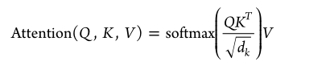
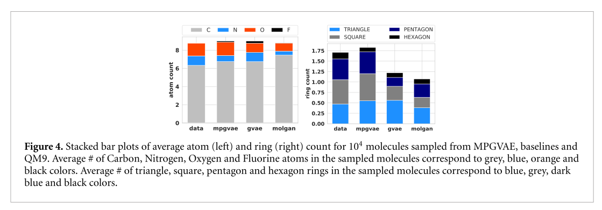
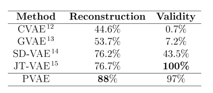
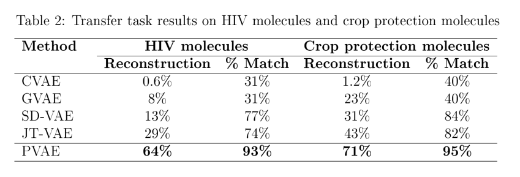
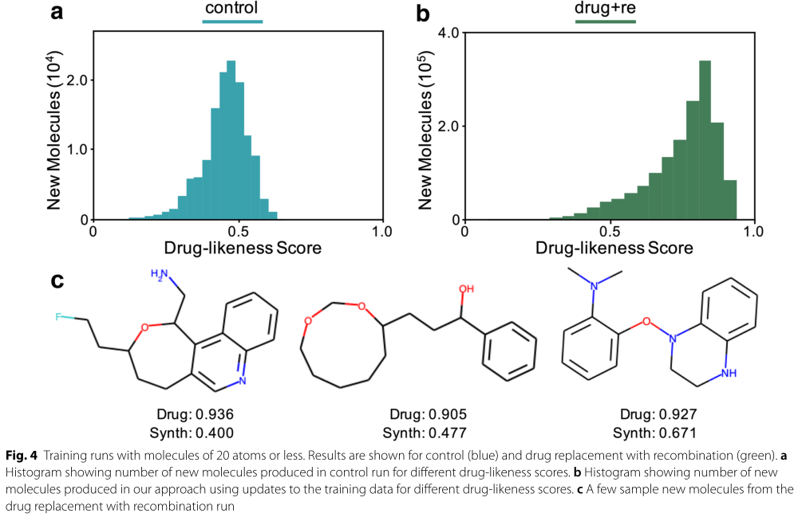
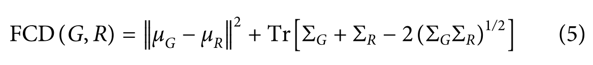

分子生成模型代码链接

| mdeol                                     | data set                                               | coed link                                                    | date |
| ----------------------------------------- | ------------------------------------------------------ | ------------------------------------------------------------ | ---- |
| BIMODAL                                   | ChEMBL                                                 | https://github.com/ETHmodlab/BIMODAL                         | 2020 |
| REINVENT                                  | ChEMBL ExCAPE-DB                                       | https://github.com/MarcusOlivecrona/REINVENT                 | 2017 |
| ChemicalVAE                               | QM9<br />ZINC                                          | https://github.com/aspuru-guzik-group/chemical_vae           | 2018 |
| GrammarVAE                                | ZINC                                                   | https://github.com/mkusner/grammarVAE                        | 2017 |
| SD-VAE                                    | ZINC                                                   | https://github.com/Hanjun-Dai/sdvae                          | 2018 |
| ORGAN                                     | ZINC<br />GDB-17                                       | http://github.com/gablg1/ORGAN                               | 2017 |
| ORGANIC                                   | ZINC<br />GDB-17<br />Harvard Clean Energy<br/>Project | https://github.com/aspuru-guzik-group/ORGANIC                | 2018 |
| LatentGAN                                 | ChEMBL<br />ExCAPE-DB                                  | https://github.com/Dierme/latent-GAN                         | 2018 |
| ARAE                                      | QM9<br />ZINC                                          | https://github.com/gicsaw/ARAE_SMILES                        | 2020 |
| Onco-AAE                                  | NCI-60 cell line assay data                            | https://github.com/spoilt333/onco-aae                        | 2017 |
| LigGPT                                    | MOSES data set<br />GuacaMol data set                  | https://github.com/devalab/liggpt                            | 2021 |
| molecule_<br />structure<br />_generation | BindingDB                                              | https://github.com/dariagrechishnikova/molecule_structure_generation | 2021 |
| MolRNN                                    | ChEMBL                                                 | https://github.com/kevinid/molecule_generator                | 2018 |
| CGVAE                                     | QM9<br />ZINC<br />CEPDB                               | https://github.com/Microsoft/constrained-graph-variational-autoencoder | 2018 |
| MolGAN                                    | QM9                                                    | https://github.com/nicola-decao/MolGAN                       | 2018 |
| GCPN                                      | ZINC                                                   | https://github.com/bowenliu16/rl_graph_generation            | 2018 |
| NeVAE                                     | QM9<br />ZINC                                          | https://github.com/Networks-Learning/nevae                   | 2019 |
| GENTRL                                    | ZINC<br />ChEMBL<br />Integrity                        | https://github.com/insilicomedicine/gentrl                   | 2019 |
| JT-VAE                                    | ZINC                                                   | https://github.com/wengong-jin/icml18-jtnn                   | 2018 |
| DeLinker                                  | ZINC<br />CASF                                         | https://github.com/oxpig/DeLinker                            | 2020 |
| DL4chem                                   | QM9<br />COD<br />CSD                                  | https://github.com/nyu-dl/dl4chem-geometry                   | 2019 |
| GRAPHDG                                   | ISO17 data set                                         | https://github.com/gncs/graphdg                              | 2020 |
| MOLGYM                                    | QM9                                                    | https://github.com/gncs/molgym                               | 2020 |

专用名词
===

`Lead molecular` 先导分子

`Backpropagation` 反向传播

`eigen values` 特征值

`Gate Recurrent Unit（GRU）`门控循环单元

`virtual screening (VS)` 虚拟筛选

`generative chemistry` 生成化学

`recurrent neural networks (RNNs)` 循环神经网络

`variational autoencoders(VAEs)` 变分自编码器

`adversarial autoencoders (AAEs)` 对抗自编码器

`generative adversarial networks (GANs)` 生成对抗网络

`high-throughput biological screening (HTS)` 高通量生物筛选

`Connectionist Temporal Classification (CTC)`

`Syntactic parsing` 语法解析


`lead optimization(L-Opt)` 先导化合物优化:先导化合物往往活性、理化性质等方面可能存在一些缺陷，因此需要对先导化合物进行合理的修饰，才能得到有价值的新药

`Multi-Label Classification` 多标记分类

`Disentanglement` 解纠缠，也叫解耦，就是将原始数据空间中纠缠着的数据变化，变换到一个好的表征空间中，在这个空间中，不同要素的变化是可以彼此分离的。比如，人脸数据集经过编码器，在潜变量空间Z中，我们就会获得人脸是否SMILES、头发颜色、方位角等信息的分离表示，我们把这些分离表示称为Factors。 解纠缠的变量通常包含可解释的语义信息，并且能够反映数据变化中的分离的因子。在生成模型中，我们就可以根据这些分布进行特定的操作，比如改变人脸宽度、添加眼镜等操作。

`ADME` （absorption, distribution, metabolism, and excretion 的缩写）

**吸收、分布、代谢和排泄**性质的优化是最为困难的一环。ADME性质的分析对药物研发的成功与否起关键作用。

`Euclidean  data` 欧几里德数据，

`Kullback-Leibler(KL) divergence` :

`e.g. (exempli gratia)` 例如

`i.e. (id est)` 换句话说，用来进一步解释前面所表明的观点

`toy task`  小任务

`property surface`  属性曲面

`Inception model` :是一个模型

`Kernel Density Estimation(KDE)` ：核密度估计。是在概率论中用来估计未知的密度函数，属于非参数检验方法之一。非参数估计并不加入任何先验知识，而是根据数据本身的特点、性质来拟合分布，这样能比参数估计方法得出更好的模型。

核函数有uniform,triangular, biweight, triweight, Epanechnikov,normal等。这些核函数的图像大致如下图：


**有言论称Epanechnikov 内核在均方误差意义下是最优的，效率损失也很小。**

`Naive RL` 简单的强化模型

`kekulized form` 凯库勒式 

`temperature parameter`：也就是温度参数$t$,论文中的 temperature=1.0 即$t = 1.0$。

这个`t`叫做温度参数，我们加入到softmax中看看会有什么效果。假设我们处理的是一个三分类问题，模型的输出是一个3维向量:

> [1,2,3]

然后计算交叉熵损失，首先我们要通过一个softmax layer，softmax公式大家都很熟悉:


我们得到结果:

> [0.09003057317038046, 0.24472847105479767, 0.6652409557748219]

我们让t=2，其实也就是让[1/2,2/2,3/2]计算softmax，得到结果：

> [0.1863237232258476, 0.30719588571849843, 0.506480391055654]

再让t=0.5，让[1/0.5,2/0.5,3/0.5]计算softmax，得到结果：

> [0.015876239976466765, 0.11731042782619835, 0.8668133321973348]

看到区别了吗，`t`越大，结果越平滑，让本来`t=1`时大的结果变小一点，小的变大一点，得到的概率分布更“平滑”，相应的`t`越小，得到的概率分布更“尖锐”，这就是`t`的作用。

`t`的大小和模型最终模型的正确率没有直接关系，我们可以将`t`的作用类比于学习率。我们的label类似于[1,0,0]，最“尖锐”，如果我们在训练时将`t`设置比较大，那么预测的概率分布会比较平滑，那么loss会很大，这样可以避免我们陷入局部最优解。随着训练的进行，我们将`t`变小，也可以称作降温，类似于模拟退火算法，这也是为什么要把`t`称作温度参数的原因。变小模型才能收敛。比如我们可以这这样设置`t`:


这里的`T`表示的是训练循环的次数。

`构象：`分子的几何形状，也称为构象，是分子最重要的属性之一，它决定了它参与的反应，它形成的键，以及它与其他分子的相互作用。


### 符号表


综述
===

人工智能与深度学习：药物发现的机器智能方法
---

> Artificial intelligence to deep learning: machine intelligence approach for drug discovery

### 摘要

药物设计和开发是制药企业和化学科学家的重要研究领域。然而，低疗效、非靶向给药、耗时和高成本给药物设计和发现带来了障碍和挑战。此外，来自基因组学、蛋白质组学、微阵列数据和临床试验的复杂和大数据也给药物发现流水线带来了障碍。人工智能和机器学习技术在药物发现和开发中发挥着至关重要的作用。换言之，人工神经网络和深度学习算法使该领域实现了现代化。`机器学习和深度学习算法已被应用于多肽合成、基于结构的虚拟筛选、基于配体的虚拟筛选、毒性预测、药物监测和释放、药效团建模、定量构效关系、药物重定位、多药理和生理活性等药物发现过程。`来自过去的证据加强了人工智能和深度学习在这一领域的实施。此外，新的数据挖掘、管理和管理技术为最近开发的建模算法提供了关键支持。总之，人工智能和深度学习的进步为合理的药物设计和发现过程提供了一个绝佳的机会，这最终将影响人类。

与药物设计和开发相关的主要问题是时间消耗和生产成本。此外，低效、不准确的靶向传递和不适当的剂量也是阻碍药物传递和开发过程的其他障碍。随着技术的进步，结合人工智能算法的计算机辅助药物设计可以消除传统药物设计和开发的挑战和障碍。人工智能被称为包括机器学习的超集，而机器学习包括监督学习、无监督学习和强化学习。此外，深度学习是机器学习的一个子集，已经在药物设计和开发中得到了广泛的实施。人工神经网络、深度神经网络、支持向量机、分类和回归、生成性对抗网络、符号学习和元学习是应用于药物设计和发现过程的算法的例子。`人工智能已经被应用于药物设计和开发过程的不同领域，如从肽合成到分子设计，从虚拟筛选到分子对接，从定量构效关系到药物重新定位，从蛋白质错误折叠到蛋白质相互作用，以及从分子途径识别到多元药理学。`**人工智能原理已被应用于活性和非活性的分类、药物释放监测、临床前和临床开发、一次和二次药物筛选、生物标志物开发、药物制造、生物活性鉴定和理化性质、毒性预测和作用方式的鉴定。**

### 介绍

在过去的二十年里，开发高效和先进的系统，以最大的效率和最小的风险进行治疗药物的靶向输送，给化学和生物科学家带来了巨大的挑战[1]。此外，开发新的治疗药物的开发成本和时间消耗是药物设计和开发过程中的另一个挫折[2]。为了最大限度地减少这些挑战和障碍，全球各地的研究人员转向了计算方法，如虚拟筛选(VS)和分子对接，这些方法也被称为传统方法。然而，这些技术也带来了挑战，如不准确和低效[3]。因此，新技术的实施激增，这些技术可以自给自足地消除传统计算方法中遇到的挑战。`人工智能(AI)，包括深度学习(DL)和机器学习(ML)算法，已经成为一种可能的解决方案，可以克服药物设计和发现过程中的问题和障碍[4]。`此外，`药物发现和设计包括漫长而复杂的步骤，如目标选择和验证、治疗筛选和先导化合物优化、临床前和临床试验以及生产实践。所有这些步骤都给确定有效治疗某种疾病的药物带来了另一个巨大的挑战。因此，摆在制药公司面前的最大问题是管理这一过程的成本和速度[5]。人工智能以简单而科学的方式回答了所有这些问题，降低了过程的时间消耗和成本。`此外，制药公司和医疗保健部门数据数字化的增加促使人工智能的实施，以克服审查复杂数据的问题[6]。人工智能，也被称为机器智能，指的是计算机系统从输入或过去的数据中学习的能力。术语人工智能通常用于机器在学习和解决问题过程中模仿与人脑相关的认知行为[7]。如今，生物和化学科学家在药物设计和发现过程中广泛采用人工智能算法[8]。基于AI和ML原理的计算建模为化合物的识别和验证、目标识别、肽合成、药物毒性和理化性质的评估、药物监测、药物效力和有效性以及药物重新定位提供了一个很好的途径[9]。随着人工智能原理以及ML和DL算法的出现，从包含1.06亿多种化合物的化学库中进行化合物的VS变得容易和及时有效。此外，人工智能模型消除了由于偏离目标的相互作用而产生的毒性问题[10]。在这里，我们简要讨论人工智能从ML到DL的演变以及大数据在药物发现过程中的革命性参与。随后，我们对人工智能与传统化学在改进药物发现过程中的结合以及人工智能在改进传统药物发现过程中的应用进行了综述。**然后，我们讨论了人工智能在药物设计和发现过程中的众多应用，如一次和二次筛选、药物毒性、药物释放和监测、药物剂量有效性和有效性、药物重新定位、多药理学以及药物与靶点的相互作用。**


设计受体三维结构以产生新分子的迭代过程被称为从头药物设计，其目的是产生新的动力学。然而，从头开始的药物设计在药物披露中并没有看到无限的用途。此外，由于人工智能领域的进步，该领域最近出现了一些复苏[421,422]。VS已经成为药物改进措施中的一个巨大工具，因为它在大量的混合物中进行了有利可图的研究，进一步扩大了潜在药物线索的产量。作为人工智能的子集，ML是一种用于协调药物线索的VS的技术，它通常包括收集过滤后的化合物集，包含已知的活性和非活性化合物来训练模型[423,424]。在建立模型之后，将对其进行测试，如果足够准确，还可以在以前未知的数据库上使用，以识别新药。在这一部分中，我们讨论人工智能如何被证明是使用从头开始技术的药物设计的福音。

在一项研究中，研究人员利用懒惰的空间描绘来准备一个模型，该模型依赖于类药物相似性(QED)药物相似性分数的定量估计和制造可获得性分数合成可及性分数(SAS)[425]。在另一个分布中，将这种可变自动编码器的呈现与对抗性自动编码器进行对比[426]。该错误布置的自动编码器包括提供新颖复合结构的生成模型。准备了第二个鉴别对抗模型来区分真实粒子和产生的粒子，而生成模型试图欺骗鉴别模型[427]。对抗性自动编码器在本质上比变分自动编码器在生成模式下产生了更多的实质性结构。在与电子计算机模型的混合中，可以得到预期对抗多巴胺受体类型的动态的新结构，2。研究人员利用一种生殖性不良组织(GAN)提出了具有假定抗癌特性的混合物[428]。

RNN同样被有效地用于从头开始的药物设计。因为SMILES串编码字母组中的物质结构，所以RNN已被用来生成复合结构。据观察，RNNs具有利用SMILES串进行药物设计的潜力[429]。类似的方法同样被有效地用于开发新的多肽结构[430]。神经网络学习被有效地应用于使所创建的混合物向所需特性倾斜[431]。同样，转移学习作为另一种系统被用来创造具有理想自然行为的新的合成结构。在接下来的步骤中，组织准备了大量的准备工作来熟悉Smiles语法[432,433]。在随后的推进中，用具有理想运动的混合料进行准备。此外，额外的训练时期足以达到新的组合进入动态原子所涉及的复合空间的阶段。根据这种方法将五个原子结合在一起，可以肯定四个粒子对原子、化学感受器的计划作用[434]。一些不同的设计已经被提出，这些设计创造了合法的、重要的新颖结构。新的合成已经通过这些策略进行了研究，所创建的分子或原子的性质传播类似于所使用的广泛的训练集。这一策略的初步应用是充分的，5个原子中有4个表示理想的作用[435]。人工智能和多目标优化一直是连接化学和生物阶段的一种很有前途的解决方案。开发了基于RNN的新型多目标对，用于基于SMILES的自动从头设计，以寻找理化特性与其受约束的生物目标之间的最佳匹配。结果表明，人工智能和多目标优化可以捕捉连接化学和生物方面的潜在联系，从而为可定制的设计策略提供易于使用的选择，这被证明对线索产生和线索优化都特别有效[436]。

支持向量机、RF、DNNS等ML模型已经被用于药物发现，用于分析从对接到VS[437]的制药应用。最近，药物再利用作为一种创新的方法出现，以最大限度地缩短药物开发持续时间，这通常涉及数据挖掘和人工智能[438]。一个小组提出了一个问答人工系统(QAAI)，它能够重新调整药物的用途，使用谷歌语义AI通用编码器来计算嵌入在红脑JSON数据库中的句子。这项研究在体外验证了脂氧合酶抑制剂药物齐留通作为NRF2途径调节剂的预测，该药物具有减少巨噬细胞M1表型和活性氧产生的潜在应用。这种新的方法已被证明对NDDS中的重新定位是有效的[439]。随着系统药理学和多药理学的迅速发展，多靶点药物的合理设计方法的发展迫在眉睫。第一个全新的多靶点药物配置程序，称为LigBuilder V3(http：//www.。Pkumdl.。Cn/igbu ilder3/)已被设计用于设计不同受体、一个受体的多个偶联位点或一个受体的不同构型的配体。LigBuilder V3再次用于多靶点药物计划和增强，特别是用于具有不同配体结合位点的蛋白质的紧凑配体[440]。从头开始的药物设计积极寻求使用一套化学规则来快速有效地识别具有所需的一组生物学特性的结构上的新的化学类型。此外，基于片段的从头设计工具已经成功地应用于非共价抑制剂的发现。在这里，设计了一种新的方案，称为CoV_FB3D，它涉及通过识别目标蛋白的共价结合位点上的活性片段来在计算机上组装潜在的新型共价抑制剂[441]。


用于药物设计的人工智能和机器学习方法：制药行业面临的挑战和机遇
---

> Artificial intelligence and machine learning approaches for drug design: challenges and opportunities for the pharmaceutical industries

### 摘要

新冠肺炎在全球的传播提升了药品研发作为棘手和热门研究的重要性。开发新的药物分子来克服任何疾病都是一个昂贵而漫长的过程，但这一过程仍在不间断地进行。考虑药物设计的关键是利用现有的数据资源，寻找新的和新的线索。一旦确定了药物目标，几个跨学科领域将与人工智能(AI)和机器学习(ML)方法合作，以获得丰富的药物。这些人工智能和最大似然方法被应用于计算机辅助药物设计的每一步，并且将这些人工智能和最大似然方法结合起来，可以获得高成功率的命中化合物。此外，这种AI和ML与高维数据的融合及其强大的能力又向前迈进了一步。通过AI/ML集成模型进行临床试验产量预测，可以进一步降低临床试验成本，提高临床试验成功率。通过这篇综述，我们讨论了人工智能和最大似然方法在支持计算机辅助药物设计方面的后端，以及它给制药行业带来的挑战和机遇。


在从头药物设计中引入了各种软件和方法，以便在不需要参考化合物的信息的情况下产生新的有效分子。遗憾的是，与其他基于结构的筛选方法相比，这些从头方法在药物设计方法中的应用并不广泛。在该方法中，生成了难以合成的化合物。变分自动编码器有两个神经元网络：编码器和解码器网络[127]。编码网络积极地将化合物的化学结构从SMILES符号转换为实值连续向量。大多数主要分子的反向平移占主导地位，轻微的构象变化以更小的概率存在。在另一项研究中，将变体自动编码器的性能与对抗性自动编码器进行了比较[128]。这些对抗性的自动编码器具有生成新化学结构的生成模型[129]。结合电子计算机模型对新结构的预测显示了更多抗多巴胺受体2型的活性化合物。类似地，Kadurin等人。使用了生成性对抗网络(GAN)，并提出了具有强大而有效的抗癌特性的化合物[130]。此外，递归神经网络(RNNs)在新药设计中得到了广泛的应用。它产生于自然语言处理领域，并通过这种方法提供了顺序信息作为输入。由于SMILES符号串以字母序列对化学结构格式进行编码，因此应用RNN来开发化学结构。RNN用从收集到的大量化合物数据集来训练，比如ChEMBL或一大组商业上可以买到的化合物，以训练SMILES串的神经元网络[131]。这种方法还被用于按顺序或以结构形式产生新的和新颖的肽。`强化学习用于使生成的化合物偏向于预测其重要的核心性质。`另一方面，`转移学习作为一种不同的策略被应用于产生具有预期生物活性的有效的新化合物。`此外，各种类型的体系结构模型都是用ML方法实现的，这些方法能够产生强大的新结构。通过这种方法可以探索新的化学特征，具有与训练集药物分子相似的性质[132]。

在初级药物发现阶段预测先导分子的不良物理化学性质将大大降低失败的风险。为此，图8提供了模型表示。已经开发了几种基于DL的方法，并用经典模型实现。这项研究是由Duvenaud等人进行的。`使用CNN-ANN算法从具有高可解释性的有效预测性能的分子图中提取信息来预测先导分子的溶解度[164]。`在这种方法中，回溯法可以得到像亲水性R-OH基团一样的溶解性分子片段。紧随其后的是Devenaud，Coley等人。发展了一种基于张量的卷积嵌入属性分子图方法来预测分子在水环境中的溶解度，该方法优于Duvenaud模型。`Coley的模型应用深原子水平信息来预测先导分子在水介质中的溶解度。`除了渗透系数外，对Caco-2渗透系数的预测对于评估先导分子的药代动力学特性起着至关重要的作用[165]。这项研究是由Wang等人进行的。以1272个配体分子为研究对象，利用Caco-2渗透性数据，采用支持向量机回归、偏最小二乘(PLS)和多元线性回归(MLR)算法对模型进行改进，建立了30个描述子的预测模型。这些模型对测试集分子的预测能力较好(R2=0.81，RMSE=0.31)，并且严格遵循经济合作与发展组织(OECD)关于QSAR/QSPR的原则，保证了模型的合理性和可靠性[166]。

在早期，制药公司每年大约花费超过50亿美元。在本世纪头十年晚些时候，估计为300亿美元。研发投入增加了约8750亿美元，2010年预计在960亿美元左右。在过去的几十年里，制药公司已经应用了一些基于利平斯基规则、类药物和类先导过滤器的规则，以避免不受欢迎的ADME/T曲线[167]。先导分子的生物利用度是一个重要的药代动力学参数。因此，生物利用度的预测可以指导药物化学家优化试验分子。在ADME研究中，ML技术和实现侧重于建立预测模型，该模型提取有效的训练数据模式并预测新先导分子的pk值[168]。在ADME过程中使用了几种类型的ML模型，这些模型对于建立分子描述符(如PLS、MR和DT矩阵)之间的关系非常有帮助。其次是吸收，`药物分布是预测血液到肠液和细胞间液药物循环的重要预测指标`，`药物分布的稳态是药物体内剂量与血药浓度的比值。`**预测药物在组织中的稳态分布是评价药物分布机制的重要标准[169]**。因此，高精度的药物代谢位点预测可以指导药物的优化，从而获得分子的稳定机制。使用ML方法对大数据集进行预测。它还可以用来预测代谢部位和参与代谢的酶，如细胞色素P450、UDP-葡萄糖醛酸基转移酶(UGTS)和醛氧化酶。例如，神经网络方法XenoSite的发展提供了新陈代谢位点的可能性，总体准确率为87%。排泄是消耗药物的关键步骤，其代谢产物要排出体内。药物代谢物以其在水中的溶解性而闻名，很容易被排泄出来，而大多数药物可以直接消除而不需要代谢。Lambardo et al.。将偏最小二乘(PLS)模型应用于人体清除率预测，取得了较好的判别效果，预测准确率达到84%。根据排泄机理，用预测的PLS模型预测药物排泄量[170]。

在药物开发过程中，大多数先导分子可能会在临床前和临床毒性方面失效。因此，毒性预测在药物优化应用中是强制性的，并降低了出错的风险。传统上，肝和肾毒性研究是通过基于规则的专家知识和结构警报来预测药物毒性分布[171]。因此，近年来，DL方法被应用于各种化学特征及其优点的自动处理，并在毒性预测方面取得了很好的效果。例如，编码卷积神经网络的分子图(MGE-CNN)与急性口服毒性预测模型一起，获得了比以前报道的基于支持向量机模型的结果更准确的结果。他们的研究将原子级信息中指纹的所有毒理学特性与ToxAlters定义的结构性警报进行了映射[172]。在另一项研究中，迈尔等人。开发了一个用于毒性预测的多任务DNN模型(DeepTox)，该模型比其他模型具有更好的性能。药物分子的ADME/T性质显示出一定的相关性，`多任务神经网络可以提高性能[173]。该研究采用ML驱动的方法，能够准确预测一些重要的物理化学性质，如水溶性、亲脂性等。`ML算法的改进模型能够更好地预测分子性质，但进展有限。

其他分类模型如DT、K近邻(KNN)、支持向量机(SVM)、神经网络(NN)和RF等已被广泛用于预测先导分子的ADME/T性质，但它们在这一领域还有待进一步发展。基于AI和ML的ADME/T预测的最新进展归因于异质药物发现数据，如基于细胞的分析和生化活动[174]。`亲脂性的预测是药物发现过程中一个重要的物理化学性质，因为亲脂性是调节几个关键药动学性质的关键因素。先导分子的亲脂性明显影响先导分子的膜通透性，并影响ADME的行为[172-177]。`传统上，辛醇-水分配系数/pH依赖分配系数(LogD)和替代方法脂质体/水分配和固定化人工膜(IAM)是预测脂溶性的标准金方法。然而，传统的计算方法，如基团贡献法(GC)、方程式状态、量子化学驱动的方法(如分子模拟)和线性/非线性QSAR被广泛采用来预测具有分子描述符的高度相关的logP/logD[178]。Riniker等人。开发了代表MDFP+的新的分子动力学特征来预测logP。他们发现了比严格的MD计算更丰富的信息指纹[179,180]。因此，基于人工智能的方法被利用并预测logP。然而，基于所有训练数据集的准确性和效率，协议可能彼此不同，这限制了与其他基于物理的方法相比的适用范围[181]。


人工智能在药物设计中的应用现状综述
---

> An In-depth Summary of Recent Artificial Intelligence Applications in Drug Design

### 摘要

作为一种在广阔的化学空间中导航的有前途的工具，人工智能(AI)被用于药物设计。从2017年到2021年，最近几个人工智能模型(即图形神经网络(GNN)、递归神经网络(RNN)、变异自动编码器(VAE)、生成性对抗网络(GAN)、流(Flow)和强化学习(RL))在药物设计中的应用数量显著增加。相关的文献综述很多。然而，没有一本书对最近的人工智能模型在药物设计中的许多应用进行了深入的总结。为了补充现有的文献，本综述包括前面提到的人工智能模型的理论发展和42个人工智能在药物设计中的最新应用的详细总结。具体地说，其中13个利用`GNN进行分子性质预测`，29个利用RL和(或)深度生成模型进行分子生成和优化。在大多数情况下，总结的重点是药物设计中特定任务的模型、它们的变体和修改。此外，表中还简要总结了人工智能在分子生成和优化中的另外60个应用。最后，这项调查对丰富的应用进行了全面的讨论，从而使基于人工智能的药物设计中的任务、潜在的解决方案和挑战变得显而易见。

### 介绍

背景资料。<font color='red'>人工智能(AI)分子设计的研究领域受到了极大的关注，主要是因为人工智能可能是迄今为止最有希望有效探索人类智能无法处理的分子空间的方法。</font>基于人工智能的分子设计领域可以根据<font color='red'>小分子</font>、<font color='red'>生物分子</font>(例如蛋白质、RNA和DNA)和<font color='red'>无机分子</font>等分子类别分为几个子领域(Chen等人，2020a；Eismann等人，2021；Ingraham等人，2019年；Jing等人，2021；熊等人，2021；姚等人，2021)。在这些子领域中，基于人工智能的小分子设计是本调查的主题，尽管来自不同子领域的方法通常可以互换使用，只需稍加修改，如改变分子表示(酱等人，2020年)。`小分子的一个共同用途是充当治疗疾病的小分子药物。`简而言之，除非另有说明，本调查中的“药物”和“分子”是指“小分子药物”和“小分子”。

药物设计是漫长而昂贵的药物发现和开发过程的一部分(Blass，2015；Wong等人，2018年)。整个过程一般包括四个阶段：`1.疾病靶标确定，2.分子筛选和先导发现，3.涉及动物试验的临床前发展，4.涉及人体试验的临床发展(Tonkens，2005)。`**基于人工智能的药物设计有可能极大地简化第二阶段。**具体地说，它可以识别或产生对疾病靶点有效并具有其他药物特性的分子结构。因此，人工智能可以加快药物发现和开发过程，并增加投资回报。此外，基于人工智能的药物设计方法可以很容易地纳入实验室自动化，这是另一个受到极大研究兴趣的领域(Coley等人，2020a；Coley等人，2020b；Dimitrov等人，2019年)。

近年来，`人工智能在药物设计中的应用主要围绕深度学习(DL)展开`。DL在药物设计中越来越受欢迎主要有三个原因。<font color='red'>最明显的是深度学习的理论进步。</font>与图神经网络(GNN)和深度生成模型相关的理论有很大一部分是在过去10年中建立的(Bronstein等人，2017；Guo&赵，2020；Liu&周，2020)。在计算机科学界和化学界的努力下，新的模型及其变体正在迅速地被利用或开发，以解决药物设计中具有挑战性的任务。<font color='red'>在药物设计中增加DL使用的另一个原因是分子数据可用性的提高。</font>训练一个多参数的深度神经网络需要大量的数据。目前，有几个大型公共化学数据集包含有关一般分子属性的信息(Gaulton等人，2012年；Kim等人，2016年)。此外，`最近改进的高通量筛选技术可以在实验中以前所未有的快速度获得感兴趣的分子特性`(Baudis等人，2014；David等人，2019年)。然而，作者需要提醒读者，`在许多情况下，低数据可用性和低质量仍然是药物设计中使用的DL模型表现不佳的罪魁祸首`(Walters&Barzilay，2021)。<font color='red'>DL在药物设计中流行的第三个原因是硬件的进步。</font>与传统CPU相比，GPU和TPU训练深度神经网络的速度要快得多(Jouppi等人，2017年)。此外，云计算使没有必要硬件的用户可以使用GPU和TPU(Armbrust等人，2010年)。

`基于人工智能的药物设计有三个共同目的：分子性质预测、分子生成和分子优化。`分子性质预测主要是确定定量构效关系(QSAR)。在DL出现之前，其他机器学习(ML)技术和计算模型被用于预测QSAR(Chen等人，2018年；Zhang等人，2017年)。当使用包含DL的通用ML时，如果预测分子性质的连续值，则本质上是回归，或者，如果预测离散的类别标签，则是分类。`在DL中，根据分子表示的选择和其他考虑因素，可以使用卷积神经网络(CNN)、递归神经网络(RNN)、图神经网络(GNN)和/或多层感知器(MLP)来预测分子性质`。基于DL的分子性质预测至少达到了现实世界的两个里程碑。(Stokes等人的研究成果,2020)通过GNN从化合物库中鉴定出一种有效治疗动物模型感染的抗生素--大蒜素。(酒井等人(Sakai  et  al.)，2021)在GNN的行为研究中发现了一种具有抗抑郁作用的高活性5-羟色胺转运体抑制剂。<font color='red'>基于DL的分子性质预测通常是分子生成的一部分</font>，下面将讨论这一点，它本身就取得了很好的效果。

在这里，分子生成也被称为<font color='red'>反向QSAR</font>或<font color='red'>从头开始的分子设计</font>。分子性质预测和分子生成与输出具有感兴趣的性质的分子具有相似的目的。然而，`具有所需性质的分子可能不在现有的分子数据库中，并且未被探索的化学空间极其广阔。设计分子生成技术的动机主要是在未知的化学空间中导航。`<font color='red'>计算分子生成并不新鲜，以前经常使用不基于DL的方法(Schneider&Fechner，2005)。深度生成模型最初是为自然语言处理(NLP)和计算机视觉等其他领域开发的，最近在分子生成领域占据主导地位</font>(Oussidi&Elhassouny，2018年)。<font color='cornflowerblue'>深度生成模型通常基于RNN、变分自动编码器(VAE)、产生式对抗性网络(GAN)和Flow。</font>

`药物设计的第三个子领域是分子优化`，`其目的是改善分子的性质`。<font color='red'>分子优化通常通过强化学习(RL)、贝叶斯优化(BO)和其他方法与分子生成同时进行</font>(Frazier，2018年；GómezBombarelli等人，2018年；Popova等人，2019年)。这里单独考虑它，<font color='cornflowerblue'>因为有一些基于人工智能的模型旨在专门修改分子以改善性能，而不是从头开始生成分子(周等人，2019年)。这样的模型在药物发现过程的先导优化步骤中可能特别有用。</font>

本调查的背景部分以基于人工智能的药物设计的分子表示法的简要讨论结束。在这项调查中最常提到的代表是简化的分子输入线输入系统(SMILES)和分子图。<font color='red'>1988年开发的SMILES分子表示是基于文本字符串</font>(Weininger，1988)。<font color='red'>文本串表示使得许多NLP技术易于应用于药物设计。</font>然而，<font color='cornflowerblue'>SMILES并不是分子的自然表现</font>。<font color='cornflowerblue'>这促使了分子图的使用，这是一种更容易解释的分子表示</font>(David等人，2020年；Gaudlet等人，2020年)。在大多数情况下，<font color='red'>分子图是以原子或子结构为节点，以化学键为边来构建的。</font>图的连通性通常用邻接矩阵来表示，节点和边的属性通常用特征张量来表示。除了分子图之外，本次调查涉及的另一种图类型是分子网络，它是以分子实体为节点，以分子间的相互作用或相似性为边来构建的。与分子图相比，分子网络通常要大得多。

#### 基于深度学习的分子性质预测

`感知器理论、MLP理论、CNN理论和GNN理论。`<font color='red'>感知器受到生物神经元的启发，是一种单层前馈神经网络。感知器被认为是深度神经网络的基本模块。</font>感知器可以用作线性二元分类器，通过线性预测函数将可训练的权重和输入特征相乘和组合来输出分类预测。采用Heaviside阶跃函数进行激活。为了提高分类精度，通常在激活前使用一个可调偏倚项来移动决策边界。感知器也可以用于回归。在训练过程中，随机初始化权重，并分别使用每个输入样本进行梯度下降训练。当模型已经用所有输入样本训练了一次时，一个历元就结束了。感知器超参数包括训练周期数和学习率。训练时段的数量通常与停止标准相关联。太少和太多的时代分别导致不适应和过度适应。学习率通过影响权值更新来控制感知器的学习速度。这两个超参数在一般神经网络中也很重要。

<font color='red'>多层感知器是感知器的扩展，它是一个前馈神经网络，除了输入层和输出层外，还有至少一个隐含层(Pal&Mitra，1992)</font>。因此，MLP具有多层次的特点，属于深度学习。同样，CNN、GNN和RNN也在深度学习。反向传播用于最大限度地减少MLP训练过程中的损失。请注意，普通MLP的完全连接性可能会使其容易过度安装。

卷积神经网络的灵感来自视觉皮层，它非常适合于网格状输入，如图像(Albawi等人，2017；Aloysius&Geetha，2017)。因此，它在计算机视觉中得到了广泛的应用。与MLP相比，CNN具有参数少、过拟合倾向低、效率高等优点，同时可以捕获输入的空间信息。CNN具有复杂的体系结构，通常包括输入层、交替的卷积层和汇聚层、完全连接层和输出层。卷积层应用输入矩阵和卷积滤波器(即，权重和偏差的向量)的点积。RELU通常用作激活功能。在滑动滤波器的路径覆盖整个输入矩阵之后完成特征映射。为了满足某些与任务相关的要求和计算效率，使用池化层(例如最大或平均池化)来降低卷积后的中间数据维度。通常，与MLP类似的完全连接的图层位于卷积和池化图层之后。CNN架构在输出层结束。与MLP相比，CNN具有更多的超参数，如过滤器大小、过滤器步幅和合并类型。

<font color='red'>图神经网络理论。</font><font color='cornflowerblue'>MLP和CNN是专门为欧几里德数据设计的。</font>与欧氏数据相比，图是不规则的，因为节点数量的变化和不同节点的邻居节点数量的变化。因此，传统的神经网络不能直接应用于图形式的数据。这推动了GNN的发展。GNN的一些开创性工作是从2005年到2010年完成的(Gallicchio和Micheli，2010年；Gori等人，2005年；Scarselli等人，2008年)。随后提出了大量的GNN变体，可分为三类：递归GNN(RecGNN)、卷积GNN(ConvGNN)和时空GNN(STGNN)。我主要讨论ConvGNN在本次调查中的应用。在Lusci等人的论文中可以找到RecGNN在分子性质预测中的应用(2013)和Wieder等人(2020)。STGNN适用于节点属性随时间变化的图，因此与本次调查无关。


图1.在分子性质预测中使用ConvGNN进行图形分类/回归的简化示例。每个分子都由一个带有特征向量和邻接矩阵的图表示。消息交换更新节点信息。然后获得图嵌入，并将其用于属性预测。

ConvGNN可以进一步分为两类：频谱ConvGNN和空间ConvGNN。频谱ConvGNN在谱域分解图信号后，对谱部分进行谱滤波。**ChebNet**被提出通过绕过拉普拉斯特征向量的计算来降低与谱ConvGNN相关的计算成本*(Defferrard等人，2016年)*。在ChebNet中，谱滤波器用Chebyshev多项式逼近。图卷积网络(GCN)被提出通过使用更多的近似来简化ChebNet(Kipf&Wling，2016)。GCN在频谱和空间ConvGNN之间架起了桥梁。空间ConvGNN通过将每个节点的当前要素与其相邻节点的要素进行卷积来更新每个节点的要素。空间ConvGNN是本综述的重点，稍后将通过一系列示例来说明其细节。

<font color='red'>ConvGNN主要用于三个任务：节点分类、链接预测和图分类/回归。</font>节点分类通常属于半监督学习的范畴，它是在给定其他节点的标签的情况下预测图中未标记节点的标签。链路预测任务是在给定两个节点的信息的情况下预测边的存在和身份。当图形是分子网络时，链接预测已被应用于预测药物-靶点和药物-药物相互作用(Huang等人，2020年)。

`ConvGNN在药物设计中的中心任务是图形分类/回归，用于分子性质预测(Hwang等人，2020年)。`对于图形分类/回归，ConvGNN通常与池和读出操作相结合以获得紧凑的图形表示，然后使用MLP来完成端到端框架。图1是使用ConvGNN进行图形分类/回归的简化示例。有关GNN的更多详细信息可以在其他地方找到(Wu等人，2020；Zhang等人，2019b；周等人，2020)。第2节的剩余正文总结了GNN在分子性质预测方面的13个应用/进展。请注意，后三个示例的主要主题是分子网络的链接预测。

(Duvenaud等人，2015)通过修改当时最先进的环形指纹模型之一，发展了一个用于分子性质预测的开创性空间ConvGNN模型(Glen等人，2006年)。在环形指纹模型中，通过环形指纹算法计算与分子相关联的特征向量。特征向量随后被馈送到用于化学性质预测的全连接神经网络。环形指纹算法是开发适用于图形的神经网络的一个很好的起点，部分原因是环形指纹类似于CNN。具体地说，圆形指纹法在任何地方都使用相同的局部操作，然后是汇集步骤。然而，由于散列和索引操作，圆形指纹是不可区分的。因此，圆形指纹模型不能进行端到端的训练。为了解决这个问题，用单层神经网络代替散列运算，用SoftMax代替索引运算。经过改进，建立了一个支持端到端训练的早期空间ConvGNN模型用于分子性质预测，该模型可以直接对任意大小和形状的分子图进行操作。

(Coley等人,2017年)。<font color='red'>大多数化学性质(如logP和melting point(熔点)都受到分子全局信息的严重影响，而不仅仅是连接性。</font>为了提高对这些化学性质的预测精度，Coley等人提出了一种新的预测方法。Duvenaud等人提出了与该模型相关的另一种空间ConvGNN模型。他们帮助模型捕捉分子全局信息的策略是将原子的“全局属性贡献”合并到相关的原子特征中。例如，一个分子的总极性表面积是由所有原子共同决定的。因此，每个原子的极性表面积贡献可以用作相关原子特征的一部分。在其GNN模型的每一层/深度，每个原子的特征都基于原子本身、其相邻节点和边的特征向量来更新。边特征保持不变。将所有原子的更新后的原子特征向量转换为原子指纹，并将其相加形成分子指纹。对GNN的每一层重复该过程。最后，将各层得到的分子指纹进行汇总，然后利用下游神经网络对分子性质进行预测。

此外，作者还指出了除了下游回归外，分子嵌入策略的重要性。传统的基于描述符的分子嵌入如果描述符遗漏了关键的分子信息，其性能可能会低于平均水平。`相比之下，GNN嵌入方法使得复杂的QSAR可以直接从分子图和特征中学习。`

D-MPNN(有向消息传递神经网络)(Yang等人，2019a)。D-MPNN是基于Dai等人以前的模型。(2016)。该模型的部分名称MPNN来自Gilmer等人提出的通用MPNN框架。(2017年)。许多GNN模型的图形卷积通常是节点偏心的。相比之下，D-MPNN的卷积以有向边缘为中心。作者指出，这样的修改可以防止与以节点为中心的消息传递相关联的抖动，从而减少与图表示相关联的噪声。在基于边的消息传递之后，基于传入的边特征来更新节点表示。读出阶段使用节点表示来确定分子嵌入，该分子嵌入随后用于性质预测。作者还提出了一种帮助分子嵌入捕获全局分子信息的策略。全局分子特征首先通过通用化学信息学软件RDKit计算(Landrum，2013)。在D-MPNN的读出阶段，将全局分子特征与D-MPNN嵌入的学习分子连接起来进行性质预测。

大蒜素的鉴定(Stokes等人，2020年)。DMPNN是用于确定大蒜素为抗菌候选药物的模型，在小鼠模型中显示出治疗感染的有效性。在这项开创性的工作中，D-MPNN用2335个分子进行训练，以预测给定分子的抗菌性能。训练好的模型随后被用来预测来自多个文库的>1.07亿个分子的抗菌性能。具有良好的抗菌性能、发散结构和高利用率的化合物被优先选择。这一过程最终导致从药物再利用中心鉴定出大蒜素。此外，与常规抗生素相比，大蒜素呈现出不同的结构。这表明该模型在预测新化学品性质方面具有较好的普适性。

具有额外全球节点的MPNN(Li等人，2017年)。Li等人。采用另一种方法使GNN能够捕获全球分子信息。在介绍他们的模型之前，作者解释了为什么香草MPNN未能捕捉到分子的全局信息。香草MPNN通常含有很少的层，因此与分子大小相比，所产生的感受场较小。感受野不能简单地通过增加更多的层来捕捉全球分子信息来扩大，因为在训练数据有限的情况下，更多的层可能会导致过度拟合。

在他们的模型中，李等人。向分子图中添加额外的全局节点。全局节点通过从局部节点指向全局节点的有向边连接到图中的所有局部节点。在消息传递过程中，更新本地节点的信息。同时，由于有向边指向全局节点，全局节点的特征也利用所有局部节点的特征进行更新。因此，全局节点仅通过一层消息传递就可以捕获整个图的信息。全局节点的特征被用作下游分类或回归的分子特征。

<font color='red'>分层消息间传递</font>(Fey等人，2020)。Fey等人。提出了一种层次消息传递模型来捕捉分子环结构等层次信息。他们的模型在两个图上运行：原始分子图及其相关的连接树(JT)。JT的节点是分子亚结构。原始分子图和JT图分别捕捉了分子的精细细节和粗略细节。JT的概念首先是在JT-VAE模型中提出的(jin等人，2018a)，它将在第5节中讨论。给定分子的粗图和细图，分子的表示是通过使用从粗到细和从细到粗的信息流在每个图内和两个图之间传递信息来学习的。因此，可以有效地表示分子层次信息。

<font color='red'>MPNN用于四面体手性</font>(Pattanaik等人，2020年)。Pattanaik等人建立了MPNN模型。来处理具有四面体手性的分子，这是立体化学的一种常见类型。具有不同立体化学的分子具有相同的图形连通性，因此，立体化学不能被传统的MPNN所识别。然而，立体化学会影响许多分子性质。将立体化学信息包括到原子或键的特征向量中的方法通常是有限的。作者认识到对称聚集函数(例如均值、和和最大值)是传统MPNN结构中阻碍立体化学检测的部分。这促使作者为MPNN开发了两个聚集函数，它们可以在性质预测中区分具有四面体手性的分子。它们将两个聚集函数表示为“排列”和“排列-串联”。这两个函数被结合到几个GNN模型中(即，Xu等人的图卷积网络、图同构网络)。(2018)和D-MPNN)来访问性能。除了四面体手性外，还有其他立体化学类型。为他们开发GNN模型将是一个有趣的方向。

<font color='red'>预训练GNN。</font>`当训练和测试示例具有不同的分布并且特定于任务的标签不足时，预训练特别有用。`现有的图级多任务监督学习等预训练策略不能显著提高GNN的预测性能。为此，作者提出了两种自监督节点级预训练技术：上下文预测和属性掩蔽。在上下文预测中，图的子结构用于预测周围的图结构。在属性掩蔽中，对特定的节点/边缘特征进行掩蔽，并根据邻域信息利用GNN对这些特征进行预测。这是节点分类/回归任务的示例。在节点级预训练后，采用图级多任务有监督学习进行图级预训练。在图级预训练之前进行节点级预训练，以缓解图级多任务监督预训练中不相关任务的负面影响。

DGraphDTA(双图药物靶向亲和力预测)(酱等人，2020年)。上述工作属于基于配体的评分，即根据药物本身来预测药物的性质。一个相关但不同的类别是<font color='red'>药物靶标亲和力(DTA)预测</font>，它是虚拟筛查的重要组成部分<font color='red'>。DTA度量的示例包括结合亲和力、解离常数和IC50值。</font>在这个由GNN实现的DTA预测示例中，作者在蛋白质(靶标)和分子(药物)的图形表示上使用了两个GNN模型，以获得两个嵌入物，并将这两个嵌入物连接起来进行DTA预测。这项工作的主要贡献是解决与蛋白质图构建相关的挑战。如果在图表构建过程中将一个典型的蛋白质作为一个小的药物分子来对待，那么预计会出现一个大得令人不快的图表。另一种方法是用氨基酸作为节点，用肽键作为边来构建图形。但是这种方法会导致类似于蛋白质一级结构的长链，因此不能有效地捕捉蛋白质的二级和三级结构。为了解决这一问题，作者使用氨基酸作为节点，并用联系图来表示氨基酸之间的相互作用。通过Michel等人的Pconsc4方法，基于蛋白质序列构建了接触图。(2019年)，所得到的结构相当于一个图。

`Decagon`(Zitnik等人，2018年)。从这里开始，示例是关于使用GNN进行链接预测来预测分子网络中的一般化学相互作用。如前所述，网络图是以化学实体为节点，以相互作用为边来构建的。十角形被提出用来预测药物与药物相互作用引起的药物组合在人体内的不良反应。以药物和蛋白质为节点构建了一个图。基于三种类型的相互作用来链接节点：1.蛋白质-蛋白质相互作用，2.药物-蛋白质相互作用，以及3.药物-药物相互作用所代表的副作用。每种副作用都由边缘类型表示。因此，副作用预测被转化为边缘一致性预测。本文研究的任务是多通道网络中的多关系链接预测。Decagon使用GNN作为编码器来嵌入药物和蛋白质，并使用张量分解模型作为解码器来预测药物之间的副作用。

`DTI-GAT`(药物靶相互作用-图形注意网络)(Wang等人，2021b)。DTI-GAT用于药物-靶点相互作用预测。DTI-GAT的图形表示类似于十角形，以药物和蛋白质为节点，有多种边类型。具体地说，DTI-GAT的边缘类型包括药物与药物的相似性、蛋白质的相似性和药物与蛋白质的相互作用。作者指出，目前流行的仅以药物-靶相互作用为边的二部图表示方法限制了节点嵌入过程中的信息流，使用边较多的异构图可以缓解这一问题。作者采用了图注意网络(Veličković等人，2017年)，它使用了在网络中自适应学习边权重的自我注意机制。因此，不需要关于给定节点的邻居节点的相对重要性的先验知识。消息传递后，一对蛋白质和药物的嵌入通过解码器用于DTI预测。作者还认为，学习到的注意力权重可以提供有关DTI拓扑结构和相似性的线索。

`SkipGNN`(Huang等人，2020年)。这项工作的作者指出，许多相关工作只捕捉了分子网络中的直接相互作用(称为直接相似性)，用于分子相互作用预测。SkipGNN的主要贡献是捕获了除直接相互作用之外的二阶相互作用(称为跳跃相似度)。分子网络由两个图表示：用于获取直接相似度的原始图和用于获取跳跃相似度的跳图。在节点嵌入阶段，两个GNN被应用于两个网络图，并且两个GNN被设计成相互交互。将所获得的节点嵌入用于交互预测。最终的模型学会平衡使用直接相似性和跳过相似性进行交互预测。

#### 基于RNN的分子生成与优化

`RNN理论。`RNN于20世纪80年代提出(Hopfield，1982；Jordan，1986)，<font color='red'>适用于处理具有序列结构的数据和不同长度的数据。</font>序列可以是时态的，也可以是非时态的，本调查使用时间步长来表示这两种序列的步长。与标准前馈神经网络的输出仅依赖于输入不同，RNN通过使用当前输入和前一时间步的输出来确定每个时间步的输出。通常，最终输出用于计算损耗，该损耗以相反的顺序通过时间步长反向传播(缩写为BPTT)。从理论上讲，输入序列中的长程相关性可以通过一个普通的RNN来跟踪。然而，BPTT可能会导致梯度在非常早的时间步长渐近接近于零，这是因为涉及到使用有限精度数进行重复矩阵乘法的计算。同时，梯度也可以不受限制地增长。两种可能性分别被称为消失梯度和爆炸梯度(Pascanu等人，2013年)。

消失梯度问题阻止了梯度到达早期时间步长。因此，香草RNN在实践中未能跟踪长期依赖关系。长短期记忆(LSTM)于1997年前后提出(Hochreiter&Schmidhuber，1997)，是一种有效的结构来缓解消失梯度问题，使RNN能够捕捉长期依赖。LSTM单元的一个示例具有一个单元和三个门(输入门、输出门和遗忘门)。细胞记住以前的信息，闸门调节信息流。LSTM结构复杂，计算量大。为了解决这一问题，2014年提出了门控经常性单位(GRU)(Cho等人，2014年)。与LSTM相比，GRU需要的参数更少，并且没有输出门；但它的性能与LSTM相似。另一个有趣的RNN变体是双向RNN，它除了允许来自过去时间步长的信息外，还允许来自未来时间步长的信息影响当前时间步长的输出(Schuster&Paliwal，1997)。RNN变体存在，有关RNN的更多细节由Goldberg(2016)、Lipton等人提供。(2015年)和Tarwani&Edem(2017年)。<font color='red'>通过将分子看作序列，RNN可以用于分子性质的预测。</font>

在使用目标序列进行训练之后，RNN还可用于根据训练集生成新序列(Bacciu等人，2020；Graves，2013；Oliverona等人，2017)。当输入序列的开头时，生成过程开始。在每个生成步骤，基于中间序列确定下一序列分量的概率分布。从分布中采样一个序列分量，并更新中间序列。例如，中间序列可以是SMILES表示“C1CCC”。在生成过程中，将为下一个原子分配不同的概率，如‘C’、‘H’、‘O’和‘Cl’。如果选择了‘C’，则该字符串将变为“C1CCCC”，用于下一个生成步骤。该过程在剩余的生成过程中重复。生成过程的随机性导致了序列的多样性。LSTM的RNN可用于生成复杂的长程序列(Graves，2013)。<font color='red'>RNN的生成过程往往存在收敛问题和不稳定性。</font>teach forcing是解决这一问题的常用方法(Koline&Kremer，2001)。teach forcing总是使用地面真实序列作为下一预测的输入，而不是使用生成的中间序列来预测下一序列分量。在这里，仅总结了RNN在分子生成和/或优化方面的两个应用。然而，RNN经常与其他AI技术一起使用，在介绍这些技术之后，将在未来的章节中提供更多涉及RNN的应用程序。

*(Segler等人,2018a)*,建立基于RNN的三层LSTM层叠生成模型，并将其与迁移学习相结合，在低数据量条件下生成对金黄色葡萄球菌和疟疾具有活性的分子。`迁移学习用于解决基于人工智能的药物设计中常见的数据不足问题。`<font color='red'>在迁移学习中，大数据集通常可用于为相关但不同的任务训练ML模型，以从数据中学习一般特征，然后用较小的数据集为感兴趣的任务重新训练模型。这个过程被称为微调。</font><font color='cornflowerblue'>迁移学习有效地防止了对小数据集的过度拟合</font>(庄等人，2020年)。**作者首先使用以SMILES为代表的普通分子的大型数据集来训练RNN生成模型，该模型随后可以生成新颖但普通的分子。接下来，对这个模型进行微调，加入一小部分对金黄色葡萄球菌和疟疾有活性的分子，这样就可以产生更多对相同目标有活性的分子。此外，作者还模拟了一个自动药物发现周期的例子，包括6个步骤：1.用RNN生成分子；2.虚拟分子合成；3.分子性质评价；4.选择具有所需性质的分子；5.用选择的分子重新训练RNN生成模型；6.重复。**

GraphRNN(You等人，2018b)。GraphRNN是一种基于RNN的图形生成模型，在图形上进行训练。它后来被修改并专门应用于MolecularRNN中的分子图生成过程(Popova等人，2019年)。在生成推理阶段，GraphRNN将图形生成过程分解为两个耦合的子过程：图级RNN和边级RNN。图级RNN生成一系列节点，并捕获图状态。对于序列中的每个新添加的节点，通过从图级RNN的中间状态开始的边级RNN生成边序列(由邻接向量表示)。注意，GraphRNN生成过程遵循广度第一顺序，这避免了对所有可能的节点排列训练GraphRNN，并减少了边级RNN进行的边缘预测的次数。因此，提高了GraphRNN的可扩展性，并可以生成更大的图。

#### 基于强化学习的分子生成与优化

`RL理论。`早在20世纪50年代，RL的紧急状态就受到了生命体行为的启发。RL既有深思熟虑的计划，也有“试错”的方法。一种药物(如计算机)具有特定的目标(如设计对某些疾病靶点具有高亲和力和特异性的药物)，并通过评估环境(如电子密度和共轭等化学环境)和从动作空间中选择动作(如改变化学键类型和添加官能团)来影响环境并导致状态转变，从而与环境相互作用(如获得捕捉环境的状态)。基于感知状态的动作选择标准是策略，其范围从简单的查找表到复杂的随机映射。每一次状态转换都会产生奖励，奖励直接由状态和行为决定。Agent人的目标是使长期累积报酬最大化。奖励间接取决于政策，政策可能会改变以增加奖励。长期累积奖励由状态转换的即时奖励和后续状态转换的未来奖励共同决定。显然，只追求即时回报最大化是目光短浅的，可能会损害累积回报。例如，<font color='red'>在分子的早期阶段添加一些有利于某些性质的官能团，最终可能会导致一个低于平均水平的全局结构，从而损害感兴趣的性质。</font>与远见相关的概念是价值，它表征了在一定状态下长期积累的预期回报。<font color='cornflowerblue'>为了最大限度地提高累积回报，估计价值是一件特别有趣的事情。与价值密切相关的一个概念是Q函数，它在数学上表示给定当前状态和所采取行动的预期累计回报。</font>请注意，应该考虑在“试错”方法中利用经验和探索新选择之间的权衡，以最大化总回报。倾斜到任何一方都会损害RL模型，这种担心促使人们采用诸如上置信限算法、梯度盗贼算法和！-贪婪算法等策略。图2描述了化学环境中RL的一个简化示例。Arulkumaran等人提供了更多RL的详细信息。(2017)，Kaelling等人。(1996)和Moerland  et al.。(2020)。下面总结了以RL为中心用于分子生成和优化的五个应用。除了VAE等其他技术之外，还将总结更多涉及RL的应用。


GCPN(图形卷积政策网络)(You等人，2018a)。GCPN是一个由政策梯度训练的早期基于RL的分子生成模型。GCPN用图形表示分子，并使用GNN。由于三个原因，GCPN的开发人员更喜欢使用图形表示而不是SMILES表示来生成图形。`首先，文本字符串表示的微小变化可能会导致其含义发生重大变化。第二，文本表示与分子价态检查不兼容。第三，中间文本字符串可能没有意义。使用图形表示可以避免三个问题。`GCPN包括一个识别器，该识别器在生成性对抗网络框架中使用现实药物分子进行预训练，这是第6节的主题。经过训练，来自这些分子的领域知识立即被识别器隐式捕获。通过将对抗性损失作为GCPN奖励的一部分，将鉴别者纳入GCPN。这样的设计有助于GCPN产生真实的分子。<font color='red'>图生成过程是顺序马尔可夫决策过程，其中下一个动作/状态仅取决于当前状态。</font>图形生成过程中的状态是中间图形。GCPN中的操作类似于GNN中的链接预测任务。在动作之前，中间图被表示原子的节点包围。动作空间包括连接中间图内的节点，以及将中间图与一个周围节点连接。执行操作后，将删除断开的节点。如果修改后的图是真实的并通过价位检查，则分配更高的中间奖励。当分子生成过程结束时，如果生成的分子具有期望的性质和稳定的结构，则分配更高的最终奖励。

`MolecularRNN`(Popova等人，2019年)。MolecularRNN扩展了上述GraphRNN模型，使其与属性分子图兼容。<font color='red'>此外，在预训练之后，将MolecularRNN引入策略梯度训练的RL框架中，以生成具有所需性质的分子。</font>为了生成属性图，MolecularRNN预测节点和边类型。具体地说，在跨原子展开图级RNN之后，预测下一个节点/原子的类型。边缘/键合类型由边缘水平RNN预测。回想一下，GraphRNN使用条目为0/1的邻接向量来指示某些位置是否存在连接。在MolecularRNN中，邻接矢量的0/1项被数值代替，以指示除了不同位置的键的存在之外的键类型。MolecularRNN的动作空间是生成任意类型的原子，并通过任意边类型将其连接到中间图的任意位置。与GCPN类似，MolecularRNN在每次状态转换后执行有效性检查以确保有效性。终止后，根据所产生的分子所具有的所需属性来分配最终奖励。最后的奖励然后被分配给所有的中间步骤。

`MolDQN`(分子深度Q-网络)(周等人，2019年)。与上述模型相比，MolDQN有两个主要区别。<u>首先，MolDQN使用<font color='red'>值函数</font>学习方法，而GCPN和molularRNN使用<font color='red'>策略梯度</font>方法</u>(Mnih等人，2015年)。<font color='cornflowerblue'>第二，MolDQN的任务是分子修饰，而不是从一开始就产生分子。因此，MolDQN的起始态是一个分子图。</font>在他们的RL框架中，分子修饰作用空间既包括键和原子的添加和删除，也包括键和原子的添加和删除。状态转换的次数可以用来部分控制修改的程度。

<font color='red'>分子修饰通常是药物发现过程中的关键步骤，在确定了先导之后。此流程是先导优化的一部分。</font>引线具有期望的中心特性(例如，对疾病目标的有效性)，这些特性被它们的骨架捕获。<font color='red'>然而，一般药物的性质，如溶解度和先导的logP可能不能令人满意。因此，分子修饰的中心任务是通过保留骨架来改善分子的一般性质，同时保持分子的中心性质。</font>在这项工作中，作者采用了约束优化和多目标优化两种方法来完成这一任务。在他们的约束优化方法中，当保留骨架的要求被用来构造优化问题的可行域时，分子的一般性质被优化。第二种方法是多目标优化技术，它同时对多个目标进行优化以获得最优解，在这一应用中比约束优化更灵活。为了实现多目标优化，作者采用了简单的线性标量化技术，该技术将多个目标函数线性组合成一个单一目标函数，并为所有目标组件赋予权重，以调整它们的相对重要性。它们的应用目标是与保持骨架(通过Tanimoto相似度衡量)和改善一般分子特性相关的奖励。与奖励相关的权重是不同的，并且产生具有Tanimoto相似性和一般性质范围的分子。在这项工作中没有使用预训练，因为作者认为预训练的数据集可能会在修饰的分子中引入偏差。

三维分子设计(Simm等人，2020b)。Simm等人。开发了一种基于RL的三维分子设计模型。尽管与文本字符串相比，图形表示更适合于分子结构，但图形表示仍有一些局限性。`首先，图形表示法不适合生成多分子体系。其次，利用一些物理规律进行分子性质预测需要分子空间信息，而二维图形表示法不能方便地捕捉到这些信息。第三，在某些分子生成过程中需要几何约束(例如，生成与蛋白质结合位点相匹配的分子)，而图形表示不适合于这些任务。`为了克服图形表示的这些局限性，作者开发了一个在3-D笛卡尔坐标下生成分子的模型。在生成过程的每个步骤中，由Agent从选项列表中选择一个原子并将其放置到3-D画布上。

`REACTOR`(反应驱动的目标强化)(Horwood&Noutahi，2020)。反应器是一种RL模型，<font color='red'>旨在解决许多基于人工智能的模型生成的分子可合成性差的问题。</font>这个问题在Gao&Coley(2020)的论文中得到了广泛的讨论。<font color='red'>反应器将化学反应作为马尔可夫决策过程中的过渡点，用于引导分子优化。因此，每个生成的分子都是可合成的，并且可以在分子生成后立即确定一条可行的合成路线。虽然这个模型前景看好，但它在很大程度上依赖于现有的化学合成信息。</font>

#### 自动编码器和变分自动编码器的分子生成和优化

`自动编码器(AE)和变分自动编码器(VAE)的原理。`AE通过编码器将高维输入映射到低维潜在变量，并通过解码器将潜在变量映射回其先前的表示形式。AE的目标是通过最小化表征输入和输出之间差异的重构损失来寻找最具代表性的输入隐变量。VAE于2013年提出(Kingma&Well，2013)，在形式上与AE相似，但在基本理论上与AE有部分不同。<font color='red'>在VAE中，编码器将每个输入映射成潜变量分布。在许多情况下，分布是由均值和标准差等高斯参数来表征的。</font>与传统的基于每输入优化的变分推理不同，VAE编码过程使用单个参数集来建模所有输入数据和潜在变量之间的关系(称为摊余推理)。编码后，从潜变量分布中抽取潜变量进行译码。<font color='red'>VAE优化的目标通常是最小化重构损失和表征分布之间不相似性的KL散度。</font><font color='red'>最小化KL发散可以被认为等同于最大化对数似然。</font>关联优化的难解性促使使用一个易于处理的对数似然下界，这导致了证据下界的推导。在优化过程中使用了一种称为重新参数化技巧的技术，通过重新组织梯度计算来减少梯度中的方差。图3是VAE的一个可能的简化视图。Doersch(2016)和Kingma&Well(2019年)提供了有关VAE理论的更多细节。AE和VAE在分子生成和优化中的应用很多，下面将总结其中的10个应用。注意，许多应用涉及对AE和VAE的编码器和解码器的修改。


*(GóMez-Bombarelli等人,2018年)*。在VAE和RNN相结合的句子生成模式的指导下(Bowman等人，2015年)，Gómez-Bombarelli等人。开发一个基于VAE的药物设计模型，增加一个预测因子。编码器将分子的离散SMILES表示转换为连续矢量表示，而解码器在相反方向的两个表示之间进行转换。RNN和用于序列建模的动态CNN都用于编码器，并且发现动态CNN在编码方面比RNN更好，这是<font color='red'>因为与某些化学子结构(例如官能团)相对应的特殊子串结构</font>(Kalchbrenner等人，2014)。在解码器中使用了具有多个GRU的RNN。在预测器中使用了MLP，它评估与潜在表示相对应的分子的性质。VAE瓶颈处的潜在表示的连续性是必要的，因为它实现了有效的分子内插、基于梯度的优化以及其他探索任务，例如稍微修改给定的化学结构。基于梯度的优化是最重要的任务，它从潜在向量开始，在解码之前按照潜在分子性质改善的方向对潜在向量进行修正。优化的潜在空间是无限的，因为分子空间(几乎)是无限的。在优化过程中，可以使用贝叶斯推理方法来搜索与全局最优解的邻域相对应的分子。请注意，他们的VAE模型可能会生成无效的SMILES字符串。`因此，在解码步骤之后，作者使用RDKit来过滤掉无效的SMILES串。`

GVAE(G：语法)(Kusner等人，2017年)。GVAE旨在防止GóMez-Bombarelli等人在先前模型中的无效分子表示。具体地说，GVAE不直接操作SMILES字符串。相反，<font color='red'>它通过基于语法的解析树来表示句法上有效的SMILES字符串</font>(Socher等人，2013年)。该句法分析树能够捕捉SMILES串的结构，具有较高的正确率。GVAE直接使用解析树进行编码和解码。结果表明，VAE生成的分子表示具有较高的有效性。此外，在语法树表示的帮助下，GVAE只需要从输入中学习语义属性，而不需要学习语法规则，这可以提高它的性能。

具有约束贝叶斯优化的VAE(Griffiths&Hernández-Lobato，2020)。Griffiths和Hernández-Lobato提出了另一种方法来解决通过Gómez-Bombarelli等人的前述模型产生无效分子的问题。GóMez-Bombarelli等人使用的BO。可以选择对应于VAE潜伏空间的不良区域的分子。作者将这种区域称为死亡区。死区对应于VAE在训练过程中看不到的分子类别。死亡区的形成有三个原因。首先，VAE的潜在空间可以是高维的。第二，由于在VAE训练过程中看不到某些分子类型，VAE潜伏期可能会形成一些间隙。第三，在前一种情况下，潜在空间中的一些位置是极不可能的。为了解决死区问题，作者在BO过程中增加了一个约束。具体地说，在优化过程中，解码成功的概率必须超过阈值。经过这种修饰后，生成的分子具有更高的化学有效性。

GraphVAE(Simonovsky&Komodakis，2018)。GraphVAE是一个早期的基于VAE的分子生成模型，它直接在图形上操作。`作者使用GNN进行图形编码，并指出其他图形嵌入技术也将在其应用中发挥作用。`他们任务中的主要挑战是解码。作者提出了一种新的译码过程。在解码过程中，从VAE潜在空间中选择一个点并解码成由概率邻接矩阵和概率特征表示的概率全连通图。具体地说，邻接矩阵表示图中节点和边存在的概率，概率特征表示与节点和边的身份相关的概率。设置解码图的最大大小以使与密集图相关联的计算易于处理。请注意，解码器是基于MLP的，并且解码器本身是确定性的。他们任务中的另一个挑战是确定重建损失，这需要图形比较。然而，任务中的图没有定义固定的节点顺序，图比较的邻接矩阵受节点顺序的影响。为了解决这个问题，作者设计了一种近似图匹配技术。

`JTVAE`(JT：连接树)(金等人，2018a)。JTVAE是一个在分子图和连接树上运行的早期而复杂的模型。为了支持在其任务中使用图结构表示代替SMILES串来表示分子，作者指出，<font color='red'>对于基于VAE的生成模型，SMILES表示是有限的，因为具有截然不同的SMILES串的相似分子阻碍了VAE学习平滑的分子嵌入。</font>与上述基于图形的分子生成模型相比，JTVAE的一个显著特点是除了使用精细表示(即以原子为节点和化学键为边的原始分子图)外，还使用了粗略的分子表示(即连接树)。在JT中，每个节点对应于通过树分解过程获得的化学子结构。JT结构对应于子结构的粗略相对排列。与逐个原子的生成方案相比，以JTS方式生成分子有两个优点。首先，逐个原子生成的方法可能导致无效的中间分子图，而在JT中使用合适的分子子结构作为节点可以避免这个问题。其次，使用JTs可以产生更大的分子。

<font color='red'>JT-VAE有一个图形编码器、一个树形编码器、一个树形解码器和一个图形解码器。该图形编码器采用图形消息传递网络。</font>树编码器采用带GRU的树形消息传递网络。在与输入分子相关联的JT的编码过程中，消息从叶节点迭代地传播到JT根(称为自下而上阶段)。JTVAE译码过程分为两个阶段：JT译码和图形译码。在第一阶段，以深度优先顺序(即逐节点地)从潜在嵌入中解码JT。GRU在遍历JT时更新消息。当访问节点时，更新的消息、树嵌入和节点特征共同用于预测子节点的存在。如果生成子节点，则紧随其后的是节点标签预测。在树解码期间还执行可行性检查。在图形解码阶段，除了消息传播现在具有与传播方向相反的自下而上阶段和自上而下阶段两者之外，通过主要遵循前述树编码过程再次对解码的JT进行编码。然后，基于解码的JT的编码以及诸如图的潜在嵌入之类的其他信息来解码分子图。请注意，在树解码器和图形解码器的训练过程中都使用了教师强制。

为了改善生成分子的性质，作者使用贝叶斯优化来指导生成过程。<font color='red'>作者还进行了有约束的分子优化，以找到具有改进性质且与原始分子相似的分子。</font>

`HierVAE`(Hier：Hierarchical)(金等人，2020a)。与大多数采用逐原子生成方案的模型相比，采用逐个结构生成方案的JTVAE能够生成更大的分子。然而，在JTVAE中使用更大的子结构(即基序)来生成更大的分子(如聚合物)存在两个障碍。首先，在JTVAE解码过程中需要组合枚举来组装分子子结构，因此，在JTVAE中使用较大的基序在计算上是困难的。其次，JTVAE中的子结构仅限于某些类型；然而，较大主题的结构可以是灵活的。为了克服这些挑战并产生更大的分子，人们提出了另一种复杂的模型--HierVAE，它具有一对层次化的编码器和解码器。

HierVAE运行在由三个堆叠图组成的系统上。下面的图是一个原始的分子图，捕捉到了精细的分子细节。中间的图是表示主题之间连通性的附件图。在附件图中，每个节点对应一个附件配置，每条边捕获节点的解码顺序。上面的图是一个模体层，捕捉了模体之间的粗略连通性。在模式图中，每个节点代表一个模体，每条边代表模体之间的重叠。三个图通过垂直有向边相互连接，用于信息传播。具体地说，如果原子属于由附着节点捕获的化学结构，则底层中的原子节点具有到附着节点的出边。附着节点具有到其对应的Motif节点的出边。

在编码过程中，底图中的消息传递神经网络更新原子表示。MLP使用更新后的原子信息和附着节点嵌入来更新附着节点特征。然后，附件图中的MPNN更新附件节点表示。MLP使用更新后的附件节点信息和Motif节点嵌入来更新Motif节点特征。最后，模体图中的MPNN更新模体表示。然后，基于更新的模体信息获得潜在嵌入的分布。在解码的每个步骤中，对中间层次图进行编码以获得模体和原子表示。基于VAE潜在嵌入和新基序将被附加到的基序的表示，通过MLP预测基序及其可能的附件。然后基于原子对表示和VAE嵌入预测新基序的确切附着。

HierVAE在产生大分子方面表现出色。作者还将分层表示的用途扩展到用于分子优化的图形-图形转换模型(金等人，2018b)。

OPTIMOL(Boitreaud等人，2020年)。OTTIMOL被建议通过对接结合关于分子与目标之间相互作用的信息来产生特定于目标的分子(即，估计分子与目标相互作用的一种昂贵的计算方法)。具体地说，VAE被用来产生分子，然后这些分子被对接。根据对接结果，将对靶亲和力高的分子送入VAE进行微调。OPTIMOL是一种闭环设计，反复优化生成的分子的结合亲和力。在OPTIMOL中，VAE模型的编码器直接对分子图进行操作。然而，为了避免与输出图形所需的复杂解码器相关的高计算成本，作者在解码过程中将分子表示为序列。使用SMILES可能会导致无效分子的产生。因此，作者使用Selfies(Krenn等人，2019年)，这是最近提出的一种SMILES替代方案，结果产生了100%有效的分子。

`Molecule CHEF`(Bradshaw等人，2019年)。Molecule CHEF是一种生成性模型，也与分子的可合成性有关。请注意，Molecule CHEF是Wasserstein自动编码器(WAE)，而不是VAE(Tolstikhin等人，2018年)。然而，由于它在模型组件(即编码器和解码器)方面与VAE相似，因此在这里进行总结。与前述每次编码一个分子的VAE模型不同，分子CHEF编码一组反应物分子。具体地说，Molecule CHEF编码器使用门控GNN来确定每个反应物分子的表示。这些表示被求和，并且求和被用来通过前馈网络确定分子集的潜在分布。在解码过程中，Molecule CHEF解码器通过由WAE潜在表示参数化的RNN将潜在表示映射到一组反应物分子。请注意，所有可能产生的反应物分子都是从固定分子储存库中挑选出来的。接下来，使用反应预测模型从反应物分子集映射到最终产物分子。因此，分子厨师可以方便地在潜在空间中移动，并挑选反应物分子集来形成产物分子，同时确定其合成路径。

`形状引导(Shape-guided )的分子生成`(Skalic等人，2019年)。Skalic等人。提出了第一个以分子形状特征为导向的分子发生模型。他们的模型有一个形状VAE和字幕网络。形状VAE是基于CNN的，它对分子形状表示进行操作。药效团(抽象的和信息性的分子表示)被馈送到解码器，以防止重构的形状表示偏离药效团太多。然后，重构的分子形状表示被馈送到字幕网络，以生成符合形状表示的分子。

`PaccMannRL`(Born等人，2021年)。PaccMannRL是为了产生针对细胞系转录图谱的分子而开发的。因此，可以在分子生成过程中结合疾病背景。PaccMannRL在RL框架中结合了混合VAE。混合VAE的编码器和解码器由两个VAE组成。该编码器来自预先训练了基因表达数据的Profile  VAE，它可以将基因表达编码到潜在空间。解码器来自预先训练了SMILES分子表示的SMILESVAE，它可以解码潜在的表示来产生分子。杂交的VAE被再训练以产生给定的基因表达的分子。为了产生对与基因表达相关的生物分子图谱具有效力的分子，杂交VAE被结合到具有抗癌药物敏感性预测模型(PaccMann)的RL框架中，以分配指导产生过程的奖励。

#### 基于GAN的分子生成与优化

`GaN理论。`GAN(GoodFloor等人，2014)于2014年提出，是一种能够隐式学习真实训练数据分布的无似然生成模型。一个基本的GaN由一个发生器和一个鉴别器组成，它们通常是基于深度神经网络的。生成器通过将其输入(随机数据分布，例如正态分布)映射到更高维空间来生成假数据。鉴别器本质上是输出其输入为真或假的概率的二进制分类器。产生器和鉴别器的训练目标是相互冲突的。对鉴别器进行训练以最大限度地提高其从真实训练数据中辨别假数据的能力，而对生成器进行训练以最大限度地提高其产生鉴别器无法检测到的假数据的能力。从博弈论的角度看，产生器和鉴别器是一种零和非合作博弈，当达到纳什均衡时训练过程停止。训练过程可以看作是一个“极小极大”优化问题，其目标是从真实数据中检测出虚假数据。生成器试图最小化客观项，而鉴别器试图最大化客观项。图4是GaN的简化视觉描述。尽管GaN在图像、音频、视频和文本相关任务中得到了许多成功的应用，但与GaN相关的挑战仍然存在(例如，训练不收敛和生成数据的多样性较低)。以下是由Jabbar等人进行的调查。(2020)，Lin  et  al.。(2020)，潘等人。(2019年)和Saxena&曹(2021年)提供了关于GAN及其变体的更多详细信息。下面将总结涉及GaN的五个应用。


Molgan(摩尔：分子)(de  CaO&Kipf，2018年)。Molgan是在ORGAN的基础上开发的(Guimaraes等人，2017年)。Molgan是第一个使用GaN的基于图形的分子生成模型。具体地说，Wasserstein  GAN(WGAN)(Arjovsky等人，2017)，一个更稳定的GAN变体，与奖励网络一起使用。该发生器基于MLP，其输入为标准正态分布。该算法同时生成与整个图相关的节点特征矩阵和邻接张量，提高了计算效率。该判别器由Schlichtkrull等人提出的节点序置换不变图卷积网络变体(Relationship-GCN)构成。(2018))和二进制分类的MLP。隐含地，GaN促进了模拟训练分子的分子的产生。为了促进分子的功能性和新颖性，RL被纳入到模型中。具体地说，为了帮助收敛和最大化近似预期的未来回报，使用了深度确定性政策梯度。奖励是根据外部软件评估产生的分子的性质来分配的。与鉴别器类似，奖励网络也由关系型GCN和MLP构成。为了将奖励网络与GaN连接起来，用WGAN损耗和RL损耗的线性组合的损耗函数来训练生成器。超参数用于调节两个损失之间的权衡。为了确保生成分子的高效性，在生成无效分子时给予零奖励。请注意，由于模型崩溃，从Molgan产生的分子多样性很低，这是GaN的一个常见问题，尽管进行了仔细的调整。此外，Molgan中的一次生成方案(即一次输出分子图)在处理大分子图时会降低模型性能。因此，`Molgan仅适用于节点数较少的图。`因此，只有含有多达九个重原子(即碳、氮、氧和氟)的小分子被用来训练Molgan的鉴别器。

`L-Molgan`(L：Large)(Tsujimoto等人，2021年)。L-MolGAN是为了解决Molgan不能有效地生成大分子图的问题而提出的。L-Molgan的作者指出，Molgan生成的大图很可能是不连通的。因此，他们对Molgan进行了简单的更改。**具体地说，在训练过程中，L-Molgan使用深度优先搜索来评估生成的分子图的连通性。当不连通的分子图生成时，分配零奖励。**因此，L-MolGAN可以有效地生成大的、连通的分子图。

`具有适应性训练的GAN`(Blanchard等人，2021年)。布兰查德等人的工作。是莫尔根的另一部后续作品。具体地说，通过采用遗传算法进行自适应训练，解决了Molgan的模型崩溃问题。遗传算法的灵感来源于自然选择过程。遗传算法经常用于解决优化和搜索问题(Mirjalili，2019年；Parrill，1996；Whitley，1994)。遗传算法的示例操作有变异、交叉和选择。该工作使用交叉，通过组合两个父实体的信息来生成子实体。适应性训练开始于使用GaN产生新的分子，并在训练间隔期间存储它们。然后，一些训练分子被生成的新分子取代，并且自适应训练过程重复。利用遗传算法的交叉算子对训练分子进行重组，产生新的分子，并用产生的部分分子代替训练分子。

`Mol-CycleGAN`(Maziarka等人，2020年)。MOL-CycleGAN是一种基于GAN的模型，在保持分子与起始分子相似的同时优化分子。如前所述，保持分子相似性的一个好处是模拟了药物开发中实际的先导优化过程。此外，作者还指出，如果优化后的分子与起始的实际分子相似，则可提高其可合成性。MOL-CycleGAN具体基于最近的方法Cycle-GAN(朱等人，2020)，并且在性能改善和相似性之间的参数平衡被用于权衡。

Méndez-Lucio等人的工作(2020年)。MéndezLucio等人。开发一个基于GaN的模型，该模型以转录数据为条件，用于产生能够诱导所需的转录图谱的活性分子。他们的模型有两个阶段，包括两个条件GAN，其中第二个阶段改进了第一个阶段的结果。此外，自动编码器经过预先训练，以便其解码器可以从潜在的表示映射到分子。在第一阶段，基因表达特征和随机噪声被馈送到第一GaN，其发生器产生与AE解码器兼容的分子表示。然后，第一GaN的鉴别器确定分子表示是否对应于真实分子。同时，条件网络决定分子表示是否与基因表达签名匹配。在第二阶段，分子表示和基因表达签名被馈送到第二个GaN，并且重复相同的过程。

#### 基于Flow动的分子生成与优化

Flow理论。Flow于2010年提出，自2015年以来一直被广泛使用(Dinh等人，2014年；Rezende&Mohamed，2015年；Tabak&VandenEijnden，2010年)。与VAE和GaN不同，FLOW能够从输入数据中显式地学习分布。在其潜在空间中，流的目标往往是通过可逆和可微变换将简单分布(例如正态分布)转换为高度复杂的分布(例如多峰分布)。对于复杂的转换，单个函数通常是不够的。因此，一系列映射(即函数组合)通常随着变量定理的改变而使用，因为函数组合保持可逆性。数据是通过潜变量的逆变换生成的。使用模型输入和输出直接确定的损耗用于优化。流的一种可能的简化视图如图5所示。流的实际设计考虑因素是高表现力(即捕获数据分布)和高效计算(例如快速计算雅可比矩阵行列式)。流动模型的例子包括线性流、自回归流、剩余流和无穷小流。详细的流动理论可以在Kobyzev等人的论文中找到。(2020)，帕帕马卡里奥斯等人。(2019)和翁(2018)。下面总结了Flow的五个应用。


`GraphNVP`(NVP：非体积保存)(Madhawa等人，2019年)。GraphNVP是第一个在分子图生成中利用可逆流的模型。作者认为，流动的精确似然最大化在分子设计中是必不可少的，分子的性质可以通过微小的微扰(如改变一个原子)而大大改变。可逆流通常用于生成图像，其网格结构与分子图结构不同，分子图结构由于化学价的原因而高度稀疏。为了使流适用于稀疏图结构，作者基于实值非体积保持变换，通过两种类型的可逆仿射耦合层(即邻接耦合层和节点特征耦合层)将与分子图相关联的邻接张量和特征矩阵转换为潜在表示(Dinh等人，2016)。在正向转换过程中，变量公式的改变不能直接用于离散数据的分发。因此，他们使用反量化将离散数据分布转换为连续分布。具体地说，在离散邻接张量和特征矩阵中加入均匀噪声进行去量化。为了高效地生成有效的分子图，GraphNVP遵循两步生成方案。首先生成相邻张量，然后基于相邻张量生成特征矩阵。

`GRF(图形剩余流量)`(Honda等人，2019年)。在GraphNVP的一项后续工作中，本田等人(Honda et  al.)。认为耦合流仍然不适合稀疏图结构，因为在耦合流的每个映射层中只能更新一个节点表示。因此，需要大量的层来更新多个节点的表示一次。他们怀疑GraphNVP的性能受到低于平均水平的映射效率的影响，这不能通过进一步开发基于分区的耦合流来弥补。这一假设促使他们利用剩余流，后者比耦合流更灵活、更复杂，也不依赖于变量分区(Chen等人，2019年)。他们的模型由剩余流和一般的图卷积网络组成，称为图剩余流(GRF)。GRF能够修改每个映射层中的所有节点属性。作者证明，与GraphNVP相比，GRF需要更少的可训练参数才能达到类似的生成性能。此外，他们在数学上推导出条件，以确保GRF在训练和采样期间是可逆的。与GraphNVP一样，GRF遵循单次生成方案。

`GraphAF`(AF：自回归流)(Ship等人，2020b)。尽管效率很高，但典型的一次生成方案不能保证分子的有效性，也不能完全捕捉图的结构。GraphAF基于自回归流(Papamakario等人，2017年)，顺序地生成节点和边。该算法通过GNN提取中间子图信息，并通过价态检查来保证有效性。RL被引入到GraphAF中，以指导分子性质优化的生成。通过并行计算提高了GraphAF训练过程的效率。

`MoFlow`(Zang&Wang，2020)。MoFlow是一种一次性生成模型，它在保证化学有效性的同时保持了一次性生成方案的效率。MoFlow遵循三个步骤。由多类型边代表的不同化学键(例如单键和双键)首先由Glow模型的一种变体产生(Kingma&Dhariwal，2018)。然后，在图卷积的帮助下，基于键合信息通过图条件流生成原子。键和原子随后排列成分子图。通过考虑键价约束，保证了图的有效性。

`GraphDF`(DF：离散流)(Luo等人，2021年)。以前的模型(如GraphNVP)中的去量化过程中存在的问题推动了GraphDF的发展。回想一下，反量化用于将离散数据分布转换为连续分布，因为在正向变换过程中变量公式的改变不适用于离散数据分布。GraphDF的作者声称，反量化过程导致与图结构相关的离散分布的不精确表示，并且反量化过程导致训练困难并影响模型性能。GraphDF绕过了反量化过程。GraphDF是一种离散潜变量模型，在分子图生成过程中使用可逆模移位变换将离散潜变量映射到节点和边。

#### 基于蒙特卡罗树搜索(MCTS)的分子生成与优化

`MCTS理论。`MCTS于2006年提出(Coulom，2006)。它是蒙特卡罗方法、RL和树搜索的组合。蒙特卡罗方法通过重复的随机抽样过程解决确定性问题(Rubinstein&Kroese，2016)。MCTS通过利用蒙特卡罗方法来确定最有希望的步骤，从而改进了残酷力树搜索算法。通过神经网络实施的MCTS在改进计算机围棋方面发挥了核心作用(Silver等人，2016年)。MCT重复四个步骤：选择、扩展、模拟和反向传播。选择过程从搜索树的根开始，通过遵循树策略来挑选连续的子节点，直到到达叶节点。树策略用于选择导致有希望的移动的子节点。树木政策应该平衡探索和探索。因此，树策略中通常采用置信度上限算法。在通过将一个或多个子节点添加到所选叶节点进行选择之后进行扩展。模拟通过卷展栏算法进行扩展，该算法在达到终端状态之前迭代地模拟从扩展状态开始的多个轨迹。调出算法由调出策略决定，由于其计算简单、快速，通常采用随机过程。在模拟期间，与展开的节点相关联的奖励被累积并用于每个MCTS周期的最后一步：反向传播。在反向传播中，奖赏被从扩展的节点反向传播到根节点以进行信息更新。MCT循环重复，直到没有剩余时间或计算耗尽。图6直观地描述了MCTS。尽管MCTS比暴力搜索效率更高，但它仍然很慢，并且需要大量内存。更多的MCTS细节在Browne等人的论文中。(2012)和Swiechowski等人。(2021年)。下面概述MCTS的两个应用。

`UnitMCTS`(Rajasekar等人，2020年)。UnitMCTS是上述第4节中MolDQN模型的后续工作。UnitMCTS在每一步中对分子进行一个单元改变。可能的变化包括原子添加、键添加、键移除和键替换。在MCTS模拟步骤之后，在性质评估器的帮助下评估最终分子的性质，并将其用于反向传播步骤。与MolDQN一样，UnitMCTS不需要训练数据集。此外，作者还进行了限制性分子优化，以防止修饰分子偏离凝视分子太多。具体地说，在MCTS扩展步骤中，添加到搜索树中的分子必须与起始分子相似。

`RationaleRL`(金等人，2020b)。RationaleRL被设计用来通过使用原理来产生满足多种性质要求的分子，这些原理是可能对分子中所需的化学性质负责的小分子子结构。RationaleRL首先从具有所需性质的分子中识别出单一性质的原理。然后，可以将单一性质原理组合成多性质原理(即，可能负责几种所需化学特性的子结构)。最后，通过图补全过程将基本原理扩展到分子图。

在RationaleRL中使用MCTS来提取单属性原理。在原理提取过程中，搜索树的根是具有所需属性的分子图。搜索树中的每个状态都是根图的子图。通过删除根图的(一个或多个)外围键来获得子图。属性预测器帮助MCTS过程识别表示具有所需化学属性的基本原理的子图。

### 讨论、挑战和结论

`分子性质预测。`计算分子性质预测的方法主要基于领域知识、数据以及两者的结合。最近，数据驱动的方法主要集中在DL上，特别是GNN上。这篇综述包括DL理论，并对GNN在分子性质预测中的许多应用进行了深入的总结。在Wieder等人的审查中可以找到这一子领域中GNN应用的综合清单。(2020)。

在这个子领域中有一些具体的任务，下面总结了其中的一些任务。一个常见的任务是捕捉分子的全局信息，以便通过GNN进行性质预测。为这项任务设计的方法包括向原子特征添加全局信息，通过其他软件使用预计算出的全球分子特征，以及使用额外的全球节点(Coley等人，2017年；Li等人，2017年；Yang等人，2019a)。预测两个分子实体(包括蛋白质)之间的相互作用是另一个常见的任务。方法包括两个图之间的消息传递和分子网络的链接预测(酱等人，2020；Wang等人，2021b；Zitnik等人，2018)。戴等人。(2021)，Feinberg等人。(2018)，以及林(2020)也提出了这项任务的方法。第三个任务是检验图形表示是否真的比其他表示法具有更好的分子性质预测性能，酱等人已经做了一些相关的工作。(2021年)。

在使用GNN进行分子性质预测时，存在几个主要障碍。最具挑战性的可能是一些特定预测任务的分子数据可用性较低，尽管一般性质数据的数量增加了，高通量技术也得到了改进。DL非常消耗数据。迁移学习和元学习等方法被提出以部分缓解这一问题(Altae-Tran等人，2017年；Hu等人，2019年；Nguyen等人，2020年)。然而，主要依靠模型的理论发展来克服数据可用性低的问题是具有挑战性的。将主动学习和高效的数据采集工具结合起来可能是一个很有前途的方向(Settle，2009)。除了数据可用性低之外，可能由于仪器错误或人为错误而导致的一小部分精度较低的数据也可能严重影响预报器的性能。利用基于人工智能的模型来检测这些不准确的数据将是有帮助的，但也是具有挑战性的。此外，预测的不确定性量化是另一个挑战(Smith，2013)，Hirschfeld等人已经做了一些相关的工作。(2020)。基于GNN的分子性质预测的另一个障碍是考虑分子手性。提出了一种通过修改GNN的聚集函数来在化学性质预测中考虑四面体手性的方法(Pattanaik等人，2020年)。可以开发更多用于其他手性类型的方法(Clayden等人，2012年)。

`分子生成和优化。`基于人工智能的分子生成和优化为在广阔的未探索的化学空间中导航提供了一种可能的方式。第三节到第八节提供了29个例子的详细总结，这些例子涉及用于分子生成和优化的深度生成模型(例如RNN、VAE、GaN和Flow)和RL(包括MCTS)。此外，表3简要总结了用于相同目的的涉及这些模型的另外60个应用的属性和亮点。诸如贝叶斯优化、遗传算法、进化算法和基于能量的方法等其他技术最近也被用作为分子生成和优化开发的一些模型的主要部分(Ahn等人，2020；Bagal等人，2021；Hataya等人，2021；Korovina等人，2020；Kon&Lee，2021；Lguy等人，2020；Liu等人，2020)。鉴于模型及其变体的丰富性，开发了GuacaMol和分子集(Mosse)等框架来比较模型性能(Brown等人，2019年；Polykovski等人，2020年)和Rigoni等人。(2020a)系统地比较了多种分子生成和优化模型。此外，Reeves等人还开发了一个python包。(2020)专门用于分子生成。

分子生成和优化的一个常见任务是在此过程中维护骨架。处理这一任务的解决方案包括约束优化、多目标优化、循环GAN等(Maziarka等人，2020；周等人，2019年)。另一个任务是有效地生成更大的分子图，HierVAE和L-Molgan等模型就是为此目的而设计的(jin等人，2020a；Tsujimoto等人，2021)。第三个常见的任务是产生与给定目标具有所需相互作用性质的药物，分子模拟可以用来帮助完成这项任务(Boitreaud等人，2020年)。

基于人工智能的分子生成和优化的最大障碍可能还集中在一些分子数据的低可用性上。用于部分缓解分子生成和优化中这一挑战的方法包括迁移学习、半监督学习和自我训练(Ambilino等人，2020；Kang&Cho，2018；Segler等人，2018a；Yang等人，2020a)。确保生成或优化的分子的高可合成性是另一个挑战。为了克服这一挑战，提出了一个基于RL的模型，该模型使用化学反应作为状态转换，并对一组反应物分子进行WAE操作(Bradshaw等人，2019年；Horwood&Noutahi，2020)。注意，有一个领域与本调查的主题有关，具体侧重于基于人工智能的化学合成(例如化学反应预测和逆合成分析)(Do等人，2019年；Mo等人，2021年；Segler等人，2018b；史等人，2020a；Wang等人，2020年)。另一个挑战在于三维分子的产生和优化。基于图形和基于字符串的方法不适合捕捉3D分子细节，这在某些任务中是必不可少的。为了克服这一挑战，开发了合适的分子表示来捕获3-D分子信息(Polykovski等人，2020年；Simm等人，2020b)。最后一个挑战是在分子生成或优化过程中纳入疾病内容(即基因信息)。这推动了一种基于混合VAE的模型和另一种基于两个条件GAN和自动编码器的模型的开发(Born等人，2021b；Méndez-Lucio等人，2020年)。

`结论。`通过提供人工智能在药物设计中的许多应用的详细总结，本综述帮助读者了解基于人工智能的模型(即GNN、RNN、VAE、GAN、FLOW、RL和MCTS)及其变体，以处理药物设计中的特定任务。通过对基于人工智能的药物设计的具体任务、挑战和潜在解决方案的讨论，明确了该领域的研究方向。药物设计中的主要人工智能技术是DL。DL本身相对较新，基于人工智能的药物设计领域也是如此。尽管这一领域存在一些挑战，但人工智能在有效探索广阔的化学空间方面具有巨大的潜力。要使人工智能成为药物发现和开发的强大工具，还需要进一步的研究努力。


药物发现和开发中的人工智能
---

> Artificial intelligence in drug discovery and development


从头药物设计进展:从传统方法到机器学习方法
---

> Advances in De Novo Drug Design: From Conventional to Machine Learning Methods

<font color='red'>化学实体的开发及其测试、评估和授权成为上市药物是一个费力且昂贵的过程，容易失败[1]。事实上，据估计，5000种候选药物中只有5种通过临床前测试进入人体测试，其中只有一种进入市场[2]。发现具有所需生物活性的新化学实体对于保持发现管道的运行至关重要[3]。</font>因此，设计用于合成和体外试验的新分子结构对于开发未来患者的新疗法至关重要。商业或内部化合物库高通量筛选的进展显著增强了小分子候选药物的发现和开发[4]。尽管最近几十年取得了进展，但众所周知，在寻找新的候选药物时，只对化学空间的一小部分进行了采样。因此，药物和有机化学家在选择、设计和合成适合进入药物发现和开发管道的新分子结构方面面临巨大挑战。

计算机辅助药物设计方法(CADD)已经成为药物发现和开发过程中的有力工具[5]。这些方法包括基于结构的设计，如分子对接和动力学，以及基于配体的设计，如定量结构-活性关系(QSAR)和药效团模型。此外，生物目标的x光、核磁共振和电子显微镜结构的数量不断增加，以及先进、快速和廉价的硬件，导致了更精确的计算方法的发展，加速了新化学实体的发现。然而，代表人类疾病基础生物学的信号通路的复杂性，以及与新疗法相关的不确定性，要求开发更严格的方法来探索广阔的化学空间，并促进新的待合成分子结构的鉴定[6]。

<font color='red'>从头药物设计(DNDD)</font>是指使用计算生成算法设计符合一组约束条件的新型化学实体[7]。<font color='red'>“从头”一词的意思是“从头开始”，表明用这种方法，人们可以在没有起始模板的情况下产生新的分子实体[8]。</font><font color='cornflowerblue'>从头药物设计的优势包括探索更广阔的化学空间，设计构成新知识产权的化合物，开发新的和改进的疗法的潜力，以及以节约成本和时间的方式开发候选药物。从头药物设计中面临的主要挑战是生成的分子结构的合成可及性[9]。</font>本文讨论了从头药物设计的进展，从传统的增长到机器学习方法。简单地说，介绍了传统的从头药物设计方法，包括使用进化算法的基于结构和基于配体的设计。设计约束可以包括但不限于任何期望的性质或化学特性，例如:<font color='#FF40B8FA'>预定的溶解度范围、低于阈值的毒性以及结构中包含的特定化学基团</font>。最后，总结了机器学习方法，如深度强化学习及其在新药设计方法开发中的应用。这一重要领域的未来方向，包括与毒理基因组学的整合和疫苗开发的机会，将作为机器学习支持的全新药物设计的下一个前沿。

从头药物设计是一种仅基于关于生物靶标(受体)或其已知活性结合物(发现对受体具有良好结合或抑制活性的配体)的信息来创建新化学实体的方法[10–14]。**从头药物设计的主要组成部分包括受体活性位点或配体药效团模型的描述、分子的构建(取样)和生成分子的评估。**有两种主要的全新药物设计方法，包括基于结构和基于配体的设计(图1)。受体的三维结构通常可以通过x光晶体学、核磁共振或电子显微镜获得[15，16]。当受体的结构未知时，同源性建模可用于获得从头药物设计的合适结构[17]。然而，同源性模型的质量取决于模板结构的质量和序列相似性。当生物靶标的结构数据不可用时，通常使用基于配体的方法，而是已知一种或多种活性结合剂[3]。

人工智能是一个科学领域，它利用机器模仿人类认知功能的能力，如学习和解决问题(图3)[62–65]。机器学习是人工智能的一个细分领域，它使机器能够使用统计方法从数据中学习并做出预测[66，67]。ML方法已被用于预测与药物发现相关的结果[68]。深度学习(DL)是ML的一个细分，这使得多层神经网络的计算变得可行[69]。可用数据量的增加，加上计算机能力的不断提高，产生了递归神经网络(RNN)、卷积神经网络(CNN)、生成对抗网络(GAN)和自动编码器(AE)等DL方法。强化学习是机器学习的另一个分支，基于奖励期望的行为和/或惩罚不期望的行为[70]。深度强化学习(DRL)是人工神经网络与强化学习架构的结合，最近已被用于从头药物设计[71，72]。这些方法有望彻底改变药物发现领域，因为它们在包括语音识别[73]、正式语言[74]、视频表示[75]、音乐[76]等其他领域非常成功。


在人工智能细分领域中，人工智能在模仿人类的图像识别和自然语言处理能力方面非常受欢迎[77]。此外，DL还被用于开发数据驱动领域的分析方法，如生物医学和医疗保健[78，79]。在药物发现中，<font color='red'>DL最初被用于QSAR的开发，以预测诸如亲和力、毒性等性质。</font>[80,81].药物发现DL方法的进步导致了使用直接从分子结构计算的分子描述符的全连接神经网络的发展[82]。使用DRL的全新药物设计将人工神经网络与强化学习相结合，是药物发现领域的突破[72，83]。从头药物设计的DRL方法通常包括一个生成模型(生成器)和一个使用强化学习的从头药物设计Agent(图4)。对于生成模型，使用多层人工神经网络。根据人工网络的类型，输入层可能由SMILES或分子图组成[84]。SMILES将分子表示为对应于原子的字符序列和表示连接性的特殊字符[85]。然后使用预先存在的数据的标记来训练神经网络，例如特定生物目标的已知生物活性分子。输出结构的构建是迭代学习和决策步骤的结果[83]。在每一步，模型根据前面步骤生成的序列从词汇表中确定最佳标记。从头药物设计Agent是强化框架的一部分，它可以被概念化为一个虚拟机器人，与分子相互作用并修改它们以改善它们的特性。Agent的动作由人工神经网络控制，也称为生成器。


分子从头设计与生成模型
---

> De novo molecular design and generative models

### 摘要

分子设计策略是药物发现治疗过程中不可或缺的一部分。新分子设计的计算方法在过去的三十年里得到了发展，最近，部分得益于机器学习(ML)和人工智能(AI)的进步，药物发现领域获得了实践经验。在这里，我们回顾了这些学习，并根据它们分子表示的粗糙度提出了新的方法：也就是说，分子设计是基于原子、基于片段还是基于反应的范例。此外，我们强调了强有力的基准的价值，描述了在实践中使用这些方法的主要挑战，并就未来几年进一步探索的机会和需要解决的挑战提出了观点。

### 引言

分子从头设计是自动提出最佳满足所需分子轮廓的新的化学结构的过程。通常在药物发现中，客观的分子特征是在保持可接受的药代动力学特性的同时，激发理想的生物反应。最近，由于人工智能中生成模型的日益流行，<u>从头设计也被称为生成化学</u>。传统上，虚拟筛选(VS)被用来识别可能显示理想实验结果的分子。与新设计相比，一个关键的区别是所考虑的分子的来源：在VS中结构是先验已知的，在新设计中我们寻求生成要评估的结构。

化学空间，即跨越所有可能的分子的广阔空间，是巨大的。尽管按照药物发现的标准，列举的VS文库正在变得越来越庞大，许多文库包含超过10亿个分子，但这些文库只占极小的化学空间。此外，当考虑到如此大小的化合物库时，评估方法可能必然会牺牲预测有效性。1通过使用新设计以定向的方式生成化合物，计算从业者希望更有效地遍历化学空间，在达到最佳化学解决方案的同时，考虑比大型化学库的蛮力筛选所允许的分子更少的分子(图1)。此外，对于给定的目标，可能有许多可接受的化学空间区域，为此，<u>分子设计方法的任务是平衡对全局解的探索和对局部极小值的开发。</u>

从头设计在化学信息学中有着丰富的历史，随着ML方法不断为大搜索空间的导航和采样打开新的可能性，最近受到了关注。[2，3] 在这篇综述中，我们从分子表示的粗糙度的角度考虑从头设计方法；具体地说，我们区分了基于原子、基于片段和基于反应的方法来生成新的结构。在讨论发生化学中已有的方法和新的前沿之前，我们首先回顾衡量新设计方法的比较能力的方法。最后，我们对这项技术的成功进行了评价，并强调了在实现其在药物发现中的全部潜力的新分子设计道路上尚未跨越的潜在障碍。

### 分子设计

**从头分子设计的评价方法**，为了一致地衡量化学结构自动生成方法的进展，标准基准套件的建立是至关重要的。

从头设计方法通常是通过它们在独立小任务上的表现来评估的，比如最大化类药物的定量估计(QED)[[4]]()或计算的辛醇-水分配系数(ClogP) [[5]]() 的惩罚形式。尽管这样的目标对于计算和展示优化器产生目标的分子的能力来说是微不足道的，但它们无法捕捉到现实世界药物发现的复杂性。相比之下，评估新设计方法的另一种方法是通过实验演示它们的使用。例如，Firth等人[[6]]().合成并测试了新型的细胞周期蛋白依赖性激酶2抑制剂(CDK2)，虽然作者追求前瞻性验证是值得称赞的，但该方法的评估是有问题的，因为结果是坊间传闻的，并且依赖于许多与从头设计算法无关的因素。

标准基准任务套件的发布和可用性从电子角度对新设计方法进行了标准化评估。<u>分子集(MOSES)基准包括一组分布学习任务以及分子有效性和唯一性的度量</u>[[7]]()。**分布学习任务的目的是通过将生成的化学空间与已知化学结构进行比较来度量建议化合物的结构多样性和相关性；**MOSES 还考虑了脚手架(scaffold)和碎片(fragment)的多样性。除了分发基准之外，GuacaMol 基准套件还包括一组更实用的目标导向任务，这些任务模仿了新设计工具的离散使用[[8]]()。

尽管全新设计的基准测试套件非常宝贵，但许多方法仍然是在定制的独立任务甚至可用基准测试套件的子集上进行评估的，这使得方法之间的直接比较具有挑战性。尽管显然应该鼓励使用基准，但我们认识到需要改进基准，以包括更好地捕获预期用例需求的任务。我们稍后再回到这一点。

### 分子表示

评估化学结构的计算方法必须依赖于合适的分子表示，即后续算法看到的分子结构形式。分子代表是一个广泛的话题[[9]]()；例如，方法可以编码官能团的存在或不存在，将分子表示为其拓扑图，或者包括描述键角的3D信息。

在新设计方法中，常见的分子表示是基于文本的，如简化的分子输入行输入系统(SMILES)，以及基于图形的，其中分子发生器可能在分子拓扑上明确运行。基于文本的方法受益于自然语言处理领域大量的积极研究，而基于图形的方法体现了分子结构的更自然的表示。对表示选择的其他影响包括分子表示是离散的(例如，位向量)、连续的(例如，向量的离散点)还是可逆的[[10]]().

最近对从头设计方法[[9–11]]()的综述中生成模型架构的视角上关注分子表示，而我们在这里集中在分子表示的粒度上(图2)，因为这直接转化为分子设计的实际方面。

作为生成模型的分子表示，SMILES已经变得司空见惯；然而，<u>缺点是每个SMILES串并不是分子图的唯一描述</u>。**SMILES是通过沿着分子结构的直线行走来构建的；因此，通过分子结构的不同起始位置和路径产生不同的SMILE**  [][12][[12]]()。典型SMILES代表了分子图的标准化遍历[[13]]()；然而，根据典型SMILES训练的生成模型可以捕捉到SMILES语法的讨厌方面，而不是潜在的分子结构。研究表明，在生成模型的训练中加入非规范SMILES是有好处的[[14-16]]()。此外，描述了更适合用于ML的SMILES适应，包括DeepSMILES [[17]]()和SELFIES[[18]]()

化学结构可以在原子水平上，通过对分子中的每个原子和键进行编码来表示，或者在官能团或亚结构及其连接性保持不变的较粗糙的表示上表示；例如，具有1，3取代模式的苯基可以被认为是单个基团。进一步的扩展是对反应进行编码，因此目标分子被认为是反应物和反应条件的产物。在实践中，基于原子、基于片段和基于反应的方法各有优缺点，许多方法模糊了这些分类之间的界限。

#### 无梯度分子优化

在给定分子表示的情况下，优化算法根据可计算的目标函数引导生成最优分子。新设计的Metaheuristic(“无梯度”)方法使用基于群体的随机优化程序来导航化学空间，例如进化算法[[19]]()或群体智能[[20]]()简要地说，我们重点介绍了最近文献中关于其选择的分子表示的粒度的样本工作(参见表1)。


##### 基于原子

基于原子的新设计方法的一个例子是<u>基于图的遗传算法(GB-GA)</u>，21它使用反应智能对候选者池进行变异和交叉，同时精英自然选择程序确保在种群中保持最优的分子；以及<u>ChemGE</u>，22它使用语法进化来优化遵循上下文无关语法的SMILES种群。GBGA被包括在GuacaMol基准测试中，并实现了最先进的性能，尽管基准测试的作者通过测量建议分子中活性基团和不稳定基团的数量来评论化合物的“质量”。Winteret等人23描述了分子群优化<u>(MSO)</u>，这是一种在解码离散分子结构之前使用粒子群优化在连续嵌入空间中识别所需区域的方法。尽管学习了MSO使用的表示法，但优化过程是一种无梯度的方法，并且在GuacaMol目标导向基准上实现了最先进的性能。基于人口的方法的一个关键问题是保持人口的结构多样性。MolFinder 24使用池中分子之间的最小拓扑距离来确保这一点，而基于图形的精英补丁照明(GB-EPI)扩展了GB-GA以保持基于特征的生态位群。25

##### 基于片段

 基于片段的方法将新化合物的生成限制为包含已知的相关亚结构，例如药物化学文献中的那些。片段方案使用简单的规则(例如，所有的非环单键)或反向合成的断链来解构分子。26然后可以使用每个包含一个或多个原子的片段库来构建新的分子。MOARF 6是一种基于片段的新设计方法，它利用了一组反向合成断开规则(SynDiR)和一种进化算法。最近开发的CReM框架27使用化学上合理的突变，使用从匹配的分子对改编的片段方案，在GuacaMol目标导向基准任务上表现出与MSO相当的性能。

##### 基于反应

可以说，基于反应的从头设计最实用的策略是在电子计算机中进行正向反应。2003年，Vinkerset等人描述了一种迭代应用虚拟反应以最大化期望的适应度函数的方法，该方法通过合成和测试旨在抑制HIV逆转录酶(HIV-RT)的化合物来展示。最近开发的AutoGrow4 [29]利用遗传算法和源于强大的有机化学反应的反应库[30]来突变种群中的分子。反应模板的一个缺点是它们与反应句柄匹配，而与分子中的其他反应基团无关，这在现实中可能会影响反应。Ghiandoni等人最近报道了一种反应类别推荐器，它允许过滤来自不需要的类别的反应。


#### 基于梯度的分子优化

尽管基于群体的元启发式设计方法在寻找最优化极小值方面表现出很强的健壮性，但分子设计的深度学习方法在过去的三年中得到了广泛的采用。基于梯度的最大似然方法通常是在现有分子结构的大型语料库上预先训练的，并学会在将任意属性曲面找到最优解[[2，3]]()

已经提出了几种用于学习生成分子结构的深度学习体系结构，包括变分自动编码器(VAEs)、生成性对抗网络(GANS)和递归神经网络(RNNs)。一旦经过训练，生成模型允许用户从所学习的化学空间中采样分子，并且当与诸如贝叶斯优化(BO)或强化学习(RL)等优化过程相结合时，可以有效地识别所需的分子图谱。我们建议读者参考最近的综述[[9-11]]()，以了解有关ML过程的更多细节。这里，对于元启发式方法，我们重点介绍样例作品。

##### 基于原子

基于原子的许多基于原子的生成模型使用SMILES作为分子表示。鉴于SMILES是一种基于文本的表示，生成化学方法能够利用适合于序列的深度学习体系结构，例如RNN。通过对大量分子结构语料库进行预训练，生成模型可以学习包含有效SMILES的语法和句法的先验知识。虽然早期的研究使用迁移学习来将生成偏向感兴趣的化学空间[32]。现在将生成任务与RL算法相结合是很常见的，RL算法学习导航搜索空间以获得更高的回报(更优化的分子)。33

除了基于SMILES的生成模型外，人们对直接考虑分子图拓扑的模型也很感兴趣，在分子图中，原子和键分别被视为节点和边。通过对分子结构更自然的表示进行操作，基于图的模型试图避开SMILES句法的人为方面。GraphVAE [34]和MolGAN [35]是基于图形的生成性方法，它们学习一次生成整个图形邻接矩阵。还描述了通过迭代修改分子图来学习以逐步方式生成分子的方法[36，37] 。最近，RL方法在图设置中显示了令人振奋的结果。

##### 基于片段

虽然基于片段的预先训练的基于原子的生成模型对其训练数据中存在的子结构保持着很强的先进性，但它们仍然能够单独修改分子中的每个原子。虽然这种灵活性鼓励学习的模型最大限度地表达，导致化学空间的覆盖范围更广，但基于片段的方法使用更粗糙的分子表示来限制搜索空间。粗大分子表示法的一个早期例子是简化图。40  20多年后，葛兰素史克(GlaxoSmithKline)的研究人员报告了使用序列到序列(Seq2Seq)模型，该模型学习在简化图和SMILES之间进行转换41。Jiet等人42描述了JTVAE，这是一种两步生成过程，其中首先构建连接树以表示分子中分子子结构的组成(非常类似于简化图)，然后，在JTVAE中，构建连接树以表示分子中的分子子结构的组成(非常类似于简化图)。JTVAE描述了JTVAE，其中首先构建连接树以表示分子中的分子子结构的组成(非常类似于简化图)，然后。DeepFMPO  43通过根据所考虑的片段的相似性来约束优化而表现出改进的性能。

##### 基于反应

一些工作已经报道了基于反应的新分子设计的生成模型。DINGOS 44 建立在美国专利商标局(USPTO)反应数据集(剑桥大学博士论文D.M.Lowe，2012年)的基础上，使用ML和基于规则的方法的混合方法生产结构类似于分子模板的新化学实体。分子Chef 45 使用VAE嵌入反应物结构，并通过偏向反应物选择(用于单步反应)来优化最终产品的分子性质。ChemBO 46 代表了一种算法上更简单的方法，即随机选择反应物和条件来随机生成候选结构，然后对这些候选结构进行性能评估。这种工作流程通过多步化学合成来产生分子，尽管反应物的选择并不偏向最优化目标。

最近的研究报道，通过将正向合成建模为马尔可夫决策过程(MDP)，使用RL来导航可能发生的反应的巨大空间。REACTOR 47 使用一组两个反应物反应模板(编码为反应智能)，并根据哪一个将最大限度地提高下一状态的奖励来选择缺失的反应物。当产生一个以上的反应产物时，选择与最大奖励相关联的产物。同样，正向合成策略梯度(PGFS) 48 将有偏的反应物选择与多步反应相结合，(分子)图(DOG)的有向无环图(DAG)方法迭代地为正向合成路线生成DAG。49 所有这些方法都显示出令人印象深刻的性能优化以达到所需的分子特性。

ML在药物发现方面的突破性成功之一是合成计划协议的开发，该协议学习从大型反应数据库中预测合成路线。50目前基于反应的生成模型的一个局限性是它们依赖于手工制作的反应模板。我们期待着未来的研究将学习的反应模式的使用与化学空间中的通用优化器结合起来。

#### 3D药物分子生成

考虑分子的3D环境可能是有益的，通过在优化目标中包括3D记分器可以很容易地实现，例如形状相似性、6分子对接、29，51量子力学计算、52或自由能微扰(FEP)计算。53然而，这些方法是基于分子和蛋白质(如果相关)的构象假设，并且经常与物理力的不准确表示相结合；因此，包括3D记分器并不总是更好的方法。除了概念上的困难，还可能存在实际挑战，例如与获取数千甚至数百万个分子相关的计算和许可成本。

三维分子结构也可以由生成模型通过条件生成直接生成。直接3D生成在优化蛋白质-配体结合(从而绕过对接搜索算法)或预测晶体堆积等方面具有潜在的优势。事实上，3D(例如SPROUT54)构建分子的早期例子使用分子片段的迭代树搜索来在蛋白质结合位点内构建分子。现代的方法包括DeLinker，55，一种3D脚手架跳跃和碎片生长的方法；以及LigDream，56，它利用有条件的VAE和图像字幕模块来生成SMILES。SIMMET等57描述了一种基于RL的生成框架，其使用旋转不变的内部坐标系，能够在3D中生成分子。

### 成功与挑战

#### 从头分子的合成与测试

最终，新设计方法的影响通过它们在药物发现项目中的使用得以体现。以前的一篇综述收集了从头设计的实验验证58；在这里，我们讨论最近选择的例子，重点放在生成模型上。

Zhavoronkov等人发表了可能是报道最广泛的药物发现自动化分子设计案例。59其中作者使用基于GaN的生成方法GENTRL来选择40种化合物用于合成和针对盘状结构域受体1(DDR1)激酶进行测试。对合成的化合物进行了小鼠体内的药代动力学研究，最终确定了一种具有良好性能特征的先导化合物；作者承认，在进行候选选择之前，有进一步优化的潜力。

Assmannet等人60描述了利用新设计来帮助发现CDK9的新型抑制剂所面临的实际挑战。描述了一种改进的VS策略，其中分子发生器提出的分子作为种子用于Enamine真实文库的相似性搜索。在69个被测试的化合物中，有7个化合物显示出对CDK9的活性。Perronet等人最近报告了使用基于RNN的生成性模型来使用生成性方法来确定多参数目标的最优解的另一个实际演示。61

Liet等人62研究了基于RNN的新设计方法在化学空间的已有研究领域中产生新型分子抑制剂的能力。作者描述了为研究良好的原癌基因丝氨酸/苏氨酸蛋白激酶1(PIM1)和CDK4激酶寻找新的抑制剂所做的努力。在测试了四种化合物后，他们报告了一种有效的PIM1抑制剂和两种抑制CDK4的先导化合物。

Grisoniet  al.63最近展示了基于一步反应的生成性设计与芯片上自动合成相结合来识别肝X受体(LXR)激动剂。总共有25个化合物成功合成了大小的化合物，随后进行了体外活性筛选和后续研究，结果显示其中12个化合物具有高达60倍的LXR活性。

生成模型还被用来提出用于合成和测试的新的小分子，作为2019年新冠肺炎(CoronaVirus2019)感染的潜在治疗方法。

#### 实用人工智能

生成方法的使用应该是灵活的，以便它们可以补充药物化学中的常规设计策略。分子表示的粗糙性与所提出的分子的可操作性密切相关。虽然基于原子的方法是富有表现力的，可以可行地探索最大数量的分子，但它们的合成可能是不切实际的。**基于片段的范例限制了分子生成的表现力，但相对于所提议的分子的平均可操作性而言具有优势。**基于反应的方法是实用和可行的，但对反应物和反应的搜索空间都很大，目前的方法不能提供合成是否可能成功的指示。

一种常见的药物化学设计策略是探索限制在分子系列的单个区域或周围固定骨架的修饰的影响。这种有针对性的修改允许从业者建立对相关结构-属性关系的理解。为了产生一组保证包含给定子结构的分子，分子发生器必须知道分子图，或者可以使用后处理过滤器来去除没有所需基序的分子。前一种策略更可取，因为考虑到所有最终分子都有可能被过滤掉，它的样本效率更高，而且保证了输出分子。对于依赖于SMILES(基于文本)表示的分子生成器来说，固定的脚手架新设计是一个挑战，因为生成器必须学习哪些不连续的句法特征对应于固定的子结构原子。Arús-Pouset  al.65通过使用碎片化分子进行训练，并允许发生器从分子骨架上的连接点开始制作分子，从而克服了这一代表性缺陷。图形表示可以更自然地实现固定脚手架的新设计。

已发表的新设计方法对手性的考虑是不一致的。虽然3D方法显式地输出手性分子，但许多方法根本没有考虑手性，使用者被迫对相关的对映体进行后合理化以进行合成。一个简单的解决方案是列举和评分建议的分子的所有可能的立体异构体。42我们预计未来的基准发展应该在建议的方法中突出这一缺点。

最后，从头设计方法提出的分子可合成性受到广泛关注。虽然我们已经讨论了基于原子的、基于片段的和基于反应的分子表示在这方面的优点，但是**平衡生成的分子的表现性、易优化性和可操作性仍然是一个挑战**。(68)尽管我们已经讨论了基于原子、基于片段和基于反应的分子表示法在这方面的优点，但如何平衡生成的分子的可表现性、易优化性和可操作性仍然是一个挑战。除了所提议的化学的人工可及性之外，允许用户指定一组可用构建块的方法还提供了额外的实际优势。我们预计，未来基于反应的工作流程将以更低的成本和更少的单个反应步骤优先考虑高产量、可靠的反应。69在类似的实际情况下，Vucheret等人70最近描述了一种方法，用于将以文本编写的非结构化反应过程转换为可操作的合成步骤序列；这样的操作序列将对自动化合成的努力至关重要。

虽然我们已经讨论了基于原子、基于片段和基于反应的分子表示在这方面的优点，但**平衡生成分子的表现性、易优化性和可操作性仍然是一个挑战。**除了所提议的化学的人工可及性之外，允许用户指定一组可用构建块的方法还提供了额外的实际优势。我们预计，未来基于反应的工作流程将以更低的成本和更少的单个反应步骤优先考虑高产量、可靠的反应。69在类似的实际情况下，Vucheret等人70最近描述了一种方法，用于将以文本编写的非结构化反应过程转换为可操作的合成步骤序列；这样的操作序列将对自动化合成的努力至关重要。

#### 设计目标函数的挑战

新设计面临的一个突出挑战是如何更准确地反映药物化学的需要。尽管证明这些方法可以根据计算出的分子特性曲线、相似性度量或定量构效关系(QSAR)模型对分子进行优化是有用的，但药物发现是多方面的，目前的新设计努力受到整个过程狭隘视角的限制。

尽管目前仍需要改进复杂生物反应的预测模型，但多目标优化(MOO)的目标是使用数据融合概念(如Pareto最优或标准化z-Score)合并来自几个弱评分者的信号。71有效MOO轮廓的设计不是平凡的，在组合多个目标时经常使用归一化函数和缩放协议。72通常需要在评分函数精化和分子生成之间进行多次迭代。Ai23展示了一种人在回路中的工作流程，在这种工作流程中，用户可以在生成分子的同时交互地提供反馈。作者认为，更多地关注这样的工具来指导分子设计的有效评分函数的开发将是有益的。23，73，74

MOO指导分子发生器探索化学空间，通常涉及一个或多个定量构效关系模型的使用。这些模型给出了一组训练示例，预测了预期化合物的分子性质。最近一项探索分子发生器失效模式的研究75表明，尽管依赖预测模型是很自然的，但应该谨慎行事，因为分子发生器可以利用模型特有的和数据特有的偏差所产生的模型特有的特征，从而产生在数值上优越但在实际中没有用处的分子。这种不受欢迎的利用行为并不是QSAR模型所特有的，也可以在3D模型中观察到，例如前面讨论的那些模型。同样重要的是要考虑QSAR模型所作预测的置信度，因为预测精度高度依赖于模型的适用模型的范围。76

#### 改进基准

改进的新设计方法基准将鼓励开发更有用的方法。尽管新设计公司从计算机视觉中学到了很多关于标准基准的重要性，但现在有必要扩大范围，创建专门针对药物发现的基准。

目前衡量生成分子多样性的基准指标可能具有误导性。在Renzet等人75的一项研究中，作者试验了一种名为AddCarbon的虚拟生成模型，该模型在训练集中的分子中随机添加碳。通过设计，该模型只产生新的、有效的分子，因此在GuacaMol分布基准上表现得非常好。鉴于这个模型在实践中显然毫无用处，这个实验证明了当前的基准测试很容易被愚弄，并表明需要将注意力集中在改进生成性能的测量上。特别是，系统地测量化学结构的新颖性是具有挑战性的，因为在现实中，新颖性意味着一种不明显的创造性步骤，正如药物化学领域的一名技术人员所判断的那样。布希等人测量了化学家的想法和不同设计方法提出的分子之间的重叠度。虽然这项研究并不适用于测量新的分子设计工具的能力，但它表明了由生成性方法提出的分子的真正新颖性。

虽然GuacaMol以目标为导向的基准测试套件代表了分子发生器要实现的玩具任务，其中许多任务正如Zhang et  al.78所说的那样是微不足道的，但我们相信可以增加更具挑战性的任务，以衡量新方法在实际药物发现计划中的有用性。例如，有关平均可合成性、对局部极小陷阱的敏感性、样品效率、79在预定义构件库的限制内生成或固定骨架分子生成的任务将为未来方法学的发展提供方向。还可以对更专门的设置进行扩展，例如3D方法80或那些以生物环境为条件的方法。

尽管在标准基准方面有所改进，但显然仍有必要在计算机toy task和真实的体外验证之间找到一个中间地带。我们希望业界通过实验论证重新审视对新方法的评价

#### 从头设计方法发展的机遇

在新设计工作流程中仍有大量的算法改进机会，特别是在药物发现中使新方法更实用的方向上。特别是，基于反应的新工作流程49和采用更自然的基于图形的表示方法39是未来研究的有前途的方向。我们还认为，基于片段的方法在分子表现性和实用性之间提供了一个有吸引力的折衷方案。

我们还想提醒业界，尽管基于梯度的新设计方法带来了极大的关注和进步，但无梯度方法是化学结构的有效优化器，表现出健壮性、减少的计算负担和最先进的基准性能；

除了现有的生成模型家族的不断进步之外，我们对其他统计上稳健的方法有效生成分子的潜力感到兴奋，特别是那些专注于图形表示的方法，例如基于流的自回归模型，它通过一系列可逆变换将简单的分布映射到化学空间。

另一个有趣的方向是开发专门的生成模型，在生成过程中加入额外的上下文，例如3D环境、573D蛋白结合位点、84、85或基因表达信号。

最后，我们评论说，许多生成性模型仍然是黑箱技术，因此，旨在更好地理解这些方法的诊断研究将有助于为它们在该领域的使用提出切实可行的建议。例如，Grebneret等人72研究了训练集的选择对生成的分子的影响，并探索了不同的分子评分方案。这些研究使作者能够就如何在潜在客户生成和潜在客户优化两个方面实际支持项目提出建议。

### 总结

ML和AI在药物发现中的作用越来越大，人们对新分子设计方法的兴趣也在增长，因为它们能够比VS或人类专家更有效地在极大的化学空间中导航。尽管早期人们对分子设计的自动化方法的使用感到担忧，通常与所建议的分子的不稳定性、反应性、可操作性和合成可行性有关，68我们现在有各种各样的工具可供我们使用，它们是灵敏分子结构的熟练生成器。

现在，该领域面临的挑战是评估我们的生成器和优化目标对于手头的任务是否有用。为此，我们强化了基于原子的生成器和基于反应的新设计工具之间的分类，基于原子的生成器是一种最具表现力的范式，它可以鼓励我们制造以前没有描述过的分子；基于片段的方法，它是实用的，并被限制在一组预定义的构建块中；以及基于反应的新设计工具，它具有本地语法，但更具挑战性的优化问题。

新分子设计和发生化学模型在该领域仍然是一个有争议的话题，88-91，但我们相信有可能从集体经验中学习并将这些方法添加到药物化学工具箱中。


药物开发中的人工智能：一个多学科的视角
---

> AI in drug development: a multidisciplinary perspective

VAE。提出基于VAE的新方法来生成化学结构的先驱之一是<font color='red'>[83]</font>。该方法基于自动编码器、基于多层感知器(MLP)的预测器和解码器的三步过程，能够将离散SMILES串转换为潜在空间中的连续向量，预测具有特定分子属性的新向量，并将这些向量重新转换为离散SMILES串。这种方法允许在化学空间中进行基于梯度的搜索，具有重建有机分子的能力，捕获训练集的特定分子特征，使具有特定类型属性的从头药物发现成为可能。然而，可以看到，也会产生一些不受欢迎的(例如，难以合成的)分子。

为了解决创建有效结构的问题，在[84]中开发了一种结合了分子发生器和分子鉴别器的对抗性自动编码器。该自动编码器在具有不同肿瘤生长抑制活性的分子数据集上进行了测试。自动编码器创建具有所需属性(在本例中为抗癌属性)的分子指纹。随后，<font color='red'>[85]</font>提出了一种称为druGAN的改进架构，它使用VAE作为分子描述符发生器，并结合能够生成新化学结构的GAN。Drugan在特征提取、生成能力和误差重构方面都有改进，在药物设计中显示出潜在的应用潜力。这也导致了利用VAE产生具有预期活性的抗多巴胺2型受体的新分子<font color='red'>[86]</font>。

RNN。RNNs也被用来产生新的化学实体<font color='red'>[87，88]</font>，特别是通过转移和SMILES中的RL产生聚焦的分子库。RNN能够学习SMILES串中字符的概率分布，从而写出结构上有效的SMILES。因此，它可以被认为是一种特定的和新颖的分子结构的生成模型。在一个公开的分子数据集上预先训练的模型被调整到一小组靶标特定的活性化合物上，能够创造出对金黄色葡萄球菌和恶性疟原虫具有所需活性的新结构<font color='red'>[88]</font>font>。

类似的RNN模型也被开发用于从头开始的药物设计，并首次用于片段生长的分子设计<font color='red'>[89]</font>。该方法使用包含长短期记忆(LSTM)细胞的生成性RNN，根据SMILES串和用于从头产生SMILES的学习模式概率来捕捉分子表示的语法。此外，通过使用转移学习，RNN的预测可以针对特定的分子目标进行微调。Merk<font color='red'>[90]</font>在2018年开发了一个使用LSTM细胞的深层RNN模型，用于从头生成配体。这种方法只需要一小组已知的生物活性模板结构来捕捉感兴趣目标的相关结构特征。重点放在新型维甲酸-X受体调节剂的设计上。

该领域近期工作的其他几个例子是基于深度Q-学习(Deep Q-Learning)，这是一种能够寻找具有特定分子属性(如cLogP和QED类药物)的RNN<font color='red'>[91]</font>；基于策略的RL方法，用于调整RNN以产生具有特定用户定义属性的分子[92]；RL  for Structure  Evolution，一种行动者-批评性RL方法，其中生成器网络是RNN[93]；以及ORGHER，一种优化序列生成任务中任意对象的框架，使用RL进行控制

RNNS最近的另一个令人兴奋的应用是DESMILES<font color='red'>[95]</font>，这是一个DL模型，它生成与给定配体化学上相关的小分子集，使用分子指纹并将其转换为一系列SMILES字符串，以估计匹配指纹的概率。训练后，使用数据集对RNN进行微调，以提高针对D2多巴胺受体、类药物(QED)和logP的生物活性。

其他架构。特别值得一提的是直接消息传递深度神经网络模型<font color='red'>[96]</font>，该模型通过基于定向键的消息传递方法将分子表示转换为连续向量[97]。类似的模型已经应用于抗生素的发现<font color='red'>[98]</font>。该模型采用图形注意机制进行药物发现<font color='red'>[99]</font>。


### 定量构效关系(QSAR)模型

定量构效关系(QSAR)模拟是一种广泛应用的计算方法，它依赖于结构相似的分子具有相似的物理化学性质或活性的前提，称为**相似性-性质原理(SPP)**。分子表示，如化学描述符，可以从分子结构中提取，并通过与这些分子的实验值或生物活性的数学关系进行关联。QSAR模型与ML同步发展，为药物开发和评估不同类型的毒性和不良反应提供了有价值的工具。

传统的定量构效关系通常是通过线性回归来解释一组分子的生物活性。QSAR模型能够预测生物活性随结构修饰的变化[105]。QSAR模型从线性模型到更复杂的ML模型的演变已经讨论过了[106]。

值得一提的是，定量构效关系模型并不总是适用的。这不仅取决于它的精度，还取决于它的适用范围；例如，导致生物活性发生实质性变化的结构修改可能与SPP不一致，仍然超出了线性QSAR模型的适用范围。生成与目标属性的预测充分匹配的完整数据集是QSAR建模的一个重要限制因素，通常远远超出该技术的固有能力。([107])。

在过去的几十年里，出现了大量使用不同的ML技术进行QSAR建模的出版物。RF一直是一种流行的选择，因为它只使用几个参数就可以执行出色的预测，并且易于并行化。目前的趋势是向DNN方向发展。最早的基于前馈神经网络的模型之一是[108]。另一方面，为了克服不平衡数据集的缺点，CNN利用数据中的隐藏结构来获得更好的结果[109]。此外，值得注意的是，卡尔波夫的工作是将基于Transformer的模型应用于QSAR任务的先驱[110]。

在过去的几十年里，QSAR模型在药物化学项目中的应用非常广泛，有助于解决各种主题的问题。它的主要应用之一是搜索针对治疗目标的活性化合物，其中QSAR模型本身可以作为筛选化学库的过滤器[111-116]。另一个重要的应用是开发能够预测化学结构与不同类型毒性之间关系的模型，如体外毒性[117]、体内毒性[118]、致突变[119]或肝毒性[120]等。


生成化学：基于深度学习生成模型的药物发现
---

> Generative chemistry: drug discovery with deep learning generative models

<u>在面对不断增加的新药开发成本的情况下，使用深度学习生成模型的分子结构从头设计引入了一种令人鼓舞的药物发现解决方案。</u>从原始文本、图像和视频的生成，到对新分子结构的刻画，深度学习生成模型的创造力展示了机器智能所能达到的高度。

药物发现是昂贵的。一种新药的开发成本现在可以达到28亿美元，整个发现过程需要12年以上的时间才能完成[1，2]。此外，这些数字还在不断增加。思考和探索高效有效的战略来应对不断增长的成本和加快发现过程是至关重要的。高通量筛选(HTS)的进展通过大量筛选候选化合物大大加快了先导识别的任务[3，4]。当涉及到先导识别时，这一概念可以进一步分为两类，基于结构的方法[5，6]和基于配体的方法[7]。结合计算方面的重大进展，这两种方法的发展导致了建设性的虚拟筛选(VS)方法。传统上，有了靶蛋白的结构，基于结构的方法，包括分子对接研究[8-10]、分子动力学模拟[11-13]和基于片段的方法[10，14]，可以用来探索潜在的受体-配体相互作用，并虚拟地筛选一个大的化合物集来寻找可能的先导。然后，利用给定目标的已识别活性分子，可以进行基于配体的方法，例如药效团建模[15，16]、骨架跳跃[17，18]和分子指纹相似性搜索[19]，用于修饰已知的先导化合物和寻找未来的化合物。计算能力的快速发展和机器学习(ML)算法的蓬勃发展使基于ML的决策模型[20，21]成为过去几十年VS运动的另一种途径。在化学信息学和药物发现方面，数据的可用性越来越高。ML在构建VS管道时具有处理大数据、检测隐藏模式和以高效的方式促进未来数据预测的能力。

深度学习(DL)是ML的一个特定子领域，它采用神经网络来强调连续层的学习过程(图1c)。DL方法可以将一个级别的表示转移到更高、更抽象的级别[47]。表示学习的特性使DL方法能够从原始输入数据中发现表示，以用于检测和分类等任务。DL中的单词“深”反映了表示的连续层的这一特性，并且层的数量决定了DL模型的深度[48]。相反，将输入数据转换成一个或两个连续表示空间的传统ML方法有时被称为浅层学习方法。过去几十年的巨大发展为DL在选择体系结构方面带来了极大的灵活性，例如完全连接的人工神经网络(ANN)或多层感知器(MLP)[49]、卷积神经网络(CNN)[50]和递归神经网络(RNN)[51]。产生式建模在很大程度上得益于产生式建模的广泛发展，而产生式建模主要依赖于DL体系结构的蓬勃发展。长短期记忆(LSTM)模型[52]是一种特殊类型的RNN模型，它在文本生成上的成功应用启发了基于简化分子输入行输入系统(SMILES)的复合设计。而且，使用生成性对抗性网络(GAN)模型[53]生成图像的前景看好的实践激发了以指纹和图形为中心的分子结构划痕。DL迅速发展的主要原因可能是这种方法为以前无法解决的问题提供了解决方案，并通过简化的表示学习过程优于竞争对手[32，47]。可以预见的是，通过与DL的适当融合，分子设计的过程可以进化成更高效、更有效的方式。

典型的SMILES是发生化学模型中一种很受欢迎的分子表示，因为它与语言处理和序列生成技术(如RNNs)很好地结合在一起。通常，SMILES字符串首先用一次热编码进行转换。然后，生成模型可以产生每个元素的分类分布。


### RNN在生成化学中的应用

应用LSTM算法(图2C)的用于分子生成的生成性建模的典型框架从训练分子的收集开始。RNN模型可以通过迁移学习进行微调，该学习首先从大的复合数据集中积累知识，然后通过学习较小的聚焦数据集来产生新的结构。当训练分子的集合(对于大集合或小聚焦集合)准备好时，可以为每个分子计算SMILES串。one-hot编码是处理分子表示的常规操作。在一次one-hot编码中，SMILES字符串中的每个字符都被分配了一个唯一的整数索引。此时，可以构造大小为C(字符串中唯一字符的数量)的二进制向量，其中除第i个条目为1外，其余均为零。例如，在SMILES串中有四个(C=4)个唯一字符，“C”、“N”、“c”和“1”，在一次热编码之后，输入“C”被转移到(1，0，0，0)，“N”被转移到(0，1，0，0)，“c”被转移到(0，0，1，0)，以及“1”被转移到(0，0，0，1)。在实践中，通常会在SMILES中添加一个额外的开始字符(如“G”)和结束字符(如“E”)，以表示完整的字符串。具有LSTM层的神经网络可以被训练成在输入n个字符的字符串的情况下预测然后+1个字符。通过计算第(n+1)个特征的分布概率作为损失来评价模型的性能。利用训练好的模型，采样过程可以从开始字符或分子片段的特定SMILES串开始，以采样下一个字符，直到命中结束字符。根据前面的one-hot编码，从生成的二进制矩阵反转SMILES串，以构建分子图作为该生成模型的输出。


表4总结了本综述中涵盖的所有案例应用程序。Gupta等人。用迁移学习训练了基于最小扫描隧道显微镜的生成模型，以生成与PPAR、γ和胰蛋白酶[100]的已知活性具有结构相似性的分子库。该模型首先训练了550,000个SMILES串的活性化合物，然后用SMILES串对4367个PPARγ配体和1,490个胰蛋白酶抑制剂进行了进一步的微调。在有效生成的分子中，约90%是与已知配体不同的，且彼此不同。该模型还对基于片段的药物发现进行了评估。在基于片段的药物发现中，片段生长是利用识别出的片段前导生成新化合物的一种策略。在考虑药效团特征和适当的物理化学性质的情况下，可以将取代添加到识别的片段中，以增强受体配体的相互作用[101]。

可以通过计算下一个字符的分布概率来读取和扩展分子片段的SMILES串，而不是使用起始字符来启动生成过程。Segler等人。他们还报告了基于LSTM的生成模型在结构生成和迁移学习中的应用[102]。在生成的结构和用于训练的分子之间有很好的相关性。值得注意的是，完整的从头药物设计周期可以通过评分预测模型来实现。由于评分模型可以是分子对接算法，甚至可以是机器人合成和生物测试系统，因此药物设计周期不需要启动已知的活性化合物。Moret等人提出的化学语言模型(CLM)。是将基于LSTM的生成模型应用于具有迁移学习过程的化学SMILES串的另一个例子[103]。这种方法使得早期分子设计能够在低数据区进行。当谈到现实世界的验证时，Merk等人。发表了他们的前瞻性研究和实验评估[104]。以SMILES串为输入，利用过氧化物酶体增殖物激活受体的转移学习过程对基于LSTM的生成模型进行训练和微调。根据该模型设计了5个顶级化合物，并对其进行了合成和测试。在基于细胞的分析中，其中四个具有纳摩尔到低微摩尔的活性。除了使用LSTM算法，其他的RNN结构，如实现门控递归单元[105](GRU)也有很好的应用前景。GRU层的工作原理与LSTM层相同，但其代表性可能较弱。郑等人。开发了一种具有GRU层的准生物分子发生器[106]。由于生物化合物和药剂在生物学上是相关的，超过50%的现有药物是从生物分子开始的药物发现活动产生的。他们的繁殖模式是努力探索更大的生物多样性空间。类似地，可以用迁移学习过程来构建聚焦复合库。

VAE在生成化学中的应用

自动编码器(AE)的主要目标是构建压缩表示的低维潜在空间，每个元素都可以重构为原始输入(图3a)。将高维的原始输入数据映射到低维表示的模块称为编码器，而实现映射并从低维表示重构原始输入的模块称为解码器[48,107]。编码器和解码器通常是具有RNN和CNN结构的神经网络，SMILES、字符串和分子图是常用的分子表示。计算出分子表示后，分子生成的声发射的典型数据处理过程从将输入编码到低维潜在空间开始。在潜在空间内，可以对来自输入的变化轴进行编码。利用分子量变化(M.W.)。例如，在实践中，学习到的特征可以是高度抽象的，因为在这里使用M.W.用于简化说明；沿着该轴的点是具有不同M.W.的化合物的嵌入表示。这些变化被称为概念向量。有了一个确定的载体，它就可以通过在相关方向上探索表示法来进行分子编辑。然后，可以用解码器对具有压缩表示的编码的潜在空间进行采样，以将它们映射回分子表示。可以预期，除了原始输入之外，还可以使用新颖的结构。


VAE的概念最早是由Kingma和Wling于2013年底提出的[108,109]。这项技术在为图像、声音和文本构建健壮的生成模型方面迅速流行起来[110-112]。当可调参数的个数往往远远大于训练分子的个数时，AE在连续的潜在空间中将一个分子压缩成一个固定的编码，并倾向于总结显式映射规则。这些明确的规则使得解码连续潜在空间中的随机点具有挑战性，有时甚至是不可能的[32]。相反，VAE将分子映射到统计分布的参数中(图3b)。在$p(z)$描述先验连续潜在空间分布的情况下，概率编码分布为$q_φ(z|x)$，概率解码分布为$p_θ(x|z)$。采用反向传播的训练迭代将逐步优化$q_φ(z|x)$和pθ(x|z)的参数。VAE本质上是一个潜变量模型p(x，z)=pθ(x|z)p(z)。训练过程的随机性使得潜在空间能够编码有效的表示，这进一步导致结构化的潜在空间[109]。在训练过程中，经常使用重构损失和正则化损失进行参数优化。重构损失评估解码样本是否与输入匹配，而正则化损失调查潜在空间是否与训练数据过拟合。

VAE用于生成化学结构的应用始于2016年，如goḿez-Bombarelli等人。开发了一个基于VAE的自动化学设计系统[113]。在他们的实践中，Zn数据库和QM9数据集被称为收集分子的来源。QM9数据集对小分子的存档遵循三个规则：(1)不超过9个重原子，(2)具有4个不同的原子序数，(3)具有4种键型。计算了典型的SMILES串作为分子表示。编码器将输入的SMILES串映射成连续的实值向量，解码器根据这些向量重建分子表示。编码器由三个卷积层和一个全连接的致密层组成，而解码器由三个GRU层组成。对CNN和RNN的结构进行了字符串编码和卷积编码的比较，获得了较好的性能。解码器的最后一层将报告SMILES串在每个位置的字符的概率分布。这种随机操作允许潜在空间中的同一点具有不同的解码结果。此外，他们还增加了一个属性预测模块。通过连接一个MLP来预测编码器创建的连续表示的属性值，以优化新分子所需的属性。

Thomas  Blaschke等人。测试了各种生成性AE模型，包括针对多巴胺受体2(DRD2)的化合物设计的VAE[114]。他们的研究表明，生成的潜在空间保留了化学相似原则。可以观察到与已知活性化合物相似的生成分子。在他们的VAE模型中，编码器使用CNN层进行模式识别，而GRU单元的RNN层用于解码器。ChEMBL数据库用作分子结构的数据源。制备了典型的SMILES作为分子代表。类似地，结合活性和非活性DRD2配体的扩展圆形指纹(ECFP)训练的支持向量机分类模型来研究新生成的分子。Sattarov等人的研究成果。将序列到序列的VAE模型与生成拓扑图(GTM)相结合，用于分子设计[115]。编码器和解码器在实际应用中都是包含两个LSTM层的RNN模型。在训练之前，为ChEMBL数据库中的分子准备了带有一热编码的SMILES字符串。他们的GTM模块有助于在VAE潜在空间中选择采样点，这有助于生成具有所需特性的聚焦化合物库。Mohammadi等人。引入了使用GRU单元的惩罚VAE，以努力学习同时捕捉化学和生物信息的跨域潜在空间[116]。为了解决SMILES字符分布不均衡的问题，在解码器中加入了加权惩罚项。潜在空间的性质和对新化学的泛化能力都得到了提高。

除了SMILES串的使用外，分子图也被用作一种分子表示来支持VAE模型。Samanta等人。提出了一种基于VAE的分子图生成模型NeVAE[117]。分子结构通常不是网格状的，并且节点和边的数量不一致，这阻碍了分子图作为表示的使用。在他们的工作中，为从Zn数据库和QM9数据库中收集的类药物化合物准备了分子图。图中的节点和边分别代表原子和键。节点特征是具有一热编码的原子类型，边权重是键类型(饱和键、不饱和双/三键等)。训练的目的是使VAE能够创建可信的分子图，包括节点特征和边权重。另一个例子是GraphVAE。Simonovsky等人的研究成果。**建议使用GraphVAE来促进使用分子图的化合物设计**[118]。他们的中心假设是解码一个概率全连通图，其中节点、边及其属性的存在都是独立的随机变量。编码器采用带卷积层的前馈网络，解码器采用MLP结构。模型训练和评估涉及ZINC数据库和QM9数据集中的分子。其他一些生成性应用程序可以切换主题，使用诸如脚手架跳跃、替换设计和基于片段的方法等方法来引导优化。Imrie等人提出的DeLinker就是一个例子。将两个片段合并到一个新分子中[119]。该方法是基于VAE的，使用分子图作为输入。设计过程在很大程度上依赖于3D结构信息，这些信息考虑了起始碎片之间的相对距离和方向。

### AAE 在生成化学中的应用

除了附加了额外的鉴别器网络[120]之外，AAE的体系结构与VAE相当相似。AAE训练三个模块，编码器、解码器和鉴别器(图4)。编码器学习输入数据，并按照$q_\varphi(z|x)$的分布将分子映射到潜在空间。解码器按照$p_\theta(x|z)$的概率解码分布从潜在空间采样重建分子。并且，该判别器将潜在空间$z\sim q(z|x)$的分布与先验分布$z'\sim p(z)$区分开来。在训练迭代期间，编码器被一致地修改以使输出$q _\varphi(z|x)$遵循特定的分布$p(z)$，以努力最小化鉴别器的对抗成本。在VAE中假设了一个简单的先验，比如高斯分布，而在现实世界的实践中可以存在另一种先验[121]。带有附加鉴别器模块的AAE架构表现出更好的适应性。


Blaschke等人。(1)同时训练编码器和解码器以减少解码器的重构损失；(2)训练鉴别器以有效区分潜在空间qφ(Z)的分布和先验分布p(Z)；(3)训练编码器以最小化区分p(Z)和qφ(Z)的对抗代价。训练迭代继续进行，直到重建损失收敛。Kadurin等人。提出了一种使用生成性对抗性自动编码器模型来识别具有潜在抗癌特性的新分子指纹的方法[121]。输入分子来自MCF-7细胞系上的化合物的一个小数据集。该编码器、解码器和鉴别器采用MACCS指纹作为分子表示，采用两个不同维度的全连通致密层作为网络结构。这项研究中一个值得注意的修改是去除了用于鉴别器的批次归一化层。批量归一化是一种优化方法，它减少了隐含单元之间的协方差漂移，并允许每一层更独立地学习。作者认为，利用批归一化层可以将发生器发出的噪声掩蔽成目标随机噪声，这就禁止了对鉴别器的训练。由于MACCS指纹的每一位都代表了特定的子结构特征，机器学习到的结构信息有助于为已识别的引线设计化学衍生物。Polykovski等人。报告了他们针对Janus激酶3(JAK3)[122]构建针对Janus激酶3(JAK3)的分子设计的条件性AAE的工作。考虑了生物活性、溶解性和可合成性等一系列物理化学性质的贡献，并将该模型用于生产具有特定性质的分子。

清洁的先导分子是从ZINC数据库中收集的，并被编码为SMILES字符串。LSTM层适用于构建编码器和解码器网络。采用电泳法(分子对接)和体外实验(对JAK2和JAK3的抑制)对新生成的分子进行评价。Shayakhmetov等人。报道了一种双向AAE模型，该模型产生的分子具有诱导基因表达所需变化的能力[123]。该模型使用Lincs  L1000进行了验证，Lincs  L1000是一个收集基因表达谱的数据库。分子结构x和诱导基因表达的变化形成了联合模型(x，y)。在这个特定的条件任务中，X和Y之间没有直接的联系，因为基因表达的某些变化与药物与靶点的相互作用无关。然后，提出的双向AAE模型学习联合分布，并将对象分解为共享特征、独占特征TOX和独占特征玩具。构造了一个鉴别器，该鉴别器将潜在表示分为共享部分和排他部分，以确保条件生成是后果性的。

### GAN在生成化学中的应用

卷积神经网络[50](CNN)的结构在本节中简要介绍，因为卷积层在GAN建模中被广泛使用。卷积层的实现也可以在上面讨论的自动编码器模型中的案例研究中找到。卷积层不全局地学习输入，而是专注于接受场(即内核)内的局部模式(图5a)。然后，在前一层中学习的低级图案可以集中在后续层的高级特征上[128,129]。这一特点使CNN能够学习和总结复杂的抽象模式。局部模式学习的另一个特征是学习到的特征可以在任何地方识别[128]。它使CNN能够高效而有力地处理输入数据，即使使用较少数量的输入样本表示也是如此。同时，可以堆叠多个特征地图(过滤器)来编码输入数据的不同方面。应用几个过滤器使CNN模型能够检测输入数据中任何地方的不同特征。另一方面，池操作对特征映射进行子采样，以减少参数的数量，并最终减少计算负荷[130]。以最大池化层为例，只保留该池化内核中的最大输入值。除了辍学层和正规化处罚外，汇合层也有助于面对过度适应的问题。综上所述，卷积层、汇聚层和致密层经过精心选择和排列，构建了一个复杂的CNN架构。


GAN的概念最早是由古德费罗在2014年提出的[53]。该方法在图像、视频和音频处理及相关领域的生成性任务中迅速流行起来[131-133]。在对抗性训练过程中迭代且同时训练两个模型，即鉴别器和生成器[69]。鉴别器应该发现输入数据背后的隐藏模式，并准确区分真实数据和生成器生成的数据。生成器经过训练，不断提出令人信服的数据，通过始终如一地优化数据采样过程来愚弄训练有素的鉴别者。训练过程是一个零和非合作博弈，目的是通过鉴别器和生成器达到纳什均衡[134]。在发生化学中，生成器使用潜在的随机输入，根据分子表示的选择，生成SMILES串、分子图或指纹(图5b)。标记正确后，将生成的分子与真实化合物的样品混合，以供鉴别器使用。计算判别损失是为了评价鉴别器是否能够区分真实的化合物和生成的化合物，而计算生成损失是为了评估生成器是否能够通过产生不可区分的分子来欺骗鉴别器。迭代训练后两个损失函数的收敛表明，即使是一个成熟的鉴别器也可能被误导，将生成的分子分类为真实的，这进一步反映了生成器已经学习并积累了真实的数据模式来创建诱人的化合物。

然而，值得一提的是，同时优化这两个损失函数是具有挑战性的，因为不稳定性可能导致一部分的梯度，而不是两部分都有利(导致更强的鉴别器或生成器，但不是两者)。另一个限制可能来自被生成的分子覆盖的有限的化学空间[29]。为了对抗鉴别器和最小化生成损失，生成器只能探索由真实化合物定义的有限化学空间。

Guimaraes等人。提出了一种基于序列的GAN框架，称为目标强化的生成性对抗网络(器官)[124]，除了鉴别者奖励之外，该框架还包括训练过程中特定领域的目标。鉴别器驱动生成的样本遵循真实数据的分布，特定领域的目标确保选择特定启发式最大化的特征。类药物和非类药物分子是从ZINC数据库中收集的。SMILES串被计算为分子表示。设计了一个CNN模型作为文本分类的鉴别器，并使用带有LSTM单元的RNN模型作为生成器。Maziarka等人。引入了用于衍生物设计和化合物优化的Mol-CycleGAN[125]。该模型可以生成与原始输入高度相似的结构，但改进了所考虑属性的值。用从ZINC数据库中提取的化合物的分子图作为分子表示。该模型在连接树VAE训练的潜在空间中运行。致密层和完全连通的残留层构成了发生器和鉴别器。MéndezLucio等人。报道了一个将化合物设计与系统生物学联系起来的GaN模型[126]。他们已经证明，只要提供了所选目标的基因表达签名，就可以产生类似活性的分子。鉴别器和发生器的结构都是由致密的层组成的。训练分为两个阶段：第一阶段采用随机噪声作为输入，第二阶段采用第一阶段的输出和基因表达特征。Prykhodko等人。将声发射和GAN的概念结合起来，提出了一种基于潜在矢量的GaN模型[127]。异质编码器将一热编码的SMILES串映射到潜在空间，生成器和鉴别器直接利用潜在向量进行采样过程的优化。然后使用预先训练好的异质编码器将生成的向量转移回分子结构。作为该方法的应用，生成了普通类药物化合物和靶向偏向分子。

### 生成模型的评估

Salimans等人。在改进架构特性和训练过程的研究中，为生成性模型提出了一个评估标准，初始得分(IS)[135]。Inception模型是为分类而训练的神经网络。对每个生成的结果进行评估，以获得条件标签分布。在分子生成的应用中，计算生成的分子和训练化合物的分布之间的发散度，以报告为IS。**简而言之，IS调查生成的分子是否可以被正确分类，以覆盖训练集定义的化学空间。**Heusel等人。引入了Fréchet初始距离(FID)来捕捉生成数据与真实数据的相似性[136]。与比较标签分布的IS不同，FID比较来自初始模型特定层的潜在向量。分子嵌入在潜伏的载体中。然后对数据进行连续的多元高斯拟合，并将距离计算为FID。因此，可以在未标记的数据上计算FID。已经指出了IS和FID的一个关键弱点，即这两种方法报告的分数都是一维的，不能区分不同的故障情况。Sajjadi等人。提出了使用精确度和**分布召回率(PRD)**来评估从两个不同维度产生的结果的方法[137]。直观地说，PRD的精确度衡量的是生成数据的质量，而**recall则衡量的是参考训练数据的覆盖面**。因此，分布之间的差异被分解为两个部分：精确度和查全率。

从生成化学的角度来看，生成分子的合成可行性除了模型本身的评价外，还是一个重要的考虑因素。高等人。指出，生成模型可以提出不切实际的分子，即使在定量基准上有很高的性能分数[138]。现有的一些评价可合成性的方法是基于合成路线和分子结构数据，这要求启发式定义是复杂和全面的[139]，而将单个官能团改变为骨架可以导致独特的合成途径。对可合成性的忽视是将遗传模型与药物化学合成联系起来的一个明显障碍。通常的解决方案是在生成过程[140,141]之后添加用于检查合成可行性的过滤器。可以应用诸如ChemAxon  Structure  Checker之类的软件来过滤掉不需要的结构。Ertl等人的研究成果。发表了一种基于片段贡献和复杂性惩罚来估计合成可访问性分数(SA分数)的方法[142]。在该方法中，历史合成知识是通过研究已合成的化学物质来获取的。将SA得分作为奖励，是加强生成模型对合成可行分子进行采样的一种方法[113,143]。


除了上述成功的发生化学故事外，还可以在以下四个方面发现挑战和机遇：(1)能够更好地刻画结构的替代分子表示法，(2)大分子的生成，(3)结合实验验证的闭环自动化。分子表征，如SMILES、弦和分子指纹，很好地描述了现阶段的小分子。然而，如果新颖的表示法可以设计成也考虑三维几何数据，那将是很有吸引力的。手性化合物可能对生物系统表现出不同的活性[144]，甚至同一小分子的构象变化也会改变受体-配体的相互作用。**以分子图为代表的案例研究说明了直接处理结构的好处[117-119,125]。**扩展了对键合类型、长度和角度的考虑，提高了空间模式特征提取的性能。多肽在蛋白质亚型选择性中具有优势。开发抗体和多肽作为治疗剂的策略越来越受到学术界和工业界的关注。深度学习是数据驱动的研究。**目前发生化学的应用主要集中在小分子的设计上，因为获取化学数据的可用性增加了[145]。**随着蛋白质相关数据库建设的兴起，从头产生蛋白质的尝试有望实现[146]。描述蛋白质当然需要更好的表示法，因为折叠及其构象对于决定功能更为关键。最后，值得注意的是如何将生成化学集成到药物设计框架中，以关闭这一自动化过程的循环。Segler等人。在使用RNN模型生成分子的应用中提到了一个设计-合成-测试周期[102]。理想情况下，HTS将首先识别特定目标的某些命中化合物。识别出的HITS将有助于迭代训练用于新化合物生成的深度学习生成模型和用于虚拟分类的基于机器学习的目标预测模型。顶层分子将被合成，并用生物测试进行测试。然后，可以将真正的新活动附加到识别的命中，从而结束循环。


De Novo药物设计的生成模型
---

> Generative Models for De Novo Drug Design（2021）原理介绍可以借鉴

### 摘要

人工智能(AI)正在蓬勃发展。在各种人工智能方法中，产生式模型近年来受到了极大的关注。受这些成功的启发，研究人员现在正将产生式模型技术应用于新药设计，这被认为是药物发现的“圣杯”。在这一视角下，我们首先重点描述了递归神经网络、自动编码器、生成性对抗性网络、Transformer和具有强化学习的混合模型。接下来，我们总结了生成模型在药物设计中的应用，包括生成各种化合物以扩展化合物文库和设计具有特定性质的化合物，并列出了几种基于生成模型的公开可用的分子设计工具，这些工具可以直接用于生成分子。此外，我们还介绍了当前经常用于生成模型的基准和度量。最后，我们讨论了使用生成性模型辅助药物设计的挑战和前景。

### 介绍

新药开发是一个成本高、风险大、周期长的复杂过程。一种创新药物的开发和投放市场需要数十亿美元和10−15年的时间。1新药的开发涉及先导化合物的发现和优化以及临床研究等多个步骤，其中早期先导化合物的低效发现仍然是一个等待待解决的重要问题。

目前有一些关于化合物及其生物活性的开放获取资源，如ChEMBL、PubChem、和ChemSpider。这些数据库的化合物数量一般在几百万个级别。然而，潜在的类药物化合物的化学空间要大得多，估计在1023到1060之间。因此，如何更有效地探索如此巨大的空间，寻找具有特殊性质的新分子，是一个极其具有挑战性的问题。

在合理药物设计的早期阶段，可以通过组合现有化合物的片段6或使用遗传算法等优化算法来构建具有新结构的分子。7−9 随着计算机科学和高性能计算的快速发展，人工智能(AI)方法在图像处理、模式识别和自然语言处理等领域取得了成功。近年来，机器学习，特别是深度学习也被应用于药物发现，如预测化合物的性质和活性，以及它们与蛋白质靶标的相互作用。在过去的几年中，深度生成模型受到了越来越多的关注，它试图学习训练数据的概率分布，提取代表性特征，产生低维的连续表示，并最终从学习的数据分布中采样生成新的数据。生成模型的不同应用在生成图像、文本、语音、12和音乐等方面取得了非凡的效果。13生成模型的发展也为解决药物设计的难题带来了新的思路，被认为是最有前途的药物设计方法之一。14当应用生成模型生成分子时，其本质是学习分子在训练集中的分布，从而获得与训练集中的分子相似但不同的分子。通过结合进化算法或强化学习，可以进一步优化产生的分子的特定性质。生成模型中的分子表示可以是任何形式，包括化学指纹、简化的分子输入线输入系统(SMILES)、分子图、三维结构等。

在这一视角下，我们将重点放在生成性模型在从头药物设计中的应用。首先，简要介绍了常用的产生式模型，如递归神经网络、自动编码器、产生式对抗性网络、变换式以及深度产生式模型与强化学习相结合的混合模型。其次，我们全面综述了各种生成模型在药物设计中应用的最新进展，以及评价其性能的基准和度量标准。最后，对药物设计生成模型的发展前景进行了展望。

### 总结

新药设计是一个周期长、投资大的过程。随着人工智能的快速发展，越来越多的相关方法被提出[124,125].个生成模型引起了人们的关注并得到了迅速的发展，人们提出了不同的架构，这些架构已经在图像或文本生成等领域取得了成功，以生成具有预期生物和化学性质的新的先导化合物。从这个角度，我们主要总结了最近报道的生成性建模技术，并展示了它们在从头药物设计领域中的应用。

尽管已有大量关于生成分子的生成模型的研究，但生成模型在药物设计中的应用还处于起步阶段，还有许多挑战有待于进一步发展。

为了扩展现有化合物文库，已经有许多包含有效和新颖化学结构的虚拟文库，包括Reymond实验室的通用数据库(GDB)[126−128]、ZINClick[129]、REAL[130]、DrugspaceX[131]等。这些库可以通过预定义的基于规则的转换生成，也可以从数学图形生成，而与预先存在的构建块无关。**不同的生成方法可能有不同的优势，例如综合上更容易获得或结构上更多样化。**已经有一些通过虚拟筛选从这些化合物文库中成功发现新活性配体的例子[132−134].**对于深度生成模型，一个明显的优点是它可以被训练来学习分子表示和相关性质的联合概率分布，这使得我们能够更有效地对满足某些性质的新分子进行采样。**已经有一些报道试图探索化学空间以获得满足分子某些物理化学性质的分子[101−103]，这是一个需要进一步探索的新兴方向。最近，Polykovski等.。使用模型ECAAE通过指定对JAK3的高活性和对JAK2的低活性作为条件来生成JAK3的选择性抑制剂，并获得了对JAK3的IC_(50)活性为6.73ICM，而对JAK_2的IC_(50)活性为6.73ICM的HIT[104].

在生成模型中的分子表示方面，人们对分子拓扑图进行了大量的研究，但由于所使用的数据集和度量标准不同，分子拓扑图的表现往往缺乏可比性。GraphInveNT[119]是专门为比较分子图生成模型而设计的基准测试，但它包含的新模型不多。我们期待，随着基准方法的改进，不同生成模型之间的比较将变得更加规范和客观。此外，我们还看到，人们正在尝试添加有关三维化学结构的信息，目的是更准确地描述分子结构，从而使模型生成的分子更可靠，以便进一步研究。

目前广泛使用的产生式模型的性能度量也需要改进。例如，Renz等人。135根据“新颖性”的定义，如果一个分子的SMILES不同于训练组中的分子，那么该分子就是新奇的，并且这种计算出的“新颖性”与化学家的理解不同，并且许多报道的生成模型已经显示出相当高的“新颖性”数值。110频繁使用的“可制药性”和“可合成性”度量也有其自身的问题。如何评估模型和生成的分子的质量仍然是一个悬而未决的问题，这需要各方共同努力，更好地完善基线评估方法，并评估已发表的生成模型的能力。

现有研究的另一个明显缺陷是缺乏实验验证。虽然已经有很多关于使用生成模型来生成新化合物的报道，但合成和实验评价生成的化合物的例子还很少。Zhavoronkov等人[56]使用GENTRL分子在21天内发现了DDR1的有效抑制剂。他们在不到2个月的时间里设计、合成并实验验证了以DDR1激酶为靶点的分子，最终获得了一种在实验动物身上具有良好药代动力学特性的候选药物。这个成功的案例说明了生成模式用于快速药物设计的可行性，但我们也需要谨慎，因为生成的分子仍处于药物开发的早期阶段，可能需要进一步评估其在人体上的有效性和安全性。此外，本研究中报道的活性最高的化合物与已知的激酶抑制剂波纳替尼之间的相似性提出了一个问题，即是否可以使用传统的分子优化策略，如片段替换、生物异构、杂环系统重排等，来生成类似的活性分子[136].这项研究还提醒我们，在将生成模型应用于药物设计时，需要对生成分子的新颖性进行严格的评估。

总体而言，我们才刚刚开始使用生成性模型来设计分子，这类模型还有很多方面需要进一步改进，还需要更多的计算和实验验证以及基准测试。然而，我们相信，在不久的将来，它将成为新药设计领域的重要支柱，帮助药物化学家产生新的想法，加快药物发现的周期。

### Transformer模型

Transformer的原始版本由编码器和解码器(图4)组成，并将随机噪声映射到需要接近数据分布的特定分布，而鉴别器则确定输入是真实数据还是来自生成器(通常是二进制分类器)生成的样本。一旦模型经过良好的训练，就可以从生成器中获得新的样本。具体地说，在对抗性过程中，该模型的两个关键是注意机制，它可以考虑序列中的远程依赖关系。具体有键(K)、查询(Q)、值向量(V)三个向量，对应的注意事项如下：



其中dk是键和查询向量的维度，用于缩放这些向量的点积。

考虑到序列中tokken的顺序不包含在注意机制中，额外的位置信息被注入到输入中。具体地说，正弦和余弦函数以下列公式的形式使用


其中$pos$表示位置，$i$表示维度，$d_{model}$表示嵌入(embeding)的大小。


人工智能在药物设计中的应用
---

> An In-depth Summary of Recent Artificial Intelligence Applications in Drug Design 

### 基于RNN的分子生成与优化

RNN理论。RNN于20世纪80年代提出(Hopfield，1982；Jordan，1986)，**适用于处理具有`序列结构`的数据和`不同长度`的数据。**序列可以是时态的，也可以是非时态的，本调查使用时间步长来表示这两种序列的步长。与标准前馈神经网络的输出仅依赖于输入不同，**RNN通过使用当前输入和前一时间步的输出来确定每个时间步的输出。**通常，最终输出用于计算损耗，该损耗以相反的顺序通过时间步长反向传播(缩写为BPTT)。从理论上讲，输入序列中的长程相关性可以通过一个普通的RNN来跟踪。然而，BPTT可能会导致梯度在非常早的时间步长渐近接近于零，这是因为涉及到使用有限精度数进行重复矩阵乘法的计算。同时，梯度也可以不受限制地增长。两种可能性分别被称为消失梯度和爆炸梯度(Pascanu等人，2013年)。

消失梯度问题阻止了梯度到达早期时间步长。因此，香草RNN在实践中未能跟踪长期依赖关系。`长短期记忆(LSTM)`于1997年前后提出(Hochreiter&Schmidhuber，1997)，`是一种有效的结构来缓解消失梯度问题`，使RNN能够捕捉长期依赖。LSTM单元的一个示例具有一个单元和三个门(输入门、输出门和遗忘门)。细胞记住以前的信息，闸门调节信息流。LSTM结构复杂，计算量大。为了解决这一问题，2014年提出了`门控经常性单位(GRU)`(Cho等人，2014年)。`与LSTM相比，GRU需要的参数更少，并且没有输出门；但它的性能与LSTM相似。`另一个有趣的RNN变体是双向RNN，它除了允许来自过去时间步长的信息外，还允许来自未来时间步长的信息影响当前时间步长的输出(Schuster&Paliwal，1997)。RNN变体存在，有关RNN的更多细节由Goldberg(2016)、Lipton等人提供。(2015年)和Tarwani&Edem(2017年)。通过将分子看作序列，RNN可以用于分子性质的预测。

在使用目标序列进行训练之后，RNN还可用于根据训练集生成新序列(Bacciu等人，2020；Graves，2013；Oliverona等人，2017)。当输入序列的开头时，生成过程开始。在每个生成步骤，基于中间序列确定下一序列分量的概率分布。从分布中采样一个序列分量，并更新中间序列。例如，中间序列可以是SMILES表示“C1CCC”。在生成过程中，将为下一个原子分配不同的概率，如‘C’、‘H’、‘O’和‘Cl’。如果选择了‘C’，则该字符串将变为“C1CCCC”，用于下一个生成步骤。该过程在剩余的生成过程中重复。`生成过程的随机性导致了序列的多样性`。LSTM-RNN可用于生成复杂的长程序列(Graves，2013)。RNN的生成过程往往存在收敛问题和不稳定性。Teacher forcing是解决这一问题的常用方法(Koline&Kremer，2001)。Teacher forcing总是使用ground truth(标准)序列作为下一预测的输入，而不是使用生成的中间序列来预测下一序列分量。在这里，仅总结了RNN在分子生成和优化方面的两个应用。然而，RNN经常与其他AI技术一起使用，在介绍这些技术之后，将在未来的章节中提供更多涉及RNN的应用程序。

作者：Segler等人。(2018a)。Segler等人。建立基于RNN的三层LSTM层叠生成模型，并将其与迁移学习相结合，在低数据量条件下生成对金黄色葡萄球菌和疟疾具有活性的分子。`迁移学习用于解决基于人工智能的药物设计中常见的数据不足问题。`**在迁移学习中，大数据集通常可用于为相关但不同的任务训练ML模型，以从数据中学习一般特征，然后用较小的数据集为感兴趣的任务重新训练模型。这个过程被称为微调。**`迁移学习有效地防止了对小数据集的过度拟合`(庄等人，2020年)。作者首先使用以SMILES为代表的普通分子的大型数据集来训练RNN生成模型，该模型随后可以生成新颖但普通的分子。接下来，对这个模型进行微调，加入一小部分对金黄色葡萄球菌和疟疾有活性的分子，这样就可以产生更多对相同目标有活性的分子。此外，作者还模拟了一个自动药物发现周期的例子，包括6个步骤：1.用RNN生成分子；2.虚拟分子合成；3.分子性质评价；4.选择具有所需性质的分子；5.用选择的分子重新训练RNN生成模型；6.重复。

GraphRNN(You等人，2018b)。GraphRNN是一种基于RNN的图形生成模型，在图形上进行训练。它后来被修改并专门应用于MolecularRNN中的分子图生成过程(Popova等人，2019年)。在生成推理阶段，`GraphRNN将图形生成过程分解为两个耦合的子过程：图级RNN和边级RNN。`图级RNN生成一系列节点，并捕获图状态。对于序列中的每个新添加的节点，通过从图级RNN的中间状态开始的边级RNN生成边序列(由邻接向量表示)。注意，GraphRNN生成过程遵循广度第一顺序，这避免了对所有可能的节点排列训练GraphRNN，并减少了边级RNN进行的边缘预测的次数。因此，提高了GraphRNN的可扩展性，并可以生成更大的图。

### 基于强化学习的分子生成与优化

RL理论。早在20世纪50年代，RL的紧急状态就受到了生命体行为的启发。RL既有深思熟虑的计划，也有“试错”的方法。一种药物(如计算机)具有特定的目标(如设计对某些疾病靶点具有高亲和力和特异性的药物)，并通过评估环境(如电子密度和共轭等化学环境)和从动作空间中选择动作(如改变化学键类型和添加官能团)来影响环境并导致状态转变，从而与环境相互作用(如获得捕捉环境的状态)。基于感知状态的动作选择标准是策略，其范围从简单的查找表到复杂的随机映射。每一次状态转换都会产生奖励，奖励直接由状态和行为决定。Agent人的目标是使长期累积报酬最大化。奖励间接取决于政策，政策可能会改变以增加奖励。长期累积奖励由状态转换的即时奖励和后续状态转换的未来奖励共同决定。显然，只追求即时回报最大化是目光短浅的，可能会损害累积回报。例如，在分子的早期阶段添加一些有利于某些性质的官能团，最终可能会导致一个低于平均水平的全局结构，从而损害感兴趣的性质。与远见相关的概念是价值，它表征了在一定状态下长期积累的预期回报。为了最大限度地提高累积回报，估计价值是一件特别有趣的事情。与价值密切相关的一个概念是Q函数，它在数学上表示给定当前状态和所采取行动的预期累计回报。请注意，应该考虑在“试错”方法中利用经验和探索新选择之间的权衡，以最大化总回报。倾斜到任何一方都会损害RL模型，这种担心促使人们采用诸如上置信限算法、梯度盗贼算法和$ε-$贪婪算法等策略。图2描述了化学环境中RL的一个简化示例。Arulkumaran等人提供了更多RL的详细信息。(2017)，Kaelling等人。(1996)和Moerland  et al.。(2020)。下面总结了以RL为中心用于分子生成和优化的五个应用。除了VAE等其他技术之外，还将总结更多涉及RL的应用。


GCPN(图形卷积政策网络)(You等人，2018a)。GCPN是一个由政策梯度训练的早期基于RL的分子生成模型。GCPN用图形表示分子，并使用GNN。由于三个原因，GCPN的开发人员更喜欢使用图形表示而不是SMILES表示来生成图形。首先，`文本字符串表示的微小变化可能会导致其含义发生重大变化`。第二，`文本表示与分子价态检查不兼容`。第三，`中间文本字符串可能没有意义`。使用图形表示可以避免三个问题。GCPN包括一个识别器，该**识别器在生成性对抗网络框架中使用现实药物分子进行预训练**，这是第6节的主题。**经过训练，来自这些分子的领域知识立即被识别器隐式捕获。**通过将对抗性损失作为GCPN奖励的一部分，将鉴别者纳入GCPN。这样的设计有助于GCPN产生真实的分子。`图生成过程是顺序马尔可夫决策过程，其中下一个动作/状态仅取决于当前状态。`图形生成过程中的状态是中间图形。GCPN中的操作类似于GNN中的链接预测任务。在动作之前，中间图被表示原子的节点包围。动作空间包括连接中间图内的节点，以及将中间图与一个周围节点连接。执行操作后，将删除断开的节点。**如果修改后的图是真实的并通过价位检查，则分配更高的中间奖励。当分子生成过程结束时，如果生成的分子具有期望的性质和稳定的结构，则分配更高的最终奖励。**

`MolecularRNN`(Popova等人，2019年)。MolecularRNN扩展了上述GraphRNN模型，**使其与属性分子图兼容**。此外，`在预训练之后，将MolecularRNN**引入策略梯度训练的RL框架**中，以生成具有所需性质的分子。`为了生成属性图，`MolecularRNN预测节点和边类型。`具体地说，在跨原子展开图级RNN之后，预测下一个节点/原子的类型。边缘/键合类型由边缘水平RNN预测。回想一下，GraphRNN使用条目为0/1的邻接向量来指示某些位置是否存在连接。在MolecularRNN中，邻接矢量的0/1项被数值代替，以指示除了不同位置的键的存在之外的键类型。MolecularRNN的动作空间是生成任意类型的原子，并通过任意边类型将其连接到中间图的任意位置。与GCPN类似，MolecularRNN在每次状态转换后执行有效性检查以确保有效性。终止后，根据所产生的分子所具有的所需属性来分配最终奖励。最后的奖励然后被分配给所有的中间步骤。

MolDQN(分子深度Q-网络)(周等人，2019年)。与上述模型相比，MolDQN有两个主要区别。首先，MolDQN使用值函数学习方法，而GCPN和molularRNN使用策略梯度方法(Mnih等人，2015年)。第二，MolDQN的任务是分子修饰，而不是从一开始就产生分子。因此，MolDQN的起始态是一个分子图。在他们的RL框架中，分子修饰作用空间既包括键和原子的添加和删除，也包括键和原子的添加和删除。状态转换的次数可以用来部分控制修改的程度。

分子修饰通常是药物发现过程中的关键步骤，在确定了先导之后。此流程是Lead优化的一部分。引线具有期望的中心特性(例如，对疾病目标的有效性)，这些特性被它们的骨架捕获。然而，一般药物的性质，如溶解度和先导的logP可能不能令人满意。因此，分子修饰的中心任务是通过保留骨架来改善分子的一般性质，同时保持分子的中心性质。在这项工作中，作者采用了约束优化和多目标优化两种方法来完成这一任务。在他们的约束优化方法中，当保留骨架的要求被用来构造优化问题的可行域时，分子的一般性质被优化。第二种方法是多目标优化技术，它同时对多个目标进行优化以获得最优解，在这一应用中比约束优化更灵活。为了实现多目标优化，作者采用了简单的线性标量化技术，该技术将多个目标函数线性组合成一个单一目标函数，并为所有目标组件赋予权重，以调整它们的相对重要性。它们的应用目标是与保持骨架(通过Tanimoto相似度衡量)和改善一般分子特性相关的奖励。与奖励相关的权重是不同的，并且产生具有Tanimoto相似性和一般性质范围的分子。在这项工作中没有使用预训练，因为作者认为预训练的数据集可能会在修饰的分子中引入偏差。

三维分子设计(Simm等人，2020b)。Simm等人。开发了一种基于RL的三维分子设计模型。尽管与文本字符串相比，图形表示更适合于分子结构，但图形表示仍有一些局限性。首先，图形表示法不适合生成多分子体系。其次，利用一些物理规律进行分子性质预测需要分子空间信息，而二维图形表示法不能方便地捕捉到这些信息。第三，在某些分子生成过程中需要几何约束(例如，生成与蛋白质结合位点相匹配的分子)，而图形表示不适合于这些任务。为了克服图形表示的这些局限性，作者开发了一个在3-D笛卡尔坐标下生成分子的模型。在生成过程的每个步骤中，由Agent从选项列表中选择一个原子并将其放置到3-D画布上。

反应器反应驱动的目标强化)(Horwood&Noutahi，2020)。`反应器是一种RL模型`，`旨在解决许多基于人工智能的模型生成的分子可合成性差的问题。`这个问题在Gao&Coley(2020)的论文中得到了广泛的讨论。**反应器`将化学反应作为马尔可夫决策过程中的过渡点`，用于引导分子优化。因此，每个生成的分子都是可合成的，并且可以在分子生成后立即确定一条可行的合成路线。**虽然这个模型前景看好，但它在很大程度上依赖于现有的化学合成信息。

### 自动编码器和变分自动编码器的分子生成和优化

自动编码器(AE)和视频编码器(VAE)的原理。AE通过编码器将高维输入映射到低维潜在变量，并通过解码器将潜在变量映射回其先前的表示形式。声发射的目标是通过最小化表征输入和输出之间差异的重构损失来寻找最具代表性的输入隐变量。VAE于2013年提出(Kingma&Well，2013)，在形式上与AE相似，但在基本理论上与AE有部分不同。在VAE中，编码器将每个输入映射成潜变量分布。在许多情况下，分布是由均值和标准差等高斯参数来表征的。与传统的基于每输入优化的变分推理不同，VAE编码过程使用单个参数集来建模所有输入数据和潜在变量之间的关系(称为摊余推理)。编码后，从潜变量分布中抽取潜变量进行译码。VAE优化的目标通常是最小化表征不同分布之间差异的重构损失和Kullback-Leibler(KL)发散。最小化KL发散可以被认为等同于最大化对数似然。关联优化的难解性促使使用一个易于处理的对数似然下界，这导致了证据下界的推导。在优化过程中使用了一种称为重新参数化技巧的技术，通过重新组织梯度计算来减少梯度中的方差。图3是VAE的一个可能的简化视图。Doersch(2016)和Kingma&Well(2019年)提供了有关VAE理论的更多细节。声发射(AE)和真空声发射(VAE)在分子生成和优化中的应用很多，下面将总结其中的10个应用。注意，许多应用涉及对AE和VAE的编码器和解码器的修改。

作者：GóMez-Bombarelli等人。(2018年)。在VAE和RNN相结合的句子生成模式的指导下(Bowman等人，2015年)，Gómez-Bombarelli等人。开发一个基于VAE的药物设计模型，增加一个预测因子。编码器将分子的离散SMILES表示转换为连续矢量表示，而解码器在相反方向的两个表示之间进行转换。RNN和用于序列建模的动态CNN都用于编码器，并且发现动态CNN在编码方面比RNN更好，这是因为与某些化学子结构(例如官能团)相对应的特殊子串结构(Kalchbrenner等人，2014)。在解码器中使用了具有多个门控递归单元的RNN。在预测器中使用了MLP，它评估与潜在表示相对应的分子的性质。VAE瓶颈处的潜在表示的连续性是必要的，因为它实现了有效的分子内插、基于梯度的优化以及其他探索任务，例如稍微修改给定的化学结构。基于梯度的优化是最重要的任务，它从潜在向量开始，在解码之前按照潜在分子性质改善的方向对潜在向量进行修正。优化的潜在空间是无限的，因为分子空间(几乎)是无限的。在优化过程中，可以使用贝叶斯推理方法来搜索与全局最优解的邻域相对应的分子。请注意，他们的VAE模型可能会生成无效的SMILES字符串。因此，在解码步骤之后，作者使用RDKit来过滤掉无效的SMILES串。

**`GVAE`**(G：grammar)(Kusner等人，2017年)。GVAE旨在防止GGómez-Bombarelli等人在先前模型中的无效分子表示。具体地说，GVAE不直接操作SMILES字符串。相反，它通过基于语法的解析树来表示句法上有效的SMILES字符串(Socher等人，2013年)。该句法分析树能够捕捉SMILES串的结构，具有较高的正确率。GVAE直接使用解析树进行编码和解码。结果表明，VAE生成的分子表示具有较高的有效性。此外，在语法树表示的帮助下，GVAE只需要从输入中学习语义属性，而不需要学习语法规则，这可以提高它的性能。

具有约束贝叶斯优化的VAE(Griffiths&Hernández-Lobato，2020)。Griffiths和Hernández-Lobato提出了另一种方法来解决通过Gómez-Bombarelli等人的前述模型产生无效分子的问题。Go、́、Mez-Bombarelli等人使用的BO。可以选择对应于VAE潜伏空间的不良区域的分子。作者将这种区域称为死亡区。死区对应于VAE在训练过程中看不到的分子类别。死亡区的形成有三个原因。首先，VAE的潜在空间可以是高维的。第二，由于在VAE训练过程中看不到某些分子类型，VAE潜伏期可能会形成一些间隙。第三，在前一种情况下，潜在空间中的一些位置是极不可能的。为了解决死区问题，作者在**BO**过程中增加了一个约束。具体地说，在优化过程中，解码成功的概率必须超过阈值。经过这种修饰后，生成的分子具有更高的化学有效性。

`GraphVAE`(Simonovsky&Komodakis，2018)。GraphVAE是一个早期的基于VAE的分子生成模型，它直接在图形上操作。作者使用GNN进行图形编码，并指出其他图形嵌入技术也将在其应用中发挥作用。他们任务中的主要挑战是解码。作者提出了一种新的译码过程。在解码过程中，从VAE潜在空间中选择一个点并解码成由概率邻接矩阵和概率特征表示的概率全连通图。具体地说，邻接矩阵表示图中节点和边存在的概率，概率特征表示与节点和边的身份相关的概率。设置解码图的最大大小以使与密集图相关联的计算易于处理。请注意，解码器是基于MLP的，并且解码器本身是确定性的。他们任务中的另一个挑战是确定重建损失，这需要图形比较。然而，任务中的图没有定义固定的节点顺序，图比较的邻接矩阵受节点顺序的影响。为了解决这个问题，作者设计了一种近似图匹配技术。

`JTVAE`(JT：连接树)(金等人，2018a)。JTVAE是一个在分子图和连接树上运行的早期而复杂的模型。为了支持在其任务中使用图结构表示代替SMILES串来表示分子，作者指出，对于基于VAE的生成模型，SMILES表示是有限的，因为具有截然不同的SMILES串的相似分子阻碍了VAE学习平滑的分子嵌入。与上述基于图形的分子生成模型相比，JTVAE的一个显著特点是除了使用精细表示(即以原子为节点和化学键为边的原始分子图)外，还使用了粗略的分子表示(即连接树)。在JT中，每个节点对应于通过树分解过程获得的化学子结构。JT结构对应于子结构的粗略相对排列。与逐个原子的生成方案相比，以JTS方式生成分子有两个优点。首先，逐个原子生成的方法可能导致无效的中间分子图，而在JT中使用合适的分子子结构作为节点可以避免这个问题。其次，使用JTS可以产生更大的分子。

JTVAE有一个图形编码器、一个树形编码器、一个树形解码器和一个图形解码器。该图形编码器采用图形消息传递网络。树编码器采用带GRU的树形消息传递网络。在与输入分子相关联的JT的编码过程中，消息从叶节点迭代地传播到JT根(称为自下而上阶段)。JTVAE译码过程分为两个阶段：JT译码和图形译码。在第一阶段，以深度优先顺序(即逐节点地)从潜在嵌入中解码JT。GRU在遍历JT时更新消息。当访问节点时，更新的消息、树嵌入和节点特征共同用于预测子节点的存在。如果生成子节点，则紧随其后的是节点标签预测。在树解码期间还执行可行性检查。在图形解码阶段，除了消息传播现在具有与传播方向相反的自下而上阶段和自上而下阶段两者之外，通过主要遵循前述树编码过程再次对解码的JT进行编码。然后，基于解码的JT的编码以及诸如图的潜在嵌入之类的其他信息来解码分子图。请注意，在树解码器和图形解码器的训练过程中都使用了教师强制。

为了改善生成分子的性质，作者使用贝叶斯优化来指导生成过程。作者还进行了有约束的分子优化，以找到具有改进性质且与原始分子相似的分子。

`HierVAE`(Hier：Hierarchical)(金等人，2020a)。与大多数采用逐原子生成方案的模型相比，采用逐个结构生成方案的JTVAE能够生成更大的分子。然而，在JTVAE中使用更大的子结构(即基序)来生成更大的分子(如聚合物)存在两个障碍。首先，在JTVAE解码过程中需要组合枚举来组装分子子结构，因此，在JTVAE中使用较大的基序在计算上是困难的。其次，JTVAE中的子结构仅限于某些类型；然而，较大主题的结构可以是灵活的。为了克服这些挑战并产生更大的分子，人们提出了另一种复杂的模型--HierVAE，它具有一对层次化的编码器和解码器。

HierVAE运行在由三个堆叠图组成的系统上。下面的图是一个原始的分子图，捕捉到了精细的分子细节。中间的图是表示主题之间连通性的附件图。在附件图中，每个节点对应一个附件配置，每条边捕获节点的解码顺序。上面的图是一个模体层，捕捉了模体之间的粗略连通性。在模式图中，每个节点代表一个模体，每条边代表模体之间的重叠。三个图通过垂直有向边相互连接，用于信息传播。具体地说，如果原子属于由附着节点捕获的化学结构，则底层中的原子节点具有到附着节点的出边。附着节点具有到其对应的Motif节点的出边。

在编码过程中，底图中的消息传递神经网络更新原子表示。MLP使用更新后的原子信息和附着节点嵌入来更新附着节点特征。然后，附件图中的MPNN更新附件节点表示。MLP使用更新后的附件节点信息和Motif节点嵌入来更新Motif节点特征。最后，模体图中的MPNN更新模体表示。然后，基于更新的模体信息获得潜在嵌入的分布。在解码的每个步骤中，对中间层次图进行编码以获得模体和原子表示。基于VAE潜在嵌入和新基序将被附加到的基序的表示，通过MLP预测基序及其可能的附件。然后基于原子对表示和VAE嵌入预测新基序的确切附着。

HierVAE在产生大分子方面表现出色。作者还将分层表示的用途扩展到用于分子优化的图形-图形转换模型(金等人，2018b)。

`OPTIMOL`(Boitreaud等人，2020年)。OTTIMOL被建议通过对接结合关于分子与目标之间相互作用的信息来产生特定于目标的分子(即，估计分子与目标相互作用的一种昂贵的计算方法)。具体地说，VAE被用来产生分子，然后这些分子被对接。根据对接结果，将对靶亲和力高的分子送入VAE进行微调。OPTIMOL是一种闭环设计，反复优化生成的分子的结合亲和力。在OPTIMOL中，VAE模型的编码器直接对分子图进行操作。然而，为了避免与输出图形所需的复杂解码器相关的高计算成本，作者在解码过程中将分子表示为序列。使用SMILES可能会导致无效分子的产生。因此，作者使用SELFIES(Krenn等人，2019年)，这是最近提出的一种SMILES替代方案，结果产生了100%有效的分子。

`Molecule CHEF` (Bradshaw等人，2019年)。分子厨师是一种生成性模型，也与分子的可合成性有关。请注意，分子厨师是Wasserstein自动编码器(WAE)，而不是VAE(Tolstikhin等人，2018年)。然而，由于它在模型组件(即编码器和解码器)方面与VAE相似，因此在这里进行总结。与前述每次编码一个分子的VAE模型不同，分子CHEF编码一组反应物分子。具体地说，分子厨师编码器使用门控GNN来确定每个反应物分子的表示。这些表示被求和，并且求和被用来通过前馈网络确定分子集的潜在分布。在解码过程中，分子Chef解码器通过由WAE潜在表示参数化的RNN将潜在表示映射到一组反应物分子。请注意，所有可能产生的反应物分子都是从固定分子储存库中挑选出来的。接下来，使用反应预测模型从反应物分子集映射到最终产物分子。因此，分子厨师可以方便地在潜在空间中移动，并挑选反应物分子集来形成产物分子，同时确定其合成路径。

`Shape-guided molecule generation(形状导向分子生成)`(Skalic等人，2019年)。Skalic等人。提出了第一个以分子形状特征为导向的分子发生模型。他们的模型有一个形状VAE和字幕网络。形状VAE是基于CNN的，它对分子形状表示进行操作。药效团(抽象的和信息性的分子表示)被馈送到解码器，以防止重构的形状表示偏离药效团太多。然后，重构的分子形状表示被馈送到字幕网络，以生成符合形状表示的分子。

`PaccMannRL`(Born等人，2021年)。PaccMannRL是为了产生针对细胞系转录图谱的分子而开发的。因此，可以在分子生成过程中结合疾病背景。PaccMannRL在RL框架中结合了混合VAE。混合VAE的编码器和解码器由两个VAE组成。该编码器来自预先训练了基因表达数据的Profile  VAE，它可以将基因表达编码到潜在空间。解码器来自预先训练了SMILES分子表示的SMILESVAE，它可以解码潜在的表示来产生分子。杂交的VAE被再训练以产生给定的基因表达的分子。为了产生对与基因表达相关的生物分子图谱具有效力的分子，杂交VAE被结合到具有抗癌药物敏感性预测模型(PaccMann)的RL框架中，以分配指导产生过程的奖励。

### 基于产生式对抗网络的分子生成与优化

GAN理论。GAN(GoodFloor等人，2014)于2014年提出，是一种能够隐式学习真实训练数据分布的无似然生成模型。一个基本的GAN由一个发生器和一个鉴别器组成，它们通常是基于深度神经网络的。生成器通过将其输入(随机数据分布，例如正态分布)映射到更高维空间来生成假数据。鉴别器本质上是输出其输入为真或假的概率的二进制分类器。产生器和鉴别器的训练目标是相互冲突的。对鉴别器进行训练以最大限度地提高其从真实训练数据中辨别假数据的能力，而对生成器进行训练以最大限度地提高其产生鉴别器无法检测到的假数据的能力。从博弈论的角度看，产生器和鉴别器是一种零和非合作博弈，当达到纳什均衡时训练过程停止。训练过程可以看作是一个“极小极大”优化问题，其目标是从真实数据中检测出虚假数据。生成器试图最小化客观项，而鉴别器试图最大化客观项。图4是GAN的简化视觉描述。尽管GAN在图像、音频、视频和文本相关任务中得到了许多成功的应用，但与GAN相关的挑战仍然存在(例如，训练不收敛和生成数据的多样性较低)。以下是由Jabbar等人进行的调查。(2020)，Lin  et  al.。(2020)，潘等人。(2019年)和Saxena&曹(2021年)提供了关于GAN及其变体的更多详细信息。下面将总结涉及GAN的五个应用。

`Molgan`(Mol：molecular)(de  CaO&Kipf，2018年)。Molgan是在为弦乐设计的客观强制GAN(风琴)的基础上开发的(Guimaraes等人，2017年)。Molgan是第一个使用GaN的基于图形的分子生成模型。具体地说，Wasserstein  GAN(WGAN)(Arjovsky等人，2017)，一个更稳定的GAN变体，与奖励网络一起使用。该发生器基于MLP，其输入为标准正态分布。该算法同时生成与整个图相关的节点特征矩阵和邻接张量，提高了计算效率。该判别器由Schlichtkrull等人提出的节点序置换不变图卷积网络变体(Relationship-GCN)构成。(2018))和二进制分类的MLP。隐含地，GaN促进了模拟训练分子的分子的产生。为了促进分子的功能性和新颖性，RL被纳入到模型中。具体地说，为了帮助收敛和最大化近似预期的未来回报，使用了深度确定性政策梯度。奖励是根据外部软件评估产生的分子的性质来分配的。与鉴别器类似，奖励网络也由关系型GCN和MLP构成。为了将奖励网络与GaN连接起来，用WGAN损耗和RL损耗的线性组合的损耗函数来训练生成器。超参数用于调节两个损失之间的权衡。为了确保生成分子的高效性，在生成无效分子时给予零奖励。请注意，由于模型崩溃，从Molgan产生的分子多样性很低，这是GaN的一个常见问题，尽管进行了仔细的调整。此外，Molgan中的一次生成方案(即一次输出分子图)在处理大分子图时会降低模型性能。因此，**Molgan仅适用于节点数较少的图。因此，只有含有多达九个重原子(即碳、氮、氧和氟)的小分子被用来训练Molgan的鉴别器**。

`L-Molgan`(L：Large)(Tsujimoto等人，2021年)。LMolGAN是为了解决Molgan不能有效地生成大分子图的问题而提出的。L-Molgan的作者指出，Molgan生成的大图很可能是不连通的。因此，他们对Molgan进行了简单的更改。具体地说，在训练过程中，L-Molgan使用深度优先搜索来评估生成的分子图的连通性。当不连通的分子图生成时，分配零奖励。因此，LMolGAN可以有效地生成大的、连通的分子图。

具有适应性训练的GAN(Blanchard等人，2021年)。布兰查德等人的工作。是莫尔根的另一部后续作品。具体地说，通过采用遗传算法进行自适应训练，解决了Molgan的模型崩溃问题。遗传算法的灵感来源于自然选择过程。遗传算法经常用于解决优化和搜索问题(Mirjalili，2019年；Parrill，1996；Whitley，1994)。遗传算法的示例操作有变异、交叉和选择。该工作使用交叉，通过组合两个父实体的信息来生成子实体。适应性训练开始于使用GaN产生新的分子，并在训练间隔期间存储它们。然后，一些训练分子被生成的新分子取代，并且自适应训练过程重复。利用遗传算法的交叉算子对训练分子进行重组，产生新的分子，并用产生的部分分子代替训练分子。

`Mol-CycleGAN`(Maziarka等人，2020年)。MOL-CycleGAN是一种基于GaN的模型，在保持分子与起始分子相似的同时优化分子。如前所述，保持分子相似性的一个好处是模拟了药物开发中实际的先导优化过程。此外，作者还指出，如果优化后的分子与起始的实际分子相似，则可提高其可合成性。MOL-CycleGAN具体基于最近的方法Cycle-GAN(朱等人，2020)，并且在性能改善和相似性之间的参数平衡被用于权衡。

Méndez-Lucio等人的工作(2020年)。MéndezLucio等人。开发一个基于GaN的模型，该模型以转录数据为条件，用于产生能够诱导所需的转录图谱的活性分子。他们的模型有两个阶段，包括两个条件GAN，其中第二个阶段改进了第一个阶段的结果。此外，自动编码器经过预先训练，以便其解码器可以从潜在的表示映射到分子。在第一阶段，基因表达特征和随机噪声被馈送到第一GaN，其发生器产生与AE解码器兼容的分子表示。然后，第一GaN的鉴别器确定分子表示是否对应于真实分子。同时，条件网络决定分子表示是否与基因表达签名匹配。在第二阶段，分子表示和基因表达签名被馈送到第二个GaN，并且重复相同的过程。

### 基于Flow的分子生成与优化

`Flow理论`。Flow于2010年提出，自2015年以来一直被广泛使用(Dinh等人，2014年；Rezende&Mohamed，2015年；Tabak&VandenEijnden，2010年)。与VAE和GaN不同，FLOW能够从输入数据中显式地学习分布。在其潜在空间中，流的目标往往是通过可逆和可微变换将简单分布(例如正态分布)转换为高度复杂的分布(例如多峰分布)。对于复杂的转换，单个函数通常是不够的。因此，一系列映射(即函数组合)通常随着变量定理的改变而使用，因为函数组合保持可逆性。数据是通过潜变量的逆变换生成的。使用模型输入和输出直接确定的损耗用于优化。流的一种可能的简化视图如图5所示。流的实际设计考虑因素是高表现力(即捕获数据分布)和高效计算(例如快速计算雅可比矩阵行列式)。流动模型的例子包括线性流、自回归流、剩余流和无穷小流。详细的流动理论可以在Kobyzev等人的论文中找到。(2020)，帕帕马卡里奥斯等人。(2019)和翁(2018)。下面总结了Flow的五个应用。

`GraphNVP`(NVP：非体积保存)(Madhawa等人，2019年)。GraphNVP是第一个在分子图生成中利用可逆流的模型。作者认为，流动的精确似然最大化在分子设计中是必不可少的，分子的性质可以通过微小的微扰(如改变一个原子)而大大改变。可逆流通常用于生成图像，其网格结构与分子图结构不同，分子图结构由于化学价的原因而高度稀疏。为了使流适用于稀疏图结构，作者基于实值非体积保持变换，通过两种类型的可逆仿射耦合层(即邻接耦合层和节点特征耦合层)将与分子图相关联的邻接张量和特征矩阵转换为潜在表示(Dinh等人，2016)。在正向转换过程中，变量公式的改变不能直接用于离散数据的分发。因此，他们使用反量化将离散数据分布转换为连续分布。具体地说，在离散邻接张量和特征矩阵中加入均匀噪声进行去量化。为了高效地生成有效的分子图，GraphNVP遵循两步生成方案。首先生成相邻张量，然后基于相邻张量生成特征矩阵。

`GRF(graph residual flow)`(Honda等人，2019年)。在GraphNVP的一项后续工作中，本田等人(Honda et  al.)。认为耦合流仍然不适合稀疏图结构，因为在耦合流的每个映射层中只能更新一个节点表示。因此，需要大量的层来更新多个节点的表示一次。他们怀疑GraphNVP的性能受到低于平均水平的映射效率的影响，这不能通过进一步开发基于分区的耦合流来弥补。这一假设促使他们利用剩余流，后者比耦合流更灵活、更复杂，也不依赖于变量分区(Chen等人，2019年)。他们的模型由剩余流和一般的图卷积网络组成，称为图剩余流(GRF)。GRF能够修改每个映射层中的所有节点属性。作者证明，与GraphNVP相比，GRF需要更少的可训练参数才能达到类似的生成性能。此外，他们在数学上推导出条件，以确保GRF在训练和采样期间是可逆的。与GraphNVP一样，GRF遵循单次生成方案。

`GraphAF`(AF：自回归流)(Ship等人，2020b)。尽管效率很高，但典型的一次生成方案不能保证分子的有效性，也不能完全捕捉图的结构。GraphAF基于自回归流(Papamakario等人，2017年)，顺序地生成节点和边。该算法通过GNN提取中间子图信息，并通过价态检查来保证有效性。RL被引入到GraphAF中，以指导分子性质优化的生成。通过并行计算提高了GraphAF训练过程的效率。

`MoFlow`(Zang&Wang，2020)。MoFlow是一种一次性生成模型，它在保证化学有效性的同时保持了一次性生成方案的效率。MoFlow遵循三个步骤。由多类型边代表的不同化学键(例如单键和双键)首先由Glow模型的一种变体产生(Kingma&Dhariwal，2018)。然后，在图卷积的帮助下，基于键合信息通过图条件流生成原子。键和原子随后排列成分子图。通过考虑键价约束，保证了图的有效性。

`GraphDF`(DF：discrete flow离散流)(Luo等人，2021年)。以前的模型(如GraphNVP)中的去量化过程中存在的问题推动了GraphDF的发展。回想一下，反量化用于将离散数据分布转换为连续分布，因为在正向变换过程中变量公式的改变不适用于离散数据分布。GraphDF的作者声称，反量化过程导致与图结构相关的离散分布的不精确表示，并且反量化过程导致训练困难并影响模型性能。GraphDF绕过了反量化过程。GraphDF是一种离散潜变量模型，在分子图生成过程中使用可逆模移位变换将离散潜变量映射到节点和边。

### 基于蒙特卡罗树搜索的分子生成与优化

> MONTE CARLO TREE SEARCH:蒙特卡罗树搜索

`MCTS理论`。MCTS于2006年提出(Coulom，2006)。它是蒙特卡罗方法、RL和树搜索的组合。蒙特卡罗方法通过重复的随机抽样过程解决确定性问题(Rubinstein&Kroese，2016)。MCTS通过利用蒙特卡罗方法来确定最有希望的步骤，从而改进了残酷力树搜索算法。通过神经网络实施的MCTS在改进计算机围棋方面发挥了核心作用(Silver等人，2016年)。MCT重复四个步骤：选择、扩展、模拟和反向传播。选择过程从搜索树的根开始，通过遵循树策略来挑选连续的子节点，直到到达叶节点。树策略用于选择导致有希望的移动的子节点。树木政策应该平衡探索和探索。因此，树策略中通常采用置信度上限算法。在通过将一个或多个子节点添加到所选叶节点进行选择之后进行扩展。模拟通过卷展栏算法进行扩展，该算法在达到终端状态之前迭代地模拟从扩展状态开始的多个轨迹。调出算法由调出策略决定，由于其计算简单、快速，通常采用随机过程。在模拟期间，与展开的节点相关联的奖励被累积并用于每个MCTS周期的最后一步：反向传播。在反向传播中，奖赏被从扩展的节点反向传播到根节点以进行信息更新。MCT循环重复，直到没有剩余时间或计算耗尽。图6直观地描述了MCTS。尽管MCTS比暴力搜索效率更高，但它仍然很慢，并且需要大量内存。更多的MCTS细节在Browne等人的论文中。(2012)和Swiechowski等人。(2021年)。下面概述MCTS的两个应用。

`UnitMCTS`(Rajasekar等人，2020年)。UnitMCTS是上述第4节中MolDQN模型的后续工作。UnitMCTS在每一步中对分子进行一个单元改变。可能的变化包括原子添加、键添加、键移除和键替换。在MCTS模拟步骤之后，在性质评估器的帮助下评估最终分子的性质，并将其用于反向传播步骤。与MolDQN一样，UnitMCTS不需要训练数据集。此外，作者还进行了限制性分子优化，以防止修饰分子偏离凝视分子太多。具体地说，在MCTS扩展步骤中，添加到搜索树中的分子必须与起始分子相似。

`RationaleRL`(金等人，2020b)。RationaleRL被设计用来通过使用原理来产生满足多种性质要求的分子，这些原理是可能对分子中所需的化学性质负责的小分子子结构。RationaleRL首先从具有所需性质的分子中识别出单一性质的原理。然后，可以将单一性质原理组合成多性质原理(即，可能负责几种所需化学特性的子结构)。最后，通过图补全过程将基本原理扩展到分子图。

在RationaleRL中使用MCTS来提取单属性原理。在原理提取过程中，搜索树的根是具有所需属性的分子图。搜索树中的每个状态都是根图的子图。通过删除根图的(一个或多个)外围键来获得子图。属性预测器帮助MCTS过程识别表示具有所需化学属性的基本原理的子图。

### 讨论、挑战和结论

**分子生成和优化。**基于人工智能的分子生成和优化为在广阔的未探索的化学空间中导航提供了一种可能的方式。第三节到第八节提供了29个例子的详细总结，这些例子涉及用于分子生成和优化的深度生成模型(例如RNN、VAE、GaN和Flow)和RL(包括MCTS)。此外，表3简要总结了用于相同目的的涉及这些模型的另外60个应用的属性和亮点。诸如贝叶斯优化、遗传算法、进化算法和基于能量的方法等其他技术最近也被用作为分子生成和优化开发的一些模型的主要部分(Ahn等人，2020；Bagal等人，2021；Hataya等人，2021；Korovina等人，2020；Kon&Lee，2021；Lguy等人，2020；Liu等人，2020)。鉴于模型及其变体的丰富性，开发了GuacaMol和分子集(Mosse)等框架来比较模型性能(Brown等人，2019年；Polykovski等人，2020年)和Rigoni等人。(2020a)系统地比较了多种分子生成和优化模型。此外，Reeves等人还开发了一个python包。(2020)专门用于分子生成。

分子生成和优化的一个常见任务是在此过程中维护骨架。处理这一任务的解决方案包括约束优化、多目标优化、循环GAN等(Maziarka等人，2020；周等人，2019年)。另一个任务是有效地生成更大的分子图，HierVAE和L-Molgan等模型就是为此目的而设计的(jin等人，2020a；Tsujimoto等人，2021)。第三个常见的任务是产生与给定目标具有所需相互作用性质的药物，分子模拟可以用来帮助完成这项任务(Boitreaud等人，2020年)。

基于人工智能的分子生成和优化的最大障碍可能还集中在一些分子数据的低可用性上。用于部分缓解分子生成和优化中这一挑战的方法包括迁移学习、半监督学习和自我训练(Ambilino等人，2020；Kang&Cho，2018；Segler等人，2018a；Yang等人，2020a)。确保生成或优化的分子的高可合成性是另一个挑战。为了克服这一挑战，提出了一个基于RL的模型，该模型使用化学反应作为状态转换，并对一组反应物分子进行WAE操作(Bradshaw等人，2019年；Horwood&Noutahi，2020)。注意，有一个领域与本调查的主题有关，具体侧重于基于人工智能的化学合成(例如化学反应预测和逆合成分析)(Do等人，2019年；Mo等人，2021年；Segler等人，2018b；史等人，2020a；Wang等人，2020年)。另一个挑战在于三维分子的产生和优化。基于图形和基于字符串的方法不适合捕捉3D分子细节，这在某些任务中是必不可少的。为了克服这一挑战，开发了合适的分子表示来捕获3-D分子信息(Polykovski等人，2020年；Simm等人，2020b)。最后一个挑战是在分子生成或优化过程中纳入疾病内容(即基因信息)。这推动了一种基于混合VAE的模型和另一种基于两个条件GAN和自动编码器的模型的开发(Born等人，2021b；Méndez-Lucio等人，2020年)。

**结论。**通过提供人工智能在药物设计中的许多应用的详细总结，本综述帮助读者了解基于人工智能的模型(即GNN、RNN、VAE、GAN、FLOW、RL和MCTS)及其变体，以处理药物设计中的特定任务。通过对基于人工智能的药物设计的具体任务、挑战和潜在解决方案的讨论，明确了该领域的研究方向。药物设计中的主要人工智能技术是DL。DL本身相对较新，基于人工智能的药物设计领域也是如此。尽管这一领域存在一些挑战，但人工智能在有效探索广阔的化学空间方面具有巨大的潜力。要使人工智能成为药物发现和开发的强大工具，还需要进一步的研究努力。


药物发现中的分子设计:深层生成模型的综合综述
---

> Molecular design in drug discovery: a comprehensive review of deep generative models

 

摘要：深度生成模型自从被提出以来一直是深度学习社区的一个热潮。这些模型旨在通过拟合数据的近似分布来生成新的合成数据，包括图像、视频和文本。在过去的几年里，深层生成模型在药物发现尤其是新分子设计方面表现出了优异的性能。在本研究中，我们回顾了深层生成模型，以见证新分子设计在药物发现中的最新进展。此外，我们根据在计算机中的分子表现形式将这些模型分为两类。然后对这两种经典的模型进行了详细的报道，并讨论了它们的优缺点。我们还指出了目前在新分子设计的深层生成模型中面临的挑战。新分子自动设计很有前途，但还有很长的路要走。

### 引言

在人类与疾病的长期斗争中，特别是在最近的2019冠状病毒病大流行(COVID- 19)中，药物发挥着越来越重要的作用。然而，药物的发现过程面临着障碍，这需要大量的人力、物力和财力。例如，从临床前靶点筛选到最终上市的药物开发周期平均至少需要13.5年[1]。为制药公司开发一种新药需要花费大约18亿美元，失败率也很高。药物发现的挑战性过程源于化学分子的大而离散的搜索空间[2]。具体来说，类药化合物的可能结构规模在1023 - 1060之间，但其中有一小部分(约108个)与治疗相关[3,4]。传统的方法如高通量筛选[4]是低效的，因为所需的资源数量和少量的命中化合物是不平衡的。大数据和高性能计算能力使人工智能超越了传统的蛮力[5]。随着深度学习的广泛应用，它自然被认为是潜在的药物发现方式。深度学习已被应用于药物的发现和开发，为药物科学提供了一个新的方向。一些相关的应用程序如图1所示。


深度学习的原型是被称为模式识别神经网络的感知器[7]，其目的是学习数据的潜在分布和表示。深度学习的概念在2006年由Hinton等人正式提出，用于解决消失梯度问题。在ImageNet图像识别大赛中，Hinton领导的团队使用了AlexNet模型[9]，该模型通过“ReLU”激活函数消除了消失梯度，引起了轰动。2016年，AlphaGo[10]的胜利证明了深度学习有望超越人类。到目前为止，深度学习已经成功地应用于计算机视觉[11,12]、自然语言处理[13,14]等领域[15,16]。深度神经网络分为判别模型和生成模型。在判别模型的基础上，考虑了异构数据之间的差异，找到了最优分类模型[7]。生成模型建模先验概率，表示同类数据的相似性。

深度生成模型发展迅速，`从给定的样本生成新的合成数据`，包括图像[17]，文本[18]和视频[19]。`分子在计算机中的表示类似于自然语言处理中的文本和社交网络中的图表`。因此，在药物发现[20]中，将这种模型扩展到从头分子设计是很自然的。深层生成模型不同于使用判别模型筛选数据库并将分子划分为活性或非活性，而是`从头设计具有目标特性的新分子`。自动生成分子的愿望在过去曾被Gómez-Bombarelli等人提到过。近年来，大量的深层生成模型已致力于推动从头分子设计，主要遵循两种策略，基于分子在计算机中的表征。第一种策略侧重于序列表示——简化的分子输入行输入系统(SMILES)[22]，它利用深层生成模型和文本来生成分子。另一种方法是将分子编码成图形[23]，`以学习聚合信息`(例如，键的特征和原子)。因此，我们将这些典型模型分为两类，即基于smiles的模型和基于图的模型。

在这篇综述中，我们主要关注药物发现中分子生成的深层生成模型。本文首先介绍了分子的表示方法，并对目前流行的数据库进行了总结。我们展示了不同表述的利弊。至于生成模型，我们强调了近年来在新分子设计领域基于不同表现形式的研究进展。通过客观的评价和比较，便于读者选择和改进。然而，在药物发现中，数据和深度学习方法仍然存在一些挑战。因此，我们列举了目前在该领域观察到的挑战，以促进新研究的发展。本研究旨在通过深度生成模型的分享和比较，加速药物的发现，最终在计算机模型的介入下，降低成本和时间。

### 分子生成中的分子表示及数据集

在过去的几十年里，随着深度学习的出现，人们对计算方法产生了浓厚的兴趣。这些技术的出现为计算机辅助药物设计打开了大门。这里的主要挑战是如何通过计算机准确地识别和存储分子，并为化学家所接受。由于计算机的迅速发展，在过去几年中，人们设计了大量的分子表示法。这里我们介绍了在从头分子设计中常用的两种表示方法，包括SMILES和graph。

 

#### **SMILES**表示

基于序列的表示法主要使用线性字符串来表示化合物，它们很容易被计算机系统记忆和处理。一维线性表示目前包括SMILES和国际化学标识符(InCHI)[25]。smile是一个ASCII字符串，它`使用从分子图到文本的映射算法，其中使用严格的语法简化了化学结构。`一个分子的SMILES形式的例子如图2A所示。从分子结构到文本的转换使SMILES易于被计算机处理，方便化学家，易于用于训练机器学习模型[26]。自动分子设计的第一个策略是使用基于smiles的深层生成模型，并将这种表示转化为一个热点向量。smile既有好的一面，也有缺点:

(1)smile不能捕获分子结构的相似性。两个相似结构之间的微小变化可能会导致莞尔斯弦有很大的不同，生成模型学到的潜在空间并不是平滑的。

(2) smile字符串是非唯一的，一个分子可以被编码成多个smile表示。这些问题在目前的工作中已或多或少得到了解决。针对生成模型中典型smile的不足，目前有很多关于产生smile符号变体和改进模型的研究，更多的研究将在基于SMILES的模型部分具体展示。

#### **图表示**

SMILES是由分子[27]的图形表示产生的。在化学中，结构式通常用来表示分子。因此，描述分子结构的一种更直观的方法是分子图。图2B显示了分子图形的例子。每个分子可以表示为一个无向图G，其中节点集V和边集E分别由原子vi和键(vi, vj)组成。具体来说，是每一种原子类型(碳、氢、氧)。等)可以编码到T维一维热向量xi中，键类型(单键、双键、三重键和芳香键)可以表示为y∈{1，…Y}。随着基于图的深度学习的研究热点[28,29]，基于分子图的深度生成模型训练在短短几年时间内就出现了，现在有很多工作使其成为最突出的领域之一。下面将描述基于图的作品的更多细节。

 

#### 药物发现的数据库（**Dataset for drug discovery**）

机器学习中模型的训练是以数据为基础的，因此我们在这里集中讨论de novo分子设计所涉及的数据集。具体来说，我们将典型的分子生成模型所涉及的数据集分为以下几类。

一是综合数据库，通常包含生物活性、化学结构和物理性质等多种信息，出现频率较高的有`ZINC`[30,31]、`ChEMBL`[32]、PubChem[33]和DrugBank[33,35]。特别是，DrugBank中的药品数据字段可以连接到其他数据库，如PubChem[36]。

第二个是合并数据库。这些数据库是化学数据集，通过对现有数据库的结合和筛选，不仅用于生成分子，也用于验证各种机器学习方法作为基准。MOSES平台[37]通过一定的规则筛选ZINC，并将最终的数据集分为训练集、测试集和骨架集三组，以保证分子的多样性。也有任务特异性数据库，用于其他与药物发现相关的任务，如带有基因表达谱的L1000 CMap[38]，用于学习光伏潜在结构的CEPDB[39]等。最后一种类型是化学空间数据集，它以类似于枚举化学空间的方式包含特定原子组成的化合物。例如从GDB[42,43]中提取的量子机(QM)[40,41]，包含由CHONF组成的分子及其量子化学性质。表1给出了通常用于de novo分子设计的数据集的具体描述，包括这些数据集到目前为止包含的化合物数量、发布年份、链接等。

### 生成模型

近年来，de novo分子设计(de novo molecular design)，一种从零开始生成分子的概念，可以由专业专家或机器来实现。由于生成模型的发展，与人类相比，`分子生成不仅减少了化学分子的搜索空间，而且减少了药物发现的时间。`在这里，我们将基于以下两种经典表现形式概述一些典型的分子生成模型，并将其时间轴总结在图3中。

**SMILES-based models**

强大的深度学习技术推动了生成模型的发展。经过对真实数据的训练后，`生成模型能够生成与给定样本相似的新的合成数据`。深度生成模型需要解决的核心问题是如何捕获未知的数据分布，揭示其内部隐藏的结构。其中一种方法是学习数据表示，这可以很容易地建模[45]。`在新分子设计领域，一个好的表示也能够很容易地转换回分子。`从SMILES的简单特征来看，它已经被证明更容易用于深度学习。基于序列的方法可以进一步分为变分编码器(VAE)[46]，生成对抗网络(GANs)[47]和循环神经网络(RNNs)[48]。

**VAE**

VAE通常包含一个编码器和一个解码器，编码器将离散数据映射到一个连续的潜伏空间[46]。此外，为了对特定属性进行无约束优化，`解码器负责从潜在向量重构为具有化学有效性的smile`。基于模型的目标是利用Kullback-Leibler发散使可能性的证据下限(ELBO)最大化。值得注意的是，VAE用于分子生成的潜在空间具有控制特定性质和稳定的训练过程等潜在操作能力。然而，训练集的重建限制了未知化学空间的探索能力。

Gómez-Bombarelli等人[21]首先提出了Chemical VAE由编码器、解码器和预测器组成(见图2.1)。首先，利用核密度估计来学习捕获分子的相关特征。然后在维度上学习连续的潜在空间，优化分子的特定性质，允许使用强大的基于梯度的方法有效地指导搜索。增加多层感知器和编码器的联合训练任务，保证了分子性质的预测能力。这里的一个技巧是使用高斯过程到达具有目标属性的点。这一贡献可以被描述为一种探索分子空间的新方法，在分子空间中不需要事先的知识来手动构建化合物库。同时，该模型捕捉到了分子的特征，具有较好的预测能力。我们认为，由于smile的非唯一性，在该模型中生成的并不能全部转换回原来的空间。对于这种情况，一种方法是明确地限制模型如何产生有效的分子。例如，GVAE [49]将SMILES的语法产生规则合并到模型中。这表明离散数据可以通过上下文无关语法直接表示为解析树。解码器通过学习这些输出必须是接近的。然而，**在GVAE中加入额外的结构约束可能会造成不必要的计算和时间浪费。**受属性语法的启发，Dai等人[50]提出在属性语法中引入随机惰性链接，从而实现对语法和语义检查的实时生成指导。按顺序规则。将解析树考虑在内，使模型扩展到其他无上下文的文本表示学习。后来Dai等人[50]认为GVAE缺乏语义和结构信息，如生成的环键必须是近的。然而，在GVAE中加入额外的结构约束可能会造成不必要的计算和时间浪费。受属性语法的启发，Dai等人[50]提出在属性语法中引入随机惰性链接，从而实现对语法和语义检查的实时生成指导。

**GAN**

在过去的5年中，利用GAN生成具有特定性能的新分子的案例研究取得了里程碑式的进展，特别是GAN与强化学习[51]的结合。GAN包括一个模拟真实样本的生成器和一个最大程度区分真实样本和生成器输出的鉴别器，而生成器是鉴别器的骗子。GAN的最终目的是让鉴别器无法判断生成器的输出是否是假的。由于GAN的训练不稳定，出现了一些变异体，如wassertein GAN (WGAN)[52]。WGAN考虑了移土器(EM)的距离，它反映了优化规划下的最小成本，以获得更平滑的梯度。WGAN不仅可以缓解训练不稳定的问题，而且可以可靠地评估生成模型，避免模式崩溃。

在SeqGAN[53]基础上，被称为目标强化生成对抗网络(ORGAN)[51]，在WGAN[52]框架下增加了基于专家的奖励。来自鉴别器和领域特定目标的组合奖励被扩展为训练过程，将生成器训练为Agent(参见图2.2)。也有一个惩罚项目，以避免模式崩溃。ORGANIC [54]，将ORGAN推广到反设计化学领域，，实现了特定性质的分子偏向生成。

除了使用与强化学习相关的GAN之外，许多研究都遵循了将GAN与自动编码器混合使用，以缓解GAN的不稳定性。例如，Prykhodko等人[55]提出了一种结合了自动编码器和GAN的潜在GAN。先前的实验表明，同一分子的不同随机smile表示被编码到相同的潜在载体中，从而抑制了典型smile导致的过拟合。与所提出的基于GAN的模型相比，该架构由一个异构编码器和一个解码器组成，前者将不同的smile表示转化为潜在矢量，后者的输入由发生器和鉴别器训练。显然，SMILES不是发生器和鉴别器的输入，而是潜在矢量的输入。另一个例子是叠加的GAN条件下的基因表达签名结合GVAE。考虑配体-靶相互作用产生具有预期生物活性的分子的有效方法以前是缺乏的。Lucio[56]等人利用转录组数据作为条件，获得所需目标的活性类分子。

**RNN**

无附加约束的VAE模型诱导无效分子的概率较高。然而，语言模型在语法和语义层面自动提取信息。RNN是一种连接模型，它能够通过节点网络中的循环单元捕捉序列的动态。因此，模型可以很容易地处理由序列组成的输入和输出。近年来，由于rnn的训练难度较大，对长短时记忆(LSTM)[57]和门选循环单元(GRU)[58]等网络结构提出了一些改进。LSTM增加了替代传统单元的记忆单元，解决了rnn训练时遇到的困难。而由于GRU的简单性，其参数量较小，更适合于构建较大的网络。

由于SMILES 的序列表示，自然语言处理任务与分子生成的类比是可行的。对于rnn，从大分子数据集中获得的特征可以转移到小分子数据集中产生按需活性的分子，因此Segler等人[59]通过再训练模型生成了聚焦的分子库(见图2.3)。大规模数据集的采样确保了分子的多样性，微调增加了聚焦特性。该模型的缺点是缺乏可解释性。此外，Zheng et al.[60]建立了一个包括立体化学性质的准生物化合物文库。除了加入迁移学习，Moret等人[61]提出的计算模型CLM (chemical language model)结合前面三种优化方法(数据增强、温度采样和迁移学习)，用于在化学空间的指定区域设计新的分子。生物活性合成化合物与天然产物的结合为药物发现提供了灵感来源，其结果在小数据范围内扩展了CLM的应用范围。值得注意的是，条件生成模型已经被推荐，它利用额外的信息来指导分子设计。例如，将分子描述符值纳入基于rnns的模型中[62]，这比传统方法更加关注。

如上所述，与随机的SMILES相比，规范的SMILES形式创建有效和语义结构的大型化学空间的能力较低。[63]抽样替换20亿次，探索来自GDB-13的三种不同的smile表示法(规范的、随机的和深度的)，以证明该假设。另外，不同的单元结构(LSTM [57]， GRU[58])和训练集大小(1000000,10000和1000)是影响性能的因素。实验表明，对100万个随机smile进行LSTM，取得了最先进的性能。此外，传统的rnn总是以正向的方式(从左到右)生成分子。在双向RNN[64]、SMILES的非大学性和非方向性的激励下，提出了交替学习设计的双向分子(BIMODAL)[65]。BIMODAL是神经自回归分布估计器(neural autoregressive distribution estimator, NADE)[66]，它通过在两个方向上读取之前和之后的标记来重构缺失信息，而同步前向后向RNN (fib -RNN)[67]，它产生向前和向后的SMILES。双峰法在奇数位上交替预测序列，在偶数位上交替预测序列。由于在BIMODAL中存在两个生成方向的限制，Arós-ous等人[68]报道了一个从给定的骨架中生成分子的模型，该模型没有指定的附件。具体来说，该模型利用切片算法获得具有随机smile表示的骨架集。然后部分构建的分子被一次或多次装饰在一个连接上。

由于SMILES被视为文本串，自然语言处理中的大量模型可以扩展到从头分子设计领域。例如，在未来的研究中，我们可以将所需属性的分子生成视为翻译，它可以从特定的目标语言(蛋白质序列)翻译为SMILES语言。值得注意的是，尽管近年来基于smiles的模型激增，但仍然存在一些亟待解决的问题。它不仅面临有效性的问题，而且smile的非结构化性质使得两个相似的分子有很大的可能性发生差异。而且，强制将有效性约束合并到解码器中是昂贵的，这需要设计一种具有更多结构信息的新颖表示。

**Graph-based models**

基于图的深层分子生成模型是图研究的一个热点，在药物发现方面具有广阔的前景。近三年来，在分子图生成领域有许多令人惊讶的有效工作。考虑到VAE模型在smile上的成功，随后开发了基于分子图设计的VAE架构。Gómez- Bombarelli等人认为，基于图的表示方法应该进一步探索。此外，随着图神经网络的普及，基于图的模型在从头分子设计中也占有主导地位。

**VAE-based generative models**

其中最具代表性的工作是连接树变分自编码器(JT-VAE)[69]。JT-VAE将分子的亚结构组装成积木。子结构包括环、官能团和原子，通过分解训练集中的分子。与之前逐个节点生成图形不同，将整个过程分为两个阶段，首先将有效的脚手架及其排列表示为树，然后通过在相交构件之间添加边将整个树集成到图中。在分子重建和辛基醇-水分配系数logP评分方面，JT-VAE优于提出的CVAE[21]、GVAE[49]、SD-VAE[50]和GraphVAE[70]，在有效分子生成方面，JT-VAE平均达到100%。结果积极支持基于图的从头分子设计模型，在测试条件下，JT-VAE在大多数标准上优于以往的方法。然而，这种设计有三个关键的限制。首先，JTVAE在性能优化方面比较困难，因为具有相同连接树的两个分子可能对应着明显不同的属性。然而，这种设计有三个关键的限制。首先，JTVAE在性能优化方面比较困难，因为具有相同连接树的两个分子可能对应着明显不同的属性。其次，在生成过程中没有考虑节点顺序的排列，造成了时间的浪费。某些可能的节点排列下的最终序列可能映射到同一个图中。第三，由于现实中药物分子的复杂性，一个子结构中少于20个原子是不现实的。后来，在[71]中，作者将分子优化任务视为图到图的翻译，其目的是学习两个域之间的多模型映射。

最近，Jin等[72]一直在研究分子生成，利用亚结构来丰富分子的性质。然而，将多种特性整合到一个分子中是一项挑战，原因有二:(1)缺乏符合现实中所有约束条件的分子，如效价、安全性和所期望的特性;(2)添加所有特性约束条件时，成功率和新颖性表现不佳。为了解决这些缺陷，关于单个属性的子结构集，称为分子基本原理，被组装成感兴趣的多基本原理词汇表，并由图生成模型完成。包括c-Jun n -末端激酶3 (JNK3)和糖原合成酶激酶3β (GSK-3β)，定量估计药物相似性(QED)[73]和合成可及性(SA)[74]在内的四个特性，旨在生成具有药物相似性和合成可及性的阿尔茨海默病双重抑制剂，达到了100%的成功率。

在生成跟踪过程中，边缘之间的关联常常被分解为离散的序列表示。CGVAE[75]纳入了两种类型的相关性，包括一些已知的规则，如硬的价态规则和软的环应变(与循环相反)。通过保持cgvee的相关性，将cgvee转换为具有语义有效性的SMILES。值得注意的是，具有相似属性的分子实际上在节点和边缘的大小上是不同的，而像GraphVAE[70]这样的分子图生成模型并没有考虑到这一点。Samanta等[76]提出了基于不同跳数的NEVAE聚合特征。同时，由nevae生成的图形在节点级别上具有排列不变性，并思考了空间位置对属性的影响。特别地，nevee是用高斯工具箱实现的原子稳定性与势能的集成。

**GANs-based generative models**

尽管GAN在某些领域得到了广泛的应用，但其在分子图生成方面的发展仍然是十分脆弱和微妙的。据我们所知，GAN倾向于产生模式崩溃[77]。由于避免了基于概率的损失函数，GAN使得分子优化难以稳定。它的大小是平衡对抗训练和财产限制。De Cao等[78]提出了基于高斯的图生成模型MolGAN，该模型利用了无似然法，避免了昂贵的图匹配过程。与ORGAN类似，MolGAN对小分子图采用了政策梯度奖励和惩罚梯度WGAN。

周期一致生成对抗网络(CycleGAN)[79]在没有成对输入输出例子的情况下解决了不同的领域转换，因此它有可能从没有所需属性的集合中优化分子。设计Mol-CycleGAN[80]在JT-VAE嵌入下进行结构改造和分子优化。将数据集分为两部分，一部分不具备目标属性(即卤素基、芳香环数量、活性)进行训练，另一部分则相反进行测试。值得注意的是，生物异酯是具有相似的化学性质并产生广泛的相似或相反的生物活性的基团或取代基。生物异酯替换如CF3和CN是现代分子设计的方法之一。具体来说，Mol-CycleGAN的框架可以描述如下:(1)数据集:集X(如CN组)和集Y(如CF3组);(2)映射:G: X→Y和F: Y→X)循环一致性损失:鼓励F(G(X))≈X和G(F(Y))≈Y)度量:给定性质的优化值，如logP。Mol- CycleGAN为缺乏配对样品的现实情况下的分子优化提供了新的光亮。受Mol- CycleGAN的启发，我们可以把分子优化问题看作是机器翻译或图翻译的问题。

**RNNs-based generative models**

基于rnn的生成网络将图的生成作为一个连续过程进行建模，并在生成图的同时进行自回归决策。GraphNet[81]是第一个基于rnns的任意图模型，它是基于消息传递神经网络(MPNN)的框架[82]。GraphNet的本质是在现有的图形中添加一个新的原子或键。更具体地说，(1)选择添加或不添加一个原子，(2)计算在现有图上的概率，以确定是否添加一个新的边，(3)计算图中的一个节点连接的概率。此外，Li等[83]基于图卷积网络(graph convolutional networks, GCN)[84]探索了MolMP和Mol- RNN，这与GraphNet的生成类似，GraphNet通过在现有的子图上迭代添加节点和边来生成分子。将额外的约束转换为不需要强化学习的条件码，可提供更高的灵活性，输出更多样化的分子。

  GraphRNN[85]，在图和边层次上的层次模型，旨在捕获节点和边的联合概率。图的生成过程被看作是相邻向量在不同节点排序下的序列。通过引入宽度优先搜索(width -first search, BFS)节点排序，GraphRNN具备了可扩展性。随后，从GraphRNN扩展了一些分子生成的工作。例如，MolecularRNN[86]基于GraphRNN增加了与之相关的节点和边缘特征向量。模型采用基于价序的拒收采样，以确保有效分子率达到100%。它体现了大数据集融合预训练和政策梯度算法调优的特点和优点。在强化学习的惩罚logP系数和QED方面，分子rnn表现优于JTVAE、GCPN和ORGAN[73]。

**Flow-based generative models**

另一系列的方法，基于流的生成模型[45,87,88]，已经被应用于图像生成，并在最近开始受到分子生成界的关注。在流规范化的帮助下，基于流的生成模型显式地学习由可逆转换组成的数据分布。该流以初始变量为输入，通过反复使用变量变化规则将其转换为具有各向同性高斯分布的变量，类似于VAE[89]编码器中的推理过程。非线性独立元件估计(NICE)[45]是第一个在混合国家标准与技术研究所(MNIST)数据库上表现良好的标准化流程结构，并应用于修复。它只是粗略地堆叠了完全连接的层，因此低基础模型需要进一步探索。在后续工作中，RealNVP[87]和glow[88]取得了异常出色的成果，成为生成模型领域的佼佼者。

据我们所知，已有研究提出了5种分子图生成模型，其中包括GraphNVP[90]、graph residual flow (GRF)[91]、GraphAF[92]、MoFlow[93]和MolGrow[94](见图2.4)。第一个基于流的分子图生成模型GraphNVP[90]提高了分子的唯一性。与GraphNVP相比，GRF[91]在减少参数数量的同时，性能几乎相当。不幸的是，这两个一次性模型在生成有效分子方面表现不佳。受自回归和少数f - low-based模型的启发，提出了f - low-based自回归序列模型GraphAF[92]。graphhaf优于当代最先进模型图卷积政策网络(GCPN)[36]，并通过合并价检查生成100%有效分子。作为一种一次性的方式，MoFlow[93]被打破了许多最先进的结果，通过不同的辉光和通过一个新的图形条件f low与给定的键的原子生成键。此外，作者提出了一种新的有效性修正程序，递归地删除保留最大有效分量的最后一个阶的键。最近，MolGrow[94]利用模型的潜在变量对特性进行约束优化，取得了很好的结果。MolGrow递归地将一个节点从一个节点分裂为两个节点，生成分子结构，可以看作即插即用模块。该模型在固定原子排序的情况下获得了更好的性能。

总的来说，根据生成过程，现有的基于图的模型大致可以分为两种类型，一种是顺序迭代过程，另一种是一次性生成。具体地说，它们可以划分为逐个原子的、基于子图的(片段)模型。为了减少在可能的节点排列下预测边缘和训练的次数，采用了RationaleRL、MolecularRNN等模型进行BFS。在基于序列的模型中引入掩蔽，以保持局部结构和功能特性，如NEVAE、CGVAE。由于图的优势和图神经网络的发展，基于图的生成模型目前在分子设计中占据主导地位，但也存在一些挑战。据我们所知，随着节点大小的增加，总计算量将至少增大节点数的平方，这很难获得精确的似然值。因此，应该更好地解决节点排序问题，这有利于产生高质量的分子。

**Challenges**

数据。De novo分子设计面临着人工智能的共同缺陷，包括数据的代表性、质量和稀缺性。深度神经网络的训练总是依赖于足够的数据，即数据驱动。因此，在分子生成领域构建更令人满意的数据集也是一个棘手的问题。此外，一些预期目标的数据也很缺乏。为此，一些模型[61]选择对大型数据集进行预训练，然后进行微调，生成针对特定目标的分子。我们认为整合多组学数据可以弥补未来数据短缺的不足。此外，设计一个具有丰富分子信息的表示也是一个挑战。毫无疑问，**基于序列的表示更简单，但它们在某种程度上忽略了结构信息。此外，基于图的方法已经得到了广泛的应用，但是将三维信息整合到基于图的模型中仍然缺乏。**以一种简单的方式将3D信息与适当的基于结构的模型相结合是其致命的弱点，它将是未来工作[27]的一个有趣的场所。最后，由于计算机视觉的成熟，在图像的表征下学习分子可能是一个可行的方向。

模型。目前的大多数分子生成模型都是从计算机视觉和自然语言处理的现有方法中吸取的教训，这些方法并没有从这个领域的角度发展新的模型。分子模仿图像和文本的表现，而图像和文本的生成是容错的。**药物发现分子的有效性是极其严格的。从这方面来说，设计独特的模型和适当的表征属于分子是有必要的。在一定程度上，这种模型也可以推广到其他领域的问题。**在未来，我们也很兴奋开发一个层次模型，它可以产生所需的性质的分子在粗到精细的方式。在整合多组学数据时，分层模型有利于提取不同的信息。正如前面提到的，一些生成模型本身也面临着一些挑战。例如，虽然基于流的模型能够很好地重建样本，但其计算成本仍不像其他生成模型那样友好。鉴于此，降低昂贵的成本低基模型是下一步的行动优化。此外，分子设计生成模型的可解释性也同样值得研究。

指标。大多数模型从以下各个方面采用评估指标。Bickerton等人[73]利用称为QED的可取性概念来测量药物相似性。Fréchet ChemNet Distance (FCD)[95]是训练集和生成分子之间分布的度量。logP是一种特殊的描述符，用来估计辛醇-水分配系数。logP的一个变体，称为penalized logP[49]，将合成的可访问性和环大小作为惩罚考虑在内。MOSES[37]是一个基准测试平台，包含一个标准化数据集，一组指标和多个用于比较分子生成模型的基线。然而，尽管这些模型在通用基准上表现良好，但仍有一些任务需要它们生成硬合成分子并提供合成路线。而事实上，这些系统的指标从工业到发现药物相差甚远，即生成的分子不符合实际应用的要求。如何平衡和统一两种指标系统，以更快、更有效的方式发现药物，目前是一个难题。设计实际使用的指标并结合实验将使分子生成迈出重要的一步。

**Conclusion**

本文综述了分子生成演化路径的不同阶段，并重点介绍了近年来的研究进展。基于序列的生成模型和基于图的生成模型都有各自的优点。分子生成模型的发展方式在药物发现中起着重要作用，反映了深层神经网络在跨领域的进化。虽然已经取得了实质性的进展，但仍有很大的空间来改善现有生成模型的性能和改善综合可及性的指标。这些技术和计算能力的提升有望进一步提高产生具有良好设计的药物性质的分子的质量，并进一步努力以完全自动化的方式加速从头药物设计。这些分子生成的进展也预示着逆转录合成等相关问题的发展前景。随着友好易用的自动工具的发展，化学家和计算机技术人员的合作工作将在未来进一步促进药物发现。

**Key Points**

•基于深层生成模型的从头分子设计能力对药物发现具有重大的科学意义和实际意义。

•有几个公开可用的药物相关数据集，用于训练分子设计中的深层生成模型。

•新生分子设计的生成模型仍然存在挑战，包括数据、模型设计和评估指标。


用于药物发现的产生式人工智能模型
---

相比之下，生成性人工智能模型可以创造全新的分子，这是AIDD最吸引人的好处之一。从头产生分子包括产生具有理想性质的新颖或修饰的分子结构。因此，产生式人工智能模型通常与上述性质预测神经网络相结合。

同样，Insilo  Medicine建立了生成性人工智能模型GENTRL，以设计用于治疗纤维化的激酶DDR1的新型抑制剂(前两种如图1c所示)[19]。他们还用生物实验验证了**GENTRL产生的分子的有效性**。他们的研究之所以引人注目，是因为他们前所未有的速度，在21天内从计算设计到成功的动物试验。

然而，我们注意到，目前还没有人工智能驱动的药物发现的通用配方。每个AIDD项目都是独一无二的，可能需要广泛的超参数搜索、定制的人工智能框架和网络以及独特的模型培训。大量的试错和缺乏可概括的计算/数学框架仍然是AIDD面临的最大挑战。考虑到生物系统的复杂性，如果目标从DDR1改变为另一种蛋白质，Insilo Medicines创建的人工智能生成模型GENTRL可能无法工作。**除了人工智能生成模型的核心外，其他部分，如干净的数据，预测器网络的质量，以及训练过程，对于成功的从头药物设计也是重要的。**虽然在科学文献中这样有希望和鼓舞人心的结果仍然很少见，但AIDD已经为有效地从头生成分子开辟了一条新的途径，并已经成为一种有前途的和令人兴奋的药物发现工具。

虽然生成性人工智能模型已经在机器学习界进行了广泛的讨论[21]，但它们在药物化学科学中的具体应用仍未开发[22]。与从头生成分子的生成性人工智能模型相关的计算问题的具体研究是缺乏的，并且迫切需要。在这里，我们提供了一个关键的和简洁的讨论在应用生成性人工智能模型从头产生分子的最新进展。我们还强调了生成性人工智能模型在药物发现化学研究中成功应用的重要挑战。

### 简单的生成模型：循环神经网络(RNN)

最简单的分子生成模型是递归神经网络(RNN)。Bjerrum等人。可能是第一个使用RNNs产生分子的人[23]。这个想法直接借鉴自自然语言处理(NLP)[24]。分子被视为序列字符串，生成分子的任务被转化为生成特殊序列，如图2所示。
因为输入和输出都是序列，所以这种相关的序列模型被称为“seq2seq”[25]。Seq2seq过程的第一步涉及将高维分子转换成一维序列。许多软件工具执行此转换，表1中列出了几个最流行的工具。简化的分子输入行输入系统(SMILES)是表示分子的最常用的序列字符串格式，因为它有很长的使用历史和人类的可读性[15]。


独热编码[26]是用于嵌入转换后的字符串的字符以输入到RNN模型的常用方法。为了使基于RNN的产生式模型解释转换后的字符串，通常需要对其模型进行较长的训练过程。他们通常使用“teach forcing”算法[27，28]。**基于RNN的简单产生式模型很容易用当前的深度学习软件框架实现**，如TensorFlow[29]、Caffe[30]和Pytorch[31]。它们只需几行代码即可实现；这包括RNN的不同变体，如GRU、LSTM和双向RNN。然而，分子与NLP研究人员研究的语言和字符串不同。在使用seq2seq模型处理非NLP分子任务时，出现了不可避免的问题。首先，SMILES字符串是使用深度优先图遍历将分子图编码成ASCII字符序列的非唯一表示。**SMILES的不唯一性源于对SMILES串构造的起始原子的模棱两可，这意味着每个具有N个非氢原子的分子可以至少有N个等价的SMILES串表示。**相同的分子结构可以转化成许多独特的SMILES串，如图2的左下角所示。其次，seq2seq模型通常关注序列的顺序。**对于一些RNN分子生成模型，他们可能只学习SMILES语法的规则，而不是分子结构的知识[32]**。Bjerrum等人。他指出，**从典型SMILES中获得的潜在表征可能不那么有用，因为它们更多地与典型SMILES的特定语法规则有关，而不是与潜在分子的化学结构有关。**将简单的RNN生成器与强化学习相结合，可以缓解这一缺点。例如，ReLeaSE报告了学习化学敏感官能团的能力[17]。

第三，SMILES语法本身被设计为将分子结构压缩成一维字符串用于数据存储。**SMILES或其他字符串表示不是为了捕捉分子相似性而设计的，所以具有相似化学结构的分子可以被编码成非常不同的SMILES字符串(参见图3)。**同样的分子结构也可以转化成许多不同的、独特的SMILES串，如图2的左下角所示。有一个生成“标准”SMILES的过程，但化学软件工具包之间并不一致。


例如，根据唐等人的报道，咖啡因的“典型”SMILES代码就是这样的，RDkit中的SMILES是CN1C=NC2=C1C(=O)N(C)C(=O)N2C,Open Babel中的是Cn1cnc2c1c(=O)n(C)c(=O)n2C，PubChem中的表示是 CN1C=NC2=C1C(=O)N(C(=O)N2C)C。最后，许多RNN生成模型产生的SMILES串不是100%有效的，无法转换回原始的化学结构。**即使是语法有效的字符串也可能不能编码化学上有效的分子**。

上述限制不仅存在于许多简单的RNN生成模型中，而且还存在于更高级的seq2seq模型中。先进的seq2seq生成模型使用了许多方法来弥补这些不足。更先进的人工智能生成模型以及研究人员为克服上述问题所做的努力将在下一节讨论。

### 高级生成模型：自动编码器和对抗性网络

有必要开发更先进的人工智能模型，以减少使用序列字符串进行分子生成的限制。最近有很多关于高级人工智能生成模型的令人印象深刻的作品。Insilo  Medicine的研究人员建立了一种先进的生成模型，成功地设计了一系列类药物分子，并得到了实验验证[19]。在另一个例子中，利物浦大学的研究人员还成功开发了一种人工智能机器人，它在8天内独立完成了668次实验，并识别出了一种新的化学催化剂[33]。目前，有四种不同类型的高级人工智能生成模型，它们在模型体系结构上有所不同。接下来将回顾这些先进的人工智能产生式模型及其应用。

#### VAE

变分自动编码器(VAE)已经成为复杂数据分布的无监督学习最流行的方法之一。VAEs已经显示出在生成多种复杂数据方面的前景，包括手写数字、分割和人脸[34]。Gómez-Bombarelli等人。可能是第一个使用VAE模型产生分子的人[[35]](CharVAE)。

通常，对于生成任务，目标是模型的$q(X)$类似于$p_{data}(X)$。这是通过使用称为KL散度的度量最小化概率分布来实现的：$KL(p_{data}(X)||q(X))$。然而，直接求解KL是困难的。取而代之的是，VAE使用变分推断来通过引入潜在变量$Z$来将任意定义的分布$q(X)$拟合到训练数据分布$p_{data}(X)$，它将目标从$KL(p_{data}(X)||q(X))$转换为$KL(p(x, z)|| q(x, z))$。根据贝叶斯定理，$q(x,z)=q(x|z)q(z),p(x,z)=p_{data}(x)p(z|x)$，这意味着VAE可以定义如下：


第一项有利于输入x的重构，熵和交叉熵项可以看作是约束拟合过程的正则化项。VAE学习与$q(z)$相容的潜在表示。熵项鼓励后验分布$p(z|x)$的较大方差，而交叉熵项鼓励分布$p(z)$选择先前$q(z)$的模式。

VAE的体系结构如图4所示。变分自动编码器背后的主要思想是尝试对可能产生$x$的$z$值进行采样，并仅从这些值计算$p(X)$。这意味着我们需要一个后验分布$q(z|x)$，它可以取$x$的值，并给出可能产生$x$的$z$值上的分布。将这个理论应用到分子生成中，$x$可以被视为分子表示，它可以是SMILES串、分子指纹或一组分子特征。编码器Q将分子表示编码成一个连续的潜在变量z(通常是一个向量)。然后，根据重建损失值，解码器P尝试将潜在变量$z$解码为$x’$，其应该类似于$x$。通常，**研究人员可能会将分子属性与条件生成的潜在变量相耦合**，**这可以通过添加另一个变量Y来轻松实现**(参见图4中的红线)。在VAE训练成功后，编码器将能够将分子编码到高维潜在空间，而解码器将能够将潜在变量解码回分子。潜在空间应该具有数学性质，使其更容易表示分子性质和关系。然后，可以解耦编码器-解码器对，并使用解码器部分来设置属性。然后，解码器可以用来产生所需的分子。据报道，VAE有许多不同的变体[35-40]，但核心部分总是如图4所示。根据分子表示的不同，VAE的变体可以分为三种类型：SMILES-VAE、图形-VAE和三维网格-VAE。SMILES-VAE是最受欢迎的，因为它可以很容易地实现。


图 4 VAE和CVAE(条件性VAE)的总体框架。CVAE可以在VAE的基础上，通过添加红色管道来构建，该管道包括“Cat”，即将序列中的两个向量连接在一起而没有任何间隙，以输出一个新的向量。“*”表示乘法，“+”表示加法，“σ”和“μ”表示高斯分布的方差和均值。

SMILES-VAE的编码器Q和解码器P通常是堆叠的GRU(门控循环单元)或LSTM(长期短期存储器)，因为这些RNN网络特别适用于序列数据结构。然而，这些Smiles-VAE也存在与大多数seq2seq模型相同的问题。例如，由Insilo Medicine开发的GENTRL算法就属于Smiles-VAE类。尽管Insilo  Medicine成功地生成了一些经过实验验证的点击，但GENTRL仍然在努力生成100%验证的SMILES字符串。

基于分子图的生成器可以解决100%验证的SMILES问题，并且已经被不同的研究小组报道[41-47]。例如，Li等人。提出了一种用于多目标从头分子设计的条件图生成器。另外，Jin 等人也提出了自己的观点。报道了一系列基于Graph-VAE的作品，其中一个是JT-VAE。它们将分子表示为一棵连接树，树上的每个节点实际上都是原始分子的一个子结构或单个原子。这需要两个步骤来产生分子。第一种是化学子结构上的结合树结构支架。第二阶段是基于连接树将不同的分子片段组合成一个分子，使用图消息传递网络(MPN)，这是图卷积网络(GCN)的一种类型[45]。这种方法可以在每一步保持分子表示的化学有效性，**但对于分子生成来说效率不高**，**因为该模型涉及一项额外的任务：学习如何编码树结构并将潜在变量解码回一棵新树。**Lim等人的另一部代表作。[48]是基于支架的Graph-VAE，它使用设计衍生化合物的策略，保留特定支架作为子结构。然而，当研究新的、不相关的目标蛋白时，这种方法可能没那么有用：这种方法过于具体。

第三类先进的VAE是基于3D网格的VAE(图5)，它直接借鉴3D图像识别研究，将分子视为3D对象[49]。网格自然便于使用3D卷积从3D空间构象中学习。这种情况下的编解码器主要使用3D卷积神经网络(3D-CNN)。对于分子三维网格-VAE模型，输入数据也应该具有三维信息。然而，当比较用于训练SMILES的数据库-VAE或GRAPH-VAE时，直接用于3D  Grid-VAE的数据库是缺乏的。生物活性构象通常不等同于潜在的最小能量构象，因此很难制备合适的带有生物活性数据标记的三维分子数据库。虽然许多工具可以将一维或二维分子结构数据转换为具有随机坐标的三维分子构象，但可能与特定靶点的IC50等分子性质有关的正确的分子三维结构仍将丢失。这些工具主要是基于力场的三维分子构象发生器，只能保证得到局部势能最小的构象，而不能保证得到实验证实的生物活性构象。幸运的是，有一些3D分子数据库可用，如PDBbind[50]和PDB[51]。自从Sunseri等人以来，将3D分子编码成网格的过程比以前容易得多。开发了一个名为“libmolgrid”的有用工具包[52]。Libmolgrid使用多维网格来表示原子坐标，支持现代GPU架构，并保留了原始输入中存在的三维空间关系。原子在3D网格上表示为连续的、类似高斯的密度，每个原子类型都有单独的通道。在将3D分子结构转换为3D网格后，主要由3D卷积网络组成的编码器将3D网格编码到潜在空间，解码器将尝试将潜在变量解码回新的3D网格表示。通过扩展适合网格内原子的函数，并将匹配的原子与合理的几何形状连接起来，可以将新的3D网格还原为分子3D结构。这类VAE的想法是有希望的，但3Dgrid-VAE在一个真正的药物发现项目中的应用并进行实验验证尚未见报道。其他以3D坐标形式生成分子的人工智能模型也有报道[53，54]。这些生成的三维坐标可以直接用于进一步的分子计算，如分子对接、分子动力学模拟和量子力学模拟。我们预测，这种3D技术将对未来的AIDD项目有很大的价值。


#### 基于对抗的生成模型


与VAE不同的是，GAN(一般对抗网络)主要由生成器和鉴别器组成(图6)，并且不使用VAE的编码器/解码器和潜在空间函数。GANs直接将输入提供给生成器G。训练GAN的目标可以用数学表示：


这里，$P_{data}(x)$是实际的分子数据分布。生成器G是对抗性的，与鉴别器D竞争。D从训练数据中学习，使D将其输出归类为正确的，而D学习分类样本是否来自真实的数据分布，而不是来自G。这两个部分都是用深度神经网络实现的。通常，G训练要求发生器和鉴别器之间的集成比D训练更紧密。已经报道了几种使用分子GAN的方法，包括ORGAN[55]、ORGANIC[56]和Molgan[57]。ORGAN和ORGAN主要是基于SMILES串的，与大多数seq2seq型号有相同的问题，努力应对100%有效的SMILES。此外，GAN往往更难训练和汇聚。它们通常需要仔细调整超参数。“模型崩溃”在理论上是不可避免的，因为标准的GAN生成器的损失函数实际上是不完全的[58]。GANs的训练和表现可能是不可预测的，也可能是缓慢的。它们的性能可以通过与其他算法或正则化相结合来提高。例如，ORGAN的体系结构就是以Yu等人的SeqGAN为基础的。[59]使用的是Wasserstein  GAN(WGAN)[60]。

此外， ORGAN研究人员对原有的GAN目标函数进行了修改，在生成器RNN的奖励函数中增加了一个“目标强化”项，使RNN偏向于产生具有某种客观性质或一组客观性质的分子。后来，在ORGAN的基础上，ORGANIC被提出根据某些期望的性质来优化分子空间中的分布。ORGANIC在三种不同的应用上进行了测试，从有机光伏和熔点作为概念的证明。与ORGAN和ORGANIC不同，Molgan是一种基于图形的GAN，并使用分子图形来表示。**Molgan可以实现100%的化学有效的输出结构，只需很少的计算成本。**随着越来越多的GAN分子发生器的开发及其固有问题领域的灵活性，GAN分子发生器在药物发现研究中的实际应用前景广阔。

#### 对抗编码器


对抗性自动编码器(AAE)模型是VAE和GAN的嵌合体。AAE有三个神经网络：编码器$E(x)$、解码器$G(z)$和鉴别器$D(z)$(图7)。编码器$E(x)$试图通过产生模仿$p(z)$的$q(z)$来欺骗鉴别器$D(z)$，而鉴别器更新其权重以区分来自聚集的后验分布$q(z)$和先前的$p(z)$的样本。解码器$G(z)$试图将采样的潜在变量解码回$x'$(具有与训练数据x相似的分子结构分布)。AAE的目标是将聚合后验$q(z)$与之前的$p(z)$相匹配，同时主要对潜在变量$z$进行运算。这可以用以下数学表达式来表示：


**与使用KL发散惩罚的先前描述的VAE不同，AAE使用对抗性训练过程通过将隐藏码向量的聚集后验q(z)与先验分布p(z)匹配来将先验分布强加于自动编码器的隐藏码向量上。**AAE已被广泛用于生成图像和音频，最近又被用于生成分子。值得注意的是，Kadurin等人。[61]对某一特定目标的生物活性分子指纹数据集进行AAE训练。经过训练的模型能够捕捉到分子指纹中的潜在模式。然后，经过训练的AAE产生了新的分子结构。作者没有对这些分子进行实验测试，但有几种分子具有已知的抗癌活性。尽管Kadurin等人的AAE框架。它看起来很有希望，但也有很大的局限性。<u>所使用的分子指纹可能不会直接将分子图与3D分子结构或其他更具化学和生物相关性的表示进行比较。</u>虽然还有其他几项已发表的使用AAE分子发生模型的研究，但在这一点上，这些研究主要是作为概念的证明。

### 基于强化模型

强化学习(RL)理论提供了一个深植于动物行为心理学和神经科学观点的规范性解释，由此代理人可以优化他们对环境的控制[62]。强化学习算法通过与环境的持续交互，通过采取行动最大化期望的累积回报，不断优化AI模型。与监督学习和非监督学习不同，RL不受人类先验知识和训练数据的束缚，可以达到超人的学习效果。它的方法广泛适用于不同的环境和问题。目前，RL算法是人工智能研究人员使用最广泛的算法，在理论上可以与前面提到的所有方法相结合[63-67]。最著名的算法是AlphaGo，它击败了围棋的人类冠军[67]。

对于RL在药物发现中的应用，由阿斯利康的研究人员开发的Reinvent可能是与基于RL的模型相关的最早工作[68]。Reinvent被用来产生和预测COX2抑制剂塞来昔布的类似物和针对多巴胺D2受体的药物的活性。重塑战略是直截了当的。首先，训练了一个简单的基于RNN的产生式模型。然后，它将这个预先训练的RNN视为先前网络，并将其复制为代理网络(图8a)。

以这种方式，他们的先验网络被视为环境，其允许将计分函数(QED、logP或其他)合并成作为奖励函数的增广似然。然而，RL的其他基本组成部分，如状态、动作、下一个状态等，在他们的论文中并没有直接介绍。似乎代理-环境对没有其他标准的基于RL的模型有那么多的交互作用[65-67，69]。因此，重新发明的方法存在潜在的问题。首先，代理(目标网络)和环境(先前网络)是相同的。**使用一个简单的评分函数来迫使代理网络更新其权重以生成感兴趣的分子，需要一个高质量的先验网络。**如果先前的网络不能产生感兴趣的分子，那么代理也可能失败。其次，由于先验网络和代理网络都是简单的RNN产生式模型，它们都继承了前面讨论的所有问题。另一种基于RL的RNN模型ReLeaSE[17]，如图8b所示，具有基本的RL组件，并将SMILES串生成过程表示为马尔可夫决策过程(MDP)。与Reinvent相反，ReLeaSE还使用由全连接网络(FCN)组成的预测模型作为奖励函数；该预测模型也需要预先训练。发布的性能主要取决于生成性和预测性网络。对于上述基于RL的生成模型，训练过程非常棘手：这两个生成模型都很难生成100%有效的SMILES串。作者展示了释放产生JAK2抑制剂文库的能力。作者展示了释放产生JAK2抑制剂文库的能力。如果预测者没有经过适当的训练，RNN生成器可能很难产生具有生物活性的SMILES。然而，作者没有明确描述培训过程的重要性。


为了避免基于SMILES的RL模型存在的问题，周等人。将RL与化学规则相结合，构建了分子深度Q网络(MolDQN)[70]的生成模型，这受到了Mnih等人的研究的鼓舞。2015年[62]。**MolDQN是标准强化学习框架首次用于分子生成。**通过直接定义分子上的原子或化学键添加/删除修饰，**MolDQN可确保100%的化学有效性。** **MolDQN可以在任何数据集上运行而无需预先训练，从而避免了训练集选择可能带来的偏差。**与上述seq2seq模型不同，**MolDQN将分子的修饰描述为分子马尔可夫决策过程(MDP)[71]，并使用深度Q网络(DQN)[72]来求解该分子马尔可夫决策过程，并以期望的性质作为奖励。然而，MolDQN对分子生成的效率不高。**例如，要生成苯分子，MolDQN至少需要六个步骤，因为定义的修饰只包括三种不同的类型(原子加成、键加成和键移除)。<u>尽管产生的所有分子都具有化学意义，但它们可能太难合成，而且类药物性能很差。</u>2020年，唐等人提出。开发了一种先进的基于片段的药物设计深度Q学习网络，用于设计针对新冠肺炎的重要药物靶点--SARS-CoV-2主要蛋白酶的共价抑制剂[73]。与MolDQN相比，<u>ADQN-FBDD的效率更高，因为它通过添加碎片而不是单个原子来创建分子。在定义的奖励函数的指导下，DQN代理选择有利的片段添加到当前状态(中间结构)的正确位置(图9)。</u>


ADQN-FBDD生成的分子更像药物，因为它们是利用化学反应规则和结合位点的三维信息创建的。**因此，ADQN-FBDD可以有效地探索特定目标的化学空间。**ADQN-FBDD是为了在新冠肺炎药物发现中紧急、实际使用而设计的：设计的分子正在合成用于实验测试[51]。

通常，将更多的计算与更强大的模型和更大的数据集相结合，在现代人工智能的大多数领域都会产生更令人印象深刻的结果[74]。有理由认为，类似的原则也适用于人工智能生成模型在药物发现中的应用。然而，就目前所知，以上讨论的所有分子发生模型都涉及单个作用剂-环境对，并且都是串行计算的。因此，AIDD对于模型的有效性和计算性能的优化有相当大的空间。人工智能在其他领域(包括自动驾驶汽车、计算机视觉和自然语言处理)的研究对AIDD很有用，因为这些算法是通用的。受到DeepMind的工作[74]的启发，唐等人。还通过一种名为[APEX-FBDD](https://github.com/tbwxmu/apex-fbdd)的方法使用分布式计算增强了其AI模型的能力。(图10)。

它继承了ADQN-FBDD的优点，由于它有多个DQN代理同时探索它们的化学空间，所以学习效率更高。APEX-FBDD将行动与学习解耦：代理通过根据共享神经网络选择行动与其化学环境实例进行交互，并在共享经验重放记忆中积累结果经验；学习者重放经验样本并更新神经网络。APEX-FBDD还依赖于按优先级排序的体验回放来关注由不同员工产生的最重要的体验(图9)。随着现代硬件的发展，越来越多的研究人员认识到并行和分布式计算的重要性。有几个集成的软件包可用于开发分布式计算(表2)。基于这些开发的软件包，人们可以更容易地为药物发现项目开发分布式人工智能(DAI)模型。利用分布式计算的能力，AI模型的计算时间将大大减少，AIDD将更加强大。我们预计在不久的将来会出现更多分布式AIDD模型和工具，如APEX-FBDD。


### 总结

在这一章中，我们回顾了人工智能分子发生模型的研究现状。简单的RNN可以是相当有效的分子发生器。VAE、GaN、AAE和相关变体遵循变分推理方法。与变分推理不同，强化学习是产生有趣分子的另一种方式。**DQN是目前最流行的强化学习算法。**基于化学规则的DQN强化学习模型将分子生成视为马尔可夫决策过程。通过将化学空间定义为环境，并直接指定允许的化学修饰，基于DQN的模型不仅确保了100%的化学有效性，而且还具有目标相关性。这些DQN模型还可以避免训练数据依赖和繁琐的数据清理步骤的限制。如上所述[73，74]，**基于DQN的生成模型根本不需要训练数据，但确实需要一些先验知识，如基本原子价和片段生长规则。**基于RL的模型的最大优势是执行分布式计算的能力，这在许多情况下极大地减少了训练时间。随着数千台计算机一起工作，即使是无边无际的化学空间，也可以在可接受的时间内通过智能引导进行探索。**另一方面，上述模型的性能往往受到训练数据表示质量的影响。有效的表示有效地捕捉了最有用的信息，而糟糕的表示失去了人工智能模型训练所必需的特征。**新的人工智能算法是令人兴奋的研究进展，最近报道了一项将RL与变分推理相结合的研究[75]。

将药物化学策略与人工智能相结合也很有希望。基于片段的药物设计思想的集成使得这些人工智能生成模型(如ADQN-FBDD和APEX-FBDD)在现实世界的药物发现项目中更加有用和实用。在不久的将来，我们预计会有更多令人印象深刻的成功，这将使生成性人工智能从概念证明转变为对药物发现企业产生重大影响。

从头分子设计的标杆
---

> De novomolecular drug design benchmarking

所有基于深度学习分子发生器在产生新分子时都要经历三个步骤。首先，创造分子，然后给它们打分，最后，寻找新的更好的分子。

模型对分子评分的方式将取决于模型是基于受体还是基于配体。建议新分子与蛋白质的已知3D结构结合的模型将根据分子与蛋白质位点的结合和适配程度进行评分。这些分子对接评分可以基于分子力场、经验评分函数或基于知识的评分函数。

基于配体的模型不使用蛋白质结构来构建新分子。为了对分子进行评分，这些模型可以使用参考化合物对相似性进行评分，假设相似的分子将具有相似的药理学特性。这是定量结构-活性关系(QSAR)和定量结构-性质关系(QSPR)建模的基础。基于配体的评分模型也可以包括预测物理化学特性的方法或这些评分方法的组合。

**随着更多用于分子设计的全新模型的提出，需要标准化的基准程序来比较这些模型的功效。基准模型可以在许多不同的特征上重新测试方法，例如所提出的分子的新颖性、有效性、片段相似性、内部多样性和其他标准。基准测试不仅允许对新方法的有效性进行测试，还为方法的未来改进提供指导。**

### FCD

Preuer等人设计了FCD作为评估生成模型的指标，FCD被设计成将有效性、化学和生物意义包含在一个分数中。FCD是模仿FID(Fréchet Inception Distance)，这是一个比较图像生成模型的指标。FCD计算现实世界分子分布和生成模型产生的分子分布之间的距离。FCD是使用神经网络ChemNet的倒数第二层计算分子的数字表示，ChemNet是一种长短期记忆(LSTM) RRN，基于分子的SMILES表示。ChemNet经过培训，可以根据药物数据库ChEMBL、ZINC和PubChem中发现的大约6000种生物测定来预测分子的生物活性。

根据ChemNet倒数第二层的激活，计算真实世界分子分布和生成模型中分子分布的平均值和协方差。然后使用Fréchet distance对这两个分布进行比较。FCD能够更好地区分被操纵的场景和真实的场景。

### GuacaMol

使用一组基准来评估模型从分子数据集学习和创建具有相似特性的新分子的能力。GuacaMol将全新分子设计的模型分为两类:分布式学习和目标导向。分布学习模型旨在基于分子训练集的化学分布生成新分子。目标导向模型旨在为特定目标生成分子。

根据有效性、独特性、新颖性、FCD和KL散度来评估分布学习模型。有效性是对生成的分子是否真实的评估，至少在理论上是这样。有效性基准对不正确的SMILES语法或无效的化合价评分较低。唯一性衡量模型产生独特分子的能力。如果一个模型不止一次产生一个分子，它就会受到惩罚。

为了新颖，GuacaMol使用ChEMBL训练集来表示化学空间的一小部分。一个好的新分子设计模型应该能够探索大部分化学空间，因此不太可能从训练集中复制分子。超额完成的模型在这项任务中得分较低。然而，如果一个坏的模型产生许多不同的简单分子，比如碳链，它就有可能在这个基准测试任务中取得好成绩。对于GuacaMol，KL散度用于测量生成的分子与训练集有多不同。低多样性将导致低KL发散分数。所有的分数都是0到1分。

由于目标导向模型试图设计一个优化的分子来完成特定的任务，生成的分子需要单独评分。为了评估，GuacaMol具有目标导向模型，产生一定数量的高分分子。允许模型使用评分函数迭代地改进它们的分子，但是模型不能访问评分函数显式计算的内容。通过观察结构特征(分子量、芳环数等)的组合来评估模型的优化功能。)，物理化学性质，与其他分子的相似性或不相似性，以及是否存在亚结构、官能团或原子类型。

对于相似性，评估模型产生与目标化合物相似的分子的能力。Brownet等人将此描述为一种反向虚拟筛选，因为分子不是在大型数据库中查找分子，而是基于目标分子生成的。还包括一个重新发现基准。这就像相似性基准，只是目标是重新发现目标分子，而不是产生很多像它一样的分子。还包括一个异构体基准，该模型的任务是从给定的分子式生产异构体。这是用来测试模型的灵活性。最后，中值分子基准被包括在内，以评估模型产生类似于几个不同分子的分子的能力。这项任务被设计成相互冲突的，因为它有助于评估模型如何探索化学空间。

GuacaMol还包括用于评估由分布学习和目标导向模型产生的化合物质量的规则集。一个表明潜在不稳定、易反应或太难合成的分子的模型将不会被药物化学家使用。GuacaMol使用的一套规则旨在确定建议的分子是否可以包含在高通量筛选中。Brownet等人指出，他们用于评估化合物质量的过滤器清单可能不完整。然而，很可能任何被规则集过滤掉的分子都不会被选择用于合成。

对于生成模型，随机抽样包括在基线比较中。随机取样器从训练集中随机抽取一定数量的分子进行评估。随机抽样显示KL散度和FCD值很高，这被认为是好模型的基线**。GuacaMol基准测试结果显示，SMILES  LSTM模型是所有基准测试中得分最高的模型。**

为了比较目标导向模型，使用了“最佳数据集”。“最佳数据集”使用了数据集中得分最高的分子。这些分子被用来为目标导向模型设定标准，因为目标导向模型的目的是返回比原始数据集更好的分子。如果模型的表现不如数据集中的最佳数据，那么它们就不会比虚拟筛选更有优势。在测试的模型中，图形遗传算法在所有基准上表现最好。

### MOSES

MOSES是分子发生器的另一个基准套件。它包括标准化数据集和评估指标。MOSES使用片段相似性、支架相似性、最近邻相似性、内部多样性和FCD来比较分布学习模型。当给定一组来自未知分布的训练样本时，这些度量用于评估生成模型逼近未知分布的程度。MOSES首先计算生成分子的有效性，然后只评估有效分子。

使用RDKit确定有效分子，它可用于评估分子的适当原子化合价。作者建议，为了评估，**应该生成30  000个分子**，标记为有效的分子应该组成生成的集合，以便与参考集合进行比较。

新颖性可以用来评估模型是否过度拟合。

片段相似性查看BRICS片段在生成的集合中与参考集合相比的分布。BRICS是为医学和计算化学家开发的一组用于分解生物活性化合物的化学子结构的规则。如果生成的集合具有与参考集相似的片段，则片段相似性度量很大。

**Bemis-Murcko支架是基于环、连接体原子和侧链的图形表示中常见药物形状的列表。**

MOSES还根据生成的集合中分子的指纹与参考集合中最近的邻近分子之间的Tanimoto 相似性来计算与最近邻居(SNN)的相似性。这被用作**精度度量：得分越低，模型的精度越差。**MOSES还计算FCD，以便在生成的集合和参考集合之间进行比较。

MOSES还查看了生成的集合和参考集合之间的各种属性分布。**分子量分布显示生成的分子集是偏重还是偏轻分子。**LogP和综合可访问性(SA)分数也包括在内。最后，还包括类药物性度(QED)得分的定量估计，它在0到1的范围内评估分子成为可行候选药物的可能性。QED旨在近似药物化学家持有的关于哪些分子可能是好的候选药物的抽象知识。但QED的局限性在于它只依赖于分子性质，如分子量、辛醇-水分配系数、氢键供体数目和氢键受体数目。没有考虑吸收、分布、新陈代谢、排泄和毒性(重要的是体内和体外特性)等因素。

VAE和AAE模型的新颖性分数较低，这是过度拟合的迹象。VAE的SNN得分最高，但这很可能是因为太适合了。CharRNN模型获得了最佳的FCD、碎片和支架评分。因此，CharRNN被认为是最好的测试模型。该模型没有过度拟合的问题，但仍然能够表示训练集的分布。MOSES 将允许对新药设计的生成模型进行公平和全面的评估。


深度图生成器：综述
---

> Deep Graph Generators: A Survey 2021 IEEE

### 引言

近年来，随着数据采集和存储技术的快速发展，需要处理的数据量越来越大。在许多研究领域，包括生物、化学、药学、社会网络和知识图谱，数据实体之间存在一些关系，如果考虑到这些关系，可以提取更有价值的特征，从而产生更准确的预测。图数据结构是表示这类数据的一种常用方式，因此图分析研究受到了广泛的关注。

图生成也是另一个旨在生成具有某些期望性质的新图结构的研究方向，它可以追溯到1960年[13]，随后是其他几种方法[14]-[17]。然而，早期的方法通常使用手工设计的过程来创建具有预定义统计属性的图，尽管它们很简单，但不足以捕获复杂的图依赖关系。

因此，由于现代图形生成方法(我们称之为深度图生成器(Deep Graph  Generator，DGGS)的不断发展，以及它们在各个研究领域中的应用，需要专门对其进行综述的文章。


我们首先将现有的方法分为五大类：自回归DGGS、基于VAE的DGGS、基于强化学习(RL)的DGGS、GAN的DGGS和基于Flow的DGGS


$|V|=n,|E|=m$, $N$表示数据集中图最大的大小，一个图有$n!$个节点排序可能。节点排序为$π$，则图对应的邻接矩阵为$A^π∈\mathbb{R}^{n\times n}$。有序节点表示的图为$S^{node,π}$，有序边表示的图为$S^{edge,π}$。

给定具有底层数据分布p(G)的图DG的数据集(即，对于数据集中的每个图G，G∼p(G))，**DGG旨在学习如何通过使用深度神经网络从数据分布中获得新样本。**具体地说，这**可以通过先估计p(G)然后从估计的分布中采样或者获得隐式策略来实现，该隐式策略只学习如何从分布中采样，而不显式地对其建模。**

### 分步方式顺序生成图结构的方法

#### 递归

递归DGG是一组使用RNN的自回归深度图生成器，即长短期记忆(LSTM)[86]或门控递归单元(GRU)[87]，以施加生成历史对当前决策的影响。在这里，我们从两个子类别详细回顾这些方法。

##### 逐个节点生成器

大多数自回归方法每次将一个新节点附加到已生成的图中。例如，Li等人。[24]建议按顺序生成分子图，生成过程从向空图添加节点开始。然后，它继续迭代地决定是将新节点附加到图中、将最后添加的节点连接到前一个节点，还是终止该过程。为此，作者提出了两种体系结构，即MolMP和MolRNN，以确定这三个动作的概率。更准确地说，**MolMP根据图形的当前状态进行决策，将生成过程建模为马尔可夫决策过程。** **它首先计算图节点的初始嵌入，然后计算几个卷积层和聚合操作，以获得图级表示。然后，它通过MLP和Softmax层传递节点级和图形级嵌入，以计算操作选择所需的概率。**而MolRNN则利用分子水平的循环单元，使生成历史影响当前的决策，从而提高了模型的性能。它采用与MolMP相同的方法来获得嵌入，然后更新递归单元的隐藏状态，如下所示：


$f_{trans}$是使用GRU实现的，$hv*$是最新的追加的节点嵌入，$h_{G_{i-1}}$表示在第$i$个生成步骤之前生成的图的表示。动作概率的计算类似于MolMP，除了MolRNN用图级表示代替hi。此外，作者通过首先将给定的需求转换为条件代码，然后修改图形卷积以包括该代码，使得条件图形生成成为可能。

GraphRNN，另一种深度自回归模型，具有由图级RNN和边级RNN组成的分层结构，它学习对$G \sim p(G)$进行采样，而无需显式计算$p(G)$。为此，GraphRNN首先定义了从图到序列的映射$f_S$，其中对于节点排序$π$下有n个节点的图G，映射定义如下:


其中每一个元素$S_i^π∈\{0,1\}^{i-1},i∈\{1,...,n\}$表示节点$π(v_i)$和先前节点之间的边。


从2010年到2019年，总共批准了289个新分子实体(NME)、89个生物许可证申请(BLA)和27个生物仿制药(Biosimilar)(图1)。11−13在过去十年中，非微生物生态系统和生物仿制药的批准数量中值为每年40个，2010年最低为21个，2018年最高为59个。相比之下，2000年至2009年的十年间，每年批准的药物中位数为25种，2004年最高为36种，最低为2007.14年中的18种。在过去十年中，获得批准的药物比例没有变化(图1)，平均占所有新药批准数量(不包括生物仿制药)的23%。2013年批准的BLAS比例最低，为8%，而2015年的最高比例为32%。自2015.9美国食品和药物管理局首次批准以来，生物相似批准的数量一直在稳步增加。


对2010年至2019年的268种新药从提交研究用新药(IND)申请到最终批准新药(NDA)的时间进行了比较(图2)。这些数据是在FDA法规文件15中获得的，或者在FDA文件中找不到IND申请日期的情况下，IND申请日期是从联邦登记册上的专利恢复(1984年药品价格竞争和专利恢复法)文件中确定的。

从IND申请到NDA批准的平均时间为8.7年(±3.8年)，中位数为8.1年(范围2.2−23.2)。从IND申请到NDA批准的最短时间框架是2.2年，osimertinib  1(图3)与转移性表皮生长因子受体(EGFR)T790M突变阳性非小细胞肺癌(NSCLC)的伴随诊断一起获得批准。17紧随其后的是被批准用于杜氏肌营养不良(DMD)的flecazacort  2(2.3年)。18另一个极端，一些IND到NDA批准时间较长的例子是ibalizized。Ibalizumab是一种CD4抗体，可以阻止人类免疫缺陷病毒进入CD4+T细胞，是10年来第一个治疗艾滋病的新疗法，也是第一个被批准用于HIV的单克隆抗体。19−21  Flibanserin 3被批准用于治疗性欲减退的女性。

1987至1989年间，IND至NDA批准的总时间中位数为7.7年，开发时间的中位数为4.2年，监管时间的中位数为2.5年。1990至1992年间，这一时间保持相对稳定(IND至NDA批准的总时间中位数为7.8年，临床开发的中位数为4.9年，监管审查的中位数为2.0年)。1992至2002年间，IND申请至NDA批准的中位数时间降至6.4年。临床试验的中位数时间为5.1年，监管审查的中位数为1.2年(表1)。监管审批的大幅加快归功于1992年的《处方药使用费法案》(PDUFA)，该法案利用用户费用作为一种机制，为监管审查提供资金并减少审查时间。今天，一些快速审查指定可以帮助缩短监管审查时间，包括快速通道(1988年制定)、优先审查和加速批准(1992年)以及突破(2012年)(图4)。因此，从2012年开始，对于非加速项目，从IND到NDA的中位数时间为8.0年，而具有突破性治疗指定的药物获得批准最快，中位数为4.8年。

根据美国食品和药物管理局的当前数据，自20世纪90年代中期以来，审批时间一直保持不变，对于标准审评申请，2016年优先审评的中位数时间为∼8个月，而∼为10个月。与此数据一致，我们对2010年至2019年的268种药物的分析显示，监管审批时间的中位数为0.8年(范围为0.2年−9.4年)(表1，条目5)。

分子描述符
===


MolBert
---

> 基于语言模型和领域相关辅助任务的分子表征学习
>
> Molecular representation learning with language models and domain-relevant auxiliary tasks
>
> NeurIPS 2020

### 摘要

我们应用Transformer架构，特别是BERT，来学习药物发现问题中的**灵活和高质量的分子表示**，并研究使用不同的自我监督任务组合进行预训练的影响。我们在已建立的虚拟筛选和QSAR基准上的结果表明：
i)预训练中选择合适的自我监督任务对后续任务(如虚拟筛选)的性能有重要影响。
ii)使用与化学领域更相关的辅助任务，例如学习预测计算的分子性质，提高了我们学习表示的精确度。
iii)最后，我们证明了通过我们的模型“Molbert”学习的分子表示在基准数据集上的当前技术状态的基础上改进了。

### 引言

分子表示法支持药物发现中的预测、生成和分析任务[1]。选择合适的表示可以极大地影响发现新候选药物的效率。例如，虚拟筛选和定量结构-活性关系(QSAR)建模等应用依赖于有效分子表示的可用性[2]。

语言模型已经被应用于基于文本的分子表示，例如简化的分子输入线输入系统(SMILES)[3]。它们在包括分子性质[4，5]和反应预测问题[6，7]以及生成任务[8]在内的一系列领域应用中表现出令人印象深刻的性能。已经探索了许多策略来鼓励学习具有语言模型的高质量表示，包括<u>输入重构[9-11]，由此模型学习预测被屏蔽或损坏的标记；</u>以及<u>输入翻译[5，12]，其中目标是将输入翻译成另一种模态或表示。</u>通过将计算出的分子性质与所学的表示法连接起来[13]，或者通过设计预先训练方案[14]，将计算出的分子性质合并到表示法[14]中，从而取得了进一步的改进。最后，探索了一系列模型架构，包括自动编码器[5]、RNN[9]和transformer[10，11]。

除了将分子表示为字符串的模式限制外，从基于文本的分子表示中学习的一个缺点是线性化分子图的模糊性[15]。在SMILES的情况下，根据分子图的遍历路径，许多有效序列可能代表同一分子。这种歧义导致了规范化算法的发展[16，17]，虽然实用，但是将伪影引入线性化的SMILES，使得语言模型可能被规范化的规则分散注意力。以前的研究已经证明了通过SMILES的排列来学习的好处[18]。

在这项工作中，我们评估了广泛使用的Transformers(BERT)[19]体系结构中双向编码器表示在分子表示生成中的应用。我们探索了在预训练阶段采用一系列与领域相关的辅助任务的影响，并评估了产生的学习表征对下游虚拟筛选和QSAR基准的影响。代码和预先训练的模型可在https://github.com/BenevolentAI/MolBERT.上获得

### MolBert


如图1所示，Molbert是使用BERT架构的双向语言模型[19]。为了了解具有不同领域相关任务的预训练对下游应用程序的影响，我们试验了以下一组自我监督任务：

掩蔽语言建模(MASKEDLM)：由Bert提出的规范任务，通过训练模型来预测掩蔽标记的真实身份。使用序列输出和输入的掩码token之间的交叉熵损失来优化任务。

SMILES等效性(SMILES-EQ)：给出两个SMILES的输入，其中第二个SMILES的概率相等，要么是从训练集随机抽样的，要么是第一个SMILES的同义排列，任务是预测这两个输入是否代表同一个分子。这是一个二进制分类任务，传统上可以通过比较输入的规范化分子图来解决。利用交叉熵损失对其进行了优化。

计算分子描述符预测(PHYSCHEMPRED)：使用RDKit[20]，我们能够计算一组简单的实值描述符集，用于描述每个分子的化学特性和物理化学性质的复合模型(见附录C)。这项任务的目标是预测每个分子的归一化描述符集[21]。使用所有预测值的均方误差对任务进行优化。

最终损失由所有单个任务损失的算术平均值给出。

#### 微调

在预训练MOLBERT之后学习的表示法可以通过几种方式应用于下游任务。在这里，我们探索：i)直接使用表示进行相似性搜索，ii)训练下游模型；在这种情况下，在温特等人[5]之后，我们使用支持向量机(SVM)，最后iii)在[19]之后，我们以新初始化的网络的形式添加一个显式的下游任务头，然后对其进行优化。

#### 方法评估

我们在两个下游应用上对MOLBERT进行了评估：虚拟筛选和定量构效关系(QSAR)。在虚拟筛选中，我们通常感兴趣的是从候选化合物池中选择最能满足感兴趣的属性的化合物，例如与特定药物靶点结合的可能性。或者，在定量构效关系中，我们感兴趣的是学习预测给定的分子属性，例如与感兴趣的目标的结合亲和力。当MOLBERT直接使用和专门用于下游应用时，我们使用两个已建立的基准来评估MOLBERT：

**虚拟筛选：**我们使用来自RDKit基准测试平台[22，23]的过滤后的虚拟筛选子集(版本1.2)。该基准由69个数据集组成，每个数据集对应一个单独的蛋白质目标。每个数据集由少量的活性分子和大量的目标特定诱饵组成。该基准测试了在给定固定数量的查询分子(n=5)的情况下，分子表示对于从池中检索活性化合物的适用性-详情见Riniker和Landrum[22]。

根据MOLBERT嵌入之间的余弦距离进行检索。在Riniker和Landrum[22]之后，我们使用：i)接收器工作特性曲线下的面积(AUROC)和ii)玻尔兹曼增强的ROC鉴别(贝德罗克，α=20)--这是一种广泛使用的早期富集度量，根据玻尔兹曼分布对从池中提取的分子的第一个α%赋予更高的权重[24]。

**QSAR：**我们使用MoleculeNet基准测试套件的一个子集[25]，它由一系列QSAR问题的不同大小的数据集组成。具体地说，我们报告了ESOL、FreeSolv和亲脂性数据集的回归结果，以及BACE、BBBP和HIV数据集的分类结果。由于MoleculeNet没有为所有数据集提供明确的训练、验证和测试折叠，因此我们使用ChemBench[26]提供的折叠来呈现可重现的结果。

#### 实验评估

在本节中，我们首先使用虚拟筛选数据集，使用不同的预训练任务在MOLBERT上进行消融，然后在虚拟筛选和QSAR基准中报告我们的结果。

**预训练数据集：**所有模型都使用GuacaMol基准数据集[27]进行预训练，该数据集由来自ChEMBL[28]大约有160万种化合物组成。我们使用训练和验证拆分，分别包含80%和5%的数据。

**模型：**MOLBERT模型使用Hugging Face transformers library[29]实现，并使用BERT-BASE架构(12个关注头，12层，768维隐藏层，∼85M参数)。我们使用学习速率为3×10−5的ADAM优化器[30]，训练20个时期，除了最后一个模型，我们训练100个时期。MOLBERT的平均训练前时间为∼40小时，使用2个GPU和16个CPU。

**微调：**所有实验都使用相同的基本模型，从经过100个epoch训练的消融模型中选取最好的模型。为了便于重现性，我们使用温特等人[5](C=5.0，RBF核)中公布的SVM参数，所有微调网络都是连接到汇集输出的单个线性层。为了生成分子嵌入，我们使用池输出，除非MASKEDLM是唯一用于预训练的任务，在这种情况下，我们使用序列输出的平均值，因为池输出没有依赖任务。

MOLBERT使用42个标记的固定词汇表和128个字符的序列长度进行训练。与[19]一致，所有任务都是通过屏蔽15%的标记化输入来训练的。为了支持在推理时使用任意长度的输入SMILES，我们使用了戴等人所描述的相对位置嵌入。[31]

#### 实验结果

消融研究：我们首先分析在训练前使用不同任务组合的效用。从表1中观察到的主要结果是：
i)PHYSCHEMPRED任务对性能指标的影响最大，单独使用PHYSCHEMPRED任务(包含和不包含排列)时，MASKEDLM的平均BEDROC20为0.292，而MASKEDLM的平均BEDROC20为0.266。
ii)虽然性能最好的模型在PHYSCHEMPRED和MASKEDLM上都进行了训练，但MASKEDLM任务的附加增益相对较小；对于BEDROC20指标，平均+0.031。
iii)添加SMILES-情商任务会略微但持续地降低绩效。

考虑到PHYSCHEMPRED任务的预训练的有效性，我们探索了将200个计算出的描述符分组为互不相交的相关子集的影响。表A5显示，尽管使用所有描述符可以获得最好的总体结果，但分子的SURFAE属性仅使用25%的描述符就提供了一项竞争非常激烈的监督任务。

表1：不同辅助任务组合的预训练MOLBERT对虚拟筛选基准绩效的影响。


虚拟筛选：表2比较了MOLBERT在训练100个时期和最佳辅助任务组合时的表现，以及三种基线方法。I)cDDD[5]，这是一个神经模型，它实现了这个基准测试的当前最先进的结果。Ii)RDKit计算的物理化学描述符[20]，用于预训练期间的PHYSCHEMPRED任务。3)直径为4的扩展连接性指纹(ECFC4)，这是药物发现中最常用的描述符之一。我们的结果表明，MOLBERT在整体分类和早期丰富方面都优于所有其他描述符。图A1分别给出了BEDROC20和AUROC的每个数据集结果的详细分类。最后，通过对输入排列和计算的分子性质预测的益处的进一步研究，我们观察到这些策略使MOLBERT能够组织学习到的嵌入。更具体地说，用PHYSCHEMPRED任务和输入置换进行预训练会导致模型平均为不相同的化合物分配较低的成对相似性；见附录B。

表2：使用RDKit基准平台进行虚拟筛选的结果。


QSAR：为了进一步评估MOLBERT嵌入的有用性，我们为来自MoleculeNet[25]的数据集构建了QSAR模型，并包括使用cDDD[5]、ECFC4[32]和归一化RDKit计算的物理化学描述符[20]构建的模型作为基线。如第2节所述，我们使用每个分子表示来训练支持向量机(使用skLearning[33]实现)，并与微调的Molbert进行比较。

从表3中的结果可以看出，神经模型的性能大大优于传统的分子表示法(RDKIT和ECFC4)。此外，优化的MOLBERT模型在所有六个基准数据集中取得了最好的性能。我们还观察到，在六个任务中的三个任务上，MOLBERT表示与支持向量机相结合的表现优于其他描述符。

来自MoleculeNet的回归和分类任务的QSAR结果。最佳值以粗体表示。±表示交叉验证拆分的标准偏差。前四列是使用支持向量机生成的，而最后一列指的是微调新的任务头。


### 总结

我们已经介绍了Molbert，一种使用Bert学习分子嵌入的语言模型。我们考察了预先训练对领域相关辅助任务的影响，发现自我监控任务的选择对下游任务的绩效有显著影响。尽管如此，通过正确的任务集，MOLBERT在已建立的虚拟屏幕和QSAR基准测试中实现了最先进的性能。我们将探索如何使用MOLBERT来学习其他实体的表示，如蛋白质[34-36]，以及我们学习策略的进一步发展，留到未来的工作中去吧[37]。

SELFIES
---

> Self-referencing embedded strings (SELFIES): A 100% robust molecular string representation
>
> 一种鲁棒性100%的分子字符串表现形式

[selfie](https://github.com/aspuru-guzik-group/selfies)

### SMILES的表示规则

将发现该化合物应该有一个与该化合物名称的IUPAC名称相对应的SMILES标记。这种SMIELS表示法称为“**Canonical SMILES** ”


这里的主要挑战是，标准的字符串分子表示SMILES在这项任务中显示出实质性的弱点，因为很大一部分字符串并不对应于有效的分子。在这里，我们从根本上解决这个问题，并引入SELFIES(Self-Reference  Embedded Strings)，这是一种基于字符串的分子表示，具有100%的健壮性。每个SELFIES串对应一个有效的分子，SELFIES可以代表每个分子。SELFIES可以直接应用于任意的机器学习模型，而不需要对模型进行调整；生成的每个候选分子都是有效的。在我们的实验中，该模型的内部存储器存储的分子种类比带SMILES的类似测试多两个数量级。此外，由于所有分子都是有效的，它允许解释和解释生成模型的内部工作原理。

### 引言

计算机的兴起促成了计算化学和化学信息学领域的建立，该领域涉及计算系统上计算、处理、存储和搜索分子信息的方法的开发和应用。1988年David  Weiniger发明的简化分子输入线输入系统(SMILES)解决了分子表示和鉴定面临的挑战[1]。SMILES是一种简单的基于字符串的表示，它基于分子图论的原理，允许用简单的规则指定分子结构。自那以后，SMILES已经成为计算化学中的标准工具，并且仍然是电子计算机中基于字符串表示分子信息的事实上的标准。

除了高精度地预测分子性质外，计算化学的主要目标之一是设计新型的功能分子。探索整个化学空间-即使对于相对较小的分子-是棘手的，因为可能的和稳定的化学结构的组合爆炸[2-4]。人工智能和机器学习(ML)最近取得了实质性的进展，特别是在生成模型的开发和控制方面，它们已经进入了化学研究。在那里，科学家们目前正在采用这些新的方法来有效地提出具有优异性能的新分子[5-10]。为了识别新分子，输入和输出表示在很多情况下都是SMILES字符串。然而，这带来了一个实质性的问题：产生的SMILES串中有很大一部分并不对应于有效的分子。**它们要么在句法上无效，即甚至不符合分子图，要么违反基本的化学规则，如原子之间的最大价键数量。**为了克服这些问题，研究人员提出了许多特殊情况的解决方案。例如，通过调整机器学习模型，使其能够处理无效性[11，12]。虽然这解决了特定型号的问题，但它并不能为所有当前(和未来)可能的型号提供通用的解决方案。另一个不同的解决方案是改变SMILES本身的定义。这种方法是由O‘Boyle和Dalke在名为**DeepSMILEs**的工作中提出的[13]。DeepSMILES也可以作为任意机器学习模型的直接输入，并首次提出了分子的理想的基于字符串的表示对于生成性任务可能是什么的问题。**DeepSMILES克服了大多数合成问题来生成图形，但是，它不处理由特定领域引入的语义约束。**因此，在魏宁格发明SMILES 30多年后，分子从头设计的生成模型的应用将受益于一种在计算机上描述分子的新方法。

SELFIES(自引用嵌入字符串)，这是一种基于字符串的分子图表示，具有100%的健壮性。我们的意思是，**每个SELFIE对应一个有效的分子，甚至是完全随机的字符串。此外，每个分子都可以被描述为一张SELFIES。SELFIE独立于机器学习模型，可以用作直接输入，而无需对模型进行任何调整。**

我们发现，输出是完全有效的，模型编码的分子比SMILES编码的分子多了几个数量级。这些结果不仅对分子的逆向设计有重要意义，而且对解释化学领域中神经网络的内部工作也有重要意义。

下图中，用两种计算机友好的、基于字符串的方法描述(有机小分子3，4-亚甲基二氧甲基苯丙胺)分子图。(A)使用SMILES导出分子图。**主串(绿色)增加了分支(由一个开始和一个结束括号定义)和环(由连接的原子后面的唯一数字定义，数字相同表示同一个环的开始和结尾)。**请注意，分支和环都是非局域运算。(B)使用SELFIES推导分子图。主串是使用规则集导出的，使得每个原子的价键数量不超过物理限制。分支后的符号被解释为分支内部派生的SELFIES符号的数量。其相应的数值如图2所示。Ring后的符号也被解释为数字，表示当前原子连接到第(q+1)个前一个原子。因此，字符串中的每个信息(环闭合除外)都是局部的，并且允许有效的派生规则。


小生物分子3，4-亚甲基二氧基甲基苯丙胺(MDMA)描述了SMILES和自我的字符串表示。图1(A)中的SMILES字符串描述了一系列相连的原子(绿色)。**括号标识分支**和，**数字标识连接的原子处的环闭合**。在SELFIES中，如图1(B)所示，分支长度和环大小信息与相应的标识符Branch和Ring一起存储。因此，分支和环后面的符号代表一个被解释为长度的数字。由此，防止了无效句法字符串(例如，左方括号多于右方括号的字符串)的可能性。此外，**每个SELFIES符号都是使用派生规则生成的**，参见表2。形式上，该表对应于理论计算机科学中的形式语法[18]。单个符号的派生取决于派生Xn的状态。这些规则的目的是加强化学价键的有效性。

作为一个简单的例子，SELFIES串 [[F][=C][=C][#N]]()以下方式导出为SMILES。在手稿的这里和其他地方，我们表示SELFIES符号用括号括起来，SMILES符号用不带括号的括号表示。从状态X0开始，第一个符号(规则向量)[F]通向FX1。第二符号的推导随后在状态X1中继续。总导数由下式给出


满足所有价键规则的最终分子FC=C=N为2-氟乙烯亚胺。在这一点上，随后的原子和分支满足价键约束。违反这些约束的唯一潜在来源是环的目的地。因此，只有当目标的价键数目还没有达到最大值时，我们才会插入环。因此，使用表2中的规则，可以保证对小分子生物分子的100%有效性。就像我们在下面描述的那样，将覆盖范围扩大到更广泛的分子类别是直截了当的。

表2中的推导规则是系统地生成的，并且可以仅从数据中完全自动构建，如我们在补充信息(SI)中所示，该补充信息(SI)可在https://stacks.iop.org/J/1/045024/mmedia.在线获得。此外，SELFIE并不局限于分子图，而是可以应用于自然科学中具有附加的领域相关约束的其他图数据类型。我们给出了一个例子，在SI中，具有组件相关连通性的物理量子光学实验[19]。

与几位研究人员的非正式对话导致了SMILES是“可读的”这一论点。可读性取决于观察者的眼睛，但不用说，SELFIE的可读性正如图1(B)所证明的那样。稍微熟悉一下，就可以通过人类对小分子片段的解释来推断官能团和连接性。

有机小分子的SELFIES推导规则。用括号表示SELFIES符号，不用括号表示SMILES符号。SELFIES的每个符号都被解释为**规则向量**(顶部红线)。SELFIES符号将替换为规则向量和派生状态交叉处的字符串(左，绿色)。字符串可以包含原子或另一种派生状态。导出开始于状态X0，并在先前导出的状态中继续。派生状态处理句法和化学约束，例如最大价键数量。状态Xn中n=1-n=4的规则被设计成使得下一个原子可以用完调价键。B(q，Xn)表示函数，使用下一个q个符号在图中创建分支，并从状态Xn开始。R(Q)表示创建环的函数，从当前原子到先前导出的第(q+1)个原子。在这两种情况下，R或B后面的字母都被解释为数字Q，该数字在表的最后一行中定义。符号ε表示空字符串，ign表示忽略后续的SELFIES符号。该表涵盖了数据库QM9[16，17]中的所有非离子分子。离子、立体化学和更大的分子也可以通过简单地扩展这个表来表示。


### 随机突变的影响

比较SMILES和SELFIE之间健壮性的最简单方法是从有效字符串(如图1中的MDMA)开始，并引入字符串符号的随机突变。在图3(A)中，我们展示了一个随机引入的字符串突变的三个示例。我们使用RDKit[20]评估结果的有效性。所有三个SMILES字符串都无效。第一个缺少2的第二个环标识符，第二个缺少分支的右括号，最后一个与氟的价键数冲突。相反，所有突变的SELFIE都对应着有效的分子。我们可以分析一个特定的突变，它改变了SELFIES的结构，特别是图3(B)中的中间SELFIES图。在这里，从图1(B)中的SELFIES字符串开始，第一个[Ring1](紫色)被替换为[#N]。因此，没有引入紫色环，但将氮原子的双键添加到主串上，从而导致派生状态X1。此外，表示环大小([#N]，代表q=4)的符号现在被导出为正常原子。由于目前的状态是X1，所以只引入了氮原子的单键(而不是三键)，并得出了推导结论。这个例子展示了SELFIES不允许无效分子的更复杂的方式。

在图3(B)和(C)中，我们分别引入了两个和三个突变。再说一次，所有的SMILES都是无效的，所有的自我都是有效的分子。一般来说，1个突变来自MDMA的SMILES的有效概率为26.6%，2个突变的有效概率为9.0%，3个突变的有效概率为3.7%。DeepSMILES[13]改进了这些值，发现MDMA的单、双和三个突变导致58.9%、35、8%和24.3%的有效性。最后，SELFIES在100%的情况下都是有效的。在图3的右侧面板上可以看到每个案例的三个示例，详细信息如表1所示。


图3.图1(A)中分子的SMILES和自我的随机突变。(A)单个突变导致了三个无效的SMILES串，而所有的SELFIE都产生了有效的分子。在(B)和(C)中，初始分子分别发生两次和三次突变。在所有情况下，SMILES串都是无效的，而SELFIES产生的有效分子越来越偏离最初的分子。

### 实验结果

生成模型是100%稳健的分子表示的理想应用。一个突出的例子是变分自动编码器(VAE)[14]，它最近被用于设计新的分子[21]。在化学领域中，VAE被用来将离散的分子图转换为连续的表示，这种连续表示可以使用基于梯度或贝叶斯的方法进行优化。如图4所示，它由两个神经网络组成，编码器和解码器。编码器获取分子的字符串表示，并将其编码成连续的内部表示(有关编码和解码的详细信息可以在SI中看到)。在那里，每个分子都对应于高维空间中的一个位置。神经元的数量定义了潜在空间中的维度。解码器在潜在空间中占据一席之地，并将其转化为离散的分子(例如，再次对SMILES或SELFIES进行一次性编码)。

VAE的目标是学习重建分子。训练结束后，人们可以扫描潜在空间以优化化学性质。详情见表1。一旦确定了最佳点，解码器就可以将其映射到分子串上。对于VAEs在化学中的任何应用，潜在空间中的所有点都与有效分子相对应是可取的。

我们用标准的VAE进行实验，我们训练它从基准数据集QM9[16，17]重建分子。我们用SMILES和SELFIES来完成这项任务。训练结束后，我们对潜在空间的有效性进行了分析。我们通过从高维空间中随机定向的平面采样潜在空间点来做到这一点。利用SMILES，我们在图5(A)中发现，只有一小部分空间与有效分子相对应。很大一部分被解码为在句法或语义上无效的不代表分子的字符串。相反，使用SELFIES，我们可以在图5(B)中看到整个空间对应着有效的分子。我们想强调的是，**100%有效的潜在空间不仅对于化学中的逆向设计技术意义重大，而且对于模型解释[24-26]，特别是对于在科学背景下解释内部表示[22，23]来说，也是必不可少的。**人们的直觉是，人类可能很难概念化导致非物理分子结构的区域的含义。将内部表示与物理性质联系起来的可视化技术(这可能有助于理解模型所学到的内容)无法在无效区域提供任何洞察力，从而导致有效分子的许多分散区域。100%有效的潜在空间是否真的会提供有用的见解，这是一个重要的悬而未决的问题。

除了100%的有效性外，潜在空间中的分子密度也是至关重要的。**潜在空间内编码的分子越有效、越多样，在优化过程中可以探索的化学空间就越丰富。**在图6(A)中，我们比较了用SMILES和SELFIES训练VAE时编码分子的丰富度。为此，我们对潜在空间中的随机点进行采样，并在20个样本没有产生任何新分子后停止。我们发现，SELFIES VAE的潜伏空间比SMILES的潜伏空间大两个数量级以上。

其他突出的深度生成模型是生成性对抗性网络(GANS)[15]，它已在分子设计中引入[28]。在那里，两个网络-称为生成器和鉴别器-被串联训练。该设置使得鉴别器接收来自数据集的分子或发生器的输出。鉴别器的目标是正确识别人工生成的结构，而生成器的目标是愚弄鉴别器。训练之后，生成器已经学会了重现数据集的分布。我们使用200种不同的超参数设置来训练GAN，包括SMILES和SELFIES。训练结束后，我们对每个模型进行10.000次采样，并计算出唯一有效分子的数量。对于最佳的超参数集，我们发现用SELFIES训练的GAN产生78.9%的不同分子，而产生SMILES串的GAN只产生18.6%的不同分子，见图6(B)。

### 总结

在这篇手稿中，我们展示和应用了自聚焦在生物小分子中的应用。然而，该语言可以扩展到涵盖更丰富的分子类别。在相应的GitHub储存库中，我们对语言进行了扩展，以允许每个环和分支上有多达8000个原子的分子，我们添加了立体化学信息、离子以及未指定的未指定符号。因此，我们用不到500个SMILES字符对PubChem(最完整的合成分子集合)中的所有7200万个分子进行了编码和解码，显示了对化学兴趣空间的覆盖。

SELFIES的概念仍然需要努力才能成为一种标准。在这篇文章发表后，作者将呼吁召开研讨会，将这种格式扩展到整个元素周期表，考虑到立体化学、多价、芳香性、同位素替代和其他特殊情况，这样SMILES中的所有特征都可以在SELFIES中使用。Unicode将被用来创建可读的符号，这些符号利用现代文本系统的灵活性，而不局限于ASCII字符。在此背景下，我们将致力于定义SELFIES的直接正规化，这样对于一个独特的分子，就有一个规范的SELFIES字符串。目前，SMILES可以间接地变得规范，方法是把它们翻译成SELFIES，然后把典型的SMILES转换回SELFIES。

我们提出了SELFIES，这是一种人类可读的100%健壮的方法，可以在计算机上描述分子图。这些特性导致了基于深度生成模型或遗传算法的功能分子反向设计任务中的优越行为。SELFIE可以用作当前甚至未来生成模型的直接输入，而不需要调整模型。**在生成性任务中，它导致分子的多样性显著增加**，这是逆向设计的主要目标。除了这里提供的结果，在单独的工作中，我们使用遗传算法发现，在没有任何硬编码规则的情况下，SELFIES在一个常用的基准测试中的表现优于文献[29]。除了在逆向设计中表现优异外，100%的有效表示也是解释机器学习模型内部结构的充分条件[27]。虽然我们关注的是一种适合于计算机的表示法，但也应该注意SELFIES标准化，通过利用SELFIES的众多剩余自由度来实现一般的可读性[30]。


Representation and Autoencoder Framework
---

> 表示和自动编码器框架

**Initial representation of molecules**(分子的初始表示)

在构建产生连续潜在表示的编码器之前，我们必须选择使用哪种离散分子表示作为输入和输出。为了利用序列到序列自动编码器的最新进展来建模文本[20]，我们使用了SMILES[26]表示法，这是一种常用的有机分子编码文本。我们还测试了InChI[27]作为另一种字符串表示形式，但发现它的性能明显逊于SMILES，这可能是由于包括计数和算术在内的更复杂的语法所致。

**Training an autoencoder(训练自动编码器)**

从一个分子的基于字符串的表示的大型库开始，我们训练了一对深度神经网络：一个编码器网络`将每个字符串转换成一个固定的维向量`，`一个解码器网络将向量转换回字符串`(图1a)。这种编解码器对称为自动编码器。对自动编码器进行训练，以使再现原始字符串时的误差最小化，即，它试图学习标识函数。自动编码器设计的关键是通过信息瓶颈进行映射。这一瓶颈--这里是固定长度的连续矢量--促使网络学习一种压缩表示法，该表示法捕捉数据中统计上最显著的信息。我们称矢量编码的分子为该分子的潜在表征。

SMILES表示的逐个字符的性质及其内部语法的脆弱性(开始和结束循环和分支、允许的价位等)会`导致解码器输出无效分子`。从解码器输出的有效SMILES的比例受多种因素的影响，包括原子计数和训练集密度。在生成新的SMILES串时，有效SMILES输出的百分比从70%到不到1%不等。我们使用开源的化学信息学套件RDKit和Marvin来验证输出分子的化学结构，并丢弃无效的分子。虽然让自动编码器只生成有效字符串会更有效，但这个后处理步骤是轻量级的，并且允许自动编码器更灵活地学习SMILES的体系结构。

为了实现分子设计，在自动编码器的连续表示中编码的化学结构需要与我们正在寻求优化的目标属性相关联。因此，我们在自动编码器中添加了一个模型，`该模型根据潜在空间表示来预测属性`。然后，该自动编码器在重构任务和属性预测任务上进行联合训练；另一个多层感知器(MLP)被用来从编码分子的潜在向量中预测属性。为了提出有希望的新候选分子，我们可以从编码分子的潜在载体开始，然后朝着最有可能改善所需属性的方向移动。由此产生的新候选矢量然后可以被解码成相应的分子。(图1b)

**Using variational autoencoders to produce a latent representation(使用变分自动编码器产生潜在的表示)**

为了使潜在空间中的无约束优化起作用，潜在空间中的点必须解码为有效的SMILES字符串，以捕捉训练数据的化学本质。然而，自动编码器的原始训练目标并没有强制执行这一约束，因为我们选择在后处理步骤中处理无效的SMILES。因此，自动编码器学习到的潜在空间可能包含大的“死区”，从而解码成无效的SMILES字符串。

为了确保潜在空间中的点与有效的真实分子相对应，我们将我们的自动编码器及其目标修改为`可变自动编码器(VAE)`。自动编码器(VAE)被发展为一种用于潜在变量模型的原则性近似推理方法，其中每个数据都有一个对应的但未知的潜在表示。VAE推广了自动编码器，为编码器增加了随机性，与惩罚项相结合鼓励潜在空间的所有区域与有效解码相对应。直觉是，在编码的分子中添加噪音迫使解码器学习如何解码更多种类的潜伏点，并找到更健壮的表示。此外，由于两个不同的分子可以将它们的编码随机地靠近潜在空间，但仍然需要解码成不同的分子图，这一限制鼓励编码分散到整个潜在空间以避免重叠。递归神经网络编码/解码变分自动编码器是由Bowmanet等人在英语书面句子环境下提出的，我们密切关注了他们的方法。

训练了两个自动编码器系统；一个有来自QM9分子数据库的108,000个分子，重原子少于9个，另一个有从ZINC数据库中随机提取的250,000个类似药物的商用分子。

我们对指定深度自动编码器体系结构和训练的超参数进行了随机优化，例如在递归编码器或卷积编码器之间的选择、隐藏层的数量、层大小、正则化和学习率。QM9和ZINE数据集的潜在空间表示分别为156维和196维。

Results and discussion(结果和讨论)


图2：变量自动编码器的采样结果表示。

(A)自动编码器每个潜在维度的核密度估计(KDE)；

(B)潜在空间中单个点的采样分子直方图，分子与原始查询的距离由对应于右轴的直线表示；

(C)在潜在空间中布洛芬位置附近采样的分子。分子下面的值是从解码分子到布洛芬的潜在空间中的距离；

(D)在潜在空间中的两个分子之间使用6步等距离的SLERP插值。


**分子在潜在空间中的表示。**首先，我们分析了自动编码器的保真度和潜在空间捕捉分子结构特征的能力。图2(a)示出了当对来自训练集之外的5000个随机选择的ZINC分子的集合进行编码时每个维度的核密度估计。虽然每个单独维度显示的平均值和标准差略有不同，但它们都遵循变分正则化强制执行的正态分布。

`变分自动编码器是一个双概率模型。`除了可以通过简单地对编码分布的平均值进行采样来关闭编码器的附加噪声之外，解码器还对由最终层生成的每个位置中的字符的概率分布的串进行采样。这意味着将潜在空间中的单个点解码回字符串表示是随机的。图2(b)显示了将FDA批准的药物分子样本的潜在表示解码为几个不同分子的概率。对于大多数潜伏点，一个突出的分子被解码，许多其他微小的变化以较低的频率出现。当这些SMILES被重新编码到潜在空间时，最频繁的解码也往往是到原始点的欧几里德距离最低的那个，这表明潜在空间确实捕捉到了与分子相关的特征。

图2(c)显示了潜伏期内与ibuprofen接近的一些分子。随着潜在空间中距离的增加，这些结构变得不那么相似。当距离接近训练集中分子的平均距离时，变化会更加明显，最终类似于可能从训练集中抽样的随机分子。图5(d)显示了来自我们的ZINC训练集的50,000个随机点之间的潜在空间中的距离分布。

连续的潜在空间允许分子按照其潜在表示之间的最短欧几里得路径进行内插。在探索高维空间时，重要的是要注意，欧几里德距离可能不会直接映射到分子的相似性概念。在高维空间中，大多数独立的正态分布随机变量的质量不在平均值附近，而是在其周围越来越远的环空中。两点之间的线性内插可能会经过一个低概率的区域，为了使采样保持在高概率区域上，我们使用球面内插(Slerp)。有了SLERP，两点之间的路径就是位于N维球面上的圆弧。图2(d)显示了两个随机药物分子之间的球面内插，显示了其间的平滑过渡。图7显示了线性插值和球面插值之间的区别。

表1将训练集中的化学性质分布与(a)进行了比较

表1：在没有联合性质预测的情况下，使用遗传算法(GA)和变分自动编码器(VAE)的分子生成结果的比较。

a)描述分子的来源，数据指的是整个数据集；

b)使用的数据集，ZINC或QM9

c)用于比较的样本数；

d)水-辛醛分配系数(LogP)

e)合成可及性分数(SAS)；

f)类药物定性估计(QED)；

g)在ZINC中发现的生成分子的百分比；

h)在E-分子(Emol)数据库中发现的生成分子的百分比

用手工设计的规则[10-15]和b)生成的随机分子，其中的分子是从VAE的潜在空间中的随机点采样得到的，这些随机分子只被训练用于重建任务。比较水-辛醇分配系数(LogP)、合成可及性评分(SAS)、天然产物评分(NP)和类药物评分(QED)。尽管VAE完全是在SMILES串上训练的，与化学特性无关，但它能够生成外观逼真的分子，其特征遵循训练数据的内在分布。表1中最右边的两列报告了属于从中选择训练集的1700万种类药物化合物的分子的比例，以及在现有有机化合物库中发现它们的频率。对于类药物分子，VAE生成的分子遵循训练数据的属性分布，但由于组合空间非常大，训练集是任意子样本。手工选择的突变产生新化合物的能力较差，同时使SET的性质偏向于更高的化学复杂性和更低的药物相似性。在QM9数据集的情况下，由于组合空间较小，因此训练集具有更大的覆盖范围，并且VAE生成与训练数据基本相同的总体统计。

**分子的性质预测。**人们对发现新分子和化学物质的兴趣通常与最大化某些理想的性质有关。为此，我们对纯生成模型进行了扩展，使之也能从潜在表示中预测属性值。我们将多层感知器与自动编码器联合训练，以根据每个分子的潜在表示来预测其性质。

表2：在ZINC和QM9数据集上使用各种方法对物性进行MAE预测的误差。

a)基线，均值预测；

b)如在Deepchem Benchmark(MoleculeNet)中实现的，ECFP-环形指纹、CM-coulomb矩阵、GC-图卷积；

c)用作属性预测器输入的SMILES的热编码；

d)无解码器丢失地训练的网络；

e)针对个别属性训练的全变分自动编码器网络。


​												表2

通过性质预测的联合训练，分子在潜在空间中的分布按属性值组织。图3显示了真实属性值到分子的潜在空间表示的映射，使用PCA将其压缩成二维。与性能预测任务联合训练的自动编码器产生的潜在空间在分子的分布中显示出按属性值的梯度，高值的分子位于一个区域，低值的分子位于另一个区域。在没有属性预测任务的情况下训练的自动编码器不会相对于所得到的潜在表示分布中的属性值显示可辨别的图案。

虽然添加属性预测的主要目的是组织潜在空间，但观察属性预测器模型与其他属性预测标准模型的比较是很有趣的。表2比较了常用的分子嵌入物和模型与VAE的性能。我们的VAE模型表明，对电子性质(即轨道能量)的性质预测性能在某些性质上类似于图形卷积，预测精度可以通过进一步的超参数优化来提高。

**通过性质优化分子**.接下来，我们从经过联合训练进行性质预测的自动编码器中优化潜在空间中的分子。我们使用高斯过程模型来预测分子的目标属性，给定分子的潜在空间表示作为输入。用于训练高斯过程的2000个分子被选择为具有最大多样性。利用这个模型，我们在潜在空间中进行优化，找到一个最大化我们目标的分子。作为基线，我们将我们的优化结果与使用随机高斯搜索找到的分子和通过遗传算法优化的分子进行了比较。

我们选择的优化目标是5×QED−SAS，其中QED是类药物的定量估计，SAS是合成的可及性评分，这个目标代表了寻找最接近药物且易于合成的分子的粗略估计。为了给我们的优化器带来最大的挑战，我们从ZINC数据集中位于我们目标的最低10%百分位数的分子开始。

从图4a)我们可以看到，使用高斯过程模型对潜在空间表示的优化一致地导致分子具有比两种基线搜索方法更高的百分位数分数。图4b)显示了在二维PCA表示中从起始分子到最终分子的一次优化路径，最终分子最终位于高目标值区域。图4c)显示了使用高斯插值沿着该优化路径解码的分子。

在用1,000个分子训练的高斯过程(GP)模型上执行这种优化会得到略宽的分子范围，如图4(a)所示。由于训练集较小，遗传算法在潜在空间寻优时的预测能力较低，不是全局最优解，而是几个局部极小值。在很难定义一个完全描述分子理想特性的目标的情况下，使用这种局部优化方法来达到更大的潜在分子多样性可能会更好。

### 结论

我们提出了一系列基于分子连续编码的探索化学空间的新方法。这些方法消除了手工构建化合物库的需要，并允许在化学空间中进行一种新型的基于梯度的定向搜索。我们观察到重建过程中的高保真度，将分子训练集的特征特征捕捉到生成模型中的能力，当联合训练自动编码器和预测器时的良好预测能力，以及在平滑的潜在空间中执行基于模型的分子优化的能力。

有几种方法可以进一步改进这种分子设计方法。在这项工作中，我们使用了基于文本的分子编码，但是使用基于图形的自动编码器有几个优点。强迫解码器产生有效的SMILES串使得学习问题变得不必要地困难，因为解码器还必须隐含地学习哪些串是有效的SMILES。直接输出分子图的自动编码器很有吸引力，因为它可以显式地解决图的同构问题和与有效分子图不对应的字符串问题。通过使用现成的分子指纹方法(如ECFP或ECFP的连续参数化变体，如神经分子指纹)，可以直接构建接受分子图形的编码器。但是，构建可以输出任意图形的神经网络是一个悬而未决的问题。这项工作的进一步扩展是使用明确定义的SMILES语法，而不是强迫模型学习一个或主动学习有效序列，这项任务的对抗性网络的应用也在进行中。

自动编码器有时产生的分子在形式上是有效的图形，但由于稳定性或合成限制而含有不受欢迎的部分。例如酸氯化物、酸酐、环戊二烯、氮杂环丙烷、烯胺、半氨基、烯醇醚、环丁二烯和环庚三烯。一种选择是训练自动编码器以预测与其他结构约束的空间约束相关的属性。一般而言，要优化的目标函数需要捕获尽可能多的所需特性，并对它们进行平衡，以确保优化器将重点放在真正需要的化合物上。

这项工作中报告的结果，以及它在精心构建的目标函数中的应用，有可能为分子设计创造新的途径。

### 方法

**自动编码器体系结构**。可以使用(RNN)将字符串编码成向量。编码器RNN可以与解码器RNN配对来执行序列到序列的学习。我们还试验了用于字符串编码的卷积网络，并观察到改进的性能。这可以通过与化学亚结构(例如环和官能团)相对应的重复的、翻译不变的子串的存在来解释。

我们基于SMILES的文本编码对ZINC使用了35个不同字符的子集，对QM9使用了22个不同字符的子集。为了便于计算，我们对字符串进行了编码，最大长度分别为120个字符(用于ZINE)和34个字符(用于QM9)，尽管原则上对字符串长度没有硬性限制。较短的字符串用相同长度的空格填充。我们只使用规范化的SMILES进行训练，以避免处理等同的SMILES表征。V  AE深度网络的结构如下：对于用于ZINC数据集的自动编码器，编码器分别使用滤波器大小为9、9、10和9、9、11个卷积核的三个一维卷积层，然后是一个宽度为196的全连通层。解码器馈入三层GRU(GRU)网络47，隐维数为488。对于用于QM9数据集的模型，编码器分别使用滤波器大小为2、2、1和5、5、4的三个1D卷积层，随后是一个宽度为156的全连通层。三个递归神经网络层每层都有500个神经元的隐藏维度。

RNN解码器的最后一层定义了SMILES串中每个位置上所有可能字符的概率分布。这意味着写出操作是随机的，潜在空间中的同一点可能会解码成不同的SMILES字符串，这取决于用于采样字符的随机种子。输出GRU层有一个额外的输入，对应于从前一时间步的Softmax输出中采样的字符，并且使用教师强制进行训练。48这提高了生成的SMILES串的准确性，这导致训练数据之外的潜伏点的有效SMILES串的分数更高，但也使得训练更加困难，因为解码器表现出忽略(变化)编码的趋势，并且仅依赖输入序列。在29个epoch之后，根据sigmoid时间表对变化的损耗进行退火(annealed)，总共运行120个epoch。

对于属性预测，使用1000个神经元的两个完全连接的层来根据潜在表示预测属性，dropout rate为0.2。对于在ZINC数据集上训练的算法，目标属性包括logP、QED、SAS。对于在QM9数据集上训练的算法，目标属性包括HOMO能量、LUMO能量和电子空间范围($R^2$)。性能预测损失与变化损失同时退火。我们使用Keras和TensorFlow包来构建和训练这个模型以及用于化学信息学的rdkit包。


基于超图的持续上同调(HPC)在药物设计分子表示中的应用
---

> Hypergraph-based persistent cohomology (HPC) for molecular representations in drug design

### 摘要

基于人工智能(AI)的药物设计已经显示出从根本上改变制药行业的巨大潜力。目前，基于人工智能的药物设计中的一个关键问题是高效可转移的分子描述符或指纹。在这里，我们提出了基于超图的分子拓扑表示、基于超图的(加权)持续上同调(HPC/HWPC)和基于HPC/HWPC的分子指纹用于药物设计中的机器学习模型。<font color='red'>分子结构及其原子间的相互作用是高度复杂的，对有效的数学表示提出了巨大的挑战。</font>我们开发了第一个基于超图的拓扑框架来在原子水平上表征详细的分子结构和相互作用。受最优路径复杂模型的启发，最近提出了基于超图的嵌入同调和持续同调。在此基础上，我们构建了HPC/HWPC框架，并利用它们在蛋白质-配体结合亲和力预测学习模型中生成分子描述符。我们的模型在三个最常用的数据库上进行了测试，包括PDBbind-v2007、PDBbind-v2013和PDBbind-v2016，并优于所有现有的使用传统分子描述符的机器学习模型。我们的HPC/HWPC模型在基于人工智能的药物设计中显示了巨大的潜力。

### 介绍

基于人工智能(AI)的药物设计具有显著改变制药行业格局的巨大潜力[1-6]。事实上，传统的药物设计方法不仅费时费力，而且效率低、成本高。<font color='red'>目前，只有10%-14%的候选药物成功进入临床试验，可以作为药物进入市场[1]。</font><font color='red'>开发一种新的市场批准的处方药需要10年以上的时间，成本约为26亿美元[2]。</font>随着化学和生物分子数据的不断积累，数据驱动的人工智能模型将迎来一个更快、更便宜、更高效的药物设计和药物发现时代[2]。事实上，放射学、病理学和其他医学专业的医学影像分析已经随着深度学习而发生了革命性的变化[7，8]。此外，<font color='red'>人工智能技术已逐步应用于药物设计的整个过程，从靶标发现、先导发现、先导优化、临床前开发到临床试验的最后三个阶段。</font>研究人员和生物制药公司正在引领药物设计领域的人工智能革命[1]。例如，奥巴马的癌症登月计划使用人工智能进行个性化治疗和早期诊断。目前，机器学习和深度学习模型已经在分子对接[9，10]、结合亲和力预测[11，12]、毒性预测[13]以及各种定量构效关系(QSAR)模型[14，15]中提供了显著更好的结果。从化学数据积累、获得更多计算能力以及开发高效学习算法的进一步进展，将为基于人工智能的药物设计从根本上改变药物设计和药物发现的面貌铺平道路[5，6]。

伴随着兴奋和机遇，挑战也随之而来。<font color='red'>目前，药物设计中机器学习模型的核心挑战之一是分子特征化，即识别或设计合适的分子描述符或指纹</font>[16-19]。事实上，特征化是化学信息学和生物信息学的一个长期问题[14，15]。<font color='red'>传统的分子/化学描述符是从结构几何、化学构象、化学图形、结构拓扑以及分子式、疏水性、空间性质和电子性质获得的结构和物理性质</font>[14，15]。这些描述符在定量构效关系和学习模型中得到了广泛的应用。最近，<font color='red'>人们从代数拓扑、组合拓扑和微分几何等方面提出了一系列用于分子表示的数学模型</font>[20-32]。<font color='red'>与传统的分子描述符[14，15]不同，这些模型使用高度抽象的基本数学不变量，因此它们可以捕捉更深层次和更内在的分子性质</font>[24]。具有更高抽象和泛化水平的特征在机器学习和深度学习模型中具有很大的优势[24]。在药物设计的各个方面，包括蛋白质-配体结合亲和力预测[20]、突变后蛋白质稳定性变化[24]和毒性预测[25]，使用具有这些高级数学表示的学习模型已经取得了显著更好的结果。

在这里，我们提出了第一个基于超图的分子表示、基于超图的(加权)持续上同调(HPC/HWPC)和基于HPC/HWPC的药物设计机器学习模型。我们的HPC/HWPC模型是从最近提出的基于超图的同调模型和持续同调模型[33-35]发展而来的，这些模型是由最优路径复杂模型[36-39]驱动的。<font color='red'>与材料、化学和生物模型中广泛使用的传统图和单纯复数表示相比，超图在数学上提供了更广泛的拓扑表示。</font>进一步，<font color='red'>从HPC/HWPC模型中提取分子描述子，并与梯度增强树(GBT)模型相结合。</font>我们的模型在三个成熟的数据库上进行了测试，包括PDBbind-v2007、PDBbind-v2013和PDBbind-v2016。我们的基于HPC/HWPC的GBT模型在预测蛋白质-配体结合亲和力方面优于所有使用传统分子描述符的学习模型。

#### 生物分子超图表示法

蛋白质-蛋白质、蛋白质-配体、蛋白质- DNA / RNA等生物分子间相互作用的恰当表征对于药物设计至关重要。受元素特定持续同源模型的启发，我们提出了第一个在原子水平上描述生物分子相互作用的元素特定生物分子超图表示。关键的想法是将元素特定的原子对之间的相互作用描述为不同类型的超边。

这里我们考虑蛋白质与配体的相互作用。由于蛋白质通常比配体大得多，所以只考虑了结合核心区，该核心区是由一定配体截距内的所有原子组成的。结合核心区被分解成36种原子对组合，由4个蛋白质原子组和9个配体原子组组成(见材料和方法)。

蛋白质和配体的原子集分别表示为$V_p=\{V_i;i=1,2,...,N_p\}$和$V_L=\{V_j;j=1,2,...,N_L\}$，$V_i$和$V_j$分别表示第i和j个原子坐标向量，$N_p$和$N_L$分别表示总数。元素特定超图$(V_\mathcal{H},\mathcal{H})$由顶点集$V_\mathcal{H}=V_p \bigcup V_L$和超边集组成$\mathcal{H}$,由于顶点可以看作是一条超边，为了简单起见，我们用$\mathcal{H}$来表示超图。在我们的基于蛋白质配体的超图中，我们将$\mathcal{H}$中的第n条超边定义为$σ_n$


在我们的模型中，n维超边$σ_n$是由来自蛋白质原子集或配体原子集的n+1个顶点(或原子)组成的，条件是当n>0时，第n条超边$σ_n$中至少有两个顶点不是来自同一分子。换句话说，一种来自蛋白质，另一种来自配体。请注意，$V_\mathcal{H}$中的任何顶点都是0-超边$σ_0$。所有这些超边构成了超图$\mathcal{H}$。图1 A显示了蛋白质-配体复合物(PDBID3P2E)的基于超图的表示。只考虑了结合核心部分的一小部分(配体和蛋白区域在配体5.0Å以内)。由36个原子组合，共构造了36个元素特定超图。超边以椭圆表示，1-超边为红色，2-超边为蓝色。36种超图在原子水平上提供了蛋白质-配体相互作用的详细表示。

#### 基于超图的持续上同调

持续模型的关键组成部分是过滤过程，包括持续同源/上同源[40-42]，持续光谱[43]和持续函数[44]。对于任何系统，都可以通过过滤过程生成多尺度表示。在基于超图的持续上同调中，对每个超边分配一个过滤值(或“出生时间”)，随着过滤值的增加(或减少)，可以生成一系列嵌套超图。请注意，“出生时间”和“死亡时间”在持续条形码中使用，如图2所示，表示条形码的起始值和结束值。

在我们的蛋白质配体复合物超图模型中，两个原子$V_i,V_j$之间的交互距离定义如下：


$\|v_i-v_j\|$表示两个原子之间的欧式距离，$v_i和v_j$是坐标向量。函数$g(v_i,v_j)$表示同一分子(蛋白质或者配体)中原子$v_i$和原子$v_j$之间的相互作用距离。其详细设置见材料与方法。

根据交互距离，定义超边$σ_n=\{v_0,v_2,...,v_n\}$如下：


具有上述过滤值的超图自然生成一个定义良好的过滤过程。图1b显示了基于超图的蛋白质-配体C-C组合(PDBID 3P2E)的过滤过程。可以看出，随着过滤值的增加，可以生成一系列嵌套超图。

从数学上讲，超图同源性的定义是非平凡的。已经考虑了不同的超图同源性定义[45-48]。基于路径复形的最优定义[36-39]，嵌入同源性最近被提出用于超图[33]。与以往模型不同的是，超图推导出的最小链复合物和上链复合物的嵌入同源性是一致的(见材料与方法)。在此，我们考虑了蛋白质配体复合物超图模型的嵌入同源性。根据式(3)中定义的过滤参数，可以推导超图持续同源性，并生成持续条码[49]。为简单起见，我们省略了“嵌入”一词，并分别称基于超图的嵌入同源、持续嵌入同源和持续嵌入上同源(后面将讨论)为超图同源、持续同源和持续上同源。

图2  A、B和C展示了基于二部图的持续化同源性(A，见材料和方法)和基于超图的持续化同源性(B,C)的持续化条形码。对于基于二部图的持续同源性，由于缺少维数大于1的简式，导致了永久存在的$β_1$条码和不存在的$β_2$条码。引入高维超边到2维(B)和3维(C)，恢复了丢失的高维拓扑信息。

此外，我们提出了基于超图的持续上同调(HPC)和基于超图的加权持续上同调(HWPC)(见材料与方法)。我们的HPC模型是持续嵌入同调对其上同调的推广。<font color='red'>更重要的是，我们的HWPC可以通过权重将几何、物理、化学和生物信息整合到HPC模型中。</font><font color='red'>在数学上，权值可以定义在超边、超图边界算子和超图上同调生成器上。它们可以被选择为原子类型、原子部分电荷、疏水性和亲水性以及其他物理、化学或生物特性。</font>具有<font color='cornflowerblue'>整合信息的持续上同源丰富条形码[32,50]由HWPC模型生成</font>。

在我们基于蛋白质配体复合物的HWPC中，我们考虑了一种新的超边权值，即图中心性(见材料和方法公式(6)和(7))。一个尺寸参数η控制了图中心性的“影响范围”。η值越小，意味着每个顶点只与其局部区域内的顶点相互作用，从而导致中心性值越小。尽管η值越大意味着每个节点的全局交互，并导致较大的中心性值。进一步，可以在上同调发生器上定义权值，得到丰富的条形码(见材料和方法公式(8)和(9))。图2D显示了两个具有不同η值的C-C组合(来自复合物3IP5)的持续上同源性富集条形码，2.5 Å(左侧子图)和10.0 Å(右侧子图)。我们将强化条形码上的权重值线性归一化为[0,1]。这些颜色表示每个强化条形码上的值。请注意，较大的图形中心性值会导致丰富的条形码上的较大值。

#### 基于HPC机器学习

来自HPC和HWPC的永久条形码可以离散为特征向量。已经提出了许多方法[24]，包括条形码静力学、代数函数和热带函数、装箱方法、持续码本、持续路径和信号特征以及2D/3D表示。这里我们考虑一下装箱方法[24]。如图2E所示，过滤区域被离散到大小相等的桶中。每个箱内条形码的总数(即，用于HPC的Betti数)或丰富条形码(用于HWPC)的权重值之和被用作分子描述符。在我们的基于HPC的机器学习模型中，通常会得到一个大尺寸的分子指纹。

系统生成的大分子描述符/指纹的使用被发现对化学和生物数据分析中的学习模型更有效[59]。从本质上讲，较大的特征向量可以更好地刻画分子结构和相互作用，有利于机器学习模型的可移植性。基于决策树的模型，如随机森林和GBT，通常被考虑用于大型指纹案例，因为它们对过拟合问题具有更强的鲁棒性。

#### 基于HPC-ML的蛋白质配体亲和力预测

药物设计过程涵盖了从靶点发现、先导发现、先导优化、临床前开发到临床试验三个阶段的各个步骤。在这些步骤中，关键问题之一是确定与目标生物分子具有较高结合亲和力的配体(药物)。在过去的几十年里，各种经验的、基于物理的、基于知识的和基于机器学习的模型被提出[10，11，24]。数据库PDBbind(www.pdbbind.org.cn)的建立是为了系统地评估和比较它们在蛋白质-配体结合亲和力预测方面的性能[55]。最常用的三个数据集是PDBbind-v2007、PDBbind-v2013和PDBbind-v2016。对于每个数据集，将核集作为测试集，精化集中除核集以外的所有条目都构成训练集。详细数据资料见表(2)。

在基于HPC/HWPC的分子描述符模型中，我们使用10.5 Å 作为截断距离来提取结合核心区。过滤范围选择[2.0Å, 7.5Å]。bin大小选择0.1Å 。对于HPC和两个HWPC模型，我们同时考虑β0和β1,一个用于比例参数为η1=2.5Å的本地交互，另一个用于具有η2=10 Å的全局交互。这样，为每个蛋白质-配体复合物生成大小为3960=36(组合类型) × 55(bin的大小) × 2 (β0和β1)的特征向量。在我们的HPC/HPWC模型中，我们分别考虑了四种类型的分子描述符：仅来自HPC(矢量大小3960)的HPC和局部HWPC(η1=2.5Å(矢量大小7920))，具有η2=10.0Å(矢量大小7920)的HPC和全局HWPC，以及同时具有η1和η2(矢量大小11880)的HPC和多尺度HWPC。对于大尺寸的分子指纹，我们利用GBT模型来缓解过拟合问题。GBT参数的详细设置如表3所示。计算了三个测试集的预测结合亲和力与实验结合亲和力之间的皮尔逊相关系数(PCCs)和均方根误差(RMSE)，并在表1中列出。

请注意，RMSE的单位是pKd/PKI，而不是Kcal/mol。为了更好地理解我们的模型的性能，我们将我们的模型与传统的基于分子描述符的学习模型[12，51-58]进行了比较。PCCS结果如图3所示。请注意，我们进行了10次独立重复，并使用10个PCC和RMSE的中位数作为我们的HPC/HWPC-GBT模型的性能测量。可以看出，我们的模型能够达到最先进的结果，并且比传统的基于分子描述子的机器学习模型具有更好的性能，用于蛋白质-配体结合亲和力的预测。

### 结论

在材料、化学和生物数据分析中，分子描述符或指纹的代表性对于机器学习模型至关重要。代数拓扑和微分几何中的数学不变量能够刻画内在信息，提供了一种高效的结构表示方法。此外，它们的持续形式，包括持续同调/上同调、持续谱函数和持续函数，可以在各种不同的尺度上保存固有信息，即多尺度固有表示。来自这些持续模型的分子描述符在机器学习模型中可以有更好的性能。

单纯复形向超图的推广为分子结构和相互作用的拓扑表示提供了更大的灵活性。除了超图的嵌入同调和持续同调/上同调公式外，还在超图上发展了离散Morse理论[34]和Hodge分解模型[35]。类似地，分子描述符可以从这些基于超图的模型和基于持续超图的模型中得到。将这些固有的分子描述符引入到机器学习模型中，将极大地提高分析材料、化学和生物中的分子数据的学习性能。


图1：A使用蛋白质-配体复合体(PDBID 3P2E)的蛋白质-配体相互作用的元素特定超图表示的图示。核心区被分解为4个蛋白质原子组(C，N，O，S)和9个配体原子组(C，N，O，S，P，F，Cl，Br，I)，它们被组合成36个元素特定的组合，如C-C，N-S，O-Br等，每个元素特定的组合生成一个超图，总共36个超图用于在分子水平上表示蛋白质与配体的相互作用。我们只显示了维数为0，1和2的超边。0-超边是黑色顶点(对于蛋白质原子)或绿色顶点(对于配体原子)，1-超边表示为红色椭圆，2-超边表示为蓝色椭圆。请注意，每个椭圆至少有一个黑色顶点和一个蓝色顶点，这意味着每个n-超边(n>0)至少有一个来自蛋白质的顶点和一个来自配体的顶点。B.基于超图的过滤过程的图示。我们考虑来自蛋白质-配体复合物(PDBID3P2E)的C-C组合的超图，如(A)中所示。每条超边缘都与一个过滤值或“出生时间”相关联。在过滤过程中会生成一系列嵌套的超图。


图2 二部图(A)、超边达到2维的HPC(B)、超边达到3维的HPC(C)的持续条形码的比较。二部图是由方程中的交互距离矩阵导出的。(4)蛋白质原子用黑星表示，配体原子用绿色圆点表示。它的高维拓扑信息(β2)丢失，β1条形码永久持续，因为没有维数大于1的单纯形。在我们的高性能计算中，通过增加2-超边(表示为蓝色椭圆，每个蓝色椭圆只包含3个原子)，我们可以‘杀死’所有永久持续的β1条形码，即赋予它们‘死亡’时间，并捕获β2信息。然而，如果我们只添加维度低于3的超边，我们将得到永久持续的β2条形码，如(B)所示。通过添加3个超边(表示为绿色椭圆，每个绿色椭圆只包含4个原子)，我们可以如(C)所示‘杀死’这些永久存在的PDBID2条形码。说明了基于β的C-C对PDBID3IP5的丰富条形码。说明了来自持续条形码离散化的分子描述符。


表1 HPC/HWPC-GBT模型在三个测试案例中的PCC和RMSE(PKD/PKI)，即PDBbind-v2007、PDBbind-v2013和PDBbindv2016


表2 PDB-v2007、pdb-v2013、pdb-v2016三个PDBbind数据库的详细信息。


表3 GBT模型的参数


图3 我们的组合HPC/HWPC-GBT模型与传统的基于分子描述符的模型[12，51-58]的PCCs的比较，用于预测蛋白质-配体结合亲和力。根据PDBbind-v2007、PDBbind-v2013和PDBbind-v2016的核心集(测试集)计算PCC。


图4.配体Uracil(A)的三种拓扑表示，即图(B)、简单复合体(C)和超图(D)。请注意，超图是由超边组成的，而每条超边只是一组顶点。超图提供了最一般的拓扑表示。


图5.具有不同d0值的PDBID  3IP5的C-C组合集的基于HPC的持续条形码。从(A)到(D)，d0值分别为0Å、0.1Å、0.4Å和0.7Å可以看出，随着d0值的增加，产生的β条越多，β条的长度越长。

#### 本文主要的贡献：

- 为了更好地描述分子结构和相互作用，我们提出了第一个在原子水平上表示分子的超图模型。
- 为了刻画分子内的多尺度信息，我们引入了过滤过程，并提出了基于超图(加权)的持续上同调。
- 使用HPC/HWPC的持续属性作为分子描述符，并结合机器学习模型，特别是梯度增强树(GBT)模型。
- 我们的HPC/HWPC-GBT模型在三个成熟的数据库上进行了测试，包括PDBbind-v2007、PDBbind-v2013和PDBbind-v2016。对于蛋白质-配体结合亲和力的预测，我们的模型可以优于所有使用传统分子描述符的机器学习模型。

#### 生物分子拓扑表示法

传统上，生物分子结构和相互作用通常被建模为图形或网络。图被广泛应用于原子-共价键表示、高斯网络模型、各向异性网络模型、蛋白质-蛋白质相互作用网络等领域。最近，基于单纯络合物的生物分子表示被提出并应用于生物分子结构、柔性、动力学、功能和药物设计的研究[20-32]。从数学上讲，单纯复形是图的推广，它只包含0-单形(节点)和1-单形(边)。单纯复形是由2-单形(三角形)、3-单形(四面体)等高维单形构成的。这样，单纯复形不仅可以模拟两个原子之间更复杂的关系，而且可以模拟以单形表示的原子组之间的复杂关系。

超图是单纯复形的进一步推广。简单地说，超图是由超边组成的，每个超边是一组原子。图4说明了配体Uracil的不同拓扑表示，包括图、单纯复形和超图。可以看出，图只考虑了两个原子之间的相互作用，即它们要么相互作用并在它们之间形成一条边，要么它们不相互作用而没有边形成。单纯复形可以刻画单形之间更为复杂的关系，包括上邻域、下邻域、平行邻域等。由于每个单纯形都可以看作一条超边，所以任何单纯复形都是一种特殊类型的超图，用超图表示法可以描述以单纯复形为特征的相同关系。此外，超图在边界算子[33]下不要求单形的完备性，因此可以刻画最一般的关系。

#### 元素特定的分子相互作用表示

分子水平上分子间相互作用的表征和表征对于分子结构、柔性、动力学和功能分析具有重要意义。最近，元素特异性相互作用模型被发展用于蛋白质-配体相互作用分析[10，20，24]。在该模型中，蛋白质被分解成C、N、O和S四个单独的原子集合。一个配体被分解成C、N、O、S、P、F、Cl、Br和I的九个原子组。分子间的相互作用有36种不同的原子对组合，分别位于蛋白质原子组和配体原子组之间。例如，我们可以同时从蛋白质和配体中提取C原子集合来形成C-C组合集合。此外，每个组合集合内的连接拓扑可以由交互矩阵[20，24]描述如下


这里$v_i$和$v_j$是第i和j个原子的坐标，$\|v_i-v_j\|$表示两个原子之间的欧式距离。符号$m_i$和$m_j$分别是矩阵M中第i个和第j个原子的索引。集合VP和VL分别由蛋白质和配体原子坐标组成。只考虑蛋白质原子和配体原子之间的连接(或相互作用)。通过将距离设置为∞，可以忽略蛋白质或配体内原子之间的连接。基于公式(4)中的相互作用矩阵,以欧氏距离作为过滤参数，可以生成Vietoris-Rips复合体。这些Vietoris-Rips络合物不含n>1的单形。这是因为，对于取自组合集合的任何n+1(n>1)个原子，至少有两个原子来自同一分子，要么是蛋白质，要么是配体。这两个原子的距离(或过滤值)为∞，因此它们永远不能相互“连接”，从而产生非络合物。

从数学上讲，来自上述相互作用矩阵的Vietoris-Rips复合体只是二部图，如图2 A所示。在上述模型中没有捕捉到诸如β2之类的高维同源信息。为了恢复这些信息，我们提出了基于超图的分子表示。

#### 基于超图的分子相互作用表示

从数学上讲，超图是一对(VH，H)。这里，VH是顶点的集合，H是幂集合[VH]的子集，幂集合[VH]是VH的所有非空子集的集合。在我们的模型中，蛋白质和配体原子之间的超边被定义为公式(1)。本质上，一个超边必须包含至少一个来自蛋白质的原子和另一个来自配体的原子，除了所有的0-超边。超边的“长度”定义为公式(2)中的交互距离，可作为过滤参数。在我们的基于蛋白质配体复合物的超图模型中，同一分子的两个原子vi和vj之间的函数g(vi，vj)定义如下:


$d_0>=0$,是一个常数值。请注意，即使我们指定了来自同一分子的两个原子之间的相互作用距离(或“长度”)，这两个原子在我们基于蛋白质配体复合物的超图模型中也永远不会形成超边。但是，公式(3)中n-超边(n>1)的过滤值(或“出生时间”)。依靠这些互动距离。更具体地说，n-超边(n>1)的过滤值是该n-超边内任意两个原子(顶点)之间的最大交互距离。如果这两个原子来自不同的分子，那么它们的相互作用距离就是它们的欧几里得距离。如果这两个原子来自同一个分子，那么它们的相互作用距离就是包含其中一个原子的所有可能的1-超边中最大的“长度”，加上常数d0。这样，相互作用函数(vi，vj)直接确定包含原子vi和vj(来自同一分子)的n个超边(n>1)的过滤值。例如，一组2-超边集$\{\{v_0,v_1,v_i\}|i∉\{0,1\},v_0∈V_P,v_1∈V_P,v_i∈V_\mathcal{H}\}$包含来自蛋白质的两个公共原子，所有这些2-超边共享相同的过滤值g(v0，v1)。

此外，常数d0可用于调整超边缘的过滤值。为了保证一个定义明确的过滤过程，即过滤后期生成的超图必须包含过滤早期生成的超图，常数d0必须是非负的。如图5所示，不同的d0值会产生不同的持续条形码。通常，较大的d0值意味着所有2超边缘的过滤值都较大，因此与较小的d0情况相比，β1生成器将在过滤的后期阶段被“杀死”。随着d0值的增加，可以看到β1条形码被系统地拉长，并产生一些新的β1条形码。

#### 基于超图的持续上同调

对于超图$\mathcal{H}$，其伴随单纯复形$K_\mathcal{H}$被定义为最小单纯复形，使得$\mathcal{H}$的超边是$K_\mathcal{H}$的单纯形的子集[33，45]。超图的方向可以由它的关联单纯复形导出，即一个超边的方向与它的关联单形相同[33，45]。设G为Abel群，S为非空有限集，我们用G(S)表示S中元素与G中系数的线性组合的集合，n-超边群用h中所有n-超边的集合Hn表示为G(Hn)

设超图的顶点集是完全有序的。遵循单纯同调的思想，可以将n-超图群G(Hn)的边界算子∂n定义为


σn={v0,v1,...,vn}是一个n-超边，(n-1)-超边$σ^i_{n−1}= \{v_0,v_1, ...,v_{i−1},v_{i+1}, ...,v_n\}$是通过从超边$σ_n$中移除顶点$v_i$而生成。然而这是一个严重的问题，在这样的设置下(n-1)-超边可能并不总存在于$\mathcal{H}_{n-1}$中。基于这些考虑，人们对超图提出了各种不同的同调定义[45-48]。

最近，在优雅路径复形[36-39]的启发下，嵌入同调和持续嵌入同调被提出[33]。在这些模型中，第n个下确界链群和


第n个上确界链群定义为


在计算上，嵌入上同调是基于上确界上链复数$Sup_\bigstar(H)$来计算的。这是因为在我们的模型中，上确界上链复合体等于它所伴随的单纯复合体对应的上界上链复合体。基于超图的嵌入上同调同构于其伴随单纯复形的单纯上同调。这样，我们只需要生成相应的单纯复形并计算它的持续上同调信息。对于基于蛋白质配体复合物的超图，我们只考虑β0和β1信息。这个过程在计算上要容易得多，因为相关的单纯复形就是超图的团复形(参见SI)。

#### 基于超图的加权持续上同调

加权持续上同源性被提出将更多的结构、物理、化学和生物信息合并到一个统一的表示中，即持续上同源性丰富的条形码[32，50]。与以往的模型不同，本文考虑了一种新的基于图中心性和柔韧性指标的持续上同调加权方案。更具体地说，我们将0-超边$σ_0={v_i}$的权重定义为


$σ_1={v_i,v_j}$定义为


比例参数η控制节点的影响范围。较小的η值表示局部交互，较大的η值表示全局交互。进一步，我们定义0-上同调生成元$δ^0$的权重为(8)，1-上同调生成元$δ^1$的权重为 (9)


请注意，Z2用于计算，术语$δ^1(σ^i_1)$为0或1。对于持续上同源性丰富的条形码，每个条形码代表一个生成器，并由上面定义的权重值着色。

在计算上，我们的持续上同调丰富的条形码是基于相关的单纯复形来计算的。为简单起见，公式中定义的权重。(6)和(7)分别推广到任意0-单形和1-单形。

注意，来自同一分子的两个原子之间的距离定义为公式(2)。类似地，等式中上同调生成元的权重也是如此。公式(8)和(9)也推广到相应的单纯复对偶。

分子注意力Transformer
---

> Molecule Attention Transformer 2020
>

设计一个单一的神经网络结构，在一系列分子性质预测任务中具有竞争力地执行，在很大程度上仍然是一个开放的挑战，它的解决方案可能会开启深度学习在药物发现行业的广泛使用。为了实现这一目标，我们提出了分子注意力Transformer(MAT)。我们的主要创新之处在于利用原子间距离和分子图结构增强了“Transformer”中的注意力机制。实验表明，MA-T在不同的分子预测任务上表现出竞争性。最重要的是，通过简单的自我监督预训练，MAT只需要调整几个超参数值就可以在下游任务上实现最先进的性能。最后，我们证明了MAT学习的注意力权重是可以从化学角度解释的。

预测分子性质的任务是药物发现或材料设计等应用的中心。特别是，估计有85%的候选药物在经历了漫长而昂贵的开发过程后未能通过美国的临床试验(Wong等人，2018年)。有可能，通过正确预测分子的临床相关属性(如毒性或生物活性)，这些失败中的许多都是可以避免的。

随着图像(Krizhevsky等人，2012年)和文本分类(V  Aswani等人，2017年)的突破，深度神经网络(DNNs)有望给药物发现或材料设计等其他领域带来革命性的变化，然而，在许多分子性质预测任务上，DNN的表现都被支持向量机或随机森林等浅层模型所超越(Korotcov等人，2017年；Wu等人，2018年)。另一方面，虽然DNN在某些任务上可以优于浅层模型，但它们往往很难训练(Ishiguro等人，2019年；Hu等人，2019年)，并且可能需要调整大量的超参数。我们在基准上也观察到了这两个问题(参见第4.2节)。

让深层网络更容易训练一直是它们广泛使用背后的核心力量。特别是，深度学习领域最重要的突破之一是开发了初始化方法，使之能够轻松地端到端训练深度网络(GoodFloor等人，2016年)。本着同样的精神，我们的目标是开发一个开箱即用的深层模型，并在分子性质预测领域的广泛任务中实现强大的性能。

在本文中，我们提出了分子注意转换器(MAT)。我们通过用原子间距离和分子图结构增强自我注意来使Transformer(Devlin等人，2018年)适应化学分子。图1显示了体系结构。我们证明，与其他测试模型相比，MA  T在广泛的任务范围内实现了强大的性能(参见图2)。接下来，我们展示了自我监督的预培训进一步提高了性能，同时显著减少了超参数调优所需的时间(参见表3)。在这些实验中，我们只调整了学习速度，测试了7个不同的值。最后，我们发现MAT具有可解释的注意力权重。我们在https://github.com/gmum/MAT共享预训练的权重。


预训练
===

X-MOL
---

> X-MOL: large-scale pre-training for molecular understanding and diverse molecular analysis (无代码)

在这项研究中，我们提出了X-MOL，它应用了11亿个分子的大规模预训练技术来理解和表示分子，然后经过精心设计的微调，以适应不同的下游分子分析任务，包括分子性质预测、化学反应分析、药物-药物相互作用预测、分子从头生成和分子优化。结果证明，X-MOL在所有这些分子分析任务中都取得了最先进的结果，并具有良好的模型解释能力。综上所述，我们的研究利用超大规模的预训练数据和超强的计算能力，实际展示了“质量创造奇迹”的思想在分子表征学习中和下游在电子分子分析中的应用，表明了利用大规模的未标记数据和精心设计的预训练和微调策略来统一现有的分子分析任务并大幅提高每项任务的性能的巨大潜力。

在这项研究中，我们探索了大规模预训练在基于微笑的分子表征和理解中的作用，以及它对下游分子分析任务的促进作用。研究了与电子分子建模相关的两个基本问题，即：(1)利用大量未标记的预训练数据和强大的计算能力，很好地学习和理解分子表示法的可行性；(2)应用这种预训练技术来促进不同的下游分子分析任务的执行。这两个问题是：(1)利用大量未标记的预训练数据和强大的计算能力，很好地学习和理解分子表示法的可行性。为此，我们开发了一个通用的分子表示学习和理解框架X-MOL

在这项研究中，我们探索了大规模预训练在基于微笑的分子表征和理解中的作用，以及它对下游分子分析任务的促进作用。研究了与电子分子建模相关的两个基本问题，即：(1)利用大量未标记的预训练数据和强大的计算能力，很好地学习和理解分子表示法的可行性；(2)应用这种预训练技术来促进不同的下游分子分析任务的执行。这两个问题是：(1)利用大量未标记的预训练数据和强大的计算能力，很好地学习和理解分子表示法的可行性。为此，我们开发了一个通用的分子表示学习和理解框架X-MOL，通过在百度PaddlePaddle平台下使用11亿个分子的训练数据和相当大的计算能力进行大规模的预训练，来促进全面的分子分析任务。这些任务包括分子性质预测、化学反应分析、药物-药物相互作用预测、从头分子生成和分子优化。我们证明，在所有的任务中，X-MOL取得了与现有方法相当的广义最先进的结果，具有良好的模型解释能力。

X-MOL的总体框架被设计为两个部分，即X-MOL的预训练和X-MOL的微调，以适应不同的分子分析任务。在预训练阶段，我们在超大规模无标记分子训练数据集和超算能力的支持下，训练了一个通用的大规模预训练模型来理解微笑的规则。在微调阶段，我们探索了如何微调X-MOL以适应五种不同的任务，包括分子性质预测、化学反应分析、药物-药物相互作用预测、从头分子生成和分子优化(图1A)。该框架的详细描述可以在材料和方法中找到。


图为X-MOL的工作流程由两部分组成：预训练阶段和微调阶段。预训练用于获得XMOL，用于微笑表示的学习和理解，微调用于利用X-MOL进行下游分子分析。A)X-MOL的工作流程。B)预训练中X-MOL的共享层编解码器结构。C)微调X-MOL以完成各种预测任务。D)微调X-MOL以适应各种生成任务。

### 预训练

预训练技术在自然语言处理方面取得了显著的进步。各种预训练模型，如BERT 22、RoBERTa 23、XLNET 24、T5 25和ERNIE 26已被提出。预训练的基本思想和目标是训练模型理解大量未标记数据中包含的潜在信息，并微调模型以适应特定的下游任务，以提高其特定性能。在我们的研究中，X-MOL采用了精心设计的预训练策略来有效地学习和理解微笑表征。具体地说，X-MOL在预训练期间设计了一个生成性模型。通过这种方式，该模型被训练成从同一分子的输入微笑表示中生成有效且等价的微笑表示。这种生成性训练策略最终导致一个预先训练的模型，该模型对微笑表示有很好的理解，它可以很好地产生给定分子的正确微笑(图1a，见材料和方法)。因此，X-MOL构建了基于Transformer的超大规模预训练模型，该模型由12个编码层、768维隐藏单元和12个注意力头部组成。(请参见材质和方法)。

### 微调

X-MOL在分子性质预测、化学反应分析、药物-药物相互作用预测、从头分子生成和分子优化五个下游分子分析任务中得到了广泛的应用。根据不同的任务特点和采取的微调策略，我们将这些分子分析任务分为两类，即预测任务和生成任务(图1b-d)。接下来，给出了X-MOL针对这两类任务的具体微调策略和性能。

表1总结了针对这两类任务设计的详细微调策略。对于预测任务，总结了不同任务采用的具体输入格式和损耗函数。对于生成任务，总结了具体的生成源和针对不同任务采取的采样策略。


#### 属性预测

分子性质预测，包括分子亲和力和ADME/T预测，是电子分子分析的基本任务之一。在本课题中，我们在MoleculeNet28中选择了四个子数据集较少的基准分类来测试X-MOL的性能。这四个分类是HIV，β-分泌酶(BACE)，血脑屏障穿透(BBBP)和ClinTox数据集(见材料和方法)。曲线下的接收器工作特征面积(ROCAUC)被用来评估模型的性能(见材料和方法)。对于ClinToX数据集，存在两个子数据集，我们将这两个子数据集的性能平均作为ClinTox的最终性能(请参见材质和方法)。对于每个分类，数据被随机分成训练和测试数据集20次，平均性能被报告为X-MOL在该特定分类上的最终性能。设计了一种微调策略，以一个微笑作为输入，样本属于每个类别的概率作为输出。交叉熵损失被计算并用于更新模型(参见材料和方法)。

结果表明，X-MOL在四个分类数据集上完全超过了现有的方法，包括各种经典的浅层学习和深度学习模型，并达到了最先进的ROC-AUC值(图2A，b，c，d)。特别是，对于BBBP和ClinTox数据集，它的表现明显优于现有的最佳模型(图2c，d)。值得注意的是，尽管基于图的分子表示有望比基于图的分子表示更好地捕捉分子结构，但X-MOL的性能仍然优于基于图的分子表示模型GC(Graph  Curvolutional Model)10，这表明对基于SMILES的分子表示的大规模预训练导致了对分子结构的很好理解，可以与基于图的分子表示相媲美。

分子性质预测也可以表示为带有数字标签的回归任务。在这个任务中，我们选择了MoleculeNet中三个子数据集较少的基准回归数据集来测试X-MOL在基于回归的分子性质预测中的性能。这三个回归涉及估计溶解度(ESOL)、FreeSolv和亲脂性数据集(参见材料和方法)。均方根误差(RMSE)被用来评估模型的性能(见材料和方法)。对于每个回归，数据被随机分成训练和测试数据集20次，平均性能被报告为X-MOL在该特定回归上的最终性能。每次拆分后，都会应用数据增强策略，以避免由于标记数据不足而导致的过度拟合(参见材料和方法)。类似地，设计了一种微调策略，以一个人的微笑为输入，以预测的属性为输出。均方误差(MSE)损失被计算并用于更新模型(参见材料和方法)。

结果表明，X-MOL在三个回归数据集上的性能完全优于现有的方法，包括各种经典的浅层学习和深度学习模型，并达到了最先进的RMSE值(图2e，f，g)。


图2 X-MOL与其他方法在分子性质预测(分类和回归)中的性能比较。A)艾滋病毒数据集的绩效(分类)。B)BACE数据集的性能(分类)。C)对BBBP数据集的性能(分类)。D)ClinTox数据集的性能(分类)。E)ESOL数据集的性能(回归)。F)在FreeSolv数据集上的性能(回归)。G)在亲脂性数据集上的表现(回归)。在七个条形图中，蓝色条表示之前方法的最佳性能，红色条表示X-MOL的性能。

#### 化学反应生产率预测

化学反应产率的预测是化合物生产和药物合成领域的一项重要计算任务。与分子亲和力或性质的预测不同，这项任务的输入由几个部分组成，包括参与或影响化学反应的反应物、反应环境、催化剂和其他组分。本课题以C-N交叉偶联反应性能的经典计算预测为基准。这项研究包括3956个反应的化学反应生产率预测数据集，并将随机森林模型(基线)应用于化学反应生产率预测。在我们的研究中，我们设计了一种微调策略，以四个微笑表征作为输入，代表化学反应的四个部分，预测的生产率就是输出。计算了MSE损失，并将其用于更新模型(参见材料和方法)。为了获得一致的比较，在我们的研究中使用了10次交叉验证。

结果，X-MOL获得的平均均方根误差为0.0626，明显低于基线报告的0.078(图3A)。

#### 药物-药物相互作用预测

药物-药物相互作用(DDIS)可能在人体内引起一系列意想不到的药理效应，包括一些未知的不良药物事件(ADE)机制，因此，药物-药物相互作用的预测已成为电子分子分析中的另一项重要任务。在这项任务中，一个经典的计算模型DeepDDI30被作为基准测试的基线。本研究包括一个192284个DDI的预测数据集，并设计了一个用于多分类的DDI预测的深度学习模型。在我们的研究中，设计了一种微调策略，以代表两种药物的两个SMILES作为输入，这些药物对属于每一类的概率，例如吸收的增加或减少，就是输出。交叉熵损失被计算并用于更新模型(参见材料和方法)。为了获得一致的比较，在我们的研究中使用了10次交叉验证。

结果表明，X-MOL的平均准确率为0.952，高于基线DeepDDI的0.924(图3B)。


图3 X-MOL与基线在化学反应生产率预测和DDI预测上的性能比较。A)在化学反应生产率预测中，X-MOL的均方根误差(RMSE)在测试过程中比基线有所下降。B)测试期间DDI任务中X-MOL的改进。

### 生成任务

日益流行的从头分子生成任务可以分为两类，即基于分布学习(DL)的生成和目标导向(GD)生成。在基于DL的生成中，需要该模型生成与给定训练数据中的分子相似的分子。在训练过程中，该模型学习训练数据的内部分布，然后从学习的空间中进行采样以获得新的分子。在GD生成过程中，模型需要生成满足特定预定义要求的分子，如分子量、类药物(QED)的定量估计和一定范围内的LogP。该模型需要学习训练数据的标签与数据分布之间的对应关系，然后在生成过程中按照预定的目标对分子进行采样和生成。

#### 分子生成(基于分布学习的生成)

基于DL的生成是最传统的生成任务之一，其中训练使模型能够学习训练数据的内部分布，并且能够从学习的分布中进行随机抽样以获得新的样本。一般来说，在这项任务中，基于图的生成模型被认为比基于微笑的模型表现得更好，因为基于图的表示明确地捕捉了分子结构信息。然而，在这项任务中，我们表明，通过利用大规模预训练技术，基于微笑表示的X-MOL在有效性、唯一性和新颖性三个方面获得了与现有基于图的分子表示学习模型相似或更好的从头生成分子的性能(参见材料和方法)。这些现有的基于图形的分子生成模型包括JT-VAE、GCPN、MRNN、GraphNVP和GraphAF。特别地，设计了以固定符号作为输入生成源的微调策略，并采用随机抽样策略进行分子生成(参见材料和方法)。

结果，X-MOL在这三个测量方面超过了现有的基于图形的分子生成方法。特别值得一提的是，X-MOL在有效性方面大大超过了其他几种(表2a)。这一结果表明，经过预训练的X-MOL能够很好地学习和理解微笑语法，因此，它可以比现有的方法产生更多的有效分子。

#### 分子生成(目标导向生成)

GD生成是另一个典型的分子生成任务，其中需要指定生成目标(参见材料和方法)。因此，在GD生成任务中，我们主要关注生成的分子是否满足预定的要求，并根据生成的分子的期望属性的平均值以及与目标值的偏差来评估该任务的性能。在本任务中，我们使用zinc250k数据集作为训练集，以QED为目标属性对X-MOL进行微调；这是一个在以前的GD生成任务中广泛应用的经典基准数据集。训练结束后，将QED=0.948作为生成目标，因为0.948是训练集中的最大QED，并且X-MOL产生了10000个新分子用于评估(参见材料和方法)。微调策略是专门设计的，使用不固定的符号作为输入生成源以反映生成目标，并对GD生成应用随机抽样策略(参见材料和方法)。

与现有的基于图形表示的生成模型相比，当像以前的研究那样检查生成的前3个分子时，X-MOL生成了所有这些分子的设计QED值为0.948，性能优于基于图形表示的模型，如JT-VAE，GCPN，MRNN和GraphAF(Tab.。2B)。前5个结果显示在选项卡中。2C。


表2 X-MOL与其他方法在从头生成分子方面的性能比较。A)在ZINC250K数据集上，将X-MOL与已有的产生式模型在DL任务中的性能进行了比较。B)在ZINC250K数据集上比较X-MOL与现有生成模型在GD任务中的性能。C)在GD任务中X-MOL生成的前5个分子。

#### 分子优化

先导化合物优化是药物开发早期的常见步骤。在这项任务中，硅胶分子优化设计的一个实例目标是略微修饰分子以达到更高的QED(参见材料和方法)。我们研究了大规模的预训练和微调技术如何提高分子优化的最终性能。因此，X-MOL与冷启动模型(cold-start model)进行了比较，即该模型具有与X-MOL相同的模型结构和参数，没有进行预训练或微调(见材料和方法)。分子优化性能从目标值改进、相似性、新颖性和有效性四个方面进行评价(见材料和方法)。在这项任务中，专门设计了一种微调策略，以待优化的分子作为生成源，并使用beam搜索进行分子优化(参见材料和方法)。

结果表明，在分子优化过程中，X-MOL模型和冷启动模型都有助于改善目标分子的性质，将优化后的分子与原始分子进行比较，结果表明，X-MOL模型和冷启动模型都有助于改善目标分子的性质。然而，X-MOL在除新颖性测量外的所有方面都优于冷启动模型(图4C)。具体地说，通过比较X-MOL和冷启动模型，我们注意到了以下在分子优化方面的结果：(1)X-MOL在训练和测试中显示出更高的稳健性和稳定性(图4A)。图7b显示，由于预训练的影响，X-MOL优化的分子在短时间内达到了与原始分子的高相似性，而相似性逐渐降低，这是理想的，与冷启动模型的性能完全相反。(2)与冷启动模式相比，X-MOL在新颖性方面表现出劣势，这对于生成性模式的学习是不可避免的。生成模型旨在记忆训练过程中的训练样本，因此，X-MOL获得的优化分子的新颖性低于冷启动模型(图4C)。(3)由于X-MOL在训练前就很好地理解了微笑的语法规则，所以在整个优化过程中都能保持较高的有效性。尽管冷启动模型在优化开始时迅速提高了有效性，但在最终收敛时与微调的X-MOL相比仍然存在差距(图4D)。


图4 X-MOL与冷启动模型在分子优化中的性能比较。A)与输入分子相比，优化分子的性质的平均改善。B)优化后的分子与输入分子之间的平均相似度。C)优化分子的新颖性。D)优化分子的有效性。以上都是优化后的分子评价值在优化过程中发生变化的过程。橙色曲线表示微调的X-MOL，蓝色曲线表示冷启动模型，绿线表示训练集的平均水平。

#### X-MOL在不同分子分析任务中微调的可视化和解释

我们广泛的研究证明，X-MOL在所有分子分析任务中都取得了最先进的性能。此外，我们研究了X-MOL在微调阶段采用的基于注意力的机制，这使得我们可以直观地检查不同层面对微笑不同部分的注意力。这种基于注意力的机制的可视化和解释有助于我们破译X-MOL如何在不同的分子分析任务中以微笑表示理解分子(参见材料和方法)。

对于预测任务，X-MOL首先根据输入的微笑重建分子结构，然后根据分子结构推断性质。因此，在模型的中间层，可以相应地重建分子结构，而在较后的层，则通过学习模型来提取特定预测任务所需的分子结构的某些高级特征。这里通过研究HIV数据集中用于分子性质预测的分子O=C(O)c1cccc(P(=O)(O)O)C1给出了一个例子。学习这种分子所需的注意力权重被可视化为热图，颜色的亮度表示注意力的强度。热图的纵坐标用微笑表示表示输入分子中的每个字符，横坐标表示涉及的每个字符。以微笑表征中具有两个最复杂原子连接环境的字符P和最后一个C1为例，可以清楚地看出，在模型的中间层(第9层)，该方法可以正确地识别P和C1的环境。对于P，Head6识别双键连接的O，Head7识别连接苯环的c，Head11识别两个单键连接的O原子。对于C1，Head6和Head7都注意相应的开环C1，而Head11除了识别开环C1外，还识别与苯环相连的C。因此，X-MOL(图5A)正确地识别了这两个复杂的原子连接环境。然后，该模型进一步抽象分子的各个部分，以显示它们的更高级别的特征，如后面的层所示，最后根据对分子不同部分的关注程度做出性质预测(图5B)。综上所述，这个例子清楚地表明，X-MOL能够重构非线性分子结构，并通过线性微笑表示学习其用于性质预测的高级特征。

需要注意的是，在学习给定分子特征的过程中，微调模型实际上是分子的各个部分不断关注整个分子，然后自我更新的过程。这是一种自我关注。前一个例子清楚地表明，自我关注是分子亲和力/性质预测的关键。对于多输入预测任务，如化学反应生产率预测和DDI预测，除了自我注意外，不同输入成分之间也存在注意。化学反应生产率预测的另一个证明如图5C所示。在本课题中，反应分为四个组分，即卤代芳烃、添加剂、碱和配体，其中配体是最重要的部分，因为这四个组分对配体的关注度都很高。此外，很明显，芳基卤化物和碱是不太重要的部分-几乎所有的注意力都是他们自己的-而添加剂是除了碱之外的所有成分都关心的。注意力的可视化与我们先前对该反应的化学知识是一致的，进一步表明基于注意力的机制在理解各种预测任务下的分子表示方面是有效的。

关于生成任务，新分子的生成不是一个瞬间的过程，每个微笑都是由一个角色产生的。因此，**在生成过程中，每个生成的字符只能关注自身和先前生成的字符，从而导致较低的三角注意矩阵。**如图5D所示，对于不同的生成任务，注意的右上角通常是暗色的。然而，就注意力而言，不同任务之间存在着具体的差异。**在基于DL的分子生成中，模型在训练过程中学习目标分子的生成空间，新生成的特征更加关注自身生成的部分。**然而，在基于GD的分子生成中，模型还需要注意生成过程结束时的源，以约束按照生成目标生成的分子。此外，在基于GD的分子生成中，当模型生成新的分子时，既要满足微笑的语法规则，又要满足生成的目标，这在注意力可视化中体现为新生成的字符需要同时关注源和先前生成的部分。最后，在分子优化中，由于模型生成了一个以给定分子为输入的新分子，因此本任务中的注意力既包括单向自我注意，也包括聚焦于原始输入分子的编解码器注意。如图5e所示，很明显，模型在生成的早期阶段更关注原始分子，而在优化过程中逐渐从原始分子转移到新分子的生成部分。


图5 注意X-MOL的可视化。A)在分子性质预测中，注意在HIV数据集上显示Head6、Head7和Head11的X-MOL中的第9层。B)在HIV数据集上可视化分子性质预测中的X-MOL的最后一层。C)反应预测任务的注意可视化。D)在两个从头分子生成任务上的注意可视化：基于分布学习的生成和目标导向生成。E)分子优化任务的注意力可视化。

#### SMILES is all you need

我们的广泛研究证明，X-MOL通过预训练学习了微笑的语法规则；然而，我们进一步考虑了除了微笑表征之外的信息是否有助于提高我们的模型在预测任务中的表现。在这里，我们提出了知识嵌入，它能够通过在输入中添加更多的嵌入组件来将某些先验知识融入到模型中。作为探索性研究，我们设计了三种不同的知识嵌入策略，将与微笑相关的解释信息融入到模型中，即链接嵌入、环嵌入和类型嵌入(图6A)。


图6 面向X-MOL的知识嵌入(Knowledge embedding)。A)将嵌入的知识并入X-MOL的方式。B)在HIV数据集中嵌入用于分子性质预测的知识。C)在DDI预测任务中嵌入知识。

##### Link embedding

由于微笑的语法规则，一个分子中相邻的两个原子或功能子结构在微笑表征中可能相距很远；然而，这样的联系信息是可以合并的。为此，我们设计了链接嵌入，将每个原子的连接信息、键的连接信息和微笑中的结构信息的符号结合在一起。对于每个角色，对应的链接嵌入是它所连接的前一个原子的位置，微笑中第一个原子的链接嵌入由它自己的位置表示。这样，微笑中的链接信息就被合并了。

##### Ring embedding

微笑使用一对数字来表示环形结构。两个相同的数字代表一个开环原子和一个闭合环原子。在这种情况下，数字表示连接信息(开环和闭环原子之间的连接)和环结构。我们设计了环嵌入，以包含环结构信息的数字对。在环嵌入中，表示开环或闭环原子的每个数字由相应原子的位置表示。例如，表示开环的数字由闭环原子的位置表示，而其他字符被记录为空。这样，模型就可以直接获得环号对所代表的连接信息和环结构信息。

##### Type embedding

由于微笑的语法规则，在构建微笑时需要引入额外的字符来表示分子结构信息，导致微笑中使用了许多不同类型的字符。例如，用‘C’、‘N’、‘O’和‘[NH+]’表示原子；用‘-’、‘=’和‘#’表示化学键；用‘(’、‘)和’@‘以及成对的数字来表示分子结构。这些是完全不同类型的字符，不同类型的字符应该有不同的考虑。为此，我们设计了类型嵌入，将字符分为九类，以包含它们的类型信息。

最后，我们选择了分子性质预测任务(HIV数据集)和DDI预测任务作为两个探索性研究。我们的测试结果表明，采用所有的嵌入策略并不能提高模型在相应任务中的性能(图6B，c)；相反，这种额外的信息可能会使模型的学习变得更加困难。无论是否采用预训练策略，这三种嵌入策略都会在一定程度上降低模型的性能。这些结果表明：(1)微笑表征可能包含获得分子良好表征所需的所有信息，(2)预训练能够提取这些信息，有助于更好地学习和理解分子微笑表征。


图7 面向X-MOL的知识嵌入。A)将嵌入的知识并入X-MOL的方式。B)在HIV数据集中嵌入用于分子性质预测的知识。C)在DDI预测任务中嵌入知识。

### 结论

在这项研究中，我们首次将大规模的预训练技术应用于分子理解和表达，并基于微调策略设计了用于各种下游分子分析任务的X-MOL。我们全面考察了X-MOL中的预训练策略、微调策略以及注意机制的可视化和解释。最后，X-MOL被证明在各种下游分子分析任务中取得了最先进的结果，包括分子性质预测、化学反应分析、药物-药物相互作用预测、从头分子生成和分子优化。这些下游分子分析任务在之前的研究中分别进行了单独和单独的研究，而我们的研究表明，通过大规模的预训练和精心设计的微调，所有这些任务都可以统一在一个框架中，从而产生最先进的性能，利用超大规模的未标记数据和超级计算能力。由我们的研究支持的“质量创造奇迹”的观点表明，利用大规模的未标记数据和基于表示的学习来统一现有的分子分析任务并大幅增强每个任务具有巨大的潜力。由于分子空间巨大且增长迅速，这对分子和医药领域具有重要意义。

X-MOL的进一步改进值得期待，包括(1)更好地定义预训练策略来学习微笑的语法规则；(2)将这些预训练策略应用于其他分子表示，如基于图形的表示，以及(3)对其他类型的下游分子分析任务进行微调。

### 方法

Bert、Roberta、Ernie和XLNET等自监督表示模型在大规模文本语料库上进行了预训练，在下游任务上进行了优化，在自然语言处理方面取得了显著的进步。大规模预训练的基本思想是让模型理解大规模未标注训练数据中包含的语义信息，然后对训练好的模型进行微调，以适应特定的下游任务，并提高这些任务的性能。预训练的关键是使模型理解语义信息的方法。对于NLP中的预训练，使用掩蔽语言模型(MLM)38和置换语言模型(PLM)24来训练模型以学习整个句子的语义。在本研究中，我们在X-MOL中为微笑的表征和理解设计了具体的生成性预训练策略。

受随机微笑的特征(见第4.1.2节中的随机微笑)，即一个分子可以有多个有效的随机微笑表征的启发，我们假设如果一个模型能够很好地学习微笑的语法规则，它应该达到两个目标：(1)给定一个分子的微笑表征，该模型能够重构该分子的相应结构；(2)给定一个分子结构，该模型能够按照微笑的语法规则生成一个有效的微笑表征。基于这一假设，我们提出了一种生成性的预训练策略，即对预先训练的模型进行训练，以给定的微笑作为输入，生成同一分子的另一个有效微笑。一旦模型能够完成这一任务，我们认为该模型不仅可以通过微笑重建分子结构，而且可以根据分子结构生成有效的微笑表示。换句话说，该模型被训练成用同一分子的输入微笑表示来生成有效且等价的微笑表示。

具体地说，我们的生成性预训练策略是通过编解码器架构实现的。与神经机器翻译(NMT)中使用的传统编解码器体系结构不同，在X-MOL中，编码器和解码器共享多层转换器(图1B)[39]的参数，迫使编码和解码过程在相同的语义空间中执行。在X-MOL中，输入的随机微笑和输出的随机微笑同时送入模型，输出的随机微笑被完全屏蔽。此外，在输出的随机微笑中只能执行单向注意操作，这意味着输出的随机微笑中的每个字符只能关注自己和之前生成的字符。

#### X-MOL预训中的具体技术

##### 随机的微笑

根据微笑的语法规则，我们在将分子转化为微笑形式时，需要选择原子作为起点，选择支链上的链作为主链，选择开环在环结构中的位置。对于特定的分子，不同的选择会产生不同的SMILES。因此，每个微笑准确地代表了某个分子，但一个分子可以由多个SMILEs代表。我们将深度优先算法得到的微笑称为典型微笑40，每个分子只有一个典型微笑；随机选择起始位置、主链和开环位置得到的微笑称为随机微笑。

##### 预训练数据增强

由于随机微笑的不唯一性，虽然模型可以正确重构分子结构并返回分子的另一个随机微笑，但输出的微笑可能与预定义的输出随机微笑不同，这可能会在损失函数的设计中混淆模型训练。为了解决这个问题，我们在预训练阶段引入了数据增强技术。对于每个分子，我们随机生成多个训练样本，这些样本共享相同的输入微笑和不同的输出。在预训练过程中，这些具有相同输入的训练样本应该放入相同的小批量中，以指导模型处理此类涉及非唯一性的场景。

##### SMILES的分割

分词是基于文本的自然语言处理任务中的一项关键技术。分割的方法和粒度级别对任务性能有很大的影响。一般来说，词级粒度比字符级粒度带来更多的语义信息。在微笑的格式中，字级粒度对应于分子子结构的级别，然而，由于子结构不能以线性文本格式表示，因此在微笑的子结构级别上进行分割是困难的。因此，我们对微笑进行字符级别的分割，其中前面有%的一对方括号和两位数字中的字符被视为一个字符。通过这种方式，我们对所有11亿个SMILES进行分段，并获得包含108个字符的字符字典(除了108个化学字符之外，还有另外5个字符用于构建任务)。[PAD]用于统一输入SMILEs的长度，[CLS]用于记录分类信息或指示微笑的开始，[SEP]用于分割多个SMILEs，[MASK]用于掩码操作，[UNK]用于表示未知字符。

##### 预培训中的模型能力

凭借强大的计算能力，X-MOL构建了基于Transformer架构的超大规模预训练模型，该模型由12个编码器层、768维隐藏单元和12个注意力头组成。

X-MOL的大规模预训练数据精选如下:我们选择了ZINC15数据库42中的所有数据，总共有11亿个分子，我们使用RDKit 将这些分子的规范SMILESs转换成不同的随机SMILESs。在数据预处理阶段，我们使用了1000多颗CPU，结合Hadoop技术，同时处理这些训练数据。

我们使用了百度的PaddlePaddle框架来实现整个预训练模型和具体的下游任务。对于每一个有预训练的下游任务，我们用8/16 Tesla P40 GPU同时训练模型，预训练阶段用了差不多4天。

#### X-MOL的微调

根据不同的分子分析任务对微调策略进行分类

X-MOL的微调以适应不同类型的下游任务，即预测任务和生成任务，也起着重要作用。首先，在预训练阶段和微调阶段，我们将初始字符[CLS]添加到模型输入的第一位。对于不同类型的任务，[CLS]扮演着不同的角色。在预测任务中，我们使用[CLS]提取我们关心的预测属性，而在生成任务中，[CLS]是生成的发起者。表1总结了为这两类任务设计的详细微调策略。我们将在下面详细解释两种类型的微调策略。

##### 预测任务的微调策略

在预测任务中，如图1c所示，对于单输入任务，如分子性质预测任务，我们直接在分子的两侧添加[CLS]和[SEP]作为模型输入。对于多输入任务，如化学反应生产率预测和药物-药物相互作用预测，通过用[SEP]分离多输入SMILES得到SMILES复合物。最后，[CLS]和[SEP]被添加到复合体的两端。另一方面，我们使用[CLS]来提取分子的特征，因此对于模型的输出，[CLS]是我们所需要的。然后，将[CLS]的特征连接到完全连接的网络，最后输出给定分子的性质。分类任务和回归任务的区别在于全连接网络最后一层的神经元数量及其激活功能(图1c)。

##### 生成任务的微调策略

对于生成任务，体系结构与预训练模型非常相似。对于基于DL的生成任务，模型学习数据中的化学分布，并在没有输入的情况下生成新分子。与预处理模型相反，我们删除了输入中的参考SMILES，仅将[CLS]和[SEP]作为输入发送到模型中，以生成新分子。在该模型中，[CLS]和[SEP]被视为训练过程的起始特征。对于GD任务，总体结构类似于基于DL的生成任务，而GD任务需要生成目标的输入。因此，我们修改输入[CLS]，并将修改后的[CLS]与未修改的[SEP]组合，作为生成模型的新输入。

此外，应用于不同生成任务的采样策略也不同。基于DL的从头分子生成和GD从头分子生成具有多个生成结果，而分子优化任务对于给定的输入分子仅生成一个结果。因此，随机采样被应用于从头分子生成，而beam 搜索(这里，我们使用beam大小=4)被应用于分子优化(图1d)。

##### X-MOL微调中应用的详细技术

Repeated training

在微调任务期间，发现如果训练数据量不足，则整体数据分布不稳定。当数据被随机分成训练集和测试集时，训练集和测试集可能太相似或太不同，这将在很大程度上影响模型在测试集上的性能。为了使模型性能更可靠，应用了重复训练策略。一个完整的训练过程包括数据拆分和模型训练，我们重复训练20次。在每个训练过程中，将数据随机拆分成一个训练测试集(或训练、验证和测试集)，然后在训练集上重新训练X-MOL，并在测试集上进行测试。最后，将20次重复训练得到的20个模型的平均成绩作为X-MOL的最终成绩上报。

数据增强

我们在预测任务中应用了数据扩充。在大多数分子数据集中，分子以规范的SMILES格式存储。在将数据集随机分成训练集、验证集和测试集之后，我们通过添加随机SMILES来扩充训练集，该SMILES是在验证集和测试集不变的情况下由规范SMILES转换而来的。

#### 针对不同分子分析任务的X-MOL微调设计细节

##### 分子性质预测(分类)

我们在MoleculeNet中选择了4个子数据集较少的分类数据集来测试X-MOL在分类任务上的性能。这四个数据集是艾滋病毒、BACE、BBBP和ClinTox。

艾滋病毒数据集是由药物治疗计划(DTP)艾滋病抗病毒筛查引入的，该筛查测试了40，000多种化合物抑制艾滋病毒复制的能力。对筛查结果进行评估，并将其分为三类:确认的非活动(CI)、确认的活动(CA)和确认的中度活动(CM)。我们组合了最后两个标签，使之成为非活动(CI)和活动(CA和CM)之间的分类任务。

BACE数据集提供了一组人β-分泌酶1  (BACE-1)抑制剂的定量(IC50)和定性(二元标记)结合结果。所有的数据都是过去十年科学文献中报道的实验值，有些还有详细的晶体结构。提供了1522种化合物及其2D结构和性质的集合。

BBBP数据集是从屏障渗透性建模和预测研究中提取的。血脑屏障作为分离血液和大脑中循环细胞外液的膜，阻断了大多数药物、激素和神经递质。因此，屏障的穿透是针对中枢神经系统的药物开发中的长期问题。该数据集包括2000多种化合物的二元标签，涉及它们的渗透性。ClinTox数据集比较了食品药品监督管理局(FDA)批准的药物和因毒性原因临床试验失败的药物。数据集包括1491种已知化学结构的药物化合物的两个分类任务:(1)临床试验毒性(或无毒性)和(2)美国食品和药物管理局批准状态。美国食品和药物管理局批准的药物清单是从SWEETLEAD数据库中汇编的，因毒性原因导致临床试验失败的药物清单是从ClinicalTrials.gov(AACT)的汇总分析数据库中汇编的。

这四个数据集中的数据量如表3所示。我们使用ROC-AUC根据MoleculeNet中的基准来评估模型的性能。对这四个数据集进行重复训练。ClinTox中有两个子数据集，我们对这两个子数据集的性能进行了平均，作为ClinTox数据集的最终结果。


表3 分子性质预测任务中不同数据集的数据量。

##### 分子性质预测(回归)

所有三个子数ESOL是一个标准回归数据集，包含1128种化合物的结构和水溶性数据。该数据集被广泛用于验证直接从分子结构估计溶解度的机器学习模型。自由溶剂化数据库FreeSolv  (SAMPL)提供了小分子在水中的实验和计算水合自由能。实验值包含在基准集合中，化合物的测量溶剂化能(单位:千卡/摩尔)用作本任务中的标记。

亲脂性是由ChEMBL数据库整理的数据集，包含辛醇/水分配系数的实验结果(pH7.4时的对数)。由于亲脂性在膜渗透性和溶解性中的重要性，该任务在药物开发中非常重要。据集较少的回归数据集均选自MoleculeNet，包括ESOL、FreeSolv和亲脂性。

与四个分类数据集相比，三个回归数据集的数据量较小(Tab 3);因此，除了重复训练，这里还应用了数据论证。我们使用RMSE根据MoleculeNet中的基准来评估模型的性能。

##### 化学反应生产率预测

这项任务的输入由四部分组成，芳基卤化物、添加剂、碱和配体，输出是化学反应的生产率。参考研究提供的数据包含总共3956个反应，并且之前没有被拆分；我们按照原始研究中7:3的比例将数据集拆分为训练集和测试集。与参考研究中一样，RMSE被用作评估测量。

##### 药物相互作用预测

参考研究提供的数据集包含192284个DDI对，它们被分为训练集、验证集和测试集。在DeepDDI数据中有86种类型的DDI，因此DDI预测任务被公式化为具有两个输入部分的多分类任务。ACC作为DeepDDI的评价指标。

##### 分子生成(基于分布学习的生成)

在此任务中，ZINC250K数据集被用作包含249456个分子的基准数据集。根据三个衡量标准，即有效性、独特性和新颖性，对绩效进行评估。有效性表示生成的分子符合SMILES语法规则的比例。唯一性代表生成的分子中非重复样本的比例。新颖性表示生成的分子中新样本在训练数据中缺失的比例，表明模型生成新分子的能力。

##### 分子生成(目标导向生成)

在此任务中，ZINC250K数据集被用作基准数据集，包含249456个分子。QED值被设置为生成目标，可以通过RDKit进行计算。

在模型的实现中，我们的设计是基于面向类的分子生成，其中嵌入层被构造成将类转换成由浮点数表示的特征向量。一般来说，[CLS] (生成的起始字符，在其他作品中也叫[BOS]、[start)在面向类的生成中用来表示不同的类。嵌入层变换后，[CLS]成为由浮点数组成的特征向量。然后，该模型根据不同的[CLS]特征向量生成不同类别的分子。面向值的生成是通过修改原始[CLS]的特征向量来设计的。在面向值的GD任务中，我们将生成目标的值与预训练后得到的[CLS]特征向量相乘，得到[CLS]的新特征向量，通过嵌入层合并目标值。

##### 分子优化

在此任务中，ZINC250K数据集被用作基准数据集，包含249456个分子。在该任务中，将微调模型与冷启动模型进行比较，其中模型的初始参数是从随机初始化中获得的。分子优化程序被定义为输入分子并返回具有相似结构和更好性质的优化分子(图7a)。请注意，分子优化任务不同于分子从头生成任务，因为它输入一个分子并返回一个优化的分子，而生成任务通常不需要输入并生成一组分子。

具体来说，我们定义了以QED为优化目标的分子优化数据转换策略；也就是说，我们的目标是用改进的QED值优化给定的分子。对于包含n个具有原始QED值的分子的标记数据集，我们首先计算数据集中所有分子之间的相似性，得到n*(n-1)/2个具有计算相似性的分子对(图7b)。这里应用了Tanimoto相似性，它是通过RDKit计算的。首先，我们根据训练数据内部相似度的分布，设置一个相似度范围[0.7±0.1]，选择在这个范围内有相似度的分子对。然后，在每个分子对中，QED值较低的分子作为输入，QED值较高的分子作为输出。为了减少冗余，对于输入分子相同的对，我们只保留了两个分子之间QED值差异最大的对。最后，将这些分子对作为训练数据，对X-MOL进行微调，得到分子优化模型。在分子优化任务的评估中，我们关注的是新颖性和有效性，而不是唯一性，因为我们旨在修改给定的分子以获得新的有效分子，而不是从训练集中重新采样。此外，我们还计算了(1)输入和输出分子之间的相似性，以及(2)输出分子和输入分子之间目标值的改进。这两个测量值越大，优化结果越好。


图7 用X-MOL进行分子优化。a)性质不同的相似分子。b)分子优化的数据构建过程。

#### 不同分子分析任务中X-MOL微调的可视化和解释分子表征的注意机制

##### 分子表征的注意机制

在分子表征的注意机制中，突出了两个相关字符之间的关系，而跳过了其中不相关的字符，就像关注重要字符而忽略其他字符一样。例如，O=C(O)c1cccc(P(=O)(O)O)c1中的两个c1实例应该比其他字符更注意彼此。在计算每个字符的关注度时，首先将特征向量映射到Qi(字符I的查询)、Ki(字符I的关键字)和Vi(字符I的值)，模型的训练过程是为Q、K和v识别合适的映射。

根据等式(1)字符i的关注度Zi。


在等式(1)中，K是表示字符所有键的矩阵。d是特征向量的维数。Softmax应用于点积Qi *  KT，以确定该角色对所有角色(包括其自身)的关注权重。最后，计算字符所有值的加权和，作为字符I的新关注度Zi。

一般情况下，人物之间存在多重关系，因此在实践中采用多头机制。Q/K/V在不同的头部之间是不同的，这使得模型具有关注不同关系的能力。在我们的研究中，X-MOL使用了12个人头，最多捕获了12个人物之间的不同关系。

##### 注意力的可视化

注意力的可视化实际上是注意力权重的可视化。注意力权重以二维矩阵的形式表示每个角色对微笑中的所有角色(包括其自身)的关注程度。注意力最终会显示在热图上，其中较亮的区域代表更强的注意力水平。因此，通过将注意力权重可视化为热图，我们可以直观地解释模型是如何学习和理解微笑表征的。

BART
---

> BART: Denoising Sequence-to-Sequence Pre-training for Natural Language Generation, Translation, and Comprehension

Lewis, M., Liu, Y., Goyal, N., Ghazvininejad, M., Mohamed, A., Levy, O., Stoyanov, V., & Zettlemoyer, L. (2020). BART: Denoising Sequence-to-Sequence Pre-training for Natural Language Generation, Translation, and Comprehension. *ArXiv, abs/1910.13461*. 

### 摘要

我们提出了BART，一种用于预训练序列到序列模型的**去噪自动编码器**。BART是通过(1)利用任意一种噪声函数分解文本本，以及 (2)学习模型来重构原始文本来训练的。它使用标准的基于Transformer的神经机器翻译体系结构，尽管它很简单，但可以看作是对BERT(由于双向编码器)、GPT(具有从左到右的解码器)和其他最近的预训练方案的推广。我们评估了几种去噪方法，通过**随机调整句子顺序**和使用一种新颖的填充方案(该方案将文本的范围替换为单个掩码标记)，找到了最佳性能。BART在针对文本生成进行微调时特别有效，但对于理解任务也很有效。在GLUE和SQuAD数据集上，BART的性能可以与RoBERTA媲美，在提取文章摘要、问答以及文章总结方面达到了最先进的水平，高达6 ROUGE。在仅使用与训练的目标语言的情况下，BART的BLEU得分比基于反向翻译的机器翻译高1.1，我们还报告了在BART框架内复制其他训练前方案的消融实验，以更好地衡量哪些因素对最终任务表现的影响最大。

### 引言

自监督方法已经在NLP任务中取得的显著的成功。最成功的方法是掩码语言模型（masked language model）的变体，**掩码语言模型是一个用来重建被掩盖住随机单词文本的自动编码器。**最近的工作已经显示了通过改进掩盖单词的位置分布、掩码被预测的顺序以及待敌掩码标记部分可选的上下文而取得的成果。然而，这些方法典型的聚焦在特有类型的末端任务（比如跨度预测，范围生成等），限制了他们的适用性。

在这篇论文中，我们提出了BART（Bidirectional and Auto-Regressive Transformers），它是一个在seq-to-seq模型中的降噪自动编码器，广泛适用于各种末端任务。

这种设置的一个主要优点是噪声和灵活性；**可以对原始文本进行任意转换处理，包括改变其长度。**我们评估了几种噪声方法，通过随机调整原始句子的顺序和使用一种新颖的填充方案寻找最佳的性能，该方案是把原来的句子任意长度的单词（包括0）用一个单独的mask代替。**该方法通过迫使模型对整个句子长度进行更多的推理，并对输入进行更大范围的转换，从而推广了BERT中的原词掩蔽和下一个句子预测目标。**

BART在针对文本生成进行微调时特别有效，对于理解任务也很有效。它在GLUE和SQuAD方面的表现与Roberta的表现相当，并在一系列抽象对话、问题回答和总结任务上取得了新的最先进的结果。例如，与之前在XSum上的工作相比，它将性能提高了3.5 Rouge

BART还为微调开辟了新的思路。我们提出了一种新的机器翻译方案，其中BART模型被堆叠在几个额外的Transformer层之上。这些层经过训练，通过BART进行传播，从根本上将外语翻译成有噪音的英语，从而将BART用作预先训练的Target-side 语言模型。这种方法在强大的回译机器翻译基准上将性能提高了1.1 BLEU 在WMT罗马尼亚-英语翻译上。

为了更好地理解这些影响，我们还报告了一项消融分析(ablation analysis)，该分析复制了最近提出的其他培训目标。这项研究使我们能够仔细控制许多因素，包括数据和优化参数，这些因素已被证明与培训目标的选择对整体绩效同样重要。我们发现，在我们考虑的所有任务中，BART都表现出最稳定的强劲表现。

### 模型

BART是一个去噪自动编码器，它将损坏的文档映射到原始文档。它被实现为一个序列到序列模型，在损坏的文本上有一个双向编码器和一个从左到右的自回归解码器。对于预训练，我们优化原始文档的负对数可能性。

#### 结构

BART使用来自的标准序列到序列转换器架构，除了遵循GPT，我们将ReLU激活函数修改为GeLUs，并从N  (0，0.02)初始化参数。对于我们的基本模型，我们在编码器和解码器中使用了6层，对于我们的大型模型，我们在每层中使用了12层。该架构与BERT中使用的架构密切相关，但存在以下差异:(1)解码器的每一层都额外在编码器的最终隐藏层上执行交叉关注(如在转换器序列到序列模型中)；以及(2)  BERT在单词预测之前使用额外的前馈网络，而BART没有。总的来说，BART包含的参数比同等大小的BERT模型大约多10%。

#### 预训练BART

BART的训练方法是破坏文档，然后优化重建损失——解码器输出和原始文档之间的交叉熵。与现有的去噪自动编码器不同，BART允许我们应用任何类型的文档损坏。在极端的情况下，关于源的所有信息都丢失了，BART相当于一个语言模型。

模型
===

Chemical VAE
---

> Automatic Chemical Design Using a Data-Driven Continuous Representation of Molecules(2016年)
>
> 使用数据驱动的分子连续表示的自动化学设计

### 摘要

将分子的离散表示转换为多维连续表示。**该模型包含三个部分，编码器、解码器和预测器。**<u>编码器将分子的离散表示转换为实值连续向量，解码器将这些连续向量转换回离散分子表示。预报器根据分子的潜在连续矢量表示来估计化学性质。</u>连续表示允许我们通过在潜在空间中执行简单的操作来自动生成新的化学结构，例如解码随机向量、扰动已知的化学结构或在分子之间进行插值。连续表示还允许使用强大的基于梯度的优化来有效地指导优化功能化合物的搜索。我们在类药物分子领域展示了我们的方法，也在重原子少于9个的分子集合中展示了我们的方法。

### 引言

分子空间的优化是极具挑战性的，因为搜索空间大、离散、无结构。制造和测试新化合物既昂贵又耗时，潜在候选者的数量是压倒性的。目前仅合成了大约$10^8$种物质[[1]](PubChem Substance and Compound databases.Nucleic Acids Res)，1而潜在的类药物分子的范围估计在$10^{23}$到$10^{60}$之间[[2]](Estimation of the size of drug-like chemical space based on GDB-17 data.)。

**分子表示方法是连续的、数据驱动的，并且可以很容易地转换成机器可读的分子**，它有几个优点。首先，手工指定的变异规则是不必要的，因为新的化合物可以通过修改矢量表示然后通过解码来自动生成。其次，如果我们开发一个从分子表示映射到所需性质的可微模型，我们可以使用基于梯度的优化来在化学空间中实现更大的跳跃。基于梯度的优化可以与贝叶斯优化方法相结合，以选择可能提供关于全局最优解的信息的化合物。第三，数据驱动表示可以利用大量未标记化合物来自动构建更大的隐式库，然后使用较小的已标记示例集来构建从连续表示到所需属性的回归模型。这让我们可以利用包含数百万分子的大型化学数据库，即使大多数化合物的许多性质都是未知的。


图1：(a) 给出了所提出的用于分子设计的自动编码器的框图，包括联合性能预测模型。从一个离散的分子表示(如SMILES串)开始，编码器网络将每个分子转换为潜在空间中的一个向量，这实际上是一个连续的分子表示。给定潜在空间中的一个点，解码器网络产生相应的SMILES串。另一个网络估计与每个分子相关的目标属性的值。
(b)基于连续隐含空间的梯度优化。在训练Agent模型f(Z)以基于分子的潜在表示z来预测分子的性质之后，我们可以针对z来优化f(Z)以找到预期具有较高所需属性值的新的潜在表示。然后，这些新的潜在表征可以被解码成SMILES串，在这一点上，它们的特性可以进行经验测试。


编码器网络将每个字符串转换成一个固定的维向量，解码器网络将向量转换回字符串。对自动编码器进行训练，以使再现原始字符串时的误差最小化，即，它试图学习标识函数。**这里是固定长度的连续矢量--促使网络学习一种压缩表示法，该表示法捕捉数据中统计上最显著的信息。我们称载体编码的分子为分子的相对表示。**<u>SMILES表示的逐个字符的性质及其内部语法的脆弱性(打开和关闭周期和分支，允许的价位)可能导致从解码器输出无效分子。从解码器输出的有效SMILES的比例受多种因素的影响，包括原子计数和训练集密度。</u>在生成新的SMILES串时，有效SMILES输出的百分比从70%到不到1%不等。我们**使用开源的化学信息学套件RDKit和Marvin来验证输出分子的化学结构，并丢弃无效的分子**。虽然让自动编码器只生成有效字符串会更有效率，但这个后处理步骤是轻量级的，并且允许自动编码器更灵活地学习SMILES的架构。

为了实现分子设计，**在自动编码器的连续表示中编码的化学结构需要与我们正在寻求优化的目标属性相关联。**因此，我们在自动编码器中添加了一个模型，该模型根据潜在空间表示来预测属性。然后，该自动编码器在重构任务和属性预测任务上进行联合训练；另一个多层感知器(MLP)被用来从编码分子的潜在向量中预测属性。为了提出有希望的新候选分子，我们可以从编码分子的潜在载体开始，然后朝着最有可能改善所需属性的方向移动。由此产生的新候选矢量然后可以被解码成相应的分子。

### 实验

训练了两个自动编码器系统；一个有来自QM9分子数据库的108,000个分子，重原子少于9个30，另一个有从Zinc数据库中随机提取的250,000个类似药物的商用分子。

我们对指定深度自动编码器体系结构和训练的超参数进行了随机优化，例如在递归编码器或卷积编码器之间的选择、隐藏层的数量、层大小、正则化和学习率。QM9和ZINC数据集的潜在空间表示分别为156维和196维。

#### 实验结果

分子在潜在空间的表示

首先，我们分析了自动编码器的精准度和潜在空间捕捉结构分子特征的能力。图2a)示出了当对来自训练集之外的5000个随机选择的Zinc分子的集合进行编码时每个维度的核密度估计。虽然每个单独维度显示的平均值和标准差略有不同，但它们都遵循变分正则化强制执行的正态分布。

##### 

(a) 自动编码器每个潜在维度的核密度估计(KDE)；

变分自动编码器是一个双概率模型。除了可以通过简单地对编码分布的平均值进行采样来关闭编码器的附加噪声之外，解码器还对由最终层生成的每个位置中的字符的概率分布的串进行采样。这意味着将潜在空间中的单个点解码回字符串表示是随机的。图2b)显示了<u>将FDA批准的药物分子样本的潜在表示解码为几个不同分子的概率。</u>对于大多数潜伏点，一个突出的分子被解码，许多其他微小的变化以较低的频率出现。当这些SMILES被重新编码到潜在空间时，最频繁的解码也往往是到原始点的欧几里德距离最低的那个，这表明潜在空间确实捕捉到了与分子相关的特征。


（b）采样分子直方图对于潜在空间中的单个点，分子与原始查询的距离由右轴对应的线条表示；

图2c)显示了潜伏期内与布洛芬接近的一些分子。随着潜在空间中距离的增加，这些结构变得不那么相似。当距离接近训练集中分子的平均距离时，变化会更加明显，最终类似于可能从训练集中抽样的随机分子。图5d)显示了来自我们的Zinc训练集的50,000个随机点之间的潜在空间中的距离分布。


**连续的潜在空间允许分子按照其潜在表示之间的最短欧几里得路径进行内插。**在探索高维空间时，重要的是要注意，欧式距离可能不会直接映射到分子的相似性概念。在高维空间中，大多数独立的正态分布随机变量的质量不在平均值附近，而是在其周围越来越远的环空中。两点之间的线性内插可能会经过一个低概率的区域，为了使采样保持在高概率区域上，我们使用球面内插[34](Slerp)。有了SLERP，两点之间的路径就是位于N维球面上的圆弧。图2d)显示了两个随机药物分子之间的球面内插，显示了其间的平滑过渡。图7显示了线性插值和球面插值之间的区别。


（d）潜在空间中两个分子之间使用6步等距离的slerp插值。


图7 随机选择FDA批准的两种药物之间线性和球面内插路径的比较。使用恒定的步长。

表1将训练集中的化学性质分布与 a)用手工设计的规则10-15的列表生成的随机分子和 b)与从仅为重建任务训练的VAE的潜在空间中的采样随机点解码的分子进行比较。

比较水-辛醇分配系数(LogP)、合成可及性评分(SAS)、天然产物评分(NP)和类药物评分(QED)。尽管VAE完全是在SMILES串上训练的，与化学特性无关，但它能够生成外观逼真的分子，其特征遵循训练数据的内在分布。表1中最右边的两列报告了属于从中选择训练集的1700万种类药物化合物的分子的比例，以及在现有有机化合物库中发现它们的频率。对于类药物分子，VAE生成的分子遵循训练数据的属性分布，但由于组合空间非常大，训练集是任意子样本。手工选择的突变产生新化合物的能力较差，同时使SET的性质偏向于更高的化学复杂性和更低的药物相似性。在QM9数据集的情况下，由于组合空间较小，因此训练集具有更大的覆盖范围，并且VAE生成与训练数据基本相同的总体统计。

表1 ：比较了遗传算法(GA)和变分自动编码器(VAE)在没有联合性质预测的情况下的分子生成结果。A)描述分子的来源，数据指的是整个数据集；b)使用的数据集，ZINC 或 QM9，c)用于比较的样本数；d)水-辛醛分配系数(LogP)；**[35]** e)合成可及性分数(SAS)；**[36]** f)类药物定性估计(QED)；**[37]** g)在ZINC中发现的生成分子的百分比；h)在E分子(Emol)数据库中发现的生成分子的百分比 **[38]**


#### 分子属性预测

人们对发现新分子和化学物质的兴趣通常与最大化某些理想的性质有关。为此，我们对纯生成模型进行了扩展，使之也能从潜在表示中预测属性值。我们将多层感知器与自动编码器联合训练，以根据每个分子的潜在表示来预测其性质。

通过性质预测的联合训练，分子在潜在空间中的分布按属性值组织。图3 显示了真实属性值到分子的潜在空间表示的映射，使用PCA将其压缩成二维。与性能预测任务联合训练的自动编码器产生的潜在空间在分子的分布中显示出按属性值的梯度，高值的分子位于一个区域，低值的分子位于另一个区域。在没有属性预测任务的情况下训练的自动编码器不会相对于所得到的潜在表示分布中的属性值显示可辨别的图案。

表2：在ZINC和QM9数据集上使用各种方法对属性进行MAE预测的误差。A)基线，均值预测；b)如在Deepchem  Benchmark(MoleculeNet)中实现的，39ECFP环形指纹、CM-库仑矩阵、GC-图形卷积；c)用作属性预测器输入的SMILES的独热编码；d)无解码器Loss的训练的网络；e)针对个别属性训练的全变分自动编码器网络。


通过属性预测的联合训练，分子在潜在空间中的分布按属性值组织。图3显示了真实属性值到分子的潜在空间表示的映射，使用PCA将其压缩成二维。与性能预测任务联合训练的自动编码器产生的潜在空间在分子的分布中显示出按属性值的梯度，高值的分子位于一个区域，低值的分子位于另一个区域。在没有属性预测任务的情况下训练的自动编码器不会相对于所得到的潜在表示分布中的属性值显示可辨别的图案。

虽然添加属性预测的主要目的是组织潜在空间，但观察属性预测器模型与其他属性预测标准模型的比较是很有趣的。表2比较了常用的分子嵌入物和模型与VAE的性能。我们的VAE模型表明，对电子性质(即轨道能量)的性质预测性能在某些性质上类似于图形卷积，预测精度可以通过进一步的超参数优化来提高。

#### 通过属性优化分子

我们从经过联合训练进行性质预测的自动编码器中优化潜在空间中的分子。我们使用**高斯过程模型[40]**来预测分子的目标属性，给定分子的潜在空间表示作为输入。用于训练高斯过程的2000个分子被选择为具有最大多样性。利用这个模型，我们在潜在空间中进行优化，找到一个最大化我们目标的分子。作为基线，我们将我们的优化结果与使用随机高斯搜索找到的分子和通过遗传算法优化的分子进行了比较。

优化目标5×QED−SAS，QED是类药物的定量估计，SAS是综合可达性分数。这一目标代表了对寻找最类似药物的分子的粗略估计，该分子也很容易合成。为了给我们的优化器带来最大的挑战，我们从ZINC数据集中位于我们目标的最低10%百分位数的分子开始。

从图4a)我们可以看到，使用高斯过程模型对潜在空间表示的优化一致地导致分子具有比两种基线搜索方法更高的百分位数分数。图4b)显示了在二维PCA表示中从起始分子到最终分子的一次优化路径，最终分子最终位于高目标值区域。图4c)显示了使用高斯插值沿着该优化路径解码的分子。

在用1,000个分子训练的高斯过程(GP)模型上执行这种优化会得到略宽的分子范围，如图4a所示)。由于训练集较小，遗传算法在潜在空间寻优时的预测能力较低，不是全局最优解，而是几个局部极小值。在很难定义一个完全描述分子理想特性的目标的情况下，使用这种局部优化方法来达到更大的潜在分子多样性可能会更好。

### 总结

我们提出了一系列基于分子连续编码的探索化学空间的新方法。这些方法消除了手工构建化合物库的需要，并允许在化学空间中进行一种新型的基于梯度的定向搜索。我们观察到重建过程中的高保真度，将分子训练集的特征捕捉到生成模型中的能力，当联合训练自动编码器和预测器时的良好预测能力，以及在平滑的潜在空间中执行基于模型的分子优化的能力。

有几种方法可以进一步改进这种分子设计方法。在这项工作中，我们使用了基于文本的分子编码，但是使用基于图形的自动编码器有几个优点。强迫解码器产生有效的SMILES串使得学习问题变得不必要地困难，因为解码器还必须隐含地学习哪些串是有效的SMILES。直接输出分子图的自动编码器很有吸引力，因为它可以显式地解决图的同构问题和与有效分子图不对应的字符串问题。通过使用现成的分子指纹方法(如ECFP22)或ECFP的连续参数化变体(如神经分子指纹)，可以直接构建接受分子图形的编码器。23但是，构建可以输出任意图形的神经网络是一个悬而未决的问题。**这项工作的进一步扩展是使用明确定义的SMILES语法**，而不是强迫模型学习一个人41或主动学习有效序列42，这项任务的对抗性网络的应用也在进行中。43，44这项工作正在进行中，以使用明确定义的SMILES语法，而不是强迫模型学习一个41或主动学习有效序列42，这也是对这项任务的敌对网络的应用

含有因稳定性或合成限制而不可取的部分。例如酸氯化物、酸酐、环戊二烯、氮杂环丙烷、烯胺、半氨基、烯醇醚、环丁二烯和环庚三烯。一种选择是训练自动编码器以预测与其他结构约束的空间约束相关的属性。一般而言，要优化的目标函数需要捕获尽可能多的所需特性，并对它们进行平衡，以确保优化器将重点放在真正需要的化合物上。

这项工作中报告的结果，以及它在精心构建的目标函数中的应用，有可能为分子设计创造新的途径。

#### 方法

**自动编码器体系结构**  可以使用递归神经网络(RNN)将字符串编码成向量。编码器RNN可以与解码器RNN配对来执行序列到序列的学习[45]。我们还试验了用于字符串编码的卷积网络[46]，并观察到改进的性能。这可以通过与化学亚结构(例如环和官能团)相对应的重复的、翻译不变的子串的存在来解释。

我们基于SMILES的文本编码对ZINC使用了35个不同字符的子集，对QM9使用了22个不同字符的子集。为了便于计算，我们对字符串进行了编码，最大长度分别为120个字符(用于ZINE)和34个字符(用于QM9)，尽管原则上对字符串长度没有硬性限制。较短的字符串用相同长度的空格填充。我们只使用规范化的SMILES进行训练，以避免处理等同的SMILES表征。VAE深度网络的结构如下：对于用于ZINC数据集的自动编码器，编码器分别使用滤波器大小为9、9、10和9、9、11个卷积核的三个一维卷积层，然后是一个宽度为196的全连通层。解码器馈入三层GRU(GRU)网络47，隐维数为488。对于用于QM9数据集的模型，编码器分别使用滤波器大小为2、2、1和5、5、4的三个1D卷积层，随后是一个宽度为156的全连通层。三个递归神经网络层每层都有500个神经元的隐藏维度。

RNN解码器的最后一层定义了SMILES串中每个位置上所有可能字符的概率分布。这意味着写出操作是随机的，潜在空间中的同一点可能会解码成不同的SMILES字符串，这取决于用于采样字符的随机种子。输出GRU层有一个额外的输入，对应于从前一时间步的Softmax输出中采样的字符，并且使用forcing teach进行训练。48这提高了生成的SMILES串的准确性，这导致训练数据之外的潜伏点的有效SMILES串的分数更高，但也使得训练更加困难，因为解码器表现出忽略(变化)编码的趋势，并且仅依赖输入序列。29个epoch后按S形程序退火，共120个epoch。

对于属性预测，使用了两个由1000个神经元组成的完全连接的层来从潜在表示中预测属性，丢失率为0.2。对于在ZINC 数据集上训练的算法，客观属性包括logP、QED、SAS。对于在QM9数据集上训练的算法，客观属性包括HOMO能量、LUMO能量和电子空间范围(R2)。性质预测损失与变化损失同时退火。我们使用Keras49和TensorFlow50软件包来构建和训练该模型以及化学信息学的rdkit软件包。28


ORGAN
---

> Objective-Reinforced Generative Adversarial Networks (ORGAN) for Sequence Generation Models(2017年)
>
> GAN+RL

### 摘要

在基于序列的生成模型中，除了生成可能来自数据分布的样本之外，通常还希望针对某些领域特定的度量对样本进行微调。这项工作提出了一种利用对抗性训练和基于专家的奖励与强化学习相结合的方法来指导样本的结构和质量。基于SeqGAN，一个基于序列的生成性对抗网络(GAN)框架，将数据生成器建模为强化学习环境中的随机策略，我们扩展了训练过程，以包括除鉴别器奖励之外的特定领域目标。这两种奖励的混合可以通过一个可调的参数来控制。为了提高训练的稳定性，我们使用**Wasserstein距离**作为判别器的损失函数。我们在两个任务中展示了这种方法的有效性：生成编码为文本序列的分子和音乐旋律。实验结果表明，该模型可以生成保持原始数据信息的样本，保持样本的多样性，并在期望的度量上表现出改进。

### 引言

无监督的数据生成是机器学习的一个动态领域，在从语言处理和音乐生成到材料和药物发现等领域都是一个非常活跃的研究前沿。在这些领域中的任何一个领域，在确保样本与初始分布相似的同时，将生成模型引导到某些期望的特征往往是有利的。

尽管由于不可微性，GAN最初不适用于离散数据，但已经出现了诸如SeqGAN、MaliGAN和BGAN等方法来处理这个问题。此外，强化学习(RL)的方法在解决需要来自环境的持续反馈的问题方面取得了巨大的成功。在本文中，我们介绍了一种新的方法来优化序列分布的性质，在保持数据分布的似然性的同时增加样本的多样性。在我们的方法中，生成器被训练成最大化两种类型的奖励的加权平均：客观的、特定于领域的度量，以及鉴别器，它与生成器一起以对抗的方式进行训练。虽然奖励函数的目标分量确保模型选择最大化指定启发式的特征，但鉴别器激励样本保持在初始数据分布的边界内。通过减少非独一无二且多样性较低的序列的奖励来另外促进分集。

为了实现上述思想，我们建立在**SeqGAN**的基础上，SeqGAN是最近的一项工作，它成功地将GAN和RL结合起来，将GAN框架应用于序列数据，并将其扩展到特定领域的奖励。

小分子药物发现中的品质：

溶解度：衡量分子与水混合的可能性的属性，也称为水辛醇分配系数(LogP)。通过RDKit的Crippen函数计算

可合成性：估计合成给定分子的难度(0)或容易程度(1)

类药物：一种分子作为一种药物的候选药物的可能性有多大，这一估计抓住了药物化学中美学的抽象概念。此属性与前两个指标相关。

为了估计我们生成的样本的多样性(Diversity)，我们可以利用分子相似性的概念来构建分子相对于数据集的相似或不相似程度的度量。这一测量是基于分子指纹及**Jaccard距离**。更具体地说，多样性衡量一个分子相对于一个集合的平均相似性，在这种情况下，是来自训练集合的一个随机分子子集。值$1$表示该分子很可能被认为是该集合中的不同成员，值$0$表示它相对于该集合有许多重复的子结构。

在训练期间进行了交替目标的实验。通过轮流训练每个目标一个时期，直到99个时期(每个目标33个时期)，我们到达图3。


### 结论

   在这项工作中，我们提出了一个新的框架，在序列生成任务中对任意对象进行优化。我们在GANS，特别是SeqGAN的最新进展的基础上，用强化学习对其进行了扩展，以控制生成样本的属性。

   我们已经证明器官可以改善一定期望的度量，取得比通过MLE或SeqGAN训练的递归神经网络更好的结果。更重要的是，数据生成可以受制于特定领域的奖励功能，同时仍然使用对抗性设置来保证不重复样本的产生。此外，与类似的目标优化模型相比，ORGAN作为黑匣子具有天然的优势，因为没有必要在奖励函数中引入多个特定于领域的惩罚：很多时候，一个简单的目标“提示”就足够了。

   实验证明，RL组件是性能优化和多样性提升的主要驱动力之一。当RL出现在模型的体系结构中时，值往往更高。

   未来的工作应该调查启发式的选择如何影响模型的性能。还存在用于离散序列的GANs的其他配方[Cheetal.，2017]，[Hjelmet等人，2017]，它们可以用RL组件扩展以微调生成过程。

   如图2所示，改进的一个方面是在某些属性中推进数据集的边界。在某些领域，离群值可能更有价值，例如在药物和材料发现方面。

   最后，即将到来的研究应该将ORGAN扩展到处理非连续数据，如图像或音频。这需要将GAN设置框定为强化学习问题，以便添加任意(不一定可微)目标函数。我们相信这种扩展很有前途，因为实值GAN目前比序列数据GAN更容易理解。


ORGANIC
---

> GAN+RL

生成性对抗网络(GAN)和强化学习(RL)，前者创建非重复的敏感分子物种，后者将这种生成性分布偏向某些属性。

目前探索和发现分子的策略在于高通量虚拟筛选[2]或离散的局部搜索方法，如遗传算法[3-5]。通过高通量筛选，生成一个庞大的化合物文库，然后使用日益昂贵的计算技术连续过滤，以确定给定物种是否具有所需的特性。然而，这种方法有很多缺点，主要是它覆盖的分子空间仅限于初始片段文库的组合。材料发现可以假设为一个逆设计问题，其中指定了一组属性并生成合适的候选者。

ORGANIC是基于ORGAN的目标强化的逆向设计化学生成对抗网络

### 方法

在训练过程中，基本组件：生成器、鉴别器和强化度量。箭头表示网络之间的输入和输出流动。该模型由三个关键元素组成：生成器G、鉴别器D和强化组件R。一方面，判别网络确定分子是否可能来自初始分布(正)或否(负)。**R**提供了一个质量度量R(X)∈[0，1]，它将量化给定分子x的可取性，其中$1$表示期望的性质变化，$0$表示不期望的变化。最后，发生器的任务是产生最大化目标函数的分子，该目标函数是由可调参数$λ$参数化的鉴别器分量和增强分量的线性组合。对抗性方法的目的是保持分子的生成与数据的初始分布相似，而强化学习则使这一代偏向于奖励最大化(如果度量定义良好，还会有一些理想的特性)。分子被表示为字符串使用SMILES编码[26]，然后热编码为二进制矩阵。SMILES能够通过定义的语法规则捕捉分子物种的拓扑结构。**在字符串中，字符代表分子图中的原子、键类型、环和分支。**通过这种方式，这组字符和规则已经包含了一些关于分子是如何构建的启发式知识。但是，这种编码也意味着几个不便之处，例如<u>存在无效表示。</u>SMILES字符串可以是有效的‘N#Cc1cc[NH]N1\“，也可以是无效的，如”[C[N\“，这意味着它们可以在SMILES定义的语法下表示一个分子。此外，这种<u>表示不是唯一的，几个字符串可以映射到同一分子</u>(尽管存在规范化算法[27])。对于热编码，我们建立了一个由可能的字符组成的字典，每个字符都被分配了一个热编码索引。例如，字符串Xi中的第i个字符将被编码为长度为m的二进制向量，除了映射到所表示的字符的索引中的0之外。基于训练集和字符串的预期大小来确定最大长度T。通过这种方式，每个分子都被编码成一个n×T的二进制矩阵，该矩阵可以转换回SMILES，然后再转换成分子。在我们的工作中，我们使用了RDKit[28]包来操纵和验证SMILES。


### 数据集

**小分子**，大约13.4万个稳定小分子数据集的5000个分子子集，它本身就是GDB-17宇宙中1660亿个有机分子中多达9个重原子(Conf)的所有分子的子集[36][37]。

**类药物化合物**，是从3500万种商用化合物的ZINC数据库中随机选择的15000个类药物分子的子集[38][39]。

我们将训练过程中产生的分子与FDA批准的药物列表[42]进行了比较，发现化学美容有148个重合之处，利平斯基的五项实验有207个重合；这些实验包括流行的化合物，如水杨酸、苯佐卡因、扑热息痛或磺胺。虽然这些发现可以部分归因于随机性，但所探索的化学空间的广泛性，以及所有这些药物在既定指标中都表现出高分的事实，使得这一事实至少值得一提。

缺点：无效分子的数量，0.2-99.9%的范围内变化很大。更重要的是，从有效分子的部分中，可以找到许多重复的模式。这两种情况都很大程度上依赖于训练集和优化的度量。SMILES语法规则已经编码了关于化学的启发式规则，因此有机生物的部分成功在于将分子表示为字符串。对于不同的化学领域，可能有更好的文本表示[43]，未来的工作还将着眼于用语法感知网络来克服SMILES验证问题[44]。


MolGAN:小分子图的隐式生成模型
---

> MolGAN: An implicit generative model for small molecular graphs（2018）

### 摘要

图结构数据的深度生成模型为化学合成问题提供了一个新的角度:通过优化直接生成分子图的可微模型，可以在化学结构的离散和广阔空间中跳过昂贵的搜索过程。我们引入了MolGAN，一种用于小分子图的隐式、无可能性的生成模型，它避免了以前`基于似然的方法中昂贵的图匹配过程或节点排序试探法的需要`。我们的方法采用生成性对抗网络直接对图结构数据进行操作。我们将我们的方法与强化学习目标相结合，以鼓励产生具有特定期望化学性质的分子。在QM9化学数据库的实验中，我们证明了我们的模型能够生成接近100%有效的化合物。MolGAN与最近使用基于字符串的分子表示的提议和直接生成图形的基于可能性的方法都进行了有利的比较，尽管容易出现模式崩溃。

### 介绍

​	寻找具有所需性质的新化合物是一项具有重要应用的挑战性任务，例如从头药物设计。可合成分子的空间是巨大的，在这个空间中搜索被证明是非常困难的，主要是由于它的离散性。

  深度生成模型发展的最新进展催生了一系列有希望解决这一问题的提议。该领域的大部分工作利用了分子的所谓的SMILES表示:从分子图导出的基于串的表示。递归神经网络(RNNs)是这些表示的理想候选，因此，最近的工作遵循在这种类型的编码上应用基于RNN的生成模型的方法。然而，基于字符串的分子表示有一定的缺点:神经网络必须花费大量的精力来学习语法规则和表示的顺序模糊性。此外，这种方法不适用于一般(非分子)图。

​	SMILES字符串是从基于图的分子表示生成的，因此在原始图空间中工作的好处是消除了额外的开销。随着图的深度学习领域的最新进展，直接在图表示上训练深度生成模型成为一种可行的替代方法，在最近的一系列作品中已经进行了探索。

​	基于似然的分子图生成方法要么需要提供固定的(或随机选择的)图的有序表示，要么需要昂贵的图匹配过程来评估生成分子的可能性，因为对所有可能的节点顺序的评估对于小尺寸的图已经是禁止的了。

​	在这项工作中，我们通过使用隐式的、无似然的方法来回避这个问题，特别是一个生成性对抗网络(GAN) ，我们适应于直接在图表示上工作。我们进一步利用类似于器官的强化学习(RL)目标来鼓励产生具有特定性质的分子。

   我们的分子GAN(MolGAN)模型(如图1所示)首次解决了在使用GANS进行分子合成的背景下生成图形结构数据的问题(GoodFloor等人，2014年)。MolGAN的生成模型立即(即，非顺序地)预测离散图结构，以提高计算效率，尽管序列变体通常是可能的。MolGAN进一步利用**基于图形卷积层的排列不变鉴别器**和奖励网络(用于对所需化学性质的基于RL的优化)，这两个层都直接在图形结构表示上操作。

### 

### 模型


#### 生成器

​	生成器从先前的分布中获取样本，并生成表示分子的注释图。G的节点和边分别与表示原子类型和键类型的注释相关联。鉴别器从数据集和生成器中获取两个样本，并学习区分它们。使用improved WGAN训练Gθ和Dφ，使得生成器学习匹配经验分布，并最终输出有效分子。


奖励网络用于近似样本的奖励函数，并使用强化学习来针对不可微度量优化分子生成。数据集和生成的样本是Rψ的输入，但与鉴别器不同的是，它为它们分配分数(例如，生成的分子溶于水的可能性有多大)。奖励网络学会给每个分子分配奖励，以匹配外部软件提供的分数1。请注意，当MolGAN输出无效分子时，不可能分配奖励，因为图形甚至不是化合物。因此，对于无效的分子图，我们分配零奖励。

然后使用WGAN训练鉴别器，而发生器使用WGAN损耗和RL损耗的线性组合:


入属于[0,1]

Gφ(z)取从标准正态分布z∈N(0，I)，采样的D维向量$z∈ R^D$，输出图形。尽管最近的工作表明通过使用基于RNN的生成模型来生成小尺寸的图形是可行的。为了简单起见，我们使用一个生成模型，该模型使用一个简单的多层感知器(MLP)一次预测整个图形，类似于GraphVAE。虽然这将我们的研究限制在预先选择的最大尺寸的图形上，但我们发现它明显更快、更容易优化。

Gθ输出两个连续且密集的对象:定义原子类型的$X∈ R^{N ×T}$和定义键类型的$A^{N ×N ×Y}$

X和A都有一个概率解释，因为每个节点和边类型都用类型上的分类分布概率来表示。为了产生一个分子，我们通过分别从X和A中分类取样获得离散的、稀疏的物体X’和A’。我们重载符号，并用二进制的X  '和A '表示数据集中的样本。


生成器从先验分布中获取样本，并生成密集邻接张量A和注释矩阵X。随后通过分类抽样别从邻接张量A和X中得到A'和X'。A'和X'组合表示对应于特定化合物的注释分子图。最后，该图由鉴别器和奖励网络处理，它们对于节点顺序排列是不变的，并且基于关系GCN层。

生成器：N = 9 ， T = 5 ， Y = 4 并且先根据正态分布采样一个32维的潜在表示$ z \sim \mathcal N(0,I)$。生成器是三层M L P [ 128 , 256 , 512 ]，并且将tanh作为每层的激活函数。最后一层被线性投影以匹配X和A维数，并利用softmax来进行正则化。
判别器与反馈网络架构：两者都使用两层的RelationalGCN，但并不共享参数。将图网络的输出经过处理得到图表示向量，并将得到的图表示向量输入一个两层的M L P [128 , 1] 来得到最终的输出。M L P 中判别器采用tanh作为激活函数，而反馈网络采用sigmoid作为激活函数。


### 结论

​	在这项工作中，我们介绍了MolGAN：一个小尺寸分子图的隐式生成模型。通过与GAN和RL目标的联合训练，我们的模型能够生成比以前基于VAE的生成模型更高的有效性和新颖性的分子图，而不需要依赖于排列的似然函数。与最近基于SMIES的用于分子生成的顺序GAN模型相比，MolGAN可以获得更高的化学性质分数(如溶解度)，同时允许训练时间至少快5倍。

​	我们目前提出的MolGANs的一个主要限制是`它们对模式崩溃的敏感性`：GAN和RL目标都不鼓励产生多样化和非独一无二的输出，因此模型往往会被拉向只涉及很小样本可变性的解决方案。如果训练不及早停止，最终只会产生少数不同的分子。

​	我们认为，这个问题可以在今后的工作中解决，例如通过仔细设计奖励功能或某种形式的预训练。MolGAN框架与已建立的化学合成基准数据集相结合，为改善GAN在模式崩溃问题上的稳定性提供了一个新的试验台。我们相信，从这样的评估中获得的见解将对社区有价值，甚至超出了生成分子图的范围。最后，在MolGAN框架内探索替代的生成体系结构将是有希望的，例如基于图的递归生成模型，因为我们目前对邻接张量的一次性预测很可能只适用于小尺寸的图。


GCPN-目标定向分子图生成的图卷积策略网络
---

> Graph Convolutional Policy Network for Goal-Directed Molecular Graph Generation (2018)

Official Code：https://github.com/bowenliu16/rl_graph_generation

Community Code：https://paperswithcode.com/paper/graph-convolutional-policy-network-for-goal

### 摘要

生成新颖的图结构来优化给定的目标，同时遵守一些给定的潜在规则，是化学、生物学和社会科学研究的基础。这在分子图生成任务中尤其重要，分子图的目标是`发现具有所需属性(如类药物和合成可及性)的新分子`，同时遵守物理定律(如化学价)。然而，设计模型以找到优化所需性质的分子，同时纳入高度复杂和不可微的规则，仍然是一项具有挑战性的任务。本文提出了`图卷积策略网络(GCPN)，这是一种通用的基于图卷积网络的强化学习目标有向图生成模型。`该模型被训练成通过策略梯度来优化特定领域的奖励和对抗性损失，并且在包含特定领域规则的环境中工作。实验结果表明，在与已知分子相似的情况下，GCPN在最新基线上的化学性质优化性能提高了61%，在约束性质优化任务上提高了184%。

### 介绍

​	药物发现和材料科学中的许多重要问题都是基于设计具有特定所需性质的分子结构的原则。然而，由于化学空间很大，这仍然是一项具有挑战性的任务。例如，类药物分子的范围估计在$10^{23}$到$10^{60}$之间[32]。此外，化学空间是离散的，分子性质对分子结构的微小变化高度敏感[21]。以应用为导向的新分子设计效率的提高，将大大加速新药和新材料的开发。

​	近年来，深度学习模型在分子生成中的应用取得了重大进展[15，38，7，9，22，4，31，27，34，42]。然而，能够`直接优化各种期望的物理、化学和生物属性目标的新颖有效的分子图的生成仍然是一项具有挑战性的任务，因为这些属性目标是高度复杂的[37]和不可微的。`此外，生成模型应该能够积极探索广阔的化学空间，因为具有这些所需性质的分子的分布不一定与现有数据集中的分子分布相匹配。

**目前的工作。**`在这项工作中，我们提出了图卷积策略网络(GCPN)，一种生成分子的方法，其中生成过程可以被引导到指定的期望目标，同时根据潜在的化学规则限制输出空间。`为了解决目标导向分子生成的挑战，我们利用和扩展了`图表示、强化学习和对抗性训练三种思想，并将它们结合在一个统一的框架中。``图表示学习用于获得生成图的状态的向量表示，对抗性损失作为奖励来融合由示例分子数据集指定的先验知识，整个模型在强化学习框架中进行端到端的训练。`

**图形表示法。**我们直接将分子表示为分子图，这比中间表示法(如简化的分子输入行输入系统(SMILES)[40]，这是以前工作中广泛使用的基于文本的表示法[9，22，4，15，38，27，34])更健壮。例如，`在基于文本的分子表示中，单个字符的扰动可能导致潜在分子结构的重大变化，甚至使其失效`[30]。此外，`部分生成的分子图可以解释为子结构，而部分生成的文本表示在许多情况下没有意义`。因此，`当部分生成的分子被表示为图形时，我们可以对其进行化学检查，例如价态检查，但当它被表示为文本序列时，我们就不能对其执行化学检查。`

**强化学习。**与学习数据集上的生成模型相比，目标导向的分子生成的强化学习方法具有几个优点。首先，所需的`分子性质`(如类药物[1，29])和`分子约束`(如价态)是`复杂的和不可微的，因此它们不能直接纳入图形生成模型的目标函数。`相比之下，`强化学习通过环境动力学和奖励函数的设计，能够直接表示硬约束和期望属性。`其次，`强化学习允许主动探索数据集中样本之外的分子空间。`可供选择的深度生成模型方法[9，22，4，16]在重构给定分子方面显示了良好的结果，但它们的探索能力受到训练数据集的限制。

**对抗性训练。**`结合样本分子数据集指定的先验知识对于分子生成至关重要。`例如，一种药物分子在生理条件下通常相对稳定，无毒，并具有一定的物理化学性质[28]。尽管可以为其中一个属性手工编码规则或训练预测器，但精确表示这些属性的组合是极具挑战性的。对抗性训练通过由生成器进行对抗性训练的可学习鉴别器来应对挑战[10]。在训练收敛后，鉴别器隐含地合并给定数据集的信息，并指导生成器的训练。

GCPN被设计为在化学感知图形生成环境中运行的强化学习Agent(RLAgent)。一个分子是通过将一个新的子结构或一个原子与现有的分子图连接起来，或者通过添加一个键来连接现有的原子而连续构建的。GCPN预测键加成的行为，并通过策略梯度进行训练，以优化由分子性质目标和对手损失组成的奖励。对抗性损失由在示例分子的数据集上联合训练的基于图形卷积网络[20，5]的鉴别器来提供。总体而言，`这种方法允许直接优化特定应用的目标，同时确保生成的分子是真实的，并满足化学规则。`

我们在与药物发现和材料科学相关的三个不同的分子生成任务中对GCPN进行评估：分子属性优化、属性靶向和条件属性优化。我们使用Zinc数据集[14]来为GCPN提供示例分子，并训练策略网络来生成具有高性质得分的分子、具有预先指定范围的靶性质得分的分子，或者包含特定子结构但具有高性质得分的分子。在所有任务中，GCPN都取得了最先进的成果。GCPN生成的分子的性质得分比最佳基线方法高出61%，在约束优化设置下的性能比基线模型平均高184%。

### 结论

介绍了一种基于图状态表示和对抗性训练的图生成策略网络GCPN，并将其应用于目标有向分子图生成任务。GCPN在分子性质优化和靶向的任务中始终优于其他最先进的方法，同时保持了100%的有效性和与现实分子的相似性。此外，GCPN的应用可以远远扩展到分子生成之外。该算法可以应用于电路、社会网络等多种环境中的图形生成，也可以探索能够优化特定领域属性的图形。

MPGVAE：利用消息传递神经网络改进的有机小分子生成
---

GVAE模型假设边和节点是独立的，以便使用多层感知器解码器一次生成完整的图。由于这些假设，GVAE难以匹配训练分布，并且依赖昂贵的图形匹配过程。通过在GVAE的编码器和解码器中构建消息传递神经网络来改进这类模型。我们在产生有机小分子的具体任务上演示了我们的模型。

由于搜索空间的巨大、无结构和离散的性质，发现具有特定性质的新化合物是一项极具挑战性的任务。

最早的图生成模型之一是Erdos-Rényi(ER)随机图模型(Erdos and Rényi  1960)，其中每个边和结点以独立的概率存在。这类深层生成模型的现代方法是图变分自动编码器(GVAE)，其中解码器输出边和结点特征的独立概率。

图的另一类生成模型是顺序模型，其逐个节点地顺序构建图。在生成分子时，这些模型可以受到约束，以确保它们只生成有效的分子，但它们必须一次训练一个分子，因为生成过程依赖于一系列概率决策。这也增加了训练难度，因为这些序列通常很长，模型结构也在不断变化

在这项工作中，我们重点改进了GVAE的基本结构：特别是我们注意到它的多层感知器解码器对图结构数据没有适当的归纳偏向。因此，我们通过将消息传递神经网络(MPNNs)(Gilmeret  Al2017)构建到VAEβ(MPGVAE)的编码器和解码器中，从而引入了一个简单的图形生成模型。我们的模型仍然很容易实现，但更擅长领域特定的图形生成，并且可以从训练分子的分布生成，而不需要进行图形匹配。我们在分子生成建模的几个标准任务中展示了它的能力。

分子生成模型几个标准任务：

分子生成质量：我们测试了MPGVAE在从先验分布抽样时产生分子的任务，使用了各种既定的测量方法，并绘制了来自模型的样本。

匹配训练数据分布。对训练数据的分布进行匹配，测试MPGVAE与训练数据的分布统计的匹配能力。

条件生成：我们测试了MPGVAE基于原子直方图有条件地产生分子的能力。

### 引言

最早的图生成模型之一是ER随机图模型，其中每个边和结点以独立的概率存在。这类深度生成模型的现代方法是图变分自动编码器(GVAE)，其中解码器输出边和结点特征的独立概率。

图的另一类生成模型是顺序模型，其逐个节点地顺序构建图。在生成分子时，这些模型可以受到约束，以确保它们只生成有效的分子，但它们必须一次训练一个分子，因为生成过程依赖于一系列概率决策。这也使得他们更难训练，因为这些序列通常很长，而且模型结构不断变化。ER系列中的型号(如GVAE)没有这一要求，而且培训起来容易得多。然而，由于它们没有考虑边的相关性，因此很难将训练分布与这些模型相匹配。这也使得它们很难(如果不是不可能)受到约束，从而只产生有效的分子。

第一种是CharacterVAE(Gómez-Bombarelli等人，2018年)，它是基于带有RNN的VAE的。GrammarVAE(Kusner等人2017)和SDVAE(Dai等人2018)约束解码器以遵循特定的句法和语义规则。最近，Krenn等人(2019年)对这些工作进行了扩展，以确保每个字符串都将是有效的分子。这些模型可能会遭受后验塌陷(Bowman等人，2016年)，其中近似后验塌陷(posterior collapse )到前验(prior)，并且潜在变量被有效地忽略。

序列模型是另一类用于图形生成的模型。第一个这样的模型来自Johnson(2016)，他递增地将图构建为一系列概率决策，以便进行一些推理任务。使用这一框架，DeepGMG(Li等人，2018)建立了一个以整个生成历史为条件的图的自回归模型。CGVAE(Liu等人2018)通过在VAE的编码器和解码器中构建门控GNN(Li等人2015)对DeepGMG进行了改进，但它在生成过程中仅以当前部分图为条件。图卷积策略网络(You  Et Al  2018a)使用图卷积神经网络(Kipf和Welling2016)通过强化学习以目标导向的方式顺序生成分子。更一般地，GraphRNN(You等人2018b)通过RNN顺序地生成邻接矩阵，一次一个条目或一列。最近的另一项工作，图循环注意网络(Liao等人，2019年)一次生成一个节点块和相关边的图。总体而言，序列模型在稳定性和缩放到更大图形方面存在一些问题(Li等人，2018年)。

序列模型是另一类用于图形生成的模型。第一个这样的模型来自Johnson(2016)，他递增地将图构建为一系列概率决策，以便进行一些推理任务。使用这一框架，DeepGMG(Li等人，2018)建立了一个以整个世代历史为条件的图的自回归模型。CGVAE(Liu等人2018)通过在VAE的编码器和解码器中构建门控GNN(Li等人2015)对DeepGMG进行了改进，但它在生成过程中仅以当前部分图为条件。图卷积策略网络(You  Et Al  2018a)使用图卷积神经网络(Kipf和Welling2016)通过强化学习以目标导向的方式顺序生成分子。更一般地，GraphRNN(You等人2018b)通过RNN顺序地生成邻接矩阵，一次一个条目或一列。最近的另一项工作，图循环注意网络(Liao等人，2019年)一次生成一个节点块和相关边的图。**总体而言，序列模型在稳定性和缩放到更大图形方面存在一些问题**(Li等人，2018年)。

Modern ER Models

这些模型在每个边和节点都独立的时候生成完整的图形；这些模型包括Graphvae(Simonovsky和Komodakis 2018)和Molgan(De  CaO和Kipf  2018)，它们通过使用对抗性损失来避免与基于可能性的方法相关的节点排序所产生的问题(GoodFloor等人，2014)。Graphite (Grover等人，2018年)是一个图形生成模型，在解码器中使用迭代图形细化策略，使用图形神经网络对变分自动编码器进行参数化。这项特殊的工作与MPGVAE非常相似，但使用了图形卷积神经网络(Kipf和Welling2016)，并包括每个节点的潜在变量。我们的模型可以看作是分子图中Graphite的特定领域版本。这些模型是这项工作的重点，因为它们非常简单，改进它们将有助于分子设计。

MPGVAE

MPGVAE由编码器和解码器组成，编码器和解码器都使用MPNN来学习分子的分布。我们使用Gilmer等人(2017年)的MPNN的一个变体，它使用图形注意力(Veliˇckovi‘c等人2017年)作为一种聚合方法和类似于交互网络的消息功能(Battaglia等人2016年)。节点更新功能使用GRUCell(Chung等人，2014)。在通过消息传递层传播之后，我们使用set2set模型(Vinyals等人，2015)作为读出函数，将节点隐藏特征组合成固定大小的图级表示向量。

编码器将分子图编码成固定维度的潜在表示，解码器根据该潜在表示重建分子。基于ER族的假设，解码器假设图G的概率分布因式分解为：


在节点$u,v∈G$(图G)上。对于分子图，边特征和节点特征都是分类的，由模型的解码器输出的概率分别为$P_V，P_{UV}$。


我们还将不存在的节点视为分子大小灵活的类别，将不连接的边视为一个类别(在所有e+1边类型和f+1原子类型中)。

解码器的基本结构，它执行三个主要的图形生成步骤：(1)图形读入，(2)消息传递和(3)图形读出。将潜伏载体转化为分子的这三个主要步骤如图1所示，并在下面进一步描述。

图形读入。第一步，通过用线性层投影潜在表示，从固定维潜在空间读入初始图表示，然后通过RNN单元传递每个向量，以构造每个节点的初始状态。每条边都使用零向量进行初始化。

消息传递。然后，使用初始化后的图在节点和边表示上执行消息传递。这使我们可以创建可用于读出图表的表示

图形读出。最后，利用最终的边和结点表示对边表示进行变换，预测独立的边和结点概率。


MPGVAE从其潜伏的表现中产生单个分子。在第(1)列中，我们从固定维度的潜在空间读入未连通的图，并生成初始表示通过创建一些边和节点概率来读出生成的图，这些边和节点概率可用于采样新分子。

采用图匹配的GVAE的复杂度为$O(n^4)$，其中n是节点数，而MPGVAE大约是$O(N^2ℓ^2)$，其中$ℓ$是解码器MPNN中节点级表示的维度。MPGVAE算法复杂度较低，但能更好地捕捉训练分布。

算法1定义了MPGVAE的单一生成步骤，首先对训练分子进行编码，然后使用解码器对其进行重建。接下来的两个小节讨论编码器和解码器，它们构成了算法1的两个主要组件。


#### 数据集

在所有的实验中，我们使用了QM9，这是一个庞大的GDB-17化学数据库的子集，包含133  885种最多9个重原子的有机化合物

### Baselines

GraphVAE，MolGAN，Character VAE (CVAE)和GrammarVae (GraVAE)

### 指标计算

**有效性**：$N_{vaild}/N $有效分子数与所有生成分子数之比

**唯一性**：是唯一样本数与有效样本数之间的比率(相同分子去重复前后样本集大小的比率)

**新颖性**：不在训练数据中的有效样本数量与有效样本总数 $N_{new}/N_{valid}$ 之间的比率。$N_{new}$指的是生成的分子不在训练的样本中的数量

**#vun**:样本中有效的、唯一的和新颖的分子数量(#vun)

我们可以从表1中看到，特别是#VUN一栏中的粗体条目--MPGAVE的#VUN分子数量是次优基线的三倍。它产生的#VUN分子比Grav  AE多8倍。值得注意的是，**Molgan、GVAE和GravAE的独特性很低，不能产生独特的分子**-这意味着它们只学会产生几种不同的分子，因此VUN分子的数量要低得多。此外，**MPGVAE比GVAE产生更多有效和独特的分子，而在产生新分子方面仅略差一些。**


图2使用来自MPGVAE和两条最接近的基线GVAE和Molgan的化学信息学Python包‘rdkit’(Landru2013)，以及来自训练数据QM9的样本，可视化了一些随机的分子样本。我们可以看到，**GVAE产生了许多具有断开和孤立的骨架的分子**，总体上这些分子与样本的训练分子在结构上不是很相似。**Molgan还产生一些不相连的分子，它们有孤立的骨架(由两个或更多不相连的子图组成的分子)。**<u>MPGVAE不产生任何断开连接的骨架分子。</u>

### 比较分布信息

#### 连续分布

在评估分子时，我们利用了三个常用的量：药物相似性分数的定量估计、合成可及性分数和对数辛醇-水分配系数(LogP)。这些度量依赖于许多分子特征，从而允许对分布统计数据进行整体比较。

#### 离散分布

我们测量了产生的样品中每种原子类型的平均数量，并计算了每个分子中的平均环数。具体地说，测量了样本分子中每种原子类型和每种键类型的平均数量，并计算了每个分子中3-、4-、5-和6-元环的平均数量。后一种度量在化学上是相关的，因为3元环和4元环通常是不稳定的，因为它们的环应变很高。

对于每个模型和QM9，我们随机抽样104个分子，并计算每个样本的连续和离散度量。我们将MPGVAE和基线生成的度量的分布与来自训练分子的分布进行了比较。在图3中，我们显示了用来自MPGVAE和基线的采样分子计算的连续指标的高斯核密度估计(KDEs)。图中还显示了使用从QM9采样的分子计算的归一化直方图，以便于直观比较。可以看出，在每个图中，MPGVAE样本的KDE比基线更接近于QM9训练分子的直方图。在图4中，我们显示了使用样本计算出的每个分子的平均原子数和环数的堆积条形图。对于平均原子数和平均环数，MPGVAE的堆积棒比其他两条基线更接近QM9的堆积棒分布。因此，有证据表明，**在解码器中使用MPNN可以提高GVAE生成与其训练数据相似的分子的能力。**




### 总结

现代深度学习版本的ER图模型是**GVAE，因为该模型没有考虑边相关性，它不能基于图中的其他结构有条件地生成边或节点**，因此能力有限。但是，由于它实现简单，训练起来并不困难，因此对于有机小分子的产生仍然是有用的。这项**工作集中在GVAE的改进版本上，在编码器和解码器中都加入了MPNN。**我们在第5节中演示了这个版本在一些标准的分子生成任务中表现得更好。基线GVAE的一个限制是该模型不容易区分具有不同节点排序的两个图，因为所使用的图的矩阵表示对于节点的排列不是不变的。GVAE试图通过在其目标中使用图匹配算法来解决此问题。MPGVAE不使用图形匹配，但获得了比GVAE更好的性能。最终，必须做更多的工作来提高GVAE产生更大的类药物分子的能力，因为QM9是一个小的和不太有用的分子的数据集。**需要改进的重要领域和未来的工作包括让MPGVAE直接处理节点排列不变性问题，以及找到一种方法来约束MPGVAE只产生有效的分子。**


PVAE：惩罚变分自动编码器
---

> Penalized Variational Autoencoder for Molecular Design（2019年）

[InvincibleIRMan/pvae (github.com)](https://github.com/InvincibleIRMan/pvae)

### 摘要

我们试图学习一种同时捕捉化学和生物信息的跨域潜在空间。为此，我们引入了惩罚变分自动编码器，它直接对分子的线性字符串表示SMILES进行操作，在解码器中加入一个权重惩罚项来解决SMILES字符串字符分布不平衡的问题。我们发现，这在潜在空间的质量和潜在空间对新化学的泛化能力方面比以往的变分自动编码方法有了很大的提高。然后，利用线性单元联合训练惩罚变分自动编码器，根据化学和生物特性组织潜在空间。在一系列任务(包括重建、有效性和可转移性)上的广泛实验表明，这里提出的方法大大优于以前的SMILES和基于图形的方法，并引入了一种新的方法，可以在不预先知道化学结构的情况下从一组所需的性质中生成分子。

### 引言

VAE已被用来将离散的分子编码成一个连续的潜在空间。VAE的潜在空间可以通过一种方式来学习，即它**根据分子的全部性质(化学和生物)对分子进行分组**。通过根据所有感兴趣的性质对分子进行分组，VAE可以帮助解决生命科学应用中面临的多重性质优化挑战。一旦按照它们的亲和力组合在一起，就可以通过解码从有组织的连续潜在空间返回到离散分子的潜在向量来产生具有期望亲和力的新分子。要做到这一点，<u>VAE需要满足三个关键标准：高质量的潜在空间表示(反映模型对化学的学习程度)，高可转换性(生命科学应用中经常使用的稀缺训练样本)，以及需要同时根据所需的化学和生物属性来组织分子的潜在表示。</u>

首先，与潜在空间质量有关，以前的方法学习的潜在空间经常被解码成无效的分子，这意味着该模型没有充分捕捉化学。第二，也与潜在的空间性质有关，正如我们将在这项工作中证明的那样，以前的方法对新化学的可转换性很差。第三，关于潜在空间的组织，他们使用了潜在空间表示与性质之间的复杂非线性映射，使得识别、解码和优化具有所需性质的分子变得困难，因为它们可能位于潜在空间中的多个位置。在这项工作中，我们解决了以前方法的这些局限性，以便努力**实现一种能够学习跨域嵌入的VAE**，同时也**使得产生具有所需性质的新分子变得简单**。

惩罚变分自动编码器(PVAE)，它在VAE的解码器上加入了一个惩罚项，并直接对SMILES串进行操作。我们证明，与以往的所有VAE方法相比，PVAE方法在潜在空间质量和向新化学的可转换性方面都有显著的改善。在潜在空间质量改善的基础上，我们用线性单元联合训练PVAE来塑造潜在空间，并将所有形成一系列性质的分子组合在一个位置。我们证明，具有一系列性质的分子可以很容易地从起始结构或仅从性质中产生。

已经探索了将分子的潜在表示映射到属性的不同方法。Gomez-Bombarelli等[12]用多层感知器联合训练他们的模型，方法是将回归误差包括到他们的损失函数中，以便通过诸如logP或类药物(QED描述符)之类的化学性质来组织潜在空间。其他方法首先以无监督的方式学习潜在空间，然后使用高斯过程和贝叶斯优化对潜在空间进行整形并在其中导航。[12-15]然而，由于使用了复杂的非线性方法，具有所需性质的分子可以位于潜在空间的多个位置，因此难以生成具有完整性质的分子。

在这项工作中，我们提出了惩罚变分自动编码器(PVAE)，它在VAE的解码器上加入了一个惩罚项，并直接对SMILES串进行操作。我们证明，**PVAE方法在潜在空间质量和向新化学的可转换性方面比以往所有的VAE方法都有显著的改善。**在潜在空间质量改善的基础上，我们用**线性单元联合训练PVAE来塑造潜在空间，并将所有形成一系列性质的分子组合在一个位置。**我们证明，具有一系列性质的分子可以很容易地从起始结构或仅从性质中产生。

### 实验结果



分子重构和潜在空间有效性实验结果表明，在保持有效性的同时，**PVAE在分子重构方面明显优于所有以前的模型**。在有效性方面，我们的模型的性能与JT-VAE相当。由于**JT-VAE从训练集的有效子图的词汇表中组装分子，因此该模型总是生成化学上有效的分子。**然而，JT-VAE重建错误表明，它在从与训练集属于相同分布的坚持集重建分子时遇到了困难。同时，PVAE在保持有效性的同时，在hold-out集上表现得更好。

首先，我们**没有看到不寻常的和不希望的(从化学角度来看)大碳环的存在。然而，这些环的出现，特别是大的高度不饱和的桥环，是困扰其他基于SMILES的方法的问题。**JT-VAE通过使用词汇表来用有效的子图组装分子，而不是一个原子一个原子地组装，从而避免了这个问题。由于训练数据很少具有大的碳环，从训练集中提取的子图将不包含这些大的环，并且这些有问题的分子形成的频率会降低。

在PVAE学习的潜在空间中看到的结构转变更平滑。PVAE学习到的潜在空间非常平滑，对潜在向量中的微小扰动具有鲁棒性，当潜在向量中的扰动足够大以保证结构的变化时，我们发现该模型可以稍微捕捉化学结构中的细节，这在优化化合物时非常有用。

#### 迁移任务

PVAE能够从ZINC训练集分子中重建分子，远远优于所有以前的方法，包括JT-VAE的现有技术。我们观察到，随着分子性质变得与ZINC分子更加不同，重构误差增加(补充图1)。

PVAE的重建率很高，重建后的分子与原分子的匹配度很高，优于所有基准模型



### 具有物理和生物特性的联合训练

在这里，我们根据分子的性质来组织潜在空间。我们同时用线性单位训练了PVAE的物理和生物特性。在这里，我们使用了PCBA数据集，因为分子的生物活性很容易获得和标记。PCBA包含大约143，834个分子；127，847个在该试验中是非活性的，15，987个是活性的。我们使用logP和分子量(MW)作为化学性质，这是使用RDKit包为每个SMILES字符串计算的。我们使用95%/5%的分层列车测试分割来维持列车和测试集之间的类别频率。然后，我们对少数民族进行了过采样，以解释阶级不平衡。我们在实验中进行了单任务和多任务训练。对于单任务训练，我们用logP、MW或生物活性联合训练了PVAE。对于多任务训练，我们同时用logP、MW和生物属性对PVAE进行了联合训练。解码器的权重惩罚是使用PCBA训练集中的SMILES字符计数计算的。


表3显示了模型的预测性能。总的来说，这些结果表明，该模型能够在所有任务中实现强大的性能，并且通过将建模的复杂性放在损失函数的VAE部分上，该模型能够学习潜在空间，从而可以通过线性单元获得强大的预测性能。此外，我们检验了单任务和多任务训练对基于PCBA数据训练的模型的重建和有效性的影响。为了重建和有效性，我们遵循与先前在ZINC训练模型上进行的实验相同的实验设置。表3显示了不同任务之间的重建和有效性性能。总的来说，我们看到潜在空间仍然稳健，但比在ZINC上训练的模型稍差，这可能是由于PCBA数据集中的数据较少。

### 分子生成

在根据分子的性质来组织潜在空间之后，我们从潜在空间生成了新的分子。首先，我们从分子结构开始生成分子。第二，我们生成的分子开始时具有一系列性质，而事先并不知道分子结构。

#### 从一个起始分子开始

在这项任务中，我们首先观察了训练集中活性分子的logP和MW的联合分布，并将联合分布分为三个不同的\“区\”(图4A)。1区占训练集中活性分子的3.6%，2区占训练集中活性分子的36%，3区占训练集中活性分子的7%。1区是1≤logP<2.5和10  0≤MW<2 5 0的区域，2区是2.5≤logP<4和2 5 0≤MW<4 0 0的区域，3区是4≤logP≤5和40 0≤MW≤5 0  0的区域。然后，我们从坚持测试集中选择分子，这些分子的logP值和分子量都在三个区域之一的范围内，并且是“真的”活性分子。接下来，我们将这些选定的分子编码成连续的潜在向量，然后通过对它们进行扰动来生成新的潜在向量，就像前面的工作所做的那样。


综上所述，这表明由线性单元组成的潜在空间已经通过相似的程序将分子组合在一起，简单的线性单元的反转允许在没有起始分子结构的情况下产生具有所需性质的分子。

### 总结

在这项工作中，我们引入了PVAE，它在三个关键领域改进了所有以前的VAE方法。首先，我们提高了模型学习到的潜在空间的质量。其次，我们证明了PVAE所学的潜在空间更好地推广到新化学。这些结果也是令人感兴趣的，因为它们挑战了以前关于VAE化学方法的分子表示的假设。第三，我们通过分子在单一位置的化学和生物的全部特性，在潜在空间中组织分子。这使得一种解决逆向设计问题的新方法能够只从所需的一系列性质开始，最终得到具有这种性质的新分子结构。

我们从观察有机分子主要由碳组成开始，并假设SMILES文本中的字符频率会有偏差。由于RNN解码器的目标是字符，我们假设SMILES字符的偏斜分布会使模型难以学习SMILES语言。然后，我们对我们的VAE解码器应用了权重惩罚，以解决SMILES字符分布的不平衡。我们发现这个简单的解决方案非常有效。此外，对来自不同模型的潜在空间的检查表明，由PVAE学习的潜在空间具有平滑的过渡，并且捕捉到了化学细节。此外，我们通过分子生成任务发现，该模型能够捕捉潜在空间中的细微细节，如移动杂原子取代模式、环收缩和酰胺反转，模仿分子发现程序探索结构-活性关系的方式。我们还证明了PVAE与简单线性单位的联合训练在多个物理化学性质和生物活性方面同时实现了强预测性能。最后，我们证明了通过将线性单位从一组属性映射回潜在空间，我们能够生成具有这些期望属性的分子，而无需事先知道结构。未来的工作包括扩展到许多生物读数和进一步的实验验证。

MolGPT
---

> MolGPT: Molecular Generation Using a Transformer-Decoder Model 2021

### 摘要

深度学习技术在分子创新方面的应用，被称为逆向分子设计，在药物设计中获得了巨大的吸引力。在SMILES符号中将分子表示为字符串，使得在自然语言处理(如Transformers)中使用最先进的模型来进行一般的分子设计。受生成性预训练(GPT)模型的启发，这些模型已被证明在生成有意义的文本方面取得了成功，在本研究中，我们使用掩蔽自我注意来训练转换器解码器进行下一个token预测任务，以生成类药物分子。我们表明，我们的模型MolGPT在生成有效的、独特的和新颖的分子方面与其他先前提出的用于分子生成的现代机器学习框架不相上下。此外，我们还证明了该模型可以被有条件地训练来控制所产生的分子的多种性质。我们还表明，该模型可以用来生成具有所需支架以及所需分子性质的分子，方法是将生成条件限定在支架SMILES、所需支架串和属性值上。使用显著图，我们强调了模型生成过程的可解释性。

### 引言

据推测，潜在的类药物候选分子的总数在$10^{23}$到$10^{60}$个分子之间，其中仅合成了$10^8$个左右的分子。**由于很难筛选几乎无限的化学空间，而且合成的分子和潜在的分子之间存在着巨大的差距，所以生成模型被用来模拟分子的分布，以便对具有理想性质的分子进行抽样。**由于很难筛选出几乎无限的化学空间，而且合成的分子和潜在的分子之间存在着巨大的差异，所以我们使用生成模型来模拟分子的分布，以便对具有理想性质的分子进行抽样。**深度生成模型在模拟一般数据领域的数据分布方面取得了长足的进步，如计算机视觉和自然语言处理(NLP)。这样的方法也被用来建模分子分布。**这样的模型学习大量分子上的概率分布，因此能够通过对这些分布进行抽样来产生新的分子。**深度生成模型的快速采用还导致了基准数据集的发展，如分子集(MOSY)和GuacaMol数据集。**

简化的分子输入线输入系统(SMILES)11将分子表示为字符串，使得现代NLP深度学习模型能够用于分子生成的计算。一些最早的分子生成深度学习结构涉及在分子SMILES上使用递归神经网络(RNNs)。这种模型以前也是在大量分子语料库上训练的，然后通过使用强化学习或迁移学习来生成具有期望的性质和活性的分子。

自动编码器变体，如变化式自动编码器(Vae)和对抗性自动编码器(Aae)也被用于分子生成。这些模型包含一个编码器和一个解码器，编码器将分子编码为潜在矢量表示，解码器将潜在矢量映射回分子。然后，从这些潜在空间取样就可以产生分子。SMILES串的随机化也作为数据增强策略被用于这样的模型中。另一方面，JT-VAE是分子生成的另一种解决方案，它将分子表示为图树结构。JT-VAE还通过维护可在分子树的每个连接处添加的分子成分词汇表，确保所生成分子的100%有效性。条件变分自动编码器也被用来产生具有所需性质的分子。

生成性对抗网络(GAN)也获得了分子设计的吸引力。这主要是因为它们能够生成高度逼真的内容。GAN由相互对立的生成器和鉴别器组成。当生成器试图生成真实内容时，鉴别器试图区分生成的内容和真实的内容。**ORGAN是第一次使用GANS进行分子生成。**RANC在GAN损失的同时引入了强化学习，以生成具有理想特性的分子。LatentGAN是一种较新的方法，它使用潜在向量作为输入和输出。这些潜在向量由预先训练的自动编码器的解码器映射到分子。这确保了模型可以处理潜在的表示，而不必处理SMILES语法。为了便于比较，这些方法中的大多数都在MOSES或GuacaMol数据集上进行了基准测试。

通常，方法使用贝叶斯优化、强化学习或其他优化方法来生成表现出所需特性的分子。**MolCycleGAN是一个生成性模型，它利用JT-VAE架构，并应用CycleGAN的loss来使用给定的分子模板生成具有所需性质的分子。**只有少数方法使用基于用户定义的属性值的条件生成。条件RNN、支持深度学习的无机材料生成器(DING)和条件逆向正则化自动编码器(CARAE)是基于精确值对分子进行采样的三种方法。RNN以前也被用来生成基于给定骨架的分子，设计了一种基于图的方法，在生成具有精确属性值的分子的同时确保所需骨架的存在。

一种名为Transformer的新型NLP架构在语言翻译任务中展示了最先进的性能。Transformer由编码器和解码器模块组成。编码器模块通过自我注意机制从所有输入token获取上下文。解码器模块通过注意力从编码器以及先前生成的token中获得上下文。使用该上下文，解码器能够预测下一个token。解码器模块以前也曾独立用于语言建模任务，被称为生成性预训练转换器模型(GPT Generative Pre-Training Transformer)。GPT模型已被证明可以开发更好的语言嵌入功能,该模型可模拟较长距离的连接。正因为如此，当用于自然语言推理、问答、句子相似度和分类等多语言建模任务时，嵌入式表现出最好的性能。

为了获得这种架构的额外好处，我们训练了一个名为MolGPT的GPT模型，以预测用于分子生成的SMILES标志序列。据我们所知，这是**第一个使用GPT架构进行分子生成的工作**。为此，我们使用正则表达式(后来称为SMILES记号赋值器)，它将SMILES字符串分解成一组用于训练模型的相关记号。由于预测的标记是将注意力应用于所有先前生成的标记的结果，我们认为该模型很容易学习SMILES语法，因此可以专注于对分子属性的更高层次的理解。为此，**我们还对我们的模型进行了有条件的训练，以明确了解某些分子性质。**该模型显示的性能与以MOSES和GuacaMol数据集为基准的其他方法相当。此外，我们发现MolGPT可以很好地精确地控制用户指定的分子性质和支架，从而得出结论，它可以很好地表示化学空间。

图2 给出了MolGPT用于训练和生成的模型示意图。对于无条件训练，首先使用SMILES标记器对分子SMILES进行标记化，然后在下一个标记预测任务中对模型进行训练。对于属性条件和支架条件训练，我们使用RDkit从分子中提取分子属性和支架，并将它们作为条件与分子SMILES一起传递。**对于生成，我们向模型提供一个开始token，然后模型依次预测下一个token，从而生成一个分子。**<u>开始token是通过从训练集的SMILES串中首先出现的token列表中的加权随机抽样获得的。</u>**这些标记的权重由它们在训练集中SMILES串的第一位置出现的频率确定**。然后，我们为模型提供了一组性质和支架条件，以及用于采样分子的开始token。


我们的模型如图3所示。**该模型本质上是GPT模型的迷你版。**与具有大约110M参数的GPT1不同，MolGPT只有大约6M参数。MolGPT包括堆叠的解码器块，每个解码器块都由一个掩蔽的自我注意力层和完全连接的神经网络组成。每个自注意力层返回大小为256的矢量，该矢量由完全连接的网络作为输入。神经网络的隐含层输出大小为1024的向量，并将其通过Gelu激活层。完全连接的神经网络的最后一层返回大小为256的向量，然后将其用作下一个解码器块的输入。MolGPT由八个这样的解码器块组成。


为了跟踪输入序列的顺序，将位置值嵌入分配给每个token**。在条件训练期间，提供分段标记以区分条件标记和SMILES标记。**分段token嵌入表示特定输入是条件还是分子SMILES token，以便于通过模型区分两者。使用嵌入层将所有分子SMILES标记映射到256维向量。类似地，使用单独的可训练嵌入层来将位置标记和分段标记映射到256维向量。然后将这些SMILES token嵌入、位置嵌入和分段token嵌入相加，为SMILES串的每个token产生大小为256的向量，然后将其作为输入传递给模型。

GPT架构工作在一种掩蔽的自我注意力机制上。自我注意力是通过“Scaled Dot Product Attention”来计算的。这涉及三组向量：Q向量、K向量和V向量。Q向量用于查询每个单个值向量的权重。它们首先通过带有密钥向量的点积发送。这些点积通过这些向量的维度进行缩放，然后应用Softmax函数来获得相应的权重。值向量乘以它们各自的权重，然后相加。通过存在于每个解码器块中的权重矩阵来计算每个token的查询、关键字和值向量。注意力可以用以下公式表示：


其中Q、K、V分别为查询向量、键向量和值向量，$d_k$是查询向量和键向量的维度，T是矩阵的转置。

自我注意提供对用于预测的序列的所有标记的关注。然而，当我们训练模型来预测序列中的下一个token时，这并不理想。这是因为，在生成期间，与训练期间不同，网络将只能访问在先前时间步长中预测的token。因此，**屏蔽的自注意力被应用于屏蔽对未来时间步长中出现的所有序列token的关注。**此外，每个块并行执行多个屏蔽自关注操作(多头关注)，而不是执行单个屏蔽自关注操作，并连接输出。多头注意通过注意不同位置的不同表征子空间来提供更好的表征。

我们用SMILES串表示的分子来训练这个模型。为此，我们使用SMILES token生成器将字符串分解成一系列相关的token。属性条件通过单独的完全连接的线性图层发送，该图层将条件映射到256维的矢量，以提供更高维的属性表示。然后，在SMILES token的嵌入序列的起始处串联得到的向量。对于骨架条件，我们使用与分子SMILES相同的嵌入层将脚手架字符串的每个标记映射到256维向量。与属性条件类似，然后在SMILES token的嵌入序列的开始处串联骨架表示。该模型被训练成使得预测的token是对先前的分子token以及条件的关注的结果。

### 训练过程及评估指标

每个模型使用ADAM优化器以$6×10^{−4}$的学习率训练10个epoch。在生成过程中，起始token(从训练集中分子的第一个token列表中随机抽样)随条件一起被提供给网络。

我们在MOSES和GuacaMol数据集上训练和测试了MolGPT。我们还进行了实验，以检查MolGPT控制分子性质和核心结构的能力。这些模型在NVIDIA  2080Ti  GPU上进行了训练。大多数模型都收敛了，并在10个epoch后表现出最好的性能。然而，我们注意到，对他们进行稍微较少的历时训练，在生成的分子的有效性、新颖性和唯一性方面会产生类似的结果，这些都是这里使用的度量标准(详细信息如下)。

- 有效性：生成的分子中有效的部分。我们使用RDkit对分子进行有效性检查。有效性衡量模型学习SMILES、语法和原子价的程度。
- 唯一性：独一无二的有效生成分子的比例。低独特性突出了重复的分子生成和通过该模型进行的低水平的分布学习。
- 新颖性：不在训练集中的有效独特生成分子的比例。新颖性低是过度合身的表现。我们不希望模型记住训练数据。

- 内部多样性($IntDiv_p$)：测量产生的分子的多样性，这是一个特别设计的指标，用于检查模式崩溃或模型是否继续生成类似的结构。这使用生成的集合(S)中所有分子对(S1，S2)的指纹之间的Tanimoto相似性(T)的幂(P)平均值。


在这项工作中，我们报告了IntDiv1(p=1)和IntDiv2(p=2)。

(FCD)：使用生成的分子的特征和数据集中分子的特征来计算。这些特征是从ChemNet模型的倒数第二层获得的。较低的FCD值表示模型已成功捕获数据集的统计信息。在数学上，生成的分布G和训练数据分布D之间的FCD定义如下。


其中μG是均值，ΣG是分布G的协方差。对于Guacamol数据集，最终的FCD分数报告为


因此，对于Guacamol数据集，S的值越高越好。

KL散度：跟随Brown等人，使用所生成的集合和参考集的大量物理化学描述符来计算KL散度。**较低的值表示模型已经很好地了解了这些属性的分布。**对于任何给定的属性，两个分布P和Q之间的KL发散度是衡量Q与P的近似程度的量度，计算如下：


此处报告的是所有属性的聚合最终得分，计算公式为


### 结果与评估

在这一部分中，我们首先介绍关于分子无条件生成的结果。然后将MolGPT的性能与其他最先进的方法进行比较，然后对我们模型的可解释性进行一些见解。然后，我们演示了我们的模型仅基于属性和仅基于脚手架的条件生成能力。紧随其后的是基于属性和脚手架的条件生成结果。最后，我们给出了我们的模型用于优化起始分子的QED值和保持支架、TPSA和logP值的SAS值的优化的例子。

#### 无条件分子生成

化学空间实际上是无限的和未被探索的，所以一个好的生成模型应该试图产生更多的新的、有效的分子，以帮助我们探索这个化学空间。这些指标的高值将确保模型已经很好地学习了分子语法，并且不会同时与训练数据过度拟合。内部多样性分数给出了不同模型遍历的化学空间范围的概念。**FCD和KL散度分别衡量模型捕获数据集特征的统计和分布的程度。**因此，MolGPT与以前的方法在这些标准上进行了比较。除有效性外的所有度量都是在模型生成的一组有效分子上计算的。我们将MolGPT在MOSH数据集上的性能与CharRNN、VAE、AAE、LatentGAN和JT-VAE进行了比较。JT-VAE使用图形作为输入，而其他则使用SMILES。表1和表2报告了每个数据集上温度(temperature)为1.0的模型性能。

在MOSES基准测试中，**MolGPT的分子及其支架的FCD得分最高。****这表明该模型已经很好地学习了数据集的统计数据。在两个内部分集度量方面，它的性能与其他模型不相上下。**在有效性的情况下，如前所述，JT-VAE总是生成有效的分子，因为它在生成的每一步都检查有效性。****除JT-VAE外，我们观察到MolGPT在生成有效和独特的分子方面表现最好。MolGPT在没有使用显式约束的情况下，在MOSES数据集上获得了近乎完美的有效性分数，这表明他们对SMILES语法有很强的学习能力，并对可归因于注意力机制的长期依赖进行了建模。然而，**MolGPT在数据集上的新颖性得分较低，仅略好于AAE。在GuacaMol基准测试上，MolGPT在有效性、新颖性和KL发散性方面表现出最好的结果，而其FCD仅比RNN少0.006。**因此，与在其上测试的其他方法相比，该方法是首选方法。它在采样温度(temperature)1.0的生成中返回非常高的有效性、唯一性和新颖性分数。<u>我们认为，与MOSES相比，这种新颖性的提升是由于GuacaMol数据集中分子的更大多样性(见图1)。</u>此外，尽管与MOSES数据集相比，GuacaMol数据集有更大的分子，但MolGPT生成的分子具有非常高的有效性，这也表明该方法很好地处理了远程依赖关系。


为了开发机器学习框架和管道以使任务更有效率，还希望证明这些模型允许解释。我们使用显著图来可视化我们模型的分子生成过程。显著图已经被很好的使用在上下文的transformer模型，并且以前已经被用于合成预测。图4显示了所示生成的分子的一些生成的记号的输入显着性图。输入显著性方法为每个输入token分配一个分数，该分数指示该token在生成下一个token中的重要性。“(”、“C”和“c”分别指链、非芳香碳和芳香碳的分支。从图4中，我们看到，当生成第一个显著图中的“O”原子时，该模型关注了前一个双键和“N”原子。双键满足氧原子的价态，“N”原子参与互变异构(内酰胺和内酰胺)的形成，增加了结构的稳定性。当生成第二显著图中的“C”原子时，模型会注意“(” 和 “)”，以检查它们是否平衡，并注意非芳香环中的原子。在非芳环中，它主要关注近邻“2”和“N”原子。当生成“2”标记时，它关注紧挨着的前一个“C”标记和非芳香环中的标记。当在显着性图的最后一行和倒数第二行生成“c”标记时，该模型正确地考虑了芳香环中的原子，因为芳香环仍然是不完整的。因此，这些显著图提供了一些对发生过程的化学可解释性的洞察。


图4.输入所示生成的分子的显著图。深紫色下划线是考虑用于显著图的标记。每个token的颜色强度指示该token对于生成带下划线的token的重要性。

#### 单一属性和多属性生成

生物和化学中的许多过程需要分子具有一定的属性值才能执行某些功能。例如，要让分子穿透血−脑屏障(从而作用于中枢神经系统中的受体)，通常需要TPSA值小于90 $\AA^2 $。这促使模型需要精确的条件生成。因此，下一个目标是评估MolGPT产生具有特定性质的分子的能力(条件产生)。**由于GuacaMol的属性值范围更广，我们测试了该模型对其上训练的分子属性的控制能力。**虽然只有logP、SAS、TPSA和QED用于性质控制，但我们要注意的是，该模型可以被训练来学习从分子结构中推断出的任何性质。对于每种情况，都会产生10000个分子来评估性能控制。

在控制单一性质的情况下，MolGPT生成的分子的分子性质的分布如图5 所示。每种性质的**平均偏差(MAD)**、**标准差(SD)**、有效性、唯一性和新颖值如表3 所示。如图5所示，性质的分布集中在所需值周围。表3中较低的SD和MAD得分(相对于属性值范围)进一步说明了这一点。

图5为生成分子的性质分布以(A)logP、(B)TPSA、(C)SAS和(D)QED为条件。用实线红线描绘的分布对应于整个数据集。在温度=1.0 的GuacaMol数据集上进行训练。


在为特定目的制造分子时，换言之，从新设计小分子，有必要优化不止一种性质。例如，人们可能需要具有特定logP和TPSA值的分子。因此，我们检查了模型同时控制多个属性的能力。为此，使用SAS、logP和TPSA。**我们评估了该模型一次使用两个和三个属性控件生成所需分布的能力。**分子性质的生成分布如图 6所示。观察到以所需属性值为中心的分散良好的团簇。如前所述，表4中报告的每个属性组合的低MAD和SD值(与属性值的范围相比)表明MolGPT对多个属性具有强大的控制力，以便准确生成。


#### 基于骨架的分子生成

以上部分展示了MolGPT产生具有所需性质的分子的能力。在某些实践中，例如，先导优化，化学家打算生成包含特定支架/骨架的分子，同时获得所需的属性值。**我们评估MolGPT在保持支架结构的同时生成具有特定属性值的结构的能力**，其结果将在本部分和下一节中介绍。我们在MOSES基准数据集上进行这些实验，因为它包含一组测试脚手架，这些测试脚手架与训练集中存在的一组脚手架不重叠。我们随机选择一组100个测试支架，然后为每个支架生成100个分子，然后计算有效性、唯一性、新颖性和“相似比”，“相似比”是指生成的分子与条件支架的[Tanimoto相似性]()大于0.8的有效生成分子的比例。最初，[Murcko支架]()是从生成的分子中获得的。然后对生成的分子的Murcko支架和条件支架的指纹进行Tanimoto相似性计算。对于相同的设置，我们使用具有默认设置的RDkit指纹。每个指标的盒图分布如图7所示。从盒图可以看出，所有100个脚手架的有效性都大于0.8。约75%的支架具有0.7以上的独特性和新颖性。所有的支架都有大于0.8的“相似比”，这表明大多数生成的有效分子的支架与用于条件作用的支架非常相似。研究发现，与条件作用保持完全相同支架结构的生成分子比例为0.9897。支持信息的图S2中给出了两个支架生成的分子的一些例子。在所有生成的分子中，条件支架结构保持不变。

 

#### 基于骨架和属性的分子生成

我们评估了这些模型生成包含所需支架的结构的能力，同时也控制了多种分子属性。在我们的实验中，从MOSES测试集中随机选择了五个不同大小的支架(支持信息的图S1)。在这些实验中，我们将有效分子定义为那些满足化学价态并且包含与所需支架的Tanimoto相似度至少为0.8的分子图。所有基于支架的实验的有效性分数都是基于该定义计算的。

单属性控制的生成分布可以在图8中看到。计算生成分子的支架和条件支架之间的Tanimoto相似性。这些Tanimoto相似分数的分布也如图8所示。该分布图显示所有支架和性能在1处达到峰值。由于基于脚手架的生成对属性控制的约束更大，因此生成的分布不像以前那样窄且分离得很好。我们还定义了一个新的度量，称为**相同的支架分数(SSF)，定义为包含与条件相同的支架的生成分子的百分比。**单属性控制的定量结果和SSF报告在支持信息表S1中。较低的MAD和SD得分仍然表明，尽管存在这些限制，MolGPT仅稍微偏离了预期值。QED是一种同时依赖于多种分子性质的函数。因此，QED很大程度上受脚手架本身结构的影响，很难在这样的约束下进行控制。我们认为，这种相互竞争的目标是QED控制产生的分布之间大量重叠的原因。支持信息的图S3显示了以支架+logP和支架+SAS为条件的分子。


MolGPT在支架上添加不同的官能团，以获得所需的属性值。图9中绘制了多属性控制群集。即使使用多个属性，我们也可以看到图10中的Tanimoto相似性分布在1处达到峰值。可以理解的是，基于属性的群集不像以前那样形成良好。但是，两个属性控制的群集之间有很好的分隔。分子性质的预期值接近这些团簇的中心。这可以通过支持信息表S2中报告的多属性控制结果进一步得到验证。对于三个属性控件，由于高度约束属性值，其中一个簇(红色)的格式不正确。我们看到，其余的星系团在很大程度上是很好地形成和分离的。

接下来，我们给出一些例子，其中条件生成可以用来优化分子的简单属性。为了证明这一点，对测试集中QED约为0.4的三个支架进行了抽样。使用这些支架和量子电动力学为0.9的条件，我们用MolGPT产生了分子。样品生成的分子如图11所示，骨架结构在生成的分子中保持不变，QED值在0.9左右。我们还展示了其他示例，其中TPSA、LogP和支架结构保持不变，而SAS在图12中被改进到更理想的值。**我们想要注意的是，这里的模型仅用于优化简单的分子属性，并不能确保其在复杂任务(如先导优化)中的可用性。**然而，模型设计为其他条件生成任务指出了一个可能的研究方向，比如生成对接分数更高的分子，可以为其创建足够大的数据集。


### 总结

在这项工作中，我们设计了一个用于分子生成的Transformer−解码器模型，称为MolGPT。该模型利用掩蔽的自我注意机制，使得学习字符串标记之间的远程依赖关系变得更简单。这对于学习满足配价和环闭包的有效SMILES字符串的语义特别有用。我们通过我们的基准测试实验看到，**MolGPT在Mosse和GuacaMol数据集上显示出非常高的有效性和唯一性分数。**它还显示了良好的FCD和KL发散分数在MOSES和GuacaMol数据集。此外，如图所示，可以使用显著图来解释生成过程。因此，MolGPT能够在这两个数据集上表现出良好的性能，在有效性和新颖性方面优于所有其他以GuacaMol数据集为基准的方法。

我们还表明，该模型通过分子性质控制来学习更高层次的化学表示。**MolGPT能够生成属性值仅与用户传递的精确值略有偏差的分子。它还能够在控制这些性质的同时生成包含用户指定的支架的分子。**尽管有支架药物设计的限制条件，它还是以良好的准确性做到了这一点。因此，我们认为MolGPT模型应该被认为是一个强大的体系结构，可以单独使用，也可以与其他分子生成技术结合使用。


使用自适应训练数据的GANS搜索新分子
---

> Using GANs with adaptive training data to search for new molecules （2021）

尽管生成模型(和GANs) 在寻找新分子方面有很多优势，但一个关键的限制是模式崩溃的倾向[8，13]。在模式折叠中，模型分布折叠以仅覆盖训练数据中的几个样本。除了模式崩溃之外，直观地预计，<u>给定的生成模型将受到所使用的训练数据的限制</u>(即，没有标准方法来指导生成模型在其在训练中从未遇到的参数空间区域中)。这一限制阻碍了GAN在药物发现等搜索应用中的使用。为了克服模式崩溃，已经研究了几种方法，包括更新损失函数以促进分集[12，14，15]。然而，**这些方法依赖于与固定训练数据集的比较，这继续阻碍搜索应用**。

在这里，我们通过引入一种新的训练方法，在最近利用GANS进行小分子发现[11]的工作基础上再接再厉。我们的方法**使用遗传算法的思想通过增量更新训练数据集来实现扩展搜索**[16]。在训练间隔期间存储由该模型生成的新颖且有效的分子。然后，通过替换策略更新训练数据，替换策略可以是引导的，也可以是随机的。训练重新开始，并重复这一过程。我们的结果表明，这种方法可以缓解标准GAN在训练过程中产生的新分子的减少。此外，我们利用生成的分子和训练数据之间的重组来增加新的分子发现。在训练过程中引入替换和重组使GANs能够在药物发现中进行更广泛的搜索。

### 结果

为了提高GANs的搜索能力，我们更新了训练过程，以包括来自进化(例如遗传)算法的概念[16]。对于典型的遗传算法，父代群体通过变异和重组产生子代群体。然后使用基于指定的适应度标准的选择来更新(即替换)父种群。就我们的目的而言，训练数据是考虑中的人口。来自GAN的生成器在多个训练时期为子群产生候选者，并且在新的候选者和父代之间发生重组。通过替换，训练数据进行调整，以更好地反映生成器探索的新领域。

作为对GANS使用自适应训练数据的第一步，我们考虑在QM9[17]的训练集上进行没有重组的替换。在这种情况下，我们有三种不同类型的训练：对照组、随机训练和药物训练。为了控制，在训练GAN的同时保持训练数据不变。在随机情况下，训练数据由生成的分子更新。对于药物，训练数据仅由生成的分子更新，这些分子在类药物得分(即类药物)的定量估计上优于当前样本[18，19]。

如图1A所示，控制GaN在训练的初始阶段产生新分子，但很快就达到平台期。直觉上这是意料之中的，随着发生器学会模仿训练数据，产生的新分子的数量会减少。或者，对于随机和药物替代，随着训练数据的更新，GaN在整个训练期间继续产生新的分子。


虽然产生的新分子的数量是药物发现的一个重要指标，但在优化某些特征(例如，药物相似性)时，产生的样本的质量也是关键。如图1 B所示，即使药物替代产生的新分子比随机产生的分子少，它也能够产生表现最好的分子。在这里，我们将**表现最好的人定义为类药物得分高于0.6的阈值**，对应于以前工作中优化分子的近似平均值[11，12]。对于附加指标(即可合成性和溶解性)，在附加文件1中显示了类似的结果：图S1、S2。请注意，特定于指标的选择策略会为所考虑的每个指标生成表现最好的指标。

除了选择/替换，遗传算法中引入多样性的另一种常见机制是重组。我们将重组包括在我们的方法中，取一半生成的分子，并与当前训练数据中的样本进行交叉。如图2A所示，观察到与没有复合的情况相同的层次结构。然而，重组确实极大地增加了新分子的绝对数量。新分子的增加也转化为更多的高性能分子(图2B)。对于附加的度量(即可合成性和溶解性)，在附加文件1中显示了类似的结果：图S3、S4。


图2 通过重组为不同的替换策略产生新的分子。对于Control+Re(蓝色)，训练数据是固定的。对于随机+Re(红色)，来自发生器的分子随机替换训练数据中的分子。对于药物+Re(绿色)，发生器中的分子只有在具有较高的类药物得分时才会替换训练样本。与没有重组的情况类似，随着训练的进行，随机和药物替代策略的表现优于对照。曲线图显示了每种选择类型的平均三次训练运行。虽然药物+Re产生的整体新分子比随机+Re少，但它产生了更多表现最好的分子。曲线图显示每种选择类型的平均三次运行，误差条显示一个标准偏差。

除了图2所示的批量性能指标之外，图3还显示了使用药物替代策略和重组训练的生成器的最佳性能的具体例子。说明性地考虑每个示例的最接近的(由Morgan指纹[20]和TAnimoto相似性测量的)训练集分子(附加文件1：图S5)。对于大多数表现最好的例子来说，只需要很小的重排(例如改变原子类型或延长链)就可以提高药物的相似性。然而，由于搜索空间仅限于9个原子或更少的分子，产生的分子中小重排的盛行是直观的预期。

指导训练数据替换和重组的成功，如对照的10倍以上的改进(见图1，2)，激励我们将我们的方法应用于更现实的药物发现数据集。因此，我们将训练过程扩展到原子不超过20个的分子，并从ZINC[21]环数据集中添加了10k个分子(见\“方法\”部分)。我们的结果(见图4)表明，我们的方法再次提供了对传统GAN搜索的巨大改进。产生的分子总数比对照运行(即没有替换、没有重组)增加了一个数量级(∼105到∼106)。此外，类药物得分的分布发生了巨大的变化，有利于得分较高的化合物(图4a，b)。

图4c中显示了一些表现最好的样本。图S6显示了每个表现最好的人的训练集中最接近的分子。与约束到9个或更少原子的数据不同，与训练集相比，这些例子显示了官能团的实质性重排。此外，重排导致药物相似性的显著提高，这反映了产生的分子的直方图的巨大移位(图4A，b)。



图4 训练使用的是20个原子或更少的分子。结果显示为对照(蓝色)和重组药物替代(绿色)。一张直方图显示了在对照中产生的新分子的数量，对应于不同的药物相似性分数。B直方图，显示在我们的方法中产生的新分子的数量，使用针对不同类药物得分的训练数据的更新。C 几个来自药物替代重组运行的新分子样本

为了更系统地了解与传统方法相比，使用选择和重组产生的分子的性质变化，我们计算了附加度量的分布(附加文件1：图S7-S11，表S1)。附加文件1：图S7显示了给定原子类型(C、N、O、F)占据的每个分子的分数。与训练数据和控制策略相比，药物+Re策略产生的分子显示出更高的C，F含量和更低的O，N含量。附加文件1：图S8显示了分子的原子数、环数和环长。再一次，药物+Re策略的分布与训练数据相比有了明显的变化，分子更大，环更多，环更大。

附加文件1中显示了另外3个指标(可旋转键合数量、极性表面积和Crippen  LogP[22])：图S9。值得注意的是，这些指标通常用于筛选候选药物[18，23]。与训练数据相比，来自药物+Re的分子的旋转键数目和Crippen  LogP都显示出显著的增加。这些指标的变化是可以预见的，因为它们都被用来确定类药物得分。RDKIT提供的类药物评分也使用了极地表面积，但权重要小得多。

还可以使用指纹相似度来量化药物+Re分布远离原始训练数据的偏移。为了确定产生的分子与原始数据的距离，我们计算了rdkit中每个分子的Morgan指纹。然后，我们根据Tanimoto相似性(以及相应的距离)找到最接近的分子。附加文件1：图S10显示了控制策略和药物+Re策略的最小距离分布。与其他指标一致的是，药物+Re策略产生的分子平均比对照分子有更大的最小距离。因此，药物+Re策略不仅比对照组产生更多的分子，而且相对于训练集产生更多不同的分子。

作为最终比较，附加文件1：图S11显示了不同选择和重组策略中的类药物分布。与所有其他选择相比，药物+Re战略显示出明显的向高得分药物分子的转变。有趣的是，尽管重组确实在单独产生更高得分分子方面提供了明显的好处(即将控制与控制+Re进行比较)，但通过选择更新训练数据会产生概率密度向高表现者的实质性转变。

模式坍塌的困难给使用GANS进行发现的研究人员带来了重大挑战。**以前防止模式崩溃的尝试已经改变了损失函数**[14，15]，然而，**这个问题仍然存在于药物发现努力中**[11，12]。我们的方法，更新训练数据，与对照案例相比，消除了新分子发现的平台期，而没有对最小最大损失函数进行任何更新。此外，重组放大了所有替换策略中新分子的增加。这些结果共同表明，替换和重组可以极大地加快GANS用于药物发现的速度。

**当前方法的一个限制是必须给出有效生成样本的定义。**在目前的情况下，有效的分子取决于rdkit解析和创建所提议的分子的能力。然而，在其他上下文中，有效的定义可能不是那么简单(例如，什么定义有效的图像)。在这些情况下，必须引入一些评分函数来确定替换/有效性。这凸显了为ML应用(包括药物发现)开发有用的特定领域度量标准的重要性[2]。

允许更新训练数据为在药物发现中利用GANS提供了必须的灵活性。这可以从我们寻找20个或更少原子的类药物化合物中看出。最初的训练集只包含10%的9个以上原子的分子(其余的来自QM9)，但通过替换和重组，搜索适应于探索得分较高的参数空间区域。适应能力减轻了为每个新的期望任务生成大型数据集的一些压力，因为可以使用增量方法。

对训练数据的更新可以放在用于GAN的数据扩充的更广泛的上下文中。最近的工作[24，25]探索了通过在保留潜在目标分布的同时增加标记数据来改进图像上的GAN训练的方法。由于与手动标记相关的固有成本，**数据增强技术特别相关。** **在药物发现的背景下，我们的结果表明，通过增量更新，允许GAN探索原始训练集以外的参数空间区域，从而扩大了对新化合物的搜索。**关键的权衡在于，随着训练数据的移动，原始分布的特征可能会丢失。然后，可以使用训练数据的应用类型和多样性来确定与训练数据更新相关联的成本和收益。在标签数据丰富多样的情况下，可以使用传统的训练方法。在初始数据有限或具有所需特征的初始数据有限的情况下，可以使用训练更新来提高搜索性能。

我们更新训练数据的方法也与以前使用遗传算法在化学空间上进行的搜索有许多联系[26-28]。对于遗传算法，为突变(例如，切换原子类型、删除原子、添加原子)和重组(例如，在两个分子之间交换官能团)创建手工设计的规则。然后对初始种群进行突变和重组的迭代，进行选择以提高后续种群的适应度。在这种情况下，目前的工作是朝着自动创建突变规则的方向迈出了一步。生成器网络用于根据当前训练群体产生候选分子，该训练群体会随着时间的推移而更新。**使重组过程自动化(除了突变之外)是未来工作的一个有趣方向**。

以前的工作已经探索了一种可能的方法，将遗传算法结合到GAN训练中[29]。更具体地说，突变和重组直接应用于发生器输出，以稳定鉴别器的训练。与我们更新训练数据的方法相比，**这种方法可以广泛地归类为在GAN训练期间通过数据扩充来促进多样性的其他努力[24，25]。**值得注意的是，改进模型体系结构和防止过度匹配的方法(如dropout)不会减轻更新搜索中的训练数据的需要。从设计上讲，防止过度拟合的方法将使模型能够更充分地再现训练数据背后的分布，然而，它们不会促进搜索应用程序中需要的训练数据以外的探索。

训练GANs[14，15]方面的许多进展应该是对我们的方法的补充。这里，我们采用了一个相对简单的结构，即具有几层生成器和鉴别器的全连接网络和标准GaN损耗函数。然而，通过添加替换和重组，产生的新分子的数量和质量(即药物得分)都有很大的提高。增加更复杂的网络(例如GCN[30])来将目前的方法扩展到更大的分子，是未来研究的一个有趣方向。

### 总结

生成式机器学习模型，包括GANS，是搜索化学空间以获得所需功能的强大工具。在这里，我们提出了一种策略，通过对数据的增量更新来促进超出原始训练集的搜索。我们的方法建立在遗传算法中常见的选择和重组概念的基础上，可以被视为朝着自动化典型的手动突变规则迈出的一步。我们的结果表明，与固定的训练集相比，数据的更新使更多的化合物能够被探索，从而导致高表现候选的增加。

### 方法

#### 数据

所有模型使用的原始训练数据取自QM9[17]，这是GDB-17化学数据库[31]的一个子集，如先前研究[11]所报道的那样。这些数据是从DeepChem1下载的，然后使用rdkit[19]进行处理，删除了在清除过程中导致错误的任何分子。然后只有第一个100k(∼133k中的)化合物用于训练。为了修改训练数据以包括更大的分子(即多达20个原子)，使用了ZINC[21]环数据集的子集。从ZINC2下载微笑数据，并对其进行过滤，以包括只包含C、N和O的10到20个原子的分子，然后使用前10k个分子来替换原始训练数据中的前10k个条目。由此产生的训练数据有100k个分子，其中90k来自QM9[17]，10k来自ZINC[21]。

#### 模型

GaN是用Pytorch[32]实现的，鉴别器和发生器都由4个完全连接的层组成。生成器接收维数为8的正态分布随机向量作为输入。生成器的输出是一个邻接矩阵，其中非对角线元素指定键序，对角线元素指定原子类型。鉴别器接收邻接矩阵的一个独热编码作为输入，并输出单个实数。我们利用标准GAN最小最大损耗进行训练[9]。使用ADAM优化器[33]，所有运行的学习率为10−4。

#### 训练数据更新

所有模型均以5个周期为间隔进行训练。在每个纪元中，从发生器中采集了10000个样品。既新颖又有效的样本被聚合到5个时代。然后，对原始训练数据应用替换策略(随机或药物)。对于随机替换，随机选择并替换当前训练样本。对于药物替代，当前样本按照类药物得分的升序进行排序。只有当新样本的得分高于被替换的样本时，才会进行更新。附加指标(即可合成性和溶解性)使用与类药物相同的更新程序。

对于这两种替代策略，我们也考虑了重组。在重组过程中，使用交叉将10k生成器样本的一半与当前训练数据相结合。在交叉过程中，从当前训练数据中选择一个样本，并将其复制到新的邻接矩阵中。然后，在1和邻接矩阵的长度之间均匀采样一个随机整数。来自生成的基质的相应切片(例如，前5行和前5列)覆盖复制的基质的相同区域以产生新的候选分子。对于药物替代策略，样本是从按药物得分加权的训练集中抽取的。权重是通过取训练数据的当前度量分数的Softmax来确定的。然后，如前所述进行更换。附加指标(即可合成性和溶解性)使用与类药物相同的更新程序。

#### 评估

为了跟踪每个GAN在训练期间的表现，我们依赖于两个关键指标：新分子生成的数量和类药物得分的定量估计[11，18，19]。确定一个分子是新的，是通过将化合物的典型微笑表示与完整的训练集和到那时为止产生的任何分子进行比较来完成的。使用rdkit[19]生成给定分子的典型微笑串。为了表明这些结果并不是类药物所特有的，我们还包括了对合成性和溶解性的选择。按照先前报道的[11，12，18，34]进行指标计算。

附加文件1：图S7-S11中所示的用于分析的附加指标都是使用rdkit[19]的内置功能计算的。分子之间的相似性(以及相应的距离)是通过生成摩根指纹[20]并使用先前研究中预先形成的田本相似性[11]来计算的。

GraphAF
---

GraphAF结合了自回归和基于流量的方法的优点，并享有:(1)数据密度估计的高模型灵活性；(2)训练的高效并行计算；(3)迭代采样过程，允许利用化学领域知识进行化合价检查。实验结果表明，即使没有化学知识规则，GraphAF也能生成68%的化学有效分子，100%的化学有效分子。GraphAF的训练过程比GCPN现有的最先进的方法快两倍。在通过强化学习进行精细调优后，GraphAF在化学性质优化和约束性质优化方面都取得了最先进的性能。

GraphAF有效地结合了自回归和基于流量的方法的优点。它具有很高的模型容量，因此能够模拟真实世界分子数据的密度。GraphAF的采样过程被设计为一个自回归模型，它基于现有的子图结构动态地生成节点和边。与现有模型(如GCPN和MRNN)类似，这种顺序生成过程允许在每个生成步骤中利用化学领域知识和化合价检查，这保证了生成的分子结构的有效性。同时，不同于GCPN和MRNN作为训练过程中的自回归模型，GraphAF定义了从分子图结构到基分布的前馈神经网络，因此能够并行计算精确的数据似然性。因此，GraphAF的训练过程非常高效。

**GraphAF生成的有效分子的百分比仍然可以高达68%，这明显高于现有的最先进的GCPN。这表明GraphAF确实具有学习分子结构数据分布的高模型能力。**我们通过强化学习进一步微调生成过程，以优化生成分子的化学性质。**结果表明，在性能优化和约束性能优化任务上，GraphAF明显优于现有的GCPN技术。**

GraphAF方法具有自回归模型(从潜在空间到观察空间的映射)这样的迭代生成过程的优势，同时计算与前馈神经网络(从观察空间到潜在空间的映射)相对应的精确似然，这可以通过并行计算来有效地实现。

GNF(GraphNVP)定义了从基本分布到预训练图形自动编码器的隐藏节点表示的标准化流程。生成方案是通过两个独立的阶段完成的，首先用归一化流生成节点嵌入，然后根据第一阶段生成的节点嵌入生成图。在GraphAF中，我们定义了从基础分布直接到分子图结构的自回归流，可以进行端到端的训练。GraphNVP还定义了从碱基分布到分子图结构的标准化流程。然而，**GraphNVP的生成过程是一次性的，不能有效捕获图形结构，也不能保证生成分子的有效性。**

GraphAF中，我们将生成过程表述为顺序决策过程，并通过图神经网络有效地捕获子图结构，在此基础上定义策略函数来生成节点和边。顺序生成过程也允许结合化学规则。结果，可以保证生成的分子的有效性。

### 实验

数据集 ZINC250K 对分子进行预处理。所有的分子都以凯库勒化的形式存在，氢被除去。

Baseline模型


LatentGAN
---

> 

LatentGAN，它结合**了自动编码器和生成对抗神经网络**，用于从头分子设计。我们将该方法应用于两种情况:一种是生成随机的类药物化合物，另一种是生成目标偏向化合物。来自训练模型的采样化合物可以在很大程度上占据与训练集相同的化学空间，并且还产生大量新化合物。此外，从LatentGAN中取样的化合物的药物相似性分数也与训练集的相似。最后，生成的化合物不同于使用基于递归神经网络的生成模型方法获得的化合物，这表明两种方法可以互补使用。

相比之下，深度生成模型通过概括一大组化学结构(即训练集)生成过程的概率来学习如何生成分子。然后，结构生成基本上是遵循学习的概率分布的采样过程[7，8，13，14]。这是一个数据驱动的过程，只需要很少的预定义规则。早期尝试的架构受到自然语言处理(NLP)中使用的深度学习方法的启发[7，15]。用一组以SMILES串[16]表示的分子训练的递归神经网络(RNN)能够产生比训练集大得多的化学空间。后来，重新发明方法被提出，它结合了神经网络和强化学习来生成具有理想特性的结构[8]。另一种结构，变分自动编码器(VAE)，也被证明可以产生新的化学空间[9，17]。这种体系结构由一个编码器和一个解码器组成，编码器将分子转换成潜在的矢量表示，而潜在的表示试图从解码器再次生成输入分子。通过改变内部潜在表示并解码，可以获得新的化学空间。随后的更多研究改进了架构，**使其更加健壮，并提高了生成的潜在表示的质量[18–20]。**一个特别提到的是随机SMILES的使用[14，21，22]。不是对每个分子使用唯一的SMILES表示，而是在训练的每个阶段使用不同的表示。随着这种改进，在RNN和VAE中产生的化学空间的质量要高得多，并且模型趋向于更少的过度填充。除了基于SMILES串的从头结构生成方法之外，还提出了基于分子图生成分子的方法，通过使用这些方法，分子可以作为分子图直接逐步生成[23–26]。

生成性对抗神经(GAN)网络[27]已经成为生成高度真实内容的非常流行的架构[28]。一个GAN有两个组件，一个发生器和一个鉴别器，它们在训练中相互竞争。生成器生成人工数据，鉴别器试图将其与真实数据区分开来。模型被训练，直到鉴别器不能区分人工数据和真实数据。分子产生的第一个应用是ORGAN[29]和它的改进版本，ORGANIC  [30]。前者通过分子生成和乐谱进行测试，而后者直接针对分子的反向设计。ORGANIC在优化来自“Lipinski Rule of Five”[31]启发式评分的离散值时遇到了问题，但在优化QED  [11]评分方面取得了一些成功。在RANC [32]和ATNC  [33]也使用了一种将GAN和RL相结合的算法，其中RNN中心被一种更高级的递归神经网络体系结构——差分神经计算机(DNC)  [34]所取代。作者证明了**基于DNC的架构可以处理更长的SMILES并产生更多的多样性**。

在这项研究中，描述了一种新的分子生成策略，它结合了自动编码器和GAN。这种方法与以前的GAN方法(如ORGANIC和RANC)的区别在于，**生成器和鉴别器网络不使用SMILES字符串作为输入，而是从训练为SMILES异编码器的自动编码器的代码层中导出的n维向量[35]。**这使得模型能够专注于优化采样，而不用担心SMILES语法问题。**预处理异质编码器[22]神经网络的解码器部分用于将生成的n维向量翻译成分子结构。**


图1为LatentGan的工作流程。从异质编码器的编码器部分产生的潜在矢量被用作GaN的输入。一旦完成GaN的训练，通过首先对GaN的生成器网络进行采样，然后使用异质编码器的解码器组件将采样的潜在矢量转换为分子结构来生成新化合物。


异质编码器是一种基于同一实体的不同表示对(即同一分子的不同非规范微笑)而训练的自动编码器体系结构。它由两个神经网络组成，即编码器和解码器，它们被联合训练成一条变换流水线。编码器负责将一个热点编码的微笑串转换为数字潜在表示，而解码器接受该潜在表示，并尝试重建其表示的可能的非规范微笑串之一。


Transmol
---

> Transmol: repurposing a language model for molecular generation
>
> Transmol：为分子生成重新调整语言模型的用途

### 摘要

从2018年开始，科学界看到了与使用机器学习生成不同分子文库相关的方法学激增。然而，到目前为止，注意机制还没有被用于研究新分子的生成问题。在这里，我们使用Transformer的一个变体，这是一种最近为自然语言处理开发的体系结构，用于此目的。我们的结果表明，改进后的Transmol模型确实适用于构建分子库的任务，并导致MOSES基准的一些核心指标在统计上显着增加。该模型可以通过分别采用标准的单种子和新的双种子方法来调整到输入引导或分集驱动的生成模式。因此，单种子方法最适合于由种子结构的密切类似物组成的有针对性的文库的目标生成，而两种子方法允许我们通过试图产生与两个种子相似的分子来更深入地研究化学空间中未被探索的区域。为了对单一种子方法的范围有更多的了解，我们设计了一个新的验证流程，其中包括重建一个重要的生物靶标维生素D受体的已知配体。为了进一步使化学社区受益，Transmol算法已作为第二代按需方法被纳入我们的ML生成分子的cheML.io网络数据库中。

### 引言

在分子生成方面，传统的非神经算法严重依赖外部专家知识来设计候选分子。在这种情况下，专家知识可能由分子片段组成，这些分子片段可以“混合和匹配”以产生一组新的分子。然而，由此产生的分子可能很难合成。因此，可以添加另一种类型的专家知识，即已知的化学反应。这样，“混合和匹配”方法将受到特定规则的约束，以最大限度地增加合成任何分子的机会。21依赖外部知识的明显缺点是，它可能限制对未知和/或尚未填充的化学空间区域的访问。

生成具有输入串的更多微笑串的任务可以被视为语言建模任务。该模型接受任意长度的微笑字符串(种子分子)，并返回任意长微笑字符串--这类模型的一般类称为Seq2Seq。它最先由谷歌使用，50是目前最流行的机器翻译方法之一。Seq2Seq体系结构可以总结如下：编码器产生上下文向量，该上下文向量稍后以自回归方式传递给解码器用于生成。

由于编码器和解码器的构建块可以是具有不同结构的神经网络，研究人员已经试验了许多技术：GAN、VAE、和RNN。然而，据我们所知，注意机制的使用到目前为止还没有被探索过(le)。在这里，我们的目标是所有这一缺口，并调查关注分子生成的适用性。

注意力的显著特征之一是，与例如具有固定存储量的RNN型模型不同，**注意力机制允许改变潜在矢量的长度，从而不必将输入信息压缩成固定长度的矢量。**换句话说，注意将提供一个可变长度的向量，该向量包含关于所有输入节点的相关信息(即SMILES字符、原子、环和分支信息等)。因此，在标准的单一种子方法的情况下，结果努力复制输入，这意味着在向模型中注入一些可变性之后，可以调整算法以获得集中的接近种子类似物的库。为了从这种真正的投入导向模式切换到更多元化驱动的模式，我们提出了两种种子方法的想法。这种新的方法不仅能够通过组装类似于两个种子的结构来产生多样化的分子库，而且还提供了潜在空间的欧几里得导航框架，从而可以在探索化学空间时带来更深层次的洞察力。由此产生的包含上述两种生成模式的Transmol算法已被合并到Cheml.io网站中，目的是使更广泛的受众能够获得这些发现。

### 数据集

在本文中，我们使用了MOSES基准及其提供的分子数据集。总体而言，MOSES基准包含三个数据集：训练集、测试集和脚手架测试集，分别由1.6M、176K和176K样本组成。

第一个数据集被用来训练模型。在这个阶段，模型学习在每个分子之间进行插值，并构建一个潜在空间。这种潜在空间作为分子的代理分布，可以用来采样新的分子。

测试数据集由训练数据中不存在的分子组成。它用于评估产生式模型的输出。

脚手架测试集由训练和测试数据集中不存在的脚手架组成。这个数据集用于检查模型是否能够生成新的支架，即独特的分子特征，或者模型是否只是重复使用以前看到的分子的一部分来生成新的。

#### 数据增强

为了增加数据的可变性，我们使用了SMILES枚举的数据增强方法。这项简单而有效的技术最近由ArúsPouset等人提出：虽然分子可以映射到其独特的规范微笑串，但也可以根据算法开始翻译的起点产生一整套非独特的微笑串。据报道，这种数据增强可以改善潜在空间的泛化，增加输出分子的多样性。

### 方法

虽然Seq2Seq架构在所有应用程序中都是成功的，但该架构的缺点是它使用固定长度的向量：它受向量大小的限制(瓶颈)，对于长序列是次优的。

在这项工作中，我们采用了Vaswaniet  al.58介绍的vanilla transformer(见图1的结构图示)。本研究的所有代码都是用Python编写的，并在GitLab上公开提供。最初的transformer代码是从注释版本改编而来的。Vanilla transformer由两部分组成：编码器和解码器。编码器(参见图1的左侧虚线框)将输入映射到潜在表示z。解码器(见图1右侧的虚线框)接受输入，并一次产生一个符号。该模型是自回归的，也就是说，为了产生新的符号，它需要先前的输出作为额外的输入。


该体系结构的显著特点是在整个模型中使用了注意力机制。虽然早期的模型只使用注意力作为辅助层，具有某种类型的递归神经网络(RNN)，如门控递归单元(GRU)或长短期记忆(LSTM)或卷积神经网络(CNN)，但转换器主要由关注层组成。

注意机制可以被视为查询Q、KeyK和Valuev的函数，其中输出是使用以下函数的Q、K、V的矩阵乘积：


是用来识别输入与输入相关的部分，即自我注意。缩放的点积关注度由3个主要矩阵Q、K和V组成。转换器在嵌入层中计算这3个矩阵。所有3个矩阵都不是固定的，都是可学习的。嵌入后，这些层将接收先前层的输出。在Q和所有关键字之间计算点积，以计算“相关性”分数。较高的“相关性”分数意味着在归一化(乘以$\frac{1}{\sqrt{d_k}}$)并应用softmax之后，最低分数将变为零。该模型中使用的自我注意的重要特征是它不使用固定长度的向量。使用RNN的Seq2Seq模型试图将所有信息压缩到固定长度的上下文中，而该模型中使用的自我注意机制可以访问整个上下文，并且能够选择性地只关注最重要的部分，反之亦然，它允许忽略查询的不重要部分，并跟随噪声。最重要的是，注意机制是可区分的，因此可以从数据中学习，如公式(1)所示，用于描述缩放的点积关注层。多头关注层由按比例排列的点积关注层的H个实例组成，然后将这些实例连接起来并传递给致密层。

这里采用了原论文的参数设置，即层叠的编解码层数为N=6，各子层的输出为dmodel=512，内前馈层的维数为dff，关注头h=6，丢弃d=0.1。学习速率由原始稿件的优化函数指定，修改后的超参数如下：预热步数设置为2000，因子为1，批次大小为1200，训练时间为16个周期。其余的超参数采用了与原论文相同的内容，也就是说，我们没有对其他超参数进行优化，将它们保留在原论文中。原因之一是超参数数量庞大，计算资源有限。请注意，进一步的超参数优化可能会因此提高模型的性能。

#### 潜在空间采样

为了从模型中取样一个新的分子，需要一个种子微笑串，以便为解码器提供上下文。然后，通过提供特殊的起始符号来开始解码过程。之后，解码器提供输出并生成第一符号。为了获得下一个符号，将前面的字符提供给解码器。当解码器输出特殊的终端符号或超过最大长度时，解码过程停止。有几种技术可以指定如何将解码器的输出转换为微笑字符，例如简单的贪婪搜索( greedy search)或束搜索(beam search)等等。

##### 贪婪搜索

由于解码器提供输出概率，因此一种朴素的方法是使用贪婪算法，总是挑选概率最高的符号。(ıve)。但是，这并不是最优的，因为在每个步骤中选取最可能的符号会导致相对较小的库。此外，贪婪搜索不能保证NAL结果串具有最高条件概率。此外，除非使用随机抽样(这里使用概率向量作为分布的基础，然后进行抽样)，否则贪婪搜索的结果是确定的，并且对应于基于我们的训练过程的“重建精度”。

##### 束搜索

为了改进贪婪搜索，已采用束搜索作为替代。BEAM 搜索可以看作是一种改进的贪婪搜索。贪婪搜索一次只选择一个符号，而束搜索选择最可能的符号。图2说明了束宽度为N/3的波束搜索；笔划宽度( stroke width)表示概率。为了指导束搜索的选择过程，我们使用了以下奖励函数：


其中，char是束搜索选择的可能符号，vocab是所有可能字符的集合，先前输出是在选择当前符号之前由波束搜索选择的符号的有序列表，$\alpha$是调整字符串长度的波束搜索的参数。低$\alpha$表示不鼓励使用长字符串，而高$\alpha$表示鼓励使用长字符串。

#### 向模型注入可变性

为了探索位于潜在空间中种子分子附近的分子，我们使用了两种允许我们从种子簇中取样的技术：在种子簇中添加高斯噪声和使用温度。

##### 高斯噪声

为了增加模型的可变性，我们在将高斯噪声送到解码器之前，将均值$\mu$和标准差$\sigma$的高斯噪声添加到潜在向量$z$。在我们的研究中，$\mu$和$\sigma$的参数分别为1和1.06。

##### 温度

另一种提高可变性的技术是在应用Softmax函数之前将温度应用于输出向量。温度T是从$T→\infty$的值。当$T→\infty$时，所有字符成为下一个符号的概率相同。对于$T→0$，最可能的码元具有更高的被选择概率。由此产生的平滑分布增加了采样的可变性。在我们的研究中，温度参数被固定为0.5。

### 基准

MOSES基准测试提供了几个度量标准。唯一性表示训练数据集中生成的分子的比例。有效性描述了生成的分子在化学上是健全的比例，由RDKIT检查。内部多样性衡量的是模型样本是否来自相同的化学空间区域，即产生的分子是有效的和独特的，但只在单个原子上不同。过滤器测量通过多个医疗过滤器的生成集合的比例。由于训练集只包含通过这些过滤器的分子，因此这是对算法施加的隐式约束。

片段相似性(Frag)衡量参考集合和生成集合中包含的BRICS片段分布的相似性。如果该值为1，则引用集中的所有片段都会出现在生成的片段中。如果该值为0，则生成的分子集和训练集之间没有重叠片段。脚手架相似性(Scaff)类似于Frag，但使用Bemis-Murcko脚手架来进行比较，而不是BRICS的碎片。此度量的范围类似于Frag。与最近邻的相似性(SNN)是参考集合中的分子与其从生成集合中最近的邻居之间的平均Tanimoto 距离。该度量的一种可能解释是精确度；如果该值较低，则意味着算法生成的分子与参考集合中的分子相距较远。此度量的范围是[0，1]。Fréchet  ChemNet距离(FCD)是一个与内部多样性和唯一性相关的度量。它是使用化学网络(ChemNet)的倒数第二层计算出来的，化学网络是一种深度神经网络，经过训练，用于预测生物活动。所有上述四个指标也都与脚手架测试数据集进行了比较。

### 结果

在本节中，我们描述在实施我们的模型期间以及在传播其输出时获得的主要结果和见解。它首先用MOSES基准和药物化学过滤器分析标准单种子方法的结果，然后应用单种子设置再生已知的VDR配体。它还概述了一种新的双种子方法，其目标是产生多样化的分子文库。在这一点上，双种子方法是对标准的单种子方法的补充，标准的单种子方法最适合于获取Close  Seed类似物的聚焦文库。

标准的Transmol设置包括使用单个种子分子生成聚焦文库。图4 提供了这个过程的图形概述，表明在优化采样超参数(详见esi†)后，单种子方法产生了种子的紧密结构类似物的分子库。总体而言，我们已经用从Mosse测试集中收集的8000个种子分子喂养Transmol，从而产生了8000个聚焦文库。然后用MOSES对合并的结果进行基准测试，并使用不同的药物化学进行分析，以便将Transmol与其他生成算法进行比较。


Transmol的内部多样性(IntDiv1和IntDiv1)在MOSHE内的所有其他基线方法中表现最好。Transmol的内部多样性得分超过了训练数据集的得分。这一观察结果可能表明Transmol能够很好地概括以前未见过的数据。

从表1 可以看出，Transmol的有效性分数很低。其中一个可能的原因是网络的架构。在像自动编码器或GANs这样的架构中，评估模型的依据是它在训练期间复制输入的效果如何。然而，在这种情况下，模型是通过最大化下一个符号的可能性来学习分子空间的。这项工作的目的是通过SMILES表示来探索分子空间，我们的模型在这项任务中是成功的。这是很自然的，这个空间的一些区域是无人居住的，也就是说，只有无效的微笑。**修正低有效性的可能解决方案之一是将自动编码器或GAN部件集成到模型中，因为对于这些方法，输入的精确复制是显式的。另一种可能的解决方案是优化模型，使其具有更高的有效性。**

表2 显示了需要比较两个分子集合(参考和生成)的更复杂的度量：FCD、与最近邻居的相似性(SNN)、片段相似性(Frag)和支架相似性(Scaff)。**在此表中，我们观察到Transmol与神经方法相比具有相对较高的FCD值，而与非神经算法相比具有可比或更低的分数。**这是一个令人惊讶的结果，考虑到Transmol在内部多样性方面得分很高，在独特性方面得分相对较高，我们没有预料到这一结果。其中一个可能的原因是，在我们的工作中，我们使用了MOSES测试集合中17万个分子中的8000个分子作为种子。因此，我们创建了8000个聚焦图书馆。个体的输出表现出很高的内部多样性，因为每个聚焦的集合都会产生独特的分子。此外，这些聚焦的集合彼此之间是不同的。较高的FCD分数表明我们生成的测试集与MOSES测试集不同。这是因为我们生成的是非常集中的库，因此不能(也不需要)捕获MOSES测试集的全部可变性。如果种子分子的数量大幅增加，FCD值就会降低。


### 总结

该模型在内部多样性表现是所有基准中最好的，但是生成有效的分子非常少，作者认为一个原因是模型的网络架构问题，探索到了太多无效分子的空间，一个改进方法是将自动编码器或GAN部件集成到模型中，有一种解决方法是优化模型使其具有更高的有效性。模型在FCD指标上较大，与非神经算法相比具有可比或更低的分数。作者认为一个可能得原因是，该模型只使用17万个分子中国的8000个分子做种子，因此只产生8000个聚焦分子库，个体输出有很高发的内部多样性，但是聚焦库之间彼此不同，较高的FCD表明生成的分子集与MOSES测试集不同，因为该模型生成的是非常集中的库，因此不能捕获MOSES测试集分全部可变性，如果种子分子的数量大幅增加，FCD值就会降低。


构建分子图生成模型的实用注意事项
---

> Practical notes on building molecular graph generative models

CharRNN
---

> Generating Focused Molecule Libraries for Drug Discovery with Recurrent Neural Networks

在这项工作中，我们证明了递归神经网络可以被训练成分子结构的生成模型，类似于自然语言处理中的统计语言模型。我们证明，生成的分子的性质与用于训练模型的分子的性质有很好的相关性。药物设计的众多挑战之一是寻找新分子的空间太大。据估计，有10^60^个类似药物的分子可能是可以人工合成的。化学家必须从这个巨大的空间中选择和检查分子，才能找到对生物目标有活性的分子。现代的高通量筛选技术可以在实验室中测试10^6^个分子。然而，更大的实验将变得昂贵得令人望而却步。考虑到体外实验的这一实际局限性，需要有计算工具来缩小巨大的搜索空间。虚拟筛选是在数百万或数十亿个虚拟分子中搜索有前途的分子的常用策略。相比之下，在新药设计中，人们的目标是直接创造出对所需生物目标有活性的新分子。

计算机分子设计任务包括一下几个：1.创造分子、2.对他们进行评估和筛选、3.在前几步的基础上，寻找更好的分子。

新分子的产生通常有两种产生策略，一种从预定义的原子团或碎片构建分子，即基于片段生成。然而这种方法往往导致很难合成的分子。因此，另一种公认的方法是根据专家编码规则进行虚拟化学反应，希望这些反应也能应用于实践，在实验室中制造分子。这些系统给出合理的类药物分子，被认为是结构生成问题的“解决方案”。我们普遍同意这一观点。然而，我们最近已经证明，这些基于规则的专家系统预测的反应有时会失败。**此外，关注一小部分强健的反应可能会不必要地限制可能可访问的化学空间。**分子进行评分和过滤掉不需要的结构，可以用针对不希望看到的反应基团的子结构过滤器结合诸如对接或机器学习(ML)方法之类的既定方法来解决。

寻找具有正确结合亲和力和最佳分子特性的分子。在早期的工作中，这是通过经典的全局优化技术来实现的，例如遗传算法或蚁群优化。

在这项工作中，我们建议了一种互补的、完全数据化的新药设计方法。它只依赖于分子结构的生成性模型，该模型基于一个递归神经网络，在大分子集合上进行训练。生成模型学习训练样本的概率分布；从该分布中采样生成类似于训练数据的新样本。

**在这项工作中，我们强调了语言和化学的类比，并展示了RNN也可以生成合理的分子。**此外，我们还证明了RNN还可以将它们从大分子集合中学习到的知识转移到通过在已知活性物质的小集合上重新训练模型来直接产生具有生物活性的新分子。我们通过复制已知生物活性分子的坚持测试集来测试我们的模型。

要将化学与语言联系起来，重要的是要了解分子是如何代表的。通常，它们是由分子图来模拟的，在化学上也被称为刘易斯结构(Lewis structures)。在分子图中，原子被标记为节点。边是原子之间的键，用键的顺序标记(例如，单键、双键或三键)。在自然语言处理模型中，模型的输入和输出通常是单个字母、字符串或单词的序列。


微笑格式，它将分子图形紧凑地编码为人类可读的字符串。微笑是一种用字符字母表描述分子的形式语法,

c表示芳香族的碳原子，C表示脂肪族的碳原子，O代表氧原子，-,=,#分别代表单键，双键和三键。为了表示环，在环闭合的两个原子处引入一个数字。例如，芳香微笑符号中的苯应该是c1ccccc1。侧链用圆括号表示。生成模型必须学习微笑语法，其中包括跟踪环和括号以最终关闭。


GraphVAE（未完）
---

> 

对于基于梯度优化的方法来说，学习生成图是一个困难的问题，因为图是离散的结构。与序列(文本)生成不同，图形可以具有任意连通性，并且没有明确的最佳方法来线性化它们在一系列步骤中的构造。另一方面，学习增量构造的顺序涉及到离散决策，这些决策是不可微的。在这项工作中，我们建议通过让解码器一次直接输出预定义的最大尺寸的概率全连通图来避开这些障碍。在概率图中，节点和边的存在以及它们的属性被建模为独立的随机变量。

作者设计了一种神经网络来实现图形生成任务，该神经网络将连续代码空间中的向量转换为图形。主要思想是输出一个概率全连通图，并使用标准的图匹配算法将其与基本事实对齐。

设$G=(A，E，F)$是由其邻接矩阵A、边属性张量$E$和节点属性矩阵$F$指定的图。我们希望学习一个编码器和一个解码器来在图形G的空间和它们的连续嵌入$z∈\mathbb{R}^C$之间进行映射，参见图1。在VAE的概率设置中，编码器由变量后验$q_\phi(z|G)$定义，解码器由生成分布$p_\theta(G|z)$定义，其中$\phi$和$\theta$是学习参数。此外，对潜在代码表示施加了先验分布$p(z)$作为正则化；我们使用简化的各向同性高斯先验$p(z)=N(0,I)$。通过最小化负对数似然$−logp_\theta(G$)的上界来训练整个模型。损失函数为：


$\mathcal{L}$表示重构损失，强制采样生成的图形与输入图形G高度相似。第二个术语KL-散度使代码空间正规化，允许直接从$p(z)$采样z，而不是从$q_\phi(z|G)$采样。$z$的维数通常相当小，因此鼓励自动编码器学习输入的高级压缩，而不是简单地复制任何给定的输入。当正则化与输入空间无关时，必须为每种输入模态专门设计重构损失。下面，我们将介绍我们的图解码器以及适当的重构损耗。当正则化与输入空间无关时，必须为每种输入模态专门设计重构损失。


图为所提出的变化图自动编码器的图示。离散属性图$G=(A，E，F)$，随机图编码器$q_\phi(z|G)$将图嵌入到连续表示$z$中。给定潜在空间中的一个点，我们的新型图解码器$p_\theta(G|z)$在预定义的k≥n个节点上输出一个概率全连通图$G=(\tilde{A}，\tilde{E}，\tilde{F}$)，从该图中可以提取离散样本。这一过程可以以标签为条件，以便在测试时进行受控采样。通过近似图匹配使G与$\tilde{G}$对齐，提高了自动编码器的重建能力。

### 概率图解码器

通过能够在连续的嵌入空间中进行搜索，生成模型可能在满足特定标准的分子的从头设计中变得很有前途。如果我们将域限制在最大k个节点上的所有图的集合上，则任务可以变得简单得多，其中k相当小(实际上高达数十个数量级)。在这一假设下，处理密集图表示在计算上仍然是容易处理的。我们建议解码器一次输出k个节点上的概率全连通图$G=(\tilde{A}，\tilde{E}，\tilde{F}$)。这有效地回避了上述两个问题。在概率图中，节点和边的存在被建模为伯努利变量(Bernoulli variables)，而节点和边的属性是多项式变量。虽然本文没有讨论，但连续属性可以很容易地建模为由其均值和方差表示的高斯变量。我们假设所有变量都是独立的。

$\tilde{G}$表示每个张量都有一个概率解释。预测邻接矩阵$\tilde{A}∈[0,1]^{k,k}$包含节点概率$\tilde{A}_{a,a}$,边概率$\tilde{A}_{a,b}$,对于节点$a≠b$(a,b)不是同一个节点。边属性张量$\tilde{E}∈\mathbb{R}^{k×k×d_e}$指示边的类别概率，类似地，节点属性矩阵$\tilde{E}∈\mathbb{R}^{k×d_n}$包含节点的类别概率。

解码器本身是确定性的。它的结构是一个简单的多层感知器(MLP)，最后一层有三个输出。使用Sigmoid激活函数来计算$\tilde{A}$，而edge-wise 和node-wise 的Softmax分别用于计算$\tilde{E},\tilde{F}$。在测试时，我们通常对FEG的(离散)点估计感兴趣，该点估计可以通过边和节点的argmax  INEA、EE和DEF来获得。请注意，这可能会导致在少于n个节点上生成离散图。


### 重构损失函数

给定n≤k个节点上的离散输入图G及其在k个节点上的概率重构图G的一个特例，$\mathcal{L}$的计算需要似然性的计算。$p_\theta(G|z) =P(G|\tilde{G})$.因为在G或$\tilde{G}$中没有强加特定的节点排序，并且图的矩阵表示对于节点的排列不是不变的，所以两个图的比较是困难的。然而，在第3.4小节中进一步描述的近似图匹配可以获得二进制分配矩阵$X∈\{0,1\}^{k,n}$，其中$X_{a,i} = 1$，只有当节点$a∈\tilde{G}$被分配给$i∈G$，否则$X_{a,i} = 0$。


MolecularRNN
---

> MolecularRNN: Generating realistic molecular graphs with optimized properties (2019)

分子结构的图形递归生成模型MolecularRNN,通过使用基于化合价约束的拒绝抽样，我们的模型产生了100%的有效性。每20种被批准的药物中只有3种能带来足够的收入来支付研发费用。此外，开发每种新药大约需要10-15年，平均成本为10-30亿美元。计算机算法的发展可以在这个过程中有所帮助，例如，通过提出具有最佳特性的新分子。这个过程被称为新分子设计。新方法的目标是创造具有所需性质的新分子。

虽然分子有几种表现形式(SMILES、指纹、3D原子构型)，但图是最自然的一种，原子直接映射成节点，键映射成边。分子图是没有方向的，但是有几个节点类型(碳、氧、氮等),以及边类型(单键、双键、三键和芳香键)。

我们引入了一个分子图递归生成模型，表明增量分子图构建无缝地结合了所提出的基于化合价的排斥采样过程，该过程在推理过程中产生100%的有效分子，同时我们通过设计的结构惩罚从无效的中间分子获得信号。

MolecularRNN，用于直接生成显示高有效性/唯一性/新颖性的真实分子图结构，推理过程中基于化合价的排斥取样方法，产生100%有效的分子，以及训练过程中对违反化合价约束的原子的结构惩罚，用强化学习优化目标性质以提高药物相似性、亲脂性和熔化温度，通过这些技术的融合，进行了前所未有的大规模实验分析和应用。

**基于图的方法通常不会遇到生成分子无效的问题。还可以对化合价实施物理约束，即根据原子类型，每个原子可以有多少个邻居。此外，这些模型对化学家来说更容易解释，也更直观。**

MolecularRNN是GraphRNN在分子生成中的扩展，node不再是同质的（原子类型），edge存在多种type（化学键价数）。为了用图形表示分子，原子被映射到节点，而键被映射到边。$S_{i,j}^{π}∈\{0,1,2,3\}$对应用于无键，单键，双键，三键。$C_{i}^{π}∈\{0,1,2,...,k\}$表示原子类型分配给每个边。模型中没有终端节点(terminate node)，节点总是有一个有效的原子类。具体地说，当生成与任何先前节点没有边的节点时，这样的节点是终端。在我们的设置中，此节点的原子类预测被忽略。


对于终端节点n+1$p(C_{n+1}|S_{<n+1}, C_{<n+1})≡1$,NodeRNN 决定 第i个node的类型，基于i-1个node构成的子图（node类型， 边类型）。

基于i-1 node的子图和第i个node的类型，EdgeRNN 在前i-1个节点上unroll 输出边类型的分布


在我们的BFS排序中，第一个节点总是碳原子，因为每个有机分子至少包含一个这样的原子。


实验指标：SA score，QED，validity，uniqueness，内部多样性

数据集：

a. ChEMBL，1.5 million real bioactive molecules

b. random 250k from ZINC

c. MOSES，2 million molecules from ZINC

Baseline模型：JT-VAE，GCPN

MolecularRNN可以生成100%有效的分子，在三个数据集中都能产生99%以上发的独特分子，且新颖分子数量接近100%。


MolecularRNN通过无监督的预训练学习不同的分布，在推理中产生100%的有效分子，同时在训练过程中仍然收到来自无效分子的负反馈。与策略梯度优化相结合，MolecularRNN解决了生成具有所需性质的分子的问题。优化的MolecularRNN在基准任务上优于其他最先进的方法。


drugGAN
---

制药研究和开发的生产率正在下降，部分原因是早期先导发现过程效率低下，通常会筛选大量化合物，为随后的临床前开发确定潜在的先导。在基于计算机的方法中，如深度学习模型，能够以更低的成本和时间规模产生可靠的结果，已成为有效筛选的一条有前途的途径。实际上，深度学习方法在生物医学的许多领域显示出巨大的潜力,例如生物标记物的开发，药物的发现，临床试验结果的预测。

MolMP
---

> Multi-objective de novo drug design with conditional graph generative model（2018）

药物设计的最终目标是发现具有理想药理特性的新化学实体。要实现这一目标，药物化学家需要探索化学空间来寻找新分子，这被证明是极其困难的，这主要是由于化学空间的大小和复杂性。据估计，大约有10^60^个−10^100^可合成分子。同时，化合物的空间呈现不连续的结构，使得搜索变得困难。

早期的工作已经开发了各种算法来产生新的分子结构，例如基于原子的延伸或基于片段的组合[3，4]。这些算法通常与全局优化技术相结合，如蚁群优化[5，6]、遗传算法[7，8]或粒子游动优化[9]，以生成具有所需性质的分子。

然而，生成有效的微笑串需要模型学习与分子结构无关的规则，例如微笑语法和原子排序，这增加了模型的负担，并使微笑串与分子图相比不是那么可取的表示。

在这项工作中，我们提出了一种更适合分子的基于图形的生成器。该模型已扩展到涵盖ChEMBL数据集中包含多达50个重原子的化合物。结果表明，基于图的模型能够在有效输出率、分子性质的KL和JS发散度以及NLL损失等多个指标上优于基于微笑的方法。该模型的一个条件版本被用来解决各种与药物设计相关的多目标任务，结果显示了良好的性能。


结论：

图形生成器被设计成更适合于使用简单的解码方案和计算成本较低的图形卷积结构来生成分子的任务。此外，还提出了一种更灵活的引入解码不变性的方法。

NEVAE
---

不幸的是，微笑串不能捕捉到分子之间的结构相似性，而且，一个分子可以有多个微笑表示。因此，产生的分子在多样性和有效性方面缺乏多样性和有效性。

之前的图形生成模型具有的缺陷：

CGVAE：它们只能生成具有给定最大原子数量的分子，而在实践中，具有类似性质的分子往往具有不同数量的原子和键。

SD-VAE，MolGAN,Chemical VAE，ORGAN，Grammer VAE等它们对其节点标签的排列**不具有不变性**，但是，分子图在其节点标签的排列下仍然是同构的。

GraphVAE,训练过程与图中的节点数量呈二次复杂性，这使得在训练期间很难利用相当数量的大分子。

JT-VAE：通过组合一小组分子图来生成分子图，这些分子图限制了所生成分子的多样性

它们不提供它们所生成的原子的空间坐标，而实际上，分子是一个三维物体，其中原子的坐标对其化学性质有显著影响。


MatVAE
---

> MatVAE: Independently Trained Nested Variational Autoencoder for Generating  Chemical Structural Formula（2021）无代码

提出了MatVAE-两个在不同数据集上独立训练的嵌套VAE。第一个VAE是在一个巨大的开放数据集上训练的，是化学结构式的通用生成器，第二个VAE是在一个小的实验数据集上训练的，它学习结构与性质的关系。这种训练框架可以理解为一种半监督学习，有望增强模型的可移植性。我们验证了MatVAE产生的有效候选化合物比传统的未嵌套的单一VAE模型多五倍

CGVAE
---

> Constrained Graph Variational Autoencoders for Molecule Design(2019)-无代码

图是表示实体之间交互的普遍数据结构。随着对化学应用的重视，我们探索了学习生成符合训练数据中观察到的分布的图形的任务。**我们提出了一种变分自动编码器模型，其中编码器和解码器都是图形化的。我们的解码器假定图形扩展步骤是按顺序排序的**，并且我们讨论和分析了减轻这种线性化的潜在缺点的设计选择。实验将我们的方法与分子生成任务的各种基线进行了比较，结果表明我们的方法在语义上重要的度量上成功地匹配了原始数据集的统计数据。此外，我们还表明，通过对潜在空间进行适当的整形，我们的模型允许我们设计出(局部)在所需性质上最优的分子。

Molegent
---

> Transformers for Molecular Graph Generation（2021）

### 摘要

本文介绍了一种应用于分子图生成领域的基于Transformer结构的自回归图生成模型。利用多头自注意机制直接模拟原子和键上的分布，它可以以自回归的方式采样新的分子图。基准框架MISH被用来将所提出的方法与其他最先进的分子生成模型进行比较。结果表明，该模型能够从训练数据中进行泛化，生成新颖、逼真的分子。

### 引言

图的生成神经网络在过去几年中得到了广泛的研究，例如[1，2，3]。图是各种问题领域中常用的表示形式，而生成模型在发现新的图中起着重要的作用。此外，它们还可以用于沿所需属性的方向遍历搜索空间。特别是在分子设计中，除了基于字符串的表示之外，图还是一种常见的数据结构。虽然过去已经引入了一些基于图形的分子生成模型，但这些模型中的大多数依赖于重复来捕捉节点和边缘上的潜在分布。在这项工作中，我们介绍了一个基于Transformer的自回归分子生成模型，该模型利用Transformer的自我注意机制。为了调查生成模型是否捕获了其训练数据的潜在结构属性，我们用MOSES[4]评估了生成的分子的质量，并将其与其他最先进的分子生成模型进行了比较。

### 相关工作

Li等人。[1]提出了一种图形生成模型，该模型也适用于分子领域。他们采用了一种结合消息传递网络和递归神经网络的体系结构来自动回归地生成图形。在此基础上，廖等人进行了研究。[2]改进了自回归抽样策略。通过一次对邻接矩阵的一行或几行的块进行采样，大大减少了在图形生成过程中所需的决策步骤的数量。由于同时生成多个边，因此使用多个伯努利分布的混合来决定边的出现。这些混合分量可以捕获一个块中边缘之间的相关性。GraphRNN[3]是另一种生成图的方法，它使用图级RNN和边级RNN来生成图。

分子生成模型通常在基于字符串的表示(通常是微笑)上操作，因为这些表示很容易访问和处理。已经引入了不同的方法来产生字符串形式的分子，例如递归神经网络[5]和变分自动编码器[6]。尽管实现简单，但基于字符串的表示有一些缺点。生成的微笑串不一定是有效的，额外的模型容量必须归因于学习语言的正式规则[4]。为了克服这些限制，Podda等人。[7]介绍了一种基于片段的微笑字符串生成方法。这种方法不是逐个符号采样，而是首先从训练数据中提取片段词汇，然后在其上训练语言模型。

例如，Li等人演示了直接处理和采样分子图。[1]。此外，金等人还提出了一些新的结论。[8]提出了一种基于连接树变分自动编码器的分子生成模型。这种方法不是在每个原子的基础上生成分子，而是结合了从训练数据中提取的分子子结构，确保了有效分子的生成。在文献中可以找到几个应用于分子图的转换器体系结构的例子。蔡和林[9]证明了使用**转换器进行图到序列的学习是可能的**。此外，Transformer结构已被用于分子性质预测[10，11]。Yoo等人。[12]介绍了一种专门处理图形的转换器。节点被处理为令牌，而边被合并到Transformer的自我注意机制中。该模型主要用于小分子的性质预测，但也可用于图形生成。

### 用于图生成的Transformer

在下一节中，我们将介绍一种基于转换器的图形生成模型。虽然它适用于各种类型的图，但在这项工作中，它被评为分子图领域中的生成模型。

### 数据表示

这项工作利用了基准框架MOSES提供的数据集，这些数据集基于ZINC数据库，包含160万个训练分子和17.6万个测试分子[4]。在我们的方法中，分子被转换成原子标记序列和相应的邻接矩阵。邻接矩阵将缺失的键标记为零，而键由相应键类型唯一的数字表示-在本工作中考虑了单键、双键和三键。由于分子是由转换器以列的方式处理的，邻接矩阵的左下半部用零掩蔽。

此外，列用零填充到用户定义的最大原子数量，以确保每列元素的固定数量。分子是分批加工的。如果一批中的分子大小不同，则输入序列被填充到该批中最长的分子长度。

#### 结构

图1中描绘了一个示例性分子的结构。原子序列由可训练的嵌入层处理。邻接矩阵被视为矩阵列的序列，并由线性层嵌入。所得到的两个序列被堆叠，并且添加了位置编码，这有助于Transformer关注序列中的特定位置。产生的序列形成Transformer的输入，该Transformer由多个堆叠的编码块组成，并实现多头自关注机制。编码序列用于预测目标原子和键对数。然而，这个过程在训练和推理之间是不同的。在这两种情况下，由完全连接的解码器网络$FC_{ATOM}$计算下一个原子类型的概率。通过将编码序列与关于下一个原子的信息组合来预测邻接矩阵的下一列。这样，在预测原子成键时，模型就可以考虑采样原子的类型。在训练过程中，这是通过将目标原子的地面真实序列传递到原子嵌入层并将其与编码序列堆叠来实现的。在采样期间，预测的原子概率被用来预测合适的下一个原子类型，然后将其传递给原子嵌入并与编码序列堆叠。在这两种情况下，原子型富集序列被传递到完全连接的解码器网络$FC_{BOND}$，以预测邻接矩阵的下一列。如Lioa等人。[2]提出的网络不仅预测了列的每个值在不同键类型上的单一类别分布，而且还预测了多个类别分布的混合。这使模型能够捕获邻接矩阵的一列内发生的相关性。因此，bond解码器产生的输出具有尺寸K的附加维度，K是用户定义的混合成分的数量。单层解码器$FC_α$产生这些分量的K维概率矢量。


### 训练和采样

在训练期间，并行处理输入序列。自回归注意力屏蔽用于防止模型关注序列的后续条目。使用Adma优化器通过梯度下降优化模型参数。损失由预测的原子和键逻辑与原子序列中相应的下一个原子类型和下一个邻接矩阵列之间的交叉熵来定义。

分子以自回归方式采样。通过向模型传递分子开始标记和空邻接矩阵列来启动该过程。每次通过后，预测的概率被用于采样下一个原子类型和邻接矩阵列。然后，输入序列会附加上新采样的值，并传递给模型以进行下一个采样步骤。重复这个过程，直到采样到最大数量的原子。采样后，生成的原子序列被修剪，直到第一次出现分子末端标记。借助于Rdkit，原子和邻接矩阵被转换成所需的输出格式。

### 实验

为了评估生成模型的质量，我们使用了MOSES提供的评估工具。这使得可以与其他分子生成模型进行比较，如摩西提供的CharRNN、AAE、VAE、JTN-VAE和LatentGan模型[4]。我们的模型在两种实验条件下训练，**训练分子中原子的顺序不同**。**在固定排序条件下，该顺序与数据集定义的顺序相同。**然而，先前的工作表明，基于图的生成模型可以应用于各种节点排序[1，2]。一些排序可能更难学习，但是利用每个分子的不同节点排序可以导致更多样和健壮的生成模型。因此，在第二个条件下，对于作为训练样本绘制的每个分子，选择一个随机的起始原子，剩余的原子通过以深度优先的方式遍历图来排序。

为了评估，这两个模型都用于对每个30，000个分子的推荐量进行采样，并将其传递给MOSES进行分析。该程序重复10次，平均结果如表1所示。这两个模型都生成了大多数有效的分子。在固定原子序上训练的模型仅次于JTN-VAE，后者只能通过设计产生有效的分子。在1000和10000个分子的随机子集中，独特分子的比例与其他模型相当。MOSES给出了两个内部多样性指标来估计生成分子的多样性，因此是模型覆盖化学搜索空间程度的指标。在这些指标上，我们的两个模型都略微超过了其他模型。产生的分子中有很大一部分通过化学过滤器(如MCF、PAINA)。与其他方法相比，基于混合排序训练的模型生成的新分子数量更少。正如预期的那样，在不同深度优先顺序上训练的模型生成了明显更高比例的新分子，同时仍然生成大量有效分子。然而，一些其他模型仍然显示出新分子的比例明显更高。可以想象，固定节点排序的普遍必要性限制了模型生成更多新分子的能力。总之，在所展示的实验中，所提出的方法能够与其他最先进的分子生成模型竞争，并且能够生成高比例的有效且多样的分子。

此外，MOSES有四个相似性度量来确定生成的分子与测试集的相似程度。距离测量的统计数据如表2所示。弗雷歇化学网距离(FCD)使用化学网，并比较其最后一层激活的不同分布。最近邻相似度(SNN)定义为所有分子与其最近邻的平均相似度。片段相似性(Frag)和支架相似性(Scaf)定义了片段之间的余弦相似性和集合之间的支架频率。通过比较这些相似性，两个模型都很好地概括并生成了与测试集中相似的分子。总之，相似度得分与其他模型接近。此外，混合排序模型生成的分子与测试集具有更好的FCD、SNN和斯卡夫相似性，与支架测试集具有更好的SNN相似性。

### 总结

这项工作介绍了一个基于Transformer的生成图模型，该模型直接利用多头自关注机制来预测节点和边上的分布。在生成分子图的实验中，该模型能够生成大量有效分子。不同的距离度量表明，该模型很好地推广到了看不见的分子，并且该模型与其他最先进的分子生成模型不相上下。由于transformer架构的可并行性，并且不需要消息传递，因此该框架可以很好地扩展，而不会出现更大的问题。

药物分子生成工具包及数据库
===

RDKit 
---

[rdkit-tutorials](https://github.com/rdkit/rdkit-tutorials)

[RDKit官方文档](https://rdkit.org/docs/index.html)

MOSES
---

> Molecular Sets (MOSES): A Benchmarking Platform for Molecular Generation Models (2020)
>
> 分子集(MOSES):分子生成模型的基准平台

Brown, N., Fiscato, M., Segler, M.H., & Vaucher, A.C. (2019). GuacaMol: Benchmarking Models for De Novo Molecular Design. *Journal of chemical information and modeling, 59 3*, 1096-1108 .

### 摘要

生成模型正在成为探索分子空间的首选工具。这些模型在一个大的训练数据集上学习，并产生具有相似性质的新分子结构。生成的结构可用于下游任务中的虚拟筛选或训练半监督预测模型。虽然有大量的生成性模型，但如何对它们进行比较和排名尚不清楚。在这项工作中，我们引入了一个名为分子集(MOSES)的基准平台来标准化分子生成模型的训练和比较。MOSES提供训练和测试数据集，以及一套评估所生成结构的质量和多样性的度量标准。我们已经实施并比较了几种分子生成模型，并建议将我们的结果作为进一步推进发生化学研究的参考点。该平台和源代码可在https://github.com/molecularsets/moses上获得。

### 引言

药物和材料新分子的发现可以带来巨大的社会和技术进步，有可能治愈罕见疾病，并为个性化精确医学提供一条途径。在过去的几年里，机器学习的进步，特别是深度学习的进步，推动了对日益复杂的现象建模的新计算系统的设计。对分子数据进行建模已被证明是卓有成效的一种方法，那就是深度生成模型。深度生成模型已在广泛的环境中得到应用，从生成合成图像和自然语言文本，到生物医学中的应用，包括DNA序列设计和衰老研究。深层生成模型的一个重要应用领域是针对给定功能(溶解性、易合成性、毒性)的药物化合物的逆向设计。深度学习还在生物医学中发现了其他应用，包括目标识别、抗菌药物发现和药物再利用。不同领域深度学习的成功在一定程度上是由不断增长的大型数据集和标准基准集的可用性推动的。这些集合为新开发的模型和优化策略提供了通用的衡量标准。在有机分子的背景下，MoleculeNet [[M]](MoleculeNet: a benchmark for molecular machine learning.)  被引入作为回归和分类任务的标准化基准套件。Guacamol [[G]](Guacamol:
benchmarking models for de novo molecular design.)提出了对**目标导向学习任务**和**分配学习任务的生成性模型进行评价**，重点评价了目标导向型和分布型学习任务的生成性模型。在这项工作中，我们提供了一个用于分子生成的基准套件-分子集(MOSES)：一个标准化的数据集、数据预处理实用程序、评估指标和分子生成模型。我们希望我们的平台将为当前和未来的产生式车型提供一个清晰而统一的试验台。我们在图1中说明了MOSES的主要组成部分。


图1：分子集(MOSES)管线。开源库提供数据集、基线模型和评估指标。

### 分布学习(Distribution Learning)

在MOSES中，我们研究了分布式学习模型。形式上，给出一组训练样本$X_{tr}=\{x_1^{tr},...,x_N^{tr},\}$,来自未知的分布$p(x)$。分布学习模型用一定的分布$q(X)$逼近$p(X)$。分布学习模型主要用于构建计算机辅助药物发现的虚拟库[[V]](Virtual Compound Libraries in Computer-Assisted Drug Discovery)。虽然对虚拟库施加简单的基于规则的限制(如最大或最小权重)很简单，但如何对库应用隐式或软限制并不清楚。例如，药物化学家可能期望某些亚结构在生成的结构中更为普遍。依赖于一组手动或自动选择的化合物，分布学习模型生成更大的数据集，保留数据集中的隐含规则。分布学习模型的另一个应用是扩展下游半监督预测任务的训练集：人们可以通过从生成模型中采样化合物来添加新的未标记数据。

分布学习模型的质量是$p(X)$和$q(X)$之间的偏差度量。该模型可以隐式或显式地定义概率质量函数$q(X)$。可以解析地计算q(X)并从中取样。隐式模型，如变分自动编码器、对抗性自动编码器或生成性对抗性网络，可以从q(X)中抽样，但不能计算概率质量函数的精确值。为了比较这两种模型，本文考虑的评价指标仅依赖于来自q(X)的样本。

### 分子表示

字符串表示：将分子结构表示为字符串，由于大量的序列建模工具，如递归神经网络、注意机制和膨胀卷积，已迅速被用于生成模型。

**SMILES**算法以深度优先的顺序遍历分子图的生成树，并存储原子和边标记。SMILES还使用特殊的记号来进行分支和未被生成树覆盖的边缘。请注意，因为一个分子可以有多个生成树，所以不同的SMILES串可以代表一个分子。虽然有一个从分子中独特构建SMILES串的规范化过程，但SMILES的模棱两可也可以起到增强和改进生成模型的作用。DeepSMILES被引入作为SMILES的延伸，旨在通过改变分支和环闭合的语法来减少无效序列。一些方法试图将SMILES语法结合到网络体系结构中，以增加有效分子的比例。SELFIES定义了一种基于乔姆斯基(Chomsky)类型2语法的新语法，该语法增加了自相关功能。国际化学标识符(InChI)是一种更冗长的字符串表示法，它明确指定化学式、原子电荷、氢和同位素。然而，据报道，基于InChI的模型在生成性建模方面的表现比基于SMILES的模型差得多，这可能是由于更复杂的语法所致。

**分子图。**长期以来，图形表示在化学信息学中被用来存储和处理分子数据。在分子图中，每个节点对应一个原子，每个边对应一个键。这样的图表可以显式或隐式地指定氢。在后一种情况下，氢的数目可以从原子的价态推断出来。经典的机器学习方法大多利用从这类图中提取的分子描述符。然而，深度学习模型可以通过图卷积网络、编织网络和消息传递网络等模型直接从图中学习。分子图也可以表示为邻接矩阵和节点特征矩阵，这种方法已成功地应用于QM9数据集的Molgan模型中。其他方法，如连接树VAE，根据分子的子图处理分子。

### 评估

在这一部分中，我们提出了一套评估生成模型质量的度量标准。所提出的度量方法检测了生成模型中的常见问题，如过拟合、频繁结构失衡或模式崩溃。每个度量依赖于生成的集合$G$和测试(参考)集合$R$。我们只计算生成集合中的有效分子的所有度量(有效性除外)。我们建议产生30000个分子，并从这个集合中获得G作为有效分子。

**有效性和唯一性的分数。**分子报告生成的SMILES串的有效性和唯一性。我们使用RDKit的分子结构解析器来定义有效性，该解析器可以检查芳环中原子的价态和键的一致性。在实验中，我们计算了唯一性，对于生成的集合中的第一个K=1,000和K=10,000个有效分子。如果有效分子数小于K，则计算所有有效分子的唯一性。有效性衡量模型在多大程度上捕捉到了显式的化学约束，如适当的价态。**唯一性检查了模型不会崩溃到只产生几个典型的分子**。

**新颖性(Novelty)** 是生成的分子中没有出现在训练集中的那部分。新颖性低表明过拟合。

**Filters** 是在数据集构建过程中通过Filters应用的生成分子的比例(参见第5节)。虽然生成的分子通常在化学上是有效的，但它们可能包含不需要的片段：在构建训练数据集时，我们删除了具有这些片段的分子，并希望模型避免产生它们。

**片段相似性 (Frag)**比较[BRICS片段](On the art of compiling and using’drug-like’chemical fragment spaces.)在生成集合和参考集合中的分布。$c_f(A)$表示子结构$f$在集合$A$的分子中出现的次数，以及在$G$或$R$中出现的片段集合表示为$F$，度量定义为余弦相似度：


如果两个组中的分子都有相似的碎片，则Frag度规很大。如果某些片段在生成的集合中表示过多或表示不足(或从未出现)，则度量将较低。此度量的限制为[0，1]。

**骨架相似度(Scaff)**类似于片段相似性度量，但我们比较的不是片段，而是[Bemis-Murcko骨架](The properties of known drugs.)的频率，Bemis-Murcko骨架包含所有分子的环结构和连接环的连接物片段。我们使用RDKit实现该算法，该算法还将环上的羰基视为骨架的一部分。

将骨架在集合A的分子中出现的次数表示为$C_s(A)$，将在$G$或$R$中出现的一组碎片表示为$S$，度量定义为余弦相似度：


请注意，**片段和骨架的相似性都在子结构水平上比较分子**。**因此，即使G和R含有不同的分子，也有可能有相似的分子。**

**最近邻相似性(SNN)** 是来自生成集合$G$的分子$m_G$的指纹与参考数据集合$R$中其最近邻分子$m_R$之间的平均Tanimoto相似度$T(m_G，m_R)$(也称为Jaccard指数)：


在这项工作中，我们使用了半径为2、使用[RDKit库](RDKit: open-source cheminformatics.)计算1024位的[标准Morgan(扩展连通性)指纹](Extended-connectivityfingerprints.)。由此得到的相似性度量可以解释为精确度：如果生成的分子远离参考集的流形(mainfold)，则SNN将较低。此度量的限制为[0，1]。

[内部多样性(IntDivp)](ChemGAN challenge for drug discovery: can AI reproduce
natural chemical diversity? )评估生成的一组分子$G$内的化学多样性。


此度量检测生成模型的常见故障情况-**模式崩溃**。在模式崩溃的情况下，该模型产生的样本种类有限，忽略了化学空间的某些区域。该度量的值越高，所生成的集合中的多样性就越高。在实验中，我们报告了$IntDiv_1(G)$和$IntDiv_2(G)$。此度量的限制为[0，1]。

[Fréchet ChemNet距离(FCD)](Fréchet ChemNet distance: a metric for generative models for molecules in drug
discovery.)是使用被训练来预测药物生物活性的深层神经网络ChemNet的倒数第二层的激活来计算的。我们计算分子的规范SMILES表示的活化度。这些活化度既能捕捉化合物的化学特性，也能捕捉化合物的生物特性。对于两组分子G and R，FCD定义为：



其中$μ_G$，$μ_R$是均值向量，$\sum{G}$，$\sum{R}$分别是集合$G$和$R$中分子活化的**全协方差矩阵**(full covariance matrices)。FCD与其他指标相关。例如，如果生成的结构不够多样化($IntDiv_p$较低)，或者模型生成太多重复项(唯一性较低)，则FCD将减少，因为方差较小。

我们建议使用FCD进行超参数调整和最终模型选择。**此指标的值为非负值，越低越好。**

**属性分布（Properties distributionis）**是直观评估生成结构的有用工具。为了定量比较生成集和测试集中的分布，我们计算了生成集和测试集的属性分布之间的[1D  Wasserstein-1]()距离。我们还在实验部分可视化了这些分布的核密度估计。我们使用以下四个属性：

**相对分子质量(MW)：**分子中原子质量的总和。通过绘制生成的和测试的分子集的分子量直方图，可以判断生成的集是偏向较轻的分子还是偏向较重的分子。

**LogP：辛醇-水分配系数**，辛醇/水两相体系中辛醇相浓度与水相浓度之比；用RDKit的[Crippen估计计算](Prediction of physicochemical parameters by atomic contributions.)。

**合成可及性分数(SA)：**对合成给定分子的难度(10)或容易程度(1)的启发式估计，即启发式地估计合成给定分子的难易程度。SA评分[基于分子片段贡献的组合](Estimation of synthetic accessibility score of drug-like molecules based on molecular complexity and fragment contributions.)。请注意，<u>SA评分不能充分评估最新的化学结构，但它对评估分布学习模型很有用</u>。

**药物似然性的定量估计(QED)**：一个[0，1]值，用来估计一个分子成为一种药物的候选药物的可能性有多大。QED旨在捕捉[药物化学中的美学](Quantifying the chemical beauty of drugs.)这一抽象概念。与SA类似，QED中的描述符限制在过去十年中一直在变化，目前的限制可能不包括最新的药物。

### 数据库

文章使用了ZINK数据集，这是一个是一个小分子结构的数据库，用于药物的虚拟筛选，为药物研发提供了非常方便的药物性质测试。**ZINK Clean Leads**，包含约460万(4,591,276)个分子,分子量范围从250到350Da，可旋转键的数量不大于7，以及[XlogP](A new atom-additive method for calculating partition coefficients.)不大于3.5。(Clean-leads)数据集由适合识别命中化合物的结构组成，并且它们足够小，可以对生成的分子进行进一步的[ADMET](The design of lead like combinatorial libraries.)优化。为了丢弃含有所谓“结构警报”的化合物，作者对数据集进行了过滤：

- 过滤掉含有带电原子的分子（含C, N, S, O, F, Cl, Br, H除外）；
- 过滤掉环中分子数大于8的大环分子
- MCFs和PAINS过滤器进行过滤。

我们在补充信息1中描述了MCF并讨论了问题。我们去除了带电分子，以避免与互变异构和pH条件的歧义。最终数据集MOSES dataset包含约194万个分子，接着，作者又把数据集分成了train、test和scaffold test，分别有159万、17.5万、17.5万个分子。注意，在最初的一组分子中，官能团既以电离的形式存在，也以非离子化的形式存在。


最终的数据集包含分子，内部多样性$IntDiv_1=0.857$；它包含448,854个独特的[Bemis-Murcko骨架](The properties of known drugs. 1. molecular frameworks.)和58315个独特的BRICS 片段。我们在图3中显示了示例分子，在补充信息2中显示了一个具有代表性的不同子集。我们提供了建议分为三个不相交的部分：训练(1,584,664个分子)、测试(176,075个分子)和骨架(scaffold)测试(176,226个分子)。骨架测试集包含所有分子，其中包含来自骨架的随机子集的Bemis-Murcko骨架。因此，scaffold测试集中的scaffold在训练和测试集中都不同于scaffold。我们使用scaffold测试来评估一个模型是否能够产生训练集中没有的新的骨架。测试集是数据集中剩余分子的随机子集。


### 基线模型

我们实现了几个涵盖不同分子生成方法的模型，如字符级递归神经网络(CharRNN)、变分自动编码器(VAE)、对抗性自动编码器(AAE)、连接树变分自动编码器(JTN-VAE)、LatentGAN和非神经网络的基线。

由于训练参数(epoch、批次大小、学习率、初始状态、优化器)和体系结构超参数(隐藏层维度、层数等)不同，模型比较可能具有挑战性。会显著改变他们的表现。对于每个模型，我们尝试保留其已发布的原始体系结构，并调优超参数以提高性能。我们对每个模型的多个体系结构进行随机搜索，并选择产生最佳FCD价值的体系结构。模型是利用PyTorch框架在Python3中实现的。有关培训详细信息和超参数，请参阅补充信息三。

**字符级递归神经网络(CharRNN)**对先前生成的下一个token上的分布进行建模。我们通过最大化用SMILES串表示的训练数据的**对数似然**来训练该模型。

**变分自动编码器(VAE)**由两个神经网络组成-编码器和解码器-它们推断从高维数据表示到低维空间以及从低维空间到低维空间的映射。低维空间称为潜在空间，通常是具有正态先验分布的连续向量空间。通过**最小化重构损失**和**Kullback-Leibler散度形式**的正则化项，对VAE参数进行优化以编码和解码数据。基于VAE的分子生成体系结构已经在多个前人的工作中进行了研究，我们结合了(Kadurin et al. 2016;Blaschke et al. 2018;Gómez-Bombarelli et al.2018)这些实现的各个方面，并使用SMILES作为输入和输出表示。

**对抗性自动编码器(AAE)**用对抗性目标取代了VAE的Kullback-Leibler散度。训练辅助鉴别器网络，将样本与先验分布和模型的潜在码区分开来。然后，编码器调整其潜伏码以**最小化鉴别器的预测精度**。训练过程在训练编码器-解码器对和鉴别器之间振荡。与Kullback-Leibler散度不同的是，Kullback-Leibler散度只对少数几个分布有封闭形式的解析解，而判别器可以用于任何先验分布。基于AAE的分子设计模型在(Kadurin等人，2016；Kadurin等人，2017；Polykovski等人，2018b)中进行了研究。与VAE类似，我们使用SMILES作为输入和输出表示。

**JT-VAE(JTN-VAE)**通过利用有效的子图作为组件，分两个阶段产生分子。在第一阶段，它生成一个树形结构的对象(连接树)，其作用是表示子图组件及其粗略相对排列的骨架。这些组分是从训练集中自动提取的有效化学子结构。在第二阶段，子图(树的节点)被组装在一起形成一个连贯的分子图。

**基于潜在向量的生成性对抗网络(LatentGAN)**结合了自动编码器和生成性对抗网络。LatentGAN预先训练自动编码器，将SMILES结构映射到潜在矢量上。然后训练生成性对抗性网络以产生用于预先训练的解码器的潜在向量。

在MOSES中实现的非神经基线是n-gram语法生成模型、隐马尔可夫模型(HMM)和一个组合生成器。N-gram语法模型收集训练集中N元语法频率的统计数据，并使用这种分布来顺序采样新字符串。隐马尔可夫模型利用[Baum-Welch]()算法学习SMILES串上的概率分布。该模型由多个状态$(s_1，...，s_k)$、状态间的转移概率$p(s_{i+1}|s_i)$和token发射概率$p(x_i|s_i)$组成。从“start”状态开始，在每次迭代中，模型相应地从发射和转移概率中采样下一个token和状态。组合生成器将训练数据的分子图分割成BRICS片段，并通过随机连接随机亚结构生成新的分子。我们根据片段在训练集中的频率对其进行采样，以便更好地对分布进行建模。

#### 平台

数据集、指标和基线模型在GitHub存储库https://github.com/molecularsets/moses中提供，并作为PyPI包molset提供。为了建立一个新的模型，人们应该在MOSES训练集上训练一个模型，生成30000个样本，并使用提供的实用程序计算指标。我们建议使用不同的随机种子至少运行实验三次，以估计模型对随机参数初始化的敏感度。我们以SMILES格式存储分子结构；可以使用RDKit重建分子图。

### 结果

我们在MOSES训练集上训练了基线模型，并在这一部分提供了结果。在表1中，我们就有效性和唯一性指标对模型进行了比较。隐马尔可夫模型(HMM)和N-gram模型由于其上下文有限而不能产生有效的分子。组合生成器(Combinatorial generator)和JTN-VAE具有内置的有效性约束，因此其有效性为100%。


表2 报告了生成集合的其他属性：通过过滤器的分子比例、训练集中不存在的分子比例以及内部多样性。所有模块都成功地避免了禁用结构(MCF和PAINS)，即使此类限制只是使用训练数据集隐式定义的。组合生成器（CG）比训练数据集具有更高的多样性，这可能有利于发现新的化学结构。基于自动编码器的模型表现出较低的新颖性，表明这些模型过拟合训练集。


表 3 报告Fréchet  ChemNet距离(FCD)和最近邻相似性(SNN)。所有基于神经网络的模型都显示出较低的FCD，这**表明模型成功地捕捉到了数据集的统计信息**。令人惊讶的是，一个简单的语言模型，字符级RNN，在FCD度量方面显示了最好的结果。变分自动编码器(VAE)在SNN方面表现出最好的效果，但结合新颖性较低，我们认为该模型在训练集上过度拟合。


在表4中，我们报告了子结构分布的相似性-片段和骨架。从训练集到脚手架测试集(TestSF)的脚手架相似度设计为零。值得注意的是，**CharRNN成功地发现了许多新的骨架(11%)，这表明该模型具有很好的普适性。**


最后，我们比较了四种分子性质在生成集和测试集中的分布(图4)：分子量(MW)、辛醇-水分配系数(LogP)、类药物定量估计(QED)和合成可及性分数(SA)。深度生成模型与数据分布紧密匹配；隐马尔可夫模型偏向于较轻的分子，这与有效性较低是一致的：较大的分子施加了更多的有效性约束。组合发生器的分子量变化更大，产生的分子比训练集中的分子大和小。

MOSES数据集和生成的分子集的化学性质分布。在括号中是Wasserstein-1到MOSES的距离测试集。参数：分子量、辛醇-水分配系数(LogP)、类药物定量评价(QED)和综合可及性评分(SA)。


### 讨论

从提供的各种模型中，CharRNN目前在关键指标方面表现最好。具体地说，它产生了最好的FCD、Fragment和Scaffold分数，这表明该模型不仅很好地捕捉到了训练分布，而且没有过多地拟合训练集。

所提供的指标集从不同的角度评估模型的性能；因此，对于每个特定的下游任务，可以考虑最相关的指标。例如，当模型的目标是发现新的骨架时，基于Scaf/TestSF评分的评估可能是相关的。**对于一般评估，我们建议使用FCD/Test度量，该度量在单个数字中捕获其他度量的多个方面。**然而，它没有对导致高FCD/Test值的具体问题提供深入的见解，因此本文提出的更多可解释的度量对于深入研究模型的性能是必要的。

### 结论

有了MOSES，我们设计了一个分子生成基准平台，该平台提供了一个具有分子结构的数据集、基线模型的实现以及评估它们的度量标准。虽然标准化的比较研究和测试集对于机器学习应用的发展至关重要，但目前的新药设计领域缺乏生成性机器学习模型的评估协议。由于这些应用是数学、计算机科学和化学的交叉点，对于刚开始从事该领域研究的科学家来说，探索这些应用往往太具挑战性。因此，有必要开发一种透明的方法来实施新模型并评估其性能。我们提出了一个具有统一和可扩展的编程接口的基准测试套件，用于生成模型和评估度量。

这个平台应该允许对新的可再生模式进行公平和全面的比较。对于这个项目的未来工作，我们将继续使用新的基线模型和新的评估指标来扩展MOSES存储库。我们希望这项工作能吸引对药物发现挑战感兴趣的研究人员。

GuacaMol
---

> GuacaMol: Benchmarking Models for de Novo Molecular Design
>
> https://benevolent.ai/guacamol

从头分子设计是一种计算技术，可以从头开始生成具有理想性质的新化合物。它补充了虚拟筛选，在虚拟筛选中，预先生成、存储大型虚拟化合物文库，然后根据需要对其进行排序。当虚拟化合物容易获得(商业上的，或在内部的筛选集合中)，或者易于合成时，虚拟筛选特别有用。在当前的计算约束下，可以常规地筛选大小在$10^{13}$量级的数据集。然而，这只是类药物化学空间的一小部分，其估计大小在$10^{24}$到$10^{60}$个可能的结构之间。考虑到诸如PROTAC之类的新模式，这个数字可能会更大。

除了依赖分子图建立离散模型外，近年来还提出了基于深度神经网络的从头设计模型，并取得了令人满意的结果。**遗憾的是，这些生成模型的验证方法并不一致。**尚未对已建立的从头设计模型进行比较研究**。此外，最近的属性优化研究往往侧重于易于优化的属性，如类药物或分配系数。** **这使得很难了解不同模型的优缺点，难以评估哪些模型应在实践中使用，以及如何进一步改进和扩展这些模型。**

在机器学习的其他领域，例如计算机视觉和自然语言处理，标准化基准已经引发了快速的进步。同样，我们相信从头开始的分子设计领域可以从标准化基准的引入中受益。它们允许对现有模型进行直截了当的调查和比较，并提供对模型的优点和缺点的洞察，这是改进当前方法的有价值的信息。

**基准任务包括**测量模型的保真度以再现训练集的属性分布、产生新分子的能力、探索和利用化学空间以及各种单目标和多目标优化任务。GuacaMol，一个用于从头开始分子设计的基准模型的框架。我们定义了一套基准测试，并将其作为Python包实现，旨在允许研究人员轻松地评估他们的模型。我们还提供了一系列基线模型的实现和结果。 

### De novo分子设计模型

从头设计方法需要三个组件：(1)分子生成，(2)对分子进行评分的方式，以及 (3) 关于评分函数来优化或搜索更好的分子的方式。对于评分，可以使用将分子映射到实值评分的任何函数，例如，用于多目标任务的定量结构与活性关系(QSAR)和定量结构与属性关系(QSPR)模型，用于亲和力预测的基于结构的模型，用于计算物理化学性质的启发式方法，以及它们的组合，用于多目标任务的基于结构的模型(Structure-based  model)用于亲和力预测，启发式方法用于计算物理化学性质，以及它们的组合用于多目标任务。

**分子生成和优化策略的核心是分子表示的选择，它决定了化学空间的潜在探索范围。**分子可以一个原子一个原子地构建，也可以通过碎片的组合来构建。它们可以在结合袋中生长，允许基于结构的评分，也可以完全使用基于配体的方法构建和评分。**选择分子的一个非常一般的表示来构建，例如一个原子一个原子地构建和一个键一个键地构建，就可以潜在地探索所有的化学空间。然而，在没有任何约束或评分定义敏感分子的外观的情况下，这样的表示可能导致非常难以合成或潜在不稳定的分子**，特别是与诸如遗传算法(GAS)这样的强大的全局优化器相结合。为了缓解这一问题，引入了不同的方法来使用现成的模块和健壮的反应方案(例如，[amide couplings]())或从已知分子衍生的片段来生成分子。**然而，这可能极大地限制潜在的可探索空间。 现实分子和大的可探索分子空间之间的折衷是从头设计的一个主要难题。** 

一个看似显而易见的解决方案是在计分功能中增加惩罚不切实际分子的贡献。不幸的是，将药物化学家认为可以接受的分子编码到合成中并不是一件容易的事。机器学习方法不是将好的分子定义为规则，或者以评分函数的形式定义，而是代表了一个有吸引力的替代方案，因为它们可能能够从数据中了解合理的分子看起来是什么样子。

关于分子生成模型的两篇早期论文，最初是以预印本的形式出版的，采用了简化的分子输入线输入系统(SMILES)表示法，它允许将分子图表示为字符串，并用括号和数字表示分支点和环闭合。Gómez-Bombarelli等人，建议使用变分自动编码器(VAES)，它将分子的微笑表示编码为实空间中潜在的、连续的表示，然后返回。然后可以通过在实空间中的梯度下降或贝叶斯优化来执行优化。Segler等人。介绍了基于微笑的递归神经网络(RNNs)用于分子生成的迁移和强化学习的概念。特别地，采用了称为长短期存储器(LSTM)的RNN。

### 评估de novo设计技术

为了分析从头开始分子设计的模型，我们区分它们的两个主要使用案例：

- 给定一组分子训练集，模型会按照相同的化学分布产生新的分子。——分布学习基准
- 模型会产生尽可能好的分子，以满足预定的目标。——目标导向基准

在下文中，我们将把这两个类别分别称为分布学习基准和目标导向基准。由于分配学习和目标导向任务之间没有一对一的对应关系，所以这**两个基准类别是独立评估的**，以提供模型尽可能多的灵活性而不会受到惩罚。例如，一些模型能够在不事先了解化学分布的情况下产生优化的分子。此外，一个被训练来重现化学分布的模型可能会使用不同的策略来提供优化的分子。

由于分配学习和目标导向任务之间没有一对一的对应关系，所以这两个基准类别是独立评估的，以提供模型尽可能多的灵活性而不会受到惩罚。例如，一些模型能够在不事先了解化学分布的情况下产生优化的分子。此外，一个被训练来重现化学分布的模型可能会使用不同的策略来提供优化的分子。

#### 分布学习基准

从头开始药物设计的模型通常学习复制训练集的分布，或者在产生目标分子之前使用该训练集来派生的分子片段。这允许一些模型体系结构学习所选分子表示中的分子语法，并经常加速目标导向的任务。

分布学习基准评估模型学习生成类似于训练集的分子的情况，在本工作中，训练集是ChEMBL数据库的标准化子集我们考虑五个分布学习基准：

**有效性。**评估生成的分子是否真的有效，也就是说，它们是否符合(至少在理论上)现实的分子。例如，具有错误微笑语法的分子或具有无效价态的分子将受到处罚。

**独特性。**考虑到化学空间的高维度和医学中潜在相关的大量分子，生成模型应该能够产生大量不同的分子。唯一性基准评估模型是否能够生成独特的分子，也就是说，如果一个模型多次生成相同的分子，它将受到惩罚。

**新颖性。**由于ChEMBL训练集只代表类药物化学空间的一个很小的子集，<u>所以一个覆盖良好化学空间的从头分子设计模型很少产生训练集中存在的分子</u>。当模型生成训练集中已经存在的分子时，新颖性基准会惩罚它们。因此，过度拟合训练集的模型在这项任务中将获得较低的分数。

**FCD** 作为衡量生成数据的分布与训练集中分子分布的接近程度的一种度量。在药物发现方面，**这一度量的用处在于它能够纳入重要的化学和生物特征。**FCD是由一个叫做化学网络的神经网络中分子的隐藏表示来确定的，该神经网络被训练用于预测生物活动，类似于有时应用于图像生成模型的<u>Fréchet Inception Distance</u>。更准确地说，对于参考集和生成的分子集，计算了ChemNet倒数第二层的活化的平均值和协方差。然后，将Fcd计算为这两对值的FRÉChet  Distance。<u>相似的分子分布具有低FCD值的特点</u>。

**KL散度。**衡量一个概率分布Q与另一个分布P的近似程度。比较了训练集和生成的一组分子的各种物理化学描述符的概率分布，并计算了相应的KL发散。能够捕捉到训练集中分子分布的模型将导致较小的KL发散值。


已经注意到，**生成的分子缺乏多样性是用于从头设计的几个模型的问题**，特别是GAN。其他模型类没有这个问题。**KL发散度基准通过要求生成的分子在所考虑的属性分布方面与训练集一样多样化，在一定程度上捕获了多样性**。

#### 目标导向基准

以目标为导向的分子优化依赖于一种可以对分子进行单独评分的形式主义。分子得分反映了分子满足所需的属性配置文件(有时也称为多属性目标/MPO)的程度。我们的目标是找到最大限度发挥计分功能的分子。

具体地说，这些模型被要求为给定的功能生成具有高分数的给定数量的分子。这些模型可以访问评分函数，并且可以迭代地改进它们最好的分子猜测，而不需要明确知道评分函数计算什么。

在这里，通过使用健壮、简单但相关的评分函数进行分子设计，我们将分子优化问题从选择好的评分函数的问题中解脱出来，这一问题在从头设计和虚拟筛选的背景下已经被多次强调，这不是本文的重点。

一般而言，要优化的功能将被定义为一个或多个功能的组合，代表不同的分子特征，例如

- 结构特征。例如：分子量、芳环数目、旋转键数目。
- 物理化学性质。例如：TPSA、logP。
- 与其他分子相似或不同。
- 是否存在亚结构、官能团或原子类型。

这项工作中提出的大多数基准定义了这些功能的复杂组合。此外，一些基准属于特殊类别：

**相似性。**相似性是化学信息学的核心概念之一，4具有多用途，是一个有趣的优化目标。首先，它是机器学习模型的替代品，因为它模仿了可解释的最近邻模型。然而，与更复杂的机器学习(ML)算法相比，它具有强大的优势，即ML模型中的缺陷，由于在小数据集或活动悬崖上的训练，不容易被生成式模型利用。其次，它与虚拟筛选直接相关：具有相似目标的从头设计可以被解释为一种反向虚拟筛选的形式，即与给定目标化合物相似的分子是在飞行中生成的，而不是在大型数据库中查找它们。在相似性基准中，模型的目标是生成与从训练集中移除的目标相似的分子。如果模型能够产生许多与给定目标分子密切相关的分子，那么它们在相似性基准方面表现良好。或者，**相似性的概念可以用来排除那些与其他分子过于相似的分子。**

**同分异构体。**对于异构体基准，任务是生成与目标分子式(例如，C7H8N2O2)相对应的分子。原则上可以列举出给定分子式的异构体，但除小分子外，这个数字一般都很大。**同分异构体基准代表完全确定的任务，评估模型的灵活性，以按照简单的模式生成分子**(这是先验未知的)。这些基准在药物发现中没有直接的应用。

**中间分子。**在中值分子基准中，**必须同时最大化几个分子的相似性**；这被设计为一项相互冲突的任务。除了测量获得的最高分之外，**研究模型是否也探索目标结构之间的化学空间是有指导意义的**。

#### 测量复合质量。

在以前的工作中，几位作者强调，不受限制的从头设计算法可以产生潜在的不稳定、活性、费力的合成，或者只是不符合药物化学家的眼睛的化合物。12，13，75提出太多不合适的化合物的系统会失去信任，不会被药物化学家接受。不幸的是，将药物化学家通过经验获得的所有背景知识明确编码为不稳定或不受欢迎的子结构的详尽列表是具有挑战性的，如果不是不可能的话，因为固有的主观性和上下文依赖性，例如，在肿瘤学和糖尿病学中，毒性风险可能会得到不同的评估。定量构效关系模型仅以有限的方式涵盖了这些背景知识。

然而，如果没有对化合物质量的评估，从头设计基准将是不完整的。在这里，在之前的工作之后，我们使用编译的规则集来决定化合物是否可以被包括在高通量筛选(HTS)集合中。然而，必须指出的是，这些规则是有争议的。假设被这些图案过滤出来的分子都是不合适的，并且所有通过过滤器的化合物都是合理的分子，这将是错误的。因此，这些过滤器被认为是一种高精度、低召回率的替代措施我们知道过滤掉的分子可能是坏的，但我们也知道我们的过滤器列表是不完整的。

我们使用Walters的rd_Filters实现，使用SureChembl、Glaxo、PAINS(全部从ChEMBL69检索)和内部规则集合来计算复合质量度量。支持信息中提供了规则集合。

对于所有与化学信息学相关的操作，如微笑串的处理或规范化、物理化学性质(logP、TPSA)或相似性计算，GuacaMol依赖于RDKit

数据集为ChEMBL 24

### 方法

除了介绍生成化学的基准测试套件外，本文还对其进行了几个基线的评估。我们的目标是对最近的一些方法进行公平的比较，这些方法似乎在该领域取得了最先进的结果。这些方法被选择来代表各种方法，**从深度学习生成模型到已建立的遗传算法，再到最近的蒙特卡罗树搜索(MCTS)。**内部分子表示也被考虑在内，因此使用微笑串的方法与其他方法一起使用原子和键的图形表示。为了完整性和提供基准分数的下限，还提供了两条虚拟基线，执行随机抽样和最佳数据集选择。附录7.4中描述了这项工作中评估的所有基线模型。我们对这些模型的实现可在GitHub上获得。

我们选择了5个分布学习基准和20个目标导向基准。分布学习基准和目标导向基准的详细规范和实现细节分别在附录7.2和7.3中给出。

### 结果和讨论

#### 分布学习基准


随机采样器模型是比较的有用基线，**因为它显示了在KL发散和FRÉCHET基准上好的模型可以预期的分数。**不出所料，**它的新颖性得分为零，因为它产生的所有分子都存在于数据集中。**微笑LSTM模型有时会产生无效分子。然而，它们是多样化的，正如独特性和新颖性基准所证明的那样，它们与来自CHEMBL的分子非常相似。**Graph-MCTS模型的特点是高度有效、独特和新颖的分子。** **然而，它不能像微笑LSTM模型那样精确地再现底层训练集的属性分布。  **<u>AAE模型获得了优异的唯一性和新颖性得分。</u>然而，<u>这个模型产生的分子并不像微笑LSTM模型产生的分子那样接近数据集。</u>ORGAN在所有分配学习任务中得分都很低。它产生的一半以上的分子是无效的，它们与训练集不相似，如KL发散和FCD分数所示。

这可能表明模式崩溃，这是在训练Gans时经常观察到的现象。VAE模型的分数在所有类别中都不是最好的，但该模型在所有任务中始终都能产生相对较好的分数。我们的研究结果表明，简单的生成性模型(VAE，LSTM)比复杂的模型更强大。这与文献中关于文本和分子生成的类似结果一致。所有六个基线模型生成的分子的微笑字符串及其描述可在支持信息或https://benevolent.ai/guacamol.上找到

### 目标导向基准 

表2和图2显示了目标导向基准测试的结果。“最佳数据集”模型是一个有用的基线，因为它实际上对应于基于虚拟筛选的策略。它说明了模型必须获得多少最低分数才能比纯粹的虚拟筛查具有优势。Graph  GA模型在大多数基准测试中都获得了最好的结果。另一种基于微笑串的遗传算法模型明显优于最佳数据集基线。然而，特别是对于相似任务，它的得分低于图遗传算法。微笑LSTM模型的性能几乎和Graph  GA模型一样好，并在三个基准测试上超过了它。Graph MCTS模型的性能比从ChEMBL中选择最佳候选者的基线要差。

表2和图2显示了目标导向基准测试的结果。**“最佳数据集”模型是一个有用的基线，因为它实际上对应于基于虚拟筛选的策略。它说明了模型必须获得多少最低分数才能比纯粹的虚拟筛查具有优势。**Graph  GA模型在大多数基准测试中都获得了最好的结果。另一种基于微笑串的遗传算法模型明显优于最佳数据集基线。然而，特别是对于相似任务，它的得分低于图遗传算法。微笑LSTM模型的性能几乎和Graph  GA模型一样好，并在三个基准测试上超过了它。Graph MCTS模型的性能比从ChEMBL中选择最佳候选者的基线要差。

除了这些基准之外，我们还探索了一组更简单的基准，主要围绕物理化学性质(例如logP和QED)，这些特性在以前的神经生成模型工作中被用作目标(见附录7.5)。然而，我们发现，当采用适当的基线时，这些基准并不能很好地区分不同的模型。

为了从目标导向的基准测试中测量生成的分子的质量，我们收集并分析了每个任务中的前100个分子，并检查它们是否通过了前面描述的质量过滤器(参见图3)。我们发现，来自最佳数据集基线的77%的分子通过了过滤器。此外，LSTM模型也实现了相同的比率。图形GA、微笑GA和图形MCTS分别产生40%、36%和22%的高质量分子。基于神经网络的模型的这种更高的性能可以通过将LSTM所了解的关于分子分布的一般属性的信息转移到目标导向的最优化来解释。


总体而言，Graph  MCTS在分布学习和目标导向的基准测试中，无论在质量上还是在数量上都表现不佳。这可能表明，在搜索树的根部从单个分子开始的搜索范例，然后在搜索树中进行改进，可能不像基于好的化合物群体的方法那样适合从头设计。与以前的工作一致，**Graph  GA在优化方面表现得非常好，因为它具有基于种群对化合物进行非常细粒度的局部编辑的灵活性。**然而，与之前的工作再次一致的是，GAs提供的分子质量不一致，因为它没有关于分子分布的固有或预先编码的知识。

基于LSTM的模型在目标导向基准测试中的表现略逊于Graph  GA；然而，复合质量要高得多，与虚拟筛选基准处于同一水平。这可以归因于将学习到的信息从预训练转移到特定的优化问题。因此，**神经模型似乎至少部分解决了虚拟筛选和遗传算法的缺点，表现出良好的优化性能和分子质量。**

### 总结

近年来，基于神经网络的从头分子设计产生式模型已被引入，并取得了良好的效果。然而，对这些模型的评价缺乏一致性。目前的工作通过引入GuacaMol来解决这个问题，GuacaMol是一个为从头设计的模型进行定量基准测试的框架。它的目的是提供一种评估新模型的标准化方法，并提高模型的可比性。

我们的框架定义了两个评价维度。首先，它评估模型从分子数据集学习和产生具有相似性质的新分子的能力。其次，它评估了生成模型提供具有特定属性的分子的能力，我们将其编码为分子得分。

我们提供了一套与评估框架兼容的基准。它包含了广泛的任务，旨在评估生成性模型的灵活性。建议的套件包括5个生成模型学习分子分布能力的基准，20个生成具有特定性质的分子的优化基准，以及一个化合物质量的度量。

我们评估了一系列不同的基线模型。在优化性能方面，最好的模型是基于分子图形表示的遗传算法。第二个最好的优化器是递归神经网络模型，它考虑了分子的微笑表示。这两个模型的得分相近，这表明深度学习模型可以达到从头分子设计的黄金标准离散算法的优化性能。然而，当在大数据集上进行预训练时，神经模型在复合质量方面优于遗传算法。

对所提出的基线模型基准套件的评估指出，大多数模型太容易解决一些基准任务。这预示着未来对从头分子设计的标杆模型的更艰巨的任务的必要性。

需要进一步关注的一个重要方面是生成的分子的质量，这是很难客观衡量的。此外，根据需要，不同模型的时间限制或样本效率可能变得很重要，需要进一步关注。此外，还需要做更多的工作来将神经模型从微笑转移到图形表示，尽管微笑已经非常有效。我们相信，本文提出的灵活的开源框架将使社区能够并激励社区为从头设计提出更具挑战性的基准，以便研究人员能够严格评估他们的模型，计算化学家可以自信地利用众所周知的优点和局限性来驾驭模型。

OpenChem
---

> OpenChem: A Deep Learning Toolkit for Computational Chemistry and Drug Design

[OpenChem](https://github.com/Mariewelt/OpenChem)

OpenChem，一个基于PyTorch的用于计算化学和药物设计的深度学习工具包。OpenChem提供简单快捷的模型开发、模块化软件设计和几个数据预处理模块。

用于新分子设计的模型需要大量未标记的数据，这些数据比有标记的数据成本低得多。Enamine真实[数据库](https://enamine.net/hit-finding/compound-collections/real-database)包含3.7亿个真实有机分子，可用于训练深度生成神经网络如何生成新的真实分子。分子的深度生成模型有多种不同的形式，最常见的是SMILES和分子图。文献中也有多种性质优化策略，如强化学习、贝叶斯优化和潜在空间优化[8−12]


RDKit提供了操纵原子、键和分子等化学对象的功能。虽然此功能对于数据处理非常有用，但它不是为构建机器学习模型而设计的。我们提到的另一个库DeepChem旨在构建用于化学的深层神经网络，并以TensorFlow为基础。使用DeepChem开发新模型需要编写大量TensorFlow代码；此外，DeepChem不支持标准深度神经网络块(如编码器、解码器和嵌入层)的封装和可重用性等模块化设计功能。另一个关键问题是计算实验的可重复性。通常情况下，论文中报道的结果不能被独立的研究人员复制。这可能是由于各种因素造成的，包括缺乏标准化的包环境、跟踪良好的日志文件以及用于重现结果的协议，仅举几例。

为了解决上面讨论的问题，我们开发了OpenChem，这是一个建立在PyTorch框架之上的计算化学深度学习库。OpenChem提供模块化设计，其中构建块可以组合在一起；通过让用户使用单个配置文件定义模型而易于使用；以及高级深度学习功能，如内置的多GPU支持。在本应用笔记中，我们介绍了OpenChem设计，并提供了三个案例研究。再现这些示例的所有数据和模型均可从https://github.com/mariewelt/openChem.

OpenChem的主要目的是为计算化学家提供一个使用深度学习模型进行简单实验的工具，即快速实现体系结构、快速训练、调试、结果解释和可视化。其主要思想是将工具包实现为一组具有统一API的构建块，用户可以将这些构建块组合成单一的自定义体系结构。

OpenChem引入了几种模型类型：Feature2Label、Smiles2Label、Graph2Label、SiameseModel、GenerativeRNN和MolecularRNN。这些高级模型类型由较低级别的模块组成，例如嵌入、编码器和多层感知器。模块是从层构建的，这些层可以是PyTorch层或自定义层。OpenChem中实现的自定义层的示例有图形卷积、结合批处理标准化和重新生成的卷积，以及堆栈增强。另一种OpenChem对象类型是数据集。OpenChem数据集继承自PyTorch数据集，另外还提供了将输入转换为OpenChem模型张量的功能。OpenChem有一个数据集，用于将SMILES转换为特征向量、标记和分子图，并将蛋白质序列转换为标记。

总体而言，实现OpenChem是为了向用户提供模块化设计；即，通过调整配置文件中的设置，具有相同输入和输出格式的块可以互换使用。例如，编码块有几个不同的选项，如RNN编码器、CNN编码器或Graph  CNN编码器，可用于计算分子的表示向量。OpenChem允许从配置文件中选择这些选项。OpenChem还支持内置的多GPU培训，并提供了几个用于日志记录和调试的功能。


图1总结了当前在OpenChem中实现的模型、模块和任务的类型。用户可以训练用于分类、回归和多任务问题的预测模型，以及开发用于生产具有优化特性的新型分子的生成模型。OpenChem既可以处理SMILES字符串，也可以处理分子图。数据层为数据预处理提供了实用程序，例如将SMILES字符串转换为分子图，并计算此类图的标准结构特征。


OpenChem中的模型在Python配置文件中定义为参数字典。词典必须包含定义如何运行/训练/评估模型的参数，以及定义模型体系结构的参数。OpenChem提供了用于模型训练的脚本，并且它本身也支持多GPU训练。训练过程完成后，OpenChem会将模型参数以及日志文件保存到指定的文件夹中，以便以后可以重现实验。

**配置文件。**配置文件必须定义一个模型，该模型应该是从OpenChemModel和指定模型超参数的字典model_params派生的任何类。表S1提供了标准培训参数的详细列表。

我们考虑三个用例，它们说明了如何在OpenChem中定义和使用模型。

### 案例研究1：用图形卷积神经网络预测logP

数据和模型描述：在这个案例研究中，我们建立了一个图形卷积神经网络[(GraphCNN)](Semi-Supervised Classification with Graph Convolutional Networks. )，用于从分子图中预测正辛醇/水分配系数(LogP)。此任务是回归问题的一个示例，因为logP覆盖了一系列连续值。

我们使用五个原子属性作为节点属性：原子类型、价态、电荷、杂化和芳香性。OpenChem提供了一个声明属性的模块，用户可以在其中指定属性类型(节点或边)和属性标签(例如，分类)，列出分类属性的所有可能值，等等。GraphCNN模型还需要一个用户定义的函数来计算节点属性。它是一个Python函数，接收RDKit原子对象作为输入，并返回输入原子的原子属性字典。

首先，我们加载logP数据集(如下所述)，并将其分为训练和测试子集。OpenChem提供函数read_smiles_property_file，该函数接受文件的路径和要从文件中读取的列的索引作为参数，并返回一个列表，其中每个元素都是文件中的一列。在本例中，我们加载了logP_labels.csv文件，读取列1和列2，将数据分割为训练子集和测试子集，并使用OpenChem中的save_smiles_property_file函数将这些子集保存到新文件中。接下来，我们从保存的包含训练和测试子集的文件创建图形数据层。**OpenChem提供了一个GraphDataset类，它可以将SMILES字符串转换为分子图，并计算节点和边属性。**GraphDataset还接受用户定义的原子(节点)属性字典，如价态、杂交度和芳香性，以及用于计算这些属性的函数。GraphDataset的其他参数包括包含数据的文本文件的路径、将从文件中读取的列表和列分隔符。

我们的模型由5层图卷积(隐含大小为128)和两层多层感知器(MLP)组成，多层感知器(MLP)具有RELU非线性，隐维数分别为128和1。我们使用Adam优化器(初始学习率为0.01)和MultiStepLR学习调度器(步长为15，伽马因子(gamma factor)为0.5)对该模型进行了100个epoch的训练，即从0.01的初始学习率开始，每15个epoch训练一次，学习率降低一半。外部评价采用$R^2$评分。我们还每10个epoch打印一次训练和评估指标的中间进度报告，每5个epoch保存一次模型检查点。我们在下面的字典中指定了所有这些参数。

#### 结果

我们训练了一个GNN，用于直接从分子图预测正辛醇/水分配系数(LogP)。根据PHYSPROP数据库的公开版本获得了14,500个分子的模拟数据集，该数据集是根据我们制定的协议进行管理的。使用[ChemAxon]()进行结构标准化、盐的清洗以及混合物、无机物和有机金属的去除。在重复化合物的情况下，生成Inchi键来解析重复项。在属性值冲突的情况下，这些条目将被丢弃。通过5次交叉验证，我们得到了模型精度$R^2=0.90和$均方根误差$RMSE=0.56$，这明显优于传统的QSPR模型(R2=0.86和RMSE=0.78)在相同的数据集上使用物理化学描述符和E-state指示符得到的模型精度是显著高于传统的QSPR模型(R2=0.86和RMSE=0.78)

### 案例研究2 Tox21 挑战

数据和模型描述：在这个案例研究中，我们建立了一个RNN(图2)，用于使用来自[Tox21挑战]( QSAR Modeling of Tox21 Challenge Stress Response and Nuclear Receptor Signaling Toxicity Assays.)的数据对12个受体的生物活性进行多任务预测。这个模型收到一个配体的SMILES字符串作为输入，并返回一个大小为12的向量，其中每个分量都被解释为输入配体与相应受体结合的概率。换句话说，多任务允许用一个模型解决12个独立的二进制分类问题。由于任何SMILES串都是一个字符序列，我们可以使用递归神经网络来计算给定分子的表示向量。SMILES串的每个符号都是按顺序处理的。在每个时间步，该模型从SMILES串中提取单个字符，并将其转换为具有可学习嵌入字典层的数字嵌入向量x。然后，将$x_t$传递给LSTM层


其中$h_t$是长度为t的SMILES前缀的中间隐藏状态。当处理整个SMILES串时，来自最后时间步长的隐藏状态$h_T$被用作下一前馈层的表示向量，其输出是输入SMILES的预测向量。


在OpenChem中定义模型。Tox21数据集可以作为基准数据集使用，它可以通过read_smiles_property_file函数从OpenChem  GitHub加载。由于Tox21是多目标数据集，一些标签不可用，因此留空。为了解释虚拟标签，我们使用OpenChem的MultitaskLoss，这是一个二进制交叉熵损失，跨多个类别平均。MultitaskLoss也不会将伪标签的损失累计到反向传播中的最终损失。我们给他们填上了一个在训练期间被忽略的虚拟索引。在将其分为训练和测试子集之前，我们还从整个数据集中提取了唯一的token，以避免某些token不存在于数据集的某个片段中的情况。在此步骤之后，我们将数据随机分割为训练和测试子集，并使用OpenChem 中的save_smiles_property_file函数将这些子集保存到新文件中。

接下来，我们从输入文件中创建了SMILES数据层，并通过SMILES枚举23为训练数据集添加了数据增强。它背后的想法是包括非规范的SMILES符号。通过在创建SmilesDataset类的对象时设置参数Augment=True来启用增强。由于该任务是多目标的，我们需要实现一个自定义评估函数来分别计算每个任务的分类准确率。至于精确度指标，我们使用了所有类别的平均AUC-ROC。接下来，我们使用Smiles2Label通道定义了模型体系结构。该模型由嵌入块、具有四个LSTM层的递归编码器和MLP组成。我们还使用了高概率的丢弃，以使正则化，以避免模型过度拟合。

#### 结果

在这个例子中，我们训练了一个多任务模型来预测来自Tox21挑战的12个化验的生物活性。利用任务之间的相似性(和差异性)来丰富模型。我们在测试集上获得了∼0.84 AUC值的平均值，每个目标的AUC值如下：


### 案例研究3：熔点温度最高的分子图的生成

数据和模型描述：在最后的案例研究中，我们建立了一个分子RNN模型，用于生成分子图并进一步优化生成的分子的特性。该模型以自回归的方式生成分子图，即一个原子接一个原子地生成分子图。在每个时间步，该模型预测新原子的化学类型以及新原子和以前生成的原子之间的边连接(包括边类型)。在这里，我们只简要介绍一下整个训练流程。

无监督预训练阶段：在这一阶段，模型在来自CHEMBL数据库的大量未标记的真实分子数据集上进行预训练，以产生有效和真实的分子。换句话说，在这个阶段，MolecularRNN从训练数据集中学习分子图上的分布。因此，生成的分子图在结构和性质上与已知的生物活性分子相似。

属性优化阶段在此阶段，我们使用策略梯度算法来改变所需数值属性的生成样本的分布。**这些性质的例子有溶解性、靶蛋白的生物活性和毒性。**在这种情况下，生成模型被用作策略网络。我们使用外部预测模型来估计所需属性的值。这可以是机器学习模型(如用OpenChem构建的神经网络)，也可以是接受分子作为输入并输出所需属性数值的任何其他黑盒函数。在策略梯度算法的基础上，将待最大化的目标函数定义为期望报酬


其中$S_N$是生成的分子图，$S_i,i=1,…,N $是$S_N$中$(0<i<N)$个节点的子图,$\gamma$是discount factor，$p(s_i|s_{i-1};\theta)$是从生成模型获得的转换概率。$r(s_N)$是在所需属性的预测模型的输出上生成的分子图的奖励函数的值。

在OpenCheme中MolecularRNN模型的定义上，在150万个分子的精选ChEMBL24 数据集上进行了预训练。我们对模型参数进行了优化，使生成的分子图的熔化温度达到最高。MolecularRNN模型有四个GRU层，在NodeRNN和EdgeRNN中都有256个隐藏的激活。该模型学习了九种原子类型(C、N、O、F、P、S、Cl、Br、I)和三种键类型(单键、双键和三键)的嵌入字典。根据RDKit，我们使用了分子的凯库勒形式，它消除了明确指定芳香键的需要。

我们还定义了上述分子图的结构参数，如每种原子类型的最小节点数和最大节点数以及价态约束。

#### 结果

目前，常用的建模框架不允许同时进行ML建模、新化合物生成和属性优化。OpenChem库弥合了这一鸿沟。简而言之，为了优化熔点温度(TMelt)，我们从预先训练的模型开始，使用了策略梯度算法。我们训练了一个GraphCNN回归模型来预测熔融温度。该模型的均方根误差为39.5°C，与54,000个分子的相同数据集的最新性能相当。有关完整的技术详细信息，请参阅参考文献[26](Molecular RNN:Generating Realistic Molecular Graphs with Optimized Proper-ties)。图3显示了使用策略梯度算法优化前后预测熔化温度分布的变化，以及生成的具有较高预测熔化温度值的分子的例子。

### 总结

深度学习方法已经成为处理各种不同任务的有效方法，包括预测性、鉴别性和生成性模型。创建OpenChem库是为了实现药物发现和分子建模应用程序中深度学习算法的高性能实现。OpenChem建立在PyTorch框架之上，针对在GPU和大型数据集上执行进行了优化。人们可以从具有数十万甚至数百万个数据点的数据集快速训练ML模型。OpenChem的模块化API允许简单的实验和快速的模型原型制作，而不需要大量的编程工作。使用OpenChem的计算可以在云和HPC群集中进行扩展。它提供了跟踪良好的日志文件以及可共享的协议和模型，以实现可重现的结果。在本应用笔记中，我们仅描述了可以使用OpenChem解决的实际任务的三个示例。然而，所提出的框架的功能包括各种各样的任务，包括二进制、多类和多任务分类；回归和生成建模；以及属性优化。在所有三个演示示例中，我们无需对每个模型进行大量编程，即可快速获得最先进的模型性能。我们的计划包括扩展模型列表，增加新的任务，如消息传递、神经网络和具有强化学习的多属性优化。


REINVENT
---

> REINVENT 2.0 – an AI tool for de novo drug design 

### 摘要

新药设计的主要目标是寻找能够同时满足一系列基本优化目标的新型活性化合物，如活性、选择性、物理化学和ADMET性质。

在其核心中，Reinvent使用的是生成性模型，其架构源自Arus-Pous等人的工作[[12]](Randomized SMILES strings improve the quality of molecular generative models)。该模型是在来自ChEMBL[13]的数据集上训练的，并且能够生成SMILES格式的化合物。它是通过“随机化”输入数据的SMILES表示来训练的，这本质上是一种数据增强技术[12]。**将化合物的表示随机化，对同一化合物使用多个SMILES编码，从而确保模型很可能会学习语法，而不是记住特定的字符串或部分字符串。**所得到的模型具有明显的推广潜力，生成的SMILES串的正确率在99%以上[12]。模型对化学空间的均匀采样是有效探测的前提。该模型可以产生随机的有效化合物，并且能够潜入该空间的任何区域进行穷尽开发[12]。然而，我们最感兴趣的是那些只作用于特定目标的化合物，除非给出具体的上下文，否则生成模型的这种创造性潜力几乎没有实际用途。因此，通常有必要将生成模型指向化学空间中包含感兴趣化合物的相关区域。我们通过将其置于强化学习(RL)[14]场景中来实现这一点，同时旨在满足一组可以模糊地勾勒出所需化合物的要求。换句话说，生成模型将试图最大化包含多个组件/参数的评分函数的结果，从而计算MPO分数[15]。由不同的用户定义组件组成。每个组件负责一个简单的目标属性。来自评分函数的反馈用于具有策略迭代的RL循环中，如Oliverona等人所描述的[16]。在actor-critic场景中使用两个RNN，其中critic是保持恒定并用作基线的先前RNN(Prior)，从而保证SMILES句法的知识将被保留。actor(我们将称为Agent)可以是Prior的相同副本，也可以是经过一些训练的聚焦版本。Agent通过采样一批SMILESS来采取行动，这些SMILESS由Prior评估，并由计分函数评分。将得到的分数与先验似然率组合，并用于形成增广似然率(公式1)。由于损失被计算为Agent的似然和增强似然之间的平方差(公式2)，因此增大似然基本上为Agent设定了标准。此外，σ是一个标量值，可自动调整以保证增广的似然值和Agent的似然值之间有适当的差值。


RL场景有一个初始特性作为补充，它可以加快Agent的聚焦速度。 Inception本质上是一种扩展的体验循环[17]，它允许用户preincept到感兴趣的SMILES，以便RL运行在感兴趣的区域内以较少的步骤生成化合物。这对于特定的攻击方案可能特别有用。

对Agent的RL驱动的训练有影响的另一个关键特征是多样性过滤器，因为它可以惩罚类似化合物的频繁生成。下面将更详细地讨论这些功能中的每一个。

### 计分函数

Reinvent提供了两个通用的得分函数公式(公式3和4)。评分函数的各个组成部分可以组合为加权和或加权乘积[18]。各个分数分量可以具有不同的权重系数，反映它们在总分数中的重要性。每个组成部分的得分贡献可以在0到1的范围内变化。因此，总得分也在0到1的范围内。


评分功能可以由物理化学性质、预测模型(回归和分类)、形状相似度、Tanimoto 相似度和Jaccard distance scores等组件组成[19]。Reinvent中的预测模型组件同时适用于回归和分类类型的SCRKIT-LEARN[20]预测模型。也可以使用xgost  python库中的XGB  Regressor模型类型[21]。当前实现的一个显著限制是只能使用指纹描述符。Reinvent支持ECFP描述符、MACCS键和Avalon描述符的各种表示形式，所有这些都在RDKit库[22]-[25]中实现。分类模型被期望为二元类别预测器，并且相应的属于正类别的概率被用作输出。然而，回归模型可以输出任何连续的值，并且应该应用适当的变换来将预测缩放到所需的[0，1]区间。我们提供了多种转换函数，包括Sigmoid和双Sigmoid以及阶跃函数，用于转换不连续的成分，如氢键供体和受体的数量。我们还提供了自定义插值变换，其中分数由在用户定义的最小值和最大值对之间进行插值的函数进行变换。转换的选择取决于预测属性或计算的描述符。

对于仅希望位于特定范围内的属性，我们将寻求应用双S型转换来将分数限制在首选的下限值和上限值之间，从而得到0的外部分数并增加到1。

将多个分量组合在一个评分函数中是一个典型的多参数优化问题。通过增加组件的数量，发现获得最高分数的解决方案的概率可以显著降低，因为不同的组件可能会将MPO分数拉向不同的方向。另一个关键方面是一次使用多个预测模型造成的累积不确定性。即使使用近乎完美的模型，组合它们也会导致加权产品公式结果的不确定性几何放大。虽然在加权总和的情况下，这种影响会比较温和，但通过使用多个预测模型来探索化学空间，仍然可以比作在海上航行，指南针略有损坏。

除了标准版本(公式3)之外，我们还提供自定义加权计分函数公式(公式5和公式6)，其中$P_{MS}$是匹配子结构(MS)组件，$P_{CA}$是自定义警报(CA)组件。这两个是二进制惩罚分量。质谱可用于将化合物的生成集中在感兴趣的特定骨架上。它使用SMART列表[26]作为输入，如果所生成的化合物中没有任何所需的子结构，则对总得分进行处罚。根据脚手架是否存在，$MS$会产生1或0.5的分数，因此对攻击场景非常有帮助。$CA$可以是0或1，它还使用一系列SMARTS图案，这些图案通常会捕获生成的化合物中不需要的部分。如果与任何列出的警报相匹配，总得分将为0，从而惩罚未来类似化合物的生成。CA还可以用于脚手架跳跃，如果用户的目标是新奇的，并且想要避免某些分子子结构。


另一种常见用例是尝试针对感兴趣的目标进行优化，同时最小化绑定到一个或多个非目标的可能性。对于此场景，我们提供选择性组件(SC)。SC使用两个预测模型：一个用于预测目标活动，另一个用于预测非目标活动。如果两个预测模型都是回归类型，则计算预测活动∆(等式7)之间的差值，并因此进行S形变换，从而形成SC分数。在其中一个模型是分类器的情况下，首先对回归模型预测进行变换，并将得到的∆输出为SC分数。


在∆<0的情况下，我们分配一个较低的上限0.01，因为如果与公式3或5一起使用，为组件生成0将导致总得分为0，并且将不能为代理提供足够的信息。当可能有多个脱离目标时，可以使用多个SC。

如果制定得当，计分函数很可能会引导代理走向化学空间的狭窄利基，从而产生高MPO分数。因此，随着时间的推移，该试剂将变得非常专注，最终只对少数几种高概率化合物进行采样。在这个阶段，评分函数将达到平台期，生成的结构的多样性将是最小的，并且执行任何进一步的RL步骤都不会产生任何新的结果。为了生成另一批新的化合物，我们需要重新开始，并在多个RL步骤中攀登相同的学习曲线，以便优化评分函数。然而，不能保证RL过程不会在与前一次运行类似的化学空间中收敛。为了加强生殖多样性并刺激对更广阔的化学空间的探索，我们在RL循环中使用了一个额外的功能-多样性过滤器(DF)。

### Diversity Filters 

DF可以被视为用于跟踪所有生成的骨架和共享这些骨架的化合物的桶的集合。显然，并不是所有生成的化合物都是感兴趣的，只有那些MPO函数得分高于某个阈值的化合物才会进入脚手架桶。一旦生成得分高于阈值的化合物，就提取其脚手架并将其存储在脚手架注册表中，并且该化合物进入相应的桶。桶的容量有限，一旦给定桶中化合物的限制达到允许的阈值，任何后续的桶从属关系都将受到惩罚。每一种进入满桶的新化合物都将被分配零分，从而通知代理这一化学空间区域已经变得不利。重要的是要注意，即使超过了桶的限制，也会将化合物添加到桶中。唯一的影响将是对试剂，因为它会不断地被阻止生产类似的化合物，共享一个给定的骨架。这将迫使Agent寻找替代解决方案，从而实现有效的化学空间探索，并将防止Agent陷入局部极小，从而重复生成相同的化合物。所有收集的化合物都保存和存储到RL运行结束，并以CSV格式的文件形式可用。

用户可以通过使用拓扑DF、相同的Murcko  DF或骨架相似性DF来选择他们的分集策略[27]。拓扑DF是最具限制性的，因为它与原子类型无关。它是通过移除所有侧链，然后将结构中的所有原子转化为SP3碳而产生的。另外两个DF还移除了所有侧链，但保留了原子类型。相同的Murcko  DF仅检查是否存在具有完全相同的脚手架的桶，而脚手架相似性更为允许，并且如果化合物满足特定的脚手架相似性阈值，则可以将化合物包括到桶中。

### Directing the generative process. 

一旦代理开始生成足够高的MPO分数的化合物，我们就可以定义它已经达到了生产力状态。然而，从化学空间中的任意点开始，慢慢地将Agent集中到它可以生成感兴趣的化合物的状态可能是一项复杂而耗时的任务。这甚至可能在一次RL运行中被证明是一项不可能完成的任务，特别是如果MPO公式太复杂并且有多个组件的话。为了克服这个问题并加快整个RL过程，我们已经确定了两种可以相互补充的方法。

### 迁移学习

在RL流程开始时，代理是Prior的相同副本。它具有相同的生成能力和从相当大的化学空间中取样化合物的潜力。虽然这有很大的希望，但它也可能是一种效率开销，因为要使Agent变得“多产”，首先需要找到一个“有价值的”化学空间。这将对RL搜索两种类型的问题产生影响：利用和探索，特别是当MPO得分包括多个相互冲突的组件时。为了克服它并加快整个RL过程，我们诉诸于预聚焦Prior，方法是用与我们的问题相关的化合物的小数据集进行TL。一旦被聚焦，代理将有更大的概率采样感兴趣的化学子空间。这种生成的化合物将通过为生成过程提供更具体的方向性的评分功能获得更高的奖励。我们可以使用Focked  Agent作为RL的起点，而不是使用Prior的副本，从而更快地达到生产力状态。

### Inception 

另一种加速转变和达到生产力状态的方法是“接受”那些被评分函数排序很高并代表感兴趣的化学空间的化合物。
类比使用Inception来体验RL循环中的重放。我们知道会得高分的化合物在开始RL过程之前被引入初始记忆。在每个RL步骤，随机抽样初始记忆的一小部分，并将其添加到由Agent生成的化合物集合中。这样，在RL过程的早期，呈现给代理的是高得分的化合物，并将被驱使专注于由初始化合物定义的化学子空间。而且，它将更快地达到生产率的状态。虽然在培训的早期阶段有帮助，但重播得分很高的化合物可以产生非常专注的代理。如果RL运行足够长，这是特别可能的。对于探索目标，最好将其与DF结合使用，因为它将通过降低重复想法的得分来防止过度聚焦。初始记忆的大小是有限的，得分较低的化合物会被遗忘。理想情况下，最初的化合物应该来自感兴趣的化学空间，得分低于df阈值，这样它们就不会被立即丢弃。

Inception可以被认为是TL的替代品。然而，就RL步骤而言，它的效率要低得多，因为与从专注的先前状态开始相比，平均需要更长的时间才能达到生产力。

两者都是相辅相成的，先发和预聚焦是相辅相成的。我们建议对于那些由于非常复杂的评分功能而似乎不可能或可能需要太长时间才能达到生产力状态的问题，使用Inception。另一个常见的用例是，当可用于聚焦的化合物数量不足以有效地训练具有TL的聚焦的先验时。在这些情况下，拥有少数得分较高且经常呈现给代理的化合物可以极大地帮助在合理的时间内到达相关的化学空间。

### Logging 

监测学习过程的关键是要有一个全面的记录系统。在Reinvent中，我们利用Tensorboard[28]通过在每一步之后采样并显示采样数据的似然分布来提供关于代理在TL期间的演变的信息。关于SMILES的有效性和最常遇到的分子的统计数据也被显示出来。对于RL，我们正在绘制评分函数的演变和单个评分组件对整体分数的贡献。我们还在每个RL步骤之后展示得分最高的化合物。作为替代方案，我们还提供了我们用于远程日志记录的实现，该实现可以设置为将日志记录结果发布到自定义REST端点。

### 总结

我们已经描述了一种可生产的、开源的小分子从头生成应用程序。它可用于解决探索型和开拓型问题，同时允许灵活地制定复杂的MPO分数。代码存储库提供了各种用例的示例。除了提供一个现成的解决方案，通过发布代码，我们希望促进使用遗传方法进行药物发现的研究。我们也希望它可以作为未来科学合作的一个互动点。

GenUI
---

在这项工作中，我们介绍了GenUI的开发，这是一个化学信息学软件框架，提供了便于人类专家使用分子发生器的GUI和API，以及它们与现有的药物发现管道和其他自动化过程的集成。GenUI框架集成了化合物的导入、生成、存储和检索解决方案、创建的分子数据集的可视化以及QSAR建模的基本实用程序。因此，它还适用于许多基本的化学信息学任务(即化学数据集的可视化或简单的QSAR建模)。

所有GenUI功能都可以通过基于Web的GUI或表述性状态转移API(REST  API)轻松访问，以确保人工用户和自动化流程都可以轻松地与应用程序交互。新的分子发生器和其他功能的集成通过记录在案的Python  API来实现，同时通过使用Reaction实现的大量组件库，可以快速定制图形用户界面(GUI)。JS  JavaScript库。为了展示GenUI框架的功能，我们最近发布的分子生成器DrugEx[60]被集成到GenUI生态系统中。GenUI平台的源代码是按照麻省理工学院的开源许可证分发的[61-63]，还提供了几个Docker[64-66]镜像供在线快速部署[67]。


图1：涉及DNN的典型化学信息学工作流程的示意图。首先，将化合物结构及其在所需目标分子(通常是蛋白质)上的测量活性的数据集汇编并编码成合适的表示形式。其次，将编码后的数据作为神经网络的输入进行前向映射。递归神经网络(RNNs)和卷积神经网络(CNNs)作为最流行的例子，可以使用大量的体系结构。最后，通过反向传播合适的损失函数的误差来训练神经网络，以调整网络内部的激活，从而使损失最小。根据体系结构的不同，网络要么被训练为生物活性预测器(例如QSAR模型)，要么被训练为分子发生器


Open Babel 
---

> Open Babel: An open chemical toolbox
>

Open Babel（以下简称obabel）是化学领域常用的一个文件格式转换工具，支持xyz、SMILES、InChI、mol以及mol2等格式之间的互相转化。还可用于分子搜索，手型检测，分子正则表示，2D，3D分子的坐标生成。

评估方法
===

**有效性**（Valid）：$N_{vaild}/N $有效分子数与所有生成分子数之比

**唯一性**（Unique）：是唯一样本数与有效样本数之间的比率(相同分子去重复前后样本集大小的比率)，衡量生成分子的重复率，

**新颖性**（Novel）：不在训练数据中的有效样本数量与有效样本总数 $N_{new}/N_{valid}$ 之间的比率。$N_{new}$指的是生成的分子不在训练的样本中的数量

**#vun**: 样本中有效的、唯一的和新颖的分子数量(#vun)

分子性质
---

### 脂水分配系数——logp

1999 年，Scott 和 Gordon [34] 提出使用脂水分配系数（logp）来衡量分子化合物的亲脂性（溶于脂的程度），即判断分子化合物是否容易被人体吸收。根据Lipinski’s 的“五法则”（Rule of Five，Ro5），logp 从此成为确定潜在药物分子的标准属性。

小分子的 logp 可以计算为分子中每个原子的贡献之和。虽然这些性质并不是严格相加的，但分子内相互作用可以通过根据附着原子和相邻原子将原子分为不同类型来解释。分类后，logp 可以计算为：
$$
p =\sum_{j}{m_jb_j}
$$
其中，p 表示需要计算的脂水分配系数，$m_j$表示分子中 j 类型的原子数量，$b_j$表示分子中 j 类型原子的贡献。logp的值反映了物质在油水两相中的分配情况。logp值越大，说明该物质越亲油，反之，**越小，则越亲水，即水溶性越好**。

```python
#RDkit计算logp
from rdkit.Chem import Descriptors
Descriptors.MolLogP(mol)
1.3848 

```

### 合成难易度系数——SAscore（SAS）

合成难易度系数（SAscore）用于判断分子化合物是否具有成为药物可能的重要性质。为了防止最后才考虑分子化合物“合成难易程度”的情况，那么从筛选的初期就应该首先考虑分子化合物“合成难易程度”。合成候选分子的难度越大，就需要更多的时间和资源来探索这一特定的化学空间领域。由于在药物发现过程中，候选药物会被排序，以至于有的分子因合成难易度系数所淘汰，因此尽早将这方面纳入化合物的优先排序是可取的。化合物可能由于合成难易程度问题而在后续阶段失败的化合物可能在这个阶段就已经被移除了。此外，在从大型初步筛选结果中选择后续候选药物时，通过合成难易度系数来确定优先级，可以确保在剂量反应实验中选择验证的化合物不太可能因其合成问题而被放弃。在这两种情况下，需要验证的化合物是存在的，这意味着化学合成在原则上必须是可行的，尽管可能有并发症。当化学结构在从头设计过程中构建时，人们不能想当然地认为这些化合物的化学合成是可行的。因此，更重要的是评估这些化合物是否可以用于合理的合成。虽然有经验的化学家能够估计单个化合物的合成难易度系数，但对大量化合物进行这种估计需要计算方法。

评估分子的合成难易度系数大致可以分为两种：基于复杂性的和基于逆合成的。基于复杂性的方法使用一组规则来估计目标结构的复杂性（如存在螺旋环、非标准环融合或大量立体中心等特征），然后直接与 SAscore 相关。第二组方法是在需要处理通往分子的完整合成树时，基于完全的反合成方法。这样一个过程是相当耗时的，因为合成树的大小随着所需步骤的数量呈指数增长。此外，反合成方法依赖于反应数据库和可用试剂列表，这两者都需要保持最新。这种对维护的高要求可能是主要由大型学术团队开发基于合成方法的 SAscore 估计方法的原因之一。

开发 SAscore 估计方法时的主要问题是结果的验证。从描述分子合成的协议中提取合成的复杂性并非易事。虽然合成步骤序列的总收率提供了一些信息，但这也取决于为优化工艺所做的努力；如果最初的实验只需要少量的合成，那么非最佳合成是可以容忍的。另一种衡量分子合成难易度系数的方法是它在化学品供应商目录中的价格。然而，价格取决于太多与 SAscore 无关的因素（例如试剂的新异性、需求、包装、营销问题），这些因素都无法作为 SAscore 的客观衡量标准。对于大量的试剂，无法得到标准化目录价格和各种结构描述符之间的合理关联。药用物质的总生产成本，整个过程是高度优化的有关产品和制造费用的成本，可能会是这方面最有用的参数，但这种类型的数据是制药工业的最高度机密。因此，目前评估计算合成难易度系数的唯一方法是依赖经验丰富的药物化学家所做的排名。

一些研究集中在化学家对分子排序或估计其合成难易度系数的表现上。在Takaoka 等人 [36] 的工作中，5 名化学家将 3980 个分子按照其合成的容易程度分为三类: 容易、可能和困难。各化学家分配的分数之间的相关系数在 0.40 到 0.56 之间，平均为 0.46。然而，基于化学家平均估计的模型只是可能对分子分类有用。Baber 等人 [37] 描述了一个实验，在这个实验中，8 名药物化学家根据其合成的容易程度对 100 种药物样化合物进行了评分。化学家们估计的平均绝对误差在 10%左右，然而，有些化合物的误差高达 70%。

所有这些研究都表明，即使是有经验的化学家，对合成的容易程度的估计也是不同的。当然，这并不奇怪，化学家有不同的背景，不同的研究领域（药物化学家，天然产物化学家，从事组合合成的化学家等）或基于他们所从事项目的经验。因此，使用由化学家分配的等级作为 SAscore 的度量，需要基于几个估计的共识分数。由于合成某一特定分子的简易性不是一个常数，情况变得更加复杂。随着新合成方法的引入以及新试剂和构造块的可用性的出现，它在时间上不断发展。例如，碳­碳偶联反应、复杂的有机金属催化剂或在有机合成中使用酶等方法的引入，使分子的合成目前相对容易，而仅仅在 10 年前是很难做到的。

2009 年，P.Ertl 等人 [38] 提出使用合成难易度系数“SAscore”来衡量分子化合物的合成难易程度，SAscore 的计算公式如下：
$$
SAscore = fragmentScore − complexityPenalty
$$
“fragmentScore”值是通过分析大量已经合成的分子的共同结构特征来捕获“历史合成知识” [38]。计算方法是: 分子中所有分子片段贡献之和除以分子中分子片段的数量。分子片段数据库是通过对 PubChem 库中 93.4 万个分子化合物进行片段化得到的。

“complexityPenalty”值表征分子中存在的复杂结构特征。它的计算方式为环复杂性评分（RingComplexityScore）、立体复杂性评分（RingComplexityScore）、巨环惩罚（MacrocyclePenalty）和大小惩罚（SizePenalty）的组合。这与化学家评估分子复杂性的方式很接近。环复杂性评分是通过对螺旋环和环融合的检测来表征分子中环系统的复杂性（这可能是影响分子复杂性的最重要因素）。立体复杂性使具有许多潜在立体中心的分子受到惩罚。当分子中环的大小大于 8 时，大环的存在会增加分子的复杂性。“SAscore”值的范围为 [1，10]。计算出来的分子化合物“SAscore”值越小，表示该分子化合物越容易合成；反之表示分子化合物合成越困难。


### 类药性-QED

类药性（Quantitative Estimate of Drug­Likeness，QED）通过对已批准药物的一些关键理化性质的分布分析，发现它们占据一个相对狭窄的范围内，在这个范围内的化合物被称为“类药物”。此定义适用于与已批准药物没有任何明显结构相似性的情况，在药物发现中有充分证据表明拥有较高值 QED 的化合物的增加了成为药物的可能性 [39]。

通过考虑简单的物理化学性质如何影响体内分子行为，特别是溶解度、渗透性、代谢稳定性和转运体效应，QED 可以得到合理化。然而，类药性提供了一个广泛的复合描述符，它隐含了几个标准，其中生物利用度是最突出的。实际上，最常见的 QED 表现为规则的评估，原始的和最著名的是 Lipinski 的五规则。复合规则更有可能表现出较差的吸收或渗透当两个或更多的下列物理化学条件满足：分子质量大于五百，脂水分配系数 logp 大于五，有五个以上的氢键供体或氢键受体（氮原子和氧原子）大于十个。该规则不适用于生物载体或天然产物的底物。除了它的预测能力之外，Ro5 作为复合评估准则的广泛采用还可以归因于它在概念上简单且易于实现这一事实。尽管 Ro5 可以预测口服生物利用度，但 16% 的口服药物至少违反了一个标准，6% 不符合两个或两个以上标准（尽管这包括天然产物和转运体底物）[40]。一些知名药物，如阿托伐他汀（立普妥）和孟鲁司特（顺尔宁），在 Ro5 中有一项以上不符合。尽管 Lipinski 建议将该规则视为一个指导原则，但实际上，它通常用于过滤化合物库。

2012 年，Bickerton 等人 [40] 提出使用分子的八个重要性质来评价分子的类药性，这八个性质分别为：脂水分配系数、分子质量、氢键供体数量、氢键受体数量、分子极性表面积、可旋转键数目、芳香环数量和毒性基团数量，计算公式如下：
$$
QED = exp(\frac{1}{n}\sum_{i=1}^{n}ln\ d_i)
$$
其中，di表示每个分子性质的值。

### 拓扑极性表面积-TPSA

Topological Polar Surface Area (TPSA)。所有极性原子的表面积之和。它测量药物渗透细胞膜的能力。TPSA大于140$\AA^2$的分子对细胞膜的渗透能力较差。

### ADMET性质

药物的吸收(absorption)、分布(distribution)、代谢(metabolism)、排泄(excretion)和毒性(toxicity)等性质，合称ADMET性质，决定了药物在临床研究中的成功率。其中，药物毒性的评价对于临床前研究至关重要。使用机器学习方法预测药物的ADMET性质已被广泛报道。


QSAR
---

[药物分子设计的重要利器-QSAR](https://mp.weixin.qq.com/s/AqAWzaaxc3wHN7xbeLSXFA)

> `QSAR`，即通过数学方法建立化合物的分子描述符与其生物活性/毒性之间的线性或非线性关系模型，于分子水平阐明结构与生物学及物理化学特性之间的关系。

定量构效关系(QSAR)的诞生，目的是要替代传统耗时且昂贵的高通量筛选（HTS），其通过参考活性与非活性化合物的结构信息来助力推出更优的化合物结构。

### QSAR建模的分子描述符

#### 拓扑指数

是分子结构的数学描述符，用以反映分子的大小、形状、分支、杂原子、不饱和键等结构特征，从而实现分子结构信息的数值化；在不同理化特性、生物活性和药代动力学特性的建模中具有重要作用；最常用的是Wiener指数、 Connectivity指数、 Kier shape指数、Balaban J指数、以及 Zagreb指数，等。如Wiener指数，是最早的表达化学式构型的拓扑学指数，并已成为QSAR/QSPR研究中最常用的描述符之一。

#### **几何描述符**

根据给定分子中原子的3D坐标计算得出，其对相似的化学结构和分子构象具有丰富的信息和辨别能力；与拓扑描述符相比，可以获得更多信息；但过程需要优化，计算量大。相对而言，对于可以具有多种分子构象的柔性分子，可以获得更多信息；同时，复杂性增加。

#### **理化描述符**

用来描述物质物理化学特征的参数，如化合物的亲脂性、溶解性和渗透性等。药物的这些特性，在一定程度上可以提高其药效，从而提高产品的临床及市场价值；因此，研究药物的这些特性不仅可以支撑安全性，而且还会大力助力候选化合物的药物发现过程。

**亲脂性：**体内药物转运的关键特性，包括肠道吸收、膜通透性、蛋白质结合和组织分布；重点参数logP（重点关注clogP<5< span="">，尤其1~3）。

**渗透性：**依赖于亲脂性，受分子大小、氢键、亲水性和电离度等影响，相关于BCS分类。

**水溶性：**药物开发过程失败的最主要原因之一，与分子大小、刚性、亲脂性相关。

### 描述符选择的3种策略

Filter选择描述符的子集作为预处理步骤，独立于归纳算法；优点是简单、快速；缺点是不与分类器相关。

Wrapper方法是根据给定子集的分类器函数的误差选择最佳特征子集；与Filter方法相比，性能更好；只使用一个分类器。

Embedded对底层分类器的结构很敏感，一种嵌入方法选择的特征可能不适合其他方法。


分子优化
---

> 优化给定的启示分子，使其具有理想的性质

训练优化
---

> 随机化的微笑串提高了分子生成模型的质量
>
> Randomized SMILES strings improve the quality of molecular generative models

https://github.com/undeadpixel/reinvent-randomized

规范的微笑语法的特性可能会导致训练偏向模型，规范的微笑表示法可以为非常相似的分子生成本质上不同的字符串，从而使其中一些分子更难采样。


DeepSMILES中添加的语法更改会对微笑生成模型的学习能力产生不利影响，因为它们给了模型一个更复杂的动作空间。


用自适应多对手训练克服模式崩溃
---

> Overcoming Mode Collapse with Adaptive Multi Adversarial Training（2021）

生成性对抗性网络(GANS)[8]是一类非常流行的生成性模型，用于科学和工程的各个领域的文本和图像生成，包括生物医学成像[31，44，45]、自动驾驶[13，47]和机器人[3，34]。然而，众所周知，GAN容易出现模式崩溃，这是指生成器只对真实数据的几个模式进行采样，而不能忠实地捕获其他更复杂或频率较低的类别。虽然模式崩溃问题在文本和图像生成任务中经常被忽略，甚至会牺牲单个样本的更高真实感[4，15]，但丢弃不频繁的类可能会导致现实问题中的严重问题，在现实问题中，不频繁的类代表着重要的异常。例如，倒塌的GaN可能会产生种族/性别偏见的图像[25]。

此外，模式崩溃会导致优化过程中的不稳定性，这会损害最终结果的多样性和个体样本的真实性。例如，我们在图1的顶行可视化了简单双峰分布的香草GaN[8]的训练进程。在折叠时，无论真实数据的真实密度如何，鉴别器都可以方便地将高真实度分配给生成器未占用的区域。这会产生一个很强的渐变，使生成器将其样本移向丢弃模式，摇摆模式塌陷到另一侧。因此，鉴别器失去了检测之前能够检测到的假样本(如点X)的能力。振荡继续，没有收敛。

我们观察到**模式崩溃问题与持续学习中的灾难性遗忘**[23，24，35]**密切相关**。**一系列有希望的工作[7，33，37，46]通过实例化多个预测器来解决监督学习环境中的问题，每个预测器负责整个分布的一个特定子集。**我们还**通过在训练期间存储一些样本数据来跟踪灾难性遗忘的严重程度来解决GAN中的模式崩溃问题，如果检测到遗忘，则会产生一个额外的鉴别器**，如图1所示。关键思想是，添加的鉴别器保持不变，除非生成器从该样本的模式下降中恢复，基本上避免了灾难性遗忘。

结果表明，我们提出的基于自适应添加鉴别器的方法可以添加到任何现有的GaN框架中，并且在防止模式崩溃方面是最有效的。此外，训练稳定性的提高提高了流行GaN框架上的标准度量。综上所述，我们的贡献是：**首先，我们提出了一种新的GAN框架，称为自适应多对抗训练(AMAT)，它通过在训练过程中产生额外的鉴别器来有效地防止GAN中的灾难性遗忘。**其次，我们还提出了一种计算高效的合成数据生成过程，用于研究GANS中的模式崩溃，该过程允许使用归一化流来可视化高维数据。我们发现，即使在最近的健壮的GaN配方中，也会发生模式坍塌。第**三，我们的方法可以插入到任何最先进的GaN框架中，并且仍然可以提高生成样本的质量和覆盖率。**

### 减轻GANS中的模式塌陷

随着GaN[4，15，16，28]产生的图像的感知质量的提高，大量的论文[1，6，15，22，26，27，30，39]发现了GAN中的模式崩溃问题，并致力于减轻它。然而，模崩塌被视为次要症状，随着GaN优化稳定性的提高自然会得到解决[1，2，26]。为了明确地解决模式崩溃问题，展开GaN[27]建议对鉴别器进行展开优化，以最佳地匹配发生器目标，从而防止模式崩溃。VEEGAN[39]利用了隐含空间上的重构损失。PacGan[22]在进行真假判断时，将同一类的多个样本送入鉴别器。相比之下，我们的方法可以插入到现有的最先进的GaN框架中，以产生额外的性能提升。

### 多对抗方法

在Gans中使用一个以上的对抗性网络来改善结果的想法已经被几个先前的工作所探索，这些工作与持续学习和灾难性遗忘无关。MGAN[12]使用多个生成器，而D2GAN[30]使用两个鉴别器，GMAN[6]和MicrobatchGAN[29]提出了一种具有两个以上鉴别器的方法，这些鉴别器可以预先指定为训练超参数。<u>然而，以往的所有工作都需要预先确定鉴别器的数量，这是一个主要的缺点，因为它依赖于几个复杂的因素，如训练动态、数据分布复杂性、模型结构、初始化超参数等，而且即使算法运行几次，也是昂贵的，很难逼近。</u>相反，通过将多对抗性训练与灾难性遗忘的参数扩展方法联系起来，**我们提出了一种自适应方法，该方法可以在训练过程中增量地添加鉴别器，从而在数据质量度量和整体计算工作量方面都取得了优于现有工作的性能。**

减轻灾难性遗忘的方法可以分为三组：a)基于正则化的方法[18] b)基于记忆重放的方法[36] c)基于网络扩展的方法[33，47]。我们的工作与第三类方法密切相关，当面临新的任务时，它会动态地增加网络的容量。这种类型的方法从新的权重(快速权重)向网络添加可塑性，同时通过冻结过去的权重(慢权重)来保持网络的稳定性。此外，我们通过让鉴别器专注于少数几个类来加强稳定性，而不是冻结其权重。

甘斯人的灾难性遗忘问题以前很少被探讨过。Chen等人。[5]和Tran等人。[42]**提出了一种自监督学习目标，通过增加新的损失项来防止灾难性遗忘。**梁等人。[21]**提出了一种基于在线EWC的解决方案来解决鉴别器中的灾难性遗忘问题。**我们提出了一种明显不同的基于参数展开而不是正则化的方法。而基于正则化的方法，如梁等人。[21]**尝试通过受约束的权重更新来保留先前学习的知识，参数扩展方法通过冻结先前编码的知识来有效地避开灾难性遗忘。**Thanh-tong和Tran[40]也讨论了GaN训练中灾难性遗忘的可能性，但他们的解决方案仅限于理论分析，建议过于简单化，例如给实际样本分配更大的权重，以及用动量优化GaN目标。实际上，我们观察到他们的方法在CIFAR10等简单的真实数据集上的性能比普通的DCGAN要差。**相反，我们的方法利用了来自持续学习的洞察力，并与监督学习中流行的参数扩展方法有直接联系。我们在几个数据集和最先进的GAN方法上进行了广泛的基准测试，在这些方法中，我们的方法始终取得了优于现有方法的结果。**

### 方法

接下来，我们描述了我们提出的自适应多对手训练(AMAT)算法，它能有效地检测灾难性遗忘，并产生一个新的鉴别器来防止模式崩溃。

基于将判别器中的灾难性遗忘与生成器中的模式崩溃联系起来的观点，我们提出了一种多对抗性生成性对抗性网络训练过程。关键的直觉是，在鉴别器和GAN极小极大博弈中灾难性遗忘的相互作用，导致了一个振荡发生器。**因此，当发生器转换到一组新的模式时，鉴别器会忘记在先前模式上学习到的特征。**

然而，如果存在多个可用的鉴别器，则每个鉴别器可以隐式地专门化模式的子集。因此，即使生成器振荡，每个鉴别器也可以记住它们自己的模式集，并且它们将不需要移动到不同的模式集。通过这种方式，我们可以有效地避免遗忘，并确保网络不会面临重大的分布转变。算法3中给出了我们提出的方法的详细版本。

**产生新的鉴别器：**我们仅使用一个鉴别器用规则的GAN来初始化AMAT训练算法3。我们还随机选择了几个样本数据点，每个模式最多一个真实样本，这取决于数据集的复杂性。样本数据点用于检测当前有效的鉴别器集合$D$中是否存在灾难性遗忘，并在需要时产生新的鉴别器。具体地说(算法2)，我们提出，如果$D$中的任何鉴别器在样本数据点$e_i$上具有异常高的分数，这是因为对应于$e_i$的模式要么具有非常差的生成样本，要么已经被完全丢弃。

在这种情况下，如果训练继续进行，如果生成器振荡到接近$e_i$，我们就有可能在活动集$D$中被灾难性地遗忘。这是通过将$e_i$处的最大得分超过SD与D上的平均得分进行比较，并且当该比率超过αt(>1)时产生新的鉴别器来实现的。此外，我们还提出使$αt$(>1)是|D|的单调递增函数，从而使得产生每个新的鉴别器变得更加困难。此外，在从头开始产生每个新的鉴别器之后，我们使用预热期$T_t$，以便在开始检查样本数据点之前让所产生的鉴别器训练。

**多判别器训练：**我们评估D中的所有判别器在假样本上，但不更新所有样本的所有判别器。相反，我们使用鉴别器得分将每个数据点的责任仅分配给一个鉴别器。

**对假样本的训练：**我们对假样本使用$ε-greedy$方法，其中输出得分最低的鉴别器被分配以概率$1−ε$的责任，随机鉴别器被以概率$ε$选择。

**基于真实样本的训练：**鉴别器始终是随机均匀选择的，因此我们稍微倾向于将相同的鉴别器分配给来自相同模式附近的假数据点，以确保它们不会忘记已经学习的模式并切换到另一种模式。实点的随机分配确保了相同的优先处理的鉴别器也在真实样本上得到更新。

进一步为了优化稳定性，我们通过**动态重新加权每个鉴别器负责的数据点的数量来确保每个鉴别器在每个反向传播步骤中造成的真样本损失和假样本损失大致相等。**我们只更新鉴别器要对其负责的样品的丢失情况。虽然添加多个鉴别器似乎会使该过程变得昂贵，**但实际上，为了获得最佳结果，所添加的鉴别器网络的总数永远不会超过3个。**可以改变超参数以允许大量的鉴别器，但这会导致次优结果和不完整的训练。每个数据集的最优超参数选择在附录中进行了说明。**此外，额外的鉴别器是在较晚的训练阶段添加的，并且从一开始就没有训练，与以前从头开始训练所有网络的多对手工作相比，节省了计算量。**此外，与Adagan[41]和类似的增强型GaN模型在训练后需要存储多个生成器不同，在AMAT下，推理过程中所需的最终参数数量保持不变。因此，推理时间保持不变，但具有增强的模式覆盖和样本多样性。与[41]不同，**我们的鉴别器添加是自适应的，即在训练过程中添加鉴别器，因此效率更高。**

**生成器的训练：**我们对假数据点上的鉴别器分数取加权平均值，以计算生成器损耗。在每一步，D中的每个鉴别器得到的权重按其在假样本上得分的降序排列。因此，得分最低的鉴别器被赋予最大权重，因为它是目前专门研究假冒样本相关模式的鉴别器。在实践中，我们从<u>Dirichlet分布</u>中随机抽样权重(因此隐含它们的总和为1)，并根据鉴别器得分进行排序以实现这一点。我们选择软权重而不是硬二进制权重，因为鉴别器是以ε-greedy的方式更新的，所以除了对假样本具有最好判断力的鉴别器之外，其他鉴别器也可能包含有用的信息。此外，我们随机选择权重，而不是从选择的集合中分离，以确保AMAT更不知道死集，因为所使用的鉴别器的数量随着数据集的复杂性而变化，所需的权重的数量也会随着数据集的复杂性而变化。虽然合适的权重生成函数可以在特定的数据集上很好地工作，但我们发现随机权重在不同的设置中也可以很好地工作。

GRF
---

> GRAPH RESIDUAL FLOW FOR MOLECULAR GRAPH GENERATION


GF-VAE
---

> GF-VAE: A Flow-based Variational Autoencoder for Molecule Generation

开发具有理想性质的新型分子是现代药物开发中的一个基本问题。这是一个具有挑战性的问题，因为它要求在遵守化学价规则的同时对给定的目标进行优化。一种有效的方法是将分子图与深度生成模型相结合。然而，目前高性能的产生式模型在计算上仍然很昂贵。本文提出了一种基于流的变分自动编码器(VAE)模型GF-VAE，用于分子图的生成。具体地说，该模型为VAE配备了一个轻量级的流模型作为其解码器，其中编码器的目标是加速解码器的训练过程，而解码器则反过来优化编码器的性能。由于流模型的可逆性，生成过程很容易通过反转解码器来完成。另外，对最终生成的分子进行有效性校正处理。因此，我们的GF-VAE继承了VAE和基于流的方法的优点。我们在分子生成和重构、学习潜在空间的光滑性、性质优化和约束性质优化等方面对我们的模型进行了验证。结果表明，我们的模型在这些任务上达到了最先进的性能。此外，GF-VAE在两个经典数据集上的时间性能分别比现有模型提高了31.3%和62.9%。


### 总结

本文提出了一种基于流的分子图生成模型GF-VAE。它为VAE配备了一个轻量级的流模型作为其解码器。该模型使得编码器能够加快解码器的学习过程，而解码器则反过来优化编码器的表示能力。GF-VAE继承了VAE和基于流的方法的优点。大量的结果表明，我们的模型在分子生成和优化方面优于其他最先进的模型，提供了平滑的潜在空间，并由于归一化流动的灵活性而保证了100%的重建率。此外，GF-VAE的训练效率非常高，比MoFlow模型快两倍左右。


GCT
---

> Generative Chemical Transformer: Neural Machine Learning of Molecular Geometric Structures from Chemical Language via Attention (2021)未完

### 摘要

发现更适合特定用途的新材料是提高人类生活质量的一个重要问题。这里提出了一种基于对化学语言的深入理解来创建满足某些期望条件的分子的神经网络(生成性化学转换器，GCT)。**GCT中的注意机制使人们能够更深入地理解分子结构，而不受化学语言本身的限制，这种限制是由于疏于注意字符而导致语义不连续。**通过定量评价生成分子的质量，研究了语言模型对反分子设计问题的意义。GCT生成满足化学和语言语法规则的高度逼真的化学字符串。从生成的字符串中解析出的分子同时满足多个目标属性，并且随着单个条件集的不同而不同。这些进展将通过加快所需材料发现的进程，为提高人类生活质量做出贡献。

几种方法已经证明，自然语言处理(NLP)模型可应用于逆分子设计问题，这是通过经由语言模型生成用化学语言表达的分子以选择跟随当前生成的字符串的字符，[7-11]语言模型与可变自动编码器(VAE)组合以将分子信息压缩到潜在空间并重新采样潜在代码以创建各种字符串，[13、14]语言模型与生成对抗性网络(GAN)组合以根据噪声创建字符串，[16]或语言模型与强化学习组合以奖励自然字符。基于语言模型的分子发生器为什么能很好地工作还没有得到全面的分析。

提出了生成性化学转换器(GCT)，它将Transformer嵌入到条件变分生成模型中，Transformer是一种最先进的架构，通过使用注意力机制成为了NLP问题的突破口。从数据识别和处理的角度来看，**GCT更接近于一个条件变分生成器，它体现了Transformer中注意机制的语言识别能力。**为了将GCT用于材料发现，它打算同时利用高性能语言模型和条件生成模型。通过定量评估生成的分子来分析GCT，并研究语言模型对于反向分子设计问题的意义。结果表明，通过稀疏地关注化学串中的每个字符，深入理解从化学语言中学习到的分子几何结构，有助于生成满足化学语言的化学价规则和句法(语法理解)的化学串。字符串被解析成高度逼真的分子(上下文理解)。此外，还证明了条件变分生成器是GCT的骨架，它有助于生成同时满足多个前提条件的分子(条件生成器)，并且随着单个前提条件集的变化而变化(变分生成器)。此外，GCT的一个子结构--自动编码器使分子大小可控。

**在基于语言的逆分子设计问题中引入一种注意机制，有望帮助网络理解分子的几何结构，超越化学语言本身的限制。**微笑是一种化学语言，它将分子表示为一维文本。这是一种强大的语言，因为一个微笑的字符串被转换成一个确切的分子。然而，不幸的是，由于大多数分子都是非哈密顿图，不言而喻，每当分子中的一个分支被转换成一维字符串时，就会出现语义不连续(图1a)。微笑用左括号和右括号来区分每个分支，并在字符串中两个字符的距离和分子图中相应的两个原子的距离之间创建一个间隙。图1b中显示了一个示例。尽管图1b中的原子2和原子13在几何上相邻，但它们在字符串中彼此相距很远。**换句话说，分支越长，通过按顺序读取化学字符串(类似于记忆单元)就越难想象分子结构。**类似的现象也出现在自然语言中(图1c)。句子越长，句子中的词与语义相似度之间的差距就越大。不幸的是，在化学语言中，有更多的领域出现语义不连续。在自然语言处理领域，通过引入对这一问题的注意机制，语言模型能够稀疏地关注语义相关的部分，这与传统的按句子顺序(记忆单元)感知语境的方式有所不同。Transformer是一种以神经网络的形式包含注意力机制的体系结构，它成为认知能力的突破。本研究的初衷是希望注意机制能够帮助人们超越化学语言的语义不连续性而进行结构性理解。这个问题的结果和讨论将在后面的部分中介绍。

微笑将构成分子的原子、键和环表示为一串。原子由元素符号的字母表表示，键由单键(-)、双键(=)和三键(#)表示，具体取决于类型。通常，可以很容易地通过周围原子的原子或环结构推断出的键被省略。如果单键氢可以由化学价规则显式推断，则在微笑串中也可以省略氢的符号；但是，如果键是隐式的，则使用[H]可以清楚地表示单键氢。对于带电原子，氢键的数量不能明确确定，原子和形式电荷一起写在括号[]中。每个环的开始和结束都用相同的数字表示，必须是正确的；如果环是打开的，则它必须是闭合的。芳环中的原子用小写字母书写，而环外的原子用大写。分子中的分支由开括号和闭括号表示(参见图1b)。关于微笑的更详细的描述在裁判中。

### 标记化和标记化嵌入

要将微笑串输入到语言模型中，需要对语义单元进行标记化。使用SmilesPE标记器对分子集基准测试平台(MISH)训练数据中包含的微笑字符串进行标记化。总共使用了28种标记符：4个特殊标记符(\<unkown>、\<pad>、\<sos>和\<eos>)，13个原子令牌(\<C>, \<c>, \<O>, \<o>, \<N>, \<n>, \<F>,\<S>, \<s>, \<Cl>, \<Br>, <[nH]>, and <[H]>)，3个键令牌(<->, <=>, and <#>)，2个分支令牌(<(> and <)>)，以及6个环令牌(<1>、<2>、<3>、<5>,<6>。注意，与带电原子有关的记号(例如<[O-]>、<[n+]>)和与立体化学有关的记号(例如</>、<\>)不被考虑，因为它们不在摩西数据库中。构成微笑字符串的每个令牌都以28个维度进行单热编码，并嵌入512个维度。GCT的条件也嵌入在512维中。

### 注意力机制

注意机制是变形金刚语言认知能力的核心。注意机制允许Transformer自我学习更好地关注输入字符串的哪个标记，以便更好地执行给定任务。注意机制使用三个向量：查询Q、关键字K和值V。注意机制计算Q与K中所有关键字之间的相似度，并将计算出的相似度乘以关键字对应的值来计算注意力得分。Tranfoemer中使用的scale-dot 注意


dk是K的维度，Dk必须与Q的维度dq相对应。


这里，ℎ是multi-head 的数量，dv是v的维度。每个头部($head_i$)使用属于每个头部（$W^Q_i,W^K_i和W^V_i$）的不同权重计算来自不同视点(viewpoint)的Q和K之间的注意力得分

### 模型架构

我们设计了GCT，这是一种将Transformer最先进的语言模型之一，嵌入到条件变分自动编码器(CVAE)中的架构，条件变分自动编码器基于对化学语言的深入理解来创建具有目标属性的分子。Transformer是GCT语言识别能力的核心，主要用作神经机器翻译(Neural Machine Translator NMT)。它由编码器和解码器组成（图2 a）。编码器接收待翻译的句子，并通过自我注意理解接收到的句子。然后，来自句子理解的处理后的信息被传递给解码器。解码器参考从编码器接收到的信息和翻译到上一步的句子，迭代地选择将跟随翻译的句子直到这一点的下一个令牌；如果在翻译开始时没有翻译的句子，则使用特殊的token句子的开始\<sos>。解码器使用输入信息迭代地选择将跟随翻译的句子直到前一步的下一个令牌。最后，当解码器选择特殊的标记句末\<eos>时，翻译结束。


图为 NMT的Transformer模型：拉丁文翻译成英语的一个例子。它通过参考上一步翻译的拉丁语句子和英语句子迭代地选择下一个英语单词。


GCT是在Pre-Layer Normalization (Pre-LN) Transformer的编码器和解码器之间插入低维条件高斯潜在空间的结构。PreLN Transformer是原始Transformer（Post-Layer Normalization, Post-LN）的修改版本。语言模型和变分自动编码器的组合很容易受到后验崩溃[33]的影响。后部塌陷的完整解决方案尚未确定；但是，已知Kullback-Leibler  Discovery(KL)退火可以缓解这一问题。34由于KL annealing(KLA)控制梯度大小，采用Pre-LN Transformer-旨在稳定(Post-LN)Transformer的梯度流-可以方便KLA操作。GCT的损失函数如下：


$D_{KL}()$是计算KL散度，E()是求期望，未完。。。。。


在学习复制输入化学式的过程中，GCT学习分子结构和三种不同的性质：logP、TPSA和QED。它代表了学习过程中潜在空间中分子结构和性质的信息。


编码器的自关注块获得微笑串的级联数组和三个不同的性质：辛醇-水分配系数(LogP)、拓扑极性表面积(TPSA)和类药物的定量估计(QED)，这三个性质是：辛醇-水分配系数(LogP)、拓扑极性表面积(TPSA)和类药物的定量估计(QED)。解码器中的编解码器注意块获得潜在码和条件的级联矩阵(三个属性)，解码器中的自我注意块仅获得微笑串。在训练阶段，GCT通过参考给定的有关分子属性的提示来执行重建微笑字符串的任务-通过编码器输入。在这个过程中，低维潜在空间作为模型的瓶颈，通过利用通过瓶颈传递的有限信息，找到尽可能多的有意义的信息来恢复到解码器。然后，在低维连续的潜在空间中表示对分子结构和性质有意义的潜在变量。在推理阶段，将采样的潜在码和目标属性输入到学习的解码器中，解码器通过4-束搜索迭代选择下一个token，这是一种树搜索方法。

训练好的GCT通过解码从潜在空间采样的分子信息和给定的前提条件来生成满足目标属性的从头分子。


### 条件取样

在这个问题中考虑的属性是logP、TPSA和QED。在将训练数据中的最大值和最小值之间的每个属性划分为1000个相等部分后，得到三维直方图。然后，根据每个单元格中存在数据样本的概率对单元格进行采样；这里的概率是指该单元格中的样本数占总样本数。接下来，在神经元的中心值添加均匀噪声，以创建要生成的30,000个分子的条件集；应用logP轴、TPSA轴和QED轴的均匀噪声的大小，以不超过每个轴方向上的细胞边的大小。

### 潜在空间取样

如前所述，将潜在变量的维数设置为128；128-潜在变量的个数。然而，由于构成微笑串的令牌数对于每个分子是不同的，所以每次应用潜变量的序列长度不同；$ℝ^{128×sequence\_length}$。这里，序列长度指的是构成微笑串的令牌数。**用于每个分子生成的序列长度是从正态分布中抽样的。**正态分布的均值和方差是从构成MOSES训练数据集中的微笑串的令牌数量导出的。在确定序列长度后，从标准正态分布中抽样潜在变量的值。

### 总结

在这项研究中，我们提出了一种GCT架构，它将Transformer(一种使用注意力机制在自然语言处理领域取得突破的语言模型)嵌入到条件变量生成器(Conditional  Variation  Generator)中。基于对化学语言的深入理解，经过训练的GCT可以生成满足所需条件的微笑字符串。作为一种语言形式，它学习分子结构和三种不同的性质：logP、TPSA和QED。定量评估是通过从生成的微笑串转换成评分分子来执行的。在此过程中，分析了衡量分子可信性的指标(SNN、FCD、FRAG和SCAF)的特点，并讨论了其局限性。GCT的性能由MOSY基准平台进行基准测试。通过对结果的分析，证明了广义变分变换可以同时利用语言模型和条件变分生成器的优点。所得结论总结如下：

- GCT中的注意机制有助于深入理解分子的几何结构，而不是通过稀疏地关注化学公式将非哈密顿分子图转换为一维字符串而导致的化学语言语义不连续的限制。
- 对化学语言的深入理解使生成的微笑串(2)满足微笑语言的语法，(3)满足化学规则，(4)真实。
- GCT中的条件变分生成器使生成的分子(5)同时满足多个目标性质，并且(6)变化。
- GCT(7)的AE结构使分子尺寸可控。
- GCT(8)创建在训练过程中从未见过的从头分子，(9)在数百毫秒内创建一个分子。

经过良好训练的GCT(GCT-WarmUp)生成有效微笑串的概率为98.5%。生成的微笑串中有84.1%是从未学习过的新分子，它们与真实分子的相似度为0.681(信噪比得分为0.681)。很难创造出一种新的分子，它与现有的真实分子的模式相似，但以前从未见过。在比较的模型中，GCT在制造与真实分子相似的新分子方面表现出最好的性能。此外，生成的分子同时满足多个目标性质，三种不同性质的平均绝对误差分别为0.177(对数P)、2.923(TPSA)和0.035(QED)。此外，还证实了GCT可以控制分子的大小，与给定的潜在码长相比，生成的微笑token数量平均相差0.332。在个人计算机上，每个分子需要507ms才能生成分子。此外，适用于GCT的条件可以根据需要进行不同的配置，GCT可以扩展到基于Transformer的架构，如BERT、GPT、和T5。考虑到所需的时间与上面列出的优势相比，我们提出的模型有望有助于加快材料发现的进程。


改进基于SMILES表示的分子生成的方法
---

### 从分子表示上改进

标准的SMILES面临着重大问题，SMILES字符串具有复杂的语法，在机器学习模型中使用时，大多数结果完全无效。它们要么与正确的句法分子不对应，要么违反了物理和化学的基本约束。存在针对特定生成模型的特殊情况解决方案，但通用解决方案需要关注表示本身。

DeepSMILES: An adaptation of SMILES for use in machine-learning of chemical structures (2018)

DeepSMILES重新定义了SMILES，以规避几个常见的语法错误。虽然DeepSMILES比SMILES表现出显着的改进，但并非所有语法错误都得到了解决，语义错误（物理和化学定律）也没有得到解决。

Self-referencing embedded strings (SELFIES): A 100% robust molecular string representation (2020)

SELFIES一种具有100%鲁棒性的分子，也就是SELFIES描述的分子是100%有效的，它实现的语法类似于编译原理发得有限自动机，这种机制能够保证即使是完全随机的SELFIES字符串也代表了正确的分子图，这种分子表示的方式，能够保证生成的分子是100% 有效的。作者用VAE，GAN的生成模型进行生成分子实验，实验结果表明生成的分子都是100%有效的，与SMILES表示的分子相比，提高了生成分子的多样性。

### 从训练方法上改进

SMILES Enumeration as Data Augmentation for Neural Network Modeling of Molecules(2017)

Randomized SMILES strings improve the quality of molecular generative models (2019)

一个分子可以有多个微笑串，这就是标准微笑被定义的原因，这确保了SNMILES串和分子之间的一对一对应。以上三篇均提出随机化的SMILES分子表示可以使生成模型能够探索到更大的化学空间，并且更准确地表示了目标化学空间。这相当于一种数据增强的方法，最后一篇论文的作者认为当使用标准SMILES表示时，这意味着模型不仅要学会生成有效的微笑字符串，还要学会生成规范形式的微笑字符串。随机化的微笑模型没有规范形式的限制，模型可以不受限制地学习微笑句法。作者还指出使用标准SMILES表示，模型容易出现过早过度的拟合。同时这种训练方法的改进可以提高生成的化学空间的质量。作者通过RNN模型证明这种观点。


